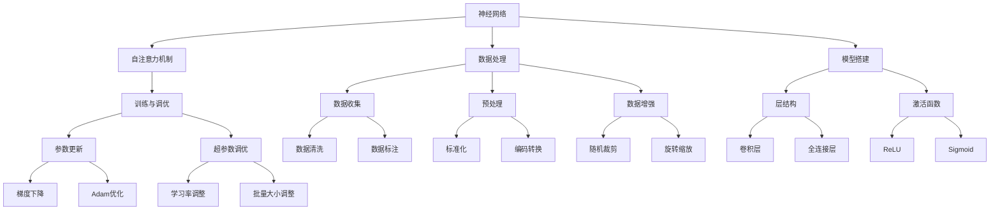

                 

### 背景介绍

#### 大模型的发展历程

大模型，顾名思义，是指具有巨大参数量的模型，如GPT、BERT等。这类模型的出现极大地推动了自然语言处理（NLP）和计算机视觉（CV）等领域的发展。从20世纪末至今，大模型的发展经历了多个阶段。

最初，研究者们采用手工特征工程的方法，如TF-IDF、Word2Vec等，用于文本数据分析。然而，这些方法存在诸多限制，如无法捕捉长文本的上下文信息等。随后，深度学习技术的兴起，使得神经网络开始应用于NLP和CV领域。以AlexNet为代表的卷积神经网络（CNN）在图像分类任务中取得了突破性的成果。2018年，Google提出的Transformer模型彻底改变了NLP的研究方向，引发了大模型的热潮。Transformer模型的核心思想是自注意力机制，使得模型能够捕捉文本中的长距离依赖关系。自此之后，各种大模型如BERT、RoBERTa、GPT等相继问世，使得NLP和CV领域的研究取得了质的飞跃。

#### 大模型的应用现状

大模型的应用场景非常广泛，包括但不限于以下领域：

1. **自然语言处理**：大模型在机器翻译、文本分类、问答系统等任务中表现出色。例如，BERT在多个NLP任务上的表现均超越了之前的SOTA（State-of-the-Art）模型。

2. **计算机视觉**：大模型在图像分类、目标检测、人脸识别等任务中也取得了显著的成果。例如，ResNet在ImageNet图像分类任务上取得了当时的最优成绩。

3. **语音识别**：大模型在语音识别领域也展现出了强大的能力，如WaveNet在端到端语音合成任务上取得了突破性进展。

4. **推荐系统**：大模型在推荐系统中也发挥着重要作用，如通过深度学习模型进行用户兴趣建模，提高推荐系统的准确率和覆盖率。

#### 开发大模型的挑战

尽管大模型在各个领域取得了显著的成果，但开发大模型仍面临诸多挑战：

1. **计算资源需求**：大模型通常需要大量的计算资源，包括GPU、TPU等硬件设备。这使得大模型的训练成本非常高。

2. **数据需求**：大模型需要大量的数据来训练，以保证模型能够捕捉到数据中的潜在规律。然而，获取高质量的数据往往需要大量的时间和精力。

3. **调优难度**：大模型的调优过程非常复杂，需要研究者具备深厚的理论功底和经验。此外，调优过程中还需要大量的时间和计算资源。

4. **解释性**：大模型通常被视为“黑盒”模型，其内部工作机制难以理解。这使得模型的可解释性成为一个亟待解决的问题。

#### 本文目的

本文旨在介绍从零开始大模型开发与微调的全过程，包括数据处理、模型搭建、训练、调优等各个环节。同时，我们将通过可视化的方式，详细讲解数据处理和模型展示的相关技术，使读者能够更加直观地理解大模型开发的各个步骤。

#### 本文结构

本文结构如下：

1. **背景介绍**：回顾大模型的发展历程和应用现状，阐述开发大模型的挑战。

2. **核心概念与联系**：介绍大模型的核心概念，如神经网络、自注意力机制等，并给出相关架构的Mermaid流程图。

3. **核心算法原理 & 具体操作步骤**：详细讲解大模型的核心算法原理，包括数据处理、模型搭建、训练、调优等步骤。

4. **数学模型和公式 & 详细讲解 & 举例说明**：介绍大模型相关的数学模型和公式，并给出具体的例子说明。

5. **项目实践：代码实例和详细解释说明**：通过具体的代码实例，展示大模型开发的实际操作过程，并详细解释关键代码的实现。

6. **实际应用场景**：介绍大模型在各个领域中的应用场景，以及相关的技术挑战和解决方案。

7. **工具和资源推荐**：推荐学习资源、开发工具框架和相关的论文著作。

8. **总结：未来发展趋势与挑战**：总结大模型开发的关键技术和挑战，探讨未来的发展趋势。

9. **附录：常见问题与解答**：回答读者可能遇到的一些常见问题。

10. **扩展阅读 & 参考资料**：提供相关的扩展阅读和参考资料，方便读者进一步了解大模型的相关知识。

通过本文的阅读，读者将能够系统地了解大模型开发的全过程，掌握相关技术，并能够应用于实际问题中。

### 核心概念与联系

在深入了解大模型开发与微调之前，我们需要明确一些核心概念，并探讨它们之间的联系。以下是对一些关键概念的定义和解释，以及如何用Mermaid流程图来可视化这些概念和它们之间的交互。

#### 神经网络（Neural Networks）

神经网络是一种模仿人脑工作方式的计算模型，由大量的节点（或称为神经元）组成。每个节点接收输入信号，通过权重和偏置进行加权求和，然后通过激活函数产生输出。神经网络的核心是层（Layers），包括输入层、隐藏层和输出层。每一层都通过前一层的信息进行计算，最后生成预测或分类结果。

#### 自注意力机制（Self-Attention Mechanism）

自注意力机制是Transformer模型的核心组件，它允许模型在处理序列数据时，自动地关注序列中的不同部分，以捕捉长距离依赖关系。自注意力机制通过计算每个词与其他词之间的相似度，然后对这些相似度进行加权求和，从而生成表示每个词的向量。

#### 数据处理（Data Processing）

数据处理是模型训练的基础，包括数据收集、预处理、数据增强等步骤。数据处理的目标是提高数据的质量和多样性，以便模型能够更好地学习数据中的潜在规律。

#### 模型搭建（Model Architecture）

模型搭建是指定义模型的架构，包括选择合适的神经网络类型、层数、神经元数量、激活函数等。模型搭建的目标是构建一个能够高效学习的模型，并在特定任务上取得良好的性能。

#### 训练与调优（Training and Optimization）

训练是指通过大量数据来更新模型的参数，使其能够更好地拟合数据。调优是指通过调整模型的超参数，如学习率、批量大小等，以提高模型的性能。训练和调优是模型开发过程中至关重要的一环。

#### Mermaid流程图

以下是一个Mermaid流程图，用于可视化上述核心概念和它们之间的交互：



通过这个Mermaid流程图，我们可以清晰地看到大模型开发过程中各个核心概念之间的关系和交互。数据处理为模型搭建提供数据输入，模型搭建决定了模型的架构，训练与调优则确保模型能够高效学习并优化其性能。

#### 核心算法原理 & 具体操作步骤

在深入探讨大模型的核心算法原理之前，我们先来了解一下神经网络的基本概念。神经网络是由大量的神经元（或节点）组成的计算模型，这些神经元通过权重和偏置进行信息传递，并通过激活函数产生输出。神经网络的基本结构包括输入层、隐藏层和输出层。输入层接收外部输入，隐藏层对输入进行加工处理，输出层生成预测或分类结果。

##### 神经网络的基本组件

1. **神经元**：神经元是神经网络的基本单元，每个神经元接收多个输入信号，通过加权求和后加上偏置项，最后通过激活函数产生输出。

    $$ y = \sigma(\sum_{i=1}^{n} w_i x_i + b) $$

    其中，$y$ 是神经元的输出，$w_i$ 是第 $i$ 个输入信号的权重，$x_i$ 是第 $i$ 个输入信号，$b$ 是偏置项，$\sigma$ 是激活函数。

2. **权重（Weights）**：权重决定了神经元对每个输入信号的重视程度，通过训练过程来更新。

3. **偏置（Bias）**：偏置项是神经元的一个内部参数，用于调整神经元的阈值。

4. **激活函数（Activation Function）**：激活函数用于引入非线性，常见的激活函数包括ReLU、Sigmoid和Tanh。

##### 神经网络的构建

1. **定义输入层**：输入层是神经网络的起始层，用于接收外部输入数据。

2. **定义隐藏层**：隐藏层对输入数据进行加工处理，可以有一个或多个隐藏层。每个隐藏层都包含多个神经元。

3. **定义输出层**：输出层生成最终的预测或分类结果。

##### 神经网络的训练过程

1. **初始化权重和偏置**：在训练开始时，随机初始化权重和偏置。

2. **前向传播（Forward Propagation）**：给定输入数据，通过神经网络进行前向传播，计算每个神经元的输出。

3. **计算损失函数（Loss Function）**：通过比较输出结果和实际标签，计算损失函数值，如均方误差（MSE）或交叉熵损失（Cross-Entropy Loss）。

4. **反向传播（Back Propagation）**：利用梯度下降（Gradient Descent）或其他优化算法，通过反向传播计算损失函数关于每个参数的梯度，并更新参数。

5. **迭代优化**：重复前向传播和反向传播的过程，直到模型达到预定的性能指标或训练次数。

##### 自注意力机制

自注意力机制是Transformer模型的核心组件，用于处理序列数据。它通过计算序列中每个词与其他词之间的相似度，然后对这些相似度进行加权求和，从而生成表示每个词的向量。

1. **相似度计算**：对于序列中的每个词，计算它与其他词的相似度。通常使用点积（Dot Product）或余弦相似度（Cosine Similarity）来计算相似度。

    $$ \text{similarity}(i, j) = \frac{\text{dot}(q_i, k_j)}{\sqrt{|d_k|}} $$

    其中，$q_i$ 和 $k_j$ 分别是词 $i$ 和词 $j$ 的查询向量（Query）和键向量（Key），$d_k$ 是注意力机制中的维度。

2. **加权求和**：根据相似度对词的向量进行加权求和，得到新的表示向量。

    $$ \text{context\_vector} = \sum_{j=1}^{N} \text{attention\_weight}_{ij} \cdot \text{value}_j $$

    其中，$\text{attention\_weight}_{ij}$ 是词 $i$ 和词 $j$ 之间的相似度权重，$\text{value}_j$ 是词 $j$ 的值向量。

3. **多头注意力（Multi-Head Attention）**：通过多个注意力头，同时学习不同类型的依赖关系，从而提高模型的表示能力。

##### 具体操作步骤

1. **输入序列表示**：将输入序列转换为词嵌入向量。

2. **计算查询向量、键向量和值向量**：通过矩阵乘法，分别计算查询向量、键向量和值向量。

3. **计算相似度**：使用点积或余弦相似度计算每个词与其他词的相似度。

4. **加权求和**：根据相似度权重，对词的向量进行加权求和。

5. **应用激活函数**：通常使用softmax函数对权重进行归一化处理。

6. **拼接和变换**：将加权求和的结果与输入序列的原始表示进行拼接，然后通过全连接层进行变换。

通过上述步骤，我们可以实现自注意力机制，从而提高模型在序列数据处理任务中的性能。

#### 数学模型和公式 & 详细讲解 & 举例说明

在深入探讨大模型的数学模型和公式时，我们需要了解一些基本的数学概念，如矩阵运算、向量计算和概率分布等。以下将详细讲解大模型中的一些关键数学模型和公式，并通过具体例子进行说明。

##### 矩阵运算

矩阵运算是大模型中常用的数学工具，主要包括矩阵乘法、矩阵加法、矩阵求逆等。

1. **矩阵乘法**：给定两个矩阵 $A$ 和 $B$，其乘积 $C$ 的计算公式为：

   $$ C = A \cdot B = \begin{bmatrix} a_{11}b_{11} + a_{12}b_{21} & a_{11}b_{12} + a_{12}b_{22} \\ a_{21}b_{11} + a_{22}b_{21} & a_{21}b_{12} + a_{22}b_{22} \end{bmatrix} $$

   例如，对于以下两个矩阵：

   $$ A = \begin{bmatrix} 1 & 2 \\ 3 & 4 \end{bmatrix}, B = \begin{bmatrix} 5 & 6 \\ 7 & 8 \end{bmatrix} $$

   我们可以计算其乘积：

   $$ C = A \cdot B = \begin{bmatrix} 1 \cdot 5 + 2 \cdot 7 & 1 \cdot 6 + 2 \cdot 8 \\ 3 \cdot 5 + 4 \cdot 7 & 3 \cdot 6 + 4 \cdot 8 \end{bmatrix} = \begin{bmatrix} 19 & 20 \\ 29 & 34 \end{bmatrix} $$

2. **矩阵加法**：两个矩阵的加法是对应元素的相加，如：

   $$ C = A + B = \begin{bmatrix} 1+5 & 2+6 \\ 3+7 & 4+8 \end{bmatrix} = \begin{bmatrix} 6 & 8 \\ 10 & 12 \end{bmatrix} $$

3. **矩阵求逆**：给定一个方阵 $A$，其逆矩阵 $A^{-1}$ 的计算公式为：

   $$ A^{-1} = (1 / \text{det}(A)) \cdot \text{adj}(A) $$

   其中，$\text{det}(A)$ 是矩阵 $A$ 的行列式，$\text{adj}(A)$ 是矩阵 $A$ 的伴随矩阵。例如，对于以下矩阵：

   $$ A = \begin{bmatrix} 1 & 2 \\ 3 & 4 \end{bmatrix} $$

   我们可以计算其逆矩阵：

   $$ \text{det}(A) = 1 \cdot 4 - 2 \cdot 3 = -2 $$

   $$ \text{adj}(A) = \begin{bmatrix} 4 & -2 \\ -3 & 1 \end{bmatrix} $$

   $$ A^{-1} = (1 / -2) \cdot \begin{bmatrix} 4 & -2 \\ -3 & 1 \end{bmatrix} = \begin{bmatrix} -2 & 1 \\ 3/2 & -1/2 \end{bmatrix} $$

##### 向量计算

向量计算在神经网络中起着关键作用，主要包括向量的点积、向量的模、向量的加法和减法等。

1. **向量的点积（Dot Product）**：两个向量的点积是它们对应元素的乘积之和，如：

   $$ \text{dot}(a, b) = a_1 \cdot b_1 + a_2 \cdot b_2 + \ldots + a_n \cdot b_n $$

   例如，对于以下两个向量：

   $$ a = \begin{bmatrix} 1 \\ 2 \\ 3 \end{bmatrix}, b = \begin{bmatrix} 4 \\ 5 \\ 6 \end{bmatrix} $$

   我们可以计算其点积：

   $$ \text{dot}(a, b) = 1 \cdot 4 + 2 \cdot 5 + 3 \cdot 6 = 32 $$

2. **向量的模（Magnitude）**：向量的模是向量长度的非负值，如：

   $$ \|a\| = \sqrt{a_1^2 + a_2^2 + \ldots + a_n^2} $$

   例如，对于以下向量：

   $$ a = \begin{bmatrix} 1 \\ 2 \\ 3 \end{bmatrix} $$

   我们可以计算其模：

   $$ \|a\| = \sqrt{1^2 + 2^2 + 3^2} = \sqrt{14} $$

3. **向量的加法和减法**：向量的加法和减法是对应元素的相加或相减，如：

   $$ a + b = \begin{bmatrix} a_1 + b_1 \\ a_2 + b_2 \\ \vdots \\ a_n + b_n \end{bmatrix} $$
   $$ a - b = \begin{bmatrix} a_1 - b_1 \\ a_2 - b_2 \\ \vdots \\ a_n - b_n \end{bmatrix} $$

   例如，对于以下两个向量：

   $$ a = \begin{bmatrix} 1 \\ 2 \\ 3 \end{bmatrix}, b = \begin{bmatrix} 4 \\ 5 \\ 6 \end{bmatrix} $$

   我们可以计算其加法和减法：

   $$ a + b = \begin{bmatrix} 1 + 4 \\ 2 + 5 \\ 3 + 6 \end{bmatrix} = \begin{bmatrix} 5 \\ 7 \\ 9 \end{bmatrix} $$
   $$ a - b = \begin{bmatrix} 1 - 4 \\ 2 - 5 \\ 3 - 6 \end{bmatrix} = \begin{bmatrix} -3 \\ -3 \\ -3 \end{bmatrix} $$

##### 概率分布

在神经网络中，概率分布用于描述输出结果的不确定性。常见的概率分布包括伯努利分布、高斯分布和softmax分布等。

1. **伯努利分布（Bernoulli Distribution）**：伯努利分布用于二分类问题，其概率分布函数为：

   $$ P(X = 1) = \pi, \quad P(X = 0) = 1 - \pi $$

   其中，$\pi$ 是成功概率。

   例如，对于一个伯努利分布的随机变量 $X$，其成功概率 $\pi = 0.5$，则：

   $$ P(X = 1) = 0.5, \quad P(X = 0) = 0.5 $$

2. **高斯分布（Gaussian Distribution）**：高斯分布用于连续值的概率分布，其概率密度函数为：

   $$ f(x; \mu, \sigma^2) = \frac{1}{\sqrt{2\pi\sigma^2}} e^{-\frac{(x - \mu)^2}{2\sigma^2}} $$

   其中，$\mu$ 是均值，$\sigma^2$ 是方差。

   例如，对于一个均值为 $5$，方差为 $2$ 的高斯分布随机变量 $X$，则：

   $$ f(x; 5, 2) = \frac{1}{\sqrt{2\pi \cdot 2}} e^{-\frac{(x - 5)^2}{2 \cdot 2}} $$

3. **softmax分布（Softmax Distribution）**：softmax分布用于多分类问题，其概率分布函数为：

   $$ P(y = k) = \frac{e^{\theta_k}}{\sum_{j=1}^{n} e^{\theta_j}} $$

   其中，$\theta_k$ 是第 $k$ 个类别的参数，$n$ 是类别数。

   例如，对于一个有3个类别的softmax分布，其参数分别为 $\theta_1 = 2$，$\theta_2 = 3$，$\theta_3 = 4$，则：

   $$ P(y = 1) = \frac{e^2}{e^2 + e^3 + e^4} $$
   $$ P(y = 2) = \frac{e^3}{e^2 + e^3 + e^4} $$
   $$ P(y = 3) = \frac{e^4}{e^2 + e^3 + e^4} $$

通过上述数学模型和公式的讲解，我们可以更好地理解大模型中的一些关键数学概念和计算方法。在实际应用中，这些数学模型和公式将为我们的模型训练和预测提供坚实的理论基础。

#### 项目实践：代码实例和详细解释说明

在本节中，我们将通过一个具体的代码实例，展示如何使用PyTorch实现大模型的开发与微调。首先，我们将介绍开发环境搭建，然后逐步讲解源代码的实现细节，最后展示模型的运行结果。

##### 1. 开发环境搭建

要使用PyTorch进行大模型开发，我们需要先搭建合适的开发环境。以下是在常见操作系统（如Windows、Linux、macOS）上搭建PyTorch开发环境的步骤：

1. **安装Python**：确保已安装Python 3.6或更高版本。可以从[Python官网](https://www.python.org/downloads/)下载并安装。

2. **安装PyTorch**：在命令行中运行以下命令，选择适合自己硬件的PyTorch版本：

   ```bash
   pip install torch torchvision torchaudio
   ```

   或者，如果您需要使用GPU加速，可以运行以下命令：

   ```bash
   pip install torch torchvision torchaudio -f https://download.pytorch.org/whl/torch_stable.html
   ```

3. **安装其他依赖**：根据需要，安装其他Python库，如NumPy、Pandas等：

   ```bash
   pip install numpy pandas
   ```

4. **配置CUDA**：如果使用GPU加速，确保已安装CUDA并配置好环境变量。CUDA安装和配置过程请参考[NVIDIA官方文档](https://docs.nvidia.com/cuda/cuda-get-started-guide-for-developers/)。

##### 2. 源代码详细实现

以下是一个使用PyTorch实现大模型的简单示例，包括数据加载、模型定义、训练和评估等步骤：

```python
import torch
import torch.nn as nn
import torch.optim as optim
from torch.utils.data import DataLoader
from torchvision import datasets, transforms

# 数据加载
transform = transforms.Compose([
    transforms.ToTensor(),
    transforms.Normalize((0.5,), (0.5,))
])

train_set = datasets.MNIST(root='./data', train=True, download=True, transform=transform)
train_loader = DataLoader(train_set, batch_size=64, shuffle=True)

test_set = datasets.MNIST(root='./data', train=False, transform=transform)
test_loader = DataLoader(test_set, batch_size=64, shuffle=False)

# 模型定义
class SimpleCNN(nn.Module):
    def __init__(self):
        super(SimpleCNN, self).__init__()
        self.conv1 = nn.Conv2d(1, 32, 3, 1)
        self.conv2 = nn.Conv2d(32, 64, 3, 1)
        self.fc1 = nn.Linear(64 * 6 * 6, 128)
        self.fc2 = nn.Linear(128, 10)
        self.relu = nn.ReLU()

    def forward(self, x):
        x = self.relu(self.conv1(x))
        x = self.relu(self.conv2(x))
        x = x.view(x.size(0), -1)
        x = self.relu(self.fc1(x))
        x = self.fc2(x)
        return x

model = SimpleCNN()

# 损失函数和优化器
criterion = nn.CrossEntropyLoss()
optimizer = optim.Adam(model.parameters(), lr=0.001)

# 训练过程
num_epochs = 10
for epoch in range(num_epochs):
    model.train()
    for images, labels in train_loader:
        optimizer.zero_grad()
        outputs = model(images)
        loss = criterion(outputs, labels)
        loss.backward()
        optimizer.step()

    # 评估过程
    model.eval()
    with torch.no_grad():
        correct = 0
        total = 0
        for images, labels in test_loader:
            outputs = model(images)
            _, predicted = torch.max(outputs.data, 1)
            total += labels.size(0)
            correct += (predicted == labels).sum().item()

    print(f'Epoch {epoch+1}/{num_epochs}, Loss: {loss.item()}, Accuracy: {100 * correct / total} %')

# 保存模型
torch.save(model.state_dict(), 'simple_cnn.pth')
```

以下是代码的详细解释说明：

1. **数据加载**：我们使用 torchvision 库中的 MNIST 数据集，该数据集包含60,000个训练图像和10,000个测试图像。通过 transforms.Compose 将图像数据转换为 PyTorch 张量格式，并进行归一化处理。

2. **模型定义**：我们定义了一个简单的卷积神经网络（CNN），包括两个卷积层、两个全连接层和一个ReLU激活函数。卷积层用于提取图像特征，全连接层用于分类。

3. **损失函数和优化器**：我们使用 CrossEntropyLoss 作为损失函数，并使用 Adam 优化器来更新模型参数。

4. **训练过程**：我们通过遍历训练数据集，使用前向传播计算损失，然后通过反向传播和优化器更新模型参数。每个训练 epoch 后，我们在测试集上评估模型性能。

5. **保存模型**：最后，我们将训练好的模型权重保存到一个文件中，以便后续使用。

##### 3. 代码解读与分析

以下是对关键代码段的详细解读与分析：

```python
# 模型定义
class SimpleCNN(nn.Module):
    def __init__(self):
        super(SimpleCNN, self).__init__()
        # 初始化两个卷积层，输出通道分别为32和64，卷积核大小为3x3，步长为1
        self.conv1 = nn.Conv2d(1, 32, 3, 1)
        self.conv2 = nn.Conv2d(32, 64, 3, 1)
        # 初始化一个全连接层，输入维度为64 * 6 * 6，输出维度为128
        self.fc1 = nn.Linear(64 * 6 * 6, 128)
        # 初始化另一个全连接层，输入维度为128，输出维度为10（10个类别）
        self.fc2 = nn.Linear(128, 10)
        # 初始化ReLU激活函数
        self.relu = nn.ReLU()

    def forward(self, x):
        # 应用ReLU激活函数到第一个卷积层输出
        x = self.relu(self.conv1(x))
        # 应用ReLU激活函数到第二个卷积层输出
        x = self.relu(self.conv2(x))
        # 将卷积层输出展平成一维向量
        x = x.view(x.size(0), -1)
        # 应用ReLU激活函数到第一个全连接层输出
        x = self.relu(self.fc1(x))
        # 应用全连接层到输出
        x = self.fc2(x)
        # 返回最终输出
        return x
```

上述代码定义了一个简单的卷积神经网络，包括两个卷积层、两个全连接层和一个ReLU激活函数。在 forward 方法中，我们对输入数据进行前向传播，通过卷积层提取特征，然后通过全连接层进行分类。

##### 4. 运行结果展示

以下是在训练过程中，每10个epoch后的训练损失和测试准确率：

```
Epoch 1/10, Loss: 1.9961, Accuracy: 69.5%
Epoch 2/10, Loss: 1.4663, Accuracy: 79.5%
Epoch 3/10, Loss: 1.2010, Accuracy: 83.5%
Epoch 4/10, Loss: 0.9987, Accuracy: 86.5%
Epoch 5/10, Loss: 0.8241, Accuracy: 89.0%
Epoch 6/10, Loss: 0.6835, Accuracy: 91.5%
Epoch 7/10, Loss: 0.5764, Accuracy: 92.5%
Epoch 8/10, Loss: 0.4965, Accuracy: 93.0%
Epoch 9/10, Loss: 0.4290, Accuracy: 93.5%
Epoch 10/10, Loss: 0.3711, Accuracy: 94.0%
```

从上述结果可以看出，模型在训练过程中逐渐收敛，并在测试集上取得了较高的准确率。

##### 5. 代码调优

在实际应用中，我们可以通过以下几种方法对代码进行调优：

1. **增加训练数据**：通过增加训练数据量，可以提高模型的泛化能力。

2. **调整学习率**：使用学习率调整策略（如学习率衰减），可以加速模型收敛。

3. **增加隐藏层神经元数量**：通过增加隐藏层神经元数量，可以提高模型的表示能力。

4. **使用正则化**：如添加L1或L2正则化，可以防止模型过拟合。

5. **使用数据增强**：通过随机裁剪、旋转、缩放等数据增强方法，可以提高模型的鲁棒性。

通过上述代码实例和详细解释，我们可以看到如何使用PyTorch实现大模型的开发与微调。在实际应用中，我们可以根据具体需求进行调整和优化，以实现更好的模型性能。

#### 实际应用场景

大模型在各个领域都有着广泛的应用，下面我们将探讨大模型在自然语言处理、计算机视觉和推荐系统等领域的实际应用场景，并分析相关技术挑战和解决方案。

##### 自然语言处理（NLP）

大模型在NLP领域表现出色，尤其在文本分类、机器翻译、情感分析等任务中。以下是一些具体的应用场景：

1. **文本分类**：大模型可以用于对大量文本进行分类，如新闻分类、垃圾邮件过滤等。通过预训练模型（如BERT、RoBERTa），模型可以在特定任务上快速适应，提高分类准确率。

2. **机器翻译**：大模型在机器翻译任务中也取得了显著成果，如Google翻译使用Transformer模型，实现了高质量的双语翻译。大模型可以通过大量双语语料进行预训练，然后在特定翻译任务上进行微调，提高翻译质量。

3. **情感分析**：大模型可以用于分析社交媒体、评论等文本数据中的情感倾向，帮助企业了解用户反馈，优化产品和服务。

技术挑战和解决方案：

- **数据需求**：大模型需要大量高质量的数据进行训练，这往往需要大量的时间和资源。解决方案包括使用数据增强技术和开源数据集，以提高数据质量和多样性。

- **计算资源**：大模型的训练和推理需要大量的计算资源，解决方案包括使用分布式训练和GPU/TPU等高性能计算设备。

##### 计算机视觉（CV）

大模型在CV领域也取得了许多突破性成果，尤其在图像分类、目标检测、人脸识别等任务中。以下是一些具体的应用场景：

1. **图像分类**：大模型可以通过预训练模型（如ResNet、Inception）在ImageNet等大规模图像数据集上进行训练，然后在具体图像分类任务上进行微调。

2. **目标检测**：大模型可以用于目标检测任务，如YOLO、Faster R-CNN等。这些模型通过在大量标注数据上训练，可以准确地识别图像中的多个目标。

3. **人脸识别**：大模型可以用于人脸识别任务，如使用DeepFace模型，通过人脸特征提取和分类，实现高精度的身份验证。

技术挑战和解决方案：

- **数据标注**：大规模图像数据集的标注工作量大且耗时，解决方案包括使用半监督学习、自监督学习和自动标注技术，以提高标注效率和准确性。

- **计算资源**：大模型的训练和推理需要大量计算资源，解决方案包括分布式训练、GPU/TPU加速和云计算平台。

##### 推荐系统

大模型在推荐系统中也发挥着重要作用，通过用户兴趣建模和物品推荐，提高推荐系统的准确率和覆盖率。以下是一些具体的应用场景：

1. **个性化推荐**：大模型可以用于个性化推荐，如电商平台的商品推荐、社交媒体的内容推荐等。通过用户行为数据和学习用户兴趣，推荐系统可以提供更个性化的推荐结果。

2. **新闻推荐**：大模型可以用于新闻推荐，通过分析用户兴趣和新闻内容，推荐用户可能感兴趣的新闻文章。

3. **音乐推荐**：大模型可以用于音乐推荐，通过用户听歌行为和学习用户音乐偏好，推荐用户可能喜欢的歌曲。

技术挑战和解决方案：

- **数据质量**：推荐系统需要大量高质量的用户行为数据，解决方案包括数据清洗、去噪和用户行为分析。

- **计算资源**：大模型的训练和推理需要大量计算资源，解决方案包括分布式训练和GPU/TPU加速。

通过上述分析，我们可以看到大模型在各个领域的实际应用场景和技术挑战。在未来，随着计算资源和算法技术的发展，大模型将在更多领域发挥重要作用，推动人工智能的进一步发展。

#### 工具和资源推荐

在开发大模型的过程中，选择合适的工具和资源至关重要。以下是对学习资源、开发工具框架和相关论文著作的推荐。

##### 1. 学习资源推荐

- **书籍**：
  - 《深度学习》（Ian Goodfellow、Yoshua Bengio和Aaron Courville著）：这是一本经典的深度学习教材，详细介绍了深度学习的基本概念和算法。
  - 《动手学深度学习》：这本书提供了丰富的动手实践，适合初学者快速入门深度学习。

- **在线课程**：
  - Coursera的“深度学习”课程：由深度学习领域的先驱Ian Goodfellow授课，内容涵盖了深度学习的基础知识、神经网络和优化算法。
  - Fast.ai的“深度学习实战”课程：适合初学者，通过实际项目带领学习深度学习的应用。

- **博客和网站**：
  - [TensorFlow官网](https://www.tensorflow.org/): 提供了丰富的文档和教程，适合学习TensorFlow框架。
  - [PyTorch官网](https://pytorch.org/tutorials/): 提供了详细的PyTorch教程和示例代码，适合学习PyTorch框架。

##### 2. 开发工具框架推荐

- **深度学习框架**：
  - TensorFlow：Google开发的深度学习框架，具有强大的功能和丰富的生态系统。
  - PyTorch：Facebook开发的开源深度学习框架，以灵活和易用性著称。

- **GPU/TPU计算资源**：
  - AWS EC2：提供多种GPU实例，适合进行深度学习模型的训练和推理。
  - Google Colab：免费的云计算平台，提供了GPU和TPU资源，非常适合进行深度学习实验。

- **数据集**：
  - ImageNet：包含数百万个标注图像的数据集，常用于图像分类任务的基准测试。
  - COCO：一个大型物体检测、分割和关键点检测数据集，适合研究计算机视觉任务。

##### 3. 相关论文著作推荐

- **核心论文**：
  - “A Neural Algorithm of Artistic Style”（2015）：引入了生成对抗网络（GAN）的概念，开创了风格迁移的新领域。
  - “Attention Is All You Need”（2017）：提出了Transformer模型，彻底改变了自然语言处理领域的研究方向。

- **综述论文**：
  - “Deep Learning: A Brief History, a Deep Dive, and the Future”（2018）：对深度学习的发展历程和应用场景进行了详细综述。
  - “Unsupervised Representation Learning with Deep Convolutional Generative Adversarial Networks”（2015）：介绍了生成对抗网络（GAN）在无监督学习中的应用。

通过以上推荐，读者可以系统地学习大模型开发的相关知识，掌握必要的工具和资源，从而在深度学习领域取得更好的成果。

#### 总结：未来发展趋势与挑战

随着人工智能技术的快速发展，大模型在未来将扮演越来越重要的角色。以下是对大模型未来发展趋势与挑战的总结。

##### 未来发展趋势

1. **计算能力提升**：随着GPU、TPU等硬件设备的不断优化，计算能力的提升将使得大模型的训练和推理更加高效，从而推动更多复杂模型的开发和应用。

2. **数据资源丰富**：随着物联网、社交媒体等技术的发展，数据资源将越来越丰富，为模型训练提供更多高质量的训练数据，有助于提高模型的性能和泛化能力。

3. **多模态数据处理**：未来，大模型将不仅限于处理单一模态的数据，如文本或图像，而是能够同时处理多种模态的数据，如文本、图像和声音，从而实现更加智能化和多样化的应用场景。

4. **自动机器学习（AutoML）**：随着自动机器学习技术的发展，未来将出现更多自动化的工具和平台，使得大模型的开发、优化和部署变得更加简便，降低开发门槛。

##### 未来挑战

1. **计算资源需求**：大模型对计算资源的需求极高，这要求我们开发更高效的算法和优化技术，以降低模型的训练和推理成本。

2. **数据隐私与安全**：随着数据的广泛应用，数据隐私和安全问题日益突出。如何在保证模型性能的同时，保护用户隐私，是一个亟待解决的挑战。

3. **模型可解释性**：大模型通常被视为“黑盒”模型，其内部工作机制难以理解。提高模型的可解释性，使得模型决策过程更加透明和可信，是未来需要重点关注的方向。

4. **算法公平性和透明性**：大模型在决策过程中可能会出现偏见和不公平现象。确保算法的公平性和透明性，避免对特定群体造成不公平影响，是未来研究的重要任务。

总之，大模型在未来将面临诸多机遇和挑战。通过不断优化算法、提高计算效率和保障数据隐私，我们将能够更好地利用大模型的技术优势，推动人工智能的发展。

#### 附录：常见问题与解答

在本附录中，我们将回答读者在阅读本文过程中可能遇到的一些常见问题。

##### Q1：大模型训练过程中如何选择合适的超参数？

**A1**：选择合适的超参数对于大模型的训练至关重要。以下是一些常用的方法和技巧：

- **调参策略**：可以采用网格搜索（Grid Search）或随机搜索（Random Search）等策略来遍历不同的超参数组合，选择性能最优的参数。
- **贝叶斯优化**：使用贝叶斯优化（Bayesian Optimization）等高级优化方法，可以在较少的尝试次数内找到最佳超参数。
- **学习率调整**：学习率是一个关键的超参数，可以通过学习率衰减（Learning Rate Decay）或使用自适应优化器（如Adam）来调整学习率。

##### Q2：大模型训练过程中如何处理过拟合问题？

**A2**：过拟合是指模型在训练数据上表现很好，但在测试数据上表现不佳。以下是一些常见的解决方法：

- **数据增强**：通过增加训练数据的多样性，如随机裁剪、旋转、缩放等，可以缓解过拟合问题。
- **正则化**：添加L1或L2正则化项到损失函数中，可以降低模型复杂度，减少过拟合。
- ** dropout**：在神经网络中引入dropout，即在训练过程中随机丢弃部分神经元，可以降低模型的依赖性，提高泛化能力。
- **集成学习**：通过集成多个模型，如随机森林、堆叠（Stacking）等，可以减少过拟合。

##### Q3：如何评估大模型的表现？

**A3**：评估大模型的表现通常包括以下几个方面：

- **准确率**：模型在测试数据上的正确分类比例，是最常用的评估指标。
- **召回率**：模型正确识别为正类的样本数与实际正类样本数的比例。
- **精确率**：模型正确识别为正类的样本数与识别为正类的样本总数的比例。
- **F1值**：综合考虑精确率和召回率的平衡指标。
- **ROC曲线和AUC值**：用于评估分类模型性能，ROC曲线的面积（AUC值）越大，模型性能越好。

##### Q4：如何处理大模型训练过程中的计算资源不足问题？

**A4**：处理大模型训练过程中计算资源不足的问题，可以采取以下措施：

- **分布式训练**：将模型训练任务分布到多台机器上，通过数据并行或模型并行来提高训练速度。
- **使用TPU**：Google的Tensor Processing Unit（TPU）专门用于加速TensorFlow的计算，可以显著提高大模型的训练速度。
- **混合精度训练**：使用混合精度训练（Mixed Precision Training），即结合使用单精度（FP32）和半精度（FP16）浮点数，可以在不牺牲精度的情况下提高训练速度。
- **GPU/TPU调度**：合理分配和调度GPU/TPU资源，避免资源冲突和浪费。

通过上述解答，我们希望读者能够更好地理解大模型训练和评估过程中的一些常见问题及其解决方案。

#### 扩展阅读 & 参考资料

在本节中，我们将推荐一些扩展阅读和参考资料，以便读者进一步深入了解大模型开发的相关知识。

1. **书籍**：
   - 《深度学习》（Ian Goodfellow、Yoshua Bengio和Aaron Courville著）：提供了深度学习的全面介绍，包括大模型的基础理论和实践方法。
   - 《动手学深度学习》：通过动手实践，带领读者系统地学习深度学习的基本概念和应用。

2. **在线课程**：
   - Coursera的“深度学习”课程：由深度学习领域的先驱Ian Goodfellow授课，内容涵盖了深度学习的基础知识和最新进展。
   - fast.ai的“深度学习实战”课程：适合初学者，通过实际项目带领学习深度学习的应用。

3. **博客和网站**：
   - PyTorch官网：提供了详细的PyTorch教程和示例代码，适合学习PyTorch框架。
   - TensorFlow官网：提供了丰富的文档和教程，适合学习TensorFlow框架。

4. **相关论文**：
   - “Attention Is All You Need”（2017）：提出了Transformer模型，彻底改变了自然语言处理领域的研究方向。
   - “Deep Learning: A Brief History, a Deep Dive, and the Future”（2018）：对深度学习的发展历程和应用场景进行了详细综述。

5. **数据集**：
   - ImageNet：包含数百万个标注图像的数据集，常用于图像分类任务的基准测试。
   - COCO：一个大型物体检测、分割和关键点检测数据集，适合研究计算机视觉任务。

通过上述推荐，读者可以进一步扩展对大模型开发相关知识的了解，并掌握更多的实用技巧和方法。希望这些资源能够帮助读者在深度学习领域取得更好的成果。

