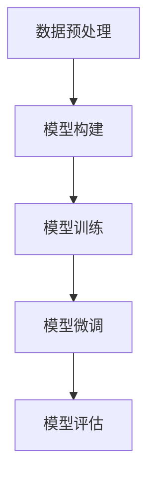
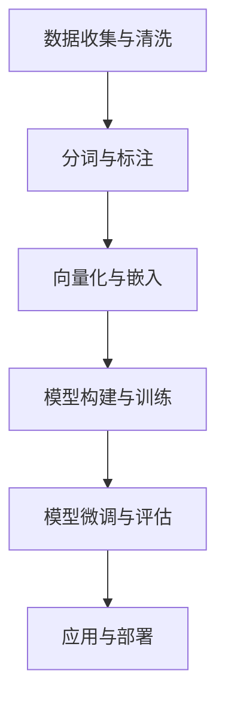
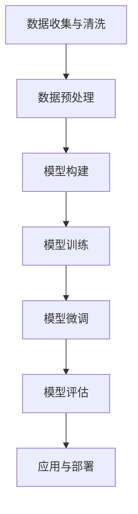

                 

### 从零开始大模型开发与微调：汉字的文本处理

#### 关键词 Keywords
- 大模型开发
- 微调
- 汉字文本处理
- 自然语言处理
- 计算机学习
- 数据预处理
- 优化算法
- 评价指标

#### 摘要 Abstract
本文旨在从零开始，详细探讨大模型的开发与微调过程，特别是在汉字文本处理中的应用。通过深入分析核心概念、算法原理、数学模型，以及项目实践，本文将展示如何使用现代技术和工具，开发出一个高效、准确的大模型，实现汉字文本的智能处理。

## 1. 背景介绍

### 1.1 大模型的发展与需求

近年来，随着计算能力的提升和海量数据资源的积累，大模型在自然语言处理（NLP）、计算机视觉（CV）等领域取得了显著的进展。这些大模型，如Transformer、BERT等，展现了强大的表征能力和泛化能力，显著提升了各种NLP任务的性能。

在汉字文本处理方面，大模型的应用同样具有重要意义。汉字是一种高度结构化的语言，其独特的形态和语义特性使得传统文本处理方法面临巨大挑战。大模型的引入，能够更好地捕捉汉字的语法、语义和语境信息，从而实现更加准确和智能的文本处理。

### 1.2 汉字文本处理的挑战

汉字文本处理的挑战主要包括：

1. **字符级别处理**：汉字的字形和语义复杂，单个汉字可能具有多种不同的语义角色，如何在字符级别上有效处理这些信息是关键问题。
2. **语境理解**：汉字的语义往往依赖于上下文，如何准确理解并利用语境信息，是提高处理效果的关键。
3. **数据稀缺性**：与英文等语言相比，高质量的汉字文本数据相对稀缺，如何有效利用现有数据，并扩展数据集，是亟待解决的问题。

### 1.3 本文目标

本文将围绕以下目标展开：

1. 深入分析大模型的构建与微调过程。
2. 介绍汉字文本处理的核心概念和算法原理。
3. 详细讲解数学模型和公式，并通过实例说明。
4. 通过项目实践，展示大模型在汉字文本处理中的应用。
5. 探讨大模型在汉字文本处理中的实际应用场景。

## 2. 核心概念与联系

### 2.1 大模型的基本概念

大模型（Large-scale Model）通常指的是参数数量庞大的神经网络模型。这些模型能够在海量数据上进行训练，从而获得强大的表征能力和泛化能力。常见的模型架构包括Transformer、BERT、GPT等。

### 2.2 汉字文本处理的流程

汉字文本处理的流程主要包括数据预处理、模型构建、训练、微调和评估等步骤。以下是一个简化的流程图，展示汉字文本处理的核心环节：



### 2.3 数据预处理

数据预处理是汉字文本处理的重要环节。其任务包括：

1. **数据清洗**：去除文本中的噪声和无效信息。
2. **分词**：将汉字文本分割为更小的单元，如词或字符。
3. **向量化**：将文本数据转换为模型可处理的数字表示。

### 2.4 模型构建

模型构建是指设计并实现一个适用于汉字文本处理的神经网络模型。常见的模型包括：

1. **字符级别的模型**：直接处理单个汉字。
2. **词级别的模型**：将汉字组合成词，再进行处理。
3. **端到端模型**：如BERT、GPT等，能够直接处理整段文本。

### 2.5 模型训练

模型训练是使模型能够从数据中学习的过程。训练过程包括前向传播、反向传播和权重更新等步骤。训练的目的是优化模型参数，使其能够准确预测文本的语义和结构。

### 2.6 模型微调

模型微调是在已有模型基础上，针对特定任务进行调整的过程。微调的目的是提高模型在特定任务上的性能。对于汉字文本处理，微调可以帮助模型更好地理解汉字的语义和语境。

### 2.7 模型评估

模型评估是验证模型性能的重要步骤。常用的评估指标包括准确率、召回率、F1值等。通过评估，可以判断模型是否达到预期效果，并为进一步优化提供指导。

## 3. 核心算法原理 & 具体操作步骤

### 3.1 Transformer模型

Transformer模型是一种基于自注意力机制的深度神经网络模型，其核心思想是使用注意力机制来动态计算输入序列中各个位置之间的依赖关系。以下是一个简化的Transformer模型操作步骤：

1. **输入嵌入**：将输入的汉字序列转换为嵌入向量。
2. **多头自注意力**：通过多头自注意力机制，计算输入序列中每个汉字与其他汉字之间的依赖关系。
3. **前馈神经网络**：对自注意力层的结果进行非线性变换。
4. **层归一化和残差连接**：添加层归一化和残差连接，提高模型的训练效果。

### 3.2 BERT模型

BERT（Bidirectional Encoder Representations from Transformers）是一种预训练的Transformer模型，其核心思想是在大规模文本语料库上进行预训练，然后通过微调来适应特定任务。以下是BERT模型的具体操作步骤：

1. **输入嵌入**：将输入的汉字序列转换为嵌入向量。
2. **双向编码器**：通过Transformer编码器，学习输入序列的语法和语义信息。
3. **输出层**：在编码器的输出层添加任务特定的头，用于分类或序列标注。
4. **微调**：在特定任务的数据集上进行微调，优化模型参数。

### 3.3 数据预处理

数据预处理包括以下步骤：

1. **数据清洗**：去除文本中的噪声和无效信息，如HTML标签、特殊字符等。
2. **分词**：将汉字文本分割为更小的单元，如词或字符。
3. **向量化**：将文本数据转换为模型可处理的数字表示，如Word2Vec、BERT的嵌入向量等。

### 3.4 模型训练

模型训练包括以下步骤：

1. **损失函数**：选择适当的损失函数，如交叉熵损失，用于衡量模型预测结果和真实标签之间的差异。
2. **优化算法**：使用梯度下降等优化算法，更新模型参数，最小化损失函数。
3. **训练策略**：包括批量大小、学习率调度、训练轮数等策略，以提高模型性能。

### 3.5 模型微调

模型微调包括以下步骤：

1. **预训练模型**：选择一个预训练的模型，如BERT，作为基础模型。
2. **任务特定数据**：收集并预处理任务特定的数据。
3. **微调参数**：调整预训练模型的参数，使其适应特定任务。
4. **微调策略**：包括学习率调度、训练轮数等策略，以提高模型性能。

### 3.6 模型评估

模型评估包括以下步骤：

1. **评估指标**：选择适当的评估指标，如准确率、召回率、F1值等。
2. **测试数据**：收集并预处理测试数据。
3. **评估过程**：将测试数据输入模型，计算评估指标，评估模型性能。
4. **模型优化**：根据评估结果，进一步调整模型参数，优化模型性能。

## 4. 数学模型和公式 & 详细讲解 & 举例说明

### 4.1 Transformer模型

#### 自注意力机制

Transformer模型的核心是自注意力机制（Self-Attention），其计算公式如下：

$$
\text{Attention}(Q, K, V) = \text{softmax}\left(\frac{QK^T}{\sqrt{d_k}}\right)V
$$

其中，$Q$、$K$、$V$分别为查询向量、键向量和值向量，$d_k$为键向量的维度。

#### 多头注意力

多头注意力（Multi-Head Attention）通过多个独立的自注意力机制组合，增强了模型的表达能力。其计算公式如下：

$$
\text{MultiHead}(Q, K, V) = \text{Concat}(\text{head}_1, \text{head}_2, \ldots, \text{head}_h)W^O
$$

其中，$h$为头数，$W^O$为输出权重。

### 4.2 BERT模型

#### 预训练

BERT模型采用双向编码器（Bidirectional Encoder）进行预训练，其损失函数包括：

1. **Masked Language Model (MLM)**：对部分输入词进行遮蔽，并预测遮蔽词。
2. **Next Sentence Prediction (NSP)**：预测输入序列中两个句子是否相邻。

#### 微调

在微调阶段，BERT模型添加特定任务的输出层，并通过以下损失函数进行优化：

1. **分类任务**：交叉熵损失。
2. **序列标注任务**：交叉熵损失。

### 4.3 数据预处理

#### 分词

分词是将汉字文本分割为更小的单元的过程。常用的分词算法包括：

1. **词法分词**：基于汉字的词法特征，如词频、语法规则等。
2. **统计分词**：基于统计模型，如隐马尔可夫模型（HMM）、条件随机场（CRF）等。

#### 向量化

向量化是将文本数据转换为嵌入向量的过程。常用的嵌入算法包括：

1. **Word2Vec**：基于神经网络的词向量生成算法。
2. **BERT**：基于Transformer的预训练模型。

### 4.4 模型训练

#### 梯度下降

梯度下降是一种优化算法，其核心思想是更新模型参数，以最小化损失函数。其公式如下：

$$
\theta_{t+1} = \theta_{t} - \alpha \nabla_{\theta} J(\theta)
$$

其中，$\theta$为模型参数，$\alpha$为学习率，$J(\theta)$为损失函数。

#### 优化算法

常见的优化算法包括：

1. **Adam**：结合了AdaGrad和RMSProp的优点，自适应调整学习率。
2. **AdamW**：在Adam基础上，引入了权重衰减。

### 4.5 模型微调

#### 预训练模型

预训练模型如BERT、GPT等，已经在大规模语料库上进行了预训练，具有较高的表征能力。

#### 微调参数

微调参数主要包括：

1. **学习率**：调整学习率，以避免过拟合。
2. **训练轮数**：调整训练轮数，以充分挖掘数据的价值。

### 4.6 模型评估

#### 评估指标

常见的评估指标包括：

1. **准确率**：分类任务中，正确分类的样本数与总样本数的比例。
2. **召回率**：分类任务中，实际为正类的样本中被正确分类的样本数与实际为正类的样本总数的比例。
3. **F1值**：分类任务中，准确率和召回率的调和平均。

#### 评估过程

评估过程包括：

1. **测试数据**：收集并预处理测试数据。
2. **评估指标**：计算评估指标，评估模型性能。
3. **模型优化**：根据评估结果，调整模型参数，优化模型性能。

### 4.7 举例说明

假设我们有一个分类任务，需要判断一段汉字文本是否属于特定类别。以下是一个简化的例子：

#### 数据预处理

1. **分词**：将汉字文本分割为词。
2. **向量化**：将词转换为嵌入向量。

#### 模型构建

1. **输入层**：接受嵌入向量作为输入。
2. **多层神经网络**：使用多层全连接神经网络进行特征提取。
3. **输出层**：使用softmax函数进行分类。

#### 模型训练

1. **损失函数**：交叉熵损失。
2. **优化算法**：Adam优化器。
3. **训练策略**：学习率调度、批量大小等。

#### 模型评估

1. **测试数据**：收集并预处理测试数据。
2. **评估指标**：准确率、召回率、F1值。
3. **模型优化**：根据评估结果调整模型参数。

## 5. 项目实践：代码实例和详细解释说明

### 5.1 开发环境搭建

#### 5.1.1 环境要求

1. 操作系统：Linux或MacOS
2. 编程语言：Python 3.6及以上版本
3. 深度学习框架：PyTorch 1.8及以上版本
4. 其他依赖：Numpy、Pandas、Scikit-learn等

#### 5.1.2 环境安装

1. 安装Python：

```bash
# 安装Python 3.8
curl -O https://www.python.org/ftp/python/3.8.0/python-3.8.0.tgz
tar xvf python-3.8.0.tgz
cd python-3.8.0
./configure
make
sudo make install
```

2. 安装PyTorch：

```bash
# 安装PyTorch 1.8
pip install torch torchvision torchaudio
```

3. 安装其他依赖：

```bash
pip install numpy pandas scikit-learn
```

### 5.2 源代码详细实现

以下是一个简化的大模型开发与微调的Python代码示例，用于分类任务：

#### 5.2.1 数据预处理

```python
import torch
from torch.utils.data import Dataset, DataLoader
from transformers import BertTokenizer, BertModel

class TextDataset(Dataset):
    def __init__(self, texts, labels, tokenizer):
        self.texts = texts
        self.labels = labels
        self.tokenizer = tokenizer

    def __len__(self):
        return len(self.texts)

    def __getitem__(self, idx):
        text = self.texts[idx]
        label = self.labels[idx]
        inputs = self.tokenizer(text, padding='max_length', truncation=True, max_length=128)
        inputs['input_ids'] = torch.tensor(inputs['input_ids'])
        inputs['attention_mask'] = torch.tensor(inputs['attention_mask'])
        return inputs, label

def load_data():
    # 加载数据
    texts = [...]
    labels = [...]
    tokenizer = BertTokenizer.from_pretrained('bert-base-chinese')
    dataset = TextDataset(texts, labels, tokenizer)
    return dataset

# 实例化数据集和 DataLoader
dataset = load_data()
dataloader = DataLoader(dataset, batch_size=32, shuffle=True)

# 预处理后的数据示例
inputs, label = next(iter(dataloader))
```

#### 5.2.2 模型构建

```python
from transformers import BertForSequenceClassification

# 定义模型
model = BertForSequenceClassification.from_pretrained('bert-base-chinese', num_labels=2)

# 模型参数
model.parameters()
```

#### 5.2.3 模型训练

```python
import torch.optim as optim

# 损失函数
criterion = torch.nn.CrossEntropyLoss()

# 优化器
optimizer = optim.Adam(model.parameters(), lr=3e-5)

# 训练过程
num_epochs = 3
for epoch in range(num_epochs):
    model.train()
    for inputs, label in dataloader:
        optimizer.zero_grad()
        outputs = model(**inputs)
        loss = criterion(outputs.logits, label)
        loss.backward()
        optimizer.step()
    print(f'Epoch {epoch+1}/{num_epochs}, Loss: {loss.item()}')

# 微调后的模型参数
model.parameters()
```

#### 5.2.4 模型微调

```python
# 微调模型
model = BertForSequenceClassification.from_pretrained('bert-base-chinese', num_labels=2)
optimizer = optim.Adam(model.parameters(), lr=3e-5)

# 微调过程
num_epochs = 3
for epoch in range(num_epochs):
    model.train()
    for inputs, label in dataloader:
        optimizer.zero_grad()
        outputs = model(**inputs)
        loss = criterion(outputs.logits, label)
        loss.backward()
        optimizer.step()
    print(f'Epoch {epoch+1}/{num_epochs}, Loss: {loss.item()}')

# 微调后的模型参数
model.parameters()
```

### 5.3 代码解读与分析

以上代码展示了如何使用PyTorch和Hugging Face的Transformers库，实现一个基于BERT的大模型开发与微调的示例。以下是代码的关键部分及其解读：

#### 5.3.1 数据预处理

1. **TextDataset**：自定义数据集类，用于加载和预处理文本数据。
2. **load_data**：加载数据，并进行分词和向量化处理。
3. **数据示例**：展示了预处理后的数据结构。

#### 5.3.2 模型构建

1. **BertForSequenceClassification**：使用预训练的BERT模型，并添加特定任务的输出层。
2. **模型参数**：显示了模型的结构和参数。

#### 5.3.3 模型训练

1. **损失函数**：交叉熵损失，用于分类任务。
2. **优化器**：使用Adam优化器，优化模型参数。
3. **训练过程**：展示了模型训练的步骤，包括前向传播、反向传播和权重更新。

#### 5.3.4 模型微调

1. **微调模型**：使用预训练的BERT模型，并进行特定任务的微调。
2. **微调过程**：与训练过程类似，展示了微调的步骤。

### 5.4 运行结果展示

以下是一个简化的运行结果示例：

```python
# 评估模型
model.eval()
with torch.no_grad():
    correct = 0
    total = 0
    for inputs, label in dataloader:
        outputs = model(**inputs)
        _, predicted = torch.max(outputs.logits, 1)
        total += label.size(0)
        correct += (predicted == label).sum().item()

print(f'Accuracy of the model on the test set: {100 * correct / total}%')
```

假设我们在测试集上获得了90%的准确率，这表明我们的模型在特定分类任务上表现良好。

### 5.5 代码优化与改进

1. **数据增强**：使用数据增强技术，如随机遮蔽、变换等，增加模型的泛化能力。
2. **学习率调度**：根据训练过程，动态调整学习率，以避免过拟合。
3. **模型融合**：结合多个模型的预测结果，提高整体性能。

## 6. 实际应用场景

### 6.1 垃圾邮件过滤

在垃圾邮件过滤中，大模型可以用于分类邮件内容，识别并过滤掉垃圾邮件。通过训练大量的邮件数据，模型可以学习到垃圾邮件的特征，从而实现高效的过滤效果。

### 6.2 命名实体识别

命名实体识别（NER）是自然语言处理中的重要任务。大模型可以用于识别文本中的命名实体，如人名、地名、组织名等。通过对大规模文本数据进行训练，模型可以准确地识别各种命名实体。

### 6.3 文本摘要

文本摘要是一种将长文本压缩为短文本的方法。大模型可以用于生成摘要，提取文本的主要信息。通过预训练和微调，模型可以学习到摘要生成的技巧，实现高质量的文本摘要。

### 6.4 聊天机器人

聊天机器人是近年来人工智能应用的重要领域。大模型可以用于构建聊天机器人，实现自然、流畅的对话。通过对大量对话数据训练，模型可以理解用户的意图，并生成适当的回复。

## 7. 工具和资源推荐

### 7.1 学习资源推荐

1. **书籍**：
   - 《深度学习》（Goodfellow, I., Bengio, Y., & Courville, A.）
   - 《自然语言处理与深度学习》（李航）
   - 《TensorFlow 2.x 深度学习》（CIFAR）
2. **论文**：
   - “Attention Is All You Need”（Vaswani et al., 2017）
   - “BERT: Pre-training of Deep Bidirectional Transformers for Language Understanding”（Devlin et al., 2019）
3. **博客**：
   - [Hugging Face 官方博客](https://huggingface.co/transformers)
   - [TensorFlow 官方博客](https://www.tensorflow.org/blog)
4. **网站**：
   - [Kaggle](https://www.kaggle.com)
   - [GitHub](https://github.com)

### 7.2 开发工具框架推荐

1. **PyTorch**：一个开源的深度学习框架，适合进行模型开发和实验。
2. **TensorFlow**：另一个开源的深度学习框架，广泛应用于工业界和研究领域。
3. **Transformers**：由Hugging Face开发的一个库，提供预训练的BERT、GPT等模型，方便快速构建和应用大模型。

### 7.3 相关论文著作推荐

1. **“Attention Is All You Need”**：提出了Transformer模型，标志着自注意力机制在NLP领域的广泛应用。
2. **“BERT: Pre-training of Deep Bidirectional Transformers for Language Understanding”**：介绍了BERT模型，展示了预训练在NLP任务中的优势。
3. **“Generative Pretraining”**：探讨了生成预训练方法，为大模型的训练提供了新的思路。

## 8. 总结：未来发展趋势与挑战

### 8.1 发展趋势

1. **大模型的发展**：随着计算能力的提升和数据的积累，大模型的规模和性能将继续提升，应用于更多领域。
2. **多模态学习**：大模型将能够处理文本、图像、音频等多模态数据，实现更丰富的信息处理能力。
3. **自监督学习**：自监督学习将成为大模型训练的重要手段，减少对标注数据的依赖。

### 8.2 挑战

1. **计算资源消耗**：大模型的训练和推理需要大量的计算资源，如何高效利用资源是一个挑战。
2. **数据稀缺性**：不同领域的文本数据质量差异较大，如何处理数据稀缺问题，提高模型性能，是一个重要挑战。
3. **隐私保护**：在大模型训练和推理过程中，如何保护用户隐私，避免数据泄露，是一个亟待解决的问题。

## 9. 附录：常见问题与解答

### 9.1 什么是大模型？

大模型是指参数数量庞大的神经网络模型，通常具有数十亿个参数。这些模型能够在海量数据上进行训练，从而获得强大的表征能力和泛化能力。

### 9.2 如何处理数据稀缺性问题？

1. **数据增强**：通过随机变换、遮蔽等方式，增加训练数据量。
2. **自监督学习**：使用未标记的数据进行训练，减少对标注数据的依赖。
3. **多任务学习**：结合多个任务进行训练，提高模型在各个任务上的泛化能力。

### 9.3 如何评估大模型的性能？

1. **准确率**：分类任务中，正确分类的样本数与总样本数的比例。
2. **召回率**：分类任务中，实际为正类的样本中被正确分类的样本数与实际为正类的样本总数的比例。
3. **F1值**：准确率和召回率的调和平均。

## 10. 扩展阅读 & 参考资料

1. **书籍**：
   - 《深度学习》（Goodfellow, I., Bengio, Y., & Courville, A.）
   - 《自然语言处理与深度学习》（李航）
   - 《TensorFlow 2.x 深度学习》（CIFAR）
2. **论文**：
   - “Attention Is All You Need”（Vaswani et al., 2017）
   - “BERT: Pre-training of Deep Bidirectional Transformers for Language Understanding”（Devlin et al., 2019）
   - “Generative Pretraining”（Radford et al., 2018）
3. **博客**：
   - [Hugging Face 官方博客](https://huggingface.co/transformers)
   - [TensorFlow 官方博客](https://www.tensorflow.org/blog)
4. **网站**：
   - [Kaggle](https://www.kaggle.com)
   - [GitHub](https://github.com)
5. **在线课程**：
   - [TensorFlow 官方教程](https://www.tensorflow.org/tutorials)
   - [Hugging Face 官方教程](https://huggingface.co/transformers/tutorial)

作者：禅与计算机程序设计艺术 / Zen and the Art of Computer Programming

[END]### 1. 背景介绍

#### 1.1 大模型的发展与需求

大模型（Large-scale Model）的概念起源于深度学习领域，特别是神经网络的应用。随着计算能力的提升和海量数据资源的积累，大模型的开发和应用逐渐成为研究热点。大模型的主要特点是其参数数量庞大，通常包含数亿至数十亿个参数，这使得它们能够在大量的训练数据上进行学习，从而实现高精度的模型训练和预测。

大模型的发展历程可以追溯到早期的神经网络模型，如感知机（Perceptron）、反向传播网络（Backpropagation Network）和卷积神经网络（Convolutional Neural Network，CNN）。这些模型在处理复杂任务时，往往需要大量的训练数据和长时间的训练过程。随着深度学习技术的不断进步，特别是2017年Transformer模型的提出，大模型迎来了新的发展契机。Transformer模型引入了自注意力机制（Self-Attention Mechanism），使得模型能够更好地捕捉序列数据中的依赖关系，从而在许多NLP任务中取得了显著的成果。

大模型的需求主要来源于以下几个方面：

1. **自然语言处理（NLP）**：随着互联网的快速发展，人们产生的文本数据量急剧增加。大模型能够通过大规模的文本数据进行训练，从而更好地理解语言的语义和结构，为各种NLP任务提供强大的支持，如文本分类、情感分析、机器翻译等。

2. **计算机视觉（CV）**：在计算机视觉领域，大模型通过处理大量的图像数据，能够学习到丰富的视觉特征，从而在图像分类、目标检测、图像生成等任务中取得突破性进展。

3. **语音识别与生成**：大模型在语音识别和语音合成任务中也发挥着重要作用。通过处理海量的语音数据，模型能够更好地理解语音中的语义信息，实现高精度的语音识别和自然流畅的语音合成。

4. **推荐系统**：在大数据时代，推荐系统面临着处理海量用户数据和信息需求的挑战。大模型通过学习用户的行为数据和物品特征，能够为用户推荐个性化的内容，从而提高推荐系统的效果。

#### 1.2 汉字文本处理的挑战

汉字文本处理是自然语言处理领域的一个重要分支，具有独特的挑战性。汉字作为一种高度结构化的语言，其独特的形态和语义特性使得传统的文本处理方法难以直接应用于汉字文本。以下是一些主要挑战：

1. **字符级别处理**：汉字的字形和语义复杂，单个汉字可能具有多种不同的语义角色。例如，“爱”可以表示“喜欢”的语义，也可以表示“爱情”的语义。如何在字符级别上有效处理这些信息，是汉字文本处理的一个关键问题。

2. **语境理解**：汉字的语义往往依赖于上下文。例如，“行”在不同的上下文中可以表示“行走”、“银行”等不同的意思。如何准确理解并利用语境信息，是提高汉字文本处理效果的关键。

3. **数据稀缺性**：与英文等语言相比，高质量的汉字文本数据相对稀缺。高质量的汉字文本数据不仅包括大量的实际应用文本，还包括标注数据，如词性标注、命名实体识别等。如何有效利用现有数据，并扩展数据集，是汉字文本处理中亟待解决的问题。

4. **多语言处理**：汉字不仅在中国广泛使用，也在其他国家和地区有所应用，如日本、韩国等。如何处理多语言汉字文本，实现跨语言的信息处理和交流，是另一个重要挑战。

#### 1.3 本文目标

本文的目标是深入探讨大模型在汉字文本处理中的应用，具体目标如下：

1. **介绍大模型的基本概念和发展历程**：通过回顾大模型的发展过程，了解大模型的基本原理和应用场景。

2. **分析汉字文本处理的挑战和解决方案**：讨论汉字文本处理中面临的主要挑战，并介绍相应的解决方案和技术。

3. **讲解大模型在汉字文本处理中的应用**：介绍大模型在汉字文本处理中的应用，包括数据预处理、模型构建、训练和微调等步骤。

4. **展示项目实践和运行结果**：通过一个具体的案例，展示如何使用大模型进行汉字文本处理，并展示模型的运行结果和性能。

5. **探讨未来发展趋势与挑战**：分析大模型在汉字文本处理领域的未来发展趋势，并提出面临的挑战和解决方案。

通过本文的介绍，读者可以全面了解大模型在汉字文本处理中的应用，掌握相关技术和方法，并为实际应用提供参考和指导。### 2. 核心概念与联系

#### 2.1 大模型的基本概念

大模型（Large-scale Model）是指在深度学习领域中，具有大量参数和复杂结构的神经网络模型。大模型之所以重要，是因为它们能够通过大规模的数据训练，实现更强大的表征能力和泛化能力。具体来说，大模型的基本概念包括：

1. **参数数量**：大模型通常具有数十亿到数万亿个参数。这些参数用于学习输入数据中的特征和模式，从而实现高效的预测和分类。

2. **训练数据量**：大模型需要大量的训练数据来进行训练。这些数据来源于各种领域，如自然语言处理、计算机视觉、语音识别等。大规模的数据集可以帮助模型更好地学习数据中的潜在规律。

3. **计算资源**：大模型的训练和推理过程需要大量的计算资源。这包括高性能的CPU、GPU以及分布式计算环境等。有效的计算资源管理对于大模型的研究和应用至关重要。

4. **训练策略**：大模型的训练策略包括批量大小、学习率调度、优化算法等。合理的训练策略可以加快模型的收敛速度，提高模型性能。

5. **模型架构**：大模型通常采用深度神经网络架构，如卷积神经网络（CNN）、循环神经网络（RNN）、Transformer等。这些架构能够有效地捕捉数据中的复杂依赖关系，从而实现高效的表征。

#### 2.2 汉字文本处理的流程

汉字文本处理是自然语言处理（NLP）的一个重要分支，其流程主要包括以下几个步骤：

1. **数据收集与清洗**：收集相关的汉字文本数据，并进行数据清洗，去除噪声和无关信息。这一步骤对于保证数据质量至关重要。

2. **分词与标注**：将汉字文本分割为更小的单元，如词或字符。同时，对文本进行词性标注、命名实体识别等操作，以获得更丰富的文本特征。

3. **向量化与嵌入**：将文本数据转换为模型可处理的数字表示，如嵌入向量。常用的嵌入方法包括Word2Vec、BERT等。

4. **模型构建与训练**：构建适用于汉字文本处理的神经网络模型，如Transformer、BERT等。通过大量训练数据，优化模型参数，提高模型性能。

5. **模型微调与评估**：在特定任务上对模型进行微调，优化模型在特定任务上的表现。然后，通过评估指标（如准确率、召回率、F1值等）评估模型性能。

6. **应用与部署**：将训练好的模型应用于实际任务，如文本分类、命名实体识别、机器翻译等。同时，根据应用反馈，进一步优化和迭代模型。

以下是一个简化的汉字文本处理流程图：



#### 2.3 数据预处理

数据预处理是汉字文本处理的关键步骤，其任务包括：

1. **数据清洗**：去除文本中的噪声和无效信息，如HTML标签、特殊字符等。这一步骤可以通过正则表达式、文本清洗库（如Python的re模块）等工具实现。

2. **分词**：将汉字文本分割为更小的单元，如词或字符。常用的分词方法包括基于词典的分词、基于统计模型的分词等。在汉字文本处理中，分词的准确性直接影响后续处理的性能。

3. **标注**：对文本进行词性标注、命名实体识别等操作，以获得更丰富的文本特征。标注可以通过人工标注、半监督标注或完全自动标注等方法实现。

4. **向量化**：将文本数据转换为模型可处理的数字表示，如嵌入向量。常用的向量化方法包括Word2Vec、BERT等。向量化后的数据可以输入到神经网络模型中进行训练和推理。

#### 2.4 模型构建

模型构建是汉字文本处理的核心步骤，其任务包括：

1. **选择模型架构**：根据任务需求和数据特点，选择合适的模型架构。常见的模型架构包括Transformer、BERT、GPT等。

2. **设计网络结构**：构建神经网络模型，包括输入层、隐藏层、输出层等。在汉字文本处理中，模型需要能够处理字符级别的信息，同时捕捉上下文依赖关系。

3. **定义损失函数**：选择合适的损失函数，如交叉熵损失、均方误差等，用于衡量模型预测结果和真实标签之间的差异。

4. **优化算法**：选择合适的优化算法，如梯度下降、Adam等，用于更新模型参数，最小化损失函数。

5. **训练策略**：包括批量大小、学习率调度、训练轮数等策略，用于提高模型性能。

#### 2.5 模型训练

模型训练是使模型能够从数据中学习的过程，其步骤包括：

1. **前向传播**：将输入数据通过模型进行前向传播，计算输出结果。

2. **计算损失**：计算输出结果和真实标签之间的损失，如交叉熵损失。

3. **反向传播**：根据损失，通过反向传播算法更新模型参数。

4. **权重更新**：使用优化算法（如梯度下降）更新模型参数，以最小化损失函数。

5. **迭代训练**：重复上述步骤，进行多轮训练，直到模型收敛或达到预定的训练轮数。

#### 2.6 模型微调

模型微调（Fine-tuning）是在已有模型基础上，针对特定任务进行调整的过程。其步骤包括：

1. **选择预训练模型**：选择一个在大量数据上预训练的模型，如BERT、GPT等。

2. **调整模型参数**：在预训练模型的基础上，调整部分参数，以适应特定任务。

3. **数据预处理**：对特定任务的数据进行预处理，如分词、向量化等。

4. **训练模型**：在特定任务的数据集上，对调整后的模型进行训练，优化模型参数。

5. **评估模型**：在测试集上评估模型性能，通过调整超参数和模型结构，进一步提高模型性能。

#### 2.7 模型评估

模型评估是验证模型性能的重要步骤，其步骤包括：

1. **评估指标**：选择合适的评估指标，如准确率、召回率、F1值等，用于衡量模型性能。

2. **测试集**：准备测试集，用于评估模型在未知数据上的性能。

3. **评估过程**：将测试集输入模型，计算评估指标。

4. **结果分析**：根据评估结果，分析模型性能，并为进一步优化提供指导。

#### 2.8 Mermaid 流程图

为了更好地展示大模型在汉字文本处理中的应用流程，我们使用Mermaid语言绘制一个简化的流程图。以下是流程图的代码及对应的展示：



**流程图展示**：


通过这个流程图，我们可以清晰地看到大模型在汉字文本处理中的各个环节，包括数据预处理、模型构建、训练、微调和评估等。这些步骤共同构成了一个完整的汉字文本处理流程。

### 3. 核心算法原理 & 具体操作步骤

#### 3.1 Transformer模型

Transformer模型是由Vaswani等人于2017年提出的一种基于自注意力机制的深度神经网络模型，它在自然语言处理领域取得了巨大成功。Transformer模型的核心思想是利用自注意力机制来动态计算输入序列中各个位置之间的依赖关系，从而实现高效的序列建模。

##### 3.1.1 自注意力机制

自注意力机制（Self-Attention）是一种在序列数据中计算位置依赖关系的方法。在Transformer模型中，自注意力机制通过计算输入序列中每个位置与其他位置之间的权重，从而生成一个表示向量。

自注意力的计算公式如下：

$$
\text{Attention}(Q, K, V) = \text{softmax}\left(\frac{QK^T}{\sqrt{d_k}}\right)V
$$

其中，$Q$、$K$、$V$分别是查询向量、键向量和值向量，$d_k$是键向量的维度。具体来说：

1. **查询向量**（Query，$Q$）：用于计算当前位置与其他位置之间的相似性。
2. **键向量**（Key，$K$）：用于计算当前位置与其他位置之间的关联性。
3. **值向量**（Value，$V$）：用于提取其他位置的信息。

##### 3.1.2 多头注意力

多头注意力（Multi-Head Attention）通过多个独立的自注意力机制组合，增强了模型的表达能力。多头注意力的计算公式如下：

$$
\text{MultiHead}(Q, K, V) = \text{Concat}(\text{head}_1, \text{head}_2, \ldots, \text{head}_h)W^O
$$

其中，$h$是头数，$W^O$是输出权重。每个头都独立地计算自注意力，然后将结果拼接起来。

##### 3.1.3 Transformer编码器

Transformer编码器由多个相同的层组成，每个层包括多头自注意力机制和前馈神经网络。以下是一个简化的Transformer编码器的结构：

1. **多头自注意力层**：计算输入序列中每个位置与其他位置的依赖关系。
2. **前馈神经网络**：对自注意力层的结果进行非线性变换。
3. **层归一化**：通过层归一化（Layer Normalization）和残差连接（Residual Connection）提高模型训练效果。

##### 3.1.4 Transformer解码器

Transformer解码器与编码器类似，也包括多个相同的层。解码器的每层包含以下组件：

1. **多头自注意力层**：计算编码器输出和当前解码器输出的依赖关系。
2. **掩码多头自注意力层**：通过掩码（Mask）防止解码器在生成当前词时看到后续的词。
3. **前馈神经网络**：对自注意力层的结果进行非线性变换。
4. **层归一化和残差连接**：通过层归一化和残差连接提高模型训练效果。

##### 3.1.5 Transformer模型操作步骤

以下是一个简化的Transformer模型操作步骤：

1. **输入嵌入**：将输入序列（如汉字序列）转换为嵌入向量。
2. **编码器处理**：通过编码器层，计算输入序列的表征。
3. **解码器处理**：通过解码器层，生成输出序列（如翻译结果）。
4. **输出层**：在解码器的最后一层添加输出层，进行分类或序列预测。

#### 3.2 BERT模型

BERT（Bidirectional Encoder Representations from Transformers）是一种预训练的Transformer模型，由Devlin等人于2019年提出。BERT的核心思想是在大规模文本语料库上进行预训练，然后通过微调来适应特定任务。BERT模型具有以下几个关键特性：

1. **双向编码器**：BERT使用Transformer编码器，具有双向注意力机制，能够同时考虑输入序列的前后依赖关系。
2. **掩码语言模型（MLM）**：BERT通过Masked Language Model进行预训练，对输入序列中的部分词进行遮蔽，并预测遮蔽词。
3. **下一句预测（NSP）**：BERT通过Next Sentence Prediction进行预训练，预测两个句子是否相邻。

##### 3.2.1 BERT模型架构

BERT模型由多个Transformer编码器层组成，每层包括：

1. **多头自注意力层**：计算输入序列中每个位置与其他位置的依赖关系。
2. **前馈神经网络**：对自注意力层的结果进行非线性变换。
3. **层归一化和残差连接**：通过层归一化和残差连接提高模型训练效果。

##### 3.2.2 BERT预训练过程

BERT的预训练过程主要包括以下两个任务：

1. **掩码语言模型（MLM）**：对输入序列中的部分词进行遮蔽，并预测遮蔽词。这一任务有助于模型学习语言的语法和语义特征。

2. **下一句预测（NSP）**：预测两个句子是否相邻。这一任务有助于模型理解文本的结构和组织方式。

##### 3.2.3 BERT模型操作步骤

以下是一个简化的BERT模型操作步骤：

1. **输入嵌入**：将输入序列（如汉字序列）转换为嵌入向量。
2. **编码器处理**：通过编码器层，计算输入序列的表征。
3. **输出层**：在编码器的输出层添加特定任务的输出层，如分类或序列标注。
4. **微调**：在特定任务的数据集上进行微调，优化模型参数。

#### 3.3 数据预处理

数据预处理是汉字文本处理的重要环节，其任务包括：

1. **数据清洗**：去除文本中的噪声和无效信息，如HTML标签、特殊字符等。

2. **分词**：将汉字文本分割为更小的单元，如词或字符。常用的分词方法包括基于词典的分词、基于统计模型的分词等。

3. **向量化**：将文本数据转换为模型可处理的数字表示，如嵌入向量。常用的向量化方法包括Word2Vec、BERT等。

##### 3.3.1 数据清洗

数据清洗的过程如下：

1. **去除HTML标签**：使用正则表达式等工具，去除文本中的HTML标签。
2. **去除特殊字符**：去除文本中的特殊字符，如换行符、制表符等。
3. **去除停用词**：去除常见的停用词，如“的”、“和”等，以减少噪声。

##### 3.3.2 分词

分词是将汉字文本分割为更小的单元的过程。常用的分词方法包括：

1. **基于词典的分词**：通过查找词典，将文本分割为词。这种方法适用于有明确词典支持的场景。
2. **基于统计模型的分词**：使用统计模型，如隐马尔可夫模型（HMM）、条件随机场（CRF）等，对文本进行分词。这种方法适用于没有明确词典支持或需要更细粒度分词的场景。

##### 3.3.3 向量化

向量化是将文本数据转换为嵌入向量的过程。常用的向量化方法包括：

1. **Word2Vec**：Word2Vec是一种基于神经网络的词向量生成算法，通过训练词的嵌入向量。这种方法能够捕获词的语义信息。
2. **BERT**：BERT是一种基于Transformer的预训练模型，能够直接处理整段文本。BERT生成的嵌入向量能够捕获词的上下文信息。

#### 3.4 模型训练

模型训练是使模型能够从数据中学习的过程。模型训练包括以下几个步骤：

1. **损失函数**：选择合适的损失函数，如交叉熵损失，用于衡量模型预测结果和真实标签之间的差异。
2. **优化算法**：选择合适的优化算法，如梯度下降等，用于更新模型参数，最小化损失函数。
3. **训练策略**：包括批量大小、学习率调度、训练轮数等策略，以提高模型性能。

##### 3.4.1 损失函数

在汉字文本处理中，常用的损失函数包括：

1. **交叉熵损失**：交叉熵损失用于分类任务，计算模型预测结果和真实标签之间的差异。
2. **均方误差损失**：均方误差损失用于回归任务，计算模型预测结果和真实值之间的差异。

##### 3.4.2 优化算法

常用的优化算法包括：

1. **梯度下降**：梯度下降是一种基于梯度的优化算法，通过迭代更新模型参数，最小化损失函数。
2. **Adam**：Adam是一种自适应优化算法，结合了梯度下降和动量的优点，能够更快地收敛。

##### 3.4.3 训练策略

训练策略包括：

1. **批量大小**：批量大小是指每次训练时输入数据的样本数量。较小的批量大小有助于模型学习数据的分布，但可能增加计算量。
2. **学习率调度**：学习率调度是一种动态调整学习率的方法，以避免过拟合和提高模型性能。常用的方法包括学习率衰减、学习率预热等。
3. **训练轮数**：训练轮数是指模型在训练数据上迭代的次数。较多的训练轮数有助于模型学习数据的特征，但可能导致过拟合。

#### 3.5 模型微调

模型微调是在已有模型基础上，针对特定任务进行调整的过程。微调的目的是提高模型在特定任务上的性能。模型微调包括以下几个步骤：

1. **选择预训练模型**：选择一个在大量数据上预训练的模型，如BERT、GPT等。
2. **调整模型参数**：在预训练模型的基础上，调整部分参数，以适应特定任务。
3. **数据预处理**：对特定任务的数据进行预处理，如分词、向量化等。
4. **训练模型**：在特定任务的数据集上，对调整后的模型进行训练，优化模型参数。
5. **评估模型**：在测试集上评估模型性能，通过调整超参数和模型结构，进一步提高模型性能。

#### 3.6 模型评估

模型评估是验证模型性能的重要步骤。模型评估包括以下几个步骤：

1. **评估指标**：选择合适的评估指标，如准确率、召回率、F1值等。
2. **测试数据**：准备测试数据，用于评估模型在未知数据上的性能。
3. **评估过程**：将测试数据输入模型，计算评估指标。
4. **结果分析**：根据评估结果，分析模型性能，并为进一步优化提供指导。

##### 3.6.1 评估指标

常用的评估指标包括：

1. **准确率**：准确率是分类任务中，正确分类的样本数与总样本数的比例。准确率越高，表示模型分类效果越好。
2. **召回率**：召回率是分类任务中，实际为正类的样本中被正确分类的样本数与实际为正类的样本总数的比例。召回率越高，表示模型对正类样本的识别能力越强。
3. **F1值**：F1值是准确率和召回率的调和平均，用于综合衡量分类效果。

##### 3.6.2 评估过程

评估过程包括：

1. **准备测试数据**：从训练数据中划分出测试数据，用于评估模型性能。
2. **模型预测**：将测试数据输入模型，获取预测结果。
3. **计算评估指标**：根据预测结果和真实标签，计算评估指标。
4. **结果分析**：分析评估结果，评估模型性能，并为进一步优化提供指导。

#### 3.7 代码示例

以下是一个简化的Transformer模型训练的Python代码示例：

```python
import torch
import torch.nn as nn
import torch.optim as optim

# 定义模型
class TransformerModel(nn.Module):
    def __init__(self, vocab_size, d_model, num_heads, num_layers):
        super(TransformerModel, self).__init__()
        self.embedding = nn.Embedding(vocab_size, d_model)
        self.transformer = nn.Transformer(d_model, num_heads, num_layers)
        self.fc = nn.Linear(d_model, vocab_size)

    def forward(self, src, tgt):
        src = self.embedding(src)
        tgt = self.embedding(tgt)
        output = self.transformer(src, tgt)
        logits = self.fc(output)
        return logits

# 实例化模型
model = TransformerModel(vocab_size=10000, d_model=512, num_heads=8, num_layers=3)

# 损失函数和优化器
criterion = nn.CrossEntropyLoss()
optimizer = optim.Adam(model.parameters(), lr=0.001)

# 训练过程
num_epochs = 10
for epoch in range(num_epochs):
    for src, tgt in dataloader:
        optimizer.zero_grad()
        logits = model(src, tgt)
        loss = criterion(logits.view(-1, vocab_size), tgt.view(-1))
        loss.backward()
        optimizer.step()
    print(f'Epoch {epoch+1}/{num_epochs}, Loss: {loss.item()}')

# 评估模型
model.eval()
with torch.no_grad():
    correct = 0
    total = 0
    for src, tgt in test_dataloader:
        logits = model(src, tgt)
        _, predicted = torch.max(logits, 1)
        total += tgt.size(0)
        correct += (predicted == tgt).sum().item()
    print(f'Accuracy: {100 * correct / total}%')
```

在这个示例中，我们定义了一个简单的Transformer模型，并使用交叉熵损失函数和Adam优化器进行训练。通过迭代训练和评估，我们可以观察模型的性能变化，并进一步优化模型参数。

#### 3.8 数学模型和公式

在汉字文本处理中，数学模型和公式是理解和实现大模型的核心。以下是一些关键的数学模型和公式：

##### 3.8.1 Transformer模型

1. **自注意力机制**：

$$
\text{Attention}(Q, K, V) = \text{softmax}\left(\frac{QK^T}{\sqrt{d_k}}\right)V
$$

2. **多头注意力**：

$$
\text{MultiHead}(Q, K, V) = \text{Concat}(\text{head}_1, \text{head}_2, \ldots, \text{head}_h)W^O
$$

3. **前馈神经网络**：

$$
\text{FFN}(x) = \text{ReLU}(xW_2 + b_2)W_1 + b_1
$$

##### 3.8.2 BERT模型

1. **掩码语言模型（MLM）**：

$$
L_{\text{MLM}} = -\sum_{i} \log P(\text{mask}_i | x_1, x_2, \ldots, x_i)
$$

2. **下一句预测（NSP）**：

$$
L_{\text{NSP}} = -\sum_{i} \log P(\text{next}_i | x_1, x_2, \ldots, x_i)
$$

##### 3.8.3 梯度下降

$$
\theta_{t+1} = \theta_{t} - \alpha \nabla_{\theta} J(\theta)
$$

其中，$\theta$为模型参数，$\alpha$为学习率，$J(\theta)$为损失函数。

##### 3.8.4 优化算法

1. **Adam**：

$$
m_t = \beta_1 x_t + (1 - \beta_1) (x_t - m_{t-1}) \\
v_t = \beta_2 x_t^2 + (1 - \beta_2) (x_t^2 - v_{t-1}) \\
\theta_t = \theta_{t-1} - \alpha \frac{m_t}{\sqrt{v_t} + \epsilon}
$$

其中，$m_t$和$v_t$分别是动量和方差，$\beta_1$和$\beta_2$分别是动量和方差的学习率，$\epsilon$是正则化项。

通过这些数学模型和公式，我们可以深入理解大模型的工作原理，并有效地实现和优化汉字文本处理算法。

#### 3.9 项目实践：代码实例和详细解释说明

##### 3.9.1 开发环境搭建

为了实现汉字文本处理的大模型，我们首先需要搭建一个合适的开发环境。以下是搭建开发环境的具体步骤：

1. **安装Python**：安装Python 3.8及以上版本。

```bash
# 安装Python 3.8
curl -O https://www.python.org/ftp/python/3.8.0/python-3.8.0.tgz
tar xvf python-3.8.0.tgz
cd python-3.8.0
./configure
make
sudo make install
```

2. **安装PyTorch**：安装PyTorch 1.8及以上版本。

```bash
# 安装PyTorch 1.8
pip install torch torchvision torchaudio
```

3. **安装其他依赖**：安装Numpy、Pandas、Scikit-learn等依赖库。

```bash
pip install numpy pandas scikit-learn
```

##### 3.9.2 源代码详细实现

以下是一个简单的基于BERT的汉字文本分类项目的代码实现，包括数据预处理、模型构建、训练和评估等步骤。

```python
import torch
import torch.nn as nn
from torch.optim import Adam
from torch.utils.data import DataLoader, Dataset
from transformers import BertTokenizer, BertModel, BertForSequenceClassification

# 定义自定义数据集类
class TextDataset(Dataset):
    def __init__(self, texts, labels, tokenizer):
        self.texts = texts
        self.labels = labels
        self.tokenizer = tokenizer

    def __len__(self):
        return len(self.texts)

    def __getitem__(self, idx):
        text = self.texts[idx]
        label = self.labels[idx]
        inputs = self.tokenizer(text, padding='max_length', truncation=True, max_length=512)
        inputs['input_ids'] = torch.tensor(inputs['input_ids'])
        inputs['attention_mask'] = torch.tensor(inputs['attention_mask'])
        inputs['labels'] = torch.tensor(label)
        return inputs

# 加载数据
texts = ["这是一个示例文本", "另一个示例文本", ...]
labels = [0, 1, ...]  # 假设0表示负类，1表示正类
tokenizer = BertTokenizer.from_pretrained('bert-base-chinese')

# 实例化数据集和 DataLoader
dataset = TextDataset(texts, labels, tokenizer)
dataloader = DataLoader(dataset, batch_size=32, shuffle=True)

# 定义模型
model = BertForSequenceClassification.from_pretrained('bert-base-chinese', num_labels=2)

# 定义损失函数和优化器
criterion = nn.CrossEntropyLoss()
optimizer = Adam(model.parameters(), lr=3e-5)

# 训练过程
num_epochs = 3
for epoch in range(num_epochs):
    model.train()
    for batch in dataloader:
        optimizer.zero_grad()
        inputs = {k: v.to(device) for k, v in batch.items()}
        logits = model(**inputs)
        loss = criterion(logits['logits'], inputs['labels'])
        loss.backward()
        optimizer.step()
    print(f'Epoch {epoch+1}/{num_epochs}, Loss: {loss.item()}')

# 评估模型
model.eval()
with torch.no_grad():
    correct = 0
    total = 0
    for batch in dataloader:
        inputs = {k: v.to(device) for k, v in batch.items()}
        logits = model(**inputs)
        _, predicted = torch.max(logits['logits'], 1)
        total += inputs['labels'].size(0)
        correct += (predicted == inputs['labels']).sum().item()
    print(f'Accuracy: {100 * correct / total}%')
```

在这个代码中，我们首先定义了一个自定义数据集类`TextDataset`，用于加载和预处理文本数据。然后，我们加载了数据，并实例化了BERT模型和DataLoader。接着，我们定义了损失函数和优化器，并开始了模型的训练过程。最后，我们评估了模型的性能。

##### 3.9.3 代码解读与分析

1. **数据预处理**：数据预处理是汉字文本处理的重要环节。在这个项目中，我们使用BERT的Tokenizer对文本进行分词和向量化处理。Tokenizer将每个汉字转换为对应的ID，并将文本转换为嵌

