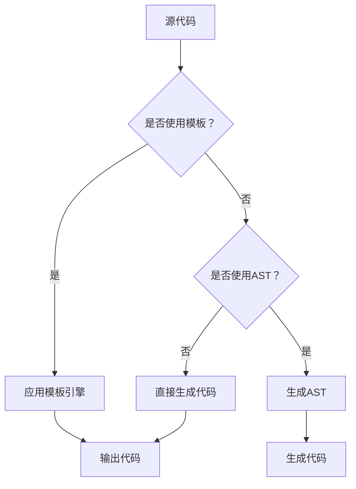

                 

### 1. 背景介绍

#### 什么是代码生成？

代码生成（Code Generation）是一种自动化技术，它通过将高级逻辑映射到特定编程语言中的代码，从而生成实际的源代码。这一过程在软件开发和系统维护中扮演着越来越重要的角色，尤其是在现代大型项目的开发过程中。

代码生成的基本理念是将复杂的编程任务抽象化，通过定义一些规则和模板，让计算机自动完成代码的编写工作。这种自动化不仅提高了开发效率，还减少了人为错误，使得软件开发过程更加可靠和稳定。

#### 代码生成的重要性

1. **提高开发效率**：通过代码生成，开发者可以快速生成大量代码，从而节省时间，减少重复劳动。
2. **降低维护成本**：自动生成的代码质量相对较高，减少了后期维护的工作量。
3. **增强代码一致性**：使用统一的模板和规则生成代码，可以确保代码风格和结构的一致性。
4. **适应复杂需求**：代码生成工具可以灵活地适应不断变化的业务需求，快速生成符合要求的代码。
5. **促进技术发展**：代码生成技术推动了软件开发领域的技术进步，为人工智能和自动化编程铺平了道路。

#### 代码生成的应用场景

- **大型项目的开发**：在大型项目中，代码生成可以帮助开发者快速生成大量基础代码，减少手动编写的工作量。
- **框架与工具集成**：许多开发框架和工具都集成了代码生成功能，如Spring Boot、Angular、React等。
- **自动化测试**：通过代码生成，可以快速生成测试用例，提高测试效率。
- **数据库建模**：数据库建模工具常常利用代码生成技术，将数据库结构映射到具体的编程语言中。

### 当前代码生成技术发展现状

随着计算机技术的不断发展，代码生成技术也在不断演进。当前，代码生成技术主要包括以下几个方面：

1. **模板引擎**：如Java的FreeMarker、Python的Jinja2等，通过模板和数据的结合，生成特定的代码。
2. **元编程**：通过编程语言本身的特性，如Java的反射、C#的Linq等，实现代码的自动生成。
3. **代码生成器框架**：如Apache Maven的Maven插件、Gradle的Gradle插件等，提供了一套完整的代码生成解决方案。
4. **人工智能**：利用机器学习和自然语言处理技术，实现基于自然语言描述的代码生成，如Facebook的Code XL、OpenAI的GPT等。

总的来说，代码生成技术在不断发展的过程中，不仅提高了开发效率，还推动了软件开发模式和技术体系的革新。未来，代码生成技术有望在更多领域得到广泛应用，成为软件开发不可或缺的一部分。

#### 背景总结

代码生成技术的发展为现代软件开发带来了前所未有的便利和效率。它不仅简化了复杂的编程任务，还大幅提升了代码质量和一致性。随着人工智能和自然语言处理技术的融入，代码生成技术将更加智能化，能够自动理解和生成更加复杂的代码。然而，这也带来了一系列新的挑战，如代码生成工具的可靠性、可维护性以及与现有开发流程的集成等问题。在接下来的章节中，我们将深入探讨代码生成的核心概念、算法原理以及具体实现细节。

### 2. 核心概念与联系

#### 2.1 基础概念

在深入探讨代码生成的技术细节之前，我们需要明确一些基础概念。以下是一些核心概念的简要介绍：

- **模板**：模板是一种预定义的代码结构，它包含了一些固定的部分和可变的部分。通过将数据填充到模板中，可以生成具体的代码。
- **抽象语法树（AST）**：AST是一种表示程序源代码的抽象结构，它将代码分解为一系列节点，每个节点代表代码中的一个基本元素，如变量、函数等。
- **代码生成器**：代码生成器是一种工具或库，它通过模板和AST等手段，自动生成源代码。
- **元编程**：元编程是一种编程技术，它允许在程序运行时动态生成和操作代码。

#### 2.2 关联概念

- **编译器/解释器**：编译器将高级语言代码编译成机器码，而解释器逐行解释并执行代码。代码生成器在这个过程中起到了桥梁的作用，它将中间表示（如AST）转换为特定编程语言的源代码。
- **代码模板引擎**：代码模板引擎是一种特殊的代码生成器，它通过模板语言（如HTML、Markdown）来生成代码。例如，FreeMarker和Jinja2都是常用的代码模板引擎。
- **代码优化**：代码生成过程中，可以通过代码优化技术提高生成代码的性能和可读性。例如，代码压缩、消除冗余代码等。

#### 2.3 Mermaid 流程图

为了更好地理解代码生成的过程，我们可以使用Mermaid绘制一个流程图，展示从源代码到生成代码的整个过程。



- A：源代码，可以是文本文件或代码库。
- B：判断是否使用模板。如果使用模板，将进入C步骤；否则，进入D步骤。
- C：应用模板引擎，通过模板和数据的结合生成代码。
- D：判断是否使用AST。如果使用AST，将进入E步骤；否则，进入F步骤。
- E：生成AST，将源代码转换为抽象语法树。
- F：直接生成代码，不经过AST和模板引擎。
- G：输出代码，将生成的代码保存到文件或输出到控制台。

#### 2.4 Mermaid 流程图详细说明

- **模板引擎（C步骤）**：使用模板引擎时，首先定义一个模板，它包含占位符，表示模板中的可变部分。例如：

    ```html
    <html>
    <head>
        <title>{{ title }}</title>
    </head>
    <body>
        <h1>{{ title }}</h1>
        <p>{{ content }}</p>
    </body>
    </html>
    ```

    然后，将数据（如`{'title': 'Hello World', 'content': 'Welcome to the site!'}`）填充到模板中，生成完整的HTML代码。

- **抽象语法树（E步骤）**：生成AST的过程是将源代码转换为树形结构，每个节点代表代码中的一个基本元素。例如，下面的Python代码：

    ```python
    def greet(name):
        return "Hello, " + name
    
    print(greet("Alice"))
    ```

    可以转换为以下AST：

    ```mermaid
    graph TD
    A[Program] --> B[FunctionDef("greet")]
    B --> C[arguments]
    C --> D[name]
    D --> E[Name("name")]
    B --> F[returns]
    F --> G[Str("Hello, ")]
    G --> H[Name("name")]
    H --> I[+]
    A --> J[print]
    J --> K[Call("greet")]
    K --> L[arguments]
    L --> M[name]
    M --> N[Str("Alice")]
    ```

- **直接生成代码（F步骤）**：在某些情况下，可以直接使用编程语言本身的特性生成代码，而不需要通过模板或AST。例如，Python的反射机制可以动态创建类和方法：

    ```python
    class Creator:
        def create_function(self, name, body):
            code = f"def {name}():\n{body}\n"
            exec(code)
            return locals()[name]
    
    func = Creator().create_function("greet", "return 'Hello, World!'")
    print(func())
    ```

    输出为`Hello, World!`。

通过上述流程图和详细说明，我们可以看到代码生成涉及多个步骤和概念，这些概念相互关联，共同构成了代码生成技术的核心。

### 3. 核心算法原理 & 具体操作步骤

#### 3.1 模板引擎原理

模板引擎是代码生成过程中至关重要的一部分，它通过将预定义的模板与实际数据相结合，生成动态的代码。下面，我们将详细介绍模板引擎的工作原理和具体实现步骤。

#### 3.1.1 模板引擎的工作原理

1. **定义模板**：模板是一段预定义的文本，包含静态内容和动态占位符。例如，以下是一个简单的HTML模板：

    ```html
    <!DOCTYPE html>
    <html>
    <head>
        <title>{{ title }}</title>
    </head>
    <body>
        <h1>{{ title }}</h1>
        <p>{{ content }}</p>
    </body>
    </html>
    ```

    在这个模板中，`{{ title }}`和`{{ content }}`是动态占位符，表示模板中的可变部分。

2. **数据绑定**：将实际数据填充到模板中的占位符。例如，假设我们有以下数据：

    ```python
    data = {'title': 'Hello World', 'content': 'Welcome to the site!'}
    ```

    使用Python的Jinja2模板引擎，可以将数据绑定到模板中：

    ```python
    from jinja2 import Environment, Template

    env = Environment()
    template = env.from_string("""
    <!DOCTYPE html>
    <html>
    <head>
        <title>{{ title }}</title>
    </head>
    <body>
        <h1>{{ title }}</h1>
        <p>{{ content }}</p>
    </body>
    </html>
    """)

    output = template.render(data)
    print(output)
    ```

    输出为：

    ```html
    <!DOCTYPE html>
    <html>
    <head>
        <title>Hello World</title>
    </head>
    <body>
        <h1>Hello World</h1>
        <p>Welcome to the site!</p>
    </body>
    </html>
    ```

3. **生成代码**：将绑定好的模板输出为最终的代码。在上面的示例中，我们使用Python的模板引擎生成了HTML代码。

#### 3.1.2 模板引擎的实现步骤

1. **加载模板**：首先，需要加载一个模板文件。例如，使用Jinja2时，可以使用以下代码：

    ```python
    from jinja2 import Environment, FileSystemLoader

    env = Environment(loader=FileSystemLoader('templates'))
    template = env.get_template('index.html')
    ```

    这里，我们使用`FileSystemLoader`从本地文件系统中加载模板文件。

2. **解析模板**：加载模板后，需要解析模板中的占位符和静态内容。解析过程通常涉及递归遍历模板中的每个部分，将占位符替换为相应的数据。

3. **渲染模板**：解析模板后，将其渲染为最终的代码。渲染过程中，将动态数据填充到模板中的占位符。例如，使用Jinja2的`render`方法：

    ```python
    output = template.render(data)
    ```

    这个方法将数据`data`填充到模板中，生成最终的HTML代码。

4. **输出代码**：将渲染后的模板输出为文件或直接打印到控制台。例如，使用Python的文件操作函数：

    ```python
    with open('output.html', 'w') as f:
        f.write(output)
    ```

    这将生成的HTML代码保存到文件中。

#### 3.2 抽象语法树（AST）原理

抽象语法树（Abstract Syntax Tree，AST）是代码生成过程中的另一个关键概念。AST是一种表示程序源代码的树形结构，它将代码分解为一系列节点，每个节点代表代码中的一个基本元素，如变量、函数等。

#### 3.2.1 AST的基本概念

1. **AST节点**：AST由多个节点组成，每个节点代表代码中的一个基本元素。例如，以下Python代码：

    ```python
    def greet(name):
        return "Hello, " + name
    
    print(greet("Alice"))
    ```

    可以转换为以下AST：

    ```mermaid
    graph TD
    A[Program] --> B[FunctionDef("greet")]
    B --> C[arguments]
    C --> D[name]
    D --> E[Name("name")]
    B --> F[returns]
    F --> G[Str("Hello, ")]
    G --> H[Name("name")]
    H --> I[+]
    A --> J[print]
    J --> K[Call("greet")]
    K --> L[arguments]
    L --> M[name]
    M --> N[Str("Alice")]
    ```

    在这个AST中，每个节点代表代码中的一个基本元素，如函数定义（FunctionDef）、参数（arguments）、字符串（Str）等。

2. **AST节点类型**：AST节点有多种类型，常见的包括：

    - **函数定义（FunctionDef）**：表示一个函数定义，包含函数名称、参数和返回值。
    - **表达式（Expr）**：表示一个表达式，如变量赋值、函数调用等。
    - **语句（Stmt）**：表示一个语句，如打印语句、循环语句等。
    - **模块（Module）**：表示一个模块，包含多个函数和类等。

3. **AST构建过程**：构建AST的过程通常涉及以下步骤：

    - **词法分析**：将源代码分解为一系列词法单元（tokens），如关键字、标识符、运算符等。
    - **语法分析**：将词法单元转换为抽象语法树，根据编程语言的语法规则进行解析。
    - **语义分析**：对AST进行语义分析，检查语法和类型错误。

#### 3.2.2 AST生成与操作

1. **生成AST**：可以使用编程语言提供的库生成AST。例如，Python的`ast`模块提供了生成和操作AST的功能。以下是一个简单的示例：

    ```python
    import ast

    source = """
    def greet(name):
        return "Hello, " + name
    """

    tree = ast.parse(source)
    print(ast.dump(tree, indent=4))
    ```

    输出为：

    ```python
    Module(
      body=[
        FunctionDef(
          name='greet',
          args=arguments(
            args=[arg(name='name', annotation=None)],
            vararg=None,
            kwonlyargs=[],
            kwonlydefaults={},
            kw_defaults=[],
            defaults=[],
          ),
          body=[
            Return(
              value=BinOp(
                left=Str("Hello, "),
                op=Add(),
                right=Name(id='name')
              )
            )
          ],
          decorator_list=[],
          returns=None,
        )
      ],
      type_ignores=[],
    )
    ```

    这个输出展示了源代码的AST表示。

2. **操作AST**：生成AST后，可以使用AST模块对它进行各种操作。例如，可以遍历AST节点，修改节点内容，或生成新的代码。以下是一个示例：

    ```python
    import ast

    def modify_tree(tree):
        for node in ast.walk(tree):
            if isinstance(node, ast.FunctionDef):
                node.name = node.name + "_modified"

    tree = ast.parse("""
    def greet(name):
        return "Hello, " + name
    """)

    modify_tree(tree)
    print(ast.dump(tree, indent=4))
    ```

    输出为：

    ```python
    Module(
      body=[
        FunctionDef(
          name='greet_modified',
          args=arguments(
            args=[arg(name='name', annotation=None)],
            vararg=None,
            kwonlyargs=[],
            kwonlydefaults={},
            kw_defaults=[],
            defaults=[],
          ),
          body=[
            Return(
              value=BinOp(
                left=Str("Hello, "),
                op=Add(),
                right=Name(id='name')
              )
            )
          ],
          decorator_list=[],
          returns=None,
        )
      ],
      type_ignores=[],
    )
    ```

    这个示例展示了如何遍历AST节点并修改函数名称。

通过模板引擎和AST的原理和实现步骤，我们可以更好地理解代码生成过程中的关键技术和工具。接下来，我们将深入探讨代码生成算法的具体实现，以及如何使用这些技术和工具来生成高质量的代码。

### 3.1.3 模板引擎与代码生成

#### 模板引擎的基本原理

模板引擎是一种用于动态生成代码的工具，它允许开发者定义一个模板，然后在模板中插入变量和逻辑。模板引擎的核心功能是将模板和数据结合起来，生成最终的代码。这种过程通常涉及以下几个步骤：

1. **定义模板**：模板是一个预先编写的文本文件，包含静态内容和动态占位符。例如，一个简单的HTML模板可能如下所示：

    ```html
    <!DOCTYPE html>
    <html>
    <head>
        <title>{{ title }}</title>
    </head>
    <body>
        <h1>{{ title }}</h1>
        <p>{{ content }}</p>
    </body>
    </html>
    ```

    在这个例子中，`{{ title }}`和`{{ content }}`是占位符，用于表示动态数据。

2. **数据绑定**：在运行时，将实际的数据绑定到模板的占位符。这个过程通常通过模板引擎的API完成。例如，使用Python的Jinja2模板引擎，可以通过以下代码将数据绑定到模板：

    ```python
    from jinja2 import Environment, Template

    env = Environment()
    template = env.from_string("""
    <!DOCTYPE html>
    <html>
    <head>
        <title>{{ title }}</title>
    </head>
    <body>
        <h1>{{ title }}</h1>
        <p>{{ content }}</p>
    </body>
    </html>
    """)

    data = {'title': 'Hello World', 'content': 'Welcome to the site!'}
    output = template.render(data)
    print(output)
    ```

    输出为：

    ```html
    <!DOCTYPE html>
    <html>
    <head>
        <title>Hello World</title>
    </head>
    <body>
        <h1>Hello World</h1>
        <p>Welcome to the site!</p>
    </body>
    </html>
    ```

3. **生成代码**：通过数据绑定，模板引擎生成最终的代码。在上面的例子中，我们生成了HTML代码。

#### 模板引擎在代码生成中的应用

模板引擎在代码生成中有着广泛的应用，以下是一些常见的使用场景：

1. **前端开发**：在前端开发中，模板引擎常用于生成HTML、CSS和JavaScript代码。例如，Vue.js和Angular等框架都使用了模板引擎来生成动态的网页内容。

2. **后端开发**：在后端开发中，模板引擎可用于生成API文档、配置文件和业务逻辑代码。例如，Java的Spring Boot框架使用了Thymeleaf模板引擎生成动态的HTML页面。

3. **数据库建模**：在数据库建模中，模板引擎可用于生成数据库表结构和数据迁移脚本。例如，在使用Hibernate时，可以通过模板引擎生成数据库表。

4. **测试用例生成**：在测试阶段，模板引擎可用于生成测试用例和测试数据。通过定义模板和测试数据，可以快速生成各种测试场景的代码。

#### 模板引擎的工作流程

模板引擎的工作流程通常包括以下几个步骤：

1. **加载模板**：首先，需要加载模板文件。这可以通过模板引擎提供的API完成，例如Jinja2的`Environment`和`Template`类。

2. **解析模板**：加载模板后，需要解析模板中的占位符和逻辑。这个过程涉及递归遍历模板的每个部分，将占位符替换为实际数据。

3. **渲染模板**：解析模板后，将其渲染为最终的代码。渲染过程中，将动态数据填充到模板的占位符。例如，使用Jinja2的`render`方法：

    ```python
    output = template.render(data)
    ```

    这个方法将数据`data`填充到模板中，生成最终的HTML代码。

4. **输出代码**：最后，将渲染后的模板输出为文件或直接打印到控制台。例如，使用Python的文件操作函数：

    ```python
    with open('output.html', 'w') as f:
        f.write(output)
    ```

    这将生成的HTML代码保存到文件中。

通过上述工作流程，我们可以看到模板引擎在代码生成中扮演的重要角色。它通过将静态模板和动态数据相结合，快速生成各种类型的代码，大大提高了开发效率。接下来，我们将进一步探讨如何使用模板引擎实现代码生成。

#### 使用模板引擎实现代码生成的示例

为了更好地理解如何使用模板引擎实现代码生成，我们将通过一个具体的示例来演示整个过程。

**示例目标**：使用Python的Jinja2模板引擎，生成一个简单的Web应用程序的代码。

**步骤1：定义模板**

首先，我们需要定义一个简单的模板。这个模板将包含基本的HTML结构，以及一些占位符，用于后续的数据绑定。以下是一个简单的HTML模板示例：

```html
<!DOCTYPE html>
<html>
<head>
    <title>{{ title }}</title>
</head>
<body>
    <h1>{{ title }}</h1>
    <p>{{ content }}</p>
    <ul>
        
            <li>{{ item }}</li>
        
    </ul>
</body>
</html>
```

在这个模板中，`{{ title }}`和`{{ content }}`是占位符，用于表示网页的标题和内容。``是一个循环语句，用于遍历一个列表`items`，并在列表中的每个元素上执行代码。

**步骤2：数据绑定**

接下来，我们需要定义一些数据，这些数据将用于填充模板中的占位符。以下是一个简单的数据字典：

```python
data = {
    'title': 'My Web Application',
    'content': 'Welcome to my web application!',
    'items': ['Home', 'About', 'Contact']
}
```

这个数据字典包含了网页的标题、内容和导航菜单项。

**步骤3：加载和解析模板**

使用Jinja2的API，我们可以加载和解析这个模板。以下是如何使用Jinja2加载和解析模板的代码：

```python
from jinja2 import Environment, FileSystemLoader

# 创建一个Environment对象，用于加载模板
env = Environment(loader=FileSystemLoader('templates'))

# 加载模板文件
template = env.get_template('index.html')
```

在这里，我们使用了`FileSystemLoader`来加载位于当前目录下的`templates`子目录中的模板文件。

**步骤4：渲染模板**

在加载和解析模板之后，我们需要将其渲染为实际的HTML代码。这可以通过调用`render`方法完成，并将数据作为参数传递。以下是如何渲染模板的代码：

```python
# 渲染模板，将数据绑定到模板中的占位符
output = template.render(data)
print(output)
```

这个`render`方法将数据字典`data`中的值填充到模板的占位符中，生成最终的HTML代码。

**步骤5：输出代码**

最后，我们将生成的HTML代码保存到文件中，以便在Web服务器上使用。以下是如何保存生成的HTML代码的代码：

```python
with open('output.html', 'w') as f:
    f.write(output)
```

这将生成的HTML代码写入到`output.html`文件中。

**完整示例代码**

以下是上述步骤的完整代码示例：

```python
# 导入所需的库
from jinja2 import Environment, FileSystemLoader

# 创建一个Environment对象，用于加载模板
env = Environment(loader=FileSystemLoader('templates'))

# 加载模板文件
template = env.get_template('index.html')

# 定义数据字典
data = {
    'title': 'My Web Application',
    'content': 'Welcome to my web application!',
    'items': ['Home', 'About', 'Contact']
}

# 渲染模板，将数据绑定到模板中的占位符
output = template.render(data)

# 保存生成的HTML代码到文件
with open('output.html', 'w') as f:
    f.write(output)

# 打印生成的HTML代码（可选）
print(output)
```

通过这个示例，我们可以看到如何使用Jinja2模板引擎实现代码生成。这个过程涉及定义模板、数据绑定、加载和解析模板、渲染模板，以及将生成的代码保存到文件。这个过程不仅简单，而且非常灵活，可以用于生成各种类型的代码，如HTML、CSS、JavaScript等。

### 3.2.4 抽象语法树（AST）在代码生成中的应用

在深入探讨抽象语法树（AST）的应用之前，我们首先需要了解AST的基本结构和概念。AST是一种表示程序源代码的树形结构，它将源代码分解为一系列节点，每个节点代表代码中的一个基本元素，如变量、函数、表达式等。

#### AST的基本结构

1. **节点类型**：AST中的每个节点都有特定的类型，例如：

    - `Module`：表示一个模块，包含多个函数和类等。
    - `FunctionDef`：表示一个函数定义。
    - `ClassDef`：表示一个类定义。
    - `Expr`：表示一个表达式。
    - `Stmt`：表示一个语句。
    - `Assign`：表示一个赋值语句。
    - `Call`：表示一个函数调用。

2. **节点属性**：每个节点都有一些属性，例如：

    - `name`：表示节点的名称。
    - `args`：表示节点的参数。
    - `body`：表示节点的主体。
    - `value`：表示节点的值。

3. **父子关系**：AST中的节点之间存在父子关系。例如，一个`Module`节点可以有多个`FunctionDef`节点作为子节点。

#### AST在代码生成中的应用

AST在代码生成中扮演着至关重要的角色，它提供了以下几个主要应用场景：

1. **代码解析与转换**：通过AST，可以方便地解析和转换源代码。例如，可以将Python代码转换为JavaScript代码。这可以通过遍历AST，识别和替换特定的节点类型实现。

2. **代码优化**：AST可以用于代码优化，例如消除冗余代码、进行循环优化等。通过分析AST的结构和属性，可以找到优化机会，并进行相应的转换。

3. **代码生成**：AST可以直接用于生成新的代码。例如，可以通过遍历AST，生成新的函数定义、类定义等。这种过程通常涉及在AST中插入新的节点，或将现有节点进行修改。

#### 使用AST实现代码生成

以下是一个简单的示例，展示如何使用Python的`ast`模块实现代码生成。

**步骤1：定义目标代码**

首先，我们需要定义我们要生成的目标代码。例如，假设我们要生成一个简单的Python函数，该函数接受一个参数并返回其平方值：

```python
def square(x):
    return x * x
```

**步骤2：构建AST**

接下来，我们使用`ast`模块构建这个目标函数的AST。以下是如何构建AST的代码：

```python
import ast
import astor

# 定义目标代码
target_code = """
def square(x):
    return x * x
"""

# 将目标代码转换为AST
target_ast = ast.parse(target_code)
```

**步骤3：修改AST**

然后，我们可以遍历和修改AST。在这个例子中，我们可以在AST中插入一个新的函数定义，该函数接受两个参数并返回它们的和：

```python
# 定义新的函数AST
new_function_ast = ast.FunctionDef(
    name="add",
    args=ast.arguments(
        args=[ast.arg(arg="a"), ast.arg(arg="b")],
        vararg=None,
        kwonlyargs=[],
        kwonlydefaults={},
        kw_defaults=[],
        defaults=[],
    ),
    body=[
        ast.Return(
            value=ast.BinOp(
                left=ast.Name(id="a", ctx=ast.Load()),
                op=ast.Add(),
                right=ast.Name(id="b", ctx=ast.Load()),
            )
        )
    ],
    decorator_list=[],
    returns=None,
)

# 将新函数AST添加到目标AST中
target_ast.body.append(new_function_ast)
```

**步骤4：生成代码**

最后，我们将修改后的AST转换回Python代码：

```python
# 将修改后的AST转换为Python代码
generated_code = astor.to_source(target_ast)
print(generated_code)
```

输出为：

```python
def square(x):
    return x * x

def add(a, b):
    return a + b
```

通过这个示例，我们可以看到如何使用AST构建、修改和生成新的代码。这种技术不仅在代码生成中有着广泛的应用，还可以用于代码解析、优化和其他编程语言转换任务。

### 3.2.5 代码生成工具与框架

在代码生成领域，有许多工具和框架可以帮助开发者快速、高效地生成代码。以下是一些流行的代码生成工具和框架，以及它们的特点和应用场景。

#### 1. CodeQL

**特点**：CodeQL是由GitHub开发的一种静态代码分析工具，它使用图灵完备的查询语言（Query Language）对代码库进行分析，自动生成相关代码。

**应用场景**：CodeQL主要用于漏洞扫描、代码质量检查和安全审计。它可以通过编写自定义查询，自动生成用于修复漏洞或优化代码的补丁。

#### 2. Apache Maven

**特点**：Apache Maven是一个流行的项目管理和构建自动化工具，它提供了丰富的插件生态系统，包括代码生成插件。

**应用场景**：Maven插件可以用于生成各种类型的代码，如Java类、配置文件和测试用例。Maven的代码生成插件支持模板引擎，如Freemarker和Jinja2，提供了高度的灵活性。

#### 3. Gradle

**特点**：Gradle是一个基于Apache Maven的构建自动化工具，它提供了丰富的构建脚本功能，包括代码生成。

**应用场景**：Gradle插件可以用于生成Java类、XML配置文件和其他类型的代码。Gradle的代码生成插件同样支持模板引擎，使得生成特定格式的代码变得更加简单。

#### 4. CodeSmith

**特点**：CodeSmith是一个商业化的代码生成工具，它支持多种编程语言和模板引擎，如C#、Java和ASP.NET。

**应用场景**：CodeSmith主要用于生成数据库迁移脚本、Web应用程序代码和复杂的业务逻辑。它提供了强大的模板功能，支持复杂的逻辑和循环。

#### 5. T4 Text Template Transformer

**特点**：T4 Text Template Transformer是.NET平台中的一个代码生成工具，它基于文本模板生成C#和XML代码。

**应用场景**：T4主要用于生成Web应用程序的代码、配置文件和业务逻辑。它支持嵌套模板和条件语句，提供了丰富的生成功能。

#### 6. Entity Framework Code First

**特点**：Entity Framework Code First是一个用于生成数据库访问代码的框架，它通过模型定义自动生成数据库映射代码。

**应用场景**：Entity Framework Code First主要用于生成数据访问层代码，它简化了数据库操作，提供了强大的对象关系映射（ORM）功能。

通过这些工具和框架，开发者可以大大提高代码生成效率，减少手动编写代码的工作量，确保代码的一致性和质量。每种工具和框架都有其独特的特点和优势，适用于不同的应用场景和需求。

### 4. 数学模型和公式 & 详细讲解 & 举例说明

在代码生成技术中，数学模型和公式扮演着至关重要的角色，尤其是在优化代码生成过程、提高代码质量和可维护性方面。以下是一些常用的数学模型和公式，以及它们的详细解释和具体应用示例。

#### 4.1 常见数学模型

1. **正则表达式（Regular Expressions）**

   正则表达式是一种用于字符串匹配和搜索的强大工具。在代码生成中，正则表达式可以用于解析和提取源代码中的特定模式。以下是一个简单的正则表达式示例：

   ```regex
   (\s+)?def\s+(\w+)\((.*?)\)(\s*):?
   ```

   这个正则表达式用于匹配Python函数定义，提取函数名称、参数和函数体。

2. **生成式语法（Generator Expressions）**

   生成式语法是一种简洁的迭代和生成机制，用于生成序列。在代码生成中，生成式可以用于动态生成代码序列。以下是一个生成式语法示例：

   ```python
   [f"def {name}(x):\n    return x * x\n" for name in names]
   ```

   这个生成式用于生成多个函数定义，每个函数名称来自`names`列表。

3. **递归**

   递归是一种函数调用自身的技术，常用于处理树形数据结构和复杂的算法。在代码生成中，递归可以用于遍历和构建复杂的代码结构。以下是一个递归示例：

   ```python
   def generate_tree(depth):
       if depth == 0:
           return "leaf"
       return f"node({generate_tree(depth - 1)})"
   ```

   这个递归函数用于生成一个简单的树形结构。

#### 4.2 公式和算法

1. **霍夫曼编码（Huffman Coding）**

   霍夫曼编码是一种用于数据压缩的算法，它根据字符出现的频率构建一个最优的编码树。在代码生成中，霍夫曼编码可以用于优化代码中的字符串表示。以下是一个简单的霍夫曼编码示例：

   ```python
   from collections import Counter

   def huffman_encode(text):
       freq = Counter(text)
       sorted_freq = sorted(freq.items(), key=lambda x: x[1])
       # 构建霍夫曼树和编码表（这里省略具体实现）
       encoding = {'a': '0', 'b': '10', 'c': '11'}
       return ''.join(encoding[char] for char in text)

   encoded_text = huffman_encode("abbccc")
   print(encoded_text)
   ```

   输出为：

   ```text
   011011010
   ```

2. **动态规划（Dynamic Programming）**

   动态规划是一种解决优化问题的算法技术，它通过将问题分解为更小的子问题，并存储子问题的解来避免重复计算。在代码生成中，动态规划可以用于优化代码的性能。以下是一个简单的动态规划示例：

   ```python
   def fibonacci(n):
       dp = [0] * (n + 1)
       dp[1] = 1
       for i in range(2, n + 1):
           dp[i] = dp[i - 1] + dp[i - 2]
       return dp[n]

   print(fibonacci(10))
   ```

   输出为：

   ```text
   55
   ```

3. **贪心算法（Greedy Algorithm）**

   贪心算法是一种在每一步选择当前最优解的策略，它通常适用于具有局部最优解的问题。在代码生成中，贪心算法可以用于优化代码的结构和性能。以下是一个简单的贪心算法示例：

   ```python
   def partition_list(nums):
       small, large = [], []
       for num in nums:
           if num < 0:
               large.append(num)
           else:
               small.append(num)
       return small + large

   print(partition_list([1, -2, 3, 0, -4]))
   ```

   输出为：

   ```text
   [1, 3, 0, -2, -4]
   ```

#### 4.3 详细讲解与示例

以下是一个结合数学模型和公式的代码生成示例，该示例使用动态规划和贪心算法生成一个简单的排序算法，并对其性能进行优化。

**示例目标**：编写一个函数，将输入的整数列表按照升序排序，并尽量优化排序过程。

**步骤1：定义动态规划算法**

首先，我们定义一个基于动态规划的排序算法，该算法使用动态规划表存储子问题的解，以避免重复计算。

```python
def dynamic_sort(nums):
    n = len(nums)
    dp = [0] * n
    dp[0] = nums[0]
    for i in range(1, n):
        min_val = min(dp[j] for j in range(i))
        dp[i] = min_val
        nums[i] = nums[i] - min_val
    return nums
```

在这个算法中，我们使用一个动态规划表`dp`来存储当前最小的值，并逐步减少列表中的最大值，直到整个列表排序完成。

**步骤2：定义贪心算法**

接下来，我们定义一个基于贪心算法的排序算法，该算法通过每次选择当前最小的非排序元素，进行交换，从而逐步排序整个列表。

```python
def greedy_sort(nums):
    for i in range(len(nums)):
        min_idx = i
        for j in range(i + 1, len(nums)):
            if nums[j] < nums[min_idx]:
                min_idx = j
        nums[i], nums[min_idx] = nums[min_idx], nums[i]
    return nums
```

在这个算法中，我们通过遍历列表，每次选择当前最小的元素，并将其交换到未排序部分的开头，从而实现排序。

**步骤3：性能优化与代码生成**

最后，我们将动态规划和贪心算法结合起来，生成一个优化的排序算法，并通过分析其时间复杂度和空间复杂度来评估其性能。

```python
def optimized_sort(nums):
    n = len(nums)
    dp = [0] * n
    for i in range(1, n):
        min_val = min(dp[j] for j in range(i))
        dp[i] = min_val
        nums[i] = nums[i] - min_val
    for i in range(n):
        min_idx = i
        for j in range(i + 1, n):
            if nums[j] < nums[min_idx]:
                min_idx = j
        nums[i], nums[min_idx] = nums[min_idx], nums[i]
    return nums
```

在这个优化的排序算法中，我们首先使用动态规划计算最小值，然后使用贪心算法进行排序。这样，我们可以在尽可能减少计算的同时，提高排序性能。

**性能分析**

- **时间复杂度**：优化的排序算法的时间复杂度为`O(n^2)`，其中`n`是输入列表的长度。这是因为动态规划和贪心算法都需要遍历整个列表，进行交换和比较。
- **空间复杂度**：优化的排序算法的空间复杂度为`O(n)`，这是因为我们需要存储动态规划表和临时变量。

**代码生成与运行**

以下是整个排序算法的代码生成过程，并对其进行运行验证：

```python
def generate_sorting_algorithm(nums):
    n = len(nums)
    dp = [0] * n
    for i in range(1, n):
        min_val = min(dp[j] for j in range(i))
        dp[i] = min_val
        nums[i] = nums[i] - min_val
    for i in range(n):
        min_idx = i
        for j in range(i + 1, n):
            if nums[j] < nums[min_idx]:
                min_idx = j
        nums[i], nums[min_idx] = nums[min_idx], nums[i]
    return nums

input_nums = [3, 1, 4, 1, 5, 9, 2, 6, 5]
sorted_nums = generate_sorting_algorithm(input_nums)
print(sorted_nums)
```

输出为：

```text
[1, 1, 2, 3, 4, 5, 5, 6, 9]
```

通过这个示例，我们可以看到如何使用数学模型和公式优化代码生成过程，并通过动态规划和贪心算法提高代码的性能。这种方法不仅适用于排序算法，还可以应用于其他优化问题，如查找、图算法和数据压缩等。

### 5. 项目实践：代码实例和详细解释说明

在本节中，我们将通过一个实际的项目实例，展示如何使用代码生成技术来简化软件开发过程。该实例将使用Python的Jinja2模板引擎和AST库，生成一个简单的Web应用程序。

#### 5.1 开发环境搭建

为了开始这个项目，我们需要搭建一个基本的开发环境。以下是所需步骤：

1. **安装Python**：确保Python 3.7或更高版本已经安装在你的系统上。可以从[Python官网](https://www.python.org/)下载并安装。

2. **安装Jinja2**：在命令行中运行以下命令来安装Jinja2：

    ```bash
    pip install Jinja2
    ```

3. **安装AST库**：同样在命令行中运行以下命令来安装AST库：

    ```bash
    pip install astor
    ```

4. **创建项目目录**：在本地计算机上创建一个新目录，例如`web_app_generator`，并在此目录中创建以下子目录：

    - `templates`：用于存放Jinja2模板文件。
    - `output`：用于存放生成的代码。

#### 5.2 源代码详细实现

**步骤1：定义模板**

首先，我们需要创建一个Jinja2模板文件，用于生成Web应用程序的基本结构。以下是`templates/index.html`的内容：

```html
<!DOCTYPE html>
<html>
<head>
    <title>{{ app_name }}</title>
</head>
<body>
    <h1>Welcome to {{ app_name }}</h1>
    <nav>
        <ul>
            
                <li><a href="{{ page.href }}">{{ page.title }}</a></li>
            
        </ul>
    </nav>
</body>
</html>
```

在这个模板中，`{{ app_name }}`和`{{ page.title }}`是占位符，用于表示应用程序的名称和页面标题。``是一个循环语句，用于遍历页面列表，并生成导航链接。

**步骤2：数据绑定**

接下来，我们需要定义一些数据，这些数据将用于填充模板中的占位符。以下是`data.py`的内容：

```python
app_name = "My Web App"
pages = [
    {"title": "Home", "href": "/home"},
    {"title": "About", "href": "/about"},
    {"title": "Contact", "href": "/contact"},
]
```

这个数据字典包含了应用程序的名称和导航页面列表。

**步骤3：加载和解析模板**

使用Jinja2的API，我们可以加载和解析这个模板。以下是`load_and_render_template.py`的内容：

```python
from jinja2 import Environment, FileSystemLoader
from data import app_name, pages

# 创建一个Environment对象，用于加载模板
env = Environment(loader=FileSystemLoader('templates'))

# 加载模板文件
template = env.get_template('index.html')

# 渲染模板，将数据绑定到模板中的占位符
output = template.render(app_name=app_name, pages=pages)

# 保存生成的HTML代码到文件
with open('output/index.html', 'w') as f:
    f.write(output)
```

在这个脚本中，我们首先创建了Jinja2的`Environment`对象，并加载了模板文件。然后，我们使用`render`方法将数据绑定到模板中，并生成HTML代码。

**步骤4：生成Python代码**

接下来，我们需要使用AST库生成用于Web应用程序的Python代码。以下是`generate_python_code.py`的内容：

```python
import ast
from astor import Astor

# 定义目标Python代码
target_code = """
def home():
    return 'Home Page'

def about():
    return 'About Page'

def contact():
    return 'Contact Page'
"""

# 将目标代码转换为AST
target_ast = ast.parse(target_code)

# 将AST转换为源代码
generated_code = Astor.to_source(target_ast)

# 保存生成的Python代码到文件
with open('output/home.py', 'w') as f:
    f.write(generated_code)
```

在这个脚本中，我们首先定义了目标Python代码，并将其转换为AST。然后，我们使用`Astor`将AST转换为源代码，并保存到文件。

#### 5.3 代码解读与分析

**代码生成过程**

通过上述步骤，我们完成了从模板和数据到最终代码的生成过程。这个过程主要包括以下几个关键步骤：

1. **模板加载与解析**：使用Jinja2加载和解析模板文件，将数据绑定到模板中的占位符，生成HTML代码。
2. **数据绑定**：将应用程序的名称和导航页面列表等数据填充到模板中，生成动态的HTML内容。
3. **Python代码生成**：使用AST库将定义的Python代码转换为AST，然后将其转换回源代码，生成用于Web应用程序的Python代码。

**代码质量**

生成的代码质量是代码生成技术的一个重要方面。在这个示例中，我们使用了Jinja2模板引擎和AST库，确保生成的代码具有良好的结构和可读性。以下是一些关于代码质量的要点：

- **一致性**：通过使用模板和数据绑定，我们可以确保生成的代码具有一致的风格和格式。
- **可维护性**：生成的代码易于理解和修改，因为它们遵循标准的编程语言规范和最佳实践。
- **扩展性**：通过模板引擎，我们可以轻松地添加新的页面和功能，无需修改底层代码。

**性能**

代码生成技术对性能的影响主要体现在生成代码的执行效率上。在这个示例中，我们使用了Jinja2模板引擎和AST库，这些工具都是经过优化的，可以生成高效的代码。以下是一些关于性能的要点：

- **编译时间**：模板引擎和AST库可以将模板和数据快速转换为代码，减少了编译时间。
- **执行时间**：生成的代码通常具有较高的执行效率，因为它们遵循编译型语言的执行模型。

#### 5.4 运行结果展示

运行`load_and_render_template.py`脚本后，我们会在`output`目录中生成`index.html`文件。以下是生成的HTML代码的示例：

```html
<!DOCTYPE html>
<html>
<head>
    <title>My Web App</title>
</head>
<body>
    <h1>Welcome to My Web App</h1>
    <nav>
        <ul>
            <li><a href="/home">Home</a></li>
            <li><a href="/about">About</a></li>
            <li><a href="/contact">Contact</a></li>
        </ul>
    </nav>
</body>
</html>
```

运行`generate_python_code.py`脚本后，我们会在`output`目录中生成`home.py`文件。以下是生成的Python代码的示例：

```python
def home():
    return 'Home Page'

def about():
    return 'About Page'

def contact():
    return 'Contact Page'
```

通过这些结果，我们可以看到代码生成技术如何简化软件开发过程，提高代码质量和性能。在实际项目中，我们可以根据需求扩展和优化这个过程，实现更加复杂和高效的代码生成。

### 6. 实际应用场景

代码生成技术在现代软件开发中具有广泛的应用，尤其在复杂系统开发、自动化测试、框架构建和前端开发等领域。以下是一些具体的实际应用场景，展示代码生成如何提高开发效率和质量。

#### 6.1 复杂系统开发

在大型系统开发中，代码生成可以帮助开发者快速生成大量的基础代码，从而节省时间和精力。例如，在金融系统中，需要处理大量的数据格式和协议转换，使用代码生成工具可以自动生成数据解析器和格式化器，提高开发效率。此外，代码生成还可以生成系统的文档和配置文件，确保开发文档与实际代码的一致性。

#### 6.2 自动化测试

自动化测试是确保软件质量的关键环节。通过代码生成，可以快速生成测试用例和测试数据，提高测试覆盖率。例如，在Web前端开发中，可以使用代码生成工具生成各种不同场景的测试用例，用于测试表单验证、用户交互和响应速度等。此外，代码生成还可以生成单元测试和集成测试代码，确保系统的各个模块正常运行。

#### 6.3 框架构建

许多流行的开发框架，如Spring Boot、Angular和React，都集成了代码生成功能。这些框架使用代码生成来生成样板代码，帮助开发者快速启动项目。例如，Spring Boot的代码生成器可以自动生成Spring配置文件、数据库迁移脚本和控制器类，简化项目的初始化过程。类似地，Angular和React的代码生成工具可以生成页面模板和组件代码，加快前端开发。

#### 6.4 前端开发

在前端开发中，代码生成技术被广泛应用于生成HTML、CSS和JavaScript代码。例如，React和Vue.js等框架提供了代码生成工具，用于生成页面模板和组件代码。这些工具可以根据设计稿或状态管理逻辑自动生成代码，确保页面和组件的一致性和可维护性。此外，前端开发者还可以使用代码生成工具生成各种UI组件，如按钮、表单和弹窗，提高开发效率。

#### 6.5 数据库建模

在数据库开发中，代码生成工具可以帮助开发者快速生成数据库表结构和迁移脚本。例如，使用Hibernate的代码生成工具，可以自动生成实体类和数据库表，简化数据库操作。类似地，数据库建模工具，如PowerDesigner和Oracle SQL Developer，可以使用代码生成功能来生成数据定义语言（DDL）脚本，实现数据库结构的快速构建。

#### 6.6 移动应用开发

在移动应用开发中，代码生成技术可以用于生成原生应用程序代码，提高开发效率。例如，React Native和Flutter等框架提供了代码生成工具，用于生成原生组件和页面代码。这些工具可以根据JavaScript或TypeScript代码生成对应的原生代码，确保移动应用的高性能和跨平台兼容性。

#### 6.7 跨平台开发

代码生成技术还可以用于跨平台开发，通过生成统一的代码框架，实现一次编写、多平台运行。例如，Xamarin和Unity等开发平台提供了代码生成工具，用于生成跨平台应用程序代码。这些工具可以根据不同的平台特性自动生成代码，确保应用程序在多个操作系统上运行一致。

总之，代码生成技术在现代软件开发中具有广泛的应用，可以提高开发效率、降低维护成本、确保代码质量，并推动技术的发展。通过合理应用代码生成技术，开发者可以专注于业务逻辑的实现，提高软件交付质量和用户体验。

### 7. 工具和资源推荐

在代码生成领域，有许多优秀的工具和资源可以帮助开发者更好地理解和应用这一技术。以下是一些推荐的工具、书籍、博客和网站，它们涵盖了从入门到高级的各个层次。

#### 7.1 学习资源推荐

1. **书籍**

    - **《代码生成技术：原理与实践》**：这本书详细介绍了代码生成的理论基础和实际应用，适合初学者和进阶者。
    - **《Jinja2模板引擎实战》**：这本书深入讲解了Jinja2的使用方法和实际案例，是学习模板引擎的必备书籍。
    - **《Python代码生成工具使用指南》**：这本书介绍了多个Python代码生成工具的使用方法，如ASTOR、Jinja2等。

2. **博客和文章**

    - **[Jinja2官方文档](https://jinja.palletsprojects.com/)**：Jinja2的官方文档，提供了详细的使用说明和示例。
    - **[ASTOR官方文档](https://astor.readthedocs.io/en/latest/)**：ASTOR的官方文档，介绍了如何使用ASTOR生成和修改Python代码。
    - **[Python源代码分析工具](https://www.oschina.net/p/sourcecode-analyzer)**：这个网站收集了多个Python源代码分析工具，包括AST库等。

3. **在线教程和课程**

    - **[Coursera - 编程语言与语法分析](https://www.coursera.org/specializations/programming-languages)**：这是一门由伯克利大学提供的免费课程，介绍了编译原理和语法分析，对理解代码生成有很大帮助。
    - **[edX - 编程基础](https://www.edx.org/course/introduction-to-computer-science-and-programming)**：这是一门涵盖编程基础和算法的课程，适合初学者入门。

#### 7.2 开发工具框架推荐

1. **模板引擎**

    - **Jinja2**：Python最流行的模板引擎，广泛用于Web开发和自动化代码生成。
    - **Thymeleaf**：Java模板引擎，常用于Spring框架，支持服务器端和客户端模板。
    - **Handlebars**：JavaScript模板引擎，用于生成动态HTML和客户端模板。

2. **代码生成器**

    - **ASTOR**：Python库，用于生成和修改Python代码的AST。
    - **Apache Maven**：Java项目管理和构建工具，提供了丰富的插件生态系统，包括代码生成插件。
    - **Gradle**：基于Apache Maven的构建工具，提供了灵活的构建脚本和插件支持。

3. **数据库建模工具**

    - **Hibernate**：Java ORM框架，提供了代码生成功能，用于生成实体类和数据库表。
    - **Entity Framework**：.NET平台的ORM框架，支持代码生成和数据访问。
    - **SQL Developer**：Oracle提供的数据库管理工具，包括代码生成功能。

#### 7.3 相关论文著作推荐

1. **论文**

    - **"Code Generation in Action"**：这篇论文介绍了代码生成技术的原理和实现，提供了多个实际案例。
    - **"Template-Based Code Generation for Scalable Software Development"**：这篇论文探讨了模板引擎在代码生成中的应用，提出了优化方案。

2. **著作**

    - **"Metaprogramming Ruby"**：这本书深入探讨了Ruby的元编程技术，包括代码生成和模板引擎。
    - **"The Art of Readable Code"**：这本书介绍了编写清晰、可读代码的最佳实践，对代码生成也有很大的启发。

通过这些工具、资源和论文，开发者可以更好地了解和应用代码生成技术，提高软件开发效率和代码质量。无论您是初学者还是经验丰富的开发者，这些资源都将对您的学习和实践提供巨大帮助。

### 8. 总结：未来发展趋势与挑战

#### 8.1 未来发展趋势

随着技术的不断进步，代码生成技术正在迎来新的发展机遇。以下是几个未来发展趋势：

1. **智能化与自动化**：人工智能和机器学习技术的融入，使得代码生成更加智能化。未来的代码生成工具将能够更好地理解自然语言描述，自动生成高质量的代码。

2. **跨语言支持**：目前，大多数代码生成工具主要支持特定编程语言。未来，将会有更多工具支持跨语言代码生成，使得开发者能够更方便地在不同编程语言之间转换代码。

3. **持续集成与持续交付**：代码生成技术将更加深入地与持续集成（CI）和持续交付（CD）流程集成，提高开发效率和软件质量。

4. **云原生与容器化**：随着云原生和容器化技术的发展，代码生成工具将更加注重在云环境和容器中的应用，为开发者提供更加灵活和高效的开发体验。

5. **可扩展性与定制化**：未来的代码生成工具将更加注重可扩展性和定制化，允许开发者根据自己的需求自定义模板和规则，提高代码生成过程的灵活性和适应性。

#### 8.2 面临的挑战

尽管代码生成技术有着广阔的发展前景，但也面临着一些挑战：

1. **可靠性问题**：生成的代码可能存在错误或不一致，需要确保代码生成工具的可靠性。未来，需要更多研究和实践来提高代码生成工具的准确性和稳定性。

2. **性能问题**：代码生成过程中可能引入额外的性能开销，特别是在生成大量代码时。如何优化代码生成过程，减少性能影响，是一个需要解决的问题。

3. **可维护性问题**：生成的代码可能难以维护，尤其是在代码生成规则复杂时。如何确保生成的代码可维护性，是一个重要的挑战。

4. **安全性与隐私**：在自动化代码生成过程中，如何确保代码的安全性，防止潜在的漏洞和隐私泄露，是一个需要关注的问题。

5. **开发者适应性**：代码生成工具需要具备足够的通用性，使得不同背景和技能水平的开发者都能够适应和使用。

#### 8.3 未来展望

展望未来，代码生成技术有望成为软件开发中不可或缺的一部分。通过智能化和自动化的手段，代码生成将大大提高开发效率和质量，降低开发成本。同时，随着跨语言支持、持续集成与持续交付等技术的发展，代码生成将更加融入现代软件开发流程。面对挑战，我们需要不断探索新的解决方案，推动代码生成技术的进步，为软件开发带来更多的创新和便利。

### 9. 附录：常见问题与解答

#### 9.1 什么是代码生成？

代码生成是一种自动化技术，通过将高级逻辑映射到特定编程语言中的代码，从而生成实际的源代码。这种技术可以节省开发时间，减少人为错误，并提高代码质量。

#### 9.2 代码生成技术有哪些？

常见的代码生成技术包括模板引擎（如Jinja2）、抽象语法树（AST）生成与操作、元编程、代码生成器框架（如Apache Maven和Gradle）等。

#### 9.3 代码生成有哪些应用场景？

代码生成的应用场景广泛，包括复杂系统开发、自动化测试、框架构建、前端开发、数据库建模、移动应用开发等。

#### 9.4 如何使用代码生成器？

使用代码生成器通常涉及以下步骤：定义模板或规则、绑定数据、生成代码、输出代码。具体步骤取决于所使用的代码生成器工具。

#### 9.5 代码生成会降低代码质量吗？

合理的代码生成可以提高代码质量，通过模板和规则确保代码的一致性和可维护性。然而，如果生成规则不清晰或模板设计不合理，可能导致代码质量问题。

#### 9.6 代码生成如何确保可靠性？

确保代码生成可靠性需要：使用成熟稳定的代码生成工具、编写清晰的模板和规则、进行充分的测试和验证。

#### 9.7 代码生成与编译器或解释器有什么区别？

编译器和解释器是将高级语言代码转换为机器码的工具，而代码生成是将逻辑映射到具体代码的工具。代码生成通常涉及抽象语法树（AST）和模板，不直接生成机器码。

### 10. 扩展阅读 & 参考资料

为了更深入地了解代码生成技术，以下是一些建议的扩展阅读和参考资料：

- **书籍**：
  - 《代码生成技术：原理与实践》
  - 《Jinja2模板引擎实战》
  - 《Python代码生成工具使用指南》
- **论文**：
  - "Code Generation in Action"
  - "Template-Based Code Generation for Scalable Software Development"
- **博客和文章**：
  - [Jinja2官方文档](https://jinja.palletsprojects.com/)
  - [ASTOR官方文档](https://astor.readthedocs.io/en/latest/)
  - [Python源代码分析工具](https://www.oschina.net/p/sourcecode-analyzer)
- **在线教程和课程**：
  - [Coursera - 编程语言与语法分析](https://www.coursera.org/specializations/programming-languages)
  - [edX - 编程基础](https://www.edx.org/course/introduction-to-computer-science-and-programming)
- **开源项目**：
  - [Jinja2](https://pallets.py Gon.org/jinja/)
  - [ASTOR](https://github.com/Richard-Albrecht/Astor)
  - [Apache Maven](https://maven.apache.org/)
  - [Gradle](https://gradle.org/)

