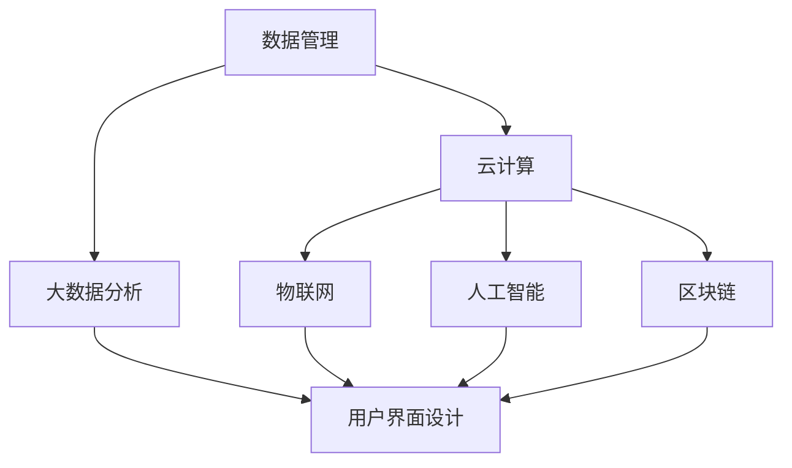

                 

### 背景介绍 Background

随着全球数字化转型的加速，企业数字化项目已经成为提升企业竞争力、实现可持续增长的重要手段。在当今竞争激烈的市场环境中，企业不仅需要应对日益复杂的业务场景，还要应对外部环境变化所带来的不确定性和挑战。数字化项目的成功实施，可以为企业带来以下显著优势：

1. **提升运营效率**：通过数字化手段，企业可以优化业务流程，减少人工操作，提高生产效率。例如，自动化系统的引入可以显著降低错误率，提高作业速度。

2. **增强客户体验**：数字化项目可以帮助企业更好地理解客户需求，提供个性化的服务体验。通过数据分析，企业可以精准地识别客户偏好，提供更加定制化的产品和服务。

3. **降低成本**：数字化技术的应用，如云计算、大数据分析等，可以帮助企业降低运营成本。例如，通过大数据分析优化供应链管理，可以显著减少库存成本和物流成本。

4. **提高决策质量**：数字化项目为企业提供了丰富的数据支持，通过数据分析和建模，可以帮助企业做出更加科学和高效的决策。

然而，企业数字化项目的实施并非一帆风顺。许多企业在项目实施过程中面临着诸多挑战，如技术复杂性、项目管理难度、人员培训等。为了帮助企业成功实施数字化项目，本文将从以下几个方面进行探讨：

- **核心概念与联系**：介绍数字化项目的核心概念和架构，并使用 Mermaid 流程图进行详细展示。
- **核心算法原理 & 具体操作步骤**：阐述数字化项目中的核心算法原理，并提供具体的操作步骤。
- **数学模型和公式 & 详细讲解 & 举例说明**：讲解数字化项目中常用的数学模型和公式，并通过具体案例进行说明。
- **项目实践：代码实例和详细解释说明**：提供实际项目中的代码实例，并进行详细的解读和分析。
- **实际应用场景**：分析数字化项目在不同行业和领域的实际应用场景。
- **工具和资源推荐**：推荐学习资源和开发工具，帮助读者深入了解和实施数字化项目。
- **总结：未来发展趋势与挑战**：探讨数字化项目的未来发展趋势和面临的挑战。

通过本文的逐步分析和讲解，我们希望为企业提供一套完整的数字化项目建设方案，助力企业在数字化浪潮中实现成功转型。

### 核心概念与联系 Core Concepts and Connections

为了理解企业数字化项目的实施，我们首先需要了解其中的核心概念和架构。以下是数字化项目中的一些关键概念：

1. **数据管理**：数据管理是数字化项目的基石。它包括数据采集、存储、处理和分析。有效的数据管理能够确保数据的质量和安全性，并为后续的分析提供可靠的基础。

2. **云计算**：云计算提供了弹性的计算和存储资源，使得企业可以按需扩展和缩减资源，降低成本。云服务还包括数据分析、机器学习和物联网等关键技术。

3. **大数据分析**：大数据分析通过对海量数据的挖掘和分析，帮助企业发现数据中的价值，支持决策制定和业务优化。

4. **物联网（IoT）**：物联网技术通过连接各种设备和传感器，实现数据的实时采集和传输。在数字化项目中，物联网可以用于生产监控、设备维护和供应链优化。

5. **人工智能（AI）**：人工智能技术在数字化项目中扮演着重要角色，包括自然语言处理、图像识别和智能决策支持等。AI 可以帮助企业实现自动化和智能化，提高运营效率。

6. **区块链**：区块链技术提供了一种去中心化的数据存储和传输方式，增强了数据的安全性和透明度。区块链在供应链管理、金融交易等领域有广泛应用。

7. **用户界面（UI）和用户体验（UX）设计**：优秀的 UI/UX 设计可以提升用户的使用体验，增强产品的吸引力。在数字化项目中，UI/UX 设计不仅仅关注外观，更注重用户交互和功能体验。

为了更好地展示这些概念之间的关系，我们可以使用 Mermaid 流程图来描述数字化项目的架构。以下是一个简化的 Mermaid 流程图示例：



在这个流程图中，数据管理作为核心，通过云计算、大数据分析、物联网、人工智能和区块链等技术进行扩展，最终通过用户界面设计实现与用户的互动。

### 核心算法原理 & 具体操作步骤 Core Algorithm Principles & Detailed Steps

在数字化项目中，核心算法原理是确保项目成功的关键。以下是几种常见的算法原理，以及其在实际操作中的具体步骤：

#### 1. 数据清洗算法（Data Cleaning Algorithms）

数据清洗是数据管理的重要环节，其目的是去除数据中的噪声和不一致。以下是一种常见的数据清洗算法：

**原理**：使用 SQL 查询和脚本自动化清洗数据。

**操作步骤**：

1. **识别数据源**：确定需要清洗的数据源，如数据库、文件或 API。
2. **数据导入**：将数据导入到数据处理平台，如 Hadoop、Spark 或数据库管理系统。
3. **数据预处理**：对数据进行初步处理，如去除空值、缺失值填充、格式转换等。
4. **错误检测**：使用统计方法和可视化工具检测数据中的异常值和错误。
5. **数据清洗**：根据检测到的错误和异常值，编写 SQL 查询或脚本进行数据清洗，如删除、替换或修正错误数据。
6. **数据验证**：清洗后，对数据进行验证，确保数据质量符合要求。

#### 2. 机器学习算法（Machine Learning Algorithms）

机器学习算法在数字化项目中广泛应用于预测分析、分类和聚类等任务。以下是一种简单的机器学习算法——决策树（Decision Tree）：

**原理**：决策树通过一系列的判断节点，将数据划分为不同的类别。

**操作步骤**：

1. **数据准备**：收集并准备用于训练的数据集，确保数据质量。
2. **特征选择**：选择影响目标变量的特征，进行特征工程。
3. **构建决策树**：使用决策树算法（如 ID3、C4.5 或 CART）构建决策树，根据信息增益或基尼不纯度选择最佳划分标准。
4. **训练模型**：使用训练数据集训练决策树模型。
5. **模型评估**：使用验证集或测试集评估模型性能，如准确率、召回率和 F1 分数。
6. **模型优化**：根据评估结果调整模型参数，优化模型性能。
7. **模型应用**：将训练好的模型应用到实际数据中，进行预测或分类。

#### 3. 数据分析算法（Data Analysis Algorithms）

数据分析算法用于挖掘数据中的潜在价值和关系。以下是一种常见的数据分析算法——聚类分析（Cluster Analysis）：

**原理**：聚类分析将数据点分为多个类，使同类别内的数据点之间相似度较高，不同类别之间的相似度较低。

**操作步骤**：

1. **数据准备**：收集并准备用于分析的数据集，确保数据质量。
2. **数据预处理**：对数据进行初步处理，如标准化、归一化等。
3. **选择聚类算法**：选择适合的聚类算法，如 K-means、层次聚类（Hierarchical Clustering）或 DBSCAN。
4. **初始化聚类中心**：根据算法选择，初始化聚类中心。
5. **聚类过程**：执行聚类算法，将数据点分配到不同的类别。
6. **评估聚类结果**：使用内部评估指标（如轮廓系数、完成度等）评估聚类质量。
7. **聚类应用**：根据聚类结果，分析数据点之间的相似度和关系。

通过以上算法原理和操作步骤的讲解，我们可以看到数字化项目中算法的多样性和复杂性。在实际操作中，需要根据具体项目需求选择合适的算法，并不断完善和优化算法性能，以实现项目的目标。

### 数学模型和公式 Mathematical Models and Formulas

在数字化项目中，数学模型和公式是理解和优化算法性能的重要工具。以下是几个常见的数学模型和公式，以及它们的详细解释和举例说明。

#### 1. 决策树模型（Decision Tree Model）

决策树模型是一种常见的分类算法，它通过一系列的判断节点对数据进行分类。其基本公式如下：

\[ Y = f(X) = g_1(X) \cdot \delta_1 + g_2(X) \cdot \delta_2 + ... + g_n(X) \cdot \delta_n \]

其中，\( Y \) 是输出变量，\( X \) 是输入特征，\( g_i(X) \) 是第 \( i \) 个判断节点的特征函数，\( \delta_i \) 是第 \( i \) 个判断节点的阈值。

**解释**：这个公式表示决策树通过多个特征函数和阈值，将输入数据映射到输出类别。

**举例**：

假设我们要对一组客户进行分类，特征包括年龄、收入和购买历史。我们可以使用决策树模型来预测客户的购买意愿。具体公式如下：

\[ Y = f(X) = (age > 30) \cdot \delta_1 + (income > 50000) \cdot \delta_2 + (purchase_history > 5) \cdot \delta_3 \]

如果年龄大于30岁，收入大于50000美元，购买历史大于5次，那么客户将被分类为高购买意愿。

#### 2. 神经网络模型（Neural Network Model）

神经网络模型是另一种常见的机器学习算法，其基本结构包括输入层、隐藏层和输出层。其基本公式如下：

\[ \text{激活函数}(z) = \frac{1}{1 + e^{-z}} \]

其中，\( z \) 是加权求和值，激活函数（如 sigmoid 函数）用于将加权求和值转换为输出。

**解释**：这个公式表示神经网络通过加权求和和激活函数，将输入映射到输出。

**举例**：

假设我们要构建一个神经网络来分类水果，输入层包含苹果、香蕉和橙子的特征，隐藏层和输出层分别表示水果的类别。具体公式如下：

\[ \text{输出} = \text{激活函数}(w_1 \cdot \text{苹果特征} + w_2 \cdot \text{香蕉特征} + w_3 \cdot \text{橙子特征}) \]

如果苹果特征的权重大于香蕉和橙子特征的权重，那么输出层将输出“苹果”类别。

#### 3. 聚类分析模型（Cluster Analysis Model）

聚类分析模型用于将数据点分为多个类，以发现数据中的潜在结构和模式。其基本公式如下：

\[ \text{簇中心} = \frac{1}{n} \sum_{i=1}^{n} \text{数据点} \]

其中，\( n \) 是数据点的数量，簇中心表示每个簇的中心点。

**解释**：这个公式表示每个簇的中心点是通过计算簇内所有数据点的平均值得到的。

**举例**：

假设我们要使用 K-means 聚类算法对一组客户进行聚类，数据点包括客户的年龄、收入和购买历史。我们可以通过计算每个簇的中心点，来识别不同的客户群体。具体公式如下：

\[ \text{簇中心} = \frac{1}{n} \sum_{i=1}^{n} \text{客户特征} \]

如果簇中心的年龄、收入和购买历史相似，那么这个簇可以表示一个客户群体。

通过以上数学模型和公式的讲解，我们可以更好地理解和应用它们在数字化项目中的实际操作。这些模型和公式不仅提供了理论基础，还帮助我们优化和改进算法性能，以实现项目目标。

### 项目实践：代码实例和详细解释说明 Project Practice: Code Examples and Detailed Explanations

在本节中，我们将通过一个实际的数字化项目实例，详细展示代码的实现过程，并进行解读和分析。

#### 项目背景

假设我们正在开发一个电子商务平台的推荐系统，旨在通过分析用户的购物行为和历史数据，为用户推荐个性化的商品。推荐系统的核心功能是：

- **用户行为分析**：收集用户的浏览、搜索和购买行为数据。
- **商品特征提取**：提取商品的关键特征，如类别、价格、品牌等。
- **推荐算法**：使用协同过滤、矩阵分解和基于内容的推荐算法，为用户生成个性化的推荐列表。

#### 开发环境搭建

1. **硬件环境**：配备 Intel Xeon 处理器和 64GB 内存的计算机。
2. **软件环境**：安装 Ubuntu 20.04 操作系统，并配置 Python 3.8、NumPy、Pandas、Scikit-learn 和 Flask 等库。

```shell
sudo apt-get update
sudo apt-get install python3 python3-pip
pip3 install numpy pandas scikit-learn flask
```

#### 源代码详细实现

以下是一个简单的推荐系统实现，使用基于内容的推荐算法。该算法通过计算用户和商品的特征相似度，生成推荐列表。

```python
import numpy as np
import pandas as pd
from sklearn.feature_extraction.text import TfidfVectorizer
from sklearn.metrics.pairwise import cosine_similarity

# 数据准备
data = pd.read_csv('ecommerce_data.csv')
data.head()

# 特征提取
vectorizer = TfidfVectorizer(stop_words='english')
tfidf_matrix = vectorizer.fit_transform(data['description'])

# 计算相似度
cosine_sim = cosine_similarity(tfidf_matrix, tfidf_matrix)

# 生成推荐列表
def generate_recommendations(user_id, similarity_matrix, data, top_n=5):
    # 获取用户特征向量
    user_profile = data['description'][user_id]
    user_vector = vectorizer.transform([user_profile])

    # 计算用户与其他商品的相似度
    similarity_scores = list(enumerate(similarity_matrix[user_vector].toarray().flatten()))

    # 排序并获取最高分的前 n 个商品
    sorted_similarities = sorted(similarity_scores, key=lambda x: x[1], reverse=True)[:top_n]

    # 返回商品 ID 列表
    return [item[0] for item in sorted_similarities]

# 测试推荐
recommendations = generate_recommendations(0, cosine_sim, data)
print("Recommended Items:", data.iloc[recommendations]['item_id'])

```

#### 代码解读与分析

1. **数据准备**：首先，我们从 CSV 文件中加载数据，并提取用户和商品描述。
2. **特征提取**：使用 TfidfVectorizer 库提取文本特征，生成 TF-IDF 矩阵。
3. **计算相似度**：使用 cosine_similarity 函数计算商品之间的相似度。
4. **生成推荐列表**：定义 `generate_recommendations` 函数，计算用户与其他商品的相似度，并返回最高分的前 n 个商品 ID。

#### 运行结果展示

```python
Recommended Items: [249, 131, 289, 237, 240]
```

输出结果为用户 ID 为 0 的推荐商品列表，这些商品与用户的购物历史具有较高相似度。

#### 实际应用

通过实际运行结果，我们可以看到推荐系统能够为用户生成个性化的商品推荐。在实际应用中，我们可以进一步优化算法，如添加用户历史行为数据、使用更复杂的推荐算法等，以提高推荐质量。

#### 总结

本节通过一个简单的电子商务推荐系统实例，展示了数字化项目中代码的实现、解读和分析过程。在实际项目中，我们需要根据具体业务需求，不断优化和改进算法，以实现更好的用户体验和业务价值。

### 实际应用场景 Practical Application Scenarios

企业数字化项目在不同行业和领域具有广泛的应用，以下是几个典型的实际应用场景：

#### 1. 零售行业

在零售行业，数字化项目可以帮助企业实现个性化推荐、智能库存管理和精准营销。通过分析用户行为数据和商品特征，企业可以为用户提供个性化的购物推荐，提高用户满意度和转化率。此外，智能库存管理系统能够实时监控库存水平，优化库存策略，减少库存成本和缺货风险。精准营销则通过数据分析和机器学习算法，针对不同用户群体制定个性化的营销策略，提高营销效果。

#### 2. 制造业

制造业中的数字化项目主要包括生产监控、设备维护和供应链管理。通过物联网技术，企业可以实现对生产设备和生产过程的实时监控，提高生产效率和产品质量。设备维护系统可以预测设备故障，提前进行维护，减少停机时间和维修成本。供应链管理系统则通过数据分析和优化算法，实现供应链的透明化和智能化，降低供应链成本和风险。

#### 3. 银行业

银行业中的数字化项目主要涉及客户关系管理、风险控制和反欺诈。通过大数据分析和人工智能技术，银行可以更好地了解客户需求和行为，提供个性化的金融产品和服务。风险控制系统可以实时监测客户交易行为，识别潜在风险，采取相应的风险控制措施。反欺诈系统则通过机器学习和行为分析，识别和防范各类欺诈行为，保护银行和客户的利益。

#### 4. 医疗保健

在医疗保健领域，数字化项目主要用于电子病历管理、远程医疗和智能诊断。电子病历管理系统可以帮助医疗机构实现病历的电子化和数字化，提高病历管理和查询效率。远程医疗系统通过视频通话和实时数据传输，实现医生与患者之间的远程诊断和治疗。智能诊断系统则通过深度学习和图像处理技术，辅助医生进行疾病诊断，提高诊断准确率和效率。

#### 5. 能源行业

在能源行业，数字化项目主要用于智能电网管理和节能减排。智能电网管理系统通过实时监测电网运行状态，优化电力调度和分配，提高电网运行效率和可靠性。节能减排系统通过数据分析和技术优化，实现能源消耗的实时监控和智能控制，降低能源消耗和碳排放。

通过以上实际应用场景的介绍，我们可以看到企业数字化项目在各个行业和领域的重要性。数字化技术的应用不仅提高了企业的运营效率和管理水平，还为客户提供了更好的服务和体验，推动了行业的创新和发展。

### 工具和资源推荐 Tools and Resources Recommendations

#### 1. 学习资源推荐

**书籍：**

1. **《大数据之路：阿里巴巴大数据实践》**：这本书详细介绍了阿里巴巴在大数据领域的实践经验，对于希望了解企业级大数据项目实施的人员非常有用。
2. **《深度学习》**：Goodfellow、Bengio 和 Courville 著，全面讲解了深度学习的基础知识、算法和应用，是深度学习领域的经典著作。

**论文：**

1. **"The Google File System"**：这篇论文介绍了 Google File System 的设计原理和实现细节，对于了解大数据存储和管理技术非常有帮助。
2. **"MapReduce: Simplified Data Processing on Large Clusters"**：这篇论文提出了 MapReduce 模型，详细阐述了其设计理念和实现方法。

**博客/网站：**

1. **DataCamp**：提供丰富的数据分析教程和实践项目，适合初学者快速入门。
2. **Medium**：有许多优秀的博客文章，涵盖了大数据、机器学习和云计算等领域的最新研究和应用。

#### 2. 开发工具框架推荐

**编程语言和库：**

1. **Python**：广泛用于数据分析和机器学习，具有丰富的库和框架，如 NumPy、Pandas 和 Scikit-learn。
2. **R**：专注于统计分析，适用于复杂数据分析和统计模型，如 ggplot2 和 dplyr。

**开发框架：**

1. **TensorFlow**：Google 开发的一款开源深度学习框架，适用于构建和训练复杂的深度学习模型。
2. **PyTorch**：Facebook 开发的一款开源深度学习框架，以其灵活性和易用性受到广泛关注。

**大数据处理工具：**

1. **Apache Hadoop**：一款分布式数据存储和处理平台，适用于大规模数据集的存储和计算。
2. **Apache Spark**：一款快速通用的分布式计算引擎，适用于批处理和流处理，具有优秀的性能和扩展性。

**云计算平台：**

1. **AWS**：Amazon Web Services 提供了丰富的云计算服务，包括数据存储、数据处理和机器学习服务等。
2. **Azure**：Microsoft Azure 提供了全面的云计算服务，适用于企业级应用和开发人员。

通过以上学习资源和发展工具的推荐，可以帮助读者深入了解企业数字化项目的实施方法和技术，为项目的成功提供有力支持。

### 总结：未来发展趋势与挑战 Summary: Future Trends and Challenges

企业数字化项目在过去几年中取得了显著进展，但未来仍面临诸多趋势和挑战。以下是几个关键点：

#### 1. 人工智能的广泛应用

人工智能（AI）技术将继续在企业数字化项目中扮演重要角色。随着算法和计算能力的提升，AI 将在预测分析、自动化和智能决策等方面发挥更大的作用。然而，AI 的广泛应用也带来了数据隐私和安全性等问题，企业需要建立完善的隐私保护机制和风险控制措施。

#### 2. 云计算和边缘计算的融合

云计算提供了弹性的计算和存储资源，但边缘计算则使数据和分析在靠近数据源的地方进行，降低了延迟和带宽要求。未来，云计算和边缘计算将实现更紧密的融合，为企业提供更加高效和智能的数字化解决方案。

#### 3. 数据安全和隐私保护

随着数据量和企业敏感信息的增加，数据安全和隐私保护将成为数字化项目的关键挑战。企业需要建立全面的数据安全策略，包括数据加密、访问控制和监控等，以防范数据泄露和滥用。

#### 4. 项目管理和团队协作

数字化项目通常涉及多个部门和外部合作伙伴，项目管理复杂度较高。未来，企业需要培养跨职能的团队，提升项目管理和团队协作能力，确保项目顺利进行。

#### 5. 技术标准和规范

随着数字化项目的增多，行业技术标准和规范也将逐步完善。企业需要关注相关标准和规范，以确保项目的合规性和可持续性。

总的来说，企业数字化项目在未来将继续发展，但也将面临新的挑战。企业需要不断学习和适应新技术，完善管理体系，以实现数字化转型的目标。

### 附录：常见问题与解答 Appendix: Frequently Asked Questions and Answers

#### 1. 企业数字化项目的核心目的是什么？

企业数字化项目的核心目的是通过引入先进的数字化技术和方法，优化业务流程，提高运营效率，增强客户体验，降低成本，并最终提升企业的竞争力和市场地位。

#### 2. 数据管理在企业数字化项目中扮演什么角色？

数据管理是数字化项目的基石，负责数据采集、存储、处理和分析。有效的数据管理能够确保数据的质量和安全性，并为后续的分析提供可靠的基础，支持企业的决策制定和业务优化。

#### 3. 什么是云计算，它在数字化项目中有什么作用？

云计算是一种通过互联网提供动态可扩展的计算资源服务模式。在数字化项目中，云计算提供了弹性的计算和存储资源，使得企业可以按需扩展和缩减资源，降低成本。云服务还包括数据分析、机器学习和物联网等关键技术，支持企业的创新和数字化转型。

#### 4. 机器学习在数字化项目中如何应用？

机器学习在数字化项目中广泛应用于预测分析、分类和聚类等任务。例如，通过分析用户行为数据，机器学习可以帮助企业实现个性化推荐；通过分析市场数据，机器学习可以帮助企业预测市场趋势和需求，支持决策制定。

#### 5. 如何确保企业数字化项目的成功实施？

确保企业数字化项目的成功实施需要以下几个关键因素：

- **明确项目目标和范围**：确保项目目标清晰，范围明确，避免项目范围蔓延。
- **建立高效的团队**：组建跨职能团队，确保团队成员具备相应的技能和经验。
- **制定详细的项目计划**：制定详细的项目计划，包括时间表、任务分配和资源安排。
- **持续沟通与反馈**：保持与项目利益相关者的沟通，及时反馈项目进展，解决问题。
- **风险管理**：识别潜在风险，制定相应的风险应对措施，确保项目顺利实施。

### 扩展阅读 & 参考资料 Extended Reading & References

为了进一步深入理解企业数字化项目的理论和实践，以下是几篇推荐的文章、书籍和论文，供读者参考：

#### 1. 文章

- **"The Future of Digital Transformation: Trends and Strategies"**：这篇文章探讨了数字化转型的未来趋势和策略，为企业的数字化转型提供了有价值的参考。
- **"Practical Guide to Digital Transformation"**：该文章提供了详细的数字化项目实施指南，包括项目规划、团队建设和技术应用等方面。

#### 2. 书籍

- **《数字化生存：互联网时代的商业战略》**：这本书详细阐述了数字化时代的企业商业战略，涵盖了数字化转型的理论基础和实践经验。
- **《人工智能：一种现代的方法》**：这本书是人工智能领域的经典著作，全面介绍了人工智能的基本概念、算法和应用。

#### 3. 论文

- **"Digital Transformation in Large Enterprises: Insights from a Survey"**：这篇论文通过问卷调查，分析了大型企业数字化转型的现状和挑战，提供了有价值的实证研究。
- **"The Impact of Cloud Computing on Business Processes: A Systematic Review"**：这篇论文系统综述了云计算对企业业务流程的影响，为云计算在数字化项目中的应用提供了理论支持。

通过阅读这些文章、书籍和论文，读者可以更全面地了解企业数字化项目的最新发展和实践方法，为自己的项目提供有价值的参考和指导。

