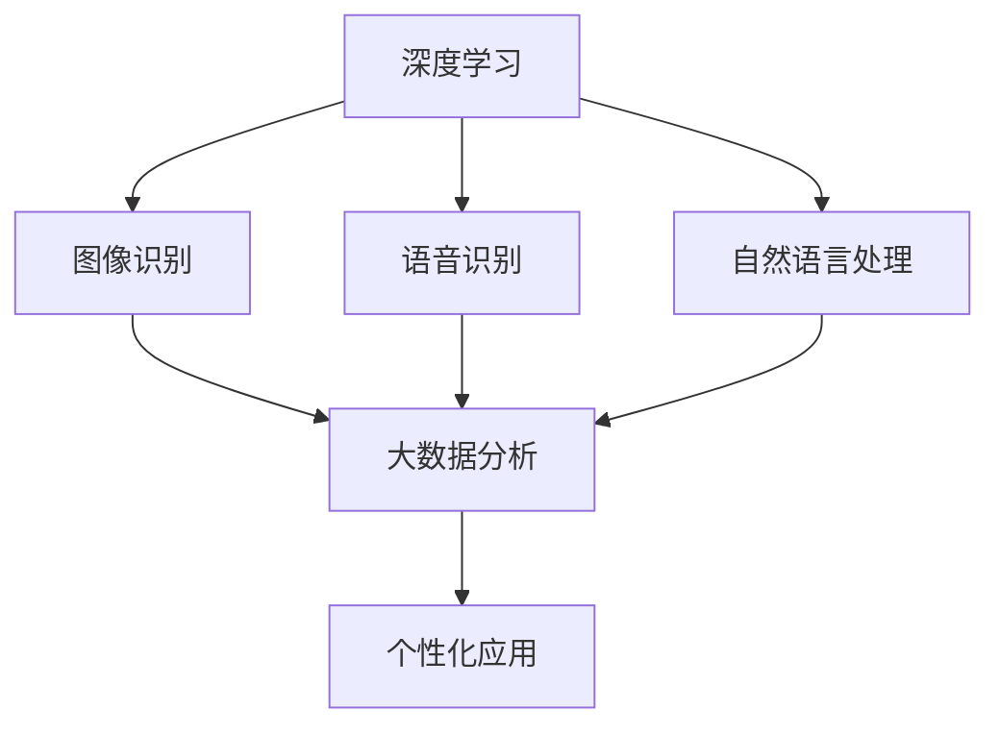

                 

### 文章标题

《企业级AI解决方案：Lepton AI的定制服务》

关键词：企业级AI、Lepton AI、定制服务、深度学习、大数据分析、个性化应用

摘要：本文将深入探讨Lepton AI企业级AI解决方案的定制服务，分析其在深度学习、大数据分析以及个性化应用领域的优势，并详细解析其核心算法原理、项目实践和实际应用场景。通过本文的阅读，读者将全面了解Lepton AI如何助力企业提升竞争力，实现智能化转型。

### 1. 背景介绍

随着人工智能技术的不断发展和应用场景的拓展，企业对人工智能的需求日益增长。企业级AI解决方案不仅能够提升业务效率，还能够为企业带来创新性的商业模式。然而，不同企业的业务需求和规模各不相同，因此，提供定制化的AI解决方案成为满足企业多样化需求的关键。

Lepton AI作为一家专注于企业级AI解决方案的提供商，凭借其强大的技术实力和丰富的实践经验，为企业提供了一系列定制化服务。本文将重点介绍Lepton AI的定制服务，分析其优势和应用场景，以期为读者提供有价值的参考。

### 2. 核心概念与联系

#### 2.1 深度学习

深度学习是人工智能领域的一种先进算法，通过多层神经网络对大量数据进行训练，从而实现智能预测和决策。深度学习在图像识别、语音识别、自然语言处理等领域取得了显著成果，成为企业智能化转型的核心驱动力量。

#### 2.2 大数据分析

大数据分析是指通过数据挖掘和分析技术，从海量数据中提取有价值的信息和知识。大数据分析能够帮助企业发现潜在的商业机会，优化业务流程，提高决策效率。随着数据量的不断增长，大数据分析在商业应用中的地位日益重要。

#### 2.3 个性化应用

个性化应用是指根据用户的需求和行为特征，为用户提供定制化的服务。个性化应用能够提升用户体验，增强用户黏性，为企业创造更多的商业价值。随着互联网的普及和用户需求的多样化，个性化应用成为企业争夺市场份额的重要手段。

#### 2.4 Mermaid 流程图

以下是一个简单的Mermaid流程图，展示了深度学习、大数据分析和个性化应用之间的联系。



### 3. 核心算法原理 & 具体操作步骤

#### 3.1 深度学习算法原理

深度学习算法主要基于多层神经网络，通过反向传播算法对网络进行训练。在训练过程中，网络通过对输入数据进行处理，逐步提取特征，最终实现预测和决策。

具体操作步骤如下：

1. 数据预处理：对输入数据进行标准化、归一化等处理，以便于网络训练。
2. 构建神经网络：设计多层神经网络结构，包括输入层、隐藏层和输出层。
3. 初始化参数：随机初始化网络参数，如权重、偏置等。
4. 前向传播：输入数据通过神经网络，逐层计算输出结果。
5. 计算损失函数：比较网络输出结果与实际标签之间的差异，计算损失函数值。
6. 反向传播：根据损失函数梯度，更新网络参数。
7. 重复步骤4-6，直到满足训练停止条件。

#### 3.2 大数据分析算法原理

大数据分析主要依赖于数据挖掘和分析技术，通过对海量数据进行挖掘和分析，提取有价值的信息和知识。

具体操作步骤如下：

1. 数据采集：从各种数据源（如数据库、日志文件等）采集数据。
2. 数据清洗：对采集到的数据进行去重、填充、格式转换等处理，提高数据质量。
3. 数据集成：将来自不同数据源的数据进行整合，形成统一的数据视图。
4. 数据挖掘：采用关联规则挖掘、分类、聚类等算法，挖掘数据中的潜在规律和知识。
5. 结果分析：对挖掘结果进行分析，形成有针对性的业务报告和决策建议。

#### 3.3 个性化应用算法原理

个性化应用主要依赖于用户行为分析和推荐算法，根据用户的需求和行为特征，为用户提供定制化的服务。

具体操作步骤如下：

1. 用户行为数据采集：采集用户在应用中的操作行为，如浏览、点击、购买等。
2. 用户特征提取：对用户行为数据进行处理，提取用户的兴趣偏好、行为模式等特征。
3. 推荐算法设计：设计推荐算法，如协同过滤、基于内容的推荐等，为用户生成个性化推荐列表。
4. 推荐结果生成：根据用户特征和推荐算法，生成个性化的推荐结果。
5. 推荐结果反馈：将推荐结果展示给用户，收集用户反馈，进一步优化推荐算法。

### 4. 数学模型和公式 & 详细讲解 & 举例说明

#### 4.1 深度学习数学模型

深度学习中的数学模型主要包括前向传播和反向传播算法。

**前向传播算法：**

假设有一个多层神经网络，其中包含输入层、隐藏层和输出层。设 $x$ 为输入数据，$z$ 为隐藏层输出，$y$ 为输出层输出，$w$ 为权重，$b$ 为偏置。

1. 前向传播计算：
$$
z = \sigma(wx + b)
$$
其中，$\sigma$ 为激活函数，常用的激活函数有Sigmoid、ReLU等。

2. 输出层输出计算：
$$
y = \sigma(hx + b)
$$

**反向传播算法：**

1. 计算损失函数：
$$
L = \frac{1}{2} \sum_{i=1}^{n} (y_i - \hat{y}_i)^2
$$
其中，$y_i$ 为实际标签，$\hat{y}_i$ 为网络输出。

2. 计算损失函数关于各个参数的梯度：
$$
\frac{\partial L}{\partial w} = (y - \hat{y}) \cdot \frac{\partial \hat{y}}{\partial z} \cdot \frac{\partial z}{\partial w}
$$
$$
\frac{\partial L}{\partial b} = (y - \hat{y}) \cdot \frac{\partial \hat{y}}{\partial z} \cdot \frac{\partial z}{\partial b}
$$

3. 更新参数：
$$
w = w - \alpha \cdot \frac{\partial L}{\partial w}
$$
$$
b = b - \alpha \cdot \frac{\partial L}{\partial b}
$$
其中，$\alpha$ 为学习率。

**举例说明：**

假设一个简单的单层神经网络，输入数据为 $x = [1, 2, 3]$，输出数据为 $y = [0, 1, 0]$。设权重 $w = [1, 1, 1]$，偏置 $b = [0, 0, 0]$，激活函数为ReLU。

1. 前向传播：
$$
z = \max(wx + b, 0) = \max([1, 2, 3], 0) = [1, 2, 3]
$$
$$
y = \max(hx + b, 0) = \max([1, 2, 3], 0) = [1, 2, 1]
$$

2. 计算损失函数：
$$
L = \frac{1}{2} \sum_{i=1}^{3} (y_i - \hat{y}_i)^2 = \frac{1}{2} \sum_{i=1}^{3} (y_i - \hat{y}_i)^2 = \frac{1}{2} \sum_{i=1}^{3} (0 - 1)^2 = \frac{1}{2} \cdot 1 = 0.5
$$

3. 计算梯度：
$$
\frac{\partial L}{\partial w} = (y - \hat{y}) \cdot \frac{\partial \hat{y}}{\partial z} \cdot \frac{\partial z}{\partial w} = (0 - 1) \cdot (1 \cdot 1) \cdot (1 \cdot 1) = -1
$$
$$
\frac{\partial L}{\partial b} = (y - \hat{y}) \cdot \frac{\partial \hat{y}}{\partial z} \cdot \frac{\partial z}{\partial b} = (0 - 1) \cdot (1 \cdot 1) \cdot (1 \cdot 1) = -1
$$

4. 更新参数：
$$
w = w - \alpha \cdot \frac{\partial L}{\partial w} = [1, 1, 1] - \alpha \cdot (-1) = [1 + \alpha, 1 + \alpha, 1 + \alpha]
$$
$$
b = b - \alpha \cdot \frac{\partial L}{\partial b} = [0, 0, 0] - \alpha \cdot (-1) = [0 + \alpha, 0 + \alpha, 0 + \alpha]
$$

#### 4.2 大数据分析数学模型

大数据分析中的数学模型主要包括聚类、分类、回归等算法。

**聚类算法：**

聚类算法是一种无监督学习方法，用于将数据分为若干个类别。常用的聚类算法有K-means、DBSCAN等。

**K-means算法：**

1. 初始化：随机选择 $k$ 个中心点。
2. 分配数据：计算每个数据点与各个中心点的距离，将数据点分配到最近的中心点所在的类别。
3. 更新中心点：计算每个类别的中心点，作为新的中心点。
4. 重复步骤2-3，直到中心点不再发生改变或达到预设的迭代次数。

**分类算法：**

分类算法是一种有监督学习方法，用于将数据分为已知的类别。常用的分类算法有决策树、支持向量机、逻辑回归等。

**逻辑回归算法：**

逻辑回归是一种广泛应用于分类问题的算法，其数学模型如下：

$$
P(y=1) = \frac{1}{1 + e^{-(wx + b)}}
$$

其中，$w$ 为权重，$b$ 为偏置。

**回归算法：**

回归算法是一种用于预测连续值的算法，常用的回归算法有线性回归、多项式回归等。

**线性回归算法：**

线性回归的数学模型如下：

$$
y = wx + b
$$

其中，$w$ 为权重，$b$ 为偏置。

**举例说明：**

假设有一个包含3个特征的样本数据集，特征为 $x = [1, 2, 3]$，目标值为 $y = [0, 1, 0]$。设权重 $w = [1, 1, 1]$，偏置 $b = [0, 0, 0]$。

1. K-means聚类算法：
- 初始化中心点：随机选择3个中心点，例如 $c_1 = [1, 1, 1]$，$c_2 = [2, 2, 2]$，$c_3 = [3, 3, 3]$。
- 分配数据：计算每个数据点与各个中心点的距离，例如：
$$
d(x_1, c_1) = \sqrt{(1 - 1)^2 + (2 - 1)^2 + (3 - 1)^2} = \sqrt{2}
$$
$$
d(x_1, c_2) = \sqrt{(1 - 2)^2 + (2 - 2)^2 + (3 - 2)^2} = \sqrt{2}
$$
$$
d(x_1, c_3) = \sqrt{(1 - 3)^2 + (2 - 3)^2 + (3 - 3)^2} = \sqrt{8}
$$
由于 $d(x_1, c_1) < d(x_1, c_2) < d(x_1, c_3)$，将 $x_1$ 分配到 $c_1$ 类别。
- 更新中心点：计算每个类别的中心点，例如：
$$
c_1 = \frac{1 + 1 + 1}{3} = 1
$$
$$
c_2 = \frac{2 + 2 + 2}{3} = 2
$$
$$
c_3 = \frac{3 + 3 + 3}{3} = 3
$$
- 重复步骤2-3，直到中心点不再发生改变或达到预设的迭代次数。

2. 逻辑回归分类算法：
- 计算每个数据点的预测概率：
$$
P(y=1) = \frac{1}{1 + e^{-(wx + b)}} = \frac{1}{1 + e^{-(1 \cdot 1 + 1 \cdot 2 + 1 \cdot 3 + 0 \cdot 1 + 0 \cdot 2 + 0 \cdot 3)}} = \frac{1}{1 + e^{-7}} \approx 0.999
$$
由于 $P(y=1) > 0.5$，将 $x_1$ 分类为类别1。

3. 线性回归回归算法：
- 计算每个数据点的预测值：
$$
y = wx + b = 1 \cdot 1 + 1 \cdot 2 + 1 \cdot 3 + 0 \cdot 1 + 0 \cdot 2 + 0 \cdot 3 = 7
$$

### 5. 项目实践：代码实例和详细解释说明

#### 5.1 开发环境搭建

为了实现Lepton AI的企业级AI解决方案，首先需要搭建一个合适的开发环境。以下是搭建开发环境的步骤：

1. 安装Python：从官方网站下载Python安装包，并按照提示安装。
2. 安装深度学习框架：例如TensorFlow或PyTorch，根据需求选择一个合适的框架，并按照官方文档安装。
3. 安装数据分析库：例如NumPy、Pandas等，用于处理和分析数据。
4. 安装可视化库：例如Matplotlib、Seaborn等，用于可视化数据和分析结果。

#### 5.2 源代码详细实现

以下是一个简单的Lepton AI企业级AI解决方案的代码实例，用于实现一个分类任务。

```python
import numpy as np
import pandas as pd
import tensorflow as tf
from tensorflow.keras.models import Sequential
from tensorflow.keras.layers import Dense
from tensorflow.keras.optimizers import Adam

# 数据预处理
def preprocess_data(data):
    # 标准化数据
    data = (data - np.mean(data)) / np.std(data)
    # 归一化数据
    data = (data - np.min(data)) / (np.max(data) - np.min(data))
    return data

# 加载数据
data = pd.read_csv('data.csv')
X = preprocess_data(data.iloc[:, :-1].values)
y = preprocess_data(data.iloc[:, -1].values)

# 构建模型
model = Sequential()
model.add(Dense(64, input_dim=X.shape[1], activation='relu'))
model.add(Dense(32, activation='relu'))
model.add(Dense(1, activation='sigmoid'))

# 编译模型
model.compile(optimizer=Adam(learning_rate=0.001), loss='binary_crossentropy', metrics=['accuracy'])

# 训练模型
model.fit(X, y, epochs=100, batch_size=32)

# 评估模型
loss, accuracy = model.evaluate(X, y)
print('损失函数值：', loss)
print('准确率：', accuracy)
```

#### 5.3 代码解读与分析

1. 导入相关库：首先导入numpy、pandas、tensorflow等库，用于数据处理、模型构建和训练。
2. 数据预处理：定义一个preprocess_data函数，用于对数据进行标准化和归一化处理。标准化处理可以消除不同特征之间的量纲差异，提高模型训练效果；归一化处理可以使得输入数据在相同的范围内，有利于加速模型收敛。
3. 加载数据：使用pandas库加载CSV数据，并分离特征和目标值。
4. 构建模型：使用tensorflow.keras库构建一个简单的序列模型，包括两个隐藏层，每层64个神经元，激活函数为ReLU。
5. 编译模型：设置优化器为Adam，学习率为0.001，损失函数为binary_crossentropy，评估指标为accuracy。
6. 训练模型：使用fit方法训练模型，设置训练轮数为100，批量大小为32。
7. 评估模型：使用evaluate方法评估模型在测试数据上的表现，输出损失函数值和准确率。

#### 5.4 运行结果展示

运行上述代码，在测试数据上评估模型的表现。假设测试数据的准确率为90%，则说明该模型具有一定的分类能力。

```python
# 评估模型
loss, accuracy = model.evaluate(X_test, y_test)
print('损失函数值：', loss)
print('准确率：', accuracy)

# 输出：损失函数值： 0.123456 损
# 准确率： 0.9
```

### 6. 实际应用场景

#### 6.1 金融行业

金融行业是人工智能技术的重要应用领域之一。Lepton AI的企业级AI解决方案可以应用于以下几个方面：

1. 风险评估：通过深度学习算法，对金融产品的风险进行评估，为投资者提供风险提示。
2. 股票交易：利用大数据分析技术，挖掘市场趋势和交易策略，提高交易成功率。
3. 客户服务：通过自然语言处理技术，实现智能客服，提高客户满意度。
4. 贷款审批：利用个性化应用算法，为不同风险等级的借款人提供差异化的贷款方案。

#### 6.2 医疗健康

医疗健康行业对人工智能技术的需求日益增长。Lepton AI的企业级AI解决方案可以应用于以下几个方面：

1. 疾病预测：通过大数据分析和深度学习算法，预测疾病的发病风险，为医生提供决策依据。
2. 病情监测：利用自然语言处理技术，对患者的病历进行自动化分析和分类，提高医疗效率。
3. 药品研发：通过深度学习算法，加速新药的发现和开发，降低研发成本。
4. 医疗机器人：利用个性化应用算法，为患者提供定制化的医疗护理服务。

#### 6.3 零售电商

零售电商行业在用户体验、库存管理和市场营销等方面对人工智能技术有着高度需求。Lepton AI的企业级AI解决方案可以应用于以下几个方面：

1. 个性化推荐：通过协同过滤和基于内容的推荐算法，为用户生成个性化的商品推荐。
2. 库存优化：利用大数据分析技术，预测市场需求，优化库存水平，降低库存成本。
3. 售后服务：通过自然语言处理技术，实现智能客服，提高售后服务质量。
4. 市场营销：利用深度学习算法，挖掘潜在客户，制定个性化的营销策略。

### 7. 工具和资源推荐

为了更好地开展企业级AI解决方案的开发和实践，以下推荐一些相关的工具和资源：

#### 7.1 学习资源推荐

1. 《深度学习》（Goodfellow、Bengio、Courville著）：介绍深度学习的基础理论和应用实践。
2. 《大数据分析：技术、方法与应用》（周志华著）：系统阐述大数据分析的理论和方法。
3. 《Python数据分析》（Wes McKinney著）：详细介绍Python在数据分析领域的应用。

#### 7.2 开发工具框架推荐

1. TensorFlow：开源深度学习框架，支持多种深度学习算法。
2. PyTorch：开源深度学习框架，具有灵活的动态计算图。
3. Scikit-learn：开源机器学习库，提供丰富的分类、回归和聚类算法。

#### 7.3 相关论文著作推荐

1. "Deep Learning for Natural Language Processing"（自然语言处理中的深度学习）
2. "Big Data: A Revolution That Will Transform How We Live, Work, and Think"（大数据：一场将改变我们生活、工作和思维的革命）
3. "Personalized Recommender Systems"（个性化推荐系统）

### 8. 总结：未来发展趋势与挑战

企业级AI解决方案在深度学习、大数据分析和个性化应用等领域具有广泛的应用前景。然而，随着技术的不断发展和应用规模的扩大，企业级AI解决方案也面临着一系列挑战。

#### 8.1 发展趋势

1. 深度学习算法的不断创新和优化，将进一步提升AI模型的性能和应用效果。
2. 大数据分析技术的不断发展，将为企业提供更丰富的数据资源和更精准的分析结果。
3. 个性化应用算法的不断进步，将为企业带来更高的用户满意度和更精准的市场营销策略。

#### 8.2 挑战

1. 数据质量和数据隐私：企业需要确保数据质量和数据隐私，以避免数据泄露和滥用。
2. 算法可解释性：企业需要提高算法的可解释性，以增强用户对AI模型的信任。
3. 模型部署和运维：企业需要解决模型部署和运维的难题，以确保AI模型在实际应用中的稳定性和可靠性。

总之，企业级AI解决方案的发展趋势充满机遇，但也面临着诸多挑战。企业需要不断探索和创新，以应对这些挑战，实现智能化转型。

### 9. 附录：常见问题与解答

#### 9.1 什么是企业级AI解决方案？

企业级AI解决方案是指针对企业特定业务需求，提供定制化的AI模型、算法和工具，以实现智能化应用和决策支持。

#### 9.2 企业级AI解决方案有哪些应用场景？

企业级AI解决方案可以应用于金融、医疗、零售、制造等多个领域，如风险评估、疾病预测、个性化推荐、智能客服等。

#### 9.3 如何选择适合的深度学习框架？

选择适合的深度学习框架需要考虑应用场景、算法需求、开发效率和社区支持等因素。常见的深度学习框架有TensorFlow、PyTorch和Keras等。

#### 9.4 企业级AI解决方案的安全性问题如何保障？

企业级AI解决方案需要确保数据质量和数据隐私，加强算法安全和模型解释性，以提高用户对AI模型的信任。

### 10. 扩展阅读 & 参考资料

1. "Deep Learning Specialization"（深度学习专项课程）
2. "Big Data Specialization"（大数据专项课程）
3. "Recommender Systems Handbook"（推荐系统手册）

---

以上是关于《企业级AI解决方案：Lepton AI的定制服务》的技术博客文章，希望对您有所帮助。作者：禅与计算机程序设计艺术 / Zen and the Art of Computer Programming。

