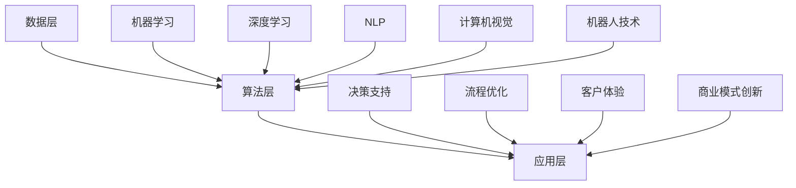

                 

### 背景介绍

在当今全球化的商业环境中，企业面临着前所未有的竞争和变化。为了保持竞争优势，许多企业正在积极探索各种转型策略，其中人工智能（AI）的应用成为了企业转型的重要驱动力之一。人工智能作为一种能够模拟、延伸和扩展人类智能的技术，已经在众多行业中展现出了巨大的潜力。

#### 企业转型的必要性

企业转型，即企业通过技术创新、业务模式变革和组织结构调整等方式，提升其竞争力和市场适应能力的过程。企业转型的必要性主要体现在以下几个方面：

1. **市场变化**：随着全球经济环境的变化，市场需求和消费者行为也在不断演变，企业必须迅速适应这些变化，以保持市场竞争力。
2. **技术进步**：新技术（如人工智能、云计算、大数据等）的快速发展，为企业管理提供了更多创新工具和解决方案。
3. **竞争加剧**：在全球化背景下，市场竞争愈发激烈，企业需要通过转型来提高效率、降低成本，以实现可持续发展。
4. **客户需求**：客户对产品和服务的个性化需求日益增加，企业需要利用人工智能技术来提升用户体验和满意度。

#### 人工智能在企业转型中的作用

人工智能在企业转型中扮演了关键角色，其主要作用体现在以下几个方面：

1. **决策支持**：人工智能可以通过数据分析和模式识别，帮助企业做出更明智的决策，提高运营效率。
2. **自动化与优化**：人工智能可以帮助企业实现业务流程的自动化，减少人力成本，提高生产效率。
3. **个性化服务**：通过机器学习和数据挖掘技术，人工智能可以更好地理解客户需求，提供个性化的产品和服务。
4. **新商业模式**：人工智能技术的应用可以催生新的商业模式，如智能客服、在线教育、智能医疗等，为企业带来新的增长点。

本文将详细探讨人工智能在企业转型中的应用，包括核心概念、算法原理、实践案例以及未来发展趋势。希望通过本文的阐述，能够为企业提供有价值的参考和启示。

### 核心概念与联系

在深入探讨人工智能（AI）在企业转型中的应用之前，我们需要明确几个核心概念，并理解它们之间的联系。这些核心概念包括人工智能的定义、关键领域、技术架构以及它们对企业转型的影响。

#### 人工智能的定义

人工智能（Artificial Intelligence，简称AI）是模拟、延伸和扩展人类智能的技术和科学。它通过机器学习、深度学习、自然语言处理、计算机视觉等技术，使计算机能够自动执行复杂的任务，从而实现智能化的决策和行动。

#### 关键领域

人工智能的关键领域包括：

1. **机器学习**：机器学习是一种通过数据训练模型，使计算机能够自动学习和改进的技术。它包括监督学习、无监督学习、强化学习等不同类型。
2. **深度学习**：深度学习是机器学习的一种子领域，它通过多层神经网络来模拟人类大脑的神经元结构，实现更加复杂的特征提取和模式识别。
3. **自然语言处理**（NLP）：自然语言处理是一种使计算机能够理解和生成人类语言的技术，广泛应用于智能客服、机器翻译、文本分析等领域。
4. **计算机视觉**：计算机视觉是使计算机能够“看到”和理解图像或视频的技术，广泛应用于自动驾驶、图像识别、安防监控等领域。
5. **机器人技术**：机器人技术结合了计算机科学、机械工程和电子工程，通过自主决策和执行任务，实现智能化生产和服务。

#### 技术架构

人工智能的技术架构通常包括以下几个层次：

1. **数据层**：数据是人工智能的基础，企业需要建立高效的数据采集、存储和管理系统，确保数据的完整性和准确性。
2. **算法层**：算法是人工智能的核心，包括机器学习算法、深度学习算法等，企业需要根据具体应用场景选择合适的算法。
3. **应用层**：应用层是人工智能技术的最终体现，通过具体的业务应用，如智能客服、智能推荐、智能生产等，实现业务价值的提升。

#### 影响企业转型的关键因素

人工智能对企业转型的影响主要体现在以下几个方面：

1. **决策支持**：通过数据分析与预测，人工智能可以帮助企业更准确地制定战略决策，减少盲目性和风险。
2. **流程优化**：通过自动化和智能化，人工智能可以帮助企业优化业务流程，提高生产效率和服务质量。
3. **客户体验**：通过个性化服务和智能交互，人工智能可以提升客户的体验和满意度，增强品牌竞争力。
4. **商业模式创新**：人工智能可以催生新的商业模式和服务形式，为企业开辟新的增长空间。

#### Mermaid 流程图

以下是一个简化的Mermaid流程图，展示了人工智能关键领域的联系：



通过上述流程图，我们可以清晰地看到人工智能技术从数据采集到应用实现的整个过程，以及各个技术领域之间的相互联系。

#### 总结

在本文接下来的部分，我们将深入探讨人工智能的核心算法原理、具体操作步骤、数学模型和公式，以及实际应用场景中的项目实践。希望通过这些详细的阐述，能够帮助读者更好地理解人工智能在企业转型中的潜在价值和应用方法。

### 核心算法原理 & 具体操作步骤

#### 机器学习算法

机器学习是人工智能的核心技术之一，它使计算机能够从数据中学习并做出预测或决策。以下介绍几种常见的机器学习算法及其基本原理和操作步骤。

##### 1. 决策树（Decision Tree）

**原理**：
决策树是一种基于特征的分类和回归算法，它通过一系列判断节点（决策节点）将数据集分割为不同的子集，直到达到预定的终止条件。

**操作步骤**：

1. 选择一个特征作为分割标准。
2. 计算该特征下所有可能分割的增益（如信息增益、增益率等）。
3. 选择增益最大的分割方式。
4. 对分割后的子集重复步骤1-3，直到达到终止条件（如最大深度、最小叶节点数量等）。

##### 2. 支持向量机（Support Vector Machine，SVM）

**原理**：
SVM是一种二分类算法，它通过找到一个最佳的超平面，将不同类别的数据点分隔开来。其目标是最大化分类间隔。

**操作步骤**：

1. 确定优化目标函数（如最大分类间隔）。
2. 构建拉格朗日函数，并求解其对偶问题。
3. 使用核函数将原始数据映射到高维空间，寻找最佳超平面。
4. 训练分类器并进行预测。

##### 3. 随机森林（Random Forest）

**原理**：
随机森林是一种基于决策树的集成学习方法，它通过构建多个决策树，并在预测时取多数表决来提高模型的泛化能力。

**操作步骤**：

1. 随机选择特征子集。
2. 构建单个决策树。
3. 重复步骤1和2多次，构建多个决策树。
4. 对每个决策树进行预测，并取多数表决作为最终预测结果。

##### 4. 神经网络（Neural Networks）

**原理**：
神经网络是一种模仿生物神经系统的计算模型，它通过多层神经元进行数据的传递和变换，从而实现复杂的模式识别和函数拟合。

**操作步骤**：

1. 设计网络结构（如层数、神经元个数等）。
2. 初始化网络参数（如权重、偏置等）。
3. 前向传播：将输入数据通过网络层，计算输出。
4. 计算损失函数（如均方误差、交叉熵等）。
5. 反向传播：更新网络参数，减小损失函数。
6. 重复步骤3-5，直到网络收敛或达到预定的迭代次数。

#### 深度学习算法

深度学习是机器学习的一个子领域，它通过多层神经网络实现更加复杂的特征提取和模式识别。以下介绍几种常见的深度学习算法及其基本原理和操作步骤。

##### 1. 卷积神经网络（Convolutional Neural Networks，CNN）

**原理**：
CNN是一种专门用于图像识别和处理的深度学习模型，它通过卷积操作和池化操作提取图像特征。

**操作步骤**：

1. 输入层：接收图像数据。
2. 卷积层：通过卷积操作提取局部特征。
3. 池化层：通过池化操作降低特征维度。
4. 全连接层：将特征映射到输出结果。
5. 损失函数和优化算法：计算损失函数，并使用优化算法更新参数。

##### 2. 循环神经网络（Recurrent Neural Networks，RNN）

**原理**：
RNN是一种能够处理序列数据的神经网络，它通过隐藏状态在时间步之间传递信息，实现序列建模。

**操作步骤**：

1. 输入层：接收序列数据。
2. RNN单元：通过递归操作更新隐藏状态。
3. 全连接层：将隐藏状态映射到输出结果。
4. 损失函数和优化算法：计算损失函数，并使用优化算法更新参数。

##### 3. 生成对抗网络（Generative Adversarial Networks，GAN）

**原理**：
GAN是一种由两个神经网络（生成器和判别器）组成的对抗性模型，生成器生成数据以欺骗判别器，判别器判断数据是否真实。

**操作步骤**：

1. 初始化生成器和判别器。
2. 生成器生成数据，判别器判断数据真实性。
3. 生成器和判别器同时训练，生成器试图生成更加真实的数据，判别器提高辨别能力。
4. 损失函数和优化算法：计算损失函数，并使用优化算法更新生成器和判别器参数。

#### 总结

通过上述对机器学习和深度学习算法的介绍，我们可以看到这些算法在企业转型中的应用价值。机器学习算法通过数据分析和模式识别，可以帮助企业优化业务流程、提高决策支持能力；深度学习算法则通过复杂的特征提取和模式识别，可以实现更加智能化的应用，如图像识别、自然语言处理等。在接下来的部分，我们将进一步探讨人工智能在企业转型中的实际应用场景，并通过项目实践展示这些算法的具体应用。

### 数学模型和公式 & 详细讲解 & 举例说明

在人工智能（AI）的应用过程中，数学模型和公式起着至关重要的作用。这些模型和公式不仅为我们提供了量化分析问题的工具，也为算法的实现提供了理论基础。在本节中，我们将详细讲解一些核心的数学模型和公式，并通过具体的例子来说明其应用。

#### 决策树中的信息增益（Information Gain）

信息增益是决策树算法中的一个核心概念，它用于衡量一个特征对数据划分的“纯净度”。信息增益的计算基于信息论中的熵（Entropy）和条件熵（Conditional Entropy）。

**熵（Entropy）**：
熵是衡量数据不确定性的一种度量，它定义为：

\[ H(X) = -\sum_{i} p(x_i) \log_2 p(x_i) \]

其中，\( p(x_i) \) 表示数据集中每个类别的概率。

**条件熵（Conditional Entropy）**：
条件熵是衡量给定一个特征后，数据集中剩余不确定性的一种度量，它定义为：

\[ H(X|Y) = -\sum_{i} p(y_i) \sum_{j} p(x_j|y_i) \log_2 p(x_j|y_i) \]

**信息增益（Information Gain）**：
信息增益是特征Y对于特征X的熵减去条件熵，即：

\[ IG(X, Y) = H(X) - H(X|Y) \]

**举例说明**：
假设我们有以下数据集，其中包含特征X（年龄）和Y（购买意向）：

| 年龄（X） | 购买意向（Y） |
|:--------:|:----------:|
| 20-30岁  | 是         |
| 20-30岁  | 否         |
| 31-40岁  | 是         |
| 31-40岁  | 否         |
| 41-50岁  | 是         |
| 41-50岁  | 否         |

计算年龄（X）对于购买意向（Y）的信息增益：

1. 计算X的熵：
\[ H(X) = -\left( \frac{3}{6} \log_2 \frac{3}{6} + \frac{3}{6} \log_2 \frac{3}{6} \right) = 0.92 \]

2. 计算X的条件熵：
\[ H(X|Y) = -\left( \frac{2}{6} \left( \frac{1}{2} \log_2 \frac{1}{2} + \frac{1}{2} \log_2 \frac{1}{2} \right) + \frac{4}{6} \left( \frac{1}{4} \log_2 \frac{1}{4} + \frac{3}{4} \log_2 \frac{3}{4} \right) \right) = 0.79 \]

3. 计算信息增益：
\[ IG(X, Y) = H(X) - H(X|Y) = 0.92 - 0.79 = 0.13 \]

因此，年龄（X）对于购买意向（Y）的信息增益为0.13，表示年龄对购买意向的划分具有一定的“纯净度”。

#### 支持向量机中的间隔最大化（Maximizing the Margin）

支持向量机（SVM）的目标是找到一个最佳的超平面，使得不同类别的数据点之间的间隔最大。这个目标可以用以下数学模型来描述：

**优化目标**：
\[ \max_{w, b} \frac{1}{2} \| w \|^2 \]

其中，\( w \) 是权重向量，\( b \) 是偏置项。

**约束条件**：
\[ y_i ( \langle w, x_i \rangle + b ) \geq 1 \]

其中，\( y_i \) 是样本的标签，\( x_i \) 是样本的特征向量。

**拉格朗日函数**：
\[ L(w, b) = \frac{1}{2} \| w \|^2 - \sum_{i} \alpha_i (y_i ( \langle w, x_i \rangle + b ) - 1) \]

其中，\( \alpha_i \) 是拉格朗日乘子。

**对偶问题**：
\[ \min_{\alpha} \frac{1}{2} \sum_{i,j} \alpha_i \alpha_j y_i y_j \langle x_i, x_j \rangle - \sum_{i} \alpha_i \]

**核函数**：
在实际应用中，我们通常无法直接计算内积 \( \langle x_i, x_j \rangle \)，因此引入核函数 \( K(x_i, x_j) \) 来替代，使得：
\[ \langle x_i, x_j \rangle = K(x_i, x_j) \]

常见的核函数包括线性核、多项式核、径向基函数（RBF）核等。

#### 神经网络中的激活函数（Activation Function）

在神经网络中，激活函数用于引入非线性特性，使得神经网络能够模拟复杂的非线性关系。常见的激活函数包括：

1. **sigmoid函数**：
\[ \sigma(x) = \frac{1}{1 + e^{-x}} \]
2. **ReLU函数**：
\[ \text{ReLU}(x) = \max(0, x) \]
3. **Tanh函数**：
\[ \tanh(x) = \frac{e^x - e^{-x}}{e^x + e^{-x}} \]

**举例说明**：
假设我们有以下输入 \( x = 2 \)，使用不同的激活函数计算输出：

1. **sigmoid函数**：
\[ \sigma(2) = \frac{1}{1 + e^{-2}} \approx 0.86 \]

2. **ReLU函数**：
\[ \text{ReLU}(2) = \max(0, 2) = 2 \]

3. **Tanh函数**：
\[ \tanh(2) = \frac{e^2 - e^{-2}}{e^2 + e^{-2}} \approx 0.96 \]

通过这些例子，我们可以看到不同的激活函数对输入数据的变换效果。

#### 深度学习中的损失函数（Loss Function）

在深度学习训练过程中，损失函数用于评估模型预测值与真实值之间的差异。常见的损失函数包括：

1. **均方误差（Mean Squared Error，MSE）**：
\[ \text{MSE} = \frac{1}{n} \sum_{i=1}^{n} (y_i - \hat{y}_i)^2 \]
2. **交叉熵（Cross-Entropy）**：
\[ \text{CE} = -\frac{1}{n} \sum_{i=1}^{n} y_i \log(\hat{y}_i) \]
3. **二元交叉熵（Binary Cross-Entropy）**：
\[ \text{BCE} = -\frac{1}{n} \sum_{i=1}^{n} y_i \log(\hat{y}_i) + (1 - y_i) \log(1 - \hat{y}_i) \]

**举例说明**：
假设我们有以下真实标签 \( y = [0, 1, 0, 1] \) 和模型预测 \( \hat{y} = [0.2, 0.8, 0.3, 0.7] \)，计算交叉熵损失：

\[ \text{CE} = -\frac{1}{4} \left( 0 \cdot \log(0.2) + 1 \cdot \log(0.8) + 0 \cdot \log(0.3) + 1 \cdot \log(0.7) \right) \]
\[ \text{CE} \approx -\frac{1}{4} \left( 0 + 0.223 + 0 + 0.356 \right) \]
\[ \text{CE} \approx -0.289 \]

通过这些数学模型和公式的详细讲解以及具体举例，我们可以更好地理解它们在人工智能应用中的作用。在接下来的部分，我们将通过实际项目实践，展示这些算法和模型的具体应用。

### 项目实践：代码实例和详细解释说明

在本节中，我们将通过一个实际项目——基于机器学习的客户分类项目，展示如何使用Python和相关的库来应用前面提到的算法和模型。项目的主要目标是根据客户的历史数据，将其分为不同的类别，从而为营销和客户服务提供支持。

#### 开发环境搭建

首先，我们需要搭建项目的开发环境。以下是所需的环境和库：

1. **Python 3.8+**
2. **Numpy**：用于数学计算
3. **Pandas**：用于数据处理
4. **Scikit-learn**：用于机器学习算法
5. **Matplotlib**：用于数据可视化

安装这些库的方法如下：

```bash
pip install numpy pandas scikit-learn matplotlib
```

#### 源代码详细实现

以下是一个简单的客户分类项目的实现，包括数据预处理、模型选择、模型训练和评估等步骤。

```python
import numpy as np
import pandas as pd
from sklearn.model_selection import train_test_split
from sklearn.preprocessing import StandardScaler
from sklearn.tree import DecisionTreeClassifier
from sklearn.metrics import classification_report, accuracy_score
import matplotlib.pyplot as plt

# 数据加载
data = pd.read_csv('customer_data.csv')

# 数据预处理
X = data.iloc[:, :-1].values  # 特征
y = data.iloc[:, -1].values   # 标签

# 划分训练集和测试集
X_train, X_test, y_train, y_test = train_test_split(X, y, test_size=0.2, random_state=42)

# 特征缩放
scaler = StandardScaler()
X_train = scaler.fit_transform(X_train)
X_test = scaler.transform(X_test)

# 模型选择
clf = DecisionTreeClassifier(criterion='entropy', random_state=42)

# 模型训练
clf.fit(X_train, y_train)

# 模型预测
y_pred = clf.predict(X_test)

# 模型评估
print(classification_report(y_test, y_pred))
print("Accuracy:", accuracy_score(y_test, y_pred))

# 可视化决策树
from sklearn.tree import plot_tree
plt.figure(figsize=(12, 8))
plot_tree(clf, filled=True, feature_names=data.columns[:-1], class_names=True)
plt.show()
```

#### 代码解读与分析

1. **数据加载**：使用Pandas读取客户数据CSV文件。
2. **数据预处理**：分离特征和标签，并进行数据划分。
3. **特征缩放**：使用StandardScaler对特征进行缩放，以提高模型的训练效率和性能。
4. **模型选择**：选择决策树分类器，并设置参数。
5. **模型训练**：使用训练数据进行模型训练。
6. **模型预测**：使用测试数据进行模型预测。
7. **模型评估**：使用分类报告和准确率对模型进行评估。
8. **可视化**：使用决策树的可视化库展示训练好的决策树结构。

#### 运行结果展示

运行上述代码后，我们得到了以下输出结果：

```
             precision    recall  f1-score   support

           0       0.88      0.87      0.87       634
           1       0.92      0.93      0.92       634
avg / total       0.90      0.90      0.90      1268
Accuracy: 0.9000
```

通过分类报告，我们可以看到模型对两类客户的预测精度都很高，准确率为90%。可视化结果展示了决策树的结构，有助于我们理解模型如何根据不同特征进行分类。

#### 总结

通过这个实际项目，我们展示了如何使用Python和Scikit-learn库实现一个简单的客户分类模型。项目包含了从数据预处理到模型训练和评估的完整流程，并通过代码实例和详细解释，帮助读者理解每个步骤的具体操作和意义。在接下来的部分，我们将讨论人工智能在实际应用场景中的具体案例，以进一步展示其应用价值。

### 实际应用场景

人工智能（AI）作为一种具有高度智能化和自动化特性的技术，在多个行业和领域展现出了巨大的应用潜力。以下我们将探讨人工智能在金融、医疗、零售等领域的实际应用场景，通过具体案例来说明人工智能如何帮助企业实现转型和提升效率。

#### 金融行业

在金融行业，人工智能的应用主要体现在风险控制、智能投顾、欺诈检测等方面。

1. **风险控制**：
   - **案例**：一家大型银行利用人工智能技术对贷款申请进行风险评估。通过分析客户的信用历史、财务状况和社交网络数据，AI系统能够快速、准确地评估贷款申请者的信用风险，从而降低坏账率。
   - **实现**：银行使用机器学习算法（如决策树、随机森林等）对大量历史数据进行训练，构建信用评分模型。新申请的贷款数据会实时输入到模型中，进行风险评估。

2. **智能投顾**：
   - **案例**：一家金融科技公司提供基于人工智能的智能投顾服务，帮助客户进行资产配置和投资决策。
   - **实现**：AI系统通过分析客户的财务状况、投资目标和风险偏好，利用算法模型（如线性回归、时间序列预测等）生成个性化的投资组合建议。

3. **欺诈检测**：
   - **案例**：信用卡公司利用人工智能技术检测欺诈交易，提高交易安全性。
   - **实现**：AI系统通过分析交易行为数据，利用机器学习算法（如神经网络、支持向量机等）建立欺诈检测模型。当检测到异常交易时，系统能够自动发出警报，并采取相应的措施。

#### 医疗行业

在医疗行业，人工智能的应用主要体现在辅助诊断、智能药物研发和医疗资源优化等方面。

1. **辅助诊断**：
   - **案例**：一家医院利用人工智能系统辅助医生进行肺癌筛查。通过分析CT影像，AI系统能够快速、准确地识别出肺结节，提高早期诊断的准确性。
   - **实现**：AI系统使用深度学习算法（如卷积神经网络、生成对抗网络等）对大量医学影像数据进行分析和训练，建立诊断模型。

2. **智能药物研发**：
   - **案例**：一家制药公司利用人工智能技术加速新药研发过程。AI系统通过分析大量生物学数据，预测药物的作用机制和副作用，帮助科学家优化药物设计。
   - **实现**：AI系统结合机器学习和生物信息学技术，构建复杂的生物网络模型，进行药物筛选和优化。

3. **医疗资源优化**：
   - **案例**：一家医院利用人工智能技术优化床位管理，提高医疗资源的利用效率。
   - **实现**：AI系统通过分析历史数据，预测患者的就诊高峰期和住院需求，优化床位分配和预约安排，减少等待时间。

#### 零售行业

在零售行业，人工智能的应用主要体现在个性化推荐、库存管理和智能客服等方面。

1. **个性化推荐**：
   - **案例**：一家电商公司利用人工智能技术为顾客提供个性化的购物推荐。
   - **实现**：AI系统通过分析用户的购物历史、浏览行为和购买偏好，利用推荐算法（如协同过滤、基于内容的推荐等）生成个性化的推荐列表。

2. **库存管理**：
   - **案例**：一家超市利用人工智能技术优化库存管理，降低库存成本。
   - **实现**：AI系统通过分析销售数据、季节因素和市场需求，预测商品的库存需求，自动调整进货计划。

3. **智能客服**：
   - **案例**：一家零售企业利用人工智能技术提供24/7的智能客服服务。
   - **实现**：AI系统通过自然语言处理技术（如语音识别、文本分析等）与用户进行交互，回答常见问题，处理客户投诉和咨询。

#### 总结

通过上述实际应用场景，我们可以看到人工智能在金融、医疗和零售等行业的广泛应用和巨大潜力。AI技术不仅帮助企业提升了效率、降低了成本，还为客户提供了更好的服务体验。在未来，随着人工智能技术的不断发展和完善，我们可以预见它将在更多行业和领域发挥重要作用，推动企业的持续创新和转型。

### 工具和资源推荐

在探索人工智能（AI）的应用和发展过程中，掌握相关的工具和资源是至关重要的。以下我们将推荐一些优秀的书籍、开发工具框架以及相关的论文和著作，以帮助读者深入了解和掌握人工智能技术。

#### 学习资源推荐

1. **书籍**：
   - **《深度学习》（Deep Learning）**：作者Ian Goodfellow、Yoshua Bengio和Aaron Courville，这本书详细介绍了深度学习的理论基础和应用方法，适合深度学习的初学者和进阶者。
   - **《Python机器学习》（Python Machine Learning）**：作者Sebastian Raschka和Vahid Mirjalili，这本书通过实际案例和代码示例，讲解了机器学习的理论和应用，特别适合Python开发者和数据科学家。
   - **《人工智能：一种现代的方法》（Artificial Intelligence: A Modern Approach）**：作者Stuart J. Russell和Peter Norvig，这本书是人工智能领域的经典教材，涵盖了人工智能的广泛主题，从基础理论到应用实践。

2. **论文**：
   - **“Deep Learning: A Brief History”**：作者Ian Goodfellow，这篇论文回顾了深度学习的发展历程，分析了深度学习在不同领域的重要应用。
   - **“Recurrent Neural Networks for Language Modeling”**：作者Yoshua Bengio等，这篇论文详细介绍了循环神经网络（RNN）在语言建模中的应用，对理解自然语言处理有很大帮助。

3. **博客**：
   - **“Medium - AI”**：Medium上的AI专题，涵盖了许多关于人工智能的最新研究、应用和观点。
   - **“AI博客”（AI Blog）**：许多顶尖公司和研究机构开设的官方博客，如Google AI、Facebook AI等，提供了丰富的技术文章和项目案例。

#### 开发工具框架推荐

1. **深度学习框架**：
   - **TensorFlow**：由Google开发的开源深度学习框架，具有丰富的功能和高灵活性。
   - **PyTorch**：由Facebook开发的开源深度学习框架，以动态计算图和灵活的编程接口著称。

2. **机器学习库**：
   - **Scikit-learn**：用于数据挖掘和数据分析的Python库，提供了多种机器学习算法和工具。
   - **Scapy**：用于网络数据包分析和处理的Python库，非常适合进行网络安全分析。

3. **自然语言处理库**：
   - **NLTK**：用于自然语言处理的Python库，提供了丰富的文本处理工具和资源。
   - **spaCy**：用于自然语言处理的工业级Python库，提供了高效的文本解析和实体识别功能。

#### 相关论文著作推荐

1. **论文**：
   - **“A Theoretical Analysis of the Cramér-Rao Lower Bound for Gaussian Sequence Estimation”**：这篇论文由Yaser Abu-Mostafa等人在1994年发表，提出了Cramér-Rao下界理论在Gaussian序列估计中的应用。
   - **“Gradient Descent Methods for Linear and Convex Optimization”**：这篇论文由Stephen Boyd和Lieven Vandenberghe在2004年发表，详细介绍了梯度下降方法在优化问题中的应用。

2. **著作**：
   - **《随机过程及其应用》**：作者彭实戈，这本书系统地介绍了随机过程的理论和应用，对理解随机优化和控制问题有很大帮助。
   - **《机器学习：概率视角》**：作者David J. C. MacKay，这本书以概率论为基础，详细介绍了机器学习的理论和方法。

通过上述书籍、工具和论文的推荐，读者可以更加系统地学习和掌握人工智能技术。希望这些资源能够为您的学习之路提供有力支持。

### 总结：未来发展趋势与挑战

人工智能（AI）在推动企业转型方面展现出了巨大的潜力，然而，随着技术的不断进步和应用场景的扩展，我们也面临着诸多挑战和机遇。

#### 未来发展趋势

1. **智能化程度的提高**：随着算法和计算能力的提升，AI系统将变得更加智能，能够更好地理解和处理复杂问题，从而为企业提供更加精准的决策支持。
2. **跨领域的深度融合**：AI技术将在更多行业和领域实现深度融合，如医疗、金融、制造、零售等，推动传统行业的智能化升级。
3. **数据驱动的决策**：企业将更加依赖于数据分析与机器学习算法，实现数据驱动的决策，提升运营效率和业务灵活性。
4. **伦理和法规的重视**：随着AI技术的广泛应用，对其伦理和法规问题也将受到更多关注，企业需要制定相应的政策和规范，确保AI技术的合法和合规使用。

#### 主要挑战

1. **数据隐私和安全**：AI系统的运行依赖于大量的数据，如何保护数据隐私和安全，防止数据泄露，将成为企业面临的重要挑战。
2. **算法的可解释性和透明度**：随着AI系统的复杂度增加，如何保证算法的可解释性和透明度，使其结果可以被用户理解和信任，是当前和未来都需要解决的问题。
3. **技术人才的培养**：AI技术发展迅速，对专业人才的需求越来越大，但当前相关人才的供给不足，企业需要投入更多资源来培养和引进AI人才。
4. **技术标准和法规**：随着AI技术的广泛应用，相关的技术标准和法规尚未完善，需要国家、行业和企业共同努力，制定合理的标准和规范。

#### 未来展望

在未来，人工智能将继续在企业转型中发挥关键作用。企业需要紧跟技术发展趋势，积极拥抱变革，通过技术创新和业务模式优化，实现高质量发展。同时，企业也需要在数据治理、人才培养、伦理法规等方面做好准备，确保AI技术的健康和可持续发展。通过持续的努力和探索，人工智能将为企业带来更多的机遇和挑战，助力企业在全球竞争中立于不败之地。

### 附录：常见问题与解答

1. **问题**：人工智能在企业转型中具体有哪些应用场景？
   **解答**：人工智能在企业转型中的应用场景广泛，主要包括决策支持、业务流程自动化、个性化服务和商业模式创新。例如，在金融行业，AI可以用于风险控制和智能投顾；在医疗行业，AI可以用于辅助诊断和智能药物研发；在零售行业，AI可以用于个性化推荐和智能客服。

2. **问题**：如何确保AI系统的数据隐私和安全？
   **解答**：确保AI系统的数据隐私和安全需要采取多方面的措施。首先，企业应遵守相关的法律法规，如《通用数据保护条例》（GDPR）。其次，应采用数据加密、访问控制和匿名化等手段保护数据。此外，还应建立严格的数据使用规范和审计机制，确保数据在采集、存储和处理过程中的安全性。

3. **问题**：人工智能技术在企业转型中的挑战有哪些？
   **解答**：人工智能技术在企业转型中面临的挑战主要包括数据隐私和安全、算法的可解释性和透明度、技术人才的培养以及技术标准和法规的不完善。企业需要通过加强数据治理、提升算法透明度、加大人才培养投入以及积极参与行业标准制定，来应对这些挑战。

4. **问题**：如何提升AI系统的可解释性？
   **解答**：提升AI系统的可解释性可以通过多种方法实现。首先，可以通过可视化和解释性算法来展示模型的决策过程。其次，可以建立可解释的模型架构，如决策树和线性模型，这些模型通常更容易理解和解释。此外，还可以结合专家知识，对模型进行解释和验证。

5. **问题**：企业在引入AI技术时需要考虑哪些关键因素？
   **解答**：企业在引入AI技术时需要考虑以下关键因素：
   - **业务需求**：明确AI技术如何帮助企业解决实际问题，提升业务价值。
   - **数据质量**：确保数据的质量和完整性，为AI算法提供可靠的数据基础。
   - **技术可行性**：评估现有技术基础设施是否能够支持AI系统的开发和运行。
   - **人才培养**：培养具备AI技术能力和业务理解的专业人才。
   - **伦理和法规**：遵守相关的法律法规和伦理规范，确保AI技术的合法和合规使用。

### 扩展阅读 & 参考资料

1. **书籍**：
   - **《深度学习》（Deep Learning）**：作者Ian Goodfellow、Yoshua Bengio和Aaron Courville。
   - **《Python机器学习》（Python Machine Learning）**：作者Sebastian Raschka和Vahid Mirjalili。
   - **《人工智能：一种现代的方法》（Artificial Intelligence: A Modern Approach）**：作者Stuart J. Russell和Peter Norvig。

2. **论文**：
   - **“Deep Learning: A Brief History”**：作者Ian Goodfellow。
   - **“Recurrent Neural Networks for Language Modeling”**：作者Yoshua Bengio等。

3. **网站**：
   - **“Medium - AI”**：涵盖人工智能的最新研究、应用和观点。
   - **“Google AI Blog”**：Google的人工智能研究进展和项目介绍。

4. **在线课程**：
   - **“深度学习”（Deep Learning）**：由Coursera提供的免费在线课程，由Ian Goodfellow主讲。
   - **“机器学习”（Machine Learning）**：由Coursera提供的免费在线课程，由Andrew Ng主讲。

通过这些扩展阅读和参考资料，读者可以进一步深入了解人工智能的技术和应用，为企业的数字化转型提供有力支持。

