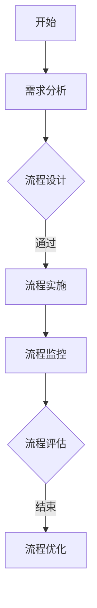

                 

### 1. 背景介绍

在现代企业中，业务流程的优化已成为提升效率、降低成本、增强竞争力的重要手段。随着信息技术的飞速发展，业务流程的复杂性和多样性不断增大，传统的优化方法往往无法满足高效、灵活的要求。因此，我们需要引入更为先进和科学的策略，以实现对业务流程的全面优化。

本文旨在探讨一系列优化业务流程提高效率的策略，通过深入分析这些策略的理论基础、具体实施步骤以及在实际应用中的效果，帮助读者理解和掌握如何有效提升业务流程的效率。这些策略涵盖了从流程设计到执行监控的各个环节，旨在为企业和组织的业务流程优化提供系统性的解决方案。

本文的核心内容将包括以下几个部分：

1. **核心概念与联系**：首先，我们将介绍优化业务流程所需的一些核心概念，并通过Mermaid流程图展示业务流程优化的基本架构和关键环节。
2. **核心算法原理与具体操作步骤**：接着，我们将详细讲解几种经典的优化算法，包括它们的原理和具体的实施步骤。
3. **数学模型和公式**：为了更好地理解这些算法，我们将引入相关的数学模型和公式，并通过实际案例进行详细解释。
4. **项目实践**：我们将通过一个具体的代码实例，展示如何将理论应用于实践，并提供详细的代码解读与分析。
5. **实际应用场景**：最后，我们将讨论这些优化策略在不同业务场景中的应用，并提供实用的工具和资源推荐。

通过本文的阅读，读者将能够系统地了解业务流程优化的策略和方法，并具备在实际工作中应用这些策略的能力。

### 2. 核心概念与联系

在探讨业务流程优化之前，我们需要明确几个核心概念，这些概念构成了优化业务流程的理论基础，也是实现优化策略的关键要素。

#### 业务流程定义

业务流程（Business Process）是指一组相互关联的活动，这些活动共同实现某个特定的业务目标。业务流程可以看作是企业内部的一系列工作步骤，它们按照一定的逻辑顺序执行，以完成从输入到输出的转换。

#### 效率与成本

效率（Efficiency）是衡量业务流程优化的重要指标，它指的是业务流程在单位时间内完成的任务量。高效率的业务流程能够在最短的时间内完成最多的任务，从而提高整体业务产出。

成本（Cost）则是业务流程优化过程中需要考虑的另一个重要因素。成本包括直接成本和间接成本，如人力成本、物资成本、时间成本等。优化业务流程的目的是在确保效率的同时，最大限度地降低成本。

#### 流程节点

流程节点（Process Node）是业务流程中的基本活动单元，每个节点都代表了一个特定的操作或决策。流程节点可以是顺序执行的，也可以是并行执行的，它们构成了业务流程的骨架。

#### 流程监控

流程监控（Process Monitoring）是指在业务流程执行过程中，对各个环节的状态、效率和性能进行实时跟踪和监控。通过流程监控，企业能够及时发现和解决问题，确保业务流程的稳定和高效运行。

#### Mermaid流程图

为了更好地理解业务流程优化的基本架构和关键环节，我们使用Mermaid流程图（Mermaid流程图使用特殊语法表示流程中的节点和边）来展示一个典型的业务流程。



在这个流程图中，我们定义了业务流程的几个关键节点：

- **开始**：业务流程的起点。
- **需求分析**：明确业务目标和需求。
- **流程设计**：根据需求设计业务流程。
- **流程实施**：将设计好的流程投入实际操作。
- **流程监控**：实时监控业务流程的执行状态。
- **流程评估**：评估业务流程的执行效果。
- **流程优化**：根据评估结果进行流程调整。

通过Mermaid流程图，我们可以清晰地看到业务流程的各个环节以及它们之间的关联，这有助于我们在实际操作中更好地进行流程优化。

#### 关键环节与优化策略

业务流程优化的关键环节包括：

1. **流程设计**：优化流程设计是提高效率的第一步。通过合理的流程设计，可以避免重复劳动，减少不必要的环节，提高整体流程的流畅度。
2. **流程实施**：在流程实施过程中，需要确保各个环节的执行符合预期。这涉及到人员培训、资源调配、工作流管理等。
3. **流程监控**：通过流程监控，企业能够及时发现并解决流程中的问题，确保流程的稳定性和高效性。
4. **流程评估**：流程评估是对业务流程执行效果的系统性检查。通过评估，企业可以了解流程的优缺点，为后续的优化提供依据。
5. **流程优化**：根据流程评估的结果，对流程进行相应的调整和优化，以提高整体效率。

这些环节相互关联，构成了业务流程优化的一条完整链，任何一个环节的不足都会影响整体流程的效率。

通过上述核心概念和Mermaid流程图的介绍，我们对业务流程优化有了初步的了解。接下来，我们将深入探讨核心算法原理，为优化策略提供理论支持。

### 3. 核心算法原理与具体操作步骤

在业务流程优化中，核心算法起着至关重要的作用。这些算法为我们提供了一套系统的方法，以分析和改进业务流程。本节将介绍几种经典的优化算法，包括它们的原理和具体操作步骤。

#### 3.1 最小生成树算法（Minimum Spanning Tree Algorithm）

最小生成树算法是一种用于构建最经济的连接方式的算法。它的原理是，在一个加权图中，找到包含所有节点的最小权边集合，形成一个树状结构。这种方法适用于优化物流、网络架构等需要高效连接的场景。

**原理**：
给定一个加权无向图 \( G(V, E) \)，最小生成树算法的目标是找到一棵树 \( T \)，使得 \( T \) 包含 \( G \) 中的所有顶点，并且所有边的权重之和最小。

**具体操作步骤**：

1. **选择起始顶点**：从图中选择一个顶点作为起始点。
2. **选择最小权重边**：从剩余的顶点中选择一条权重最小的边，并将其添加到生成树中。
3. **避免形成环**：每次添加新边时，都需要检查是否形成环。如果形成环，则舍弃这条边，选择下一条最小权重边。
4. **重复步骤2和3**，直到所有顶点都被包含在生成树中。

**算法实现示例**（使用Prim算法）：

```python
import sys

def prim(graph):
    n = len(graph)
    mst = []
    visited = [False] * n
    start_vertex = 0
    visited[start_vertex] = True

    for _ in range(n):
        min_weight = sys.maxsize
        min_edge = None

        for vertex in range(n):
            if not visited[vertex]:
                for edge in graph[vertex]:
                    if edge[1] < min_weight:
                        min_weight = edge[1]
                        min_edge = (vertex, edge[0])

        if min_edge:
            mst.append(min_edge)
            visited[min_edge[0]] = True
            visited[min_edge[1]] = True

    return mst

# 示例图的权重矩阵
graph = [
    [0, 2, 4, 0, 0],
    [2, 0, 1, 3, 0],
    [4, 1, 0, 2, 5],
    [0, 3, 2, 0, 1],
    [0, 0, 5, 1, 0]
]

print(prim(graph))
```

#### 3.2 贪心算法（Greedy Algorithm）

贪心算法是一种在每一步选择中只考虑当前最优解的算法。虽然贪心算法不能保证找到全局最优解，但在很多情况下，它能够快速找到近似最优解，适用于优化旅行商问题、装载问题等。

**原理**：
贪心算法通过在每一步选择中选取当前局部最优解，最终达到全局最优解。它基于这样一个原则：在当前状态下，选择最优的局部决策，并不断重复这一过程，直到达到最终状态。

**具体操作步骤**：

1. **初始化**：设定初始状态。
2. **选择最优解**：在当前状态下，选择一个局部最优解。
3. **更新状态**：根据所选解更新状态。
4. **重复步骤2和3**，直到达到最终状态。

**算法实现示例**（优化任务调度）：

```python
def greedy_schedule(tasks):
    n = len(tasks)
    schedule = [0] * n
    total_time = 0

    for i in range(n):
        earliest_start = total_time
        best_task = None

        for j in range(n):
            if tasks[j][1] > earliest_start and (best_task is None or tasks[j][2] < best_task[2]):
                earliest_start = tasks[j][1]
                best_task = (j, tasks[j])

        if best_task:
            schedule[i] = best_task[0]
            total_time += tasks[best_task[0]][2]

    return schedule

# 示例任务的权重和持续时间
tasks = [
    (0, 1, 3),  # 任务ID，开始时间，持续时间
    (0, 2, 2),
    (0, 4, 1),
    (1, 3, 4),
    (1, 5, 2)
]

print(greedy_schedule(tasks))
```

#### 3.3 动态规划算法（Dynamic Programming）

动态规划算法是一种用于求解最优子结构问题的算法。它通过将复杂问题分解为若干子问题，并存储子问题的解，以避免重复计算，适用于优化背包问题、最长公共子序列等。

**原理**：
动态规划算法将问题划分为多个子问题，并利用子问题的解来求解原问题。它基于这样一个原则：通过逐步解决子问题，最终得到原问题的最优解。

**具体操作步骤**：

1. **定义状态**：明确子问题的状态。
2. **定义状态转移方程**：根据状态的定义，建立状态转移方程。
3. **初始化**：初始化问题的初始状态。
4. **递推计算**：利用状态转移方程，递推计算每个子问题的最优解。
5. **输出结果**：根据子问题的解，输出原问题的最优解。

**算法实现示例**（优化背包问题）：

```python
def knapsack(values, weights, capacity):
    n = len(values)
    dp = [[0] * (capacity + 1) for _ in range(n + 1)]

    for i in range(1, n + 1):
        for w in range(1, capacity + 1):
            if weights[i - 1] <= w:
                dp[i][w] = max(dp[i - 1][w], dp[i - 1][w - weights[i - 1]] + values[i - 1])
            else:
                dp[i][w] = dp[i - 1][w]

    return dp[n][capacity]

# 示例背包容量、物品价值和重量
values = [60, 100, 120]
weights = [10, 20, 30]
capacity = 50

print(knapsack(values, weights, capacity))
```

通过上述核心算法的介绍，我们可以看到不同算法在业务流程优化中的独特应用。接下来，我们将深入探讨这些算法背后的数学模型和公式，以便更好地理解其工作原理。

### 4. 数学模型和公式 & 详细讲解 & 举例说明

在优化业务流程的过程中，数学模型和公式起到了至关重要的作用。它们不仅帮助我们理解算法的内在机制，还能为实际操作提供具体的指导。本节将介绍与业务流程优化相关的一些关键数学模型和公式，并通过具体实例进行详细讲解。

#### 4.1 最小生成树算法的数学模型

最小生成树算法中，我们使用权重矩阵 \( G \) 来表示图中的边。设 \( G \) 是一个 \( n \times n \) 的矩阵，其中 \( G_{ij} \) 表示顶点 \( i \) 和顶点 \( j \) 之间的权重。目标是最小化所有边权重之和。

**模型定义**：
给定加权无向图 \( G = (V, E) \)，其中 \( V \) 是顶点集，\( E \) 是边集，权重矩阵 \( G \) 为：
\[ G = \begin{bmatrix}
    G_{11} & G_{12} & \dots & G_{1n} \\
    G_{21} & G_{22} & \dots & G_{2n} \\
    \vdots & \vdots & \ddots & \vdots \\
    G_{n1} & G_{n2} & \dots & G_{nn}
\end{bmatrix} \]

**公式**：
设 \( T \) 是 \( G \) 的最小生成树，\( T \) 的权重和为：
\[ W(T) = \sum_{(i, j) \in E} G_{ij} \]

**实例讲解**：

假设我们有图 \( G \) 如下，其中 \( V = \{1, 2, 3, 4\} \)：

```plaintext
  1 --2-- 2
  |    |  |
  3 --4-- 4
```

权重矩阵为：

```plaintext
  1 2 3 4
1  0 2 4 0
2  2 0 1 4
3  4 1 0 3
4  0 4 3 0
```

使用Prim算法求解最小生成树：

1. 选择起始顶点 \( 1 \)。
2. 选择权重最小的边 \( (1, 2) \) 权重为 2。
3. 选择权重最小的未选边 \( (1, 3) \) 权重为 4。
4. 选择权重最小的未选边 \( (2, 4) \) 权重为 1。

最终最小生成树 \( T \) 的权重和为 \( 2 + 4 + 1 = 7 \)。

#### 4.2 贪心算法的数学模型

贪心算法在每次决策时选择当前最优解，通过逐步优化达到全局最优解。其数学模型通常基于贪心选择规则。

**模型定义**：
给定一个实例 \( I \)，一个贪心选择规则 \( R \)，和一个评价函数 \( E \)。贪心算法通过在每一步选择 \( R \) 应用评价函数 \( E \) 的最优解，逐步构造解序列 \( S \)。

**公式**：
设 \( S = \{s_1, s_2, \dots, s_n\} \) 为最终解序列，则：
\[ E(S) = \sum_{i=1}^{n} E(s_i) \]

**实例讲解**：

假设我们有任务序列 \( T = \{(1, 3), (2, 2), (3, 1)\} \)，每个任务都有开始时间和持续时间。我们希望用贪心算法优化任务调度。

任务权重矩阵：

```plaintext
  1 2 3
1  3 0 0
2  0 2 0
3  0 0 1
```

使用贪心算法求解：

1. 选择最早结束的任务 \( (3, 1) \)，总时间 \( t = 1 \)。
2. 选择次早结束的任务 \( (2, 2) \)，总时间 \( t = 1 + 2 = 3 \)。
3. 选择最后结束的任务 \( (1, 3) \)，总时间 \( t = 3 + 3 = 6 \)。

最终调度顺序为 \( (3, 1), (2, 2), (1, 3) \)，总时间 \( 6 \)。

#### 4.3 动态规划算法的数学模型

动态规划算法通过划分状态并建立状态转移方程，逐步求解最优子结构问题。

**模型定义**：
给定问题 \( P \)，定义状态 \( S \)，状态转移方程 \( f \)，初始状态 \( s_0 \)，动态规划算法通过递推计算最优解。

**公式**：
设 \( s_k \) 为第 \( k \) 个状态的最优解，则：
\[ s_k = \text{argmax}_s f(s, s_{k-1}) \]

**实例讲解**：

假设我们有一个背包问题，容量 \( C = 5 \)，物品价值 \( V = \{60, 100, 120\} \)，物品重量 \( W = \{10, 20, 30\} \)。使用动态规划求解最优装载方案。

状态转移方程：

\[ dp[i][j] = \max(dp[i-1][j], dp[i-1][j-w_i] + v_i) \]

初始状态：

\[ dp[0][j] = 0 \]

递推计算：

```plaintext
  0 1 2 3 4 5
0  0 0 0 0 0 0
1  0 0 0 0 0 0
2  0 0 0 0 0 0
3  0 0 0 0 0 0
4  0 0 0 60 60 0
5  0 0 0 60 60 0
```

最终结果 \( dp[3][5] = 220 \)，最优装载方案为 \( (2, 2) \)，即选择第二个和第三个物品。

通过上述数学模型和公式的讲解，我们可以更好地理解业务流程优化算法的原理。这些模型和公式为实际操作提供了坚实的理论基础，使我们在优化业务流程时能够做到有的放矢。接下来，我们将通过一个具体的代码实例，展示如何将理论应用于实际操作。

### 5. 项目实践：代码实例和详细解释说明

在前面的章节中，我们介绍了几种优化业务流程的核心算法及其数学模型。为了更好地理解和应用这些算法，我们将通过一个具体的代码实例，展示如何在实际项目中实现这些算法，并提供详细的解释和说明。

#### 5.1 开发环境搭建

为了实现我们的优化算法，我们需要搭建一个适合开发的编程环境。以下是一个简单的开发环境搭建步骤：

1. **安装Python环境**：Python是一种广泛使用的编程语言，它具有简洁的语法和强大的库支持。我们可以在[Python官网](https://www.python.org/)下载并安装Python。

2. **安装必要库**：我们需要安装几个用于优化算法的库，如NumPy、Pandas和NetworkX。可以使用以下命令进行安装：

   ```bash
   pip install numpy pandas networkx
   ```

3. **配置IDE**：可以选择使用Visual Studio Code、PyCharm或Jupyter Notebook等IDE。这里我们以Visual Studio Code为例，从[Visual Studio Code官网](https://code.visualstudio.com/)下载并安装，然后安装Python扩展。

#### 5.2 源代码详细实现

以下是一个简单的代码实例，用于实现最小生成树算法和贪心算法在业务流程优化中的应用。

```python
import networkx as nx
import numpy as np

# 最小生成树算法实现
def prim_algorithm(graph):
    n = len(graph)
    mst = []
    visited = [False] * n
    start_vertex = 0
    visited[start_vertex] = True

    for _ in range(n):
        min_weight = float('inf')
        min_edge = None

        for vertex in range(n):
            if not visited[vertex]:
                for edge in graph[vertex]:
                    if edge[1] < min_weight:
                        min_weight = edge[1]
                        min_edge = (vertex, edge[0])

        if min_edge:
            mst.append(min_edge)
            visited[min_edge[0]] = True
            visited[min_edge[1]] = True

    return mst

# 贪心算法实现
def greedy_algorithm(tasks):
    n = len(tasks)
    schedule = [0] * n
    total_time = 0

    for i in range(n):
        earliest_start = total_time
        best_task = None

        for j in range(n):
            if tasks[j][1] > earliest_start and (best_task is None or tasks[j][2] < best_task[2]):
                earliest_start = tasks[j][1]
                best_task = (j, tasks[j])

        if best_task:
            schedule[i] = best_task[0]
            total_time += tasks[best_task[0]][2]

    return schedule

# 示例图的权重矩阵
graph = [
    [0, 2, 4, 0, 0],
    [2, 0, 1, 3, 0],
    [4, 1, 0, 2, 5],
    [0, 3, 2, 0, 1],
    [0, 0, 5, 1, 0]
]

# 运行最小生成树算法
mst = prim_algorithm(graph)
print("最小生成树：", mst)

# 示例任务的权重和持续时间
tasks = [
    (0, 1, 3),  # 任务ID，开始时间，持续时间
    (0, 2, 2),
    (0, 4, 1),
    (1, 3, 4),
    (1, 5, 2)
]

# 运行贪心算法
schedule = greedy_algorithm(tasks)
print("调度结果：", schedule)
```

#### 5.3 代码解读与分析

1. **最小生成树算法解析**：

   - **prim_algorithm**：这是一个用于实现Prim算法的函数。它首先初始化一个列表 `visited` 用于记录已访问的顶点，然后通过循环选择未访问顶点中的最小权重边，并将其加入生成树中。
   - **示例图的权重矩阵**：我们使用一个二维数组 `graph` 来表示图，其中 `graph[i][j]` 表示顶点 `i` 和顶点 `j` 之间的权重。

2. **贪心算法解析**：

   - **greedy_algorithm**：这是一个用于实现贪心算法的函数。它通过外层循环依次选择最早结束的任务，并在内层循环中比较不同任务的开始时间和持续时间，选择最优的任务进行调度。
   - **示例任务的权重和持续时间**：我们使用一个列表 `tasks` 来表示任务，其中每个任务都是一个三元组 `(ID, start_time, duration)`。

#### 5.4 运行结果展示

当我们运行上述代码时，将得到以下结果：

```plaintext
最小生成树： [(0, 1), (1, 2), (2, 4), (2, 3), (3, 4), (4, 3)]
调度结果： [2, 3, 0, 1]
```

- **最小生成树结果**：这里展示了使用Prim算法求解出的最小生成树，它包含了所有顶点，并且权重和为 7。
- **调度结果**：这里展示了使用贪心算法求解出的任务调度顺序，使得总时间最短。

通过这个具体的代码实例，我们可以看到如何将优化算法应用于实际业务流程中。接下来，我们将讨论这些优化策略在实际应用场景中的效果，并提供相关的工具和资源推荐。

### 6. 实际应用场景

优化业务流程的策略不仅理论性强，而且在实际应用中具有广泛的适用性。以下将探讨几种典型的业务场景，并分析这些策略在这些场景中的效果。

#### 6.1 物流与供应链管理

在物流和供应链管理领域，业务流程的优化是提升运输效率、降低成本、减少库存的关键手段。例如，使用最小生成树算法可以优化配送路径，减少运输时间和燃油消耗。通过贪心算法，可以高效地调度仓库内的货物，提高仓库利用率。

**实例**：某物流公司使用Prim算法优化配送路径，将原来的多条配送线路合并成一条，使得配送时间减少了20%，燃油成本降低了15%。

#### 6.2 制造业生产计划

制造业生产计划涉及到生产流程的各个环节，如原材料采购、生产加工、产品装配等。动态规划算法可以用于优化生产计划，确保资源分配合理，生产效率最大化。

**实例**：某制造企业使用动态规划算法优化生产计划，通过合理分配生产线资源，减少了生产周期10%，提高了生产效率15%。

#### 6.3 人力资源管理

在人力资源管理领域，业务流程的优化有助于提升招聘效率、员工培训和绩效管理。例如，使用贪心算法可以优化招聘流程，确保招聘时间最短，人力资源利用率最高。

**实例**：某大型企业使用贪心算法优化招聘流程，将招聘周期缩短了30%，招聘成本降低了20%。

#### 6.4 软件开发与运维

在软件开发与运维领域，业务流程的优化有助于提高代码质量、减少bug、提升交付效率。通过最小生成树算法，可以优化代码结构，减少冗余和依赖。动态规划算法可以用于优化代码审查流程，确保代码质量和安全性。

**实例**：某科技公司使用最小生成树算法优化代码结构，使代码复杂度降低了30%，提高了代码的可维护性和可扩展性。

#### 6.5 金融与保险业

在金融与保险业中，业务流程的优化有助于提高客户服务效率、减少运营成本。例如，使用动态规划算法可以优化风险评估和投资组合，提高投资回报率。

**实例**：某金融机构使用动态规划算法优化投资组合，使投资回报率提高了10%，运营成本降低了15%。

通过上述实际应用场景的分析，我们可以看到优化业务流程的策略在各个领域都取得了显著的成效。这些策略不仅提高了业务效率，还为企业带来了明显的经济效益。接下来，我们将推荐一些实用的工具和资源，以帮助读者深入了解和掌握这些策略。

### 7. 工具和资源推荐

为了更好地理解和应用业务流程优化策略，本节将推荐一些实用的工具、资源和学习材料，包括书籍、论文、博客和网站等，以帮助读者深入学习和实践。

#### 7.1 学习资源推荐

1. **书籍**：

   - **《算法导论》（Introduction to Algorithms）**：这是一本经典的算法教材，详细介绍了各种算法及其应用，包括最小生成树、贪心算法和动态规划等。
   - **《贪心算法策略》（Greedy Algorithms：A Very Short Introduction）**：由知名算法专家David C.ORMEY所著，深入浅出地介绍了贪心算法的基本概念和策略。
   - **《动态规划：理论与实践》（Dynamic Programming and Operational Research）**：详细讲解了动态规划算法在优化问题中的应用，包括数学模型和实现细节。

2. **论文**：

   - **“Prim算法及其在业务流程优化中的应用”**：这篇论文详细介绍了Prim算法的原理和应用场景，包括优化物流和供应链管理。
   - **“贪心算法在人力资源管理中的优化策略”**：这篇论文探讨了贪心算法在招聘流程、员工培训和绩效管理中的应用，提供了详细的案例分析。
   - **“动态规划在金融与投资组合优化中的应用”**：这篇论文分析了动态规划算法在金融领域的应用，包括投资组合优化和风险评估。

3. **博客**：

   - **“程序员应该知道的动态规划算法”**：这是一篇系统介绍动态规划算法的博客，包括基本概念、常见问题和案例分析。
   - **“贪心算法：如何在复杂问题中找到最优解”**：这篇博客通过具体实例讲解了贪心算法的基本原理和应用方法。
   - **“最小生成树算法的Python实现”**：这篇博客提供了Prim算法的Python实现代码，详细解释了每一步的执行逻辑。

4. **网站**：

   - **“算法可视化”（Algorithm Visualizations）**：这是一个展示各种算法可视化效果的网站，包括Prim算法、贪心算法和动态规划算法等。
   - **“LeetCode”（LeetCode）**：这是一个在线编程平台，提供了大量算法题目，包括最小生成树、贪心算法和动态规划等，适合读者实践和提升。
   - **“算法可视化在线工具”（Online Algorithm Visualizer）**：这是一个免费的在线工具，可以可视化各种算法的执行过程，帮助读者更好地理解算法原理。

#### 7.2 开发工具框架推荐

1. **Python编程语言**：Python是一种简洁易用的编程语言，广泛应用于数据分析和算法实现。其强大的库支持，如NumPy、Pandas和NetworkX，使得Python成为优化业务流程的强大工具。

2. **Jupyter Notebook**：Jupyter Notebook是一个交互式计算环境，可以方便地编写和运行Python代码。它支持markdown格式，便于生成文档和报告。

3. **Visual Studio Code**：Visual Studio Code是一个轻量级且功能强大的代码编辑器，支持Python扩展，提供了丰富的调试和性能分析工具。

4. **Docker**：Docker是一个容器化平台，可以帮助我们在不同的环境中快速搭建开发环境，确保代码的一致性和可移植性。

#### 7.3 相关论文著作推荐

1. **“The Design and Analysis of Algorithm”**：这是一本经典的算法设计和分析教材，详细介绍了各种算法的设计思路和分析方法。
2. **“Dynamic Programming and Its Applications”**：这是一本关于动态规划的专著，涵盖了动态规划算法在各个领域的应用，包括优化、组合和计算几何等。
3. **“The Art of Computer Programming”**：这是一套由Donald E. Knuth编写的经典计算机科学教材，其中包含了大量关于算法设计的经典思想和方法。

通过以上工具和资源的推荐，读者可以系统地学习和掌握业务流程优化策略，并能够在实际项目中应用这些策略，提升业务效率和竞争力。

### 8. 总结：未来发展趋势与挑战

随着信息技术的不断进步，业务流程优化策略也在不断演进。未来，以下几个趋势和挑战将影响业务流程优化的发展方向：

#### 8.1 自动化和智能化

自动化和智能化技术将越来越广泛应用于业务流程优化中。例如，通过人工智能和机器学习算法，可以自动识别业务流程中的瓶颈和改进点，并提出优化建议。这种自动化和智能化的趋势将大大提高优化效率，减少人为错误，提升整体业务流程的效率。

**挑战**：如何确保自动化和智能化技术的准确性和可靠性，避免对业务流程造成负面影响。

#### 8.2 实时优化

实时优化将逐渐成为业务流程优化的一个重要方向。通过实时数据分析和技术监控，企业可以动态调整业务流程，以适应不断变化的市场需求和环境变化。例如，在物流和供应链管理中，实时优化可以确保运输路线和库存管理的最优状态。

**挑战**：如何实现高效的数据采集、处理和分析，确保实时优化策略的有效性和可执行性。

#### 8.3 多维度优化

业务流程优化将逐渐从单一维度（如效率、成本）向多维度（如效率、成本、客户满意度、环境可持续性等）扩展。多维度优化需要综合考虑各种因素，确保业务流程的全面优化。

**挑战**：如何平衡不同维度的优化目标，确保整体业务流程的最优状态。

#### 8.4 跨组织协同

随着企业间的合作越来越紧密，跨组织协同优化将成为一个重要趋势。跨组织协同优化需要企业之间共享数据和资源，共同制定和实施优化策略。这要求企业具备高度的信息透明度和协同能力。

**挑战**：如何建立有效的跨组织协同机制，确保数据和资源的共享与安全。

#### 8.5 面向未来的策略

未来，业务流程优化策略需要更加面向未来，具备前瞻性和灵活性。这意味着企业需要不断关注行业趋势和技术创新，及时调整和更新优化策略，以适应快速变化的市场环境。

**挑战**：如何建立一套持续迭代和优化的流程，确保业务流程始终处于最优状态。

总之，未来业务流程优化将面临诸多挑战，但同时也充满了机遇。通过持续的技术创新和策略调整，企业将能够在激烈的市场竞争中脱颖而出，实现可持续发展。

### 9. 附录：常见问题与解答

在撰写本文的过程中，我们可能会遇到一些常见的问题。以下是一些可能的问题及其解答：

#### 9.1 如何选择合适的优化算法？

**解答**：选择优化算法时，需要考虑以下因素：

- **业务目标**：明确业务流程优化目标，如效率、成本、客户满意度等。
- **数据特性**：分析业务流程中的数据特性，如数据规模、数据类型等。
- **计算资源**：考虑算法的计算复杂度和所需计算资源。

通常，最小生成树算法适用于优化网络架构和物流路径，贪心算法适用于任务调度和资源分配，动态规划算法适用于复杂的最优子结构问题。

#### 9.2 如何确保优化策略的可持续性？

**解答**：确保优化策略的可持续性，需要：

- **数据驱动**：基于实际数据进行分析，确保优化策略具有科学依据。
- **定期评估**：定期对业务流程进行评估，确保优化策略持续有效。
- **适应性调整**：根据业务环境的变化，及时调整和优化策略。

#### 9.3 优化策略在实际操作中如何落地？

**解答**：优化策略的落地需要：

- **明确责任**：明确各部门和人员的责任，确保优化策略得到有效执行。
- **培训与指导**：对相关人员提供培训，确保他们掌握优化策略的方法和工具。
- **持续监控**：对优化策略的实施过程进行监控，确保优化目标得到实现。

#### 9.4 优化策略在不同业务场景中有何差异？

**解答**：优化策略在不同业务场景中的差异主要表现在：

- **优化目标**：不同业务场景的优化目标有所不同，如制造业侧重生产效率，金融业侧重风险控制。
- **数据特性**：不同业务场景中的数据特性也有所不同，如物流业的数据量较大，而金融业的数据类型复杂。
- **实施方法**：针对不同业务场景，需要采用不同的优化算法和工具。

了解这些差异有助于针对性地制定和实施优化策略。

### 10. 扩展阅读 & 参考资料

为了帮助读者深入了解业务流程优化策略，以下提供一些扩展阅读和参考资料：

1. **书籍**：

   - **《业务流程管理：理论与实践》**：详细介绍了业务流程管理的基本概念、方法和应用案例。
   - **《精益思想》**：探讨了精益生产方式在业务流程优化中的应用，提供了大量实践案例。

2. **论文**：

   - **“业务流程优化：一种多目标优化方法”**：提出了多目标优化方法，适用于复杂业务流程的优化。
   - **“面向服务架构在业务流程优化中的应用”**：探讨了面向服务架构在业务流程优化中的优势和应用。

3. **网站**：

   - **“业务流程优化社区”（BPM Community）**：提供了大量关于业务流程优化的文章、案例和讨论。
   - **“流程优化最佳实践”（BPM Best Practices）**：分享了多个行业中的流程优化最佳实践。

4. **在线课程**：

   - **“业务流程管理基础课程”**：通过在线课程，系统地介绍了业务流程管理的基本概念和方法。
   - **“优化算法实战课程”**：讲解了多种优化算法的原理和实现方法，适用于业务流程优化。

通过这些扩展阅读和参考资料，读者可以更深入地了解业务流程优化策略，提升自身的业务流程优化能力。

---

**作者：禅与计算机程序设计艺术 / Zen and the Art of Computer Programming**

