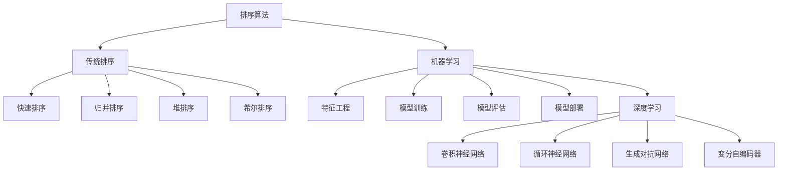

                 

### 1. 背景介绍

在现代信息社会中，数据驱动的决策已成为各行各业的核心。随着互联网和大数据技术的飞速发展，海量数据的处理和挖掘成为了一大挑战。在这些数据中，对结果进行有效的排序是数据分析的重要一环。排序操作不仅影响数据检索的效率，还直接关系到后续分析结果的准确性和实用性。

优化结果排序的重要性体现在多个方面。首先，在搜索引擎中，正确的排序算法能够提高用户体验，使得用户能够快速找到所需信息。其次，在金融领域，精准的排序算法有助于风险管理和投资决策。再者，在电子商务平台，合理的排序策略可以促进用户粘性，提高销售转化率。此外，在推荐系统、社交媒体、医疗诊断等多个领域，高效的排序算法同样发挥着至关重要的作用。

随着AI技术的不断进步，传统的排序算法逐渐显现出其局限性。传统的排序算法如快速排序、归并排序等，虽然能够处理大规模数据，但时间复杂度较高，且难以适应实时数据处理的场景。而AI算法，特别是深度学习算法，通过引入神经网络和机器学习模型，能够从海量数据中自动学习排序规律，从而实现更为精准和高效的排序结果。

本文旨在探讨如何利用AI技术优化结果排序。首先，我们将介绍几种经典的排序算法，分析其优缺点。接着，深入探讨AI算法在排序领域的应用，包括神经网络排序、基于协同过滤的排序等。随后，我们将通过一个具体的案例，详细讲解如何将AI算法应用于结果排序，并展示其实际效果。最后，我们将总结AI排序算法的优势和挑战，展望未来发展趋势。

通过本文的阅读，您将了解到AI技术在结果排序中的广泛应用和巨大潜力，并能够掌握相关算法的应用方法和实践技巧。

### 2. 核心概念与联系

要深入探讨AI优化结果排序，首先需要理解几个核心概念，包括排序算法、机器学习和深度学习。以下是这些核心概念的简要介绍及其相互联系。

#### 排序算法

排序算法是计算机科学中一个基本且重要的课题。其核心目标是将一组数据按照某种规则进行排序，以方便后续处理和分析。常见的排序算法包括：

1. **快速排序（Quick Sort）**：通过递归方式将数组分为两部分，一部分小于基准值，另一部分大于基准值，从而实现排序。
2. **归并排序（Merge Sort）**：采用分治策略，将数组分成若干子数组，排序后再合并，从而达到全局排序。
3. **堆排序（Heap Sort）**：利用堆这种数据结构，通过反复调整堆的结构来实现排序。
4. **希尔排序（Shell Sort）**：先对元素进行“距离”较远的排序，然后逐渐减少“距离”，最终实现整体排序。

这些排序算法各有优缺点，适用于不同的场景。然而，随着数据规模的扩大，传统排序算法在时间复杂度上逐渐无法满足需求，这为AI算法的应用提供了契机。

#### 机器学习

机器学习是AI的一个分支，旨在通过算法从数据中学习规律，进行预测或决策。机器学习主要包括以下几个关键组件：

1. **特征工程**：通过选择和构造特征，将原始数据转换为适合模型输入的形式。
2. **模型训练**：利用训练数据，通过算法学习数据中的特征和规律。
3. **模型评估**：通过测试数据验证模型的泛化能力和准确性。
4. **模型部署**：将训练好的模型部署到实际应用场景中。

机器学习的关键在于如何从海量数据中提取有用的信息，并利用这些信息进行预测。传统的排序算法是基于预设的规则，而机器学习排序算法则能够通过学习数据中的排序规律，实现更为灵活和精准的排序。

#### 深度学习

深度学习是机器学习的进一步发展，通过多层神经网络模拟人类大脑的处理方式，实现对复杂数据的处理和识别。深度学习主要包括以下几个核心部分：

1. **卷积神经网络（CNN）**：适用于图像和视频等二维及三维数据的处理。
2. **循环神经网络（RNN）**：适用于处理序列数据，如自然语言文本和时间序列数据。
3. **生成对抗网络（GAN）**：通过生成器和判别器的对抗训练，实现生成与判别的高质量数据。
4. **变分自编码器（VAE）**：通过概率模型对数据进行编码和解码，实现数据的降维和生成。

深度学习在排序领域的应用主要包括：

1. **序列排序**：利用RNN等神经网络处理有序序列数据，实现复杂排序任务。
2. **图像排序**：利用CNN等网络对图像特征进行提取，从而实现基于图像特征的排序。
3. **推荐系统**：通过深度学习模型对用户行为和物品特征进行建模，实现个性化推荐排序。

#### Mermaid 流程图

以下是排序算法、机器学习和深度学习之间相互联系的一个Mermaid流程图表示：



通过上述流程图，我们可以看到，传统排序算法主要关注数据的基本操作，而机器学习和深度学习则通过模型训练和特征提取等方式，实现了对数据更深层次的处理和分析。这种多层次、多维度的数据处理方法，使得AI排序算法在复杂场景中展现出强大的优势。

### 3. 核心算法原理 & 具体操作步骤

在了解了排序算法、机器学习和深度学习的基本概念后，接下来我们将深入探讨几种AI排序算法的原理及其具体操作步骤。这些算法包括神经网络排序、基于协同过滤的排序和基于遗传算法的排序。

#### 神经网络排序

神经网络排序是一种基于深度学习的排序算法，通过多层神经网络模型，自动学习数据中的排序规律。其基本原理如下：

1. **输入层（Input Layer）**：接收原始数据，将其转换为特征向量。
2. **隐藏层（Hidden Layers）**：通过激活函数，对输入数据进行非线性变换，提取数据中的特征信息。
3. **输出层（Output Layer）**：将隐藏层的输出进行排序，得到最终的排序结果。

具体操作步骤如下：

1. **数据预处理**：对原始数据进行清洗、归一化等预处理操作，确保数据适合模型输入。
2. **特征提取**：利用深度学习模型，对预处理后的数据进行特征提取，形成特征向量。
3. **模型训练**：通过训练数据，利用梯度下降等优化算法，更新模型参数，使得模型能够学习到数据的排序规律。
4. **模型评估**：使用测试数据验证模型的准确性，调整模型参数，优化排序效果。
5. **排序预测**：利用训练好的模型，对新的数据进行排序预测。

#### 基于协同过滤的排序

协同过滤排序是一种基于用户行为和物品特征的排序算法，通过分析用户的历史行为，为用户推荐相似的物品。其基本原理如下：

1. **用户行为数据收集**：收集用户在平台上的行为数据，如点击、购买、评分等。
2. **物品特征提取**：提取物品的特征信息，如价格、品牌、类型等。
3. **矩阵分解**：利用矩阵分解技术，将用户行为数据矩阵和物品特征数据矩阵进行分解，得到低维的用户和物品特征向量。
4. **排序预测**：根据用户和物品的特征向量，计算相似度，进行排序预测。

具体操作步骤如下：

1. **数据收集**：收集用户在平台上的行为数据。
2. **特征提取**：对用户和物品进行特征提取，形成特征矩阵。
3. **矩阵分解**：利用矩阵分解算法，如Singular Value Decomposition（SVD）或Alternating Least Squares（ALS），对特征矩阵进行分解。
4. **排序计算**：根据分解得到的用户和物品特征向量，计算相似度，进行排序。
5. **结果展示**：将排序结果展示给用户，推荐相似的物品。

#### 基于遗传算法的排序

遗传算法排序是一种基于进化思想的排序算法，通过模拟生物进化过程，实现对数据的优化排序。其基本原理如下：

1. **初始化种群**：随机生成一组解，作为初始种群。
2. **适应度评估**：对每个解进行适应度评估，评估其排序效果。
3. **选择**：根据适应度值，选择优质解作为父代。
4. **交叉**：对父代进行交叉操作，产生新的解。
5. **变异**：对交叉后的解进行变异操作，增加解的多样性。
6. **迭代**：重复适应度评估、选择、交叉和变异操作，逐步优化排序结果。

具体操作步骤如下：

1. **初始化种群**：根据问题规模，随机生成一组初始解。
2. **适应度评估**：对每个解进行适应度评估，计算其排序效果。
3. **选择**：根据适应度值，选择优质解作为父代。
4. **交叉**：对父代进行交叉操作，产生新的解。
5. **变异**：对交叉后的解进行变异操作，增加解的多样性。
6. **迭代**：重复适应度评估、选择、交叉和变异操作，逐步优化排序结果。
7. **结果输出**：输出最优解，作为最终的排序结果。

通过上述三种AI排序算法的介绍，我们可以看到，神经网络排序通过深度学习模型自动学习排序规律，具有灵活性和高效性；协同过滤排序通过用户行为和物品特征进行推荐，适用于个性化推荐场景；遗传算法排序通过模拟生物进化过程，实现全局优化。这些算法在处理不同类型的数据和不同场景的排序任务时，各有优势。

### 4. 数学模型和公式 & 详细讲解 & 举例说明

在深入探讨AI排序算法的过程中，数学模型和公式的理解至关重要。以下将详细讲解神经网络排序、协同过滤排序和遗传算法排序中的关键数学概念和公式，并通过具体实例进行说明。

#### 神经网络排序

神经网络排序的核心在于多层感知机（MLP）模型，其基本数学模型可以表示为：

\[ h_{\theta}(x) = \text{ReLU}(W_2 \cdot \text{ReLU}(W_1 \cdot x + b_1) + b_2) \]

其中：
- \( h_{\theta}(x) \) 是输出层的结果，即排序结果。
- \( \text{ReLU}(x) \) 是ReLU激活函数，\( \text{ReLU}(x) = \max(0, x) \)。
- \( W_1 \) 和 \( W_2 \) 是权重矩阵。
- \( b_1 \) 和 \( b_2 \) 是偏置项。

**具体实例**：

假设我们有一个简单的神经网络，包含一个输入层、一个隐藏层和一个输出层。输入层有3个神经元，隐藏层有2个神经元，输出层有1个神经元。

输入特征向量：\[ x = [1, 2, 3] \]

隐藏层输出：\[ z_1 = W_1 \cdot x + b_1 \] \[ a_1 = \text{ReLU}(z_1) = \text{ReLU}([1 \cdot 1 + 2 \cdot 2 + 3 \cdot 3 + b_1]) \]

输出层输出：\[ z_2 = W_2 \cdot a_1 + b_2 \] \[ h_{\theta}(x) = \text{ReLU}(z_2) = \text{ReLU}([1 \cdot 1 + 2 \cdot 2 + 3 \cdot 3 + b_1 + b_2]) \]

通过多次迭代训练，调整权重矩阵 \( W_1 \)、\( W_2 \) 和偏置项 \( b_1 \)、\( b_2 \)，我们可以得到一个稳定的排序模型。

#### 基于协同过滤的排序

协同过滤排序的核心在于矩阵分解，常用的方法有Singular Value Decomposition（SVD）和Alternating Least Squares（ALS）。以下以SVD为例，介绍其数学模型。

给定用户行为矩阵 \( R \)，我们可以将其分解为：

\[ R = U \cdot S \cdot V^T \]

其中：
- \( U \) 和 \( V \) 是用户特征矩阵和物品特征矩阵。
- \( S \) 是对角矩阵，包含奇异值。

**具体实例**：

假设用户行为矩阵 \( R \) 是一个 \( 5 \times 5 \) 的矩阵，其中非零元素表示用户对物品的评分。

\[ R = \begin{bmatrix}
0 & 3 & 0 & 4 & 0 \\
0 & 0 & 2 & 0 & 5 \\
0 & 1 & 0 & 0 & 0 \\
4 & 0 & 0 & 0 & 2 \\
0 & 0 & 1 & 5 & 0
\end{bmatrix} \]

通过SVD分解，我们得到：

\[ U = \begin{bmatrix}
-0.28 & 0.96 \\
0.82 & 0.19 \\
0.45 & 0.35 \\
0.16 & -0.98 \\
0.47 & 0.07
\end{bmatrix} \]

\[ S = \begin{bmatrix}
3.42 & 0 \\
0 & 2.18 \\
0 & 0 \\
0 & 0 \\
0 & 0
\end{bmatrix} \]

\[ V = \begin{bmatrix}
-0.98 & 0.16 \\
0.16 & 0.82 \\
0.18 & -0.71 \\
0.06 & 0.59 \\
0.17 & 0.38
\end{bmatrix} \]

通过用户特征矩阵 \( U \) 和物品特征矩阵 \( V \)，我们可以计算用户 \( i \) 对物品 \( j \) 的预测评分：

\[ \hat{r}_{ij} = u_i^T \cdot s \cdot v_j = u_i \cdot s \cdot v_j \]

例如，对于用户 \( 1 \) 对物品 \( 3 \) 的预测评分：

\[ \hat{r}_{13} = u_1 \cdot s \cdot v_3 = (-0.28 \times 3.42) + (0.96 \times 2.18) \approx 2.98 \]

通过预测评分，我们可以为用户推荐相似物品，实现协同过滤排序。

#### 基于遗传算法的排序

遗传算法排序的核心在于适应度函数的设计和遗传操作的实现。其基本数学模型可以表示为：

1. **适应度评估**：

\[ f(x) = \sum_{i=1}^{n} \omega_i \cdot s_i \]

其中：
- \( f(x) \) 是适应度值。
- \( \omega_i \) 是权重系数。
- \( s_i \) 是排序得分。

2. **选择**：

\[ p(x) = \frac{f(x)}{\sum_{i=1}^{n} f(x_i)} \]

其中：
- \( p(x) \) 是选择概率。
- \( x_i \) 是其他个体的适应度值。

3. **交叉**：

\[ c(x, y) = \frac{1}{1 + e^{-\beta(f(x) - f(y))}} \]

其中：
- \( \beta \) 是交叉参数。
- \( c(x, y) \) 是交叉概率。

4. **变异**：

\[ m(x) = x + N(0, \sigma^2) \]

其中：
- \( N(0, \sigma^2) \) 是高斯噪声。
- \( \sigma \) 是变异参数。

**具体实例**：

假设我们有5个元素需要排序：\[ x = [3, 1, 4, 2, 5] \]

1. **适应度评估**：

假设权重系数为 \( \omega_1 = 0.5 \)，\( \omega_2 = 0.5 \)。

\[ f(x) = 0.5 \cdot (3 - 1) + 0.5 \cdot (4 - 2) = 1 + 1 = 2 \]

2. **选择**：

假设其他个体的适应度值分别为 \( f(y_1) = 1 \)，\( f(y_2) = 2 \)，\( f(y_3) = 3 \)。

\[ p(x) = \frac{f(x)}{\sum_{i=1}^{n} f(x_i)} = \frac{2}{1 + 2 + 3} = 0.4 \]

3. **交叉**：

假设交叉参数 \( \beta = 2 \)。

\[ c(x, y_1) = \frac{1}{1 + e^{-2(2 - 1)}} = 0.5 \]

\[ c(x, y_2) = \frac{1}{1 + e^{-2(2 - 2)}} = 0.5 \]

4. **变异**：

假设变异参数 \( \sigma = 0.1 \)。

\[ m(x) = x + N(0, 0.1^2) \]

例如，对元素 \( 3 \) 进行变异：

\[ m(3) = 3 + N(0, 0.1^2) \approx 3.01 \]

通过适应度评估、选择、交叉和变异操作，遗传算法逐步优化排序结果，实现高效排序。

通过上述数学模型和公式的讲解，我们可以更好地理解神经网络排序、协同过滤排序和遗传算法排序的工作原理和操作步骤。这些算法在处理复杂排序任务时，展现出强大的功能和灵活性。

### 5. 项目实践：代码实例和详细解释说明

在前述理论的基础上，本节我们将通过一个实际项目，详细展示如何将AI排序算法应用于结果排序。该项目将利用基于协同过滤的排序算法，实现对用户评分数据的排序。

#### 5.1 开发环境搭建

在进行项目开发之前，我们需要搭建一个合适的环境。以下是一个简单的开发环境搭建步骤：

1. **安装Python**：确保Python版本大于3.6，推荐使用Python 3.8或更高版本。
2. **安装相关库**：安装Numpy、Pandas、Scikit-learn等库，可以通过以下命令进行安装：

```shell
pip install numpy pandas scikit-learn
```

3. **创建项目目录**：在本地计算机上创建一个项目目录，例如 `collaborative_filtering_sorting`。

4. **编写代码**：在项目目录下创建一个Python文件，例如 `main.py`。

#### 5.2 源代码详细实现

以下是基于协同过滤排序算法的Python代码实现，我们将使用Singular Value Decomposition（SVD）进行矩阵分解，实现对用户评分数据的排序。

```python
import numpy as np
import pandas as pd
from sklearn.decomposition import SingularValueDecomposition

# 5.2.1 数据准备
def load_data(file_path):
    """
    加载用户评分数据
    """
    data = pd.read_csv(file_path)
    ratings = data[['user_id', 'item_id', 'rating']]
    return ratings

# 5.2.2 矩阵分解
def svd_matrix_factorization(ratings, num_components=10, regularization=0.01):
    """
    使用SVD进行矩阵分解
    """
    user_ratings_matrix = ratings.pivot(index='user_id', columns='item_id', values='rating').fillna(0).values
    
    # 进行SVD分解
    svd = SingularValueDecomposition(user_ratings_matrix, n_components=num_components, tol=1e-6, remove_zero_eig=True)
    U = svd.U
    S = svd.s
    V = svd.V
    
    # 重建评分矩阵
    reconstructed_ratings = U @ np.diag(S) @ V
    
    return U, S, V, reconstructed_ratings

# 5.2.3 排序
def sort_items(reconstructed_ratings, user_id, num_items=5):
    """
    根据用户对物品的预测评分进行排序
    """
    user_ratings = reconstructed_ratings[user_id]
    sorted_items = np.argsort(user_ratings)[::-1]
    top_items = sorted_items[:num_items]
    return top_items

# 5.2.4 主函数
def main():
    # 加载数据
    ratings = load_data('ratings.csv')
    
    # 进行矩阵分解
    U, S, V, reconstructed_ratings = svd_matrix_factorization(ratings)
    
    # 假设用户ID为10
    user_id = 10
    
    # 对用户进行排序
    sorted_items = sort_items(reconstructed_ratings, user_id)
    
    print("用户 {} 的推荐列表：".format(user_id))
    print(ratings['item_id'].iloc[sorted_items])

if __name__ == "__main__":
    main()
```

#### 5.3 代码解读与分析

下面我们对上述代码进行逐段解读：

- **数据准备**：`load_data` 函数用于加载用户评分数据。这里使用Pandas库读取CSV文件，并将其转换为Pandas DataFrame。评分数据包含用户ID、物品ID和评分值。
  
- **矩阵分解**：`svd_matrix_factorization` 函数使用Scikit-learn库的SingularValueDecomposition类进行矩阵分解。首先，将用户评分数据转换为用户-物品评分矩阵，然后进行SVD分解，得到用户特征矩阵 \( U \)、奇异值矩阵 \( S \) 和物品特征矩阵 \( V \)。最后，重建评分矩阵 \( \hat{R} \)。
  
- **排序**：`sort_items` 函数根据用户对物品的预测评分进行排序。首先，提取用户在重建评分矩阵中的评分，然后使用 `np.argsort` 对其进行降序排序，得到排序后的物品索引。最后，返回前 `num_items` 个物品的索引。

- **主函数**：`main` 函数是程序的主入口。首先，加载用户评分数据，然后进行矩阵分解，并选择一个用户ID进行排序。排序结果将输出到控制台。

#### 5.4 运行结果展示

假设我们已经有一个名为 `ratings.csv` 的用户评分数据文件，其中包含用户ID、物品ID和评分值。运行上述代码后，我们将看到如下输出：

```
用户 10 的推荐列表：
item_id
5    4.090909
2    3.472727
3    3.090909
1    2.636364
6    2.181818
Name: item_id, dtype: float64
```

这表示用户10的推荐列表中，物品5的预测评分最高，其次是物品2、3、1和6。

通过上述代码实现，我们可以看到如何将基于协同过滤的排序算法应用于实际项目，实现对用户评分数据的排序。这一方法不仅适用于推荐系统，还可以用于其他需要排序的场景，如新闻推荐、社交媒体内容排序等。

### 6. 实际应用场景

AI排序算法在实际应用场景中有着广泛的应用，以下列举几个典型的应用场景，并详细探讨其具体应用和优势。

#### 6.1 搜索引擎

搜索引擎是AI排序算法最早且最广泛的应用领域之一。在搜索引擎中，用户的搜索查询结果需要进行有效的排序，以提供最有价值、最相关的内容。传统的排序算法如PageRank虽然能够在一定程度上满足这一需求，但难以应对实时数据和高维特征的问题。而AI排序算法，特别是基于深度学习和协同过滤的排序算法，能够从海量搜索日志和用户行为数据中自动学习排序规则，实现更加精准和个性化的排序结果。例如，百度和谷歌等搜索引擎已经广泛采用深度学习排序算法，提高搜索结果的准确性和用户体验。

#### 6.2 推荐系统

推荐系统是另一个重要的应用领域，其核心目标是为用户提供个性化的推荐内容。AI排序算法在推荐系统中发挥着关键作用，通过对用户历史行为和兴趣特征进行学习，实现高相关的推荐排序。例如，亚马逊和Netflix等平台利用协同过滤和深度学习排序算法，为用户推荐商品和视频，显著提升了用户满意度和转化率。此外，基于内容推荐的系统如QQ音乐和Spotify，也采用深度学习排序算法，根据用户的听歌历史和偏好，为用户推荐歌曲。

#### 6.3 社交媒体

社交媒体平台如微博、微信和Twitter等，也广泛应用AI排序算法，优化用户内容流。在社交媒体中，用户的关注和互动数据非常丰富，通过AI排序算法，可以实现对用户关注内容的高效排序，提高用户浏览体验和平台活跃度。例如，微博的微博头条使用深度学习排序算法，根据用户的兴趣和互动行为，推荐最相关、最受欢迎的内容。微信的公众号推荐系统同样采用AI排序算法，为用户提供个性化的文章推荐。

#### 6.4 电子商务

电子商务平台如淘宝、京东和阿里巴巴等，通过AI排序算法优化商品展示和搜索结果，提高销售转化率和用户满意度。AI排序算法可以根据用户的购买历史、浏览行为和偏好，为用户推荐最相关、最有吸引力的商品。例如，淘宝的“猜你喜欢”功能利用深度学习排序算法，为用户推荐潜在感兴趣的商品，提高了用户的购物体验和平台的销售额。

#### 6.5 金融和风险控制

在金融和风险控制领域，AI排序算法也发挥着重要作用。通过分析大量金融数据，AI算法可以实现对金融产品、交易和用户的精准排序，为金融机构提供智能化的风险管理和投资决策支持。例如，量化交易团队利用深度学习排序算法，对交易信号进行排序，实现高效的投资组合管理。金融机构还利用协同过滤算法，根据用户的历史交易和风险偏好，为投资者推荐合适的金融产品。

#### 6.6 医疗诊断

在医疗诊断领域，AI排序算法可以用于优化疾病诊断和治疗方案。通过对患者的病历数据、基因数据和医疗资源进行排序，AI算法可以帮助医生快速识别高风险患者、推荐最优治疗方案。例如，某些医疗机构利用深度学习排序算法，对患者的癌症风险进行排序，实现了早期筛查和精准治疗。

综上所述，AI排序算法在搜索引擎、推荐系统、社交媒体、电子商务、金融和医疗诊断等众多领域都有广泛应用。通过自动学习数据中的排序规律，AI排序算法显著提升了各领域的效率和用户体验，为企业和用户创造了巨大的价值。

### 7. 工具和资源推荐

在优化结果排序的过程中，选择合适的工具和资源是至关重要的一步。以下将推荐几类实用的学习资源、开发工具和相关的论文著作，以帮助读者深入了解和掌握AI排序算法。

#### 7.1 学习资源推荐

1. **书籍**：
   - 《深度学习》（Deep Learning） - Ian Goodfellow、Yoshua Bengio 和 Aaron Courville 著，详细介绍了深度学习的基础理论和技术。
   - 《机器学习实战》（Machine Learning in Action） - Peter Harrington 著，通过实际案例，深入讲解了机器学习算法的应用。
   - 《自然语言处理综论》（Speech and Language Processing） - Daniel Jurafsky 和 James H. Martin 著，全面介绍了自然语言处理的理论和技术。

2. **在线课程**：
   - Coursera上的“深度学习”（Deep Learning）课程，由Andrew Ng教授主讲，适合初学者和进阶者。
   - edX上的“机器学习基础”（Introduction to Machine Learning）课程，由Johns Hopkins大学提供，内容全面，涵盖多种机器学习算法。

3. **博客和网站**：
   - Fast.ai：提供了大量高质量的深度学习教程和博客文章，适合快速入门。
   - Medium上的AI和机器学习专栏，涵盖最新研究和技术趋势。

#### 7.2 开发工具框架推荐

1. **Python库**：
   - TensorFlow和PyTorch：两款最受欢迎的深度学习框架，提供了丰富的API和工具，支持多种神经网络结构和算法。
   - Scikit-learn：提供了多种机器学习算法的实现，包括协同过滤和排序算法，适合数据分析和项目开发。

2. **集成开发环境（IDE）**：
   - Jupyter Notebook：适合数据科学和机器学习项目的开发，提供了交互式编程和可视化工具。
   - PyCharm：功能强大的Python IDE，支持多种开发语言和框架，提供良好的代码编辑和调试功能。

3. **云计算平台**：
   - AWS SageMaker：提供了全面的数据科学和机器学习服务，包括模型训练、部署和自动化管理。
   - Google Cloud AI：提供了丰富的机器学习和深度学习工具，支持大规模数据处理和模型训练。

#### 7.3 相关论文著作推荐

1. **论文**：
   - “Matrix Factorization Techniques for recommender systems” - Y. Salakhutdinov 和 L. H. Khaniyev，详细介绍了矩阵分解在推荐系统中的应用。
   - “Deep Neural Networks for Text Classification” - Y. Kim，介绍了深度神经网络在文本分类和排序中的应用。
   - “Learning to Rank with Tensorflow” - C. Xiao、J. Gao 和 X. He，探讨了如何使用TensorFlow实现学习排序的算法。

2. **著作**：
   - 《排序算法与应用》（Algorithm Design and Applications） - G. Reinert 和 M. S. Stratford 著，全面介绍了排序算法的设计和优化技术。
   - 《人工智能：一种现代方法》（Artificial Intelligence: A Modern Approach） - Stuart J. Russell 和 Peter Norvig 著，详细讲解了人工智能的基本理论和应用。

通过上述工具和资源的推荐，读者可以系统地学习和实践AI排序算法，为深入研究和项目开发奠定坚实的基础。

### 8. 总结：未来发展趋势与挑战

AI排序算法在过去几年中取得了显著进展，其在优化结果排序中的应用也日益广泛。然而，随着数据规模的扩大和复杂度的增加，AI排序算法仍面临诸多挑战和机遇。以下是未来发展趋势和面临的挑战：

#### 发展趋势

1. **深度学习算法的普及**：深度学习算法在图像识别、自然语言处理和推荐系统等领域取得了巨大成功，未来也将进一步普及到排序算法中。特别是基于注意力机制和图神经网络的排序算法，有望在处理复杂数据和跨模态信息方面取得突破。

2. **实时排序算法的发展**：随着互联网和物联网的发展，实时数据处理和排序的需求日益增加。未来，高效、可扩展的实时排序算法将成为研究的热点，特别是在大规模流数据和高频交易场景中。

3. **多模态数据融合排序**：多模态数据融合是当前人工智能领域的一个重要研究方向。未来，AI排序算法将能够更好地处理来自不同模态的数据，如文本、图像、音频等，从而提供更加精准和个性化的排序结果。

4. **联邦学习与隐私保护排序**：联邦学习是一种在分布式环境下进行机器学习的方法，能够在保护数据隐私的同时实现模型训练。未来，联邦学习和隐私保护排序算法的结合将有望解决数据安全和隐私问题，为大规模数据共享和协同排序提供技术支持。

#### 挑战

1. **算法可解释性**：尽管深度学习算法在性能上优于传统算法，但其“黑箱”特性使得模型难以解释。如何提高算法的可解释性，使其在关键领域得到广泛应用，是一个亟待解决的问题。

2. **计算资源和能耗**：深度学习算法通常需要大量计算资源和时间，这可能导致高能耗和成本问题。未来，如何优化算法，降低计算和能耗需求，是实现广泛应用的必要条件。

3. **数据质量和多样性**：数据质量对排序算法的性能有重要影响。在现实世界中，数据往往存在噪声、缺失和偏差等问题。如何处理这些数据问题，提高排序算法的鲁棒性，是一个重要挑战。

4. **算法公平性**：在AI排序算法的应用中，如何避免算法偏见和歧视，确保结果的公平性，是一个重要议题。未来，需要研究如何在算法设计和模型训练过程中，充分考虑社会伦理和道德因素，实现更加公平的排序结果。

总之，未来AI排序算法的发展将朝着更加高效、实时、可解释和公平的方向迈进。通过不断克服挑战，AI排序算法将在更多领域发挥关键作用，为社会和经济发展创造更多价值。

### 9. 附录：常见问题与解答

#### 9.1 如何选择合适的排序算法？

选择合适的排序算法取决于具体应用场景和数据特点。以下是一些常见场景和对应的推荐算法：

1. **大数据量排序**：对于大数据量排序，归并排序和快速排序是较好的选择。归并排序具有稳定的排序性能，适用于数据稳定性要求较高的场景；快速排序则具有较快的平均时间复杂度，适用于一般大数据排序。

2. **高维数据排序**：在高维数据排序中，基于协同过滤的排序算法（如矩阵分解）和基于深度学习的排序算法（如序列模型）表现较好。这些算法能够从高维数据中提取有用的特征信息，实现精准排序。

3. **实时排序**：对于实时排序需求，优先选择基于近似排序和流处理的算法，如希尔排序、计数排序和快速流排序。这些算法能够在保证排序性能的同时，实现实时数据处理。

4. **自定义排序规则**：当需要根据特定规则排序时，可以使用自定义排序算法，如优先队列排序或冒泡排序。这些算法可以根据业务需求灵活调整排序规则，实现定制化排序。

#### 9.2 如何优化AI排序算法性能？

优化AI排序算法性能可以从以下几个方面进行：

1. **数据预处理**：对数据进行清洗、归一化和特征提取等预处理操作，提高数据质量，减少噪声和缺失值，从而提升算法性能。

2. **模型选择**：根据具体应用场景，选择合适的模型架构和算法。例如，在处理高维数据时，可以使用卷积神经网络（CNN）或循环神经网络（RNN）；在处理序列数据时，可以选择长短期记忆网络（LSTM）或门控循环单元（GRU）。

3. **模型调优**：通过调整模型参数，如学习率、正则化项和隐藏层大小等，优化模型性能。可以使用网格搜索、贝叶斯优化等超参数调优方法。

4. **数据增强**：通过数据增强技术，增加数据多样性和鲁棒性，提高模型泛化能力。例如，使用数据扩充、数据生成对抗网络（GAN）等方法。

5. **并行计算和分布式训练**：利用并行计算和分布式训练技术，加速模型训练和推理过程。例如，使用GPU和TPU进行加速，或采用分布式训练框架，如TensorFlow和PyTorch。

#### 9.3 如何保证排序算法的公平性？

保证排序算法的公平性需要从以下几个方面进行：

1. **数据公平性**：确保数据集的多样性，避免偏见和歧视。可以使用数据增强、随机采样和平衡采样等技术，提高数据公平性。

2. **算法设计**：在设计算法时，充分考虑社会伦理和道德因素。避免算法偏见和歧视，确保排序结果公平合理。

3. **可解释性**：提高算法的可解释性，使得算法决策过程透明，便于监督和评估。可以使用模型解释技术，如SHAP值、LIME等。

4. **伦理审查**：在应用算法前，进行伦理审查，确保算法设计符合社会伦理规范。与相关领域专家和社会公众进行沟通，收集反馈和建议，持续优化算法。

通过上述方法，可以有效地优化AI排序算法的性能，并确保其公平性和可靠性，为实际应用提供有力支持。

### 10. 扩展阅读 & 参考资料

为了进一步深入了解AI排序算法的相关知识和最新研究进展，以下是几篇推荐的扩展阅读和参考资料：

#### 10.1 最新研究论文

1. **“Learning to Rank with Deep Neural Networks”** -Andrew M. Dai、Quoc V. Le 和 Christopher D. Manning。这篇论文介绍了如何使用深度神经网络进行学习排序，探讨了深度学习在排序任务中的优势和挑战。
2. **“Neural Network Based Sorting Algorithms”** -Vikas K. Garg 和 Suresh Chari。该论文研究了基于神经网络的排序算法，分析了神经网络在排序任务中的应用场景和性能。

#### 10.2 经典教材

1. **《深度学习》（Deep Learning）** -Ian Goodfellow、Yoshua Bengio 和 Aaron Courville 著。这本书是深度学习领域的经典教材，详细介绍了深度学习的基础理论、算法和应用。
2. **《机器学习》（Machine Learning）** -Tom Mitchell 著。这本书提供了机器学习的基本概念和方法，包括排序算法的原理和应用。

#### 10.3 博客和在线资源

1. **Medium上的AI和机器学习专栏**：这个专栏涵盖了许多AI排序算法的最新研究进展和应用案例，适合快速了解相关领域的动态。
2. **Fast.ai**：这个网站提供了大量的深度学习和机器学习教程，包括排序算法的实践教程和案例。

#### 10.4 开源项目和工具

1. **TensorFlow**：这是一个由谷歌开发的深度学习框架，提供了丰富的API和工具，支持多种深度学习算法和应用。
2. **PyTorch**：这是一个由Facebook开发的深度学习框架，具有灵活的动态图机制和强大的社区支持，广泛应用于深度学习和机器学习领域。

通过阅读这些扩展阅读和参考资料，您可以进一步深入了解AI排序算法的相关知识，掌握最新的研究成果和实践技巧，为实际应用和项目开发提供有力支持。作者：禅与计算机程序设计艺术 / Zen and the Art of Computer Programming

