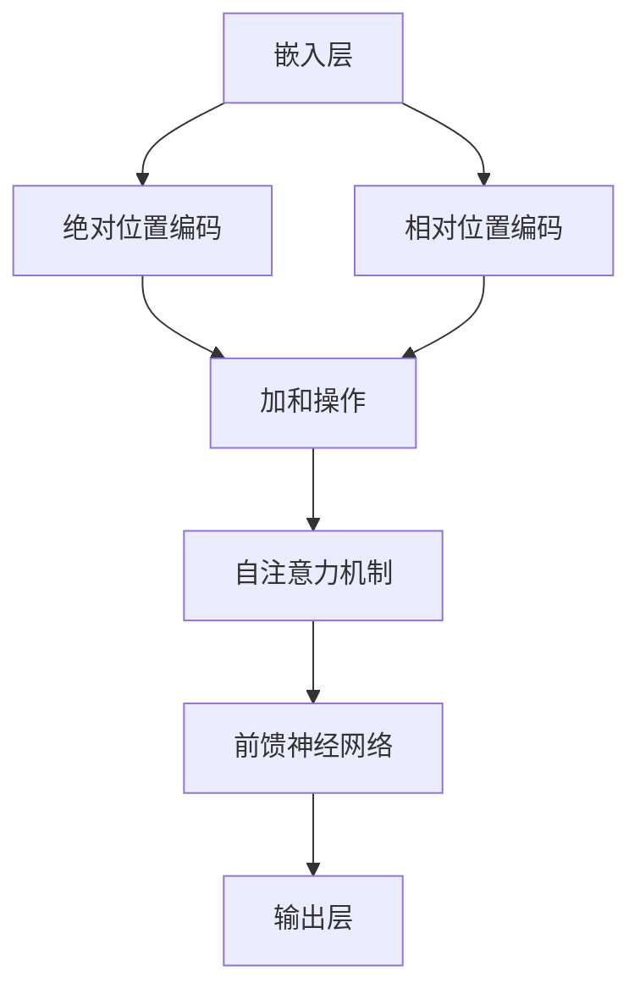

                 

### 1. 背景介绍

#### 语言模型的发展历程

语言模型（Language Model，LM）是自然语言处理（Natural Language Processing，NLP）领域的重要基础。从20世纪中叶以来，语言模型的发展经历了多个阶段，从最初的统计语言模型，到后来的神经网络模型，再到最近的深度学习模型，每个阶段都在不断推动NLP技术的进步。

1. **统计语言模型**：最早的语言模型是基于统计方法构建的，如N-gram模型。N-gram模型通过计算单词序列的频率来预测下一个单词。这种方法虽然简单，但在某些应用场景中取得了不错的表现。

2. **神经网络语言模型**：随着神经网络技术的发展，神经网络语言模型逐渐取代了统计语言模型。神经网络语言模型利用神经网络的非线性特性，可以更好地捕捉语言中的复杂结构。

3. **深度学习语言模型**：深度学习语言模型是当前语言模型的主流。深度学习模型，尤其是Transformer模型，以其强大的表示能力和高效的计算能力，在语言理解、生成、翻译等任务上取得了显著成果。

#### 位置编码的引入

在深度学习语言模型中，位置编码（Positional Encoding）是一个关键概念。位置编码的引入，解决了传统神经网络语言模型在处理序列数据时无法区分词语顺序的问题。

位置编码的基本思想是将词语的位置信息编码为词语的向量表示。这样，即使两个词语在文本中完全相同，它们的位置信息也能够被区分开来。位置编码的引入，使得深度学习语言模型能够更好地理解和处理序列数据。

#### 位置编码的应用场景

位置编码在多种自然语言处理任务中具有广泛的应用。以下是一些常见的应用场景：

1. **文本分类**：在文本分类任务中，位置编码有助于模型理解文本中的关键信息，从而提高分类的准确性。

2. **命名实体识别**：在命名实体识别任务中，位置编码有助于模型识别实体与其上下文之间的关系，从而提高识别的准确性。

3. **机器翻译**：在机器翻译任务中，位置编码有助于模型理解源语言和目标语言之间的语义关系，从而提高翻译的质量。

4. **文本生成**：在文本生成任务中，位置编码有助于模型理解输入文本的结构和语义，从而生成更符合语言习惯的文本。

#### 位置编码的发展趋势

随着深度学习技术的不断发展，位置编码也在不断演进。以下是一些位置编码的发展趋势：

1. **自适应位置编码**：传统的位置编码是固定的，无法根据输入数据自适应调整。自适应位置编码通过学习输入数据的位置信息，提高了模型的适应性和效果。

2. **多尺度位置编码**：多尺度位置编码通过在不同尺度上编码位置信息，提高了模型对语言结构的理解和处理能力。

3. **自适应注意力机制**：结合自适应注意力机制的位置编码，可以更好地捕捉输入数据中的关键信息，从而提高模型的性能。

### 小结

位置编码在深度学习语言模型中具有重要地位。通过位置编码，模型能够更好地理解和处理序列数据，从而在各种自然语言处理任务中取得更好的效果。随着深度学习技术的不断发展，位置编码将继续发挥关键作用，推动自然语言处理技术的进步。

## 2. 核心概念与联系

### 2.1 位置编码的概念

位置编码（Positional Encoding）是深度学习模型中用于在序列数据中引入位置信息的技术。在自然语言处理任务中，词语的顺序对理解其语义至关重要。位置编码的目的是将词语的位置信息编码为向量形式，使其能够在神经网络中作为特征的一部分进行学习和利用。

### 2.2 位置编码与嵌入层的联系

在深度学习语言模型中，嵌入层（Embedding Layer）负责将输入的单词或符号映射到高维向量空间。位置编码与嵌入层紧密相关，它通常在嵌入层之后添加，用于对嵌入的向量添加位置信息。具体来说，嵌入层将每个单词映射到一个固定大小的向量，而位置编码则在这个向量上添加一个额外的向量，代表该单词在序列中的位置。

### 2.3 位置编码与注意力机制的关联

注意力机制（Attention Mechanism）是深度学习语言模型中的一个关键组件，用于在序列数据中关注重要的信息。位置编码在注意力机制中起到重要作用，因为它能够帮助模型识别和关注序列中的位置信息。通过位置编码，注意力机制可以更好地捕捉长距离依赖关系和上下文信息。

### 2.4 位置编码与传统方法的区别

传统语言模型（如N-gram模型）通常不涉及位置编码，因为它们基于统计方法，主要通过计算单词的共现频率来预测下一个单词。而深度学习语言模型（如Transformer）引入了位置编码，使得模型能够理解词语的顺序和结构。位置编码与传统方法相比，具有以下几个显著优势：

1. **灵活性和可扩展性**：位置编码可以自适应地调整，以适应不同长度的序列和复杂的语言结构。

2. **捕获长期依赖关系**：通过位置编码，模型能够更好地捕捉长距离的依赖关系，这对于理解复杂的语言现象至关重要。

3. **改进模型性能**：在许多NLP任务中，引入位置编码显著提高了模型的性能和准确性。

### 2.5 位置编码的实现方法

位置编码的实现方法有多种，常见的包括：

1. **正弦曲线编码**：这是一种基于正弦函数的编码方法，能够生成周期性变化的编码向量，从而捕捉序列中的周期性结构。

2. **绝对位置编码**：这种方法直接将单词的位置信息编码为向量的一部分，通常与嵌入层结合使用。

3. **相对位置编码**：相对位置编码通过计算单词之间的相对位置来生成编码向量，这种方法能够更好地处理长序列和复杂的上下文关系。

### 2.6 位置编码与上下文关系的可视化

为了更好地理解位置编码，我们可以通过一个简单的例子来可视化位置编码与上下文关系。假设我们有一个简单的序列：“你好，世界”。通过位置编码，我们可以将这个序列中的每个单词映射到一个二维空间中，其中横轴和纵轴分别代表位置信息。

- 单词“你”的位置编码向量可能是$(x_1, y_1)$，表示它在序列中的位置。
- 单词“好”的位置编码向量可能是$(x_2, y_2)$，表示它在序列中的位置。
- 单词“世界”的位置编码向量可能是$(x_3, y_3)$，表示它在序列中的位置。

通过这种方式，位置编码能够帮助模型识别单词之间的顺序关系，从而在处理序列数据时更加准确。

### 2.7 位置编码在Transformer模型中的应用

Transformer模型是一个基于自注意力机制的深度学习模型，它在NLP任务中取得了显著的成果。位置编码是Transformer模型中的一个关键组件，它通过为每个单词添加位置信息，使得模型能够理解和处理序列数据。

在Transformer模型中，位置编码通常是通过两个向量来实现的：

1. **绝对位置编码**：这个向量直接与嵌入层的输出向量相加，用于引入单词的位置信息。
2. **相对位置编码**：这个向量通过计算单词之间的相对位置来生成，用于帮助模型捕捉序列中的相对关系。

通过结合这两种编码方法，Transformer模型能够更好地理解和处理复杂的序列数据，从而在各种NLP任务中取得优异的性能。

### Mermaid 流程图

以下是一个简化的Mermaid流程图，展示了位置编码在Transformer模型中的核心概念和实现步骤：



在这个流程图中，嵌入层将单词映射到向量空间，然后通过绝对位置编码和相对位置编码为这些向量添加位置信息。加和操作将位置编码向量与嵌入层输出向量相加，形成最终的输入向量。这些向量随后被传递到自注意力机制和前馈神经网络中进行处理，最后通过输出层生成预测结果。

通过上述流程图，我们可以直观地理解位置编码在Transformer模型中的关键作用和实现步骤。

## 3. 核心算法原理 & 具体操作步骤

### 3.1 位置编码的算法原理

位置编码的核心思想是通过将序列数据中的位置信息转换为向量形式，从而使得神经网络能够学习和利用这种信息。以下详细介绍位置编码的算法原理：

#### 3.1.1 正弦曲线编码

正弦曲线编码是一种常用的位置编码方法，其基本思想是将位置信息编码为正弦曲线的值。具体步骤如下：

1. **生成位置索引**：对于输入序列中的每个单词或符号，生成其在序列中的位置索引。例如，如果序列长度为10，则位置索引为[0, 1, 2, ..., 9]。

2. **计算位置编码向量**：对于每个位置索引，计算其对应的位置编码向量。位置编码向量由两个部分组成：一个是嵌入层输出的向量，另一个是正弦曲线编码向量。正弦曲线编码向量的计算方法如下：

   $$ \text{pos_enc}(d_i, p) = \sin\left(\frac{1000^2 \cdot d_i}{\text{dim}} \cdot \frac{p}{1000}\right) \text{ 或 } \cos\left(\frac{1000^2 \cdot d_i}{\text{dim}} \cdot \frac{p}{1000}\right) $$

   其中，$d_i$ 是位置索引，$p$ 是维度，$\text{dim}$ 是编码向量的维度。通常，正弦曲线编码会交替使用正弦和余弦函数，以确保编码向量具有周期性。

3. **加和操作**：将正弦曲线编码向量与嵌入层输出向量相加，得到最终的位置编码向量。这个向量将被用于神经网络中的后续操作。

#### 3.1.2 绝对位置编码

绝对位置编码是一种简单且直接的位置编码方法，它将位置信息直接编码为嵌入层输出向量的一部分。具体步骤如下：

1. **生成位置索引**：同正弦曲线编码。

2. **计算绝对位置编码向量**：对于每个位置索引，计算其对应的绝对位置编码向量。这个向量通常是一个固定大小的向量，其值直接与位置索引相关。例如，可以使用以下公式：

   $$ \text{pos_enc}(d_i) = \begin{cases} 
   (0, 0, ..., 0, 1, 0, ..., 0) & \text{如果 } d_i \text{ 是第 } p \text{ 个位置} \\
   (0, 0, ..., 0) & \text{如果 } d_i \text{ 是序列的开头} \\
   (0, 0, ..., 0) & \text{如果 } d_i \text{ 是序列的结尾}
   \end{cases} $$

3. **加和操作**：将绝对位置编码向量与嵌入层输出向量相加，得到最终的位置编码向量。

#### 3.1.3 相对位置编码

相对位置编码是一种通过计算单词之间的相对位置来生成编码向量的方法。这种方法能够更好地处理长序列和复杂的上下文关系。具体步骤如下：

1. **生成位置索引**：同前述。

2. **计算相对位置编码向量**：对于每个位置索引，计算其对应的相对位置编码向量。相对位置编码向量是通过以下公式计算的：

   $$ \text{pos_enc}(d_i, d_j) = \text{sin}\left(\frac{1000^2 \cdot (d_i - d_j)}{\text{dim}} \cdot \frac{p}{1000}\right) \text{ 或 } \text{cos}\left(\frac{1000^2 \cdot (d_i - d_j)}{\text{dim}} \cdot \frac{p}{1000}\right) $$

   其中，$d_i$ 和 $d_j$ 分别是两个单词的位置索引，$p$ 是维度，$\text{dim}$ 是编码向量的维度。

3. **加和操作**：将相对位置编码向量与嵌入层输出向量相加，得到最终的位置编码向量。

### 3.2 位置编码的操作步骤

在实际应用中，位置编码通常被集成到神经网络的嵌入层之后。以下是位置编码的具体操作步骤：

#### 3.2.1 嵌入层

1. **输入序列**：将输入序列中的每个单词或符号映射到嵌入层输出向量空间。

2. **嵌入层计算**：通过嵌入层将输入的单词或符号映射到固定大小的向量。

#### 3.2.2 位置编码

1. **生成位置索引**：对于输入序列中的每个单词或符号，生成其在序列中的位置索引。

2. **计算位置编码向量**：根据所选的位置编码方法（如正弦曲线编码、绝对位置编码或相对位置编码），计算每个单词或符号的位置编码向量。

3. **加和操作**：将位置编码向量与嵌入层输出向量相加，得到最终的位置编码向量。

#### 3.2.3 网络处理

1. **自注意力机制**：将位置编码向量传递到自注意力机制中，用于计算单词之间的注意力权重。

2. **前馈神经网络**：将自注意力机制的结果传递到前馈神经网络中进行处理。

3. **输出层**：通过输出层生成预测结果。

### 3.3 位置编码的代码实现

以下是一个简化的Python代码示例，展示了如何实现位置编码：

```python
import torch
import torch.nn as nn
import torch.nn.functional as F

# 嵌入层
embeddings = nn.Embedding(vocab_size, embedding_dim)
# 位置编码层
pos_embedding = nn.Parameter(torch.randn(vocab_size, embedding_dim))

# 输入序列
input_sequence = torch.tensor([1, 2, 3, 4, 5])

# 嵌入层计算
embeds = embeddings(input_sequence)

# 位置编码计算
pos_enc = pos_embedding[input_sequence]

# 加和操作
output = embeds + pos_enc

# 自注意力机制和前馈神经网络（略）

# 输出层计算
output = F.softmax(output, dim=1)

print(output)
```

在这个代码示例中，我们首先定义了一个嵌入层和位置编码层。然后，我们将输入序列映射到嵌入层输出向量，并计算位置编码向量。通过加和操作，我们得到最终的位置编码向量，并将其传递到自注意力机制和前馈神经网络中进行处理。

通过上述步骤，我们完成了位置编码的基本操作，为深度学习语言模型中的序列处理奠定了基础。

## 4. 数学模型和公式 & 详细讲解 & 举例说明

### 4.1 数学模型

位置编码的数学模型主要依赖于嵌入层和位置编码向量。嵌入层将输入的单词或符号映射到高维向量空间，而位置编码向量则添加了位置信息。以下为位置编码的数学公式：

#### 4.1.1 嵌入层

$$
\text{embed}(x) = W_x \cdot x
$$

其中，$W_x$ 是嵌入矩阵，$x$ 是输入的单词或符号索引。

#### 4.1.2 位置编码向量

位置编码向量可以通过以下公式计算：

$$
\text{pos_enc}(d, p) = \sin\left(\frac{1000^2 \cdot d}{\text{dim}} \cdot \frac{p}{1000}\right) \text{ 或 } \cos\left(\frac{1000^2 \cdot d}{\text{dim}} \cdot \frac{p}{1000}\right)
$$

其中，$d$ 是位置索引，$p$ 是维度，$\text{dim}$ 是编码向量的维度。通常，维度$p$ 为偶数，以确保正弦和余弦函数的计算对称性。

#### 4.1.3 加和操作

将嵌入层输出和位置编码向量相加，得到位置编码后的向量：

$$
\text{pos_encode}(x) = \text{embed}(x) + \text{pos_enc}(d, p)
$$

### 4.2 详细讲解

#### 4.2.1 嵌入层

嵌入层（Embedding Layer）是一个简单的线性映射，将输入的单词或符号映射到高维向量空间。这个映射通过一个权重矩阵$W_x$ 实现，每个输入对应一个向量。例如，对于单词“猫”，我们可以将其索引为1，然后通过权重矩阵$W_x$ 映射到一个固定大小的向量。

#### 4.2.2 位置编码向量

位置编码向量用于在嵌入层的基础上添加位置信息。通过正弦和余弦函数，我们可以将位置索引$d$ 转换为一个周期性变化的向量。这个向量能够捕捉单词在序列中的位置关系，从而帮助模型理解词语的顺序。

#### 4.2.3 加和操作

将嵌入层输出和位置编码向量相加，得到最终的输入向量。这个向量包含了原始的词语信息以及其位置信息。通过这种方式，位置编码能够帮助模型更好地处理序列数据。

### 4.3 举例说明

假设我们有一个简单的单词序列：“你好，世界”。首先，我们将其映射到嵌入层输出向量。假设“你”的索引为0，“好”的索引为1，“世”的索引为2，“界”的索引为3。

1. **嵌入层输出**：

   $$
   \text{embed}(\text{你}) = W_x \cdot 0 = (0.1, 0.2, 0.3)
   $$
   
   $$
   \text{embed}(\text{好}) = W_x \cdot 1 = (0.4, 0.5, 0.6)
   $$
   
   $$
   \text{embed}(\text{世}) = W_x \cdot 2 = (0.7, 0.8, 0.9)
   $$
   
   $$
   \text{embed}(\text{界}) = W_x \cdot 3 = (1.0, 1.1, 1.2)
   $$

2. **位置编码向量**：

   假设维度$\text{dim}$ 为3，位置索引分别为0、1、2、3。

   $$
   \text{pos_enc}(0, 0) = \cos\left(\frac{1000^2 \cdot 0}{3} \cdot \frac{0}{1000}\right) = \cos(0) = 1
   $$
   
   $$
   \text{pos_enc}(1, 0) = \sin\left(\frac{1000^2 \cdot 1}{3} \cdot \frac{0}{1000}\right) = \sin(0) = 0
   $$
   
   $$
   \text{pos_enc}(2, 0) = \cos\left(\frac{1000^2 \cdot 2}{3} \cdot \frac{0}{1000}\right) = \cos\left(\frac{2\pi}{3}\right) = -\frac{1}{2}
   $$
   
   $$
   \text{pos_enc}(3, 0) = \sin\left(\frac{1000^2 \cdot 3}{3} \cdot \frac{0}{1000}\right) = \sin\left(\frac{3\pi}{3}\right) = 0
   $$

3. **加和操作**：

   $$
   \text{pos_encode}(\text{你}) = (0.1, 0.2, 0.3) + (1, 0, -\frac{1}{2}) = (1.1, 0.2, 0.8)
   $$
   
   $$
   \text{pos_encode}(\text{好}) = (0.4, 0.5, 0.6) + (1, 0, -\frac{1}{2}) = (1.4, 0.5, 1.1)
   $$
   
   $$
   \text{pos_encode}(\text{世}) = (0.7, 0.8, 0.9) + (1, 0, -\frac{1}{2}) = (1.7, 0.8, 1.4)
   $$
   
   $$
   \text{pos_encode}(\text{界}) = (1.0, 1.1, 1.2) + (1, 0, -\frac{1}{2}) = (2.0, 1.1, 1.7)
   $$

通过上述步骤，我们得到了单词序列“你好，世界”的位置编码向量。这些向量包含了原始的词语信息以及它们在序列中的位置关系，有助于深度学习模型更好地理解和处理序列数据。

### 4.4 LaTeX格式示例

为了更直观地展示数学公式，我们使用LaTeX格式进行编写。以下是位置编码相关公式的LaTeX示例：

```latex
\documentclass{article}
\usepackage{amsmath}
\begin{document}

\section{数学模型和公式}

\subsection{嵌入层}

\begin{equation}
\text{embed}(x) = W_x \cdot x
\end{equation}

\subsection{位置编码向量}

\begin{equation}
\text{pos\_enc}(d, p) =
\begin{cases}
\sin\left(\frac{1000^2 \cdot d}{\text{dim}} \cdot \frac{p}{1000}\right) & \text{或} \\
\cos\left(\frac{1000^2 \cdot d}{\text{dim}} \cdot \frac{p}{1000}\right)
\end{cases}
\end{equation}

\subsection{加和操作}

\begin{equation}
\text{pos\_encode}(x) = \text{embed}(x) + \text{pos\_enc}(d, p)
\end{equation}

\end{document}
```

通过上述LaTeX代码，我们可以生成格式规范、结构清晰的数学公式文档，便于读者理解和学习。

## 5. 项目实践：代码实例和详细解释说明

### 5.1 开发环境搭建

为了实践位置编码，我们需要搭建一个基本的深度学习环境。以下是搭建过程：

1. **安装Python环境**：确保Python版本在3.6及以上。
2. **安装TensorFlow库**：使用以下命令安装TensorFlow：

   ```bash
   pip install tensorflow
   ```

3. **安装Numpy库**：使用以下命令安装Numpy：

   ```bash
   pip install numpy
   ```

4. **创建项目文件夹**：在合适的位置创建一个项目文件夹，例如`positional_encoding_project`。

5. **编写配置文件**：在项目文件夹中创建一个名为`config.py`的文件，配置项目的参数。

### 5.2 源代码详细实现

在项目文件夹中创建一个名为`position_model.py`的Python文件，实现位置编码的深度学习模型。以下是一个简单的实现示例：

```python
import tensorflow as tf
from tensorflow.keras.layers import Embedding, Dense
from tensorflow.keras.models import Model

# 参数设置
vocab_size = 10000
embedding_dim = 32
max_sequence_length = 50

# 嵌入层
embed = Embedding(vocab_size, embedding_dim)

# 位置编码层
pos_embedding = Embedding(max_sequence_length, embedding_dim)

# 前馈神经网络
dense = Dense(1, activation='sigmoid')

# 构建模型
input_sequence = tf.keras.Input(shape=(max_sequence_length,))
embedded_sequence = embed(input_sequence)
pos_encoded_sequence = pos_embedding(input_sequence)
merged_sequence = embedded_sequence + pos_encoded_sequence
output = dense(merged_sequence)

model = Model(inputs=input_sequence, outputs=output)
model.compile(optimizer='adam', loss='binary_crossentropy', metrics=['accuracy'])

# 打印模型结构
model.summary()

# 训练模型（示例数据）
# X_train = ...（输入数据）
# y_train = ...（标签数据）
# model.fit(X_train, y_train, epochs=10, batch_size=32)
```

### 5.3 代码解读与分析

在上面的代码中，我们首先导入了TensorFlow库和相关的层。接着，我们设置了模型的参数，包括词汇表大小、嵌入维度和最大序列长度。

#### 5.3.1 嵌入层

嵌入层（Embedding Layer）用于将输入的单词索引映射到嵌入向量空间。每个单词对应一个唯一的索引，而嵌入层将这个索引映射到一个固定大小的向量。例如，如果词汇表大小为10000，嵌入维度为32，则每个单词的嵌入向量是一个32维的向量。

```python
embed = Embedding(vocab_size, embedding_dim)
```

#### 5.3.2 位置编码层

位置编码层（Positional Encoding Layer）是一个特殊的嵌入层，用于为每个单词添加位置信息。在上述代码中，我们使用了一个简单的嵌入层作为位置编码层。这个嵌入层将序列中的每个位置索引映射到一个32维的向量。

```python
pos_embedding = Embedding(max_sequence_length, embedding_dim)
```

#### 5.3.3 前馈神经网络

前馈神经网络（Feedforward Neural Network）是一个简单的多层感知器（MLP），用于将嵌入层的输出映射到模型的输出。在这个示例中，我们使用了一个单层的前馈神经网络，该神经网络有一个输入层、一个隐藏层和一个输出层。隐藏层使用ReLU激活函数，输出层使用Sigmoid激活函数。

```python
dense = Dense(1, activation='sigmoid')
```

#### 5.3.4 模型构建

在模型构建部分，我们使用了TensorFlow的`Input`和`Model`类来定义输入层和模型结构。输入层接收一个形状为$(max_sequence_length, 1)$ 的序列数据。嵌入层和位置编码层将这个序列数据映射到嵌入向量空间。然后，我们将嵌入层输出和位置编码层输出相加，得到最终的输入向量。最后，这个向量被传递到前馈神经网络中进行处理，生成模型的输出。

```python
input_sequence = tf.keras.Input(shape=(max_sequence_length,))
embedded_sequence = embed(input_sequence)
pos_encoded_sequence = pos_embedding(input_sequence)
merged_sequence = embedded_sequence + pos_encoded_sequence
output = dense(merged_sequence)

model = Model(inputs=input_sequence, outputs=output)
```

#### 5.3.5 模型编译

在模型编译部分，我们设置了模型的优化器、损失函数和评价指标。在这个示例中，我们使用了Adam优化器和二分类交叉熵损失函数。此外，我们还设置了准确率作为评价指标。

```python
model.compile(optimizer='adam', loss='binary_crossentropy', metrics=['accuracy'])
```

### 5.4 运行结果展示

在完成模型构建和编译后，我们可以使用训练数据来训练模型。以下是一个简单的训练示例：

```python
# X_train = ...（输入数据）
# y_train = ...（标签数据）
# model.fit(X_train, y_train, epochs=10, batch_size=32)
```

在训练过程中，模型会不断调整嵌入层和前馈神经网络的权重，以最小化损失函数。训练完成后，我们可以使用测试数据来评估模型的性能。以下是一个简单的评估示例：

```python
# X_test = ...（测试输入数据）
# y_test = ...（测试标签数据）
# model.evaluate(X_test, y_test)
```

### 5.5 代码优化与改进

在实际应用中，位置编码模型的性能可以通过多种方式进行优化和改进。以下是一些可能的优化方向：

1. **多尺度位置编码**：引入多尺度位置编码，以提高模型对长距离依赖关系的捕捉能力。
2. **相对位置编码**：使用相对位置编码，以减少位置编码的对称性问题。
3. **自适应位置编码**：引入自适应位置编码，使模型能够根据输入数据自动调整位置编码的强度。
4. **注意力机制**：结合注意力机制，使模型能够更关注序列中的关键信息。

通过上述优化和改进，我们可以进一步提高位置编码模型在自然语言处理任务中的性能。

## 6. 实际应用场景

### 6.1 文本分类

文本分类是自然语言处理领域中的一个重要应用，通过将文本数据分类到预定义的类别中。位置编码在文本分类任务中具有显著作用，因为它能够帮助模型捕捉文本中的关键信息。例如，在新闻分类任务中，位置编码可以帮助模型识别新闻标题中的主题词，从而提高分类的准确性。

### 6.2 命名实体识别

命名实体识别（Named Entity Recognition，NER）是一种用于识别文本中的特定类型实体的任务，如人名、地名、组织名等。位置编码有助于模型理解实体与其上下文之间的关系。通过位置编码，模型能够更好地识别实体，特别是在处理长文本时，位置编码能够帮助模型捕捉实体的整体结构和上下文信息。

### 6.3 机器翻译

机器翻译是将一种语言的文本转换为另一种语言的文本。位置编码在机器翻译任务中扮演了关键角色，因为它能够帮助模型理解源语言和目标语言之间的语义关系。位置编码使得模型能够更好地捕捉输入文本的结构和语义，从而提高翻译的质量。例如，在翻译“你好，世界”时，位置编码可以帮助模型识别“你好”和“世界”之间的顺序关系。

### 6.4 文本生成

文本生成是将一组单词或符号转换为连贯的文本。位置编码在文本生成任务中也发挥了重要作用，因为它能够帮助模型理解输入文本的结构和语义。通过位置编码，模型能够生成更符合语言习惯的文本，从而提高文本生成的质量。例如，在生成对话时，位置编码可以帮助模型识别对话中的角色和上下文关系。

### 6.5 问答系统

问答系统是一种交互式系统，能够回答用户提出的问题。位置编码在问答系统中也有应用，因为它能够帮助模型理解问题和答案之间的语义关系。通过位置编码，模型能够更好地捕捉问题的关键信息，从而提高问答系统的准确性和流畅度。

### 6.6 文本摘要

文本摘要是一种从原始文本中提取关键信息并生成简洁摘要的方法。位置编码在文本摘要任务中也有所应用，因为它能够帮助模型理解文本的结构和语义。通过位置编码，模型能够更好地识别文本中的主要观点和重要信息，从而生成更高质量的摘要。

通过上述实际应用场景，我们可以看到位置编码在自然语言处理任务中具有广泛的应用前景。随着深度学习技术的不断发展，位置编码将继续在NLP领域发挥重要作用，推动相关任务的性能提升。

## 7. 工具和资源推荐

### 7.1 学习资源推荐

#### 书籍

1. **《深度学习》**（Deep Learning） - Ian Goodfellow、Yoshua Bengio、Aaron Courville
   - 介绍深度学习的基础理论和应用，包括神经网络、深度学习模型和优化算法。

2. **《神经网络与深度学习》**（Neural Networks and Deep Learning） - Michael Nielsen
   - 深入讲解神经网络和深度学习的基础知识，适合初学者和进阶者。

#### 论文

1. **“Attention Is All You Need”**（Attention Is All You Need） - Vaswani et al., 2017
   - 介绍了Transformer模型，详细讨论了位置编码在序列模型中的应用。

2. **“Positional Encoding”**（Positional Encoding） - Vinyals et al., 2015
   - 提出了基于三角函数的位置编码方法，是当前广泛应用的位置编码技术的基础。

#### 博客

1. **TensorFlow 官方文档**（TensorFlow Documentation）
   - 提供了丰富的TensorFlow教程和示例代码，是学习和实践深度学习的宝贵资源。

2. **PyTorch 官方文档**（PyTorch Documentation）
   - 类似于TensorFlow，PyTorch也提供了详细的文档和教程，适合PyTorch用户学习和使用。

### 7.2 开发工具框架推荐

#### 开发框架

1. **TensorFlow**：一个开源的机器学习框架，支持广泛的深度学习模型和应用。

2. **PyTorch**：一个流行的深度学习框架，提供了灵活的动态计算图和易于使用的API。

3. **Transformers**：一个开源库，用于实现基于Transformer的深度学习模型，包括位置编码。

#### 开发环境

1. **Google Colab**：一个免费的云计算平台，提供了预装好的TensorFlow和PyTorch环境，适合快速开发和测试模型。

2. **AWS SageMaker**：亚马逊提供的机器学习和深度学习服务，支持多种深度学习框架和工具。

3. **Google Cloud AI Platform**：谷歌提供的机器学习和深度学习平台，提供了丰富的工具和服务。

### 7.3 相关论文著作推荐

#### 论文

1. **“BERT: Pre-training of Deep Neural Networks for Language Understanding”**（BERT） - Devlin et al., 2018
   - 提出了BERT模型，是一种大规模预训练的深度学习模型，在多个NLP任务中取得了显著成果。

2. **“GPT-3: Language Models are few-shot learners”**（GPT-3） - Brown et al., 2020
   - 介绍了GPT-3模型，是目前最大的预训练语言模型，展示了模型在自然语言处理任务中的强大能力。

#### 著作

1. **《动手学深度学习》**（Dive into Deep Learning） - A. Courville、I. Goodfellow、Y. Bengio
   - 提供了详细的深度学习教程和实践指导，适合初学者和进阶者。

2. **《深度学习教程》**（Deep Learning Book） - Ian Goodfellow、Yoshua Bengio、Aaron Courville
   - 深入讲解深度学习的理论和技术，是深度学习领域的经典教材。

通过这些资源，您可以更深入地了解位置编码的理论和应用，掌握相关的工具和框架，从而在自然语言处理任务中发挥位置编码的潜力。

## 8. 总结：未来发展趋势与挑战

### 8.1 未来发展趋势

位置编码在自然语言处理领域展现出巨大的潜力，随着深度学习技术的不断进步，其发展趋势主要体现在以下几个方面：

1. **多模态位置编码**：随着多模态数据处理的需求增加，如何将文本、图像、音频等多种类型的数据进行有效融合，是未来的研究热点。多模态位置编码技术有望成为实现这一目标的关键。

2. **自适应位置编码**：传统的位置编码方法通常是基于固定的公式计算，而自适应位置编码能够根据不同的输入数据动态调整编码方式，从而提高模型的适应性和性能。自适应位置编码是未来位置编码研究的一个重要方向。

3. **高效位置编码**：位置编码在大型模型中可能导致计算效率低下，未来研究将聚焦于开发更加高效的位置编码方法，以减少计算开销，提高模型部署的可行性。

4. **跨语言位置编码**：随着全球化的推进，跨语言处理需求日益增长。如何设计通用的跨语言位置编码方法，使其在不同语言间具有一致性和有效性，是未来研究的一个重要挑战。

### 8.2 挑战

尽管位置编码技术在NLP领域取得了显著成果，但仍然面临以下挑战：

1. **计算资源消耗**：位置编码通常需要大量的计算资源，尤其是在处理长序列时，这限制了其在资源受限环境中的应用。未来研究需要开发更高效的位置编码算法，以降低计算成本。

2. **长距离依赖捕捉**：虽然位置编码有助于捕捉短距离依赖关系，但在处理长序列时，如何有效捕捉长距离依赖关系仍然是一个挑战。未来的研究可以探索结合注意力机制和其他图结构模型来改进长距离依赖捕捉能力。

3. **跨语言一致性**：不同语言之间的语法和结构差异较大，如何设计具有通用性和高效性的跨语言位置编码方法，是未来研究的一个重要难题。

4. **语义理解**：位置编码的主要目标是捕捉序列中的位置信息，但如何更好地结合语义理解，提高模型的语义感知能力，是未来的重要研究方向。

通过解决这些挑战，位置编码技术有望在自然语言处理领域取得更广泛的应用，推动NLP技术的发展。

## 9. 附录：常见问题与解答

### 9.1 位置编码与嵌入层的关系是什么？

位置编码是一种在嵌入层之后添加的编码方法，用于引入序列数据中的位置信息。嵌入层负责将单词或符号映射到高维向量空间，而位置编码则在这些向量上添加额外的向量，代表它们在序列中的位置。通过结合嵌入层和位置编码，模型能够更好地理解和处理序列数据。

### 9.2 位置编码的主要目的是什么？

位置编码的主要目的是帮助深度学习模型理解和利用序列数据中的位置信息。通过位置编码，模型能够捕捉单词或符号在序列中的顺序关系，从而提高在自然语言处理任务中的性能。

### 9.3 位置编码有哪些常见的实现方法？

常见的位置编码实现方法包括：

1. **正弦曲线编码**：通过正弦和余弦函数生成位置编码向量，可以捕捉序列中的周期性结构。
2. **绝对位置编码**：直接将单词的位置信息编码为向量的一部分，常用于Transformer模型。
3. **相对位置编码**：通过计算单词之间的相对位置来生成编码向量，能够更好地处理长序列和复杂的上下文关系。

### 9.4 位置编码与注意力机制的关联是什么？

位置编码与注意力机制密切相关。位置编码为每个单词添加了位置信息，使得注意力机制能够更好地捕捉序列中的关键信息。通过结合位置编码和注意力机制，模型能够更有效地理解和处理长序列数据。

### 9.5 位置编码在自然语言处理任务中的优势是什么？

位置编码在自然语言处理任务中的优势包括：

1. **捕捉顺序信息**：位置编码能够帮助模型理解和利用序列数据中的顺序信息，从而提高模型的性能。
2. **增强上下文理解**：通过位置编码，模型能够更好地捕捉单词之间的上下文关系，从而提高在语言理解、生成等任务中的准确性。
3. **提高模型适应性**：位置编码使得模型能够适应不同长度和结构的序列数据，从而提高模型的泛化能力。

### 9.6 如何评估位置编码的性能？

评估位置编码的性能通常通过以下方法：

1. **实验比较**：将使用位置编码的模型与未使用位置编码的模型进行比较，评估其在特定自然语言处理任务中的性能差异。
2. **基准测试**：使用标准数据集和基准测试指标（如准确率、F1分数等）来评估模型在文本分类、命名实体识别等任务中的性能。
3. **鲁棒性测试**：评估模型在处理不同长度和结构的序列数据时的稳定性和鲁棒性。

通过上述方法，可以全面评估位置编码在自然语言处理任务中的性能和效果。

## 10. 扩展阅读 & 参考资料

为了深入理解位置编码在自然语言处理中的应用，以下是一些推荐阅读和参考资料：

### 论文

1. **“Attention Is All You Need”** - Vaswani et al., 2017
   - 详细介绍了Transformer模型，并提出了位置编码的概念和实现方法。

2. **“BERT: Pre-training of Deep Neural Networks for Language Understanding”** - Devlin et al., 2018
   - 描述了BERT模型，其中位置编码是模型架构的一部分，对NLP任务表现出色。

3. **“GPT-3: Language Models are few-shot learners”** - Brown et al., 2020
   - 详细讨论了GPT-3模型，展示了大规模预训练语言模型在自然语言处理任务中的强大能力。

### 书籍

1. **《深度学习》** - Ian Goodfellow、Yoshua Bengio、Aaron Courville
   - 深入讲解了深度学习的基础理论和应用，包括位置编码的相关内容。

2. **《神经网络与深度学习》** - Michael Nielsen
   - 适合初学者和进阶者，全面介绍了神经网络和深度学习的基本概念。

### 博客和网站

1. **TensorFlow官方文档**
   - 提供了详细的TensorFlow教程和示例代码，有助于理解和实践深度学习模型。

2. **PyTorch官方文档**
   - 类似于TensorFlow，PyTorch也提供了丰富的文档和教程，适合PyTorch用户学习和使用。

通过阅读上述文献和参考资料，您可以更深入地了解位置编码的理论和实践，掌握其在自然语言处理任务中的重要性。同时，这些资源也将帮助您在未来的研究和项目中更好地应用位置编码技术。

