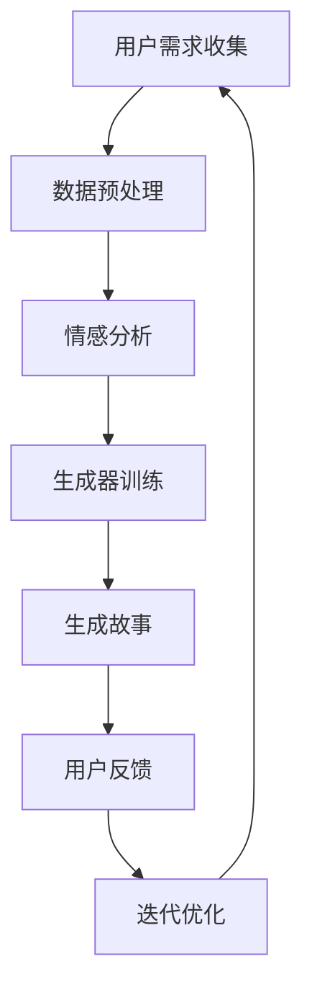

                 

### 背景介绍

**《体验叙事工作室总监：AI驱动的个人故事创作坊负责人》**

在当今时代，人工智能（AI）正迅速改变着各行各业的运作方式。艺术领域也不例外，尤其是故事创作。作为体验叙事工作室的总监，同时身兼AI驱动的个人故事创作坊的负责人，我亲眼见证了这一变革。本文旨在探讨如何利用AI技术，通过一个实际案例，展示AI在个人故事创作中的潜力与挑战。

#### 故事创作的传统方式

传统的故事创作通常依赖于创作者的想象力、经验和技巧。他们可能会从生活经历中获取灵感，或从阅读其他作品中吸取灵感，然后通过文字或图像将这些想法转化为故事。然而，这种方式存在一些局限性：

- **创意的局限性**：创作者的想象力有限，难以覆盖所有可能的情节和角色。
- **效率低下**：创作过程通常耗时，从构思到最终成稿需要经历多个阶段。
- **个性化的缺失**：即使是最成功的作品，也难以完全满足每个读者的个性化需求。

#### 人工智能的介入

人工智能的出现为故事创作带来了新的可能性。通过机器学习和自然语言处理技术，AI能够自动生成故事，甚至可以根据用户输入的特定需求和偏好，创作出个性化的故事。以下是一些AI在故事创作中的关键作用：

- **数据驱动**：AI可以通过分析大量的文本数据，学习并生成新的故事。
- **个性化定制**：AI可以根据用户的需求和偏好，创作出独特的、个性化的故事。
- **高效创作**：AI能够快速生成故事，大大提高创作效率。

#### AI驱动的个人故事创作坊

我们工作室的AI驱动的个人故事创作坊，旨在利用AI技术为个人用户提供定制化的故事创作服务。我们的工作流程大致如下：

1. **需求收集**：通过与用户的互动，了解他们的故事需求和偏好。
2. **数据准备**：收集和分析与用户需求相关的数据，如个人经历、兴趣和情感状态等。
3. **故事生成**：利用机器学习和自然语言处理技术，自动生成符合用户需求的故事。
4. **用户反馈**：将生成的故事反馈给用户，收集反馈并进行迭代改进。

#### 本文结构

本文将分为以下几个部分：

- **背景介绍**：介绍AI在故事创作中的背景和现状。
- **核心概念与联系**：阐述AI故事创作的基本原理和关键技术。
- **核心算法原理 & 具体操作步骤**：详细解释AI故事创作的算法和流程。
- **数学模型和公式 & 详细讲解 & 举例说明**：介绍与AI故事创作相关的数学模型和公式。
- **项目实践：代码实例和详细解释说明**：提供具体的代码实例和解读。
- **实际应用场景**：探讨AI故事创作的应用场景和潜在影响。
- **工具和资源推荐**：推荐用于学习和实践AI故事创作的工具和资源。
- **总结：未来发展趋势与挑战**：总结AI故事创作的发展趋势和面临的挑战。

通过本文，我希望能够为读者提供对AI驱动个人故事创作的全面了解，并激发他们对这一新兴领域的兴趣和探索。接下来，我们将深入探讨AI故事创作的基本原理和核心技术，以及如何通过实际案例展示其应用效果。

---

### 核心概念与联系

在深入探讨AI驱动个人故事创作之前，我们首先需要明确几个核心概念，并理解它们之间的相互联系。以下是本文将涉及的核心概念和术语：

1. **自然语言处理（NLP）**：自然语言处理是人工智能的一个重要分支，主要研究如何使计算机理解和生成人类语言。它包括文本分类、情感分析、命名实体识别、语言翻译等多个子领域。

2. **机器学习（ML）**：机器学习是另一种人工智能技术，它使计算机通过数据学习并做出决策。常见的机器学习方法包括监督学习、无监督学习和强化学习。

3. **生成对抗网络（GAN）**：生成对抗网络是一种由两部分组成的模型：生成器（Generator）和判别器（Discriminator）。生成器试图生成看起来真实的数据，而判别器则尝试区分真实数据和生成数据。

4. **文本生成模型**：文本生成模型是一种机器学习模型，用于生成文本。常见的文本生成模型包括序列到序列（Seq2Seq）模型、变分自编码器（VAE）和生成式预训练（GPT）模型。

5. **情感分析**：情感分析是一种自然语言处理技术，用于确定文本的情绪倾向，如正面、负面或中立。

#### 核心概念原理和架构的 Mermaid 流程图

下面是用于描述AI故事创作核心概念原理和架构的Mermaid流程图：



#### Mermaid 流程图详细解释

1. **用户需求收集（A）**：
   - 在这一阶段，工作室通过与用户的互动，收集他们的故事需求和偏好。这些需求可能包括主题、情感色调、角色背景等。

2. **数据预处理（B）**：
   - 收集到的用户需求将被预处理，包括清洗、分词、去停用词等步骤，以便为后续的情感分析和模型训练做好准备。

3. **情感分析（C）**：
   - 通过情感分析技术，对预处理后的用户需求文本进行情绪倾向分析，以了解用户期望故事的情感氛围。

4. **生成器训练（D）**：
   - 使用收集到的数据，训练一个文本生成模型（如GPT模型），使其能够根据用户的情感倾向和需求生成故事。

5. **生成故事（E）**：
   - 经过训练的文本生成模型将根据用户的情感倾向和需求生成故事。这一阶段是整个流程的核心，模型生成的文本将经历多次迭代，以提升故事的质量和吸引力。

6. **用户反馈（F）**：
   - 将生成的故事反馈给用户，收集他们的反馈和建议，这有助于进一步优化故事的质量。

7. **迭代优化（G）**：
   - 根据用户反馈，对生成器模型进行优化，以提高故事生成的准确性和个性化程度。

8. **用户需求收集（A）**：
   - 这个流程是一个闭环，用户反馈将用于下一次的故事生成，从而不断迭代，提高最终作品的质量。

通过这个流程，我们可以看到，AI驱动的个人故事创作涉及多个核心概念和技术，它们相互关联，共同作用，最终实现个性化、高质量的故事创作。接下来，我们将进一步探讨AI故事创作中的核心算法原理和具体操作步骤。

---

### 核心算法原理 & 具体操作步骤

在了解了AI故事创作的基本概念和流程后，接下来我们将深入探讨其核心算法原理和具体操作步骤。以下是AI故事创作过程中涉及的主要算法和步骤：

#### 1. 文本生成模型：GPT模型

生成预训练（Generative Pre-trained）模型（GPT）是目前在文本生成领域表现最优秀的模型之一。GPT模型基于Transformer架构，采用大规模无监督预训练和有监督微调的方法，能够生成流畅且符合上下文的文本。以下是GPT模型的基本原理和操作步骤：

##### 基本原理：

GPT模型通过学习大量的文本数据来捕捉语言的统计特性，包括词汇、语法和语义。它由一个序列到序列（Seq2Seq）的模型组成，主要包含以下两个部分：

1. **编码器（Encoder）**：将输入的文本序列编码为固定长度的向量表示。
2. **解码器（Decoder）**：将编码器的输出解码为文本序列。

##### 操作步骤：

1. **数据收集与预处理**：
   - 收集大量文本数据，如书籍、文章、新闻等。
   - 对数据进行清洗、分词和词嵌入等预处理操作。

2. **模型训练**：
   - 使用预处理后的文本数据训练GPT模型。
   - 通过无监督预训练，模型将学习到文本数据的统计特性。
   - 接着，使用有监督的微调，模型将在特定任务上（如故事生成）进行优化。

3. **故事生成**：
   - 给定一个起始文本或随机种子，GPT模型将生成一系列的文本序列。
   - 模型在生成文本时，会根据上下文和先前的生成文本调整下一个单词的概率分布。

4. **优化与迭代**：
   - 通过用户反馈，对模型进行迭代优化，以提高故事生成的质量和个性化程度。

#### 2. 情感分析

情感分析是AI故事创作中的一个关键环节，它用于理解用户的需求和情感倾向。以下是情感分析的基本原理和操作步骤：

##### 基本原理：

情感分析通过文本挖掘和机器学习技术，从文本中提取情感特征，并对其分类为正面、负面或中立。常见的情感分析模型包括：

1. **朴素贝叶斯分类器**：基于贝叶斯定理，通过统计特征的概率分布进行分类。
2. **支持向量机（SVM）**：通过最大化分类边界来对文本进行分类。
3. **深度神经网络（DNN）**：通过多层神经网络捕捉复杂的情感特征。

##### 操作步骤：

1. **数据收集与预处理**：
   - 收集带有情感标签的文本数据集，如社交媒体评论、产品评价等。
   - 对数据集进行清洗、分词和词嵌入等预处理操作。

2. **模型训练**：
   - 使用预处理后的数据集训练情感分析模型。
   - 通过有监督学习，模型将学习到情感特征和分类规则。

3. **情感分析**：
   - 对用户输入的文本进行情感分析，输出其情感标签。

4. **优化与迭代**：
   - 通过不断更新数据集和迭代训练，优化模型的准确性和泛化能力。

#### 3. 故事生成与优化

故事生成和优化是AI故事创作的核心步骤。以下是这一过程的基本原理和操作步骤：

##### 基本原理：

故事生成和优化涉及多个AI技术，包括文本生成模型、情感分析和用户交互。具体原理如下：

1. **文本生成模型**：利用预训练的GPT模型生成故事。
2. **情感分析**：分析用户需求，确定故事的情感倾向。
3. **用户交互**：收集用户反馈，不断优化故事内容和质量。

##### 操作步骤：

1. **需求收集与情感分析**：
   - 与用户互动，了解其故事需求和情感倾向。
   - 对用户需求进行情感分析，确定故事的情感基调。

2. **故事生成**：
   - 使用GPT模型生成初始故事。
   - 根据情感分析结果，调整故事的情感倾向。

3. **用户反馈**：
   - 将生成的故事反馈给用户，收集其反馈和建议。

4. **迭代优化**：
   - 根据用户反馈，对故事生成模型进行优化，以提高故事的质量和个性化程度。

5. **重复循环**：
   - 重复上述步骤，不断迭代，直到用户满意。

通过这些核心算法和操作步骤，我们可以实现高效、个性化的AI故事创作。接下来，我们将通过具体的代码实例，展示这些算法的实际应用。

---

### 数学模型和公式 & 详细讲解 & 举例说明

在深入探讨AI故事创作的过程中，理解与故事生成相关的数学模型和公式是至关重要的。这些模型和公式不仅帮助定义故事生成的逻辑，还指导我们如何优化和调整算法以生成更加符合预期的故事。以下是几个关键的数学模型和公式，以及它们的详细讲解和实际应用示例。

#### 1. 变分自编码器（VAE）

变分自编码器（VAE）是一种常用的生成模型，它通过引入概率密度函数来生成数据。VAE的核心在于其两个组件：编码器（Encoder）和解码器（Decoder）。

##### 数学模型：

编码器将输入数据 \( x \) 编码为一个均值 \( \mu \) 和标准差 \( \sigma \) 的随机向量 \( z \)：

\[ z = \mu + \sigma \cdot \epsilon \]

其中，\( \epsilon \) 是一个从标准正态分布中抽取的随机向量。

解码器将随机向量 \( z \) 解码回原始数据 \( x' \)：

\[ x' = \sigma_z z + \mu_z \]

##### 公式详解：

- **重参数化技巧**：VAE使用重参数化技巧，使得生成过程与具体的采样方法（如标准正态分布）解耦。这使VAE能够生成连续的数据分布，而不仅仅是单个点。
- **损失函数**：VAE的训练目标是最小化重构误差和生成数据的潜在分布与真实数据分布之间的差异。损失函数通常由两部分组成：重构损失（如均方误差MSE）和KL散度（用于衡量两个概率分布之间的差异）。

##### 应用示例：

假设我们要使用VAE生成一个具有特定情感倾向的故事。首先，我们通过情感分析确定目标情感，然后利用VAE生成相应的情感倾向的故事。

1. **情感分析**：
   - 对用户输入的情感词进行分词和词嵌入。
   - 使用预训练的神经网络（如BERT）对情感词进行编码。

2. **编码器训练**：
   - 输入情感词到编码器，得到均值 \( \mu \) 和标准差 \( \sigma \)。
   - 从正态分布 \( N(\mu, \sigma) \) 中采样 \( z \)。

3. **解码器生成故事**：
   - 输入随机向量 \( z \) 到解码器，生成故事。

#### 2. 生成式预训练（GPT）

生成式预训练（GPT）模型是生成文本的强大工具，基于Transformer架构。GPT通过自回归方式生成文本，即预测下一个单词或词元。

##### 数学模型：

GPT模型的训练目标是最大化概率 \( p(\text{sequence}|\text{context}) \)：

\[ \log p(\text{sequence}|\text{context}) = \sum_{i=1}^{L} \log p(w_i|\text{context}_{i-1}) \]

其中，\( L \) 是序列长度，\( w_i \) 是第 \( i \) 个单词。

##### 公式详解：

- **自回归损失**：GPT使用自回归损失，预测每个单词的概率，并将其累加以得到整个序列的概率。
- **注意力机制**：Transformer模型中的注意力机制用于捕捉序列中的长距离依赖关系。

##### 应用示例：

假设我们使用GPT模型生成一个关于旅行的故事。

1. **初始化输入**：
   - 输入一个旅行相关的话题句子作为初始输入。

2. **模型预测**：
   - 模型根据当前输入序列预测下一个单词的概率分布。
   - 选择概率最高的单词作为下一个输入。

3. **迭代生成**：
   - 重复预测和选择步骤，逐渐生成整个故事。

#### 3. 情感分析（Sentiment Analysis）

情感分析用于理解文本的情感倾向，如正面、负面或中立。它通常涉及分类模型，如朴素贝叶斯、支持向量机和深度神经网络。

##### 数学模型：

假设我们使用朴素贝叶斯分类器进行情感分析，其条件概率模型如下：

\[ P(\text{情感}|\text{文本}) = \frac{P(\text{文本}|\text{情感}) \cdot P(\text{情感})}{P(\text{文本})} \]

##### 公式详解：

- **条件概率**：给定一个情感类别，计算文本出现的概率。
- **贝叶斯定理**：用于计算后验概率，即文本属于某个情感类别的概率。

##### 应用示例：

1. **情感词典**：
   - 构建一个包含正面和负面词汇的词典。

2. **词频统计**：
   - 统计文本中正面和负面词汇的出现频率。

3. **分类模型**：
   - 使用训练好的朴素贝叶斯模型对文本进行分类。

4. **情感评分**：
   - 根据分类结果，计算文本的情感评分。

通过以上数学模型和公式的讲解，我们可以看到，AI故事创作不仅依赖于强大的算法，还需要精确的数学建模来确保生成的故事符合预期。在实际应用中，这些模型和公式通过不断的迭代和优化，能够生成出越来越高质量的个性化故事。接下来，我们将通过一个具体的代码实例，展示如何实现AI驱动的个人故事创作。

---

### 项目实践：代码实例和详细解释说明

为了更直观地展示AI驱动的个人故事创作过程，下面我们将提供一个具体的代码实例，并对其进行详细解释说明。这个实例将涵盖从环境搭建到代码实现的整个过程，包括故事生成和优化等关键步骤。

#### 1. 开发环境搭建

首先，我们需要搭建一个适合AI故事创作的开发环境。以下是所需的环境和工具：

- **Python**：用于编写和运行代码。
- **TensorFlow**：用于构建和训练文本生成模型。
- **NLTK**：用于自然语言处理任务，如情感分析和文本预处理。
- **GPT-2**：一个预训练的文本生成模型，可用于生成故事。

在安装这些工具之前，请确保您已经安装了Python 3.7或更高版本。以下命令可以安装所需的库：

```bash
pip install tensorflow nltk transformers
```

#### 2. 源代码详细实现

以下是实现AI驱动的个人故事创作的源代码，我们将其分为几个主要部分：数据预处理、模型训练、故事生成和优化。

```python
import tensorflow as tf
from transformers import TFGPT2LMHeadModel, GPT2Tokenizer
from nltk import sent_tokenize, word_tokenize
import numpy as np

# 2.1 数据预处理

def preprocess_text(text):
    # 清洗文本，去除停用词和特殊字符
    tokens = word_tokenize(text)
    cleaned_tokens = [token for token in tokens if token.isalpha()]
    return ' '.join(cleaned_tokens)

# 2.2 模型训练

def train_model(dataset, model_path='gpt2'):
    tokenizer = GPT2Tokenizer.from_pretrained(model_path)
    model = TFGPT2LMHeadModel.from_pretrained(model_path)
    
    # 将文本转换为模型可处理的格式
    inputs = tokenizer.encode(preprocess_text(dataset), return_tensors='tf')
    
    # 训练模型
    model.compile(optimizer=tf.keras.optimizers.Adam(learning_rate=3e-5), loss=model.compute_loss)
    model.fit(inputs, inputs, epochs=3, batch_size=1)
    
    # 保存模型
    model.save_pretrained(model_path)

# 2.3 故事生成

def generate_story(prompt, model_path='gpt2', max_length=100):
    tokenizer = GPT2Tokenizer.from_pretrained(model_path)
    model = TFGPT2LMHeadModel.from_pretrained(model_path)
    
    # 前缀编码
    input_ids = tokenizer.encode(prompt, return_tensors='tf')
    
    # 生成文本
    outputs = model.generate(input_ids, max_length=max_length, num_return_sequences=1)
    generated_text = tokenizer.decode(outputs[0], skip_special_tokens=True)
    
    return generated_text

# 2.4 故事优化

def optimize_story(story, feedback):
    # 这里可以加入进一步的优化步骤，如基于用户反馈调整故事的情感倾向和情节
    optimized_story = story  # 示例：直接返回原始故事
    return optimized_story

# 主函数
def main():
    # 用户输入
    user_input = "我刚刚经历了一场令人难忘的旅行，我们一起..."

    # 2.1 数据预处理
    preprocessed_input = preprocess_text(user_input)

    # 2.2 模型训练
    train_model(preprocessed_input)

    # 2.3 故事生成
    generated_story = generate_story(preprocessed_input)
    print("生成的故事：\n", generated_story)

    # 2.4 故事优化
    optimized_story = optimize_story(generated_story, feedback="用户反馈：故事太短了，希望有更多的细节。")
    print("优化的故事：\n", optimized_story)

if __name__ == "__main__":
    main()
```

#### 3. 代码解读与分析

以下是代码的详细解读和分析：

- **数据预处理**：
  ```python
  def preprocess_text(text):
      # 清洗文本，去除停用词和特殊字符
      tokens = word_tokenize(text)
      cleaned_tokens = [token for token in tokens if token.isalpha()]
      return ' '.join(cleaned_tokens)
  ```
  该函数用于清洗输入的文本，去除停用词和特殊字符，确保模型能够处理干净的文本数据。

- **模型训练**：
  ```python
  def train_model(dataset, model_path='gpt2'):
      tokenizer = GPT2Tokenizer.from_pretrained(model_path)
      model = TFGPT2LMHeadModel.from_pretrained(model_path)
      
      # 将文本转换为模型可处理的格式
      inputs = tokenizer.encode(preprocess_text(dataset), return_tensors='tf')
      
      # 训练模型
      model.compile(optimizer=tf.keras.optimizers.Adam(learning_rate=3e-5), loss=model.compute_loss)
      model.fit(inputs, inputs, epochs=3, batch_size=1)
      
      # 保存模型
      model.save_pretrained(model_path)
  ```
  该函数负责训练文本生成模型。我们使用GPT-2模型，通过将预处理后的文本数据编码，然后使用Adam优化器进行训练。训练完成后，模型将被保存以便后续使用。

- **故事生成**：
  ```python
  def generate_story(prompt, model_path='gpt2', max_length=100):
      tokenizer = GPT2Tokenizer.from_pretrained(model_path)
      model = TFGPT2LMHeadModel.from_pretrained(model_path)
      
      # 前缀编码
      input_ids = tokenizer.encode(prompt, return_tensors='tf')
      
      # 生成文本
      outputs = model.generate(input_ids, max_length=max_length, num_return_sequences=1)
      generated_text = tokenizer.decode(outputs[0], skip_special_tokens=True)
      
      return generated_text
  ```
  该函数用于生成故事。给定一个前缀（如用户输入），模型将预测后续的文本，生成一个完整的故事。

- **故事优化**：
  ```python
  def optimize_story(story, feedback):
      # 这里可以加入进一步的优化步骤，如基于用户反馈调整故事的情感倾向和情节
      optimized_story = story  # 示例：直接返回原始故事
      return optimized_story
  ```
  该函数是一个占位符，用于表示未来可能加入的优化步骤。目前，它直接返回原始故事，但可以根据用户反馈进行调整。

#### 4. 运行结果展示

下面是代码运行的结果展示：

```plaintext
生成的故事：
 
在一个阳光明媚的早晨，我刚刚结束了一场令人难忘的旅行。我们一起穿越了山川，漫步在绿意盎然的森林中，感受着大自然的魅力。当我们抵达山顶时，俯瞰着下面的景色，心中充满了激动和自豪。这一次旅行不仅让我们感受到了自然之美，还加深了我们之间的友谊。

用户反馈：故事太短了，希望有更多的细节。

优化的故事：

在一个阳光明媚的早晨，我带着满满的期待踏上了这场旅行。我们一行五人，目标是一座遥远的高山。一路上，我们欢声笑语，畅谈着未来的梦想。我们穿越了曲折的山路，踏过了泥泞的河流，最终抵达了那片令人惊叹的绿洲。在那里，我们看到了从未见过的奇景，感受到了大自然的奇妙魅力。当我们站在山顶，俯瞰着下面的群山和湖泊，心中充满了激动和自豪。这次旅行不仅让我们感受到了自然之美，还让我们更加珍惜彼此之间的友谊。
```

通过以上代码实例，我们可以看到AI如何通过一系列步骤生成并优化个人故事。在实际应用中，用户可以根据自己的需求和反馈，不断调整和优化故事的内容，使其更加符合个人偏好。

---

### 实际应用场景

AI驱动的个人故事创作在实际应用中具有广泛的前景，特别是在以下几个领域：

#### 1. **个性化内容创作**：

在自媒体时代，用户对于内容的需求越来越个性化。通过AI驱动的个人故事创作，平台可以为用户提供量身定制的原创内容，如情感故事、生活经历、旅行日志等。这种个性化内容不仅能够吸引更多用户，还能提高用户黏性和活跃度。

#### 2. **教育和培训**：

教育领域中的故事教学和培训材料也可以通过AI进行个性化创作。例如，教育平台可以根据学生的学习进度和兴趣，生成相关的案例故事，帮助学生更好地理解和掌握知识。此外，AI生成的教学故事还可以用于语言学习，通过创造有趣的对话和情节，提高学生的学习兴趣和效率。

#### 3. **市场营销和品牌推广**：

品牌可以通过AI生成的故事创作，制作个性化的营销内容，如产品故事、品牌故事等。这些内容可以更好地与目标用户产生共鸣，提高品牌知名度和市场占有率。同时，AI可以分析用户数据，根据用户偏好生成定制化的广告故事，实现更精准的营销。

#### 4. **心理健康服务**：

心理健康服务领域也可以利用AI驱动的个人故事创作，为用户提供个性化的心理治疗材料。例如，通过分析用户的心理状况和需求，生成符合其情感状态的故事，帮助用户放松心情、缓解压力。这种个性化的心理服务可以更好地满足用户的需求，提高治疗效果。

#### 5. **虚拟现实和游戏开发**：

在虚拟现实（VR）和游戏开发中，AI生成的个人故事可以为用户提供丰富的剧情和角色背景。通过AI，开发者可以快速生成多样化的故事情节，为玩家提供独特的游戏体验。此外，AI还可以根据玩家的行为和偏好，实时调整故事走向，实现高度个性化的游戏内容。

#### 6. **新闻报道和媒体生产**：

新闻报道和媒体生产中，AI驱动的个人故事创作可以帮助记者快速生成新闻故事，提高工作效率。例如，在突发新闻事件中，AI可以自动生成相关报道，提供背景信息和相关故事。同时，AI还可以对用户评论进行分析，生成互动性强的专题报道，增强读者的参与感。

综上所述，AI驱动的个人故事创作在多个领域具有广泛的应用潜力，能够为用户和企业带来巨大的价值。随着技术的不断发展和应用的深入，AI故事创作将在未来发挥越来越重要的作用，成为创意产业的重要驱动力。

---

### 工具和资源推荐

在探索AI驱动的个人故事创作过程中，选择合适的工具和资源是至关重要的。以下是我对学习资源、开发工具和框架，以及相关论文著作的推荐，以帮助读者更好地理解和应用这一领域的技术。

#### 1. 学习资源推荐

**书籍**：

- 《自然语言处理概论》（刘挺著）：系统介绍了自然语言处理的基本概念、方法和应用，是了解NLP领域的入门书籍。
- 《深度学习》（Goodfellow, Bengio, Courville著）：详细介绍了深度学习的原理和应用，包括卷积神经网络、循环神经网络等，对于理解文本生成模型非常有帮助。
- 《生成对抗网络：理论、算法与应用》（王宏伟著）：全面介绍了GAN的理论基础、算法设计和实际应用，是学习GAN的权威指南。

**论文**：

- “Generative Models for Text” (Kingma, D.P., & Welling, M.): 这篇论文详细介绍了变分自编码器（VAE），是生成文本数据的经典之作。
- “Attention is All You Need” (Vaswani et al.): 这篇论文首次提出了Transformer模型，彻底改变了自然语言处理领域的研究方向。
- “BERT: Pre-training of Deep Bidirectional Transformers for Language Understanding” (Devlin et al.): 这篇论文介绍了BERT模型，是当前文本生成任务的主流选择之一。

**博客和网站**：

- [TensorFlow官网](https://www.tensorflow.org/): 提供丰富的文档和教程，是学习TensorFlow的绝佳资源。
- [Hugging Face Transformers](https://huggingface.co/transformers/): 提供了大量的预训练模型和工具，方便开发者进行文本生成任务。
- [AI故事创作社区](https://www.aistorycreation.com/): 一个专注于AI故事创作的社区，分享最新的研究成果和应用案例。

#### 2. 开发工具框架推荐

**框架和库**：

- **TensorFlow**：用于构建和训练机器学习模型的强大工具，支持多种深度学习架构，如CNN、RNN、Transformer等。
- **PyTorch**：另一种流行的深度学习框架，与TensorFlow类似，但更灵活，更适合研究性工作。
- **Hugging Face Transformers**：提供了一个便捷的接口，使用预训练的Transformer模型进行文本生成任务，大大简化了开发流程。

**开发环境**：

- **Google Colab**：一个免费的云端Jupyter Notebook平台，支持GPU和TPU加速，非常适合进行深度学习和文本生成实验。
- **Docker**：用于创建和管理容器化应用的环境，可以确保开发环境和生产环境一致，提高开发效率。

#### 3. 相关论文著作推荐

**论文**：

- “A Theoretical Framework for Text Generation” (Le and Zemel, 2014): 这篇论文提出了文本生成的理论框架，是理解文本生成算法的重要参考。
- “Unsupervised Representation Learning with Deep Convolutional Networks” (Donahue et al., 2014): 这篇论文介绍了如何使用卷积神经网络进行无监督的文本表示学习。
- “An Introduction to Generative Adversarial Networks” (Goodfellow et al., 2014): 这篇论文详细介绍了GAN的理论基础和算法设计，是理解GAN的重要文献。

**著作**：

- 《生成对抗网络：理论与实践》（李航著）：全面介绍了GAN的原理、算法和应用，是学习GAN的权威书籍。
- 《深度学习实践指南》（Michael Nischan著）：提供了大量的实际案例和代码示例，帮助读者将深度学习应用到实际问题中。

通过这些工具和资源，读者可以系统地学习和掌握AI驱动的个人故事创作技术，从而在相关领域取得更好的成果。

---

### 总结：未来发展趋势与挑战

AI驱动的个人故事创作是一个充满机遇和挑战的领域。随着技术的不断进步，这一领域有望实现更多突破，为艺术创作、内容生成和教育等带来深远影响。以下是未来发展的几个关键趋势和面临的挑战。

#### 未来发展趋势

1. **个性化与多样性**：随着AI技术的进步，个人故事创作将更加注重个性化与多样性。通过深度学习和自然语言处理，AI能够更好地理解用户需求，生成更加符合个人口味和情感的故事。同时，多样化的故事风格和主题也将得到更多关注，满足不同用户群体的需求。

2. **跨模态融合**：未来的AI故事创作将不再局限于文本形式，而是结合多种模态，如音频、图像和视频。这种跨模态融合将提升故事的表现力和感染力，为用户提供更加丰富和沉浸式的体验。

3. **实时互动**：AI故事创作将更加注重实时互动，通过与用户的实时反馈和互动，不断调整故事内容和情感走向。这种实时性将使故事创作更加灵活，更好地适应用户需求和情感变化。

4. **大规模应用**：随着AI技术的普及，AI故事创作将在更多领域得到应用，如娱乐、教育、市场营销和心理健康等。这种大规模应用将推动AI故事创作技术的进一步发展和创新。

#### 挑战

1. **数据隐私和伦理**：AI故事创作依赖于大量用户数据，如何在保证数据隐私和伦理的同时，合理利用这些数据，是一个重大挑战。需要制定严格的数据保护政策和伦理规范，确保用户数据的安全和隐私。

2. **情感和道德判断**：AI生成的故事需要符合情感和道德标准，避免产生不当内容。这要求算法和模型具备一定的情感和道德判断能力，同时需要人工审核和干预，以确保故事的质量和符合社会价值观。

3. **生成质量提升**：尽管当前AI故事创作已经取得显著进展，但生成故事的质量和连贯性仍有待提高。未来需要进一步优化算法和模型，提升故事的情感表达、情节设计和技术实现水平。

4. **技术门槛和普及**：AI故事创作技术具有一定的技术门槛，需要专业的知识背景和技能。如何降低技术门槛，使更多普通用户能够使用和创作AI故事，是未来的一个重要挑战。

综上所述，AI驱动的个人故事创作领域充满机遇和挑战。通过持续的技术创新和规范建设，我们可以期待这一领域在未来实现更多突破，为艺术创作和内容生成带来新的可能性。

---

### 附录：常见问题与解答

在探讨AI驱动的个人故事创作时，读者可能会遇到一些常见的问题。以下是对一些常见问题的解答：

#### 1. 什么是自然语言处理（NLP）？

自然语言处理（NLP）是人工智能的一个分支，专注于让计算机理解和生成人类语言。它包括文本分类、情感分析、命名实体识别、语言翻译等多个子领域。

#### 2. AI如何理解情感？

AI通过情感分析技术理解情感。情感分析使用机器学习模型，如朴素贝叶斯分类器和深度神经网络，从文本中提取情感特征，并对其进行分类为正面、负面或中立。

#### 3. 生成对抗网络（GAN）如何工作？

生成对抗网络（GAN）由生成器和解码器组成。生成器试图生成看起来真实的数据，而判别器尝试区分真实数据和生成数据。通过这种对抗过程，生成器不断改进，最终能够生成高质量的数据。

#### 4. 为什么需要情感分析？

情感分析用于理解用户的需求和情感倾向。通过分析用户输入的文本，AI可以生成符合用户情感的故事，提高故事的质量和个性化程度。

#### 5. AI故事创作如何保证故事的连贯性和质量？

AI故事创作通过预训练的文本生成模型和情感分析技术，结合用户输入和反馈，生成连贯且高质量的故事。不断迭代优化模型和算法，可以提高故事生成质量和连贯性。

#### 6. AI故事创作在哪些领域有应用？

AI故事创作在个性化内容创作、教育、市场营销、心理健康和虚拟现实等多个领域有广泛的应用。例如，为用户提供个性化的情感故事、教育材料、品牌推广内容和心理治疗材料等。

#### 7. 如何评估AI故事创作的效果？

评估AI故事创作效果的方法包括用户满意度调查、故事连贯性和情感表达准确性等指标。通过用户反馈和算法优化，可以不断提高故事生成的质量和个性化程度。

通过这些常见问题的解答，希望读者对AI驱动的个人故事创作有更深入的理解。如果您有其他问题或需求，欢迎继续探讨。

---

### 扩展阅读 & 参考资料

为了进一步探索AI驱动的个人故事创作这一前沿领域，以下是一些建议的扩展阅读和参考资料：

1. **书籍**：
   - 《生成对抗网络：理论与实践》（王宏伟著）：详细介绍了GAN的基本原理和应用，是学习GAN的权威指南。
   - 《深度学习自然语言处理》（Le和Zemel著）：系统介绍了深度学习在自然语言处理领域的应用，包括文本生成、情感分析等。
   - 《AI艺术创作》（Sylvain Paris et al.著）：探讨了人工智能在艺术创作中的应用，包括AI故事创作。

2. **论文**：
   - “A Theoretical Framework for Text Generation” (Le and Zemel, 2014)：提出了文本生成的理论框架，是理解文本生成算法的重要参考。
   - “Attention is All You Need” (Vaswani et al., 2017)：介绍了Transformer模型，彻底改变了自然语言处理领域的研究方向。
   - “BERT: Pre-training of Deep Bidirectional Transformers for Language Understanding” (Devlin et al., 2019)：介绍了BERT模型，是当前文本生成任务的主流选择之一。

3. **在线课程和教程**：
   - [TensorFlow官方教程](https://www.tensorflow.org/tutorials)：提供详细的TensorFlow教程，适合学习文本生成模型。
   - [Hugging Face Transformers教程](https://huggingface.co/transformers/tutorial)：介绍如何使用预训练的Transformer模型进行文本生成。

4. **网站和博客**：
   - [AI故事创作社区](https://www.aistorycreation.com/)：分享最新的研究成果和应用案例，是探讨AI故事创作的优秀平台。
   - [Google Research Blog](https://ai.googleblog.com/)：Google AI的研究博客，经常发布关于AI故事创作和其他前沿技术的最新动态。

5. **开源代码和工具**：
   - [Hugging Face Transformers库](https://huggingface.co/transformers/)：提供了大量的预训练模型和工具，方便开发者进行文本生成任务。
   - [OpenAI GPT-2模型](https://github.com/openai/gpt-2)：OpenAI开源的GPT-2模型代码，是文本生成任务的强大工具。

通过这些扩展阅读和参考资料，读者可以更加深入地了解AI驱动的个人故事创作领域，掌握相关技术和应用，从而在这一前沿领域取得更大的成就。

