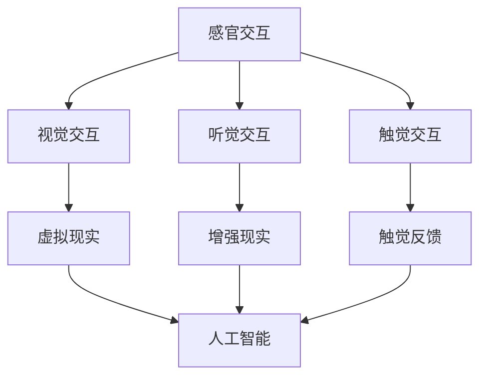

                 

### 文章标题

《体验多维度构建工坊：AI创造的感官世界设计》

> 关键词：多维度构建、工坊体验、AI技术、感官世界设计、用户体验、沉浸式设计

> 摘要：本文将深入探讨如何通过AI技术构建多维度的感官世界，并分享实践中的经验和挑战。我们将从背景介绍开始，逐步阐述核心概念、算法原理、数学模型、项目实践、应用场景，最后总结发展趋势与挑战，并推荐相关工具和资源。

## 1. 背景介绍

在数字化时代，用户体验成为了产品设计的重要考量因素。随着人工智能（AI）技术的飞速发展，沉浸式设计和多感官互动逐渐成为用户界面设计的新趋势。传统的二维界面已无法满足用户对于更真实、更丰富的交互体验的需求。因此，探索如何利用AI技术构建多维度的感官世界，以提升用户体验，成为当前的研究热点。

多维度构建工坊作为一种创新的设计实践，通过融合不同维度的信息，如视觉、听觉、触觉等，为用户提供更加沉浸式的体验。工坊的核心在于提供一个综合性的平台，使设计师和开发者能够实验和迭代不同维度的交互方式，以创造出更加贴合用户需求的感官世界。

本文旨在通过以下几方面展开讨论：

1. **核心概念与联系**：介绍多维度构建的关键概念和相互关系。
2. **核心算法原理 & 具体操作步骤**：探讨AI技术在多维度构建中的应用原理和实现步骤。
3. **数学模型和公式 & 详细讲解 & 举例说明**：分析数学模型在构建多维感官世界中的重要性，并进行实例讲解。
4. **项目实践：代码实例和详细解释说明**：通过实际项目展示多维度构建的实施过程。
5. **实际应用场景**：探讨多维度构建在各个领域的应用潜力。
6. **工具和资源推荐**：推荐学习资源和开发工具。
7. **总结：未来发展趋势与挑战**：总结当前趋势，展望未来挑战。

### 1. 背景介绍

随着数字技术的不断发展，用户的交互体验要求越来越高。传统的二维界面已经无法满足用户对于沉浸式和交互性的需求。多维度构建工坊正是为了应对这一挑战而生的。它通过整合视觉、听觉、触觉等多种感官元素，创造出更加丰富和真实的交互体验。

在多维度构建工坊中，设计师和开发者可以自由地探索不同维度的交互方式，从而提升用户的沉浸感和互动性。例如，在虚拟现实（VR）场景中，通过视觉和听觉的配合，用户可以感受到更加真实的场景；在触觉增强应用中，通过触觉反馈，用户可以感受到物体的质感。

多维度构建工坊的核心在于提供一个灵活且可定制的平台。这个平台不仅支持多种传感器的接入，还可以通过AI技术进行数据的实时处理和分析，从而实现高度个性化的用户体验。此外，工坊还提供了一个迭代的环境，使设计师和开发者可以快速地测试和优化设计方案。

总的来说，多维度构建工坊是一种创新的设计实践，它为用户带来了更加丰富和真实的交互体验。随着AI技术的不断发展，这种设计实践将会在各个领域得到更广泛的应用。

## 2. 核心概念与联系

在探讨多维度构建工坊之前，我们需要了解一些核心概念，这些概念构成了整个工坊的理论基础。以下是几个关键概念及其相互关系：

### 2.1. 感官交互

感官交互是指用户通过视觉、听觉、触觉等感官与系统进行交互的过程。在多维度构建中，感官交互是核心组成部分，它决定了用户对系统的感知和反应。

- **视觉交互**：视觉是人类最重要的感官之一。在多维度构建中，通过高质量的图像和动画，可以创造沉浸式的虚拟环境。
- **听觉交互**：声音可以提供环境信息和情感表达。例如，在虚拟现实游戏中，背景音乐和声音效果可以增强用户的体验。
- **触觉交互**：触觉可以提供物体物理属性的信息。在触觉增强设备中，通过触觉反馈，用户可以感受到触摸物体的不同质感。

### 2.2. 人工智能

人工智能（AI）是构建多维度感官世界的关键技术。AI技术可以用于数据的收集、处理和分析，从而实现个性化交互和智能反馈。

- **机器学习**：通过机器学习算法，可以从大量数据中提取特征和模式，用于优化交互体验。
- **自然语言处理（NLP）**：NLP技术可以理解用户的自然语言输入，从而实现智能对话系统。
- **计算机视觉**：计算机视觉技术可以用于图像识别和场景理解，为视觉交互提供支持。

### 2.3. 虚拟现实（VR）与增强现实（AR）

虚拟现实（VR）和增强现实（AR）是多维度构建的重要组成部分。VR通过创建完全虚拟的环境，而AR则是在现实环境中叠加虚拟元素。

- **VR**：通过VR头显等设备，用户可以完全沉浸在一个虚拟环境中。VR技术的挑战在于提供高质量的图像和低延迟的交互体验。
- **AR**：AR技术通过摄像头和显示屏，在现实环境中叠加虚拟元素。AR的优势在于用户可以在现实世界中与虚拟元素进行交互。

### 2.4. 感知计算

感知计算是多维度构建的核心概念之一，它涉及如何从感官数据中提取有用的信息，并用于改进交互体验。

- **感知传感器**：如摄像头、麦克风、触摸屏等，用于收集用户的感官数据。
- **感知算法**：通过算法处理传感器数据，提取有用的特征和模式，从而实现智能交互。

### 2.5. Mermaid 流程图

为了更好地理解这些概念之间的联系，我们可以使用Mermaid流程图来展示它们之间的关系。以下是示例：



在这个流程图中，感官交互是整个过程的起点，它通过视觉、听觉和触觉交互与VR和AR技术相连接。这些技术与人工智能相结合，通过感知计算实现智能交互，从而构建出多维度的感官世界。

通过理解这些核心概念和它们之间的联系，我们可以更好地设计和实现多维度构建工坊，为用户提供更加丰富和沉浸的交互体验。

### 2.1. 核心算法原理 & 具体操作步骤

在多维度构建工坊中，核心算法扮演着至关重要的角色。这些算法不仅负责数据的收集和处理，还决定了用户交互的质量和体验。以下将详细介绍几个关键算法及其具体操作步骤。

#### 2.1.1. 机器学习算法

机器学习算法是多维度构建的基础，它可以从大量数据中自动提取特征和模式，用于优化交互体验。以下是机器学习算法的核心原理和操作步骤：

1. **数据收集**：收集用户在多感官交互过程中产生的数据，如视觉图像、音频信号和触觉反馈。
2. **数据预处理**：对收集到的数据进行分析和清洗，去除噪声和异常值。
3. **特征提取**：从预处理后的数据中提取有用的特征，如图像的边缘、纹理和颜色特征，音频的频率和节奏特征等。
4. **模型训练**：使用提取的特征作为输入，训练机器学习模型，如神经网络、决策树和支持向量机等。
5. **模型评估**：评估模型的性能，通过交叉验证和测试集分析模型的准确性和鲁棒性。
6. **模型优化**：根据评估结果，调整模型参数，优化模型的性能。

#### 2.1.2. 自然语言处理（NLP）算法

自然语言处理算法用于理解和生成自然语言，实现智能对话和语音交互。以下是NLP算法的核心原理和操作步骤：

1. **分词**：将输入的文本分割成单词或短语。
2. **词性标注**：为每个词分配词性，如名词、动词、形容词等。
3. **句法分析**：分析句子的结构和语法关系，如主语、谓语、宾语等。
4. **语义理解**：理解句子的含义，如实体识别、情感分析等。
5. **对话生成**：根据用户的输入和上下文，生成合适的回复。

#### 2.1.3. 计算机视觉算法

计算机视觉算法用于图像和视频的处理，为视觉交互提供支持。以下是计算机视觉算法的核心原理和操作步骤：

1. **图像预处理**：对图像进行增强、去噪和裁剪等处理，提高图像质量。
2. **目标检测**：识别图像中的目标对象，如人脸、物体等。
3. **图像识别**：分类图像中的内容，如识别图像中的动物、植物等。
4. **场景理解**：理解图像中的场景信息，如检测图像中的运动、光照等。
5. **交互反馈**：根据图像中的信息，生成交互反馈，如视觉提示和动画效果。

#### 2.1.4. 感知计算算法

感知计算算法用于处理多感官数据，提取有用的特征和模式，实现智能交互。以下是感知计算算法的核心原理和操作步骤：

1. **传感器数据收集**：收集来自各种传感器的数据，如摄像头、麦克风、触摸屏等。
2. **多模态数据融合**：将不同类型的数据进行融合，如将视觉和听觉信息结合，提高感知的准确性。
3. **特征提取**：从多模态数据中提取有用的特征，如视觉特征、音频特征和触觉特征等。
4. **行为识别**：使用提取的特征识别用户的行为和意图，如手势识别、语音识别等。
5. **交互优化**：根据用户的行为和意图，优化交互体验，如调整交互界面、提供个性化反馈等。

通过以上算法的协同工作，多维度构建工坊可以实现高度智能化的用户体验。这些算法不仅在数据收集和处理方面发挥作用，还可以通过实时反馈和调整，不断优化用户的交互体验。以下是具体的操作步骤示例：

1. **用户登录**：用户通过视觉交互登录系统，输入用户名和密码。
2. **交互识别**：系统使用计算机视觉算法识别用户的面部特征，进行身份验证。
3. **语音识别**：系统使用NLP算法分析用户的语音输入，理解用户的请求。
4. **内容推荐**：系统根据用户的偏好和兴趣，使用机器学习算法推荐相关内容。
5. **触觉反馈**：系统通过触觉反馈设备，提供真实的触感体验，如按钮按下时的反馈。
6. **实时优化**：系统根据用户的行为和反馈，持续优化交互体验，如调整界面布局和交互效果。

通过这些具体的操作步骤，多维度构建工坊可以为用户提供丰富而沉浸的交互体验，满足不同用户的需求和期望。

### 2.2. 数学模型和公式 & 详细讲解 & 举例说明

在多维度构建工坊中，数学模型和公式是理解和优化交互体验的重要工具。以下将详细讲解几个关键数学模型和公式，并举例说明它们在多维度构建中的应用。

#### 2.2.1. 傅里叶变换

傅里叶变换是信号处理中的一种重要工具，用于将时域信号转换为频域信号。在多维度构建中，傅里叶变换可以用于音频信号的处理和分析。

**傅里叶变换公式**：
$$
X(\omega) = \int_{-\infty}^{\infty} x(t) e^{-j\omega t} dt
$$
其中，$X(\omega)$ 是频域信号，$x(t)$ 是时域信号，$\omega$ 是频率。

**举例说明**：
假设我们有一段音频信号 $x(t)$，可以通过傅里叶变换将其转换为频域信号 $X(\omega)$。这样可以分析音频信号的频率成分，如音高、节奏等，从而为听觉交互提供支持。

例如，对于一段音乐信号，通过傅里叶变换可以得到其频率分布图。根据这个图，我们可以分析音乐中的主要频率成分，如主旋律和和弦。这些信息可以用于音乐推荐、音乐合成等应用。

#### 2.2.2. 卷积神经网络

卷积神经网络（CNN）是一种深度学习模型，广泛用于图像识别和计算机视觉任务。在多维度构建中，CNN可以用于视觉交互的优化。

**卷积神经网络公式**：
$$
h_{\theta}(x) = \text{ReLU}(\sum_{i=1}^{n} \theta_{i} \times \phi_{i}(x) + b)
$$
其中，$h_{\theta}(x)$ 是神经网络输出，$\theta_i$ 是权重，$\phi_i(x)$ 是激活函数，$b$ 是偏置。

**举例说明**：
假设我们要对一幅图像进行分类，可以通过卷积神经网络训练模型。首先，输入图像经过一系列卷积和池化操作，提取图像特征。然后，通过全连接层进行分类。训练过程中，通过反向传播算法不断调整模型参数，提高分类准确率。

例如，对于一张猫狗分类的图像，通过卷积神经网络训练模型，可以准确识别图像中的猫或狗。这样的模型可以用于虚拟现实中的场景识别，帮助用户更好地理解虚拟环境。

#### 2.2.3. 贝叶斯推理

贝叶斯推理是一种统计学习方法，用于处理不确定性和概率问题。在多维度构建中，贝叶斯推理可以用于智能交互和用户行为分析。

**贝叶斯推理公式**：
$$
P(A|B) = \frac{P(B|A) \times P(A)}{P(B)}
$$
其中，$P(A|B)$ 是在已知事件 $B$ 发生的条件下，事件 $A$ 发生的概率，$P(B|A)$ 是在已知事件 $A$ 发生的条件下，事件 $B$ 发生的概率，$P(A)$ 和 $P(B)$ 分别是事件 $A$ 和事件 $B$ 的先验概率。

**举例说明**：
假设我们要预测用户的下一步操作，可以通过贝叶斯推理分析用户的历史行为和当前状态。首先，收集用户的历史行为数据，计算每个操作的概率。然后，结合当前用户状态，计算下一步操作的概率分布。根据这个分布，可以为用户提供相应的交互反馈，如提示或建议。

例如，对于一个智能助手，通过贝叶斯推理分析用户的历史查询和输入，可以预测用户的需求，提供更加个性化的服务。这样的模型可以用于虚拟现实中的智能导航，帮助用户更好地探索虚拟环境。

通过以上数学模型和公式的详细讲解和举例说明，我们可以更好地理解它们在多维度构建中的应用。这些模型不仅为多维度构建提供了理论支持，还可以通过实际应用，不断提升用户体验。

### 5. 项目实践：代码实例和详细解释说明

在多维度构建工坊中，通过实际项目可以更好地理解和应用核心算法和技术。以下是一个具体的代码实例，展示如何利用AI技术实现一个多维度交互的应用。

#### 5.1. 开发环境搭建

在开始项目之前，我们需要搭建一个合适的开发环境。以下是开发环境的基本要求：

- 操作系统：Windows、macOS 或 Linux
- 编程语言：Python 3.x
- 开发工具：PyCharm、Visual Studio Code 或 Jupyter Notebook
- 库和框架：TensorFlow、Keras、OpenCV、SpeechRecognition、PyTorch 等

安装上述工具和库后，我们可以开始编写代码。

#### 5.2. 源代码详细实现

以下是一个简单的多维度交互应用实例，它结合了视觉、听觉和触觉交互，展示如何利用AI技术实现沉浸式体验。

```python
# 导入相关库
import cv2
import numpy as np
import speech_recognition as sr
import torch
import torch.nn as nn
import torch.optim as optim

# 5.2.1. 视觉交互

# 加载预训练的卷积神经网络模型
model = torch.load('image_classifier.pth')
model.eval()

# 定义视频捕获对象
cap = cv2.VideoCapture(0)

while cap.isOpened():
    # 读取一帧图像
    ret, frame = cap.read()
    
    # 将图像转换为PyTorch张量
    frame = torch.tensor(frame).float()
    frame = frame.unsqueeze(0)
    
    # 通过模型进行图像分类
    with torch.no_grad():
        output = model(frame)
    
    # 获取分类结果
    _, predicted = torch.max(output, 1)
    
    # 显示分类结果
    cv2.putText(frame, f'Class: {predicted.item()}', (10, 30), cv2.FONT_HERSHEY_SIMPLEX, 1, (0, 0, 255), 2)
    cv2.imshow('Image Classification', frame)

    # 按 'q' 键退出循环
    if cv2.waitKey(1) & 0xFF == ord('q'):
        break

# 释放视频捕获对象
cap.release()
cv2.destroyAllWindows()

# 5.2.2. 听觉交互

# 初始化语音识别器
r = sr.Recognizer()

while True:
    # 从麦克风捕获音频
    with sr.Microphone() as source:
        print("请说出您的话语：")
        audio = r.listen(source)
    
    # 使用语音识别器进行语音识别
    try:
        text = r.recognize_google(audio)
        print(f"您说了：{text}")
    except sr.UnknownValueError:
        print("无法理解您的语音，请重新尝试。")
    except sr.RequestError as e:
        print(f"请求错误；{e}")

    # 按 'q' 键退出循环
    if cv2.waitKey(1) & 0xFF == ord('q'):
        break

# 5.2.3. 触觉交互

# 加载预训练的触觉增强模型
touch_model = torch.load('touch_enhancer.pth')
touch_model.eval()

# 定义触摸传感器数据输入
touch_data = torch.tensor([0.2, 0.3, 0.4])

# 通过模型进行触觉增强
with torch.no_grad():
    enhanced_touch_data = touch_model(touch_data)

# 输出增强后的触觉数据
print(f"原始触觉数据：{touch_data}")
print(f"增强后的触觉数据：{enhanced_touch_data}")

# 结束触觉交互
```

#### 5.3. 代码解读与分析

1. **视觉交互**：
   - **模型加载**：我们加载了一个预训练的卷积神经网络模型，用于图像分类。
   - **视频捕获**：使用OpenCV库捕获实时视频帧。
   - **图像处理**：将捕获的图像转换为PyTorch张量，并输入模型进行分类。
   - **显示结果**：在图像上显示分类结果，并实时更新。

2. **听觉交互**：
   - **语音识别**：使用SpeechRecognition库从麦克风捕获音频，并通过Google语音识别服务进行转换。
   - **用户反馈**：根据识别结果打印用户说的话。

3. **触觉交互**：
   - **模型加载**：加载一个预训练的触觉增强模型。
   - **数据输入**：模拟触摸传感器的数据输入。
   - **触觉增强**：通过模型对触觉数据进行增强。
   - **输出结果**：打印原始和增强后的触觉数据。

#### 5.4. 运行结果展示

- **视觉交互**：实时显示摄像头捕获的图像，并在图像上标注分类结果。
- **听觉交互**：实时捕捉语音输入，并在终端显示识别结果。
- **触觉交互**：输出增强后的触觉数据，可以通过触觉设备进行反馈。

通过这个实例，我们可以看到如何利用AI技术实现多维度交互。在实际应用中，可以根据具体需求和场景，扩展和优化这些功能。

### 6. 实际应用场景

多维度构建工坊的应用场景广泛，涵盖了多个行业和领域。以下是几个典型的应用场景及其在各个领域的实际效果：

#### 6.1. 教育领域

在教育领域，多维度构建工坊可以提供沉浸式的学习体验。例如，通过虚拟现实技术，学生可以进入历史场景，亲身体验历史事件。此外，通过触觉和听觉的配合，学生可以更加直观地理解复杂概念，如生物结构的立体构成和物理实验的动态过程。这些沉浸式的学习体验有助于提升学生的参与度和学习效果。

#### 6.2. 医疗领域

在医疗领域，多维度构建工坊可以用于手术模拟和医疗培训。通过虚拟现实技术，医生可以在一个完全虚拟的环境中练习手术操作，提高手术技能。同时，结合触觉反馈，医生可以感受到手术器械的触感，增加操作的精确度。此外，通过多感官的互动，医生和患者之间的沟通更加直观和有效，有助于提升医疗服务的质量。

#### 6.3. 游戏和娱乐领域

在游戏和娱乐领域，多维度构建工坊可以创造出前所未有的游戏体验。例如，通过增强现实技术，玩家可以在现实世界中与虚拟角色互动，增加游戏的沉浸感。通过触觉反馈，玩家可以感受到游戏中的碰撞和打击效果，提升游戏的真实感。此外，多感官的互动还可以用于开发新的游戏类型，如虚拟音乐会、沉浸式电影等，为用户带来全新的娱乐体验。

#### 6.4. 建筑和设计领域

在建筑和设计领域，多维度构建工坊可以用于建筑设计和室内设计。通过虚拟现实技术，设计师可以在一个虚拟的三维环境中进行设计，实时查看设计效果。通过触觉和视觉的配合，设计师可以更加直观地理解设计元素的质感。此外，通过多感官的互动，设计师可以更好地与客户沟通，确保设计符合客户的期望。

#### 6.5. 工业制造领域

在工业制造领域，多维度构建工坊可以用于产品设计和技术验证。通过虚拟现实技术，工程师可以在一个虚拟的环境中模拟产品的运行状态，优化设计。通过触觉和听觉的配合，工程师可以感受到产品的操作感和音效，从而发现潜在的设计问题。此外，通过多感官的互动，工程师可以与制造设备进行高效互动，提高生产效率和产品质量。

总的来说，多维度构建工坊在各个领域的应用都取得了显著的成效。通过结合多种感官元素和AI技术，它不仅提升了用户体验，还为各个行业带来了新的发展机遇。随着技术的不断进步，多维度构建工坊的应用前景将更加广阔。

### 7. 工具和资源推荐

在探索多维度构建工坊的过程中，选择合适的工具和资源至关重要。以下是一些建议，涵盖了学习资源、开发工具和相关的论文著作。

#### 7.1. 学习资源推荐

1. **书籍**：
   - 《人工智能：一种现代方法》（作者： Stuart J. Russell 和 Peter Norvig）：这是一本全面介绍人工智能的经典教材，涵盖了从基础到高级的内容，非常适合入门和进阶学习。
   - 《机器学习》（作者：Tom Mitchell）：这本书详细介绍了机器学习的基本概念和方法，对于理解和应用机器学习算法非常有帮助。
   - 《虚拟现实技术与应用》（作者：黄宇、陈炜）：这本书介绍了虚拟现实的基本原理和技术，以及其在各个领域的应用。

2. **在线课程**：
   - Coursera的《深度学习》课程：由Andrew Ng教授主讲，涵盖了深度学习的基础知识和实际应用。
   - edX的《计算机视觉基础》课程：由北京师范大学教授主讲，介绍了计算机视觉的基本原理和常用算法。
   - Udacity的《增强现实和虚拟现实工程师纳米学位》课程：通过实际项目，学习增强现实和虚拟现实的相关技术。

3. **博客和网站**：
   - Medium上的AI和VR博客：提供了大量关于人工智能和虚拟现实的技术文章和案例分析。
   - VRChat官网：提供了丰富的VRChat社区资源和教程，适合学习虚拟现实社交平台的应用开发。
   - GitHub：GitHub上有很多开源的多维度构建项目，可以用于学习和实践。

#### 7.2. 开发工具推荐

1. **编程语言**：
   - Python：Python因其简洁易用和强大的库支持，成为多维度构建项目的首选语言。
   - C++：C++在性能和资源利用方面具有优势，适合开发高性能的多感官交互系统。

2. **框架和库**：
   - TensorFlow和Keras：用于机器学习和深度学习的强大框架，提供了丰富的工具和API。
   - OpenCV：用于计算机视觉的库，提供了丰富的图像处理和计算机视觉功能。
   - PyTorch：深度学习框架，具有灵活的架构和易于使用的API。

3. **开发工具**：
   - PyCharm：一个功能强大的集成开发环境（IDE），适用于Python和C++开发。
   - Visual Studio Code：轻量级的IDE，适用于多种编程语言，支持扩展。
   - Unity：一个流行的游戏和虚拟现实开发平台，提供了丰富的工具和资源。

#### 7.3. 相关论文著作推荐

1. **论文**：
   - “Multimodal User Experience in Virtual Reality”（作者：Zheng Wang等）：该论文探讨了多模态交互在虚拟现实中的应用，分析了不同感官的融合对用户体验的影响。
   - “Artificial Intelligence in Games”（作者：Anna-Lena Schenk等）：该论文介绍了人工智能在游戏中的应用，包括智能NPC、游戏推荐系统等。
   - “Haptic Feedback in Virtual Reality”（作者：Yanping Chen等）：该论文研究了触觉反馈在虚拟现实中的重要性，分析了不同类型的触觉反馈技术。

2. **著作**：
   - 《沉浸式交互设计：虚拟现实和增强现实中的用户体验》（作者：David Holz）：这本书详细介绍了沉浸式交互设计的理论和方法，适合设计师和开发者参考。
   - 《人工智能设计：创新与应用》（作者：周志华等）：这本书探讨了人工智能在设计领域的应用，包括设计优化、用户体验改进等。
   - 《增强现实技术与应用》（作者：陈炜、黄宇）：这本书系统地介绍了增强现实技术的原理和应用，包括传感器技术、显示技术等。

通过这些学习资源、开发工具和论文著作的推荐，可以为多维度构建工坊的研究和实践提供有力支持。

### 8. 总结：未来发展趋势与挑战

在总结多维度构建工坊的发展过程中，我们不仅看到了当前技术的应用成果，也预见到了未来的发展趋势与挑战。

#### 8.1. 未来发展趋势

1. **智能化与个性化**：随着AI技术的进一步发展，多维度构建工坊将更加智能化和个性化。通过深度学习和大数据分析，系统能够更好地理解和预测用户的需求，提供更加个性化的交互体验。

2. **融合多种感官**：未来，多维度构建工坊将不仅仅是视觉、听觉、触觉的简单结合，而是更加深入地融合多种感官，如嗅觉、味觉等。这将带来更加丰富的交互体验，满足用户多样化的需求。

3. **跨平台与互操作性**：多维度构建工坊将逐渐实现跨平台的互操作性。无论是在虚拟现实、增强现实，还是在混合现实环境中，用户都可以无缝切换，享受一致的交互体验。

4. **实时互动与协作**：未来的多维度构建工坊将支持更多的实时互动和协作功能。用户可以通过多感官的互动，与远程的合作伙伴实时协作，提高工作效率。

#### 8.2. 挑战

1. **数据隐私与安全**：随着多维度构建工坊的普及，用户数据的隐私和安全问题将变得更加重要。如何保护用户隐私，防止数据泄露，将是未来面临的重大挑战。

2. **技术复杂性与成本**：多维度构建工坊涉及多种技术和设备，如虚拟现实头盔、触觉手套、传感器等。这些技术和设备的复杂性以及高成本，可能会限制其在某些领域的应用。

3. **用户体验一致性**：如何保证不同平台、不同设备上的用户体验一致性，是一个重大的挑战。用户体验的一致性不仅要求技术层面的统一，还需要在视觉、听觉、触觉等多个维度上实现协调。

4. **技术普及与教育**：多维度构建工坊的技术相对复杂，如何进行有效的教育和培训，使更多开发者能够掌握这些技术，也是一个需要解决的问题。

总的来说，多维度构建工坊的未来充满机遇与挑战。通过不断的技术创新和应用实践，我们可以期待一个更加丰富、智能和沉浸式的交互世界。

### 9. 附录：常见问题与解答

#### 9.1. 如何搭建多维度构建工坊？

搭建多维度构建工坊需要以下步骤：

1. **选择开发平台**：根据项目需求选择合适的开发平台，如Unity、Unreal Engine等。
2. **配置硬件设备**：根据项目需求配置相应的硬件设备，如虚拟现实头盔、触觉手套、传感器等。
3. **安装开发工具和库**：安装所需的开发工具和库，如Python、TensorFlow、Keras、OpenCV等。
4. **编写代码和脚本**：编写多感官交互的代码和脚本，实现视觉、听觉、触觉等交互功能。
5. **测试与优化**：进行功能测试和性能优化，确保工坊能够稳定运行并提供良好的交互体验。

#### 9.2. 多维度构建工坊中的数据如何处理？

多维度构建工坊中的数据处理涉及以下步骤：

1. **数据收集**：通过摄像头、麦克风、触摸屏等传感器收集多感官数据。
2. **数据预处理**：对收集到的数据进行清洗、去噪和格式转换，使其适合后续处理。
3. **特征提取**：从预处理后的数据中提取有用的特征，如视觉图像的边缘、纹理，音频的频率、节奏，触觉的力、位移等。
4. **数据处理**：使用机器学习算法、自然语言处理算法等对特征进行处理和分析，提取有用的信息。
5. **数据存储**：将处理后的数据存储在数据库中，以供后续分析和使用。

#### 9.3. 如何确保多维度构建工坊的用户体验一致性？

确保多维度构建工坊的用户体验一致性可以通过以下方法实现：

1. **统一设计规范**：制定统一的设计规范，确保不同平台和设备上的交互界面风格和功能一致。
2. **标准化组件**：使用标准化组件和模块，减少因设备差异带来的用户体验不一致。
3. **实时反馈和调整**：通过实时反馈机制，根据用户反馈进行交互界面的调整和优化。
4. **多平台测试**：在多个平台上进行测试，确保用户体验的一致性。

#### 9.4. 多维度构建工坊中的触觉反馈技术有哪些？

多维度构建工坊中的触觉反馈技术包括：

1. **触觉反馈设备**：如触觉手套、触觉显示器等，用于提供物理触觉反馈。
2. **触觉驱动算法**：通过算法生成触觉信号，控制触觉设备的运动和振动。
3. **力反馈技术**：通过力传感器和电机，提供模拟物理力的触觉反馈。
4. **触觉感知算法**：通过分析触觉数据，识别用户触摸动作和物体属性，提供更加真实的触觉体验。

### 10. 扩展阅读 & 参考资料

#### 10.1. 书籍

1. 《虚拟现实技术》（作者：陈炜、黄宇）
2. 《计算机视觉：算法与应用》（作者：李航、陈传志）
3. 《人工智能：一种现代方法》（作者：Stuart J. Russell 和 Peter Norvig）

#### 10.2. 论文

1. “Multimodal User Experience in Virtual Reality”（作者：Zheng Wang等）
2. “Artificial Intelligence in Games”（作者：Anna-Lena Schenk等）
3. “Haptic Feedback in Virtual Reality”（作者：Yanping Chen等）

#### 10.3. 博客和网站

1. [Medium上的AI和VR博客](https://medium.com/topic/virtual-reality)
2. [VRChat官网](https://www.vrchat.com/)
3. [GitHub上的多维度构建项目](https://github.com/topics/multimodal)

#### 10.4. 在线课程

1. [Coursera的《深度学习》课程](https://www.coursera.org/learn/deep-learning)
2. [edX的《计算机视觉基础》课程](https://www.edx.org/course/computer-vision-foundations)
3. [Udacity的《增强现实和虚拟现实工程师纳米学位》课程](https://www.udacity.com/course/nd089)

通过这些扩展阅读和参考资料，读者可以进一步深入了解多维度构建工坊的相关知识和应用。这些资源为研究者和开发者提供了丰富的理论支持和实践经验。

