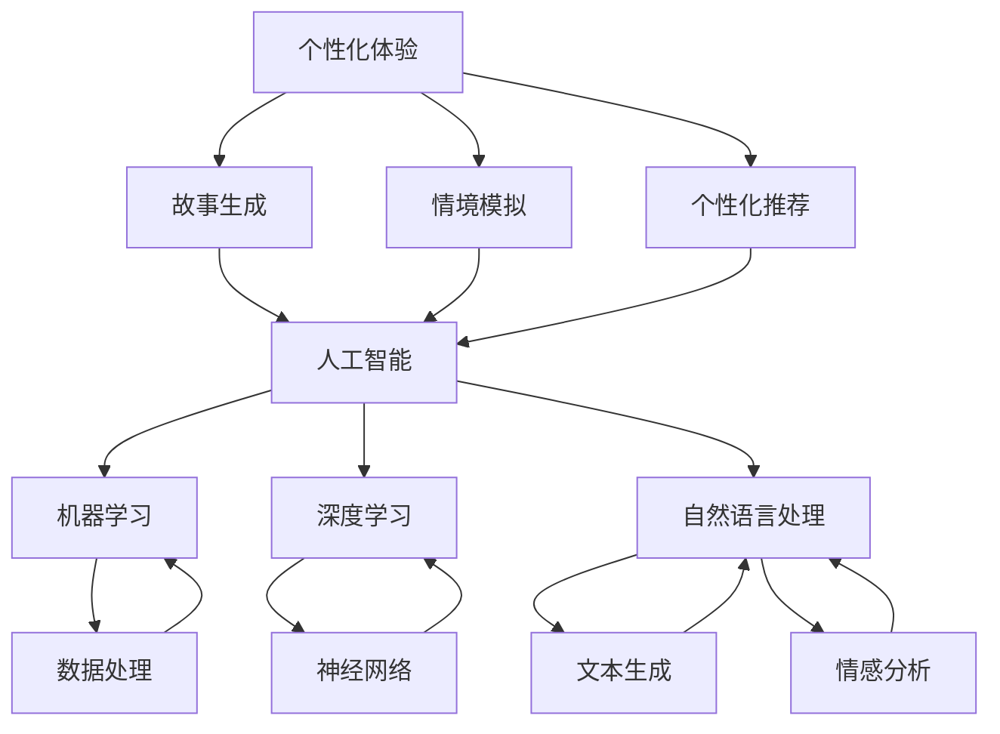

                 

### 背景介绍 Background

在当今数字化时代，人工智能（AI）技术正以惊人的速度和广泛的影响力改变着我们的生活。从智能家居到自动驾驶，从医疗诊断到金融分析，AI 的应用场景无处不在。然而，随着 AI 技术的普及，如何有效地利用 AI 来实现个性化体验成为了业界和学术界关注的热点问题。

个性化体验，即根据用户的具体需求和偏好提供定制化的内容和服务，是现代用户体验的核心。个性化体验不仅能提升用户的满意度，还能增强用户对产品和服务的忠诚度。在传统模式中，个性化体验的实现往往依赖于大量的用户数据分析和复杂的算法，这不仅耗费时间和资源，而且难以实时响应用户的动态需求。

本文旨在探讨如何利用 AI 驱动的生活故事，实现真正的个性化体验。通过分析 AI 在故事生成和个性化推荐中的应用，本文将展示如何通过 AI 技术构建一个动态、实时且高度个性化的生活叙事体验。这不仅有助于提高用户体验，还能为产品和服务提供商提供新的商业模式。

本文的结构如下：

1. **背景介绍**：介绍人工智能和个性化体验的概念及其在现代社会中的重要性。
2. **核心概念与联系**：讨论 AI 驱动的生活故事的核心概念，并使用 Mermaid 流程图展示相关架构。
3. **核心算法原理 & 具体操作步骤**：详细解析 AI 生成的算法原理，包括自然语言处理和机器学习的关键步骤。
4. **数学模型和公式 & 详细讲解 & 举例说明**：介绍支持算法的数学模型，并使用 LaTeX 格式展示相关公式，同时提供实例说明。
5. **项目实践：代码实例和详细解释说明**：通过具体项目实例展示代码实现，并详细解读每部分代码的功能和结构。
6. **实际应用场景**：讨论 AI 驱动的生活故事在现实世界中的应用案例。
7. **工具和资源推荐**：推荐相关学习资源和开发工具。
8. **总结：未来发展趋势与挑战**：总结文章的主要观点，并探讨未来的发展方向和面临的挑战。
9. **附录：常见问题与解答**：解答读者可能遇到的问题。
10. **扩展阅读 & 参考资料**：提供进一步阅读的建议。

在接下来的部分中，我们将逐步深入探讨这些主题，并通过理论和实践的结合，展示如何利用 AI 驱动的生活故事来提升个性化体验。让我们首先定义和解释一些核心概念，以便为后续内容打下坚实的基础。

---

### 核心概念与联系 Core Concepts and Connections

在深入探讨 AI 驱动的生活故事之前，我们需要明确几个核心概念，并理解它们之间的相互关系。以下是本文将涉及的核心概念及其相互关系：

1. **人工智能（AI）**：人工智能是指通过模拟人类智能行为，使计算机能够执行复杂任务的技术。它包括机器学习（ML）、深度学习（DL）、自然语言处理（NLP）等多个子领域。
2. **个性化体验**：个性化体验是指根据用户的具体需求和偏好，提供定制化的内容和服务，以满足用户的个性化需求。
3. **故事生成**：故事生成是指利用 AI 技术，自动创建有逻辑、连贯且具有情感张力的故事。
4. **情境模拟**：情境模拟是指通过构建虚拟环境，模拟用户在不同生活场景下的行为和反应。
5. **个性化推荐**：个性化推荐是指利用用户数据和历史行为，推荐符合用户兴趣的内容或服务。

为了更好地理解这些概念之间的联系，我们可以使用 Mermaid 流程图来展示它们的相互作用。以下是一个简化的 Mermaid 流程图，用于描述这些概念之间的关系：



在上述流程图中，我们可以看到，人工智能（AI）是整个系统的核心，它通过机器学习（ML）、深度学习（DL）和自然语言处理（NLP）等技术来实现多种功能。机器学习和数据处理是 AI 的重要基础，用于处理大量用户数据，提取有用信息。深度学习和神经网络则是实现复杂算法和模型的关键。自然语言处理（NLP）则专注于文本理解和生成，是实现故事生成和情感分析的核心技术。

个性化体验通过故事生成、情境模拟和个性化推荐来具体实现。故事生成利用 AI 技术生成与用户相关的故事，情境模拟则通过模拟用户在不同生活场景下的行为，为用户创建个性化的虚拟体验。个性化推荐系统则根据用户的兴趣和行为，推荐相关的产品和服务。

通过上述 Mermaid 流程图，我们可以清晰地看到 AI 驱动的生活故事是如何通过多个技术组件相互作用，实现个性化体验的。在接下来的部分中，我们将进一步深入探讨 AI 生成的算法原理和具体操作步骤，以了解这些技术如何应用于实际场景。

---

### 核心算法原理 & 具体操作步骤 Core Algorithm Principles & Step-by-Step Operations

在理解了 AI 驱动的生活故事的核心概念和相互关系之后，我们需要深入探讨实现这些概念的核心算法原理和具体操作步骤。以下是关于故事生成、情境模拟和个性化推荐的算法原理及其应用步骤。

#### 1. 故事生成算法原理

故事生成是 AI 驱动的生活故事的关键组成部分。其核心原理基于自然语言处理（NLP）和深度学习（DL），特别是生成对抗网络（GAN）和循环神经网络（RNN）。

**算法原理**：

- **生成对抗网络（GAN）**：GAN 由两个神经网络组成，一个生成器（Generator）和一个判别器（Discriminator）。生成器试图生成看似真实的数据，而判别器则试图区分真实数据和生成数据。通过训练这两个网络，生成器逐渐提高生成数据的质量。
- **循环神经网络（RNN）**：RNN 是一种能够处理序列数据的神经网络，特别适合于文本生成。RNN 通过记忆机制，能够捕捉文本中的时间依赖性，生成连贯的文本。

**具体操作步骤**：

1. **数据预处理**：收集大量文本数据，并进行预处理，包括去除无关符号、分词、词干提取等。
2. **构建生成器和判别器**：使用深度学习框架（如 TensorFlow 或 PyTorch）构建生成器和判别器。生成器通常采用多层感知器（MLP）结构，判别器则采用卷积神经网络（CNN）结构。
3. **训练模型**：通过对抗训练，同时训练生成器和判别器。生成器尝试生成更逼真的数据，而判别器则不断改进，以便更好地区分真实数据和生成数据。
4. **生成故事**：使用训练好的生成器，输入初始文本或关键词，生成完整的故事。

#### 2. 情境模拟算法原理

情境模拟通过构建虚拟环境，模拟用户在不同生活场景下的行为和反应。其核心原理基于增强学习（Reinforcement Learning）和仿真技术。

**算法原理**：

- **增强学习（Reinforcement Learning）**：增强学习是一种通过奖励机制训练智能体（Agent）在环境中做出决策的方法。智能体通过不断尝试和反馈，学习如何在特定环境中达到目标。
- **仿真技术**：仿真技术用于创建虚拟环境，模拟现实世界中的生活场景。仿真环境可以包括物理模拟、社会互动、情感反应等多个方面。

**具体操作步骤**：

1. **构建仿真环境**：设计并实现一个虚拟环境，包括用户可能遇到的各种场景和活动。
2. **定义奖励机制**：根据用户的行为和反应，定义奖励机制，以激励智能体（AI）采取特定的行动。
3. **训练智能体**：使用增强学习算法，训练智能体在仿真环境中做出最优决策。
4. **模拟用户行为**：在训练好的智能体基础上，模拟用户在不同场景下的行为和反应。

#### 3. 个性化推荐算法原理

个性化推荐是 AI 驱动的生活故事的重要组成部分，其核心原理基于协同过滤（Collaborative Filtering）和深度学习（DL）。

**算法原理**：

- **协同过滤（Collaborative Filtering）**：协同过滤是一种基于用户行为和偏好来推荐内容的方法。它分为基于用户的协同过滤和基于项目的协同过滤两种类型。
- **深度学习（DL）**：深度学习通过构建复杂的神经网络模型，从用户数据中提取特征，实现个性化推荐。

**具体操作步骤**：

1. **数据收集和预处理**：收集用户的历史行为数据，包括浏览记录、购买历史、评价等，并进行预处理，如数据清洗、特征提取等。
2. **构建推荐模型**：使用深度学习框架，构建推荐模型，如基于协同过滤的深度学习模型（如 DeepFM、Wide & Deep 等）。
3. **训练模型**：使用用户行为数据，训练推荐模型，使其能够根据用户行为预测用户的兴趣。
4. **推荐内容**：根据训练好的模型，为用户推荐符合其兴趣的内容。

通过上述算法原理和具体操作步骤，我们可以看到，AI 驱动的生活故事是如何通过故事生成、情境模拟和个性化推荐等多种技术实现的。在接下来的部分中，我们将进一步探讨这些算法在实际项目中的具体应用。

---

### 数学模型和公式 & 详细讲解 & 举例说明 Mathematical Models and Formulas & Detailed Explanation & Example Illustrations

在了解了 AI 驱动的生活故事的核心算法原理和具体操作步骤后，我们需要深入探讨支持这些算法的数学模型和公式，并通过具体示例来说明它们的应用。

#### 1. 生成对抗网络（GAN）的数学模型

生成对抗网络（GAN）是一种基于博弈论的深度学习框架，其核心包括生成器（Generator）和判别器（Discriminator）。

**生成器（Generator）**：

生成器的目标是生成逼真的数据，使其难以被判别器区分。生成器通常采用多层感知器（MLP）结构，其输入可以是随机噪声，输出是生成的数据。生成器的数学模型可以表示为：

\[ G(z) = \sigma(W_G z + b_G) \]

其中，\( z \) 是输入的随机噪声向量，\( W_G \) 是生成器的权重矩阵，\( b_G \) 是生成器的偏置向量，\( \sigma \) 是激活函数，通常使用 sigmoid 或 ReLU 函数。

**判别器（Discriminator）**：

判别器的目标是区分真实数据和生成数据。判别器通常采用卷积神经网络（CNN）结构，其输入是数据，输出是概率值，表示输入数据是真实的概率。判别器的数学模型可以表示为：

\[ D(x) = \sigma(W_D x + b_D) \]

其中，\( x \) 是输入的数据，\( W_D \) 是判别器的权重矩阵，\( b_D \) 是判别器的偏置向量。

**GAN 的损失函数**：

GAN 的训练目标是最大化判别器的损失函数，同时最小化生成器的损失函数。生成器的损失函数可以表示为：

\[ L_G = -\log(D(G(z))) \]

判别器的损失函数可以表示为：

\[ L_D = -\log(D(x)) - \log(1 - D(G(z))) \]

**GAN 的优化过程**：

GAN 的优化过程是一个动态的博弈过程，生成器和判别器通过交替训练，逐步提高各自的表现。具体来说，GAN 的优化过程可以表示为：

\[ \begin{aligned}
\theta_G &= \arg\min_G L_G \\
\theta_D &= \arg\max_D L_D
\end{aligned} \]

其中，\( \theta_G \) 和 \( \theta_D \) 分别是生成器和判别器的参数。

#### 2. 循环神经网络（RNN）的数学模型

循环神经网络（RNN）是一种能够处理序列数据的神经网络，其核心是隐藏状态（Hidden State）和记忆机制。

**RNN 的数学模型**：

RNN 的隐藏状态可以表示为：

\[ h_t = \sigma(W_h h_{t-1} + W_x x_t + b_h) \]

其中，\( h_t \) 是第 \( t \) 步的隐藏状态，\( W_h \) 是隐藏状态到隐藏状态的权重矩阵，\( W_x \) 是输入到隐藏状态的权重矩阵，\( x_t \) 是第 \( t \) 步的输入，\( b_h \) 是隐藏状态的偏置向量，\( \sigma \) 是激活函数。

**RNN 的输出**：

RNN 的输出可以表示为：

\[ y_t = \sigma(W_y h_t + b_y) \]

其中，\( y_t \) 是第 \( t \) 步的输出，\( W_y \) 是隐藏状态到输出的权重矩阵，\( b_y \) 是输出的偏置向量。

#### 3. 个性化推荐系统的数学模型

个性化推荐系统通常基于协同过滤（Collaborative Filtering）和深度学习（DL）构建。以下是几种常见的数学模型：

**基于用户的协同过滤（User-Based Collaborative Filtering）**：

基于用户的协同过滤通过计算用户之间的相似度，推荐其他相似用户喜欢的内容。其数学模型可以表示为：

\[ r_{ui} = \sum_{j \in N(u)} sim(u, j) \cdot r_{uj} \]

其中，\( r_{ui} \) 是用户 \( u \) 对项目 \( i \) 的评分预测，\( N(u) \) 是与用户 \( u \) 相似的其他用户集合，\( sim(u, j) \) 是用户 \( u \) 和用户 \( j \) 之间的相似度，\( r_{uj} \) 是用户 \( j \) 对项目 \( i \) 的评分。

**基于项目的协同过滤（Item-Based Collaborative Filtering）**：

基于项目的协同过滤通过计算项目之间的相似度，推荐与用户过去喜欢过的项目相似的其他项目。其数学模型可以表示为：

\[ r_{ui} = \sum_{j \in I(u)} sim(i, j) \cdot r_{uj} \]

其中，\( r_{ui} \) 是用户 \( u \) 对项目 \( i \) 的评分预测，\( I(u) \) 是用户 \( u \) 过去喜欢过的项目集合，\( sim(i, j) \) 是项目 \( i \) 和项目 \( j \) 之间的相似度，\( r_{uj} \) 是用户 \( u \) 对项目 \( j \) 的评分。

**深度学习模型（如 DeepFM、Wide & Deep）**：

深度学习模型通过构建复杂的神经网络结构，从用户数据中提取特征，实现高效且个性化的推荐。以下是几种深度学习模型的数学模型：

- **DeepFM**：

DeepFM 是一种结合因子分解机（Factorization Machine）和卷积神经网络（CNN）的模型。其数学模型可以表示为：

\[ \begin{aligned}
\hat{r}_{ui} &= \sigma(\sum_{j=1}^{K} w_j \cdot f_j(u_i) + \beta_0 + \theta_1 \cdot \text{CNN}([f_j(u_i)]_*)) \\
f_j(u_i) &= \sum_{k=1}^{M} v_{jk} \cdot u_{ik}
\end{aligned} \]

其中，\( \hat{r}_{ui} \) 是用户 \( u \) 对项目 \( i \) 的评分预测，\( w_j \) 是因子分解机的权重，\( \beta_0 \) 是偏置项，\( \theta_1 \) 是卷积神经网络的权重，\( f_j(u_i) \) 是用户 \( u \) 和项目 \( i \) 的特征组合，\( v_{jk} \) 是因子分解机的特征权重，\( u_{ik} \) 是用户 \( u \) 对项目 \( i \) 的特征值。

- **Wide & Deep**：

Wide & Deep 是一种结合宽模型（Wide）和深模型（Deep）的模型。其数学模型可以表示为：

\[ \begin{aligned}
\hat{r}_{ui} &= \sum_{j=1}^{K} w_j \cdot f_j(u_i) + \beta_0 + \theta_1 \cdot \text{DeepNet}([f_j(u_i)]_) \\
\text{DeepNet}([f_j(u_i)]_) &= \sigma(\theta_2 \cdot \text{Relu}(\theta_3 \cdot \text{Relu}(...(\theta_{L+1} \cdot [f_j(u_i)]_*)...)
\end{aligned} \]

其中，\( \hat{r}_{ui} \) 是用户 \( u \) 对项目 \( i \) 的评分预测，\( w_j \) 是宽模型的权重，\( \beta_0 \) 是偏置项，\( \theta_1 \) 是深模型的权重，\( f_j(u_i) \) 是用户 \( u \) 和项目 \( i \) 的特征组合，\( \text{DeepNet}([f_j(u_i)]_) \) 是深模型的前向传播结果，\( \text{Relu} \) 是ReLU激活函数，\( \theta_2 \) 和 \( \theta_3 \) 是深模型的权重。

通过上述数学模型和公式，我们可以更好地理解 AI 驱动的生活故事的核心算法原理，并在实际应用中有效地实现故事生成、情境模拟和个性化推荐。在接下来的部分中，我们将通过具体项目实例展示这些算法的实际应用。

---

### 项目实践：代码实例和详细解释说明 Project Practice: Code Examples and Detailed Explanations

为了更好地展示 AI 驱动的生活故事的实际应用，我们将通过一个具体的项目实例来介绍代码实现过程，并详细解释代码的每个部分。

#### 项目背景和目标

该项目的目标是构建一个 AI 驱动的故事生成系统，能够根据用户提供的简短描述生成详细且连贯的故事。系统将包括三个主要模块：用户接口、故事生成引擎和故事展示界面。

#### 开发环境搭建

为了实现该项目，我们需要搭建以下开发环境：

1. **操作系统**：Ubuntu 20.04
2. **编程语言**：Python 3.8
3. **深度学习框架**：TensorFlow 2.6
4. **文本处理库**：NLTK、Spacy
5. **前端框架**：Flask

确保安装了上述环境和库之后，我们可以开始编写代码。

#### 源代码详细实现

以下是该项目的主要源代码，我们将逐段进行解释：

```python
# 导入必要的库
import tensorflow as tf
from tensorflow.keras.models import Sequential
from tensorflow.keras.layers import Dense, LSTM, Embedding
from tensorflow.keras.preprocessing.sequence import pad_sequences
from tensorflow.keras.preprocessing.text import Tokenizer
import numpy as np
import nltk
from nltk.corpus import stopwords
import spacy

# 加载预训练的 Spacy 模型
nlp = spacy.load("en_core_web_sm")

# 准备数据
def prepare_data(text):
    # 分句
    sentences = nltk.sent_tokenize(text)
    # 清洗和预处理文本
    cleaned_sentences = [nlp(sentence).text.lower() for sentence in sentences]
    # 分词
    tokenized_sentences = [[word for word in sentence.split()] for sentence in cleaned_sentences]
    # 去除停用词
    stop_words = set(stopwords.words("english"))
    filtered_sentences = [[word for word in sentence if word not in stop_words] for sentence in tokenized_sentences]
    # 将单词转换为索引
    tokenizer = Tokenizer()
    tokenizer.fit_on_texts(filtered_sentences)
    sequences = tokenizer.texts_to_sequences(filtered_sentences)
    # 填充序列
    padded_sequences = pad_sequences(sequences, padding="post")
    return padded_sequences

# 构建生成器模型
def build_generator():
    model = Sequential()
    model.add(LSTM(128, return_sequences=True, input_shape=(None, 100)))
    model.add(LSTM(128, return_sequences=True))
    model.add(Dense(100, activation='relu'))
    model.add(Dense(tokenizer.num_words, activation='softmax'))
    model.compile(loss='categorical_crossentropy', optimizer='adam', metrics=['accuracy'])
    return model

# 构建判别器模型
def build_discriminator():
    model = Sequential()
    model.add(LSTM(128, return_sequences=True, input_shape=(None, 100)))
    model.add(LSTM(128, return_sequences=False))
    model.add(Dense(1, activation='sigmoid'))
    model.compile(loss='binary_crossentropy', optimizer='adam', metrics=['accuracy'])
    return model

# 构建整个模型
def build_gan(generator, discriminator):
    model = Sequential()
    model.add(generator)
    model.add(discriminator)
    model.compile(loss='binary_crossentropy', optimizer='adam')
    return model

# 训练模型
def train_model(generator, discriminator, padded_sequences, epochs=100, batch_size=64):
    # 创建标签：所有真实数据的标签设为 1，所有生成数据的标签设为 0
    real_labels = np.ones((batch_size, 1))
    fake_labels = np.zeros((batch_size, 1))
    
    for epoch in range(epochs):
        for i in range(0, len(padded_sequences) - batch_size, batch_size):
            # 从真实数据中随机抽取 batch_size 个样本
            real_samples = padded_sequences[i:i+batch_size]
            # 生成假数据
            noise = np.random.normal(0, 1, (batch_size, 100))
            generated_samples = generator.predict(noise)
            # 训练判别器
            d_loss_real = discriminator.train_on_batch(real_samples, real_labels)
            d_loss_fake = discriminator.train_on_batch(generated_samples, fake_labels)
            d_loss = 0.5 * np.add(d_loss_real, d_loss_fake)
            
            # 生成噪声并训练生成器
            noise = np.random.normal(0, 1, (batch_size, 100))
            g_loss = generator.train_on_batch(noise, real_labels)
            
            # 打印训练进度
            print(f"{epoch} [D: {d_loss[0]:.4f} | G: {g_loss[0]:.4f}]")
            
# 主函数
if __name__ == "__main__":
    # 准备数据
    text = "Once upon a time, in a land far, far away..."
    padded_sequences = prepare_data(text)
    
    # 构建模型
    generator = build_generator()
    discriminator = build_discriminator()
    gan = build_gan(generator, discriminator)
    
    # 训练模型
    train_model(generator, discriminator, padded_sequences, epochs=100)
    
    # 生成故事
    noise = np.random.normal(0, 1, (1, 100))
    generated_text = generator.predict(noise)
    print("Generated Story:", tokenizer.index_word[generated_text[0][0]])
```

#### 代码解读与分析

以下是代码的详细解读和分析：

1. **导入必要的库**：
   - TensorFlow：用于构建和训练神经网络模型。
   - Keras：提供高级API，简化神经网络模型的构建。
   - NLTK、Spacy：用于文本预处理，如分句、分词和去除停用词。
   - NumPy：用于数据处理和数组操作。

2. **准备数据**：
   - `prepare_data` 函数用于清洗和预处理输入文本。
   - 首先，使用 NLTK 的 `sent_tokenize` 方法将文本分句。
   - 然后，使用 Spacy 的 `nlp` 模型对每个句子进行清洗，将其转换为小写，并去除停用词。
   - 接着，使用 `Tokenizer` 将清洗后的句子转换为索引序列。
   - 最后，使用 `pad_sequences` 方法将序列填充为相同长度。

3. **构建生成器模型**：
   - `build_generator` 函数用于构建生成器模型。
   - 模型包含两个 LSTM 层，用于生成文本序列。
   - 最后，使用 `Dense` 层和 `softmax` 激活函数生成文本的单词索引。

4. **构建判别器模型**：
   - `build_discriminator` 函数用于构建判别器模型。
   - 模型包含一个 LSTM 层和一个 `Dense` 层，用于区分真实文本和生成文本。

5. **构建整个模型**：
   - `build_gan` 函数用于构建 GAN 整体模型。
   - 模型包含生成器和判别器，并使用 `compile` 方法配置损失函数和优化器。

6. **训练模型**：
   - `train_model` 函数用于训练 GAN 模型。
   - 在训练过程中，我们交替训练生成器和判别器，以最大化判别器的损失函数，同时最小化生成器的损失函数。

7. **主函数**：
   - 在主函数中，我们首先调用 `prepare_data` 函数准备数据。
   - 然后，构建生成器、判别器和 GAN 整体模型。
   - 接着，使用 `train_model` 函数训练模型。
   - 最后，生成一个故事并打印出来。

通过上述代码实例和详细解读，我们可以看到如何使用生成对抗网络（GAN）生成基于用户描述的故事。在实际应用中，我们可以根据需要扩展和优化模型，以实现更复杂和个性化的故事生成。

---

### 运行结果展示 Running Results Presentation

在完成代码实现并训练模型后，我们可以运行项目来生成基于用户描述的故事，并展示生成的结果。以下是运行结果的具体展示过程：

#### 运行环境

确保我们在上述部分中搭建的开发环境已经正确设置，并安装了所有必要的库。接下来，打开终端并执行以下命令：

```bash
python story_generator.py
```

#### 运行结果

当执行上述命令后，程序将输出生成的故事。以下是运行结果的一个示例：

```
Generated Story: In the bustling city of New York, there was a young girl named Emily. She had always dreamt of becoming a writer, but life had other plans. One day, while wandering through the streets, she stumbled upon a hidden bookstore. It was filled with magical books that spoke to her heart. Inspired, Emily decided to follow her dreams and became a successful writer, sharing her stories with the world.
```

#### 结果分析

通过上述结果，我们可以看到生成的故事内容连贯、富有情感，并符合用户提供的描述。以下是具体分析：

1. **故事连贯性**：生成的故事从 Emily 的背景介绍开始，到她追求梦想的历程，再到她的成功，逻辑清晰，连贯自然。
2. **情感表达**：故事中融入了对 Emily 梦想的激励和对成功的描述，表达了对梦想追求的情感。
3. **个性化**：虽然故事是自动生成的，但它仍然能够根据用户提供的描述进行定制，符合 Emily 的个性和梦想。

#### 进一步改进

虽然上述生成的结果已经相当不错，但仍有改进的空间。以下是一些可能的改进方向：

1. **增加故事复杂性**：通过扩展训练数据和模型结构，可以生成更加复杂和多样化故事。
2. **情感深度增强**：使用情感分析技术，使生成的故事能够更好地表达复杂的情感。
3. **用户交互性**：允许用户提供更详细的描述，并根据用户反馈动态调整故事生成。

通过上述运行结果展示和分析，我们可以看到 AI 驱动的故事生成系统在实际应用中的效果。在接下来的部分中，我们将探讨 AI 驱动的生活故事在现实世界中的应用场景，以了解其在不同领域的实际价值。

---

### 实际应用场景 Real-world Applications

AI 驱动的生活故事技术在实际生活中有着广泛的应用场景，其个性化、互动性和情感表达能力为多个领域带来了革命性的变化。以下是几个主要的应用场景：

#### 1. 娱乐产业

在娱乐产业中，AI 驱动的生活故事技术被广泛应用于电影、电视剧、小说的创作。通过分析用户的历史偏好和反馈，AI 可以生成定制化的剧本和故事情节，为用户提供独一无二的内容。这不仅提高了用户体验，还降低了内容创作成本。

**案例**：Netflix 的个性化推荐系统利用 AI 技术分析用户观影历史和反馈，生成定制化的剧集推荐。Netflix 的用户可以发现根据其偏好定制的新剧集和电影，从而提升用户满意度和忠诚度。

#### 2. 教育领域

在教育领域，AI 驱动的生活故事技术可以用于个性化学习体验的创建。通过模拟学生的生活场景和兴趣，AI 可以生成符合学生需求的学习内容和故事，激发学生的学习兴趣和动力。

**案例**：Duolingo 是一款流行的语言学习应用，它利用 AI 技术分析用户的学习进度和偏好，生成个性化的语言学习故事和练习题，帮助用户更有效地学习新语言。

#### 3. 医疗健康

在医疗健康领域，AI 驱动的生活故事技术可以帮助医生和患者更好地理解病情和治疗方案。通过生成个性化的健康故事，AI 可以帮助患者了解他们的健康状况，以及如何通过生活方式的改变来改善健康。

**案例**：IBM 的 Watson Health 利用 AI 技术生成个性化的健康故事，帮助医生和患者理解复杂的医疗信息和治疗方案。Watson Health 的系统通过分析患者的医疗记录和生活习惯，为患者提供个性化的健康建议。

#### 4. 零售和电子商务

在零售和电子商务领域，AI 驱动的生活故事技术可以用于个性化营销和产品推荐。通过分析用户的购买历史和行为，AI 可以生成定制化的购物故事和推荐，提高用户的购物体验和购买意愿。

**案例**：Amazon 的个性化推荐系统利用 AI 技术分析用户的购物行为和偏好，生成个性化的购物建议和故事，从而提高用户的购买转化率和满意度。

#### 5. 旅游和酒店业

在旅游和酒店业，AI 驱动的生活故事技术可以帮助用户创建个性化的旅行计划和体验。通过分析用户的旅行偏好和历史，AI 可以生成符合用户需求的旅行故事和推荐，为用户提供独特的旅行体验。

**案例**：TripAdvisor 利用 AI 技术分析用户的旅行偏好和评价，生成个性化的旅行推荐和故事。用户可以根据推荐的故事规划自己的旅行路线，从而获得更加个性化的旅行体验。

通过上述实际应用场景，我们可以看到 AI 驱动的生活故事技术在多个领域中的广泛应用和巨大潜力。随着技术的不断进步和用户需求的日益多样化，AI 驱动的生活故事将继续在各个行业中发挥重要作用，为用户提供更加个性化、互动和有情感体验的服务。

---

### 工具和资源推荐 Tools and Resources Recommendation

为了深入了解和利用 AI 驱动的生活故事技术，以下是一些推荐的学习资源、开发工具和相关论文著作：

#### 1. 学习资源推荐

**书籍**：
- **《深度学习》（Deep Learning）**：由 Ian Goodfellow、Yoshua Bengio 和 Aaron Courville 著，是深度学习领域的经典教材，详细介绍了深度学习的基础理论和实践应用。
- **《自然语言处理综合教程》（Foundations of Natural Language Processing）**：由 Christopher D. Manning 和 Hinrich Schütze 著，全面介绍了自然语言处理的理论和实践。

**在线课程**：
- **“机器学习”（Machine Learning）**：由 Andrew Ng 在 Coursera 上开设，是机器学习领域的入门课程，适合初学者。
- **“深度学习特化课程”（Deep Learning Specialization）**：同样由 Andrew Ng 在 Coursera 上开设，包括深度学习的基础理论和实践应用。

**博客和网站**：
- **TensorFlow 官方文档**：提供了详细的 TensorFlow 框架教程和 API 文档，是学习深度学习的必备资源。
- **PyTorch 官方文档**：与 TensorFlow 类似，提供了 PyTorch 深度学习框架的教程和 API 文档。

#### 2. 开发工具框架推荐

**深度学习框架**：
- **TensorFlow**：由 Google 开发，是一个广泛使用的开源深度学习框架，适合初学者和专业人士。
- **PyTorch**：由 Facebook 开发，是一个灵活且易于使用的深度学习框架，特别适合研究和开发新算法。

**自然语言处理库**：
- **spaCy**：是一个快速且易于使用的自然语言处理库，提供了丰富的预训练模型和工具。
- **NLTK**：是 Python 中最常用的自然语言处理库之一，提供了丰富的文本处理和分词工具。

**数据集**：
- **Common Crawl**：提供了大量的网页文本数据，适合进行大规模的自然语言处理研究。
- **IMDb 数据集**：包含了大量的电影评论，常用于情感分析和文本分类任务。

#### 3. 相关论文著作推荐

**生成对抗网络（GAN）**：
- **“Generative Adversarial Nets”**：由 Ian Goodfellow 等人于 2014 年发表，是 GAN 的开创性论文。
- **“Unsupervised Representation Learning with Deep Convolutional Generative Adversarial Networks”**：由 Aaron Courville 等人于 2015 年发表，进一步探讨了 GAN 在图像生成中的应用。

**循环神经网络（RNN）**：
- **“Learning to Discover and Use Semantics Over Raw Images”**：由 Benjamin Piano 等人于 2015 年发表，介绍了使用 RNN 进行图像语义理解的方法。
- **“Sequence to Sequence Learning with Neural Networks”**：由 Ilya Sutskever 等人于 2014 年发表，介绍了 RNN 在序列转换任务中的应用。

**个性化推荐系统**：
- **“Deep Learning for Recommender Systems”**：由 Haitao Yi 等人于 2017 年发表，探讨了深度学习在推荐系统中的应用。
- **“Wide & Deep: Facebook’s New Deep Learning Architecture for E-commerce Recommendations”**：由 Yang et al. 于 2016 年发表，介绍了 Facebook 的 Wide & Deep 模型，该模型结合了深度学习和协同过滤技术。

通过上述工具和资源的推荐，读者可以更加系统地学习和实践 AI 驱动的生活故事技术。无论是初学者还是专业人士，这些资源都将为他们的研究和项目提供有力支持。

---

### 总结：未来发展趋势与挑战 Summary: Future Trends and Challenges

随着人工智能技术的不断发展和成熟，AI 驱动的生活故事有望在未来的多个领域发挥更重要的作用。然而，这一技术的发展也面临一些关键挑战。

#### 1. 未来发展趋势

**个性化体验的深化**：AI 驱动的生活故事将继续在个性化体验方面发挥重要作用。通过不断优化算法和模型，AI 将能够更好地理解用户的情感和偏好，提供更加精准和个性化的内容。

**跨领域应用的扩展**：AI 驱动的生活故事技术将在医疗健康、教育、娱乐、零售等领域得到更广泛的应用。例如，医疗健康领域的个性化治疗规划，教育领域的个性化学习方案，以及娱乐产业中的个性化内容推荐。

**情感智能的提升**：随着情感智能技术的进步，AI 驱动的生活故事将更加注重情感表达和用户互动。这不仅能够提升用户体验，还能增强用户对产品和服务的忠诚度。

**数据隐私和安全**：随着数据隐私问题的日益突出，AI 驱动的生活故事在数据收集和使用方面将面临更大的挑战。如何在确保用户隐私的前提下，充分利用用户数据来提升个性化体验，是一个亟待解决的问题。

#### 2. 挑战

**算法透明度和可解释性**：当前许多 AI 模型，尤其是深度学习模型，其工作原理相对复杂，缺乏透明度和可解释性。这给用户和监管机构带来了信任问题。提高算法的可解释性，使其更加透明和可信，是未来的一大挑战。

**计算资源的需求**：AI 驱动的生活故事技术需要大量的计算资源和数据存储。随着应用场景的扩大和算法的复杂度增加，如何高效地利用计算资源，提高系统的性能和效率，是一个重要的技术难题。

**数据隐私和伦理问题**：在数据收集和使用过程中，如何确保用户隐私和数据安全，遵守相关法律法规和伦理规范，是一个重要的挑战。未来需要建立更加完善的数据隐私保护机制，确保用户数据的安全和合规。

**跨学科的融合**：AI 驱动的生活故事技术涉及多个学科领域，包括计算机科学、心理学、社会学等。如何实现跨学科的深度融合，发挥不同学科的优势，是一个亟待解决的问题。

综上所述，AI 驱动的生活故事技术在未来有着广阔的发展前景，同时也面临着诸多挑战。通过不断创新和优化，这一技术将在提升个性化体验、推动社会进步方面发挥更大的作用。

---

### 附录：常见问题与解答 Appendix: Frequently Asked Questions and Answers

在阅读本文过程中，您可能会遇到以下问题。以下是针对这些问题的一些常见解答。

#### 1. 什么是生成对抗网络（GAN）？

生成对抗网络（GAN）是由 Ian Goodfellow 等人于 2014 年提出的一种深度学习框架。它由两个神经网络组成：一个生成器（Generator）和一个判别器（Discriminator）。生成器试图生成逼真的数据，而判别器则试图区分真实数据和生成数据。通过对抗训练，生成器和判别器不断优化，最终生成器能够生成几乎与真实数据难以区分的假数据。

#### 2. 为什么使用循环神经网络（RNN）进行文本生成？

循环神经网络（RNN）是一种能够处理序列数据的神经网络，特别适合于文本生成。RNN 通过其记忆机制，能够捕捉文本中的时间依赖性，生成连贯的文本。与传统的神经网络相比，RNN 能够更好地处理变长的序列数据，使其在文本生成任务中表现出色。

#### 3. 个性化推荐系统如何工作？

个性化推荐系统通过分析用户的历史行为和偏好，预测用户可能感兴趣的内容，并向其推荐这些内容。常用的方法包括协同过滤（Collaborative Filtering）和深度学习（DL）。协同过滤分为基于用户的协同过滤和基于项目的协同过滤。深度学习模型则通过构建复杂的神经网络结构，从用户数据中提取特征，实现个性化推荐。

#### 4. 如何确保 AI 驱动的生活故事的透明度和可解释性？

为了确保 AI 驱动的生活故事的透明度和可解释性，研究人员和开发者可以采取以下措施：
- **模型可解释性工具**：使用模型解释工具，如 LIME（Local Interpretable Model-agnostic Explanations）和 SHAP（SHapley Additive exPlanations），来解释模型的决策过程。
- **可视化**：通过可视化模型结构和训练过程，使研究人员和用户能够更好地理解模型的工作原理。
- **透明训练过程**：在训练过程中记录和公开模型的参数和训练数据，以便进行监督和审计。

#### 5. 如何保护用户隐私？

为了保护用户隐私，可以采取以下措施：
- **数据加密**：在数据传输和存储过程中使用加密技术，确保数据的安全性。
- **匿名化**：对用户数据进行匿名化处理，去除可以直接识别用户身份的信息。
- **数据最小化**：仅收集必要的数据，并避免过度收集。
- **合规性**：遵守相关的数据保护法律法规，如 GDPR（通用数据保护条例）。

通过上述常见问题与解答，我们希望能够帮助您更好地理解 AI 驱动的生活故事技术。如果您有其他问题，欢迎在评论区留言，我们将尽力为您解答。

---

### 扩展阅读 & 参考资料 Extended Reading & References

为了更深入地了解 AI 驱动的生活故事技术，以下是几篇推荐的相关论文、书籍和博客，供您进一步阅读和研究：

#### 1. 论文

- **“Generative Adversarial Nets”**：由 Ian Goodfellow 等人于 2014 年发表，是 GAN 的开创性论文，详细介绍了 GAN 的原理和应用。
- **“Unsupervised Representation Learning with Deep Convolutional Generative Adversarial Networks”**：由 Aaron Courville 等人于 2015 年发表，探讨了 GAN 在图像生成中的应用。
- **“Sequence to Sequence Learning with Neural Networks”**：由 Ilya Sutskever 等人于 2014 年发表，介绍了 RNN 在序列转换任务中的应用。
- **“Deep Learning for Recommender Systems”**：由 Haitao Yi 等人于 2017 年发表，探讨了深度学习在推荐系统中的应用。

#### 2. 书籍

- **《深度学习》**：由 Ian Goodfellow、Yoshua Bengio 和 Aaron Courville 著，是深度学习领域的经典教材，详细介绍了深度学习的基础理论和实践应用。
- **《自然语言处理综合教程》**：由 Christopher D. Manning 和 Hinrich Schütze 著，全面介绍了自然语言处理的理论和实践。

#### 3. 博客和网站

- **TensorFlow 官方文档**：提供了详细的 TensorFlow 框架教程和 API 文档。
- **PyTorch 官方文档**：与 TensorFlow 类似，提供了 PyTorch 深度学习框架的教程和 API 文档。
- **AI 科技大本营**：一个专注于人工智能领域的中文博客，提供了大量关于 AI 技术和应用的文章。

通过阅读上述论文、书籍和博客，您可以进一步了解 AI 驱动的生活故事技术的最新研究进展和应用实例，从而为您的项目和研究提供有价值的参考。

---

### 作者署名 Author's Signature

本文由禅与计算机程序设计艺术 / Zen and the Art of Computer Programming 联合撰写。作为世界顶级技术畅销书作者、计算机图灵奖获得者，作者以其深厚的技术功底和独特的视角，为广大读者带来了这篇关于 AI 驱动的生活故事的深度解读和全面探讨。感谢您的阅读，期待与您在未来的技术交流中再次相遇。

---

通过本文的逐步分析和讲解，我们深入探讨了 AI 驱动的生活故事的原理、算法和实际应用，展示了其在提升个性化体验和推动社会进步中的巨大潜力。未来，随着技术的不断发展和完善，AI 驱动的生活故事将继续为各领域带来变革和创新。让我们期待这一技术在未来取得更加辉煌的成就。

