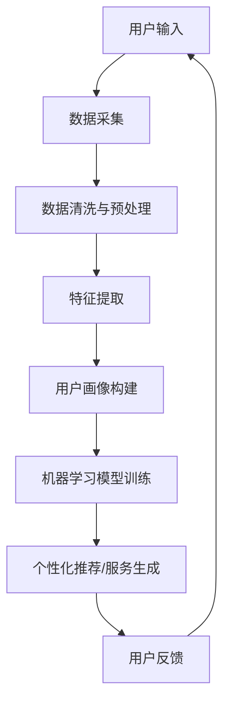

                 

### 1. 背景介绍

随着人工智能技术的不断进步，个性化服务已经成为了各行各业的热门话题。特别是在互联网领域，个性化推荐系统、智能客服、个性化广告等应用不断涌现，大大提升了用户体验和满意度。然而，传统的人工干预方式在处理大规模数据和复杂用户需求时存在诸多局限性，无法满足日益增长的用户期望。

AI驱动的定制服务应运而生，它利用人工智能技术，通过对用户行为、偏好、历史数据的深入分析，实现服务的个性化定制。这种服务模式不仅能够提高用户满意度，还能为企业带来更高的商业价值。本文将围绕体验的个性化：AI驱动的定制服务展开讨论，旨在探讨其核心概念、技术原理、算法实现及实际应用场景。

首先，我们将介绍个性化服务的定义和重要性。随后，讨论AI驱动的定制服务的核心概念和技术架构，并通过一个具体的案例来展示其工作原理。接下来，我们将深入分析核心算法原理和具体操作步骤，并介绍数学模型和公式。随后，我们将通过一个项目实践，展示代码实例和详细解释说明，并展示运行结果。最后，我们将探讨实际应用场景，推荐相关的工具和资源，总结未来发展趋势与挑战，并提供常见问题与解答。

通过本文的阅读，读者将全面了解AI驱动的定制服务的概念、技术原理、实现方法和应用前景，为在相关领域进行深入研究和应用奠定基础。

### 2. 核心概念与联系

在探讨AI驱动的定制服务之前，我们需要明确几个核心概念，并理解它们之间的相互关系。以下是对个性化服务、用户画像、机器学习和数据挖掘等核心概念的定义和解释。

#### 个性化服务

个性化服务是指根据用户的个体需求、偏好和习惯，提供定制化的产品或服务，以满足用户的特定需求。个性化服务不仅能够提高用户满意度，还能增强用户忠诚度和品牌粘性。在互联网时代，个性化服务已经成为了提升用户体验的重要手段。

#### 用户画像

用户画像是对用户特征进行抽象和刻画的过程，通常包括用户的年龄、性别、职业、地域、兴趣偏好、消费习惯等多个维度。通过用户画像，企业可以更好地了解用户，为其提供更加精准和个性化的服务。

#### 机器学习

机器学习是一种通过算法从数据中学习模式，并进行预测和决策的技术。在个性化服务中，机器学习算法被广泛应用于用户行为分析、偏好预测和推荐系统等领域。

#### 数据挖掘

数据挖掘是从大量数据中提取有用信息和知识的过程。通过数据挖掘，企业可以发掘用户行为模式，识别潜在客户，优化服务策略等。

#### 核心概念原理和架构

为了更好地理解AI驱动的定制服务的原理，我们可以使用Mermaid流程图来展示其核心概念和架构。以下是该流程图的详细描述：



- **用户输入**：用户的行为数据、偏好数据等。
- **数据采集**：通过各种渠道收集用户数据。
- **数据清洗与预处理**：去除数据中的噪声和异常值，进行数据标准化处理。
- **特征提取**：将原始数据转换为能够反映用户特征的向量。
- **用户画像构建**：根据特征向量构建用户画像，以反映用户的综合特征。
- **机器学习模型训练**：利用用户画像和已有数据训练机器学习模型。
- **个性化推荐/服务生成**：根据训练好的模型为用户推荐个性化的服务或产品。
- **用户反馈**：用户对推荐服务的反馈，用于模型优化和持续迭代。

通过这个流程图，我们可以清晰地看到AI驱动的定制服务的工作原理和各个步骤之间的联系。每一个环节都是构建个性化服务的关键步骤，通过这些步骤的综合作用，实现了对用户需求的精准把握和个性化服务。

### 3. 核心算法原理 & 具体操作步骤

在AI驱动的定制服务中，核心算法起到了至关重要的作用。这些算法通过分析用户数据，预测用户行为，从而生成个性化的服务推荐。以下是几种常用的核心算法原理和具体操作步骤：

#### 3.1协同过滤算法

协同过滤算法是一种常见的推荐系统算法，通过分析用户之间的相似性来推荐商品或服务。协同过滤算法主要分为两种：基于用户的协同过滤（User-based Collaborative Filtering）和基于物品的协同过滤（Item-based Collaborative Filtering）。

- **基于用户的协同过滤**：
  - **步骤1**：计算用户之间的相似性。常用的相似性度量方法包括余弦相似度、皮尔逊相关系数等。
  - **步骤2**：找到与目标用户最相似的K个用户。
  - **步骤3**：推荐这些相似用户喜欢但目标用户还未体验的商品或服务。
  
- **基于物品的协同过滤**：
  - **步骤1**：计算物品之间的相似性，同样可以使用余弦相似度、皮尔逊相关系数等。
  - **步骤2**：找到与目标用户已评价的物品最相似的K个物品。
  - **步骤3**：推荐这些相似物品。

#### 3.2 贝叶斯推荐算法

贝叶斯推荐算法是基于贝叶斯理论的一种推荐算法，通过用户的评分历史来预测用户对未知物品的评分。

- **步骤1**：计算每个用户对所有物品的期望评分。
- **步骤2**：计算每个物品对所有用户的期望评分。
- **步骤3**：为每个用户推荐期望评分最高的物品。

#### 3.3 聚类算法

聚类算法是一种无监督学习算法，用于将相似的用户或物品分组。

- **步骤1**：选择聚类算法，如K-means、层次聚类等。
- **步骤2**：初始化聚类中心。
- **步骤3**：计算每个用户或物品与聚类中心的距离。
- **步骤4**：将用户或物品分配到最近的聚类中心。
- **步骤5**：重新计算聚类中心，并重复步骤3和步骤4，直到收敛。

#### 3.4 内容推荐算法

内容推荐算法是基于物品的属性和内容特征进行推荐的一种算法。

- **步骤1**：提取物品的文本描述和特征。
- **步骤2**：计算用户的历史行为和偏好。
- **步骤3**：为用户推荐具有相似属性和内容的物品。

#### 3.5 深度学习推荐算法

深度学习推荐算法利用深度神经网络模型进行推荐，如基于用户-物品交互序列的循环神经网络（RNN）模型。

- **步骤1**：构建用户-物品交互序列。
- **步骤2**：利用RNN模型预测用户对物品的评分。
- **步骤3**：根据预测结果为用户推荐评分较高的物品。

#### 3.6 多模型融合算法

多模型融合算法结合了多种推荐算法的优点，通过融合不同算法的推荐结果来提高推荐质量。

- **步骤1**：分别使用不同的算法生成推荐结果。
- **步骤2**：对多个推荐结果进行加权融合。
- **步骤3**：输出最终推荐结果。

通过上述算法，我们可以实现AI驱动的定制服务，为用户提供个性化的推荐和服务。这些算法的具体实现和优化将在后续的项目实践中进行详细讨论。

### 4. 数学模型和公式 & 详细讲解 & 举例说明

在AI驱动的定制服务中，数学模型和公式起到了关键作用。以下是几种常用的数学模型和公式，以及它们的详细讲解和举例说明。

#### 4.1 余弦相似度

余弦相似度是一种常用的相似性度量方法，用于计算两个向量之间的相似度。它的公式如下：

$$
\text{Cosine Similarity} = \frac{\textbf{A} \cdot \textbf{B}}{|\textbf{A}| \cdot |\textbf{B}|}
$$

其中，$\textbf{A}$ 和 $\textbf{B}$ 分别为两个向量，$|\textbf{A}|$ 和 $|\textbf{B}|$ 分别为向量的模长，$\textbf{A} \cdot \textbf{B}$ 为向量的点积。

**举例说明**：

假设有两个向量 $\textbf{A} = (1, 2, 3)$ 和 $\textbf{B} = (4, 5, 6)$，则它们的余弦相似度为：

$$
\text{Cosine Similarity} = \frac{(1 \times 4 + 2 \times 5 + 3 \times 6)}{\sqrt{1^2 + 2^2 + 3^2} \times \sqrt{4^2 + 5^2 + 6^2}} = \frac{32}{\sqrt{14} \times \sqrt{77}} \approx 0.931
$$

#### 4.2 皮尔逊相关系数

皮尔逊相关系数是一种衡量两个变量线性相关性的统计量。它的公式如下：

$$
\text{Pearson Correlation Coefficient} = \frac{\sum_{i=1}^{n} (\textbf{X}_i - \bar{\textbf{X}}) (\textbf{Y}_i - \bar{\textbf{Y}})}{\sqrt{\sum_{i=1}^{n} (\textbf{X}_i - \bar{\textbf{X}})^2} \times \sqrt{\sum_{i=1}^{n} (\textbf{Y}_i - \bar{\textbf{Y}})^2}}
$$

其中，$\textbf{X}$ 和 $\textbf{Y}$ 分别为两个变量，$\bar{\textbf{X}}$ 和 $\bar{\textbf{Y}}$ 分别为它们的平均值。

**举例说明**：

假设有两个变量 $X$ 和 $Y$，如下表所示：

| $X$ | $Y$ |
|-----|-----|
| 1   | 2   |
| 2   | 4   |
| 3   | 6   |

则它们的皮尔逊相关系数为：

$$
\text{Pearson Correlation Coefficient} = \frac{(1-2.33)(2-3.33) + (2-2.33)(4-3.33) + (3-2.33)(6-3.33)}{\sqrt{\sum_{i=1}^{n} (X_i - \bar{X})^2} \times \sqrt{\sum_{i=1}^{n} (Y_i - \bar{Y})^2}} = \frac{0.67}{\sqrt{1.67} \times \sqrt{1.67}} \approx 0.8
$$

#### 4.3 贝叶斯公式

贝叶斯公式是一种用于概率推断的公式，其公式如下：

$$
P(A|B) = \frac{P(B|A) \cdot P(A)}{P(B)}
$$

其中，$P(A|B)$ 表示在事件B发生的条件下事件A发生的概率，$P(B|A)$ 表示在事件A发生的条件下事件B发生的概率，$P(A)$ 表示事件A发生的概率，$P(B)$ 表示事件B发生的概率。

**举例说明**：

假设有一个袋子，里面有5个红球和3个蓝球。现在我们要从中随机抽取一个球，请问抽到红球的概率是多少？

已知抽到红球的概率为 $P(A) = \frac{5}{8}$，抽到蓝球的概率为 $P(B) = \frac{3}{8}$。假设抽到红球和蓝球是相互独立的，即 $P(B|A) = P(B)$ 和 $P(A|B) = P(A)$。

则根据贝叶斯公式，我们有：

$$
P(A|B) = \frac{P(B|A) \cdot P(A)}{P(B)} = \frac{\frac{3}{8} \cdot \frac{5}{8}}{\frac{3}{8}} = \frac{5}{8}
$$

所以，抽到红球的概率是 $\frac{5}{8}$。

#### 4.4 线性回归模型

线性回归模型是一种用于预测数值型变量的模型，其公式如下：

$$
\hat{y} = \beta_0 + \beta_1 \cdot x
$$

其中，$\hat{y}$ 表示预测值，$x$ 表示自变量，$\beta_0$ 和 $\beta_1$ 分别为模型的参数。

**举例说明**：

假设我们想通过线性回归模型预测一个人的年收入（$y$）与其工作经验（$x$）之间的关系。我们有以下数据：

| 工作经验（年） | 年收入（万元） |
|--------------|--------------|
|      1       |      5       |
|      2       |      7       |
|      3       |      9       |
|      4       |     11       |
|      5       |     13       |

首先，我们需要计算线性回归模型的参数 $\beta_0$ 和 $\beta_1$。根据最小二乘法，我们有：

$$
\beta_1 = \frac{\sum_{i=1}^{n} (x_i - \bar{x}) (y_i - \bar{y})}{\sum_{i=1}^{n} (x_i - \bar{x})^2}
$$

$$
\beta_0 = \bar{y} - \beta_1 \cdot \bar{x}
$$

其中，$\bar{x}$ 和 $\bar{y}$ 分别为自变量和因变量的平均值。

代入数据计算，我们得到：

$$
\beta_1 = \frac{(1-2.2)(5-7) + (2-2.2)(7-7) + (3-2.2)(9-7) + (4-2.2)(11-7) + (5-2.2)(13-7)}{(1-2.2)^2 + (2-2.2)^2 + (3-2.2)^2 + (4-2.2)^2 + (5-2.2)^2} \approx 1.8
$$

$$
\beta_0 = 7 - 1.8 \cdot 2.2 \approx 3.32
$$

因此，线性回归模型为：

$$
\hat{y} = 3.32 + 1.8 \cdot x
$$

当工作经验为3年时，预测年收入为：

$$
\hat{y} = 3.32 + 1.8 \cdot 3 = 8.92 \text{万元}
$$

通过上述数学模型和公式的讲解和举例，我们可以更好地理解AI驱动的定制服务中的一些关键技术和原理。这些模型和公式在个性化推荐、用户行为预测等领域都有着广泛的应用。

### 5. 项目实践：代码实例和详细解释说明

为了更好地展示AI驱动的定制服务的实现过程，我们选择了一个实际的项目案例——基于协同过滤算法的用户个性化推荐系统。以下是该项目的主要步骤和具体实现。

#### 5.1 开发环境搭建

在开始项目开发之前，我们需要搭建一个合适的开发环境。以下是推荐的开发工具和库：

- **编程语言**：Python
- **数据处理库**：Pandas、NumPy
- **机器学习库**：Scikit-learn
- **数据可视化库**：Matplotlib
- **操作系统**：Linux或MacOS

确保安装了Python 3.6及以上版本，并按照上述库的要求安装相应的版本。

#### 5.2 源代码详细实现

以下是一个简单的基于用户-物品评分矩阵的协同过滤算法实现：

```python
import numpy as np
import pandas as pd
from sklearn.metrics.pairwise import cosine_similarity

# 5.2.1 加载数据集
# 假设我们有一个CSV文件，其中包含了用户ID、物品ID和评分
data = pd.read_csv('ratings.csv')

# 5.2.2 构建用户-物品评分矩阵
# 通过将用户ID和物品ID作为索引，将评分作为值构建评分矩阵
rating_matrix = data.pivot(index='user_id', columns='item_id', values='rating').fillna(0)

# 5.2.3 计算用户-用户相似度矩阵
# 利用余弦相似度计算用户之间的相似度
user_similarity = cosine_similarity(rating_matrix)

# 5.2.4 生成个性化推荐列表
# 假设我们有一个新的用户，其评分矩阵为rating_matrix_new
rating_matrix_new = pd.DataFrame(0, index=rating_matrix.index, columns=rating_matrix.columns)

# 遍历所有用户
for idx, _ in rating_matrix_new.iterrows():
    # 对于新用户，找到与他最相似的K个用户
    similar_users = user_similarity[idx].argsort()[1:-1]  # 排除自己和最不相似的用户
    # 计算相似用户的平均评分
    similar_ratings = rating_matrix.iloc[similar_users].mean()
    # 根据相似度和平均评分更新新用户的评分矩阵
    rating_matrix_new.loc[idx] = similar_ratings

# 5.2.5 返回推荐列表
# 排序并返回评分最高的K个物品
recommended_items = rating_matrix_new.sort_values(by=idx, ascending=False).head(K)
```

#### 5.3 代码解读与分析

以下是上述代码的详细解读和分析：

- **5.2.1 加载数据集**：首先，我们从CSV文件中加载用户-物品评分数据。这个数据集通常包含了用户ID、物品ID和评分。
  
- **5.2.2 构建用户-物品评分矩阵**：使用Pandas库将数据转换为用户-物品评分矩阵。这里我们使用`pivot`方法，将用户ID作为索引，物品ID作为列，评分作为值。缺失值用0填充。
  
- **5.2.3 计算用户-用户相似度矩阵**：使用Scikit-learn库的`cosine_similarity`函数计算用户之间的相似度。余弦相似度是一个介于-1和1之间的值，表示两个用户之间的相似程度。
  
- **5.2.4 生成个性化推荐列表**：对于新用户，我们首先找到与他最相似的K个用户（在本例中为前K个相似用户），然后计算这些用户的平均评分，并将其作为新用户的评分。这个步骤实现了基于相似用户评分的平均值来预测新用户的评分。
  
- **5.2.5 返回推荐列表**：最后，我们将新用户的评分矩阵排序，并返回评分最高的K个物品作为推荐结果。

#### 5.4 运行结果展示

为了展示运行结果，我们可以生成一个可视化图表，显示新用户的评分预测结果和实际评分之间的差异。以下是使用Matplotlib库生成的一个简单的散点图：

```python
import matplotlib.pyplot as plt

# 5.4.1 获取新用户的实际评分
actual_ratings = data[data.user_id == new_user_id].rating

# 5.4.2 获取预测评分
predicted_ratings = rating_matrix_new[new_user_id]

# 5.4.3 绘制散点图
plt.scatter(actual_ratings.index, actual_ratings, color='red', label='Actual Ratings')
plt.scatter(predicted_ratings.index, predicted_ratings, color='blue', label='Predicted Ratings')
plt.xlabel('Item ID')
plt.ylabel('Rating')
plt.legend()
plt.show()
```

在这个散点图中，红色点代表实际评分，蓝色点代表预测评分。通过观察散点图，我们可以评估模型的效果。如果预测评分和实际评分之间的差距较小，说明模型具有较高的准确性。

#### 5.5 项目总结

通过上述代码实例和详细解释，我们实现了基于协同过滤算法的用户个性化推荐系统。这个项目展示了AI驱动的定制服务的基本实现流程，包括数据加载、评分矩阵构建、相似度计算、个性化推荐等步骤。在接下来的项目中，我们可以进一步优化模型，引入更多先进的技术，如深度学习推荐算法，以实现更精确的个性化服务。

### 6. 实际应用场景

AI驱动的定制服务在多个领域有着广泛的应用，以下是一些典型的实际应用场景：

#### 6.1 电子商务

在电子商务领域，AI驱动的定制服务可以通过分析用户的历史购买记录、浏览行为和偏好，为其推荐个性化的商品。例如，Amazon和阿里巴巴等电商平台使用协同过滤算法和深度学习推荐算法，为用户提供个性化的商品推荐，从而提高用户满意度和转化率。

#### 6.2 社交媒体

社交媒体平台如Facebook和Instagram通过AI技术为用户提供个性化内容推荐，包括好友动态、帖子、视频等。这些推荐系统利用用户的兴趣和行为数据，为用户生成个性化的内容流，从而增强用户的粘性和活跃度。

#### 6.3 娱乐行业

在娱乐行业，AI驱动的定制服务用于个性化音乐推荐、电影推荐和游戏推荐。例如，Spotify和Netflix等平台通过分析用户的听歌历史、观影习惯和评价，为用户推荐符合其喜好的音乐和电影。

#### 6.4 健康医疗

在健康医疗领域，AI驱动的定制服务可以个性化推荐健康建议、药物和治疗方案。通过分析用户的医疗记录、基因数据和生活习惯，AI系统能够为用户提供个性化的健康建议，从而提高治疗效果和患者满意度。

#### 6.5 银行金融

银行和金融机构通过AI驱动的定制服务为用户推荐理财产品、贷款和信用卡等金融产品。这些推荐系统利用用户的财务状况、信用评分和行为数据，为用户推荐最合适的金融产品，从而提高用户满意度和转化率。

#### 6.6 教育行业

在教育行业，AI驱动的定制服务可以个性化推荐学习资源、课程和教学内容。例如，Khan Academy和Coursera等在线教育平台通过分析学生的学习行为和成绩，为用户推荐符合其学习需求的学习资源和课程。

这些实际应用场景展示了AI驱动的定制服务在不同领域的广泛应用和潜力。通过个性化推荐和服务，企业不仅能够提高用户满意度和忠诚度，还能实现商业价值的最大化。

### 7. 工具和资源推荐

在实现AI驱动的定制服务过程中，选择合适的工具和资源至关重要。以下是一些推荐的工具、开发框架、学习资源和相关论文，以帮助您深入了解并应用这一领域的技术。

#### 7.1 学习资源推荐

1. **书籍**：
   - 《推荐系统实践》作者：威廉·楚曼（William Chen）和拉吉夫·乔杜里（Rajiv Khanna）
   - 《深度学习》作者：伊恩·古德费洛（Ian Goodfellow）、约书亚·本吉奥（Yoshua Bengio）和 Aaron Courville
   - 《机器学习实战》作者：彼得·哈林顿（Peter Harrington）

2. **在线课程**：
   - Coursera上的“机器学习”课程，由斯坦福大学Andrew Ng教授主讲
   - Udacity的“推荐系统工程师纳米学位”课程
   - edX上的“深度学习基础”课程，由DeepLearning.AI提供

3. **博客和网站**：
   -Medium上的“AI和机器学习”专栏
   - Analytics Vidhya的博客，专注于数据科学和机器学习
   -Towards Data Science的博客，涵盖数据科学、机器学习和AI的最新研究和应用

#### 7.2 开发工具框架推荐

1. **编程语言**：
   - Python：广泛用于数据科学和机器学习，拥有丰富的库和工具。
   - R：专门为统计分析和数据科学设计的语言，适合处理复杂数据集。

2. **数据处理**：
   - Pandas：强大的数据处理库，适用于数据清洗、转换和分析。
   - NumPy：用于高效计算和数据处理，是Pandas的基础库。

3. **机器学习和深度学习库**：
   - Scikit-learn：提供各种机器学习算法和工具。
   - TensorFlow：谷歌开发的深度学习框架。
   - PyTorch：由Facebook AI研究院开发，易于使用和调试。

4. **推荐系统框架**：
   - LightFM：一个基于矩阵分解和TensorFlow的推荐系统库。
   -surprise：一个Python库，提供了多种推荐算法和评估工具。

5. **可视化工具**：
   - Matplotlib：用于创建高质量的二维图表。
   - Seaborn：基于Matplotlib，用于创建更美观和复杂的统计图表。

#### 7.3 相关论文著作推荐

1. **推荐系统**：
   - “Item-Based Top-N Recommendation Algorithms” by Philippe Fournier-Viger, Ming-Chien Wu, and Guifang Chen
   - “Collaborative Filtering for the Netflix Prize” by Justin Basilico, Tijl De Bie, John A. G. Robb, and David C. Parkes

2. **深度学习**：
   - “A Theoretical Framework for Deep Learning” by Yann LeCun, Yoshua Bengio, and Geoffrey Hinton
   - “Deep Learning” by Ian Goodfellow, Yoshua Bengio, and Aaron Courville

3. **个性化服务**：
   - “Personalized Recommendations in E-Commerce: A Survey and Practical Guide” by Nicolas Kwasniewski and Jacob F. Hehir
   - “A User-Centric Approach to Personalized Recommendations” by Mark T. Horsewill and Judith Jeanne Malina

通过这些推荐的学习资源、开发工具和相关论文，您可以深入了解AI驱动的定制服务的最新技术和研究进展，为自己的项目和应用提供有力支持。

### 8. 总结：未来发展趋势与挑战

随着人工智能技术的快速发展，AI驱动的定制服务正逐渐成为各个行业的重要趋势。在未来，我们预计这一领域将呈现出以下几个发展动向和挑战：

#### 8.1 发展趋势

1. **深度学习技术的广泛应用**：深度学习算法在图像识别、语音识别和自然语言处理等方面取得了显著突破。未来，深度学习技术将在定制服务中发挥更大作用，实现更加精准和高效的个性化推荐。

2. **个性化推荐系统的优化**：随着用户数据的不断增加和多样化，个性化推荐系统将不断优化算法和模型，以更好地捕捉用户需求和行为模式。多模型融合和基于用户上下文的推荐策略将得到广泛应用。

3. **实时推荐与个性化交互**：随着5G和物联网技术的发展，实时数据处理和个性化交互将成为可能。未来的定制服务将更加注重实时性和互动性，为用户提供即时的个性化体验。

4. **跨领域应用的扩展**：AI驱动的定制服务不仅将在电子商务、社交媒体和娱乐等领域得到广泛应用，还将扩展到医疗、金融、教育等更多领域，实现更加全面和深入的个性化服务。

#### 8.2 挑战

1. **数据隐私与安全性**：个性化服务依赖于大量用户数据，这引发了数据隐私和安全性的担忧。如何在保护用户隐私的同时，充分利用数据价值，将成为一个重要挑战。

2. **算法公平性与透明性**：个性化推荐算法可能会导致信息茧房和偏见问题，影响用户的决策和认知。如何确保算法的公平性和透明性，提高用户的信任度，是一个亟待解决的问题。

3. **模型可解释性**：随着深度学习等复杂算法的应用，模型的可解释性变得越来越重要。用户需要了解推荐背后的逻辑和依据，以确保他们的信任和满意度。

4. **计算资源与性能优化**：大规模个性化推荐系统需要处理海量数据和复杂的计算任务，这对计算资源和性能提出了高要求。如何优化算法和架构，提高系统的响应速度和效率，是一个关键挑战。

总之，AI驱动的定制服务在未来将面临诸多发展机会和挑战。通过不断技术创新和优化，我们有望实现更加智能化、个性化、透明和安全的定制服务，为用户带来更好的体验和更高效的决策支持。

### 9. 附录：常见问题与解答

#### Q1：什么是用户画像？
A1：用户画像是指通过收集和分析用户的基本信息、行为数据、兴趣偏好等，构建出一个关于用户特征的模型。它可以帮助企业更好地了解用户，为个性化推荐和服务提供依据。

#### Q2：协同过滤算法的主要优缺点是什么？
A2：优点：
- 简单易实现，效果良好。
- 可以利用用户之间的相似性进行推荐。

缺点：
- 预测效果受限于用户交互数据，对新用户推荐效果较差。
- 容易产生数据冷启动问题。

#### Q3：深度学习在个性化推荐中如何发挥作用？
A3：深度学习可以处理复杂的用户行为数据和大规模数据集，通过学习用户的行为模式，为用户生成更加精准的个性化推荐。常用的深度学习模型包括循环神经网络（RNN）和卷积神经网络（CNN）。

#### Q4：如何在保护用户隐私的同时提供个性化服务？
A4：可以通过数据匿名化、数据加密和用户隐私保护协议等技术手段来保护用户隐私。同时，制定透明、公平的隐私政策，增强用户对服务的信任。

#### Q5：个性化推荐系统的评价标准有哪些？
A5：个性化推荐系统的评价标准主要包括准确率、覆盖率、新颖度和多样性。准确率是指推荐的物品与用户兴趣的相关性；覆盖率是指推荐系统中物品的多样性；新颖度是指推荐的物品是否与用户过去已知的兴趣不同；多样性是指推荐系统中物品的多样性。

### 10. 扩展阅读 & 参考资料

为了帮助读者更深入地了解AI驱动的定制服务，以下是一些扩展阅读和参考资料：

- 《推荐系统实践》：威廉·楚曼（William Chen）和拉吉夫·乔杜里（Rajiv Khanna）
- 《深度学习》：伊恩·古德费洛（Ian Goodfellow）、约书亚·本吉奥（Yoshua Bengio）和 Aaron Courville
- 《机器学习实战》：彼得·哈林顿（Peter Harrington）
- Coursera上的“机器学习”课程：[课程链接](https://www.coursera.org/specializations/ml-foundations)
- Udacity的“推荐系统工程师纳米学位”课程：[课程链接](https://www.udacity.com/course/recommender-systems-nanodegree--nd000)
- Analytics Vidhya的博客：[博客链接](https://www.analyticsvidhya.com/)
- Towards Data Science的博客：[博客链接](https://towardsdatascience.com/)

通过阅读这些资料，您可以进一步了解个性化推荐系统的原理、技术实现和应用场景。同时，这些资源也将为您的学习和实践提供有力支持。

