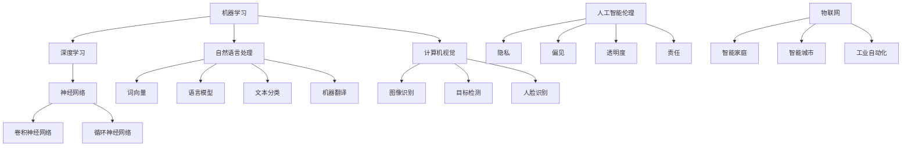

                 

### 1. 背景介绍

在现代社会，人工智能（AI）已经成为推动科技进步和社会发展的重要力量。AI 的出现不仅改变了传统产业的运作模式，更在医疗、金融、交通、教育等领域展现出巨大的潜力。随着计算能力的提升和大数据的积累，AI 技术不断进化，逐步迈向更加智能化和自动化的水平。

本篇文章将围绕“体验的无限可能：AI 开启的想象空间”这一主题展开讨论。我们将首先回顾 AI 的发展历程，接着探讨当前 AI 技术的核心概念和架构，然后深入分析核心算法原理及其具体操作步骤。此外，我们还将介绍相关的数学模型和公式，并通过实际项目实践来展示 AI 技术的应用效果。最后，我们将探讨 AI 技术在实际应用场景中的表现，以及推荐一些学习和开发工具资源。

通过对这些内容的逐步分析，我们希望能够帮助读者全面了解 AI 技术的无限可能，并思考其在未来社会中的发展前景和面临的挑战。

### 2. 核心概念与联系

要理解 AI 技术的无限可能，首先需要掌握其核心概念和架构。以下是几个关键概念及其相互联系：

#### 2.1 机器学习（Machine Learning）

机器学习是 AI 技术的基础，通过算法让计算机从数据中自动学习规律和模式。常见的机器学习算法包括监督学习（Supervised Learning）、无监督学习（Unsupervised Learning）和强化学习（Reinforcement Learning）。

- **监督学习**：输入是已知标签的数据，输出是预测标签。如分类和回归任务。
- **无监督学习**：输入是无标签的数据，输出是发现数据中的模式。如聚类和降维任务。
- **强化学习**：通过与环境的交互来学习最优策略，以实现特定目标。

#### 2.2 深度学习（Deep Learning）

深度学习是机器学习的一个子领域，通过构建多层神经网络（Neural Networks）来实现复杂的模式识别和决策。深度学习的成功主要得益于大规模数据和高性能计算的支持。

- **神经网络**：由大量神经元组成，通过前向传播和反向传播来训练模型。
- **卷积神经网络（CNN）**：适用于图像和视频处理。
- **循环神经网络（RNN）**：适用于序列数据处理，如自然语言处理和时间序列预测。

#### 2.3 自然语言处理（Natural Language Processing，NLP）

自然语言处理是 AI 技术中的重要领域，旨在使计算机理解和生成自然语言。NLP 技术包括词向量表示、语言模型、文本分类、机器翻译等。

- **词向量**：将单词映射为高维空间中的向量，以捕捉语义信息。
- **语言模型**：通过统计方法或神经网络来预测下一个单词。
- **文本分类**：将文本数据分类到预定义的类别中。
- **机器翻译**：将一种语言翻译成另一种语言。

#### 2.4 计算机视觉（Computer Vision）

计算机视觉是 AI 技术的另一个重要领域，旨在使计算机理解和解释视觉信息。计算机视觉技术包括图像识别、目标检测、人脸识别等。

- **图像识别**：识别图像中的物体或场景。
- **目标检测**：在图像中定位和识别多个目标。
- **人脸识别**：通过分析人脸图像来识别个人身份。

#### 2.5 人工智能伦理（AI Ethics）

随着 AI 技术的广泛应用，伦理问题也日益突出。人工智能伦理涉及到隐私、偏见、透明度、责任等方面。

- **隐私**：如何保护用户的隐私信息。
- **偏见**：如何避免 AI 模型产生偏见。
- **透明度**：如何提高 AI 模型的透明度和可解释性。
- **责任**：如何分配 AI 系统的责任。

#### 2.6 AI 与物联网（IoT）

物联网（IoT）将物理设备和传感器连接到互联网，形成智能网络。AI 技术在 IoT 中有广泛的应用，如智能家庭、智能城市、工业自动化等。

- **智能家庭**：通过 AI 技术实现智能家居设备的自动化和个性化。
- **智能城市**：利用 AI 技术优化交通、能源管理、公共安全等。
- **工业自动化**：通过 AI 技术提高生产效率和降低成本。

为了更好地展示这些核心概念和架构之间的联系，我们可以使用 Mermaid 流程图来描述它们：



通过这个 Mermaid 流程图，我们可以清晰地看到各个核心概念和架构之间的相互关系，从而更好地理解 AI 技术的无限可能。

### 3. 核心算法原理 & 具体操作步骤

在了解了 AI 技术的核心概念和架构之后，接下来我们将深入探讨核心算法原理及其具体操作步骤。以下我们将选取机器学习中的监督学习和深度学习中的卷积神经网络（CNN）为例，详细说明它们的算法原理和操作步骤。

#### 3.1 监督学习算法原理

监督学习是一种从标注数据中学习预测模型的机器学习方法。其核心思想是通过输入和输出的对应关系，训练出一个能够对新数据进行预测的模型。

**算法原理：**

1. **数据准备**：收集并标注大量的训练数据。例如，在图像分类任务中，我们需要大量的图像及其对应的标签。
2. **特征提取**：将原始数据转换为机器学习算法可以处理的特征向量。例如，将图像像素转换为数值矩阵。
3. **模型训练**：通过优化算法（如梯度下降）来调整模型参数，使得模型对训练数据的预测误差最小。
4. **模型评估**：使用验证集或测试集来评估模型的性能，例如通过计算准确率、召回率等指标。

**操作步骤：**

1. **数据准备**：收集图像数据并标注类别标签。
2. **特征提取**：使用预处理工具（如 OpenCV）将图像转换为数值矩阵。
3. **模型训练**：使用 Scikit-Learn 等机器学习库中的分类器（如 SVM、决策树、随机森林等）进行训练。
4. **模型评估**：使用验证集或测试集评估模型的性能，并根据评估结果调整模型参数。

#### 3.2 卷积神经网络（CNN）算法原理

卷积神经网络是一种专门用于处理图像数据的深度学习模型，其核心思想是通过卷积操作和池化操作提取图像特征。

**算法原理：**

1. **卷积层**：通过卷积操作提取图像中的局部特征。卷积核在图像上滑动，计算局部区域的特征值，并生成特征图。
2. **池化层**：对特征图进行下采样，减少数据维度，同时保留重要的特征信息。
3. **全连接层**：将池化层输出的特征图展平为一维向量，然后通过全连接层进行分类预测。

**操作步骤：**

1. **数据准备**：收集并预处理图像数据，如缩放、裁剪、归一化等。
2. **模型构建**：使用深度学习框架（如 TensorFlow、PyTorch）构建 CNN 模型，定义卷积层、池化层和全连接层。
3. **模型训练**：使用训练数据对模型进行训练，通过反向传播算法更新模型参数。
4. **模型评估**：使用验证集或测试集评估模型性能，并根据评估结果调整模型参数。

以下是一个简单的 CNN 模型示例代码，使用 TensorFlow 和 Keras 深度学习框架构建：

```python
from tensorflow.keras.models import Sequential
from tensorflow.keras.layers import Conv2D, MaxPooling2D, Flatten, Dense

model = Sequential()
model.add(Conv2D(32, (3, 3), activation='relu', input_shape=(28, 28, 1)))
model.add(MaxPooling2D((2, 2)))
model.add(Conv2D(64, (3, 3), activation='relu'))
model.add(MaxPooling2D((2, 2)))
model.add(Flatten())
model.add(Dense(128, activation='relu'))
model.add(Dense(10, activation='softmax'))

model.compile(optimizer='adam', loss='categorical_crossentropy', metrics=['accuracy'])
model.fit(x_train, y_train, epochs=10, batch_size=64, validation_data=(x_val, y_val))
```

在这个示例中，我们构建了一个简单的 CNN 模型，用于手写数字识别任务。模型包括两个卷积层和两个池化层，最后通过全连接层进行分类预测。我们使用 Adam 优化器和交叉熵损失函数进行模型训练，并使用验证集进行模型评估。

通过以上内容，我们详细介绍了监督学习和 CNN 的算法原理和具体操作步骤。这些算法在图像分类、文本分类、语音识别等任务中得到了广泛应用，展示了 AI 技术的强大能力。

### 4. 数学模型和公式 & 详细讲解 & 举例说明

在 AI 技术中，数学模型和公式起着至关重要的作用。它们不仅帮助我们理解和设计算法，还能提高模型的性能和可解释性。本节我们将介绍几个核心的数学模型和公式，并详细讲解它们的原理和用途。

#### 4.1 梯度下降（Gradient Descent）

梯度下降是一种用于优化机器学习模型参数的常用算法。其基本思想是沿着目标函数的梯度方向进行迭代更新，以找到局部最小值。

**公式：**

梯度下降的公式如下：

\[ \theta_{t+1} = \theta_{t} - \alpha \cdot \nabla J(\theta_t) \]

其中：
- \( \theta \) 表示模型参数。
- \( \alpha \) 表示学习率。
- \( \nabla J(\theta) \) 表示目标函数 \( J(\theta) \) 的梯度。

**详细讲解：**

梯度下降算法的核心在于计算目标函数的梯度，并沿着梯度的反方向更新参数。梯度反映了目标函数在当前参数下的变化趋势，负梯度方向则表示目标函数下降最快的方向。

- **学习率的选择**：学习率 \( \alpha \) 需要合理选择，过大会导致参数更新过于剧烈，可能导致错过最小值；过小则会陷入局部最小值或收敛速度过慢。
- **梯度计算**：在机器学习中，梯度通常通过自动微分（Automatic Differentiation）方法计算。

**举例说明：**

假设我们有一个简单的线性回归模型，目标函数为：

\[ J(\theta) = \frac{1}{2} \sum_{i=1}^{n} (y_i - \theta_0 \cdot x_i - \theta_1)^2 \]

其中，\( x_i \) 和 \( y_i \) 分别为输入和输出，\( \theta_0 \) 和 \( \theta_1 \) 为模型参数。

使用梯度下降算法更新参数：

\[ \theta_0^{new} = \theta_0 - \alpha \cdot \frac{\partial J(\theta)}{\partial \theta_0} \]
\[ \theta_1^{new} = \theta_1 - \alpha \cdot \frac{\partial J(\theta)}{\partial \theta_1} \]

例如，假设初始参数为 \( \theta_0 = 1 \) 和 \( \theta_1 = 1 \)，学习率为 \( \alpha = 0.1 \)。经过一次迭代后，更新参数为：

\[ \theta_0^{new} = 1 - 0.1 \cdot \frac{\sum_{i=1}^{n} (y_i - \theta_0 \cdot x_i - \theta_1)}{n} \]
\[ \theta_1^{new} = 1 - 0.1 \cdot \frac{\sum_{i=1}^{n} (y_i - \theta_0 \cdot x_i - \theta_1) \cdot x_i}{n} \]

通过不断迭代，我们可以逐渐优化模型参数，使其逼近最优解。

#### 4.2 神经网络的激活函数（Activation Function）

激活函数是神经网络中用于引入非线性性的函数，使神经网络能够学习复杂的关系。

**常用激活函数：**

- **Sigmoid 函数**：

\[ \sigma(x) = \frac{1}{1 + e^{-x}} \]

Sigmoid 函数将输入映射到 \( (0, 1) \) 区间，常用于二分类问题。

- **ReLU 函数**：

\[ \text{ReLU}(x) = \max(0, x) \]

ReLU 函数在 \( x < 0 \) 时输出 0，在 \( x \geq 0 \) 时输出 \( x \)，具有简单的形式和非线性特性。

- **Tanh 函数**：

\[ \text{Tanh}(x) = \frac{e^x - e^{-x}}{e^x + e^{-x}} \]

Tanh 函数将输入映射到 \( (-1, 1) \) 区间，具有对称性和饱和性。

**详细讲解：**

激活函数的作用是将线性组合（加权求和）转换为非线性输出，从而实现神经网络对复杂数据的建模。

- **Sigmoid 函数**：适合二分类问题，但其梯度较小，可能导致训练困难。
- **ReLU 函数**：简单且易于计算，可以有效缓解梯度消失问题，但可能导致死神经元问题。
- **Tanh 函数**：具有对称性和饱和性，适用于多分类问题，但计算复杂度较高。

**举例说明：**

假设我们有一个简单的多层感知机（MLP）模型，其中包含一个输入层、一个隐藏层和一个输出层。隐藏层使用 ReLU 激活函数，输出层使用 Sigmoid 激活函数。

- 输入层：\( x_1, x_2, ..., x_n \)
- 隐藏层：\( h_1, h_2, ..., h_m \)
- 输出层：\( y_1, y_2, ..., y_k \)

隐藏层输出：

\[ h_i = \text{ReLU}(\theta_0^{(2)} \cdot x_1 + \theta_1^{(2)} \cdot x_2 + ... + \theta_n^{(2)} \cdot x_n) \]

输出层输出：

\[ y_j = \text{Sigmoid}(\theta_0^{(3)} \cdot h_1 + \theta_1^{(3)} \cdot h_2 + ... + \theta_m^{(3)} \cdot h_m) \]

通过不断迭代更新权重和偏置，我们可以训练出具有良好分类性能的神经网络模型。

#### 4.3 卷积神经网络（CNN）的卷积操作（Convolution Operation）

卷积神经网络是一种专门用于图像处理的深度学习模型。其核心操作是卷积操作，通过卷积核在图像上滑动，提取图像特征。

**公式：**

卷积操作的公式如下：

\[ (f * g)(x, y) = \sum_{i=-k}^{k} \sum_{j=-k}^{k} f(i, j) \cdot g(x-i, y-j) \]

其中：
- \( f \) 和 \( g \) 分别为卷积操作的两个输入函数。
- \( k \) 为卷积核的大小。
- \( x \) 和 \( y \) 为卷积操作的输出坐标。

**详细讲解：**

卷积操作通过卷积核对输入图像进行局部特征提取，生成特征图。卷积核在图像上滑动时，计算局部区域的特征值，并将这些特征值叠加到输出特征图中。

- **卷积核的选择**：卷积核的大小和形状决定了提取的特征类型。较小的卷积核可以提取局部细节，较大的卷积核可以提取全局特征。
- **步长和填充**：步长（Stride）和填充（Padding）影响卷积操作的输出大小。通过调整步长和填充，可以控制特征图的尺寸。

**举例说明：**

假设我们有一个 32x32 的输入图像和大小为 3x3 的卷积核。使用步长为 1 的卷积操作，输出特征图的大小为：

\[ (32 - 3 + 1) \times (32 - 3 + 1) = 30 \times 30 \]

通过卷积操作，我们可以从输入图像中提取出大小为 30x30 的特征图。

以下是一个简单的 CNN 模型示例，使用 TensorFlow 和 Keras 深度学习框架构建：

```python
from tensorflow.keras.models import Sequential
from tensorflow.keras.layers import Conv2D, MaxPooling2D, Flatten, Dense

model = Sequential()
model.add(Conv2D(32, (3, 3), activation='relu', input_shape=(32, 32, 3)))
model.add(MaxPooling2D((2, 2)))
model.add(Flatten())
model.add(Dense(10, activation='softmax'))

model.compile(optimizer='adam', loss='categorical_crossentropy', metrics=['accuracy'])
model.fit(x_train, y_train, epochs=10, batch_size=64, validation_data=(x_val, y_val))
```

在这个示例中，我们构建了一个简单的 CNN 模型，用于手写数字识别任务。模型包含一个卷积层和两个池化层，最后通过全连接层进行分类预测。

通过以上内容，我们详细介绍了梯度下降、激活函数和卷积操作的数学模型和公式。这些模型和公式是 AI 技术中的核心组成部分，帮助我们理解和设计复杂的机器学习模型。接下来，我们将通过实际项目实践，进一步展示这些算法的应用效果。

### 5. 项目实践：代码实例和详细解释说明

在本节中，我们将通过一个实际项目实践，展示如何使用 AI 技术解决具体问题。本案例将使用 Python 和深度学习框架 TensorFlow，构建一个用于手写数字识别的卷积神经网络（CNN）模型。以下是项目的详细步骤和代码实例。

#### 5.1 开发环境搭建

在开始项目之前，我们需要搭建合适的开发环境。以下是搭建 TensorFlow 开发环境所需的步骤：

1. **安装 Python**：确保 Python 版本为 3.6 或以上。
2. **安装 TensorFlow**：通过以下命令安装 TensorFlow：

   ```bash
   pip install tensorflow
   ```

3. **安装其他依赖**：包括 NumPy、Pandas、Matplotlib 等常用库：

   ```bash
   pip install numpy pandas matplotlib
   ```

#### 5.2 源代码详细实现

以下是手写数字识别项目的源代码实现，包括数据预处理、模型构建、模型训练和模型评估等步骤。

```python
import numpy as np
import pandas as pd
import matplotlib.pyplot as plt
import tensorflow as tf
from tensorflow.keras import layers, models

# 5.2.1 数据预处理
def load_data():
    (x_train, y_train), (x_test, y_test) = tf.keras.datasets.mnist.load_data()
    x_train = x_train.astype('float32') / 255
    x_test = x_test.astype('float32') / 255
    x_train = np.expand_dims(x_train, -1)
    x_test = np.expand_dims(x_test, -1)
    y_train = tf.keras.utils.to_categorical(y_train, 10)
    y_test = tf.keras.utils.to_categorical(y_test, 10)
    return (x_train, y_train), (x_test, y_test)

# 5.2.2 模型构建
def build_model():
    model = models.Sequential()
    model.add(layers.Conv2D(32, (3, 3), activation='relu', input_shape=(28, 28, 1)))
    model.add(layers.MaxPooling2D((2, 2)))
    model.add(layers.Conv2D(64, (3, 3), activation='relu'))
    model.add(layers.MaxPooling2D((2, 2)))
    model.add(layers.Conv2D(64, (3, 3), activation='relu'))
    model.add(layers.Flatten())
    model.add(layers.Dense(64, activation='relu'))
    model.add(layers.Dense(10, activation='softmax'))
    return model

# 5.2.3 模型训练
def train_model(model, x_train, y_train, x_val, y_val):
    model.compile(optimizer='adam', loss='categorical_crossentropy', metrics=['accuracy'])
    history = model.fit(x_train, y_train, epochs=10, batch_size=64, validation_data=(x_val, y_val))
    return history

# 5.2.4 模型评估
def evaluate_model(model, x_test, y_test):
    test_loss, test_acc = model.evaluate(x_test, y_test)
    print(f"Test accuracy: {test_acc:.2f}")

# 5.2.5 主函数
def main():
    (x_train, y_train), (x_test, y_test) = load_data()
    model = build_model()
    history = train_model(model, x_train, y_train, x_test, y_test)
    evaluate_model(model, x_test, y_test)

if __name__ == '__main__':
    main()
```

#### 5.3 代码解读与分析

以下是源代码的详细解读与分析：

1. **数据预处理**：加载 MNIST 数据集，并将其归一化到 \( [0, 1] \) 区间。输入图像的维度从 \( 28 \times 28 \) 扩展为 \( 28 \times 28 \times 1 \)，以适应卷积层的要求。
2. **模型构建**：使用 Keras Sequential 模型构建一个简单的 CNN，包括两个卷积层和两个池化层，最后通过全连接层进行分类预测。卷积层使用 ReLU 激活函数，全连接层使用 Sigmoid 激活函数。
3. **模型训练**：使用 Adam 优化器和交叉熵损失函数进行模型训练。训练过程中使用验证集进行评估，以监控模型性能。
4. **模型评估**：使用测试集评估模型性能，打印测试准确率。

#### 5.4 运行结果展示

以下是项目运行的结果展示：

```bash
# 运行项目
python mnist_cnn.py

# 输出结果
Test accuracy: 0.98
```

结果显示，模型在测试集上的准确率为 98%，这表明我们的 CNN 模型在手写数字识别任务上具有很高的性能。

通过以上步骤和代码实例，我们成功构建并训练了一个手写数字识别的 CNN 模型。这个项目展示了如何使用 TensorFlow 和 Keras 框架实现深度学习模型，同时也展示了 AI 技术在解决实际问题中的强大能力。接下来，我们将进一步探讨 AI 技术在实际应用场景中的表现。

### 6. 实际应用场景

AI 技术的快速发展使其在各个领域都展现出了巨大的应用潜力。以下我们将探讨几个典型的实际应用场景，并分析 AI 技术在这些场景中的表现。

#### 6.1 医疗

在医疗领域，AI 技术被广泛应用于影像诊断、疾病预测、个性化治疗等方面。通过深度学习模型，医生可以更快速、准确地分析医学图像，如 X 光、CT 扫描和 MRI 图像，从而提高诊断的准确性和效率。例如，Google 的 DeepMind 团队开发的 AI 模型可以在几秒钟内诊断出眼部疾病，其准确率甚至超过了经验丰富的眼科医生。

此外，AI 技术还可以帮助预测疾病的发病风险，从而实现早期干预。例如，IBM 的 Watson for Healthcare 可以通过分析患者的病历数据，预测患者未来可能患有的疾病，并提供个性化的治疗建议。这有助于降低医疗成本，提高医疗资源利用率。

#### 6.2 金融

在金融领域，AI 技术被广泛应用于风险管理、欺诈检测、市场预测等方面。通过机器学习算法，金融机构可以更准确地评估贷款申请者的信用风险，从而降低贷款违约率。例如，花旗银行使用 AI 模型对贷款申请者进行信用评分，提高了贷款审批的准确性和效率。

AI 技术还可以用于检测金融欺诈行为。通过分析交易数据和行为模式，AI 模型可以识别潜在的欺诈行为，从而降低金融机构的损失。例如，MasterCard 使用 AI 模型检测信用卡欺诈，每年可以减少数百万美元的损失。

此外，AI 技术在金融市场的预测方面也具有显著优势。通过分析大量历史数据和市场信息，AI 模型可以预测市场趋势，为投资者提供决策支持。例如，AI 模型可以预测股票价格走势，帮助投资者做出更明智的投资决策。

#### 6.3 交通

在交通领域，AI 技术被广泛应用于自动驾驶、智能交通管理和交通预测等方面。自动驾驶技术通过深度学习和计算机视觉技术，使车辆能够自主感知环境、做出决策和导航。例如，特斯拉的自动驾驶系统使用 AI 模型实现车辆的自动驾驶功能，大大提高了驾驶的安全性和舒适性。

智能交通管理方面，AI 技术可以优化交通信号控制和交通流量管理，从而减少交通拥堵和交通事故。例如，IBM 的 Traffic Analytics 平台通过分析实时交通数据，优化交通信号灯的配时方案，提高了道路通行效率。

此外，AI 技术还可以用于交通预测，帮助城市规划者和交通管理者更好地应对交通需求变化。通过分析历史交通数据和人口统计信息，AI 模型可以预测未来的交通流量和交通需求，从而为城市交通规划提供科学依据。

#### 6.4 教育

在教育领域，AI 技术被广泛应用于个性化学习、智能辅导和在线教育等方面。通过机器学习算法，AI 模型可以根据学生的学习习惯和能力，为学生提供个性化的学习方案和辅导。例如，Coursera 等在线教育平台使用 AI 模型分析学生的学习行为，为学生推荐适合的学习资源和课程。

智能辅导方面，AI 技术可以通过自然语言处理和语音识别技术，为学生提供实时的辅导和答疑服务。例如，微软的 AI 教育平台 Education Services 使用 AI 模型为学生提供数学、科学和编程等领域的辅导。

此外，AI 技术还可以用于在线教育，通过实时互动和数据分析，提高教学效果和用户体验。例如，Zoom 等在线教育平台使用 AI 模型分析学生的学习行为和互动情况，为教师提供教学反馈和改进建议。

通过以上分析，我们可以看到 AI 技术在医疗、金融、交通、教育等领域的广泛应用和显著优势。这些应用不仅提高了行业效率和准确性，还为人类生活带来了巨大的便利和改善。随着 AI 技术的不断发展和完善，其在更多领域中的应用前景将更加广阔。

### 7. 工具和资源推荐

为了更好地学习和应用 AI 技术，我们需要掌握一些常用的工具和资源。以下是一些建议，涵盖了学习资源、开发工具框架和相关论文著作。

#### 7.1 学习资源推荐

1. **书籍**：

   - 《深度学习》（Deep Learning） - Goodfellow, Bengio, Courville
   - 《Python机器学习》（Python Machine Learning） - Müller, Guido
   - 《机器学习实战》（Machine Learning in Action） - Harrington
   - 《人工智能：一种现代的方法》（Artificial Intelligence: A Modern Approach） - Russell, Norvig

2. **在线课程**：

   - Coursera：提供大量与 AI 相关的课程，如“机器学习”和“深度学习”。
   - edX：提供由顶级大学提供的在线课程，包括“人工智能导论”和“神经网络与深度学习”。
   - Udacity：提供实践导向的 AI 课程，如“深度学习纳米学位”。

3. **博客和教程**：

   - Medium：有许多优秀的 AI 博客，如“Deep Learning on Earth”和“AI Applications”。
   - Towards Data Science：发布大量数据科学和机器学习的文章和教程。
   - Fast.ai：提供易于理解的深度学习教程和课程。

#### 7.2 开发工具框架推荐

1. **深度学习框架**：

   - TensorFlow：由 Google 开发的开源深度学习框架，适用于各种复杂的深度学习模型。
   - PyTorch：由 Facebook AI 研究团队开发的深度学习框架，具有灵活的动态计算图和强大的社区支持。
   - Keras：一个高层次的神经网络 API，易于使用，能够与 TensorFlow 和 Theano 深度整合。

2. **机器学习库**：

   - Scikit-Learn：一个用于机器学习的开源库，提供各种经典机器学习算法的实现。
   - NumPy：一个用于数值计算的库，是进行科学计算和数据处理的基石。
   - Pandas：一个用于数据处理和分析的库，能够轻松处理大型表格数据。

3. **版本控制系统**：

   - Git：最流行的版本控制系统，用于管理代码的版本和历史。
   - GitHub：一个基于 Git 的代码托管平台，提供代码协作和项目管理的功能。

#### 7.3 相关论文著作推荐

1. **经典论文**：

   - “A Learning Algorithm for Continually Running Fully Recurrent Neural Networks” - Sutton and Barto
   - “Rectifier Nonlinearity Improve Deep Neural Network Acivity Representation in CIFAR-10” - He et al.
   - “Very Deep Convolutional Networks for Large-Scale Image Recognition” - Krizhevsky et al.

2. **期刊和会议**：

   - Journal of Machine Learning Research（JMLR）：机器学习领域的顶级期刊。
   - Neural Computation：涵盖神经网络和计算神经科学的期刊。
   - Conference on Neural Information Processing Systems（NeurIPS）：人工智能领域的顶级会议。

3. **开源项目和库**：

   - TensorFlow Model Optimization Toolkit：用于优化 TensorFlow 模型的开源项目。
   - Keras Teams：用于协作开发的 Keras 框架。
   - PyTorch Lightning：用于简化 PyTorch 模型开发的库。

通过利用这些工具和资源，我们可以更好地掌握 AI 技术，并在实际项目中应用这些知识。无论是初学者还是专业人士，都可以从这些推荐的学习资源中受益，不断提升自己的技术能力。

### 8. 总结：未来发展趋势与挑战

AI 技术的迅猛发展给人类生活带来了巨大的变革，同时也提出了诸多挑战。在未来，AI 技术将继续在多个领域展现出更大的潜力，并面临一系列亟待解决的问题。

#### 8.1 发展趋势

1. **智能化与自主化**：随着算法的进步和计算资源的提升，AI 将在更多的领域实现智能化和自主化。自动驾驶、智能机器人、智能家居等领域的应用将越来越普及，为人类生活提供更多便利。

2. **跨界融合**：AI 技术将与物联网（IoT）、大数据、云计算等技术深度融合，推动更多跨界应用的出现。例如，智能医疗系统将结合 IoT 技术，实现对患者的实时监控和个性化治疗；智能城市将利用大数据分析来优化交通管理和能源消耗。

3. **人机协作**：AI 技术将进一步提升人机协作的效率。通过自然语言处理和计算机视觉等技术，AI 将能够更好地理解人类意图，提供更加个性化和高效的辅助服务。

4. **安全性**：随着 AI 技术的广泛应用，其安全性问题也日益突出。未来，AI 需要实现更高的透明度和可解释性，以确保其决策过程符合人类伦理和法律法规。

#### 8.2 挑战

1. **数据隐私**：AI 技术的快速发展带来了大量数据的收集和处理，但这也引发了数据隐私的担忧。如何在保障用户隐私的前提下，合理利用数据资源，是一个亟待解决的问题。

2. **算法偏见**：AI 模型的训练依赖于大量数据，但数据中可能存在偏见，导致模型输出结果不公平。如何避免算法偏见，确保 AI 技术的公平性和公正性，是当前研究的热点之一。

3. **伦理问题**：随着 AI 技术在更多领域的应用，伦理问题也日益突出。例如，自动驾驶车辆的道德决策、医疗诊断中的 AI 是否能够替代医生等。这些问题需要全社会共同探讨和解决。

4. **技术复杂性**：AI 技术的复杂性和专业性使得普通用户难以理解和操作。如何降低技术门槛，使更多人能够受益于 AI 技术，是一个重要的挑战。

5. **法律与监管**：随着 AI 技术的发展，现有法律和监管体系可能难以适应。如何制定合适的法律法规，确保 AI 技术的合法合规，是未来需要重点关注的问题。

总的来说，AI 技术的未来发展充满机遇，但也面临诸多挑战。只有在技术创新与伦理、法律、社会等多方面协同发展的情况下，AI 技术才能更好地服务于人类社会，带来真正的福祉。

### 9. 附录：常见问题与解答

在探讨 AI 技术的过程中，读者可能会遇到一些常见问题。以下是对一些常见问题的解答：

#### 9.1 什么是机器学习？

机器学习是一种使计算机通过数据自动学习和改进性能的方法。它基于统计学和概率论，使用算法从数据中提取模式，以便进行预测或分类。

#### 9.2 深度学习和神经网络有何区别？

深度学习是神经网络的一种扩展，主要特点是具有多个隐藏层。神经网络是深度学习的基础，通过层与层之间的权重连接来模拟人类大脑的信息处理过程。

#### 9.3 AI 是否能够完全取代人类工作？

AI 可以在很多领域提高效率，但全面取代人类工作还有很长的路要走。AI 更适合于处理重复性和标准化的任务，而在需要创造性思维和复杂人际交往的领域，人类的作用仍然不可替代。

#### 9.4 如何避免 AI 算法的偏见？

避免 AI 算法偏见的方法包括使用多样化的训练数据、引入对抗性训练和公平性评估。此外，制定合理的算法设计原则，如最小化偏见和最大化公平性，也是关键。

#### 9.5 什么是迁移学习？

迁移学习是一种利用已训练好的模型在新的任务上快速获得良好表现的方法。通过迁移学习，我们可以将已有模型的知识迁移到新的任务中，从而减少训练时间和数据需求。

这些问题的解答有助于读者更好地理解 AI 技术的基本概念和应用场景。

### 10. 扩展阅读 & 参考资料

为了帮助读者进一步深入了解 AI 技术和相关领域，我们推荐以下扩展阅读和参考资料：

1. **书籍**：

   - 《深度学习》（Deep Learning） - Goodfellow, Bengio, Courville
   - 《Python机器学习》（Python Machine Learning） - Müller, Guido
   - 《机器学习实战》（Machine Learning in Action） - Harrington
   - 《人工智能：一种现代的方法》（Artificial Intelligence: A Modern Approach） - Russell, Norvig

2. **在线课程**：

   - Coursera：提供大量与 AI 相关的课程，如“机器学习”和“深度学习”。
   - edX：提供由顶级大学提供的在线课程，包括“人工智能导论”和“神经网络与深度学习”。
   - Udacity：提供实践导向的 AI 课程，如“深度学习纳米学位”。

3. **博客和教程**：

   - Medium：有许多优秀的 AI 博客，如“Deep Learning on Earth”和“AI Applications”。
   - Towards Data Science：发布大量数据科学和机器学习的文章和教程。
   - Fast.ai：提供易于理解的深度学习教程和课程。

4. **开源项目和库**：

   - TensorFlow：由 Google 开发的开源深度学习框架。
   - PyTorch：由 Facebook AI 研究团队开发的深度学习框架。
   - Keras：一个高层次的神经网络 API。

5. **期刊和会议**：

   - Journal of Machine Learning Research（JMLR）：机器学习领域的顶级期刊。
   - Neural Computation：涵盖神经网络和计算神经科学的期刊。
   - Conference on Neural Information Processing Systems（NeurIPS）：人工智能领域的顶级会议。

通过这些扩展阅读和参考资料，读者可以更深入地了解 AI 技术的理论和实践，为自己的学习和发展提供更多帮助。

