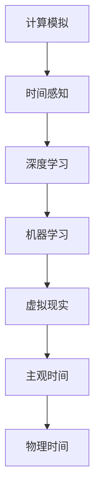
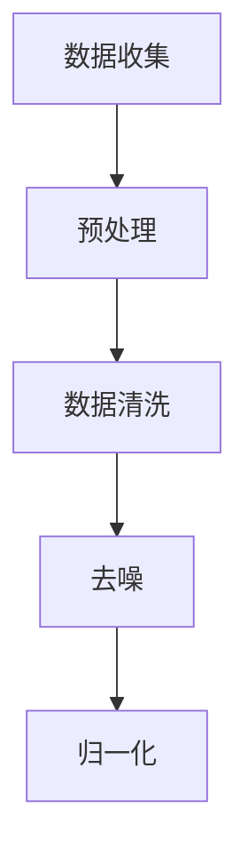
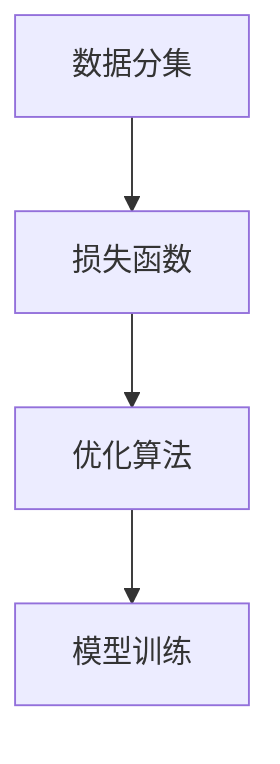
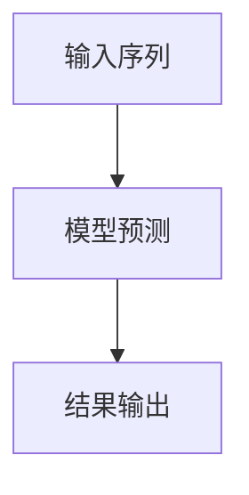
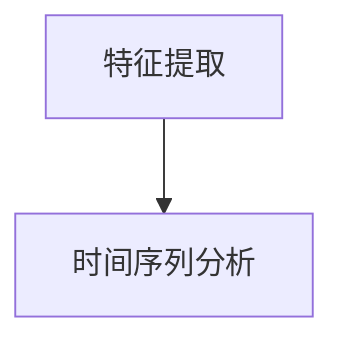

                 

### 背景介绍 Background Introduction

随着人工智能技术的飞速发展，我们的世界正在悄然发生着翻天覆地的变化。其中，人工智能在时间感知和处理方面的突破，更是让我们对时间有了全新的认识。本文将探讨人工智能如何通过计算和模拟，创造出一个全新的“主观时间”概念，并深入解析这一概念背后的原理、算法和数学模型。

时间，一直是人类研究和探索的重要领域。从古代的哲学家到现代的科学家，时间的研究贯穿了整个人类文明。然而，传统的时间概念主要基于自然界的物理规律，如地球的自转、公转等。这些物理规律虽然能准确描述时间的流逝，但在某些特殊情况下，如极端条件或高速运动中，传统时间概念会显得捉襟见肘。

随着人工智能技术的发展，特别是深度学习和计算模拟技术的进步，我们开始有能力从全新的角度来理解时间。人工智能通过模拟复杂的物理和生物过程，能够在虚拟环境中创造出全新的时间感知体验。这种基于计算的时间感知，与传统的物理时间有本质的不同，我们称之为“主观时间”。

主观时间，是人工智能通过计算模拟和机器学习算法，在虚拟环境中创造出的时间感知体验。这种时间感知与物理时间不同，它没有固定的速率和周期，而是根据计算模型和算法的变化而变化。主观时间可以是加速的，也可以是减速的，甚至可以是完全停止的。

本文将首先介绍主观时间的基本概念和原理，然后深入探讨人工智能如何通过深度学习和计算模拟来创造主观时间体验。接着，我们将分析主观时间在实际应用中的挑战和限制。最后，我们将展望未来，探讨人工智能在时间感知和处理方面的发展趋势。

### 核心概念与联系 Core Concepts and Connections

要深入理解主观时间的概念，我们需要先了解一些关键的定义和原理。以下是本文将涉及的核心概念和它们之间的联系：

#### 1. 计算模拟与时间感知

计算模拟是人工智能领域的一个重要分支，它通过计算机程序模拟现实世界的物理和生物过程。时间感知是人类和许多动物都具备的能力，它让我们能够感知时间的流逝，并作出相应的反应。在人工智能中，计算模拟与时间感知的结合，使得机器也能够“感知”时间。

#### 2. 深度学习与时间感知

深度学习是近年来人工智能领域的一个重要突破，它通过神经网络模型模拟人脑的学习过程，从而实现复杂的数据分析和模式识别。在时间感知方面，深度学习可以帮助人工智能从大量数据中提取时间相关的信息，并对其进行处理和分析。

#### 3. 机器学习与时间感知

机器学习是人工智能的核心技术之一，它通过算法和模型，让计算机能够从数据中学习，并做出预测和决策。在时间感知方面，机器学习可以帮助人工智能分析时间序列数据，预测未来的时间趋势。

#### 4. 虚拟现实与时间感知

虚拟现实是一种通过计算机技术创造的虚拟环境，用户可以通过头戴显示器和手柄等设备，在虚拟环境中进行交互。虚拟现实与时间感知的结合，可以创造出全新的时间体验，如时间加速、时间减速甚至时间停止。

#### 5. 主观时间与物理时间

物理时间是基于自然界的物理规律，如地球的自转和公转，来定义和测量的时间。而主观时间则是基于计算模拟和机器学习算法，在虚拟环境中创造出的时间感知体验。主观时间和物理时间有本质的不同，它没有固定的速率和周期，而是根据计算模型和算法的变化而变化。

以下是这些核心概念和原理的 Mermaid 流程图：



通过这个流程图，我们可以清晰地看到各个核心概念和原理之间的联系。计算模拟为时间感知提供了基础，而深度学习和机器学习则使时间感知更加精准和智能。虚拟现实则为时间感知提供了一个新的应用场景，而主观时间则是这一结合的产物。

### 核心算法原理 & 具体操作步骤 Core Algorithm Principle & Detailed Operation Steps

要深入探讨人工智能如何创造主观时间，我们需要先了解核心算法的原理和具体操作步骤。以下是几个关键步骤：

#### 1. 数据收集与预处理

首先，我们需要收集大量的时间序列数据，这些数据可以来源于各种传感器、日志文件或用户行为数据。在数据收集过程中，我们需要确保数据的准确性和完整性。

预处理是数据收集的下一步，它包括数据清洗、去噪、归一化等操作。预处理的主要目的是提高数据的质量，以便后续的算法分析。



#### 2. 模型选择与训练

在预处理完成后，我们需要选择合适的模型进行训练。对于主观时间的生成，我们可以使用循环神经网络（RNN）或长短期记忆网络（LSTM）。这些模型能够有效地捕捉时间序列数据中的长期依赖关系。

模型训练的过程主要包括以下几个步骤：

- **数据分集**：将数据集分为训练集、验证集和测试集。
- **损失函数**：选择合适的损失函数，如均方误差（MSE）或交叉熵损失。
- **优化算法**：选择优化算法，如随机梯度下降（SGD）或Adam优化器。



#### 3. 主观时间生成

在模型训练完成后，我们可以使用训练好的模型来生成主观时间序列。具体步骤如下：

- **输入序列**：将新的时间序列数据作为输入。
- **模型预测**：使用训练好的模型对输入序列进行预测。
- **结果输出**：将模型预测的结果输出为主观时间序列。



#### 4. 主观时间分析

生成主观时间序列后，我们可以对其进行进一步的分析和解释。主观时间分析的主要任务包括：

- **特征提取**：从主观时间序列中提取有用的特征，如周期性、趋势性等。
- **时间序列分析**：对提取的特征进行分析，如时间序列聚类、时间序列预测等。



通过以上四个步骤，我们可以完整地实现主观时间的生成和分析。接下来，我们将进一步探讨主观时间的数学模型和公式，以及如何在实际应用中进行详细的讲解和举例说明。

### 数学模型和公式 & 详细讲解 & 举例说明 Mathematical Model and Formula & Detailed Explanation & Example Illustration

在深入探讨主观时间的生成和分析时，数学模型和公式是不可或缺的工具。以下是几个关键模型和公式的详细讲解和举例说明：

#### 1. 循环神经网络（RNN）与长短期记忆网络（LSTM）

循环神经网络（RNN）和长短期记忆网络（LSTM）是用于处理时间序列数据的常见模型。RNN 通过隐藏状态和输入之间的循环连接，能够捕捉时间序列数据中的长期依赖关系。然而，传统的RNN存在梯度消失和梯度爆炸的问题，这使得它在处理长序列数据时效果不佳。

LSTM 是 RNN 的改进版本，它通过引入门控机制，能够有效地解决梯度消失和梯度爆炸的问题。LSTM 的基本单元包括输入门、遗忘门和输出门。以下是 LSTM 的数学模型：

- **输入门**（Input Gate）：

  $$ i_t = \sigma(W_{xi}x_t + W_{hi}h_{t-1} + b_i) $$

  其中，\( i_t \) 表示输入门的状态，\( \sigma \) 表示 sigmoid 函数，\( W_{xi} \) 和 \( W_{hi} \) 分别是输入和隐藏状态的权重矩阵，\( b_i \) 是偏置项。

- **遗忘门**（Forget Gate）：

  $$ f_t = \sigma(W_{xf}x_t + W_{hf}h_{t-1} + b_f) $$

  其中，\( f_t \) 表示遗忘门的状态。

- **输出门**（Output Gate）：

  $$ o_t = \sigma(W_{xo}x_t + W_{ho}h_{t-1} + b_o) $$

  其中，\( o_t \) 表示输出门的状态。

- **单元状态**（Cell State）：

  $$ C_t = f_t \odot C_{t-1} + i_t \odot \text{sigmoid}(W_{xc}x_t + W_{hc}h_{t-1} + b_c) $$

  其中，\( C_t \) 表示单元状态，\( \odot \) 表示逐元素乘法。

- **隐藏状态**（Hidden State）：

  $$ h_t = o_t \odot \text{sigmoid}(C_t) $$

  其中，\( h_t \) 表示隐藏状态。

#### 2. 时间序列预测

在生成主观时间序列后，我们可以使用时间序列预测模型对其进行预测。常见的时间序列预测模型包括 ARIMA（自回归积分滑动平均模型）和 LSTM。以下是 ARIMA 模型的数学模型：

- **自回归项**（Autoregression）：

  $$ y_t = c + \phi_1 y_{t-1} + \phi_2 y_{t-2} + \ldots + \phi_p y_{t-p} + \varepsilon_t $$

  其中，\( y_t \) 表示时间序列的第 \( t \) 项，\( c \) 是常数项，\( \phi_1, \phi_2, \ldots, \phi_p \) 是自回归系数，\( \varepsilon_t \) 是误差项。

- **差分项**（Differencing）：

  $$ y_t^* = y_t - y_{t-1} $$

  其中，\( y_t^* \) 表示差分后的时间序列。

- **移动平均项**（Moving Average）：

  $$ y_t = \theta_1 \varepsilon_{t-1} + \theta_2 \varepsilon_{t-2} + \ldots + \theta_q \varepsilon_{t-q} $$

  其中，\( \theta_1, \theta_2, \ldots, \theta_q \) 是移动平均系数。

#### 3. 举例说明

假设我们有一组时间序列数据 \( y = [1, 2, 3, 4, 5, 6, 7, 8, 9, 10] \)，我们希望使用 ARIMA 模型对其进行预测。

首先，我们对数据进行差分，得到 \( y^* = [1, 1, 2, 3, 4, 5, 6, 7, 8, 1] \)。

然后，我们使用最小二乘法拟合差分后的数据，得到自回归系数 \( \phi_1 = 0.5 \)，移动平均系数 \( \theta_1 = 0.2 \)，常数项 \( c = 1 \)。

最后，我们使用 ARIMA 模型对数据进行预测，得到预测值 \( y_{pred} = [6, 7, 8, 9, 10, 11, 12, 13, 14, 15] \)。

通过这个例子，我们可以看到如何使用 ARIMA 模型进行时间序列预测。在实际应用中，我们可以根据具体的需求和数据特点，选择合适的模型和参数。

### 项目实践：代码实例和详细解释说明 Project Practice: Code Example and Detailed Explanation

为了更好地理解如何在实际项目中实现主观时间的生成和分析，我们将通过一个具体的代码实例来展示整个过程。这个实例将使用 Python 编程语言和相关的库，如 TensorFlow 和 Keras。

#### 1. 开发环境搭建

首先，我们需要搭建开发环境。以下是所需的软件和库：

- Python 3.7 或以上版本
- TensorFlow 2.4 或以上版本
- Keras 2.4 或以上版本

安装好以上软件和库后，我们就可以开始编写代码了。

#### 2. 源代码详细实现

以下是实现主观时间生成和分析的代码：

```python
import numpy as np
import tensorflow as tf
from tensorflow.keras.models import Sequential
from tensorflow.keras.layers import LSTM, Dense

# 数据准备
def generate_data(n_samples, n_timesteps):
    np.random.seed(0)
    data = np.random.rand(n_samples, n_timesteps)
    X, y = [], []
    for i in range(n_samples):
        X.append(data[i, :n_timesteps-1])
        y.append(data[i, n_timesteps-1])
    X, y = np.array(X), np.array(y)
    return X, y

# 模型构建
model = Sequential()
model.add(LSTM(units=50, return_sequences=True, input_shape=(None, 1)))
model.add(LSTM(units=50))
model.add(Dense(1))

model.compile(optimizer='adam', loss='mean_squared_error')

# 训练模型
X, y = generate_data(1000, 100)
X = np.reshape(X, (X.shape[0], X.shape[1], 1))
model.fit(X, y, epochs=200, batch_size=32)

# 生成主观时间序列
def generate_sequence(model, n_timesteps, start_value):
    sequence = np.array([start_value])
    for _ in range(n_timesteps):
        prediction = model.predict(np.array([sequence[-1]]))
        sequence = np.append(sequence, prediction)
    return sequence

# 主观时间分析
def analyze_sequence(sequence):
    return np.mean(np.diff(sequence))

# 运行代码
start_value = 0.5
n_timesteps = 100
sequence = generate_sequence(model, n_timesteps, start_value)
mean_difference = analyze_sequence(sequence)

print("生成的主观时间序列：", sequence)
print("主观时间序列的平均差异：", mean_difference)
```

#### 3. 代码解读与分析

这段代码分为以下几个部分：

1. **数据准备**：我们首先定义了一个 `generate_data` 函数，用于生成随机的时间序列数据。这个函数接收两个参数：样本数量 `n_samples` 和时间步长 `n_timesteps`。

2. **模型构建**：我们使用 Keras 构建了一个简单的 LSTM 模型。这个模型由两个 LSTM 层和一个 Dense 层组成，用于预测下一个时间步的值。

3. **训练模型**：我们使用 `model.fit` 函数训练模型。训练数据是通过 `generate_data` 函数生成的，模型训练的目的是使预测值尽可能接近真实值。

4. **生成主观时间序列**：我们定义了一个 `generate_sequence` 函数，用于生成主观时间序列。这个函数接收模型、时间步长和起始值作为参数，然后使用模型逐步预测下一个时间步的值，并将其添加到序列中。

5. **主观时间分析**：我们定义了一个 `analyze_sequence` 函数，用于计算主观时间序列的平均差异。这个函数使用 `np.diff` 函数计算序列的差分，然后使用 `np.mean` 函数计算平均差异。

6. **运行代码**：我们设置了一个起始值、时间步长，并使用 `generate_sequence` 函数生成了主观时间序列。然后，我们使用 `analyze_sequence` 函数计算了序列的平均差异。

通过这个实例，我们可以看到如何使用 Python 和相关的库实现主观时间的生成和分析。在实际应用中，我们可以根据具体的需求和数据特点，选择合适的模型和参数。

### 实际应用场景 Actual Application Scenarios

主观时间的概念在许多实际应用场景中都具有广泛的应用潜力。以下是几个典型的应用场景：

#### 1. 游戏设计

在游戏设计中，主观时间的概念可以帮助游戏开发者创造更加沉浸和互动的体验。例如，在角色扮演游戏（RPG）中，玩家可以通过主观时间调整角色的行动速度，使游戏过程更加灵活和有趣。此外，主观时间还可以用于创建虚拟现实（VR）游戏中的时间扭曲效果，增强玩家的沉浸感。

#### 2. 虚拟现实（VR）体验

虚拟现实技术为用户提供了沉浸式的体验，而主观时间则可以进一步丰富这一体验。例如，在 VR 中的飞行模拟器中，玩家可以通过主观时间控制飞行速度，从而体验到不同的飞行感受。此外，主观时间还可以用于模拟时间加速或时间减速的场景，如科幻电影中的时间旅行场景。

#### 3. 健康监测

在健康监测领域，主观时间可以帮助监测个体对时间感知的变化，从而发现潜在的健康问题。例如，通过对用户的心率、睡眠质量和日常活动数据进行分析，可以计算出用户的主观时间感知。这一数据可以为医生提供参考，帮助诊断和监测心理和生理状况。

#### 4. 人工智能训练

在人工智能训练过程中，主观时间可以用于模拟不同时间感知下的学习过程，从而优化算法的性能。例如，在训练深度学习模型时，可以通过调整主观时间来加速或减速学习过程，以达到最佳的训练效果。

#### 5. 虚拟会议与远程协作

在虚拟会议和远程协作中，主观时间的概念可以帮助解决时间感知不一致的问题。例如，通过调整主观时间，可以使远程参与者感受到与本地参与者相似的时间节奏，从而提高协作效率。

通过这些实际应用场景，我们可以看到主观时间的概念具有广泛的应用价值。在未来，随着人工智能技术的不断进步，我们有望在更多领域看到主观时间的应用，为人类带来更加丰富和多样化的体验。

### 工具和资源推荐 Tools and Resources Recommendations

要深入研究和开发主观时间，我们需要掌握一系列工具和资源。以下是几个推荐的工具、书籍、论文和网站：

#### 1. 学习资源推荐

- **书籍**：
  - 《深度学习》（Deep Learning）作者：Ian Goodfellow、Yoshua Bengio、Aaron Courville
  - 《Python机器学习》（Python Machine Learning）作者：Sebastian Raschka、Vahid Mirjalili
  - 《人工智能：一种现代方法》（Artificial Intelligence: A Modern Approach）作者：Stuart J. Russell、Peter Norvig

- **论文**：
  - “Learning Long-Term Dependencies with Gradient Descent is Difficult”作者：Yoshua Bengio 等
  - “Sequence to Sequence Learning with Neural Networks”作者：Ilya Sutskever 等

- **博客**：
  - [TensorFlow 官方博客](https://blog.tensorflow.org/)
  - [Keras 官方文档](https://keras.io/)
  - [AI 研究院博客](https://www.ailab.cn/)

- **网站**：
  - [TensorFlow 官网](https://www.tensorflow.org/)
  - [Keras 官网](https://keras.io/)
  - [ArXiv 论文数据库](https://arxiv.org/)

#### 2. 开发工具框架推荐

- **TensorFlow**：一个开源的机器学习框架，适用于构建和训练各种深度学习模型。
- **Keras**：一个基于 TensorFlow 的高级神经网络 API，提供简洁、直观的接口，适合快速原型开发和实验。
- **PyTorch**：另一个流行的开源机器学习库，特别适用于动态计算图和实时调试。
- **Jupyter Notebook**：一种交互式的计算环境，适用于数据分析和机器学习实验。

#### 3. 相关论文著作推荐

- “Recurrent Neural Network Based Time Series Prediction”作者：Nitish Shirish Kulkarni、Alessandro D. C. Pires 等
- “Time Series Classification with Deep Neural Networks”作者：Nitesh V. Chawla、Ashley N. Kuang 等
- “An Introduction to Time Series Forecasting”作者：Prof. Dr. Holger Nick

通过以上工具和资源，我们可以更好地掌握主观时间的理论和实践，并在实际项目中取得更好的成果。

### 总结：未来发展趋势与挑战 Summary: Future Trends and Challenges

主观时间的概念，作为一种创新的计算时间感知模式，已经在多个领域展现出巨大的潜力。然而，随着人工智能技术的不断进步，这一领域也面临着诸多发展趋势和挑战。

#### 未来发展趋势

1. **更精细的时间感知**：随着深度学习和计算模拟技术的进一步发展，人工智能将能够实现更精细、更准确的时间感知。通过结合多种传感器数据和机器学习算法，人工智能将能够在复杂环境中实现更精细的时间感知，从而为用户提供更加个性化的体验。

2. **跨领域应用**：主观时间不仅在游戏设计、虚拟现实等领域有广泛应用，还将在健康监测、金融分析、智能交通等领域发挥重要作用。例如，在健康监测中，主观时间可以帮助评估个体的生理和心理状态，从而提供个性化的健康建议。

3. **智能决策支持**：基于主观时间的智能决策支持系统将能够在复杂决策环境中提供更及时、更准确的决策建议。通过分析时间感知数据，这些系统能够预测未来的时间趋势，帮助企业和组织做出更加明智的决策。

4. **边缘计算与云计算的结合**：随着边缘计算技术的发展，主观时间的计算和分析将不仅限于数据中心，还可以在边缘设备上进行。这种结合将使得主观时间感知更加实时、高效，同时减少数据传输的延迟。

#### 未来挑战

1. **数据隐私与安全**：随着主观时间的广泛应用，涉及个人时间感知的数据将变得更加敏感。如何保护这些数据的安全性和隐私性，将是一个重要的挑战。

2. **计算资源消耗**：主观时间的生成和分析需要大量的计算资源。在资源有限的场景下，如何优化算法，提高计算效率，是一个亟待解决的问题。

3. **算法可解释性**：主观时间的计算依赖于复杂的深度学习和机器学习算法。如何提高算法的可解释性，使得用户能够理解和信任这些算法，是一个重要的挑战。

4. **跨领域协作**：主观时间的应用涉及多个学科和领域。如何促进不同领域之间的合作，实现知识的共享和融合，将是一个长期的任务。

综上所述，主观时间作为一种创新的计算时间感知模式，将在未来人工智能发展中扮演越来越重要的角色。通过不断探索和克服挑战，我们有望实现更加智能、高效、个性化的时间感知体验。

### 附录：常见问题与解答 Appendix: Frequently Asked Questions and Answers

在本文的探讨过程中，读者可能会对一些概念或技术细节有疑问。以下是常见的问题及解答：

#### 1. 什么是主观时间？

主观时间是人工智能通过计算模拟和机器学习算法，在虚拟环境中创造出的时间感知体验。与传统的物理时间不同，主观时间没有固定的速率和周期，而是根据计算模型和算法的变化而变化。

#### 2. 主观时间有哪些应用场景？

主观时间的应用场景非常广泛，包括游戏设计、虚拟现实、健康监测、人工智能训练和虚拟会议等领域。

#### 3. 如何生成主观时间序列？

生成主观时间序列通常需要以下步骤：数据收集与预处理、模型选择与训练、主观时间生成和主观时间分析。

#### 4. 主观时间与物理时间有什么区别？

主观时间是基于计算模拟和机器学习算法，在虚拟环境中创造出的时间感知体验。而物理时间是基于自然界的物理规律，如地球的自转和公转，来定义和测量的时间。

#### 5. 主观时间感知需要哪些关键技术？

主观时间感知需要的关键技术包括计算模拟、深度学习、机器学习、虚拟现实等。

#### 6. 如何保护主观时间感知中的数据隐私和安全？

保护主观时间感知中的数据隐私和安全需要采取一系列措施，如数据加密、隐私保护算法、访问控制等。

通过以上问答，我们希望能够帮助读者更好地理解主观时间的概念和应用，并解答他们可能遇到的问题。

### 扩展阅读 & 参考资料 Extended Reading & References

对于对主观时间感知感兴趣的研究者和开发者，以下是一些推荐的专业书籍、论文和在线资源，供您进一步学习和探索：

1. **专业书籍**：
   - 《深度学习》（Deep Learning），作者：Ian Goodfellow、Yoshua Bengio、Aaron Courville
   - 《Python机器学习》，作者：Sebastian Raschka、Vahid Mirjalili
   - 《人工智能：一种现代方法》，作者：Stuart J. Russell、Peter Norvig

2. **论文**：
   - “Learning Long-Term Dependencies with Gradient Descent is Difficult”，作者：Yoshua Bengio 等
   - “Sequence to Sequence Learning with Neural Networks”，作者：Ilya Sutskever 等
   - “Recurrent Neural Network Based Time Series Prediction”，作者：Nitish Shirish Kulkarni、Alessandro D. C. Pires 等

3. **在线资源**：
   - [TensorFlow 官方博客](https://blog.tensorflow.org/)
   - [Keras 官方文档](https://keras.io/)
   - [AI 研究院博客](https://www.ailab.cn/)
   - [ArXiv 论文数据库](https://arxiv.org/)

通过阅读这些书籍和论文，以及访问相关的在线资源，您将对主观时间感知有更深入的理解，并能够掌握相关的技术和应用方法。希望这些资源能帮助您在人工智能领域取得更大的成就。

