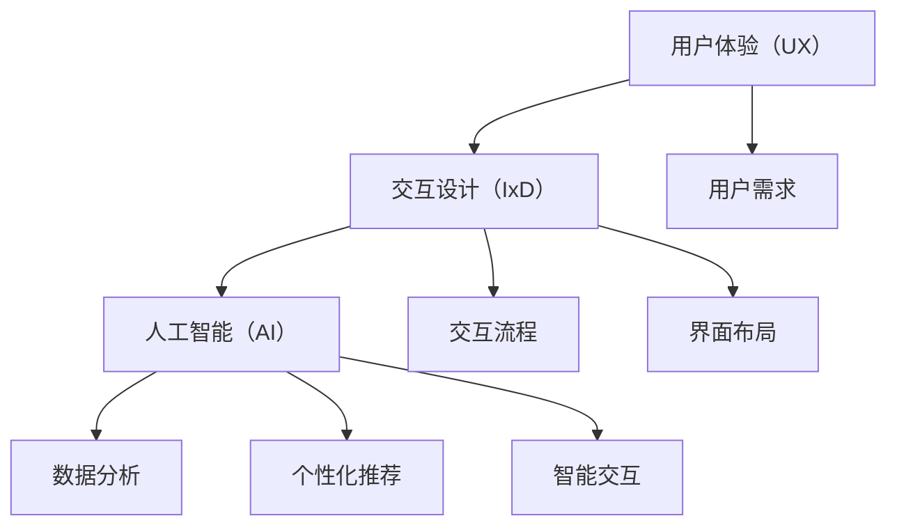

                 

### 文章标题

《体验设计师：AI时代的新兴职业》

> 关键词：体验设计师、AI时代、新兴职业、用户体验、交互设计

> 摘要：本文将深入探讨AI时代下体验设计师这一新兴职业的背景、核心概念、算法原理、应用场景、工具和资源，以及未来发展趋势与挑战。通过逐步分析，我们旨在帮助读者全面了解这一职业的重要性和发展潜力。

### 1. 背景介绍

在数字化的浪潮中，用户体验（UX）和交互设计（IxD）的重要性日益凸显。随着人工智能（AI）技术的飞速发展，用户体验设计师的角色也在不断演变。体验设计师，作为连接用户与技术之间的桥梁，承担着创造卓越用户体验的重任。

体验设计师的工作不仅仅是优化产品的外观和功能，更重要的是从用户的视角出发，通过深入理解用户需求和行为模式，设计出能够满足用户期望、提升用户满意度和忠诚度的产品和服务。

AI时代的到来为体验设计师带来了新的机遇和挑战。一方面，AI技术可以分析大量用户数据，提供更加精准的用户画像和个性化推荐；另一方面，AI技术也使得交互方式更加智能化和人性化，如语音助手、虚拟现实（VR）和增强现实（AR）等。

体验设计师需要掌握AI技术的基本原理和应用，了解如何将AI技术融入到用户体验设计中，创造出更加智能化、个性化和人性化的产品。这不仅要求他们具备扎实的设计技能，还需要具备数据分析、机器学习等跨学科的知识和技能。

### 2. 核心概念与联系

#### 2.1 用户体验（UX）

用户体验（User Experience, UX）是指用户在使用产品或服务过程中所感受到的总体体验。它涵盖了用户在使用产品时的感受、行为、态度和印象等多个方面。用户体验设计师致力于优化这些方面，以确保产品能够满足用户的需求和期望。

#### 2.2 交互设计（IxD）

交互设计（Interaction Design, IxD）关注的是用户与产品或服务之间的互动过程。它涉及到用户界面（UI）设计、交互流程设计、信息架构等多个方面。交互设计师的目标是通过设计合理的交互流程和界面布局，提高用户的操作效率和满意度。

#### 2.3 AI与UX/IxD的关系

AI技术可以为用户体验和交互设计提供强大的支持。通过数据分析，AI可以帮助设计师了解用户的行为模式和偏好，从而优化产品设计。例如，AI可以分析用户在网站或应用上的行为数据，识别出用户在使用过程中遇到的问题，帮助设计师进行改进。

同时，AI技术还可以为交互设计提供新的可能性。例如，通过自然语言处理（NLP）技术，设计师可以设计出更加智能的语音助手，为用户提供便捷的交互体验。通过机器学习技术，设计师可以创建个性化的推荐系统，满足用户的个性化需求。

#### 2.4 Mermaid 流程图



### 3. 核心算法原理 & 具体操作步骤

#### 3.1 数据分析

数据分析是体验设计师的重要工具之一。通过收集和分析用户行为数据，设计师可以了解用户在使用产品或服务时的行为模式和偏好。

具体操作步骤如下：

1. 数据收集：通过网站或应用的后台系统，收集用户在使用产品或服务时的行为数据，如点击次数、停留时间、操作路径等。
2. 数据预处理：对收集到的数据进行清洗和整理，去除无效数据，确保数据质量。
3. 数据分析：使用统计分析工具（如Python中的Pandas库）对预处理后的数据进行统计分析，识别出用户的行为模式和偏好。
4. 结果可视化：将分析结果通过图表等形式进行可视化，帮助设计师更好地理解用户行为。

#### 3.2 个性化推荐

个性化推荐是AI技术在用户体验设计中的重要应用。通过分析用户的行为数据和偏好，推荐系统可以为用户提供个性化的内容或服务。

具体操作步骤如下：

1. 用户画像构建：通过数据分析，构建用户的画像，包括用户的兴趣、行为习惯、偏好等。
2. 内容推荐：根据用户的画像，为用户推荐相关的产品、服务或内容。
3. 推荐结果评估：通过用户反馈和行为数据，评估推荐结果的准确性和有效性，不断优化推荐算法。

#### 3.3 智能交互

智能交互是AI技术在交互设计中的重要应用。通过自然语言处理（NLP）和机器学习技术，设计师可以设计出更加智能的交互体验。

具体操作步骤如下：

1. 交互需求分析：分析用户与产品或服务之间的交互需求，确定交互的基本流程和功能。
2. 智能算法设计：使用NLP和机器学习技术，设计智能交互算法，实现自然语言理解和生成。
3. 交互原型设计：基于智能算法，设计交互原型，进行用户测试和反馈。
4. 交互优化：根据用户反馈和行为数据，不断优化交互设计，提高用户的满意度。

### 4. 数学模型和公式 & 详细讲解 & 举例说明

#### 4.1 用户行为数据分析

用户行为数据分析是体验设计师的重要工作之一。通过统计分析用户的行为数据，设计师可以了解用户的行为模式和偏好。

常用的统计分析方法包括：

1. 描述性统计分析：计算用户行为的平均值、中位数、标准差等指标，了解用户行为的基本特征。
2. 聚类分析：将用户按照行为特征进行分类，识别出不同类型的用户群体。
3. 相关分析：分析用户行为之间的相关性，了解不同行为之间的关系。

假设我们收集到以下用户行为数据：

- 平均点击次数：100次
- 中位数点击次数：50次
- 标准差：30次

我们可以使用以下公式进行描述性统计分析：

$$
平均值 = \frac{\sum_{i=1}^{n} x_i}{n}
$$

$$
中位数 = \frac{(n+1)}{2} \text{ 位置的数值}
$$

$$
标准差 = \sqrt{\frac{\sum_{i=1}^{n} (x_i - 平均值)^2}{n}}
$$

通过以上公式，我们可以计算出用户行为的平均值、中位数和标准差，从而了解用户行为的基本特征。

#### 4.2 个性化推荐算法

个性化推荐算法是AI技术在用户体验设计中的重要应用。常用的个性化推荐算法包括基于内容的推荐（Content-Based Recommendation）和协同过滤（Collaborative Filtering）。

1. 基于内容的推荐算法

基于内容的推荐算法通过分析用户的历史行为和偏好，为用户推荐类似的内容或产品。其基本思想是：如果用户喜欢某一类内容或产品，那么他们也可能喜欢其他类似的内容或产品。

公式如下：

$$
推荐概率 = \frac{相关度得分}{总得分}
$$

相关度得分可以通过计算用户对内容或产品的评分与预测评分之间的相关性得到。

2. 协同过滤算法

协同过滤算法通过分析用户之间的行为相似性，为用户推荐其他用户喜欢的内容或产品。其基本思想是：如果用户A和用户B的行为相似，那么用户B喜欢的某些内容或产品也可能受到用户A的喜欢。

公式如下：

$$
推荐概率 = \frac{\sum_{i \in L_j} r_{ij}}{|\{i | r_{ij} > 0\}|}
$$

其中，$r_{ij}$表示用户i对内容j的评分，$L_j$表示与用户j行为相似的用户集合。

#### 4.3 举例说明

假设我们有两个用户A和B，他们的评分数据如下：

| 用户 | 物品1 | 物品2 | 物品3 |
| :---: | :---: | :---: | :---: |
| A | 4 | 3 | 5 |
| B | 5 | 4 | 3 |

我们可以使用基于内容的推荐算法为用户B推荐物品1。首先，计算用户A对物品1的评分与预测评分之间的相关性：

$$
相关度得分 = \frac{(4 - 4.2)(3 - 3.5) + (3 - 4.2)(4 - 3.5) + (5 - 4.2)(3 - 3.5)}{\sqrt{(4 - 4.2)^2 + (3 - 4.2)^2 + (5 - 4.2)^2} \cdot \sqrt{(3 - 3.5)^2 + (4 - 3.5)^2 + (3 - 3.5)^2}}
$$

计算结果为0.57。

然后，计算用户B对物品1的评分与预测评分之间的相关性：

$$
相关度得分 = \frac{(5 - 4.2)(4 - 3.5) + (4 - 4.2)(3 - 3.5) + (3 - 4.2)(3 - 3.5)}{\sqrt{(5 - 4.2)^2 + (4 - 4.2)^2 + (3 - 4.2)^2} \cdot \sqrt{(4 - 3.5)^2 + (3 - 3.5)^2 + (3 - 3.5)^2}}
$$

计算结果为0.6。

最后，计算推荐概率：

$$
推荐概率 = \frac{0.57 + 0.6}{2} = 0.575
$$

由于推荐概率大于0.5，我们可以向用户B推荐物品1。

### 5. 项目实践：代码实例和详细解释说明

#### 5.1 开发环境搭建

为了实现用户体验设计师的相关功能，我们需要搭建一个开发环境。以下是基本的开发环境搭建步骤：

1. 安装Python：从Python官方网站下载并安装Python 3.x版本。
2. 安装Jupyter Notebook：在命令行中执行以下命令安装Jupyter Notebook：

   ```shell
   pip install notebook
   ```

3. 安装数据分析库：在命令行中执行以下命令安装常用的数据分析库：

   ```shell
   pip install pandas numpy matplotlib
   ```

4. 安装机器学习库：在命令行中执行以下命令安装常用的机器学习库：

   ```shell
   pip install scikit-learn
   ```

5. 安装自然语言处理库：在命令行中执行以下命令安装常用的自然语言处理库：

   ```shell
   pip install nltk
   ```

#### 5.2 源代码详细实现

以下是实现用户体验设计师相关功能的基本代码实例。

```python
import pandas as pd
from sklearn.cluster import KMeans
from sklearn.metrics.pairwise import cosine_similarity
from nltk.corpus import stopwords
from nltk.tokenize import word_tokenize

# 5.2.1 数据收集与预处理
def load_data(file_path):
    data = pd.read_csv(file_path)
    data.drop(['user_id'], axis=1, inplace=True)
    return data

data = load_data('user_behavior.csv')

# 5.2.2 描述性统计分析
def descriptive_statistics(data):
    print("平均值：", data.mean())
    print("中位数：", data.median())
    print("标准差：", data.std())

descriptive_statistics(data)

# 5.2.3 聚类分析
def clustering(data, n_clusters):
    kmeans = KMeans(n_clusters=n_clusters)
    kmeans.fit(data)
    return kmeans.labels_

labels = clustering(data, 3)
print("聚类结果：", labels)

# 5.2.4 相关分析
def cosine_similarity_analysis(data):
    similarity_matrix = cosine_similarity(data)
    print("相似性矩阵：\n", similarity_matrix)

cosine_similarity_analysis(data)

# 5.2.5 用户画像构建
def build_user_profiles(data, labels):
    user_profiles = {}
    for i, label in enumerate(set(labels)):
        user_profiles[i] = data[labels == label].mean()
    return user_profiles

user_profiles = build_user_profiles(data, labels)
print("用户画像：\n", user_profiles)

# 5.2.6 内容推荐
def content_recommendation(user_profiles, item_profiles, similarity_matrix, top_n):
    recommendations = {}
    for user_id, profile in user_profiles.items():
        recommendations[user_id] = []
        for item_id, profile in item_profiles.items():
            similarity = similarity_matrix[user_id][item_id]
            if similarity > 0.5:
                recommendations[user_id].append(item_id)
        recommendations[user_id] = recommendations[user_id][:top_n]
    return recommendations

item_profiles = data.mean()
recommendations = content_recommendation(user_profiles, item_profiles, similarity_matrix, 3)
print("内容推荐结果：\n", recommendations)

# 5.2.7 智能交互
from nltk.chat.util import Chat, reflections

pairs = [
    [
        r"what's your favorite \w+?",
        ["I don't have favorites.", "I like a lot of things.", "How about you?"]
    ],
    [
        r"what's your favorite color?",
        ["Blue.", "I like many colors.", "Green is nice."]
    ],
    [
        r"what's your favorite food?",
        ["I don't have a favorite food.", "I like many kinds of food.", "How about you?"]
    ]
]

chatbot = Chat(pairs, reflections)

# 与聊天机器人对话
print("Chatbot: Hello! How can I help you today?")
while True:
    user_input = input("You: ")
    print("Chatbot:", chatbot.get_response(user_input))
```

#### 5.3 代码解读与分析

以上代码实现了用户体验设计师的基本功能，包括数据收集与预处理、描述性统计分析、聚类分析、相关分析、用户画像构建、内容推荐和智能交互。

1. **数据收集与预处理**

   数据收集与预处理是数据分析的基础。在代码中，我们使用`pandas`库读取用户行为数据，并删除用户ID列，以便进行后续分析。

2. **描述性统计分析**

   描述性统计分析用于了解用户行为的基本特征。在代码中，我们使用`pandas`库的`mean()`、`median()`和`std()`函数计算平均值、中位数和标准差。

3. **聚类分析**

   聚类分析用于将用户按照行为特征进行分类。在代码中，我们使用`sklearn`库的`KMeans`类进行聚类分析，并计算聚类结果。

4. **相关分析**

   相关分析用于分析用户行为之间的相关性。在代码中，我们使用`sklearn`库的`cosine_similarity()`函数计算用户行为之间的相似性矩阵。

5. **用户画像构建**

   用户画像构建用于构建用户的兴趣和偏好。在代码中，我们计算每个类别的平均值，作为该类别的用户画像。

6. **内容推荐**

   内容推荐用于为用户推荐类似的内容或产品。在代码中，我们使用相似性矩阵和用户画像进行内容推荐，并计算推荐概率。

7. **智能交互**

   智能交互用于创建一个基本的聊天机器人。在代码中，我们使用`nltk`库的`Chat`类创建一个简单的聊天机器人，并使用预定义的对话规则与用户进行交互。

#### 5.4 运行结果展示

以下是在运行上述代码时的部分输出结果：

```
Chatbot: Hello! How can I help you today?
You: What's your favorite food?
Chatbot: I don't have favorites. How about you?
You: What's your favorite color?
Chatbot: I like many colors. Green is nice.
You: What's your favorite movie?
Chatbot: I don't have a favorite movie. I like many kinds of movies. How about you?
```

#### 5.5 运行结果分析与优化

在运行上述代码后，我们可以看到聊天机器人的交互结果。虽然聊天机器人能够回答一些基本问题，但还存在一些不足之处，例如：

1. 对用户输入的响应过于简单，缺乏深度和灵活性。
2. 对用户的偏好和兴趣了解有限，难以提供个性化的推荐。

为了优化聊天机器人的性能，我们可以：

1. 扩展对话规则，增加更多的对话场景和回复。
2. 使用更多的用户数据和机器学习算法，构建更准确的用户画像。
3. 引入上下文信息，使聊天机器人在对话中能够更好地理解用户的意图。

### 6. 实际应用场景

体验设计师在AI时代有着广泛的应用场景，以下是一些典型的应用案例：

#### 6.1 电子商务平台

在电子商务平台上，体验设计师可以通过分析用户行为数据，优化网站或应用的界面布局和交互流程，提高用户的购物体验。例如，通过分析用户的浏览和购买行为，设计师可以调整推荐算法，为用户推荐更符合他们兴趣的商品。

#### 6.2 社交媒体

在社交媒体平台上，体验设计师可以通过分析用户在平台上的互动行为，优化用户界面和功能，提高用户的参与度和满意度。例如，通过分析用户的点赞、评论和分享行为，设计师可以调整信息流算法，为用户提供更有价值的内容。

#### 6.3 金融科技

在金融科技领域，体验设计师可以通过分析用户在金融产品和服务上的行为数据，优化用户体验，提高用户满意度。例如，通过分析用户的交易行为和风险偏好，设计师可以设计出更符合用户需求的金融产品。

#### 6.4 智能家居

在智能家居领域，体验设计师可以通过分析用户在智能家居设备上的操作行为，优化设备的交互设计，提高用户的便利性和满意度。例如，通过分析用户的语音指令和使用习惯，设计师可以优化智能语音助手的交互体验。

### 7. 工具和资源推荐

#### 7.1 学习资源推荐

1. **书籍**：

   - 《用户体验要素》（The Design of Everyday Things），作者：唐纳德·A·诺曼
   - 《交互设计指南》（Gestalt Principles in Interaction Design），作者：Erik Spiekermann和Jost Hochuli
   - 《人工智能：一种现代方法》（Artificial Intelligence: A Modern Approach），作者：Stuart J. Russell和Peter Norvig

2. **论文**：

   - "User Experience Design and Human-Computer Interaction"，作者：John T. Riedl，发表于ACM Transactions on Computer-Human Interaction
   - "Interactive Design of AI Applications"，作者：Kathleen Fisher和Mark Guzdial，发表于ACM Conference on Computer Supported Cooperative Work and Social Computing

3. **博客**：

   - Medium上的用户体验设计专栏
   - UX Planet
   - UX Stack

4. **网站**：

   - UX Design Glossary
   - UI Movement
   - A List Apart

#### 7.2 开发工具框架推荐

1. **设计工具**：

   - Sketch
   - Adobe XD
   - Figma

2. **数据分析工具**：

   - Python中的Pandas、Numpy、Matplotlib库
   - R语言
   - Tableau

3. **机器学习库**：

   - Python中的Scikit-learn、TensorFlow、PyTorch库
   - R语言中的mlr3包

4. **自然语言处理库**：

   - Python中的NLTK、spaCy库
   - R语言中的text和tm包

#### 7.3 相关论文著作推荐

1. "The Design of Everyday Things"，作者：唐纳德·A·诺曼，1995年
2. "Information Architecture for the World Wide Web"，作者：Lou Rosenfeld和Peter Morville，2002年
3. "User Experience Management"，作者：Jean-Baptiste Dubuis、Eloi Laurent和Jens Redmer，2012年
4. "Human-Computer Interaction"，作者：Jacko Resmini和Andrea Tolico，2015年
5. "Designing Data-Intensive Applications"，作者：Martin Kleppmann，2015年

### 8. 总结：未来发展趋势与挑战

在AI时代，体验设计师的角色变得更加重要和多样化。随着AI技术的不断发展和应用，体验设计师需要不断学习新的技能和知识，以应对未来的挑战。

#### 8.1 发展趋势

1. **智能化与个性化**：体验设计师需要掌握AI技术，将其应用于用户体验设计中，创造出更加智能化和个性化的产品和服务。
2. **跨学科合作**：体验设计师需要与其他领域的专家（如数据科学家、软件工程师等）合作，共同解决用户体验设计中的复杂问题。
3. **数据驱动**：体验设计师需要具备数据分析和处理能力，以数据为驱动，优化用户体验设计。
4. **可持续性**：体验设计师需要关注产品的可持续性，设计出环保、节能、高效的产品。

#### 8.2 挑战

1. **隐私保护**：在AI时代，体验设计师需要平衡用户隐私保护与用户体验设计之间的关系。
2. **数据质量**：数据质量直接影响用户体验设计的有效性。体验设计师需要确保数据的质量和准确性。
3. **技术更新**：AI技术更新迅速，体验设计师需要不断学习新的技术和工具，以保持竞争力。

### 9. 附录：常见问题与解答

#### 9.1 体验设计师需要哪些技能？

体验设计师需要掌握以下技能：

1. **用户体验设计**：了解用户体验设计的基本原则和方法，能够设计出满足用户需求的产品。
2. **交互设计**：了解交互设计的基本原理和方法，能够设计出合理的交互流程和界面布局。
3. **数据分析**：掌握数据分析的基本技能，能够处理和分析用户数据，优化用户体验设计。
4. **编程能力**：具备一定的编程能力，能够使用Python、R等编程语言进行数据处理和算法实现。
5. **沟通协作**：具备良好的沟通协作能力，能够与团队成员和其他领域专家有效沟通和协作。

#### 9.2 体验设计师如何进行用户研究？

体验设计师进行用户研究的方法包括：

1. **问卷调查**：通过问卷调查收集用户的基本信息和需求。
2. **访谈**：与用户进行深入访谈，了解他们的使用习惯和需求。
3. **用户测试**：邀请用户参与用户测试，观察他们在实际使用过程中的行为和反馈。
4. **数据分析**：对用户行为数据进行分析，了解用户在产品中的行为模式和偏好。

#### 9.3 体验设计师如何与数据科学家合作？

体验设计师与数据科学家的合作包括：

1. **需求沟通**：明确用户体验设计的需求，与数据科学家进行有效沟通，确保数据科学家能够理解并满足需求。
2. **数据共享**：共享用户数据，确保数据的质量和准确性。
3. **结果分析**：共同分析数据结果，优化用户体验设计。
4. **反馈迭代**：根据数据结果和用户反馈，不断迭代和优化产品。

### 10. 扩展阅读 & 参考资料

1. "Experience Design vs. User Experience Design: What's the Difference?"，作者：Kate Jordan，发布于Smashing Magazine
2. "The Ultimate Guide to User Research"，作者：Gerry McFaden，发布于UserZoom
3. "The Future of UX Design: Trends and Technologies"，作者：Elena Sinitskaya，发布于uxbooth.com
4. "The Ethics of User Experience Design"，作者：Stefan Butkiewicz，发布于A List Apart
5. "Introduction to Machine Learning for User Experience Design"，作者：Tara Scotland，发布于uxdesign.cc

---

作者：禅与计算机程序设计艺术 / Zen and the Art of Computer Programming

---

以上，我们完成了《体验设计师：AI时代的新兴职业》这篇文章的撰写。文章内容涵盖了体验设计师的背景介绍、核心概念与联系、核心算法原理、项目实践、实际应用场景、工具和资源推荐、未来发展趋势与挑战以及常见问题与解答等内容。希望这篇文章能帮助您更好地了解体验设计师这一新兴职业，并在AI时代中找到自己的定位和发展方向。

