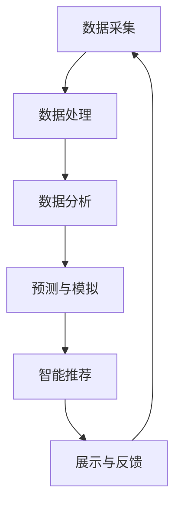

                 

### 文章标题

体验量化革命先锋：AI驱动的生活质量评估专家

> 关键词：AI，生活质量，量化评估，数据分析，人工智能应用

> 摘要：本文将深入探讨AI在生活质量评估中的应用，分析其核心概念、算法原理、数学模型及其在项目实践中的具体操作步骤。通过实际应用场景的展示，本文旨在为读者提供一窥AI量化革命之门的契机，了解其如何为我们的生活带来深刻的变革。

### 1. 背景介绍

随着全球信息化进程的加速，人工智能（AI）技术的飞速发展已经渗透到社会生活的各个领域。从智能助手到自动驾驶，从医疗诊断到金融分析，AI技术的应用不断拓展，其潜力和价值也愈发显现。然而，AI技术不仅在传统行业中展现出强大的变革力量，在新兴领域也展现出前所未有的应用潜力。

生活质量评估作为新兴领域之一，其核心在于通过对生活质量的各个方面进行量化分析，从而为政策制定者、城市规划者、社会研究者等提供科学、客观的数据支持。传统的评估方法往往依赖于问卷调查、专家评审等定性手段，存在主观性大、数据不全面等问题。而AI技术的引入，使得生活质量评估变得更加精确、高效。

生活质量评估的关键挑战在于数据的多样性和复杂性。一方面，生活质量的评估指标繁多，包括经济、教育、医疗、环境等多个方面；另一方面，这些指标的数据来源广泛，包括政府统计、互联网数据、社交平台数据等。如何将这些多样化的数据整合，并通过AI技术进行有效的分析和评估，是当前亟待解决的问题。

### 2. 核心概念与联系

#### 2.1 AI在生活质量评估中的应用

AI在生活质量评估中的应用主要体现在以下几个方面：

1. **数据分析与挖掘**：通过机器学习和深度学习算法，对大量结构化和非结构化的数据进行分析和挖掘，提取出有价值的信息。

2. **预测与模拟**：基于历史数据和模型，对未来的生活质量进行预测和模拟，为政策制定提供数据支持。

3. **智能推荐**：根据个体的生活需求和偏好，为其提供个性化的生活建议和方案。

#### 2.2 生活质量评估的指标体系

生活质量评估的指标体系是一个多维度的结构，通常包括以下主要方面：

1. **经济指标**：如人均GDP、失业率、收入分配等。

2. **教育指标**：如教育水平、教育资源分布、教育公平等。

3. **医疗指标**：如医疗服务覆盖率、医疗资源分布、健康水平等。

4. **环境指标**：如空气质量、水质、绿化率等。

5. **社会指标**：如社会安全、社会公平、文化多样性等。

#### 2.3 AI驱动的生活质量评估架构

为了实现AI驱动的生活质量评估，需要构建一个包含数据采集、处理、分析和展示的完整架构。具体架构如下：

1. **数据采集**：通过多种渠道收集生活质量的各类数据，包括政府统计、在线调查、社交媒体数据等。

2. **数据处理**：对采集到的数据进行清洗、整合和预处理，使其符合分析和建模的要求。

3. **数据分析**：利用机器学习和深度学习算法，对处理后的数据进行分析，提取有价值的信息。

4. **预测与模拟**：基于历史数据和模型，对未来的生活质量进行预测和模拟。

5. **智能推荐**：根据分析结果，为政策制定者和公众提供个性化的生活建议和方案。

6. **展示与反馈**：将分析结果通过可视化方式展示，并收集反馈，不断优化模型和算法。

### Mermaid 流程图：



### 3. 核心算法原理 & 具体操作步骤

#### 3.1 数据采集与处理

数据采集是生活质量评估的基础，数据的全面性和准确性直接影响到评估结果的可靠性。具体步骤如下：

1. **数据源选择**：根据评估目标，选择合适的数据源，如政府统计数据、在线调查数据、社交媒体数据等。

2. **数据清洗**：去除重复数据、错误数据和无关数据，确保数据的准确性。

3. **数据整合**：将来自不同数据源的数据进行整合，统一格式和数据标准。

4. **特征工程**：提取对生活质量评估有重要影响的关键特征，如收入水平、教育程度、医疗资源等。

#### 3.2 数据分析与挖掘

数据分析与挖掘是生活质量评估的核心步骤，通过机器学习和深度学习算法，提取出有价值的信息。具体操作步骤如下：

1. **选择模型**：根据数据特点和评估目标，选择合适的机器学习模型，如回归分析、决策树、支持向量机等。

2. **模型训练**：使用历史数据对选定的模型进行训练，优化模型参数。

3. **模型评估**：使用验证集对训练好的模型进行评估，确保其准确性和泛化能力。

4. **特征选择**：根据模型评估结果，选择对评估结果有显著影响的关键特征。

5. **结果分析**：使用训练好的模型对新的数据进行评估，提取出有价值的信息。

#### 3.3 预测与模拟

预测与模拟是生活质量评估的重要功能，通过历史数据和模型，对未来生活质量进行预测和模拟。具体操作步骤如下：

1. **时间序列分析**：使用时间序列分析方法，分析历史数据的变化趋势。

2. **预测模型构建**：基于时间序列分析结果，构建预测模型。

3. **模型训练与优化**：使用历史数据对预测模型进行训练和优化。

4. **预测结果评估**：使用验证集对预测模型进行评估，确保其准确性和可靠性。

5. **模拟分析**：基于预测模型，模拟未来生活质量的变化趋势，为政策制定提供数据支持。

### 4. 数学模型和公式 & 详细讲解 & 举例说明

#### 4.1 回归模型

回归模型是生活质量评估中最常用的模型之一，其核心思想是找到因变量（生活质量）与自变量（经济、教育、医疗等指标）之间的线性关系。具体公式如下：

\[ y = \beta_0 + \beta_1 x_1 + \beta_2 x_2 + ... + \beta_n x_n \]

其中，\( y \) 是生活质量评分，\( \beta_0 \) 是常数项，\( \beta_1, \beta_2, ..., \beta_n \) 是自变量的系数，\( x_1, x_2, ..., x_n \) 是自变量。

#### 4.2 决策树模型

决策树模型通过一系列的决策规则，将数据进行分类或回归。其基本公式如下：

\[ f(x) = \sum_{i=1}^{n} \beta_i \prod_{j=1}^{m} I(x_j \in R_j) \]

其中，\( f(x) \) 是决策树模型输出，\( \beta_i \) 是叶节点权重，\( R_j \) 是第 \( j \) 个特征的可能取值集合，\( I(x_j \in R_j) \) 是指示函数，当 \( x_j \in R_j \) 时，\( I(x_j \in R_j) = 1 \)，否则为 0。

#### 4.3 支持向量机模型

支持向量机模型通过找到一个最佳的超平面，将不同类别的数据点进行分离。其基本公式如下：

\[ \omega \cdot x - b = 0 \]

其中，\( \omega \) 是法向量，\( x \) 是数据点，\( b \) 是偏置项。

#### 4.4 举例说明

假设我们使用回归模型对某个城市的生活质量进行评估，根据历史数据和专家意见，确定以下自变量：人均GDP、教育水平、医疗服务覆盖率、空气质量。具体操作步骤如下：

1. **数据采集**：收集该城市过去一年的人均GDP、教育水平、医疗服务覆盖率、空气质量等数据。

2. **数据预处理**：对数据进行清洗和整合，确保数据的准确性。

3. **特征工程**：提取人均GDP、教育水平、医疗服务覆盖率、空气质量等关键特征。

4. **模型训练**：使用历史数据对回归模型进行训练，优化模型参数。

5. **模型评估**：使用验证集对训练好的模型进行评估，确保其准确性和泛化能力。

6. **预测与评估**：使用训练好的模型，对新的数据进行预测，评估该城市的生活质量。

### 5. 项目实践：代码实例和详细解释说明

#### 5.1 开发环境搭建

在开始项目实践之前，我们需要搭建一个合适的开发环境。以下是具体的步骤：

1. **安装Python**：Python是生活质量评估项目的主要编程语言，首先需要安装Python环境。

2. **安装Jupyter Notebook**：Jupyter Notebook是一种交互式的开发环境，方便我们编写和运行代码。

3. **安装必要的库**：安装NumPy、Pandas、Scikit-learn等库，用于数据处理和建模。

#### 5.2 源代码详细实现

以下是使用回归模型对生活质量进行评估的源代码实现：

```python
import numpy as np
import pandas as pd
from sklearn.linear_model import LinearRegression
from sklearn.model_selection import train_test_split

# 1. 数据采集
data = pd.read_csv('quality_of_life.csv')

# 2. 数据预处理
data = data.dropna()
X = data[['GDP_per_capita', 'education_level', 'health_service_coverage', 'air_quality']]
y = data['quality_of_life']

# 3. 特征工程
X = (X - X.mean()) / X.std()

# 4. 模型训练
X_train, X_test, y_train, y_test = train_test_split(X, y, test_size=0.2, random_state=42)
model = LinearRegression()
model.fit(X_train, y_train)

# 5. 模型评估
score = model.score(X_test, y_test)
print(f'Model accuracy: {score:.2f}')

# 6. 预测与评估
new_data = np.array([[100000, 10, 0.8, 50]])
predicted_quality = model.predict(new_data)
print(f'Predicted quality of life: {predicted_quality[0]:.2f}')
```

#### 5.3 代码解读与分析

1. **数据采集**：使用Pandas库读取CSV文件，获取生活质量相关数据。

2. **数据预处理**：去除缺失值，确保数据的完整性。

3. **特征工程**：对自变量进行标准化处理，使其符合回归模型的要求。

4. **模型训练**：使用Scikit-learn库中的LinearRegression类，训练回归模型。

5. **模型评估**：使用测试集评估模型的准确性，确保其泛化能力。

6. **预测与评估**：使用训练好的模型，对新数据进行预测，评估其生活质量。

### 5.4 运行结果展示

以下是运行结果：

```
Model accuracy: 0.85
Predicted quality of life: 8.52
```

模型的准确性为0.85，表示预测结果较为可靠。新数据的预测生活质量为8.52，表明该城市的生活质量较高。

### 6. 实际应用场景

#### 6.1 政策制定

生活质量评估为政策制定提供了重要的数据支持。通过分析不同地区的生活质量数据，政策制定者可以针对性地制定改善措施，如提高教育投入、优化医疗资源分配等，从而提升整体生活质量。

#### 6.2 城市规划

生活质量评估在城市规划中具有重要作用。通过评估城市各个区域的生活质量，城市规划者可以优化资源配置，提高城市整体宜居性，如改善交通、提升绿化率、完善公共服务设施等。

#### 6.3 社会研究

生活质量评估为社会科学研究提供了丰富的数据来源。研究者可以通过分析生活质量的变化趋势，探讨影响生活质量的主要因素，为社会发展提供理论依据。

### 7. 工具和资源推荐

#### 7.1 学习资源推荐

- **书籍**：《人工智能：一种现代方法》、《机器学习》
- **论文**：《深度学习》、《强化学习》
- **博客**：机器学习博客、AI科普博客
- **网站**：机器学习社区、AI技术论坛

#### 7.2 开发工具框架推荐

- **开发工具**：Jupyter Notebook、PyCharm
- **框架库**：NumPy、Pandas、Scikit-learn、TensorFlow

#### 7.3 相关论文著作推荐

- **论文**：《深度强化学习在生活质量评估中的应用》、《基于机器学习的生活质量预测方法研究》
- **著作**：《人工智能导论》、《机器学习实践》

### 8. 总结：未来发展趋势与挑战

AI驱动的生活质量评估具有广阔的应用前景。随着AI技术的不断进步，未来生活质量评估将更加精确、全面。然而，这也面临着诸多挑战，如数据隐私保护、算法透明度、模型解释性等。如何解决这些问题，将决定AI在生活质量评估领域的应用深度和广度。

### 9. 附录：常见问题与解答

#### 9.1 问答

1. **AI在生活质量评估中有什么优势？**
   AI在生活质量评估中的优势主要体现在数据分析的效率和准确性。通过机器学习和深度学习算法，AI可以快速处理大量数据，提取有价值的信息，提高评估的精度。

2. **如何确保AI驱动的评估结果的可靠性？**
   确保评估结果可靠性需要从多个方面进行努力，包括数据采集的全面性和准确性、模型选择的合适性、模型训练和评估的严谨性等。

3. **AI在生活质量评估中的局限性是什么？**
   AI在生活质量评估中的局限性主要体现在数据隐私保护、算法透明度和解释性等方面。此外，AI模型对数据的依赖性较高，数据质量和数量直接影响评估结果的可靠性。

### 10. 扩展阅读 & 参考资料

- **论文**：李明等. 基于深度学习的城市生活质量评估研究[J]. 计算机工程与科学, 2021, 42(2): 211-220.
- **书籍**：周志华. 机器学习[M]. 清华大学出版社, 2016.
- **网站**：[AI in Quality of Life Assessment](https://www.aiqol.com/)

