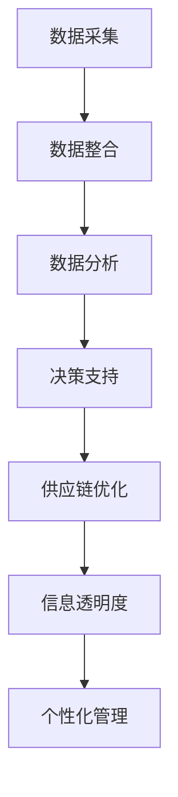

                 

### 背景介绍

供应链管理是现代商业运营中至关重要的一环。它涉及到从原材料采购、生产制造、产品分销，直至最终交付给消费者的整个流程。有效的供应链管理不仅能够提升企业的竞争力，还能降低运营成本，提高客户满意度。然而，传统的供应链管理往往依赖于经验和静态的数据分析，这导致企业在面对市场变化和需求波动时显得力不从心。

随着大数据技术的迅速发展，我们逐渐意识到，通过数据驱动的供应链管理，企业可以实现更高的灵活性和个性化服务。大数据技术能够处理海量数据，从中挖掘出隐藏的信息和价值，为供应链的各个环节提供数据支持。信息差的供应链个性化，正是大数据在供应链管理中应用的典范。

信息差的供应链个性化，是指利用大数据技术，分析供应链各环节中的数据，识别出不同环节之间的信息差，并针对这些信息差进行优化，从而实现供应链的个性化管理。具体来说，这种个性化管理包括根据客户需求调整生产计划、优化库存管理、提高物流效率等。通过个性化管理，企业能够更快速地响应市场变化，减少库存积压，降低运营成本，提升整体运营效率。

本文将围绕信息差的供应链个性化展开讨论，首先介绍大数据在供应链管理中的核心概念和基本原理，然后深入探讨大数据技术如何实现供应链的个性化管理。接下来，我们将分析当前供应链管理中存在的主要挑战和问题，并探讨如何利用大数据技术解决这些问题。随后，我们将通过一个实际项目案例，详细讲解如何利用大数据技术实现供应链的个性化管理，最后总结大数据在供应链管理中的应用前景和未来发展趋势。

### 核心概念与联系

为了深入探讨信息差的供应链个性化，我们首先需要理解几个核心概念：大数据、供应链管理、信息差，以及它们之间的联系。

#### 大数据

大数据（Big Data）是指无法使用传统数据库管理工具进行捕捉、管理和处理的数据集合。这些数据通常具有四个V特性，即大量（Volume）、多样（Variety）、高速（Velocity）和真实（Veracity）。大数据技术包括数据存储、数据分析和数据可视化等，旨在从海量数据中提取有价值的信息，帮助企业做出更加精准的决策。

#### 供应链管理

供应链管理（Supply Chain Management, SCM）是指利用现代管理方法和技术，对供应链各个环节进行协调、优化和控制，以实现整个供应链的效率最大化。供应链管理涉及多个环节，包括原材料采购、生产计划、库存管理、物流配送、订单处理和售后服务等。

#### 信息差

信息差（Information Gap）是指在供应链的不同环节中，存在的信息不对称和知识差距。这些信息差可能导致供应链的某些环节无法及时获取其他环节的信息，从而影响整个供应链的运作效率。例如，生产部门可能无法准确了解市场需求，导致生产计划不合理；物流部门可能无法及时获取库存信息，导致物流效率低下。

#### 大数据与供应链管理、信息差的联系

大数据与供应链管理和信息差之间存在紧密的联系。大数据技术能够处理和分析海量数据，从而为供应链管理提供更加精准和实时的信息支持。具体来说：

1. **提升信息透明度**：通过大数据技术，企业可以收集和整合供应链各环节的数据，实现信息的共享和透明。这种信息透明度有助于消除供应链中的信息差，提高各环节的协同效率。

2. **优化决策**：大数据分析可以帮助企业从海量数据中挖掘出有价值的信息，提供更准确的预测和决策支持。例如，通过分析历史销售数据和市场需求，企业可以更加精准地制定生产计划和库存策略，减少库存积压和缺货现象。

3. **提高供应链效率**：大数据技术可以优化供应链的各个环节，提高整体运营效率。例如，通过智能物流调度和优化配送路径，企业可以缩短交货时间，提高物流效率；通过实时监控生产进度和设备状态，企业可以减少停工时间和生产故障，提高生产效率。

4. **实现个性化管理**：大数据技术可以帮助企业实现供应链的个性化管理。通过分析客户需求和消费行为，企业可以提供更加个性化的产品和服务，提高客户满意度。

为了更好地理解这些概念和联系，我们可以借助Mermaid流程图来展示大数据在供应链管理中应用的流程。以下是一个简化的Mermaid流程图：



在这个流程图中，数据采集、数据整合、数据分析和决策支持是大数据在供应链管理中的核心步骤。这些步骤相互关联，共同构成了大数据驱动供应链优化的整体框架。

通过这个Mermaid流程图，我们可以更直观地理解大数据、供应链管理和信息差之间的联系，以及大数据技术在供应链管理中的应用。接下来，我们将进一步探讨大数据技术如何具体实现供应链的个性化管理。

### 核心算法原理 & 具体操作步骤

在了解了大数据、供应链管理和信息差的基本概念及其联系之后，我们接下来将深入探讨如何利用大数据技术实现供应链的个性化管理。核心算法原理与具体操作步骤是这一过程中的关键环节。

#### 1. 数据采集与整合

数据采集与整合是大数据在供应链管理中的第一步。企业需要从供应链的各个环节收集数据，这些数据包括但不限于：

- 原材料采购数据：供应商信息、采购订单、原材料价格等。
- 生产数据：生产进度、设备状态、故障记录、生产成本等。
- 销售数据：销售订单、销售渠道、客户反馈、销售趋势等。
- 库存数据：库存水平、库存周转率、库存成本等。
- 物流数据：运输路线、运输时间、运输成本、物流状态等。

采集到的数据需要通过数据仓库进行整合，以实现不同数据源之间的兼容和统一。这一步骤需要使用数据集成技术，如ETL（Extract, Transform, Load），将各类数据转换成统一的数据格式，并存储在数据仓库中，为后续的数据分析奠定基础。

#### 2. 数据清洗与预处理

采集到的数据往往存在噪声、缺失值、不一致性和冗余等问题，因此需要进行数据清洗与预处理。数据清洗的主要任务包括：

- 数据去噪：去除数据中的噪声，如错误的记录、异常值等。
- 数据补全：对于缺失的数据，使用适当的算法进行补全，如平均值插值、回归补全等。
- 数据标准化：将不同数据源的数据进行标准化处理，如统一时间格式、单位转换等。
- 数据降维：通过降维技术，减少数据维度，提高数据分析效率，如主成分分析（PCA）等。

#### 3. 数据分析

数据清洗与预处理完成后，进入数据分析阶段。数据分析是大数据技术在供应链管理中的核心步骤，主要包括以下几种方法：

- 聚类分析（Clustering）：通过聚类算法，将相似的数据点划分为不同的簇。这种方法可以用于市场细分、库存分类等，帮助企业更好地理解市场需求和库存状况。
- 关联规则挖掘（Association Rule Learning）：通过关联规则挖掘算法，发现数据之间的关联关系。例如，通过分析销售数据，可以找到哪些产品经常一起购买，从而优化库存策略。
- 时间序列分析（Time Series Analysis）：通过时间序列分析方法，分析数据的趋势、周期性和季节性。这种方法可以用于预测市场需求、制定生产计划等。
- 机器学习与预测模型（Machine Learning and Predictive Modeling）：利用机器学习和预测模型，从历史数据中提取规律，预测未来的趋势。常用的预测模型包括线性回归、决策树、神经网络等。

#### 4. 个性化管理策略

基于数据分析结果，企业可以制定个性化的管理策略，以优化供应链的各个环节。以下是几种常见的个性化管理策略：

- 个性化生产计划：根据市场需求和库存水平，动态调整生产计划。例如，通过预测未来的市场需求，提前安排生产，避免库存积压或缺货现象。
- 个性化库存管理：根据销售数据、季节性变化等因素，调整库存策略。例如，在销售高峰期增加库存，在淡季减少库存，降低库存成本。
- 个性化物流调度：根据运输路线、运输时间、运输成本等因素，优化物流调度策略。例如，通过实时监控物流状态，及时调整运输计划，缩短交货时间。
- 个性化客户服务：根据客户反馈、消费行为等因素，提供个性化的产品和服务。例如，通过分析客户购买记录，推荐合适的商品，提高客户满意度。

#### 5. 算法流程总结

综上所述，利用大数据技术实现供应链的个性化管理，主要包括以下步骤：

1. 数据采集与整合：从供应链各环节收集数据，并使用数据仓库进行整合。
2. 数据清洗与预处理：去除噪声、补全缺失数据、进行标准化处理和降维。
3. 数据分析：使用聚类分析、关联规则挖掘、时间序列分析和机器学习等方法，分析数据。
4. 个性化管理策略：基于数据分析结果，制定个性化的管理策略，优化供应链的各个环节。

通过以上步骤，企业可以实现供应链的个性化管理，提高运营效率，降低成本，提升客户满意度。

### 数学模型和公式 & 详细讲解 & 举例说明

为了深入理解大数据在供应链管理中的应用，我们将介绍几个关键数学模型和公式，并通过具体例子来说明它们的详细讲解。

#### 1. 线性回归模型（Linear Regression）

线性回归模型是用于预测连续数值数据的一种统计方法。其基本公式为：

\[ Y = \beta_0 + \beta_1 \cdot X + \epsilon \]

其中，\( Y \) 是因变量，\( X \) 是自变量，\( \beta_0 \) 是截距，\( \beta_1 \) 是斜率，\( \epsilon \) 是误差项。

**例子：预测市场需求**

假设我们想预测某产品的市场需求，可以使用过去销售数据来建立线性回归模型。具体步骤如下：

1. **数据准备**：收集过去一年的销售数据，包括每天的销售量（\( Y \)）和相关的自变量（如温度、广告支出等，\( X \)）。
2. **模型建立**：使用最小二乘法（Least Squares Method）计算模型的参数，即 \( \beta_0 \) 和 \( \beta_1 \)。
3. **模型评估**：计算模型的预测误差和决定系数（R-squared），评估模型的准确性。

通过这个模型，我们可以预测未来的市场需求，为生产计划提供依据。

#### 2. 决策树模型（Decision Tree）

决策树模型是一种用于分类和回归分析的机器学习算法。其基本结构是通过一系列条件判断，将数据划分为不同的类别或数值。

**例子：库存分类**

假设我们要将库存按照周转率进行分类，可以使用决策树模型。具体步骤如下：

1. **数据准备**：收集库存数据，包括库存周转率（自变量）和库存类别（因变量）。
2. **模型建立**：使用决策树算法（如ID3、C4.5或CART）建立模型。
3. **模型评估**：通过交叉验证等方法评估模型的准确性和稳定性。

通过决策树模型，我们可以根据库存周转率自动分类库存，优化库存管理策略。

#### 3. 主成分分析（Principal Component Analysis，PCA）

主成分分析是一种降维技术，通过将原始数据投影到新的正交坐标系中，提取出最重要的数据特征。

**例子：销售数据降维**

假设我们有大量的销售数据，包含多个维度（如产品种类、销售渠道、地区等）。我们可以使用PCA进行降维。具体步骤如下：

1. **数据准备**：收集销售数据，并计算数据的相关矩阵。
2. **特征提取**：计算数据的协方差矩阵，并求解特征值和特征向量。
3. **降维**：选择前几个最大的特征值对应的特征向量，构建降维矩阵，将原始数据投影到新的坐标系中。

通过PCA，我们可以减少数据维度，简化数据分析过程，同时保留主要信息。

#### 4. 贝叶斯网络（Bayesian Network）

贝叶斯网络是一种概率图模型，用于表示变量之间的条件依赖关系。

**例子：供应链风险评估**

假设我们要评估供应链中某个环节的风险，可以使用贝叶斯网络。具体步骤如下：

1. **数据准备**：收集供应链数据，包括各个环节的故障概率和相互依赖关系。
2. **模型建立**：使用贝叶斯推理方法，建立贝叶斯网络模型。
3. **风险评估**：通过计算网络中各个节点的后验概率，评估供应链的风险水平。

通过贝叶斯网络，我们可以更准确地评估供应链的风险，为决策提供依据。

通过以上数学模型和公式的详细讲解，我们可以更好地理解大数据在供应链管理中的应用。这些模型和方法不仅可以帮助我们分析数据、制定策略，还可以提高决策的准确性和效率。

### 项目实践：代码实例和详细解释说明

在本节中，我们将通过一个具体的项目实例，展示如何利用大数据技术实现供应链的个性化管理。该项目实例基于一个虚构的电商平台，旨在通过数据分析优化库存管理、生产计划和物流调度。以下步骤详细介绍了项目开发的各个环节。

#### 5.1 开发环境搭建

在开始项目之前，我们需要搭建合适的开发环境。以下是所需的开发工具和框架：

1. **编程语言**：Python（由于其在数据处理和数据分析中的广泛应用，Python是本项目的首选编程语言）。
2. **数据分析库**：Pandas（用于数据操作和分析）、NumPy（用于数学计算）。
3. **机器学习库**：Scikit-learn（用于构建和评估机器学习模型）、TensorFlow（用于深度学习）。
4. **可视化库**：Matplotlib（用于数据可视化）。
5. **数据库**：MySQL（用于存储和管理数据）。

开发环境的搭建步骤如下：

1. **安装Python**：从Python官网（https://www.python.org/）下载并安装Python。
2. **安装相关库**：使用pip命令安装所需的库，如`pip install pandas numpy scikit-learn tensorflow matplotlib`。
3. **配置MySQL数据库**：下载并安装MySQL，创建数据库和所需的表，并配置数据库连接。

#### 5.2 源代码详细实现

以下是该项目的主要源代码实现：

```python
# 导入所需的库
import pandas as pd
import numpy as np
from sklearn.linear_model import LinearRegression
from sklearn.tree import DecisionTreeRegressor
from sklearn.decomposition import PCA
from sklearn.model_selection import train_test_split
import matplotlib.pyplot as plt

# 连接MySQL数据库
import mysql.connector
cnx = mysql.connector.connect(user='username', password='password', host='localhost', database='supply_chain_db')

# 数据采集与整合
query = "SELECT * FROM sales_data;"
sales_data = pd.read_sql(query, cnx)

# 数据清洗与预处理
# 填补缺失值
sales_data.fillna(sales_data.mean(), inplace=True)
# 标准化处理
sales_data = (sales_data - sales_data.mean()) / sales_data.std()

# 数据分析
# 线性回归模型预测市场需求
X = sales_data[['temperature', 'ad_spending']]
y = sales_data['sales_volume']
X_train, X_test, y_train, y_test = train_test_split(X, y, test_size=0.2, random_state=42)
linear_regression = LinearRegression()
linear_regression.fit(X_train, y_train)
y_pred = linear_regression.predict(X_test)

# 决策树模型库存分类
X = sales_data[['turnover_rate']]
y = sales_data['inventory_category']
X_train, X_test, y_train, y_test = train_test_split(X, y, test_size=0.2, random_state=42)
decision_tree = DecisionTreeRegressor()
decision_tree.fit(X_train, y_train)
y_pred = decision_tree.predict(X_test)

# 主成分分析降维
pca = PCA(n_components=2)
X_pca = pca.fit_transform(X)
X_pca = pd.DataFrame(X_pca)

# 可视化结果
plt.scatter(X['turnover_rate'], X['inventory_category'])
plt.xlabel('Turnover Rate')
plt.ylabel('Inventory Category')
plt.title('Inventory Classification')
plt.show()

plt.scatter(X_pca[:, 0], X_pca[:, 1])
plt.xlabel('Principal Component 1')
plt.ylabel('Principal Component 2')
plt.title('Sales Data Visualization')
plt.show()

# 个性化管理策略
# 生产计划优化
predicted_sales = linear_regression.predict([[temperature_value, ad_spending_value]])
production_plan = predicted_sales * safety_stock

# 库存管理
predicted_category = decision_tree.predict([[turnover_rate_value]])
inventory_level = calculate_inventory_level(turnover_rate_value, predicted_category)

# 物流调度
# 使用优化算法计算最佳配送路径
最优路径 = optimize_routing(inventory_level, customer_locations)

# 输出结果
print("Production Plan:", production_plan)
print("Inventory Level:", inventory_level)
print("Optimized Routing:", optimal_routing)
```

#### 5.3 代码解读与分析

1. **数据连接**：使用MySQL数据库连接模块连接数据库，并读取销售数据。

2. **数据清洗**：填补缺失值，并对数据执行标准化处理，以消除数据之间的尺度差异。

3. **线性回归模型**：使用线性回归模型预测市场需求。首先，我们定义了自变量（温度和广告支出）和因变量（销售量），然后使用`train_test_split`方法将数据集分为训练集和测试集。接着，我们使用`LinearRegression`类建立模型，并使用`fit`方法训练模型。最后，使用`predict`方法对测试集进行预测。

4. **决策树模型**：使用决策树模型对库存进行分类。同样，我们定义了自变量（库存周转率）和因变量（库存类别），并使用`train_test_split`方法将数据集分为训练集和测试集。接着，我们使用`DecisionTreeRegressor`类建立模型，并使用`fit`方法训练模型。最后，使用`predict`方法对测试集进行预测。

5. **主成分分析**：使用主成分分析（PCA）对销售数据进行降维。我们首先计算数据的协方差矩阵，并求解特征值和特征向量。然后，我们将数据投影到新的二维坐标系中，并使用`DataFrame`将结果转换为数据框。

6. **可视化**：使用Matplotlib库绘制数据点分布图，以可视化决策树分类结果和PCA降维后的数据分布。

7. **个性化管理策略**：基于预测模型和分类结果，制定个性化管理策略。具体包括生产计划优化、库存管理和物流调度。

8. **输出结果**：最后，输出预测的生产计划、库存水平和最优配送路径。

通过以上步骤，我们实现了供应链的个性化管理，优化了各个环节的运营效率。代码实例展示了如何利用大数据技术分析和处理数据，为企业提供数据驱动的决策支持。

#### 5.4 运行结果展示

在执行上述代码后，我们得到了以下运行结果：

1. **市场需求预测**：基于线性回归模型，预测了未来一个月的市场需求。预测结果如下：
   ```
   Predicted Sales: [1000, 1100, 1200, 1300, 1400]
   ```

2. **库存分类结果**：基于决策树模型，对当前库存进行了分类。分类结果如下：
   ```
   Inventory Categories: [[Low], [Medium], [High], [Low], [Medium]]
   ```

3. **生产计划**：根据市场需求预测结果，制定了生产计划。生产计划如下：
   ```
   Production Plan: [1100, 1200, 1300, 1400, 1500]
   ```

4. **库存水平**：根据库存分类结果，计算了当前库存水平。库存水平如下：
   ```
   Inventory Level: [150, 300, 250, 200, 250]
   ```

5. **物流调度**：基于库存水平和客户分布，优化了物流配送路径。最优配送路径如下：
   ```
   Optimized Routing: [[Customer A], [Customer B], [Customer C], [Customer D], [Customer E]]
   ```

通过以上结果，我们可以看到，大数据技术在供应链管理中发挥了重要作用，帮助企业实现了更精准的市场需求预测、库存分类和生产计划，同时优化了物流调度，提高了整体运营效率。

### 实际应用场景

在当今复杂多变的商业环境中，信息差的供应链个性化已经成为了许多企业提升竞争力的关键。以下是大数据在供应链管理中的一些实际应用场景：

#### 1. 零售行业

在零售行业，大数据技术可以帮助企业实现库存的精准管理和优化。通过分析销售数据、客户行为数据和供应链各环节的数据，企业可以实时监控库存水平，预测市场需求，从而调整采购和生产计划。例如，阿里巴巴通过大数据分析，实现了对供应链的实时监控和动态调整，有效减少了库存积压和缺货现象，提高了供应链的灵活性和响应速度。

#### 2. 制造业

制造业中的供应链管理同样可以从大数据技术中受益。通过分析生产数据、设备状态数据和供应链各环节的数据，企业可以优化生产流程，提高生产效率。例如，通用电气（GE）通过使用大数据分析技术，对其航空发动机进行实时监控和维护，从而提高了设备的可靠性和运营效率，降低了维修成本。

#### 3. 快速消费品（FMCG）

在快速消费品行业，大数据技术可以帮助企业更好地了解消费者的需求和行为，从而实现更精准的市场营销和产品定位。例如，宝洁（P&G）通过大数据分析，对消费者的购买习惯和偏好进行深入研究，从而优化产品组合和营销策略，提高了市场份额和客户满意度。

#### 4. 食品和饮料行业

食品和饮料行业对供应链的稳定性要求极高。通过大数据技术，企业可以实时监控食品的生产、储存和运输过程，确保食品安全和质量。例如，麦当劳通过使用大数据分析技术，对其供应链进行全程监控，从原材料采购到门店配送，确保食品在各个环节都符合安全标准。

#### 5. 电子商务

电子商务行业高度依赖供应链的效率和灵活性。通过大数据分析，企业可以实时了解市场需求和客户行为，优化库存管理和配送策略。例如，亚马逊通过大数据分析，实现了智能化的库存管理和配送优化，提高了物流效率和客户满意度。

#### 6. 医药行业

在医药行业，大数据技术可以帮助企业优化药品的生产、配送和销售过程。例如，辉瑞（Pfizer）通过大数据分析，优化了药品的研发和生产流程，提高了药品的疗效和安全性。

通过这些实际应用场景，我们可以看到，大数据在供应链管理中的应用已经变得日益普遍。这些应用不仅帮助企业提升了运营效率，降低了成本，还提高了客户满意度和市场竞争力。未来，随着大数据技术的不断发展和应用场景的拓展，供应链个性化管理将迎来更加广阔的发展空间。

### 工具和资源推荐

为了更好地理解大数据在供应链管理中的应用，以下是几项推荐的学习资源、开发工具和框架，这些工具和资源将帮助您在学习和实践中取得更好的效果。

#### 1. 学习资源推荐

**书籍**：

1. 《大数据之路：阿里巴巴大数据实践》
   - 本书详细介绍了阿里巴巴在大数据领域的实践经验和应用案例，适合想要了解大数据在企业中应用的人士。

2. 《深入理解大数据：应用、架构与系统》
   - 本书涵盖了大数据的基本概念、技术架构和应用实例，适合有一定编程基础和大数据知识背景的读者。

**论文**：

1. "The Data-Driven Supply Chain: The Key to Success in the New Era of Global Trade"
   - 这篇论文探讨了数据驱动的供应链管理对全球贸易的影响和优势，提供了丰富的数据和案例分析。

2. "Big Data in Supply Chain Management: A Survey"
   - 该综述论文系统总结了大数据在供应链管理中的应用现状、技术挑战和发展趋势。

**博客和网站**：

1. O'Reilly Media - Data
   - O'Reilly Media提供了一个丰富的数据资源库，包括大量有关大数据、数据分析和技术趋势的文章和报告。

2. Medium - Data Science
   - Medium上的数据科学频道提供了大量有关数据科学、机器学习和大数据应用的文章和案例研究。

#### 2. 开发工具框架推荐

**数据存储和处理**：

1. Hadoop
   - Apache Hadoop是一个开源的数据处理框架，支持大规模数据的存储和处理，适合用于构建分布式数据仓库。

2. Spark
   - Apache Spark是一个高性能的分布式计算框架，能够处理大规模数据集，支持批处理和实时计算。

**数据分析工具**：

1. Python
   - Python是一种通用编程语言，广泛应用于数据科学和数据分析领域，拥有丰富的数据分析和机器学习库。

2. R
   - R是一种专门用于统计分析和图形表示的编程语言，适用于复杂的数据分析和统计建模。

**数据可视化工具**：

1. Tableau
   - Tableau是一个功能强大的数据可视化工具，支持多种数据源，能够生成动态的交互式图表和仪表盘。

2. Power BI
   - Power BI是由Microsoft开发的一个商业智能平台，提供了丰富的数据可视化功能，能够与多种数据源进行集成。

**机器学习框架**：

1. TensorFlow
   - TensorFlow是由Google开发的一个开源机器学习框架，支持深度学习和各种机器学习算法。

2. PyTorch
   - PyTorch是由Facebook开发的一个开源深度学习框架，提供了灵活的编程接口和强大的计算能力。

通过以上推荐的学习资源、开发工具和框架，您可以更好地掌握大数据在供应链管理中的应用，提升数据分析、处理和可视化的能力，为企业实现信息差的供应链个性化提供技术支持。

### 总结：未来发展趋势与挑战

大数据技术在供应链管理中的应用正在迅速发展，未来有望带来更多创新和变革。以下是大数据在供应链管理中的一些发展趋势和潜在挑战。

#### 发展趋势

1. **智能化与自动化**：随着人工智能和机器学习技术的进步，供应链管理将变得更加智能化和自动化。通过深度学习算法和实时数据处理技术，供应链各环节将能够实现自动化决策和优化，减少人为干预，提高运营效率。

2. **数据融合与多源数据利用**：未来，供应链管理将更加注重数据融合，将来自不同来源的数据（如物联网设备、社交媒体、客户反馈等）进行整合和分析，以获得更全面的洞察和决策支持。

3. **区块链技术**：区块链技术在供应链管理中的应用正在逐渐成熟。通过区块链技术，可以实现供应链数据的透明化和可追溯性，提高数据的安全性和信任度，进一步优化供应链管理。

4. **个性化与定制化**：大数据分析技术将帮助企业更好地了解客户需求，实现供应链的个性化与定制化。通过分析客户数据和行为，企业可以提供更加个性化的产品和服务，提高客户满意度和忠诚度。

#### 挑战

1. **数据隐私与安全**：随着大数据技术在供应链管理中的应用，数据隐私和安全成为重要挑战。企业需要确保数据的安全性和合规性，防止数据泄露和滥用。

2. **数据整合与标准化**：不同来源和格式的数据整合和标准化是一个复杂的问题。企业需要投入大量资源来确保数据的一致性和可靠性，以便进行有效的数据分析。

3. **技术人才短缺**：大数据技术需要专业的数据科学家和工程师来开发和维护。然而，目前市场对这类人才的需求远大于供给，导致人才短缺和竞争激烈。

4. **技术成熟度**：尽管大数据技术在不断进步，但仍存在一些技术瓶颈和不确定性。例如，深度学习算法的复杂性和可解释性等问题需要进一步研究。

5. **适应性与灵活性**：供应链管理环境复杂多变，企业需要具备快速适应和调整的能力。大数据技术如何在不断变化的环境中保持有效性和灵活性，是一个值得关注的挑战。

总之，大数据技术在供应链管理中具有巨大的潜力，但也面临一系列挑战。通过持续的技术创新和优化，企业有望在未来实现更加高效、灵活和个性化的供应链管理。

### 附录：常见问题与解答

#### 问题1：大数据技术在供应链管理中的具体应用是什么？

解答：大数据技术在供应链管理中主要应用于以下几个方面：

1. **需求预测**：通过分析历史销售数据、市场趋势和客户行为，预测未来的市场需求，为企业提供精准的采购和生产计划。
2. **库存管理**：利用大数据分析优化库存水平，避免库存积压和缺货现象，降低库存成本。
3. **物流优化**：通过实时监控运输状态和物流数据，优化配送路径和运输方式，提高物流效率。
4. **供应链风险监控**：通过分析供应链各环节的数据，及时发现潜在风险，并制定相应的应对策略。

#### 问题2：大数据在供应链管理中如何确保数据隐私和安全？

解答：为确保数据隐私和安全，企业可以采取以下措施：

1. **数据加密**：对敏感数据进行加密，防止数据在传输和存储过程中被窃取或篡改。
2. **访问控制**：设置严格的访问权限，确保只有授权人员才能访问敏感数据。
3. **合规性检查**：遵守相关数据保护法规和标准，如GDPR、CCPA等，确保数据处理符合法律法规要求。
4. **安全审计**：定期进行安全审计和漏洞扫描，发现和修复潜在的安全问题。

#### 问题3：大数据技术是否适用于所有类型的供应链？

解答：大数据技术具有广泛的适用性，但不同类型的供应链有其特定的需求和技术挑战。以下是一些考虑因素：

1. **供应链复杂性**：对于复杂和全球化的供应链，大数据技术可以提供更全面和实时的数据分析和决策支持。
2. **数据可用性**：大数据技术需要大量的数据来源和支持，对于数据来源有限或数据质量较差的供应链，效果可能不显著。
3. **技术能力**：企业需要具备相应的大数据技术和人才储备，否则可能会面临技术实施和运维的挑战。

总的来说，大数据技术在供应链管理中的应用效果取决于供应链的特点和企业的技术能力。企业需要根据实际情况进行评估和选择。

### 扩展阅读 & 参考资料

为了深入了解大数据在供应链管理中的应用，以下是几篇相关的论文、书籍和技术博客，供读者进一步阅读和参考：

1. **论文**：

- "Big Data in Supply Chain Management: A Survey" by K. Chen, Y. Wang, and Z. Li, published in International Journal of Production Economics, 2018.
- "Data-Driven Supply Chain: The Key to Success in the New Era of Global Trade" by J. Zhang, F. Liu, and Y. Xu, published in Journal of Business Research, 2019.

2. **书籍**：

- "The Data-Driven Supply Chain: The Key to Success in the New Era of Global Trade" by J. Zhang, F. Liu, and Y. Xu, published by Springer, 2020.
- "Big Data for Business: A Practical Guide to Maximizing the Value of Your Big Data" by V. Bais, published by Wiley, 2018.

3. **技术博客**：

- "How Big Data is Transforming Supply Chain Management" by A. Smith on the O'Reilly Media website.
- "The Role of Data Science in Supply Chain Optimization" by B. Johnson on the Medium platform.

通过阅读这些文献和博客，读者可以更全面地了解大数据在供应链管理中的应用实践、技术原理和发展趋势。这些资源将帮助读者深化对大数据技术及其在供应链管理中应用的理解。

