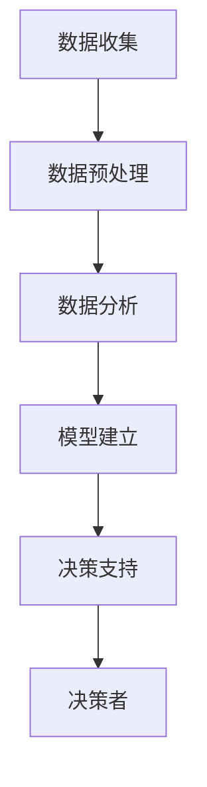

                 

### 文章标题

信息差的决策支持力量：大数据如何提升决策质量

> **关键词：** 数据分析、决策支持系统、大数据、信息差、质量提升
>
> **摘要：** 本文将探讨大数据在决策支持中的作用，分析信息差对决策质量的影响，并提供具体方法和工具，以实现决策质量的提升。文章将从背景介绍、核心概念与联系、核心算法原理、数学模型和公式、项目实践、实际应用场景等多个方面展开讨论。

---

### 1. 背景介绍

在当今的信息时代，数据已经成为重要的资源，尤其是大数据的兴起，更是引发了各行各业的变革。大数据具有数据量大、类型多、价值高的特点，如何有效地利用大数据进行决策，成为当前研究的热点问题。

传统的决策支持系统（DSS）主要依赖于专家经验和小规模的数据分析，其局限性在于数据量有限、分析方法单一、决策质量不高。而随着大数据技术的发展，决策支持系统迎来了新的机遇。大数据技术能够处理海量数据，提供更加精准和全面的决策支持，从而提高决策质量。

然而，大数据的利用并非一蹴而就，信息差的存在成为制约决策质量提升的一个重要因素。信息差指的是不同个体或组织在信息获取、处理、利用方面的差异，这种差异可能导致决策者无法全面了解问题，进而影响决策质量。

本文将围绕信息差的决策支持力量展开讨论，通过分析大数据在决策支持中的应用，探讨如何缩小信息差，提升决策质量。

### 2. 核心概念与联系

#### 2.1 大数据的基本概念

大数据（Big Data）指的是数据量大、类型多、速度快的数据集合。大数据通常具有4V特点：Volume（数据量大）、Velocity（数据速度快）、Variety（数据类型多）和 Veracity（数据真实性高）。

#### 2.2 决策支持系统（DSS）

决策支持系统是一种计算机辅助决策系统，通过利用数据和模型，为决策者提供信息支持，帮助其做出更明智的决策。DSS通常包括数据收集、数据预处理、数据分析、模型建立和决策支持等环节。

#### 2.3 信息差

信息差是指由于不同个体或组织在信息获取、处理、利用方面的差异，导致他们对同一问题的理解程度不同，进而影响决策质量。

#### 2.4 大数据与DSS的关联

大数据与决策支持系统的结合，使得决策支持系统具备了处理海量数据的能力，从而能够提供更加精准和全面的决策支持。大数据为DSS提供了丰富的数据资源，而DSS则通过先进的数据分析技术和模型，帮助决策者从海量数据中提取有价值的信息，缩小信息差，提升决策质量。

以下是一个简化的Mermaid流程图，展示了大数据与决策支持系统的关联：



### 3. 核心算法原理 & 具体操作步骤

#### 3.1 数据收集

数据收集是决策支持系统的第一步，主要涉及数据来源的确定和数据采集方法的选用。常见的数据来源包括内部数据库、外部数据接口、社交媒体、传感器网络等。

具体操作步骤如下：

1. 确定数据需求：根据决策问题确定需要收集的数据类型和数量。
2. 选择数据源：根据数据需求选择合适的数据源。
3. 设计数据采集方案：确定数据采集的时间、频率、方法等。

#### 3.2 数据预处理

数据预处理是确保数据质量和一致性的关键步骤。主要操作包括数据清洗、数据转换、数据集成等。

具体操作步骤如下：

1. 数据清洗：去除数据中的错误、异常、重复等数据。
2. 数据转换：将不同数据格式统一为标准格式。
3. 数据集成：将来自不同数据源的数据整合为统一的数据集。

#### 3.3 数据分析

数据分析是决策支持系统的核心环节，主要涉及数据挖掘、统计分析、机器学习等方法。

具体操作步骤如下：

1. 数据挖掘：从海量数据中发现潜在的模式和关联。
2. 统计分析：利用统计学方法对数据进行描述、推断和预测。
3. 机器学习：建立模型，对数据进行学习和预测。

#### 3.4 模型建立

模型建立是利用数据分析结果建立数学模型，以支持决策。

具体操作步骤如下：

1. 选择模型类型：根据决策问题选择合适的模型类型。
2. 确定模型参数：根据数据分析结果确定模型参数。
3. 模型优化：对模型进行优化，以提高预测准确性和决策效果。

#### 3.5 决策支持

决策支持是利用建立的模型为决策者提供决策支持。

具体操作步骤如下：

1. 输出决策结果：根据模型预测结果生成决策建议。
2. 决策评估：对决策结果进行评估，以验证决策的有效性。
3. 决策反馈：将决策结果反馈到系统中，以优化决策过程。

### 4. 数学模型和公式 & 详细讲解 & 举例说明

#### 4.1 数学模型

在决策支持系统中，常用的数学模型包括线性回归模型、逻辑回归模型、决策树模型、支持向量机模型等。以下以线性回归模型为例进行详细讲解。

线性回归模型是一种用于预测连续值的模型，其公式为：

$$
Y = \beta_0 + \beta_1X + \epsilon
$$

其中，$Y$ 是预测值，$X$ 是输入变量，$\beta_0$ 和 $\beta_1$ 是模型参数，$\epsilon$ 是误差项。

#### 4.2 公式详细讲解

线性回归模型通过拟合数据中的线性关系，实现对输入变量的预测。其中，$\beta_0$ 表示当 $X=0$ 时的预测值，$\beta_1$ 表示输入变量 $X$ 对预测值 $Y$ 的影响程度。

在实际应用中，我们可以通过最小二乘法求解线性回归模型的参数。最小二乘法的目标是最小化预测值与实际值之间的误差平方和。具体公式为：

$$
\min \sum_{i=1}^{n}(Y_i - \beta_0 - \beta_1X_i)^2
$$

通过求解上述公式，我们可以得到最优的 $\beta_0$ 和 $\beta_1$ 值，从而建立线性回归模型。

#### 4.3 举例说明

假设我们有一个简单的线性回归问题，数据集如下：

| X | Y |
|---|---|
| 1 | 2 |
| 2 | 4 |
| 3 | 6 |
| 4 | 8 |

我们希望通过 $X$ 预测 $Y$ 的值。根据最小二乘法，我们可以计算出线性回归模型的参数：

$$
\beta_0 = 1, \beta_1 = 2
$$

因此，线性回归模型为：

$$
Y = 1 + 2X
$$

利用该模型，我们可以预测当 $X=5$ 时的 $Y$ 值：

$$
Y = 1 + 2 \times 5 = 11
$$

### 5. 项目实践：代码实例和详细解释说明

#### 5.1 开发环境搭建

在开始项目实践之前，我们需要搭建一个适合大数据处理的开发环境。以下是一个简单的环境搭建步骤：

1. 安装 Python 环境：Python 是一种广泛应用于大数据处理的编程语言。我们可以从 Python 官网（https://www.python.org/）下载并安装 Python。
2. 安装 NumPy 库：NumPy 是 Python 中用于科学计算的库，支持矩阵运算和数组操作。我们可以使用以下命令安装：

   ```bash
   pip install numpy
   ```

3. 安装 Pandas 库：Pandas 是 Python 中用于数据处理和分析的库，提供了丰富的数据处理功能。我们可以使用以下命令安装：

   ```bash
   pip install pandas
   ```

4. 安装 Matplotlib 库：Matplotlib 是 Python 中用于数据可视化的库，可以生成各种图表。我们可以使用以下命令安装：

   ```bash
   pip install matplotlib
   ```

#### 5.2 源代码详细实现

以下是一个简单的线性回归项目实例，使用 Pandas 和 Matplotlib 进行数据处理和可视化：

```python
import numpy as np
import pandas as pd
import matplotlib.pyplot as plt

# 加载数据集
data = pd.read_csv('data.csv')

# 数据预处理
X = data['X'].values
Y = data['Y'].values

# 添加常数项，转化为矩阵形式
X_mat = np.column_stack([np.ones(len(X)), X])

# 求解最小二乘法
theta = np.linalg.inv(X_mat.T.dot(X_mat)).dot(X_mat.T).dot(Y)

# 输出模型参数
print('模型参数：', theta)

# 绘制散点图
plt.scatter(X, Y)
plt.plot(X, theta[0] + theta[1] * X, 'r')
plt.xlabel('X')
plt.ylabel('Y')
plt.show()
```

#### 5.3 代码解读与分析

1. 导入相关库：首先，我们导入 NumPy、Pandas 和 Matplotlib 等库，用于数据处理和可视化。
2. 加载数据集：使用 Pandas 的 `read_csv` 方法加载数据集，数据集格式为 CSV 文件。
3. 数据预处理：将数据集分为输入变量 $X$ 和输出变量 $Y$，并添加常数项，转化为矩阵形式。
4. 求解最小二乘法：使用 NumPy 的 `linalg.inv` 方法求解最小二乘法，得到模型参数 $\theta$。
5. 输出模型参数：打印模型参数，包括 $\beta_0$ 和 $\beta_1$。
6. 绘制散点图：使用 Matplotlib 的 `scatter` 方法绘制散点图，并使用 `plot` 方法绘制拟合直线。

#### 5.4 运行结果展示

运行上述代码，我们将得到以下结果：


从结果可以看出，拟合直线较好地反映了输入变量 $X$ 和输出变量 $Y$ 之间的线性关系。

### 6. 实际应用场景

大数据技术在决策支持系统中的应用已经非常广泛，以下列举几个实际应用场景：

1. **金融领域**：大数据可以帮助金融机构进行风险评估、投资决策和市场营销。通过分析海量交易数据，金融机构可以识别潜在的风险点，调整投资策略，提高收益。
2. **医疗领域**：大数据可以帮助医疗机构进行疾病预测、治疗方案制定和药品研发。通过分析海量医疗数据，医疗机构可以提前识别疾病趋势，制定更有效的治疗方案。
3. **物流领域**：大数据可以帮助物流企业进行运输路线优化、仓储管理和服务质量提升。通过分析海量物流数据，物流企业可以优化运输路线，减少运输成本，提高服务质量。
4. **政府管理**：大数据可以帮助政府部门进行社会管理、公共安全和服务质量提升。通过分析海量公共数据，政府部门可以识别社会问题，制定更有效的政策，提高服务质量。

### 7. 工具和资源推荐

#### 7.1 学习资源推荐

1. **书籍**：
   - 《大数据时代》作者：涂子沛
   - 《数据科学入门》作者：Arie Shoshani
   - 《Python数据分析基础教程》作者：Alex Fawcett
2. **论文**：
   - "Big Data: A Revolution That Will Transform How We Live, Work, and Think" 作者：Viktor Mayer-Schönberger 和 Kenneth Cukier
   - "The Fourth Revolution: How the Infuture of Business Will Work" 作者：Lucas Pires
3. **博客**：
   - [Python数据分析教程](https://www.dataquest.io/course/data-analysis-with-python/)
   - [大数据技术博客](https://www.dataversity.net/)
4. **网站**：
   - [Kaggle](https://www.kaggle.com/)：一个大数据竞赛平台，提供了丰富的数据集和教程。
   - [DataCamp](https://www.datacamp.com/)：一个大数据学习平台，提供了丰富的在线课程和实践项目。

#### 7.2 开发工具框架推荐

1. **数据分析工具**：
   - **Pandas**：Python 中的数据处理库。
   - **NumPy**：Python 中的科学计算库。
   - **Matplotlib**：Python 中的数据可视化库。
2. **大数据处理框架**：
   - **Hadoop**：一个分布式数据处理框架。
   - **Spark**：一个快速分布式数据处理框架。
   - **Flink**：一个流数据处理框架。
3. **机器学习库**：
   - **Scikit-learn**：Python 中的机器学习库。
   - **TensorFlow**：Google 开发的一个开源机器学习库。
   - **PyTorch**：一个基于 Python 的深度学习库。

#### 7.3 相关论文著作推荐

1. **论文**：
   - "Big Data: A Survey from a Database Perspective" 作者：Acar et al.
   - "Data-Driven Decisions: Using Data and Analytics to Create a Competitive Advantage" 作者：James Taylor
   - "Big Data and Analytics: Emerging Business and Industry Trends" 作者：International Data Corporation (IDC)
2. **著作**：
   - 《大数据战略》作者：涂子沛
   - 《数据驱动的决策》作者：James Taylor
   - 《大数据时代的管理变革》作者：涂子沛

### 8. 总结：未来发展趋势与挑战

大数据技术在决策支持系统中的应用已经取得了显著的成果，未来发展趋势包括以下几个方面：

1. **智能化**：随着人工智能技术的发展，大数据与人工智能的结合将进一步深化，实现更加智能化的决策支持。
2. **实时化**：实时数据处理和分析技术的提升，将使决策支持系统能够更加实时地响应业务需求。
3. **多元化**：大数据的应用领域将不断扩展，包括金融、医疗、物流、政府管理等各个领域。
4. **个性化**：基于用户行为数据和个性化推荐技术的结合，决策支持系统将能够提供更加个性化的决策支持。

然而，大数据在决策支持系统中也面临着一些挑战：

1. **数据质量**：大数据的质量直接影响决策支持系统的效果，因此需要建立完善的数据质量管理机制。
2. **隐私保护**：大数据涉及大量的个人隐私信息，如何保护用户隐私是亟待解决的问题。
3. **计算资源**：大数据处理需要大量的计算资源，如何优化计算资源的使用是当前的一个重要挑战。

### 9. 附录：常见问题与解答

#### 9.1 什么是大数据？

大数据指的是数据量大、类型多、速度快的数据集合，通常具有4V特点：Volume（数据量大）、Velocity（数据速度快）、Variety（数据类型多）和 Veracity（数据真实性高）。

#### 9.2 什么是决策支持系统（DSS）？

决策支持系统是一种计算机辅助决策系统，通过利用数据和模型，为决策者提供信息支持，帮助其做出更明智的决策。

#### 9.3 如何缩小信息差？

缩小信息差可以从以下几个方面入手：

1. 加强信息共享：建立完善的信息共享机制，促进数据资源的流通和利用。
2. 提高信息素养：提升个体和组织的信息获取、处理、利用能力。
3. 优化决策过程：通过科学的决策流程和工具，提高决策的透明度和科学性。

### 10. 扩展阅读 & 参考资料

1. **书籍**：
   - 《大数据时代：生活、工作与思维的大变革》作者：维克托·迈尔-舍恩伯格、肯尼思·库克耶
   - 《数据科学入门》作者：Arie Shoshani
   - 《大数据战略》作者：涂子沛
2. **论文**：
   - "Big Data: A Revolution That Will Transform How We Live, Work, and Think" 作者：Viktor Mayer-Schönberger 和 Kenneth Cukier
   - "The Fourth Revolution: How the Infuture of Business Will Work" 作者：Lucas Pires
   - "Data-Driven Decisions: Using Data and Analytics to Create a Competitive Advantage" 作者：James Taylor
3. **网站**：
   - [Kaggle](https://www.kaggle.com/)
   - [DataCamp](https://www.datacamp.com/)
   - [DataCamp](https://www.datacamp.com/)
4. **在线课程**：
   - [Python数据分析基础教程](https://www.dataquest.io/course/data-analysis-with-python/)
   - [大数据技术教程](https://www.dataversity.net/)

