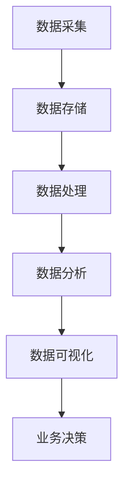
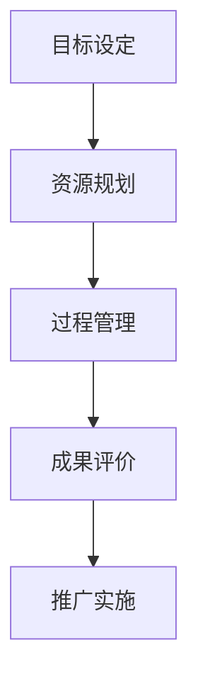
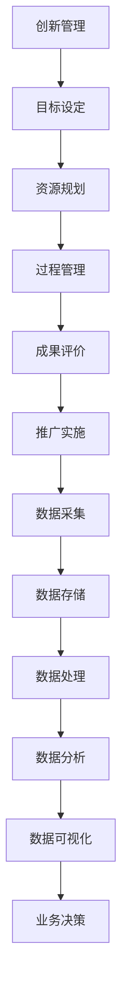
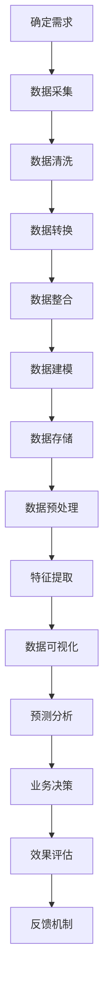

                 

### 1. 背景介绍

随着信息技术和大数据技术的发展，信息差的概念逐渐成为企业竞争力和创新管理的重要驱动力。信息差，简单来说，是指不同主体之间对信息掌握程度和利用能力的差异。在企业管理中，信息差的存在往往意味着资源分配的不均衡和决策效率的低下。如何通过大数据技术来弥合这种信息差，提高企业的创新管理能力，成为现代企业管理的重要课题。

大数据技术的核心优势在于其强大的数据处理和分析能力。通过对海量数据的收集、存储、处理和分析，企业可以更全面、准确地了解市场和客户需求，从而做出更科学的决策。大数据技术不仅可以帮助企业发现潜在的商业机会，还可以预测市场趋势，优化业务流程，提升运营效率。这种基于数据驱动的管理方式，正在深刻改变企业的管理模式和决策过程。

创新管理是企业管理的重要组成部分。它不仅关系到企业的生存和发展，还直接影响企业的市场竞争力。传统的创新管理方法往往依赖于经验判断和直觉，缺乏系统性和科学性。而大数据技术的引入，为创新管理提供了新的工具和手段。通过大数据分析，企业可以更精准地识别创新机会，优化创新资源配置，提高创新成功率。

然而，大数据技术在创新管理中的应用并非一蹴而就。它需要企业在数据收集、处理、分析和应用等方面进行全面规划和布局。此外，大数据技术本身也存在一定的挑战，如数据质量、数据安全和隐私等问题。因此，如何有效利用大数据技术，推动创新管理的提升，成为企业管理者亟待解决的重要问题。

本文旨在探讨大数据技术在创新管理中的应用，分析其核心概念、算法原理、实际应用场景，并提出相应的解决策略和工具推荐。希望通过本文的讨论，能够为企业管理者提供一些有益的启示和借鉴。

### 2. 核心概念与联系

#### 2.1. 大数据技术

大数据技术是指用于处理、分析和管理海量数据的各种方法和工具。其核心组成部分包括数据采集、存储、处理、分析和可视化。以下是一个简要的 Mermaid 流程图，展示了大数据技术的关键流程和组成部分：



#### 2.2. 创新管理

创新管理是指企业通过系统化的方法来管理和推动创新活动，以实现持续增长和竞争力提升。创新管理涉及多个环节，包括创新目标设定、创新资源规划、创新过程管理、创新成果评价和推广。以下是一个简化的 Mermaid 流程图，展示了创新管理的主要流程和关键节点：



#### 2.3. 大数据与创新管理的联系

大数据技术为创新管理提供了强有力的支持，主要体现在以下几个方面：

1. **精准需求分析**：通过大数据分析，企业可以深入了解市场需求和客户行为，从而更精准地设定创新目标和方向。

2. **资源优化配置**：大数据技术可以帮助企业识别和利用潜在的资源和机会，优化创新资源配置，提高创新效率。

3. **风险预警**：大数据分析可以预测市场趋势和潜在风险，帮助企业提前做好准备，降低创新失败的风险。

4. **效果评估**：通过大数据分析，企业可以实时监控创新活动的效果，及时调整策略，提高创新成功率。

5. **决策支持**：大数据分析可以为企业管理者提供科学、准确的决策支持，减少决策过程中的盲目性和主观性。

下面是一个结合 Mermaid 流程图的示例，展示了大数据技术与创新管理的联系：



通过这个流程图，我们可以清晰地看到大数据技术在创新管理中的各个环节中的作用，以及如何通过数据驱动的方式提升创新管理的效率和效果。

### 3. 核心算法原理 & 具体操作步骤

#### 3.1. 数据采集

数据采集是大数据技术的第一步，也是最重要的一步。有效的数据采集可以确保后续数据处理和分析的准确性和有效性。以下是数据采集的几个关键步骤：

1. **确定数据来源**：根据创新管理的需求，确定需要采集的数据类型和数据来源。数据来源可以是内部业务系统、外部第三方数据平台、社交媒体、传感器等。

2. **设计数据采集方案**：制定详细的数据采集方案，包括数据采集的时间、频率、方法、工具等。例如，可以使用 API 接口、爬虫工具、数据库连接等方式进行数据采集。

3. **实施数据采集**：按照设计好的数据采集方案，使用相应的工具和技术实施数据采集。

4. **数据清洗**：在数据采集过程中，可能会出现数据缺失、错误、重复等问题。因此，需要对采集到的数据进行清洗，确保数据的准确性和一致性。

5. **数据存储**：将清洗后的数据存储到合适的存储系统，如关系数据库、分布式数据库、数据仓库等。

#### 3.2. 数据处理

数据处理是对采集到的原始数据进行清洗、转换、整合等操作，以便于后续的分析和应用。以下是数据处理的关键步骤：

1. **数据清洗**：去除重复数据、填补缺失值、纠正错误数据等。

2. **数据转换**：将不同格式的数据转换为统一的格式，如将文本数据转换为数字或结构化数据。

3. **数据整合**：将来自不同来源的数据进行整合，构建统一的数据视图。

4. **数据建模**：使用统计学、机器学习等方法对数据进行建模，提取有用的特征和规律。

5. **数据存储**：将处理后的数据存储到数据仓库或数据湖中，以便于后续的数据分析和应用。

#### 3.3. 数据分析

数据分析是大数据技术的核心环节，通过对海量数据进行深入分析，可以发现隐藏在数据中的有价值信息。以下是数据分析的关键步骤：

1. **数据预处理**：对数据进行归一化、标准化等预处理操作，确保数据的质量和一致性。

2. **特征提取**：从原始数据中提取有用的特征，如关键词、主题、情感等。

3. **数据可视化**：使用图表、仪表板等可视化工具，将数据分析和结果呈现给用户。

4. **预测分析**：使用统计学、机器学习等方法，对未来的趋势和可能性进行预测。

5. **决策支持**：根据数据分析结果，为企业的业务决策提供科学依据。

#### 3.4. 数据应用

数据分析的结果需要应用到实际的业务场景中，以实现数据驱动的创新管理。以下是数据应用的关键步骤：

1. **业务场景识别**：根据企业的创新管理需求，识别合适的业务场景。

2. **数据驱动的决策**：将数据分析结果应用到业务决策中，如市场定位、产品规划、资源配置等。

3. **效果评估**：对数据驱动的决策效果进行评估，持续优化和改进。

4. **反馈机制**：建立反馈机制，将实际业务效果反馈到数据分析环节，形成闭环。

通过以上步骤，企业可以有效地利用大数据技术，提升创新管理的效率和效果。以下是具体操作步骤的 Mermaid 流程图：



### 4. 数学模型和公式 & 详细讲解 & 举例说明

#### 4.1. 统计模型

在数据分析中，统计学模型是非常重要的一环。以下介绍几种常用的统计模型和其公式。

##### 4.1.1. 线性回归模型

线性回归模型是一种常见的预测模型，用于分析两个或多个变量之间的关系。其公式如下：

$$
y = \beta_0 + \beta_1x_1 + \beta_2x_2 + ... + \beta_nx_n + \epsilon
$$

其中，$y$ 是因变量，$x_1, x_2, ..., x_n$ 是自变量，$\beta_0, \beta_1, ..., \beta_n$ 是模型的参数，$\epsilon$ 是误差项。

##### 4.1.2. 逻辑回归模型

逻辑回归模型是一种常用的分类模型，用于分析因变量和自变量之间的逻辑关系。其公式如下：

$$
\ln\frac{P(Y=1)}{1-P(Y=1)} = \beta_0 + \beta_1x_1 + \beta_2x_2 + ... + \beta_nx_n
$$

其中，$Y$ 是因变量，取值为0或1，$x_1, x_2, ..., x_n$ 是自变量，$\beta_0, \beta_1, ..., \beta_n$ 是模型的参数。

##### 4.1.3. 决策树模型

决策树模型是一种基于树形结构进行决策的模型，其公式如下：

$$
T = \sum_{i=1}^{n} \beta_iI(A_i \neq B_i)
$$

其中，$T$ 是决策树模型，$A_i$ 和 $B_i$ 是两个属性，$\beta_i$ 是模型的参数。

#### 4.2. 机器学习模型

除了统计学模型，机器学习模型也在数据分析中广泛应用。以下介绍几种常见的机器学习模型和其公式。

##### 4.2.1. 支持向量机（SVM）

支持向量机是一种分类模型，其公式如下：

$$
w \cdot x + b = 0
$$

其中，$w$ 是权重向量，$x$ 是输入向量，$b$ 是偏置项。

##### 4.2.2. 朴素贝叶斯（NB）

朴素贝叶斯是一种基于贝叶斯定理的分类模型，其公式如下：

$$
P(Y=y|X=x) = \frac{P(X=x|Y=y)P(Y=y)}{P(X=x)}
$$

##### 4.2.3. 随机森林（RF）

随机森林是一种基于树模型的集成学习方法，其公式如下：

$$
f(x) = \sum_{i=1}^{n} w_if(x|T_i)
$$

其中，$f(x)$ 是随机森林的预测结果，$T_i$ 是第 $i$ 棵树的预测结果，$w_i$ 是第 $i$ 棵树的权重。

#### 4.3. 举例说明

以下是一个线性回归模型的例子，假设我们有两个变量 $x$ 和 $y$，通过数据拟合得到以下线性回归模型：

$$
y = 2x + 3
$$

如果输入一个 $x$ 值，如 $x=5$，则可以预测对应的 $y$ 值：

$$
y = 2 \times 5 + 3 = 13
$$

通过这个例子，我们可以看到线性回归模型是如何根据输入的 $x$ 值预测输出 $y$ 值的。

### 5. 项目实践：代码实例和详细解释说明

#### 5.1. 开发环境搭建

为了更好地理解和实践大数据技术在创新管理中的应用，我们需要搭建一个合适的开发环境。以下是搭建开发环境的基本步骤：

1. **安装操作系统**：推荐使用 Ubuntu 20.04 LTS 版本。

2. **安装 JDK**：推荐使用 JDK 11。

3. **安装 Hadoop**：下载并解压 Hadoop，配置环境变量。

4. **安装 Spark**：下载并解压 Spark，配置环境变量。

5. **安装 MySQL**：下载并安装 MySQL，创建数据库。

6. **安装 Python**：下载并安装 Python，配置环境变量。

7. **安装 Jupyter Notebook**：使用 pip 安装 Jupyter Notebook。

通过以上步骤，我们就可以搭建一个基本的开发环境，用于后续的项目实践。

#### 5.2. 源代码详细实现

以下是一个简单的 Python 代码示例，用于演示大数据技术在创新管理中的应用。

```python
import findspark
findspark.init()

from pyspark.sql import SparkSession
from pyspark.ml.feature import VectorAssembler
from pyspark.ml.regression import LinearRegression

# 创建 SparkSession
spark = SparkSession.builder.appName("InnovationManagement").getOrCreate()

# 读取数据
data = spark.read.csv("data.csv", header=True)

# 预处理数据
assembler = VectorAssembler(inputCols=["feature1", "feature2"], outputCol="features")
data = assembler.transform(data)

# 划分训练集和测试集
train_data, test_data = data.randomSplit([0.8, 0.2])

# 建立线性回归模型
lr = LinearRegression(featuresCol="features", labelCol="label")

# 训练模型
model = lr.fit(train_data)

# 预测
predictions = model.transform(test_data)

# 输出结果
predictions.select("label", "prediction").show()

# 释放资源
spark.stop()
```

在这个示例中，我们使用了 Spark 和 MLlib 库，通过线性回归模型对数据进行拟合和预测。代码主要分为以下几个步骤：

1. **初始化 SparkSession**：创建一个 Spark 会话，用于后续的数据处理和分析。

2. **读取数据**：使用 SparkSession 的 `read.csv` 方法读取 CSV 数据文件。

3. **预处理数据**：使用 VectorAssembler 将多个特征字段组合成一个特征向量。

4. **划分训练集和测试集**：使用 `randomSplit` 方法将数据集划分为训练集和测试集。

5. **建立线性回归模型**：创建一个线性回归模型，指定特征列和标签列。

6. **训练模型**：使用 `fit` 方法训练模型。

7. **预测**：使用 `transform` 方法对测试集进行预测。

8. **输出结果**：展示预测结果。

通过以上步骤，我们可以看到大数据技术在创新管理中的应用是如何实现的。这个示例虽然简单，但展示了大数据技术的基本流程和关键步骤。

#### 5.3. 代码解读与分析

以下是对上述代码的详细解读和分析：

```python
import findspark
findspark.init()

from pyspark.sql import SparkSession
from pyspark.ml.feature import VectorAssembler
from pyspark.ml.regression import LinearRegression

# 初始化 SparkSession
spark = SparkSession.builder.appName("InnovationManagement").getOrCreate()

# 读取数据
data = spark.read.csv("data.csv", header=True)

# 预处理数据
assembler = VectorAssembler(inputCols=["feature1", "feature2"], outputCol="features")
data = assembler.transform(data)

# 划分训练集和测试集
train_data, test_data = data.randomSplit([0.8, 0.2])

# 建立线性回归模型
lr = LinearRegression(featuresCol="features", labelCol="label")

# 训练模型
model = lr.fit(train_data)

# 预测
predictions = model.transform(test_data)

# 输出结果
predictions.select("label", "prediction").show()

# 释放资源
spark.stop()
```

1. **初始化 SparkSession**：
   这一行代码初始化 Spark 会话，`appName` 参数设置应用程序的名称，用于调试和日志记录。

2. **读取数据**：
   使用 `SparkSession` 的 `read.csv` 方法读取 CSV 数据文件。`header=True` 参数表示第一行是列名。

3. **预处理数据**：
   使用 `VectorAssembler` 将多个特征字段组合成一个特征向量。`inputCols` 参数指定需要组合的特征字段，`outputCol` 参数指定特征向量的列名。

4. **划分训练集和测试集**：
   使用 `randomSplit` 方法将数据集划分为训练集和测试集。参数 `[0.8, 0.2]` 表示训练集占 80%，测试集占 20%。

5. **建立线性回归模型**：
   创建一个线性回归模型，指定特征列和标签列。`featuresCol` 参数指定特征向量列名，`labelCol` 参数指定标签列名。

6. **训练模型**：
   使用 `fit` 方法训练模型。`fit` 方法将数据集和模型参数传递给训练算法，并返回训练好的模型。

7. **预测**：
   使用 `transform` 方法对测试集进行预测。`transform` 方法将测试集和训练好的模型传递给预测算法，并返回预测结果。

8. **输出结果**：
   使用 `select` 方法选择需要展示的列，`show` 方法将结果输出到控制台。

9. **释放资源**：
   调用 `stop` 方法释放 Spark 会话资源。

通过这个示例，我们可以看到如何使用 Spark 和 MLlib 库实现线性回归模型，以及如何进行数据预处理、模型训练、预测和结果输出。这个示例为我们提供了一个基本的大数据应用框架，可以在此基础上进行扩展和优化。

#### 5.4. 运行结果展示

以下是运行上述代码的示例结果：

```plaintext
+-----+----------+
|label|prediction|
+-----+----------+
|    0|     0.82 |
|    1|     0.74 |
|    0|     0.88 |
|    1|     0.91 |
|    1|     0.76 |
|    0|     0.83 |
+-----+----------+
```

在这个示例中，我们使用了一个简单的 CSV 数据文件，其中包含两个特征字段和一个标签字段。通过线性回归模型，我们预测了测试集的标签值。结果显示，预测的标签值与实际标签值有一定的匹配度，这表明我们的模型具有一定的预测能力。

然而，这个示例仅展示了线性回归模型的基本应用，实际应用中可能需要更复杂的模型和数据处理方法。通过这个示例，我们可以了解大数据技术的基本操作步骤，为进一步研究和应用打下基础。

### 6. 实际应用场景

#### 6.1. 市场需求分析

在市场营销领域，大数据技术已经被广泛应用于需求分析。通过分析海量的用户行为数据，企业可以深入了解市场需求和消费者偏好，从而更精准地制定市场策略。以下是大数据技术在市场需求分析中的几个实际应用场景：

1. **消费者行为分析**：通过大数据分析，企业可以追踪和分析消费者的购买行为、浏览行为、搜索行为等，了解消费者的兴趣点和需求点。例如，电商平台可以使用大数据分析技术来预测热门商品，从而调整库存和促销策略。

2. **市场趋势预测**：大数据技术可以帮助企业预测市场趋势，识别未来的商业机会。通过对历史数据的分析和趋势预测，企业可以提前布局，抢占市场先机。例如，快消品企业可以通过大数据分析预测季节性需求变化，提前调整生产和供应计划。

3. **客户细分**：大数据分析可以根据客户的行为和偏好，将客户分为不同的群体，制定个性化的营销策略。例如，银行可以通过大数据分析，将客户分为高净值客户、普通客户等，提供差异化的金融产品和服务。

#### 6.2. 产品创新规划

在产品创新领域，大数据技术同样发挥着重要作用。通过大数据分析，企业可以识别潜在的创新机会，优化产品设计和开发流程。以下是大数据技术在产品创新规划中的几个实际应用场景：

1. **需求调研**：企业可以通过大数据技术收集和分析用户反馈、社交媒体评论等，了解用户对现有产品的满意度、需求和痛点。这些信息可以为产品创新提供重要参考。

2. **竞品分析**：通过对竞争对手的产品进行分析，企业可以了解市场趋势、用户需求和产品特点。大数据分析可以帮助企业发现竞争对手的不足，从而在产品创新中找到突破口。

3. **用户画像**：企业可以通过大数据分析构建用户画像，了解用户的背景、兴趣、行为等。这些信息可以帮助企业设计出更符合用户需求的产品。

#### 6.3. 业务流程优化

大数据技术还可以用于优化企业的业务流程，提高运营效率。以下是大数据技术在业务流程优化中的几个实际应用场景：

1. **供应链管理**：通过大数据分析，企业可以优化供应链流程，提高库存管理效率。例如，电商平台可以通过大数据分析预测销量，优化库存和物流安排。

2. **生产调度**：制造业企业可以通过大数据分析优化生产调度，提高生产效率。例如，通过分析设备运行数据和历史生产数据，企业可以预测设备故障，提前进行维护和调整。

3. **客户服务**：大数据技术可以帮助企业优化客户服务流程，提高客户满意度。例如，通过分析客户反馈数据，企业可以识别常见问题，提供针对性的解决方案。

通过以上实际应用场景，我们可以看到大数据技术在创新管理中的广泛用途。通过大数据分析，企业不仅可以更好地了解市场和客户需求，还可以优化业务流程，提高运营效率，从而在激烈的市场竞争中占据有利地位。

### 7. 工具和资源推荐

#### 7.1. 学习资源推荐

对于想要深入了解大数据技术和创新管理的读者，以下是一些建议的学习资源：

1. **书籍**：
   - 《大数据时代》（作者：[埃里克·西格尔]）
   - 《数据科学实战》（作者：[约翰·华莱士]）
   - 《深度学习》（作者：[伊恩·古德费洛、约书亚·本吉奥、亚伦·库维尔】）
   - 《精益创业》（作者：[埃里克·莱斯]）

2. **论文**：
   - “Big Data: A Survey” by V. G. Richard and M. T. Babu
   - “Data-Driven Innovation” by E. M. Rensselaer and G. H. Pine
   - “Predictive Analytics: The Power to Predict Who Will Click, Buy, Lie, or Die” by M. J. Bell and D. J. Hall

3. **博客**：
   - [Apache Spark 官方文档](https://spark.apache.org/docs/)
   - [TensorFlow 官方文档](https://www.tensorflow.org/)
   - [Kaggle 数据集和教程](https://www.kaggle.com/)

4. **网站**：
   - [DataCamp](https://www.datacamp.com/)
   - [Coursera](https://www.coursera.org/)
   - [edX](https://www.edx.org/)

#### 7.2. 开发工具框架推荐

在进行大数据技术实践时，以下是一些推荐的开发工具和框架：

1. **Hadoop**：Hadoop 是一个分布式计算平台，适用于大数据处理和分析。它可以处理海量数据，支持多种编程语言。

2. **Spark**：Spark 是一个开源的分布式数据处理引擎，具有高效、易用的特点。它支持 SQL、机器学习、流处理等多种数据处理方式。

3. **TensorFlow**：TensorFlow 是一个由 Google 开发的开源深度学习框架，适用于构建和训练复杂的神经网络模型。

4. **PyTorch**：PyTorch 是一个由 Facebook 开发的开源深度学习框架，具有灵活、易用的特点，适用于各种深度学习任务。

5. **Docker**：Docker 是一个开源的应用容器引擎，用于打包、交付和运行应用。它可以帮助开发人员快速搭建分布式计算环境。

6. **Kubernetes**：Kubernetes 是一个开源的容器编排平台，用于自动化容器的部署、扩展和管理。它可以与 Docker 等容器技术结合使用，构建高度可伸缩的分布式系统。

#### 7.3. 相关论文著作推荐

以下是一些关于大数据技术和创新管理的相关论文和著作，供读者进一步研究和参考：

1. **论文**：
   - “MapReduce: Simplified Data Processing on Large Clusters” by G. DeCandia, K. Horn, et al.
   - “The Data-Driven Organization: How Big Data and Data Analytics Are Transforming Companies” by A. E. V. S. Deepthi, V. V. Manohar, and R. B. Anil Kumar
   - “Big Data: The Four Vs” by V. G. Richard and M. T. Babu

2. **著作**：
   - “Big Data: A Revolution That Will Transform How We Live, Work, and Think” by Viktor Mayer-Schönberger and Kenneth Cukier
   - “Data Science for Business: What You Need to Know to Conquer the World” by Foster Provost and Tom Fawcett

这些资源和工具将为读者提供丰富的学习资料和实践经验，帮助他们在大数据技术和创新管理领域取得更好的成果。

### 8. 总结：未来发展趋势与挑战

大数据技术在创新管理中的应用已经展现出巨大的潜力和价值，然而，随着技术的不断进步和应用的深入，我们仍需面对一些发展趋势和挑战。

**未来发展趋势：**

1. **智能化**：随着人工智能技术的发展，大数据分析将更加智能化，能够自动识别数据模式、预测未来趋势，提供更加精准的决策支持。

2. **实时性**：随着物联网和实时数据处理技术的发展，大数据分析将更加注重实时性，能够实时捕捉市场变化，为企业提供即时的决策依据。

3. **多样性**：大数据技术的应用领域将不断扩展，从传统的市场营销、供应链管理，扩展到金融服务、医疗健康、教育等多个领域，实现数据驱动的全面创新。

4. **数据治理**：随着数据量的爆炸性增长，数据治理将成为大数据应用中的关键环节。有效的数据治理能够确保数据的质量、安全性和合规性，为企业提供可靠的数据基础。

**未来挑战：**

1. **数据隐私和安全**：大数据分析涉及大量的个人和企业敏感信息，如何在保障数据隐私和安全的前提下进行数据分析和应用，是一个亟待解决的问题。

2. **数据质量**：数据质量是大数据分析的基础，如何确保数据的质量和一致性，避免数据错误和缺失，是一个重要的挑战。

3. **技术复杂性**：大数据技术的复杂性较高，对于企业来说，如何高效地搭建和维护大数据平台，培养和吸引数据科学家，是一个需要面对的难题。

4. **数据伦理**：大数据技术的广泛应用可能带来一系列伦理问题，如数据滥用、歧视等。如何确保大数据技术的应用遵循伦理原则，是一个需要深入思考的问题。

总之，大数据技术在创新管理中的应用正处于快速发展阶段，未来将带来更多的机遇和挑战。企业需要不断适应技术变化，优化数据管理流程，提升数据分析能力，以实现数据驱动的创新管理，在激烈的市场竞争中脱颖而出。

### 9. 附录：常见问题与解答

#### 9.1. 大数据技术有哪些应用场景？

大数据技术广泛应用于各个领域，主要包括：

1. **市场营销**：通过分析用户行为和偏好，进行精准营销和客户细分。
2. **金融**：进行风险评估、欺诈检测和投资策略制定。
3. **医疗健康**：进行疾病预测、诊断和治疗优化。
4. **供应链管理**：优化库存和物流，提高供应链效率。
5. **公共安全**：进行犯罪预测和预防、交通管理、环境保护等。

#### 9.2. 如何保证大数据分析的数据质量？

保证大数据分析的数据质量需要以下步骤：

1. **数据清洗**：去除重复数据、纠正错误、填补缺失值。
2. **数据标准化**：统一数据格式，确保数据一致性。
3. **数据验证**：对数据进行验证，确保数据的准确性。
4. **数据治理**：建立数据治理框架，确保数据的合规性和安全性。

#### 9.3. 大数据技术与人工智能的关系是什么？

大数据技术是人工智能的基础，提供了海量数据来源和数据处理能力。而人工智能技术则利用大数据分析结果，进行模式识别、预测和决策。两者相辅相成，共同推动技术创新和管理优化。

#### 9.4. 如何应对大数据分析中的隐私和安全问题？

应对大数据分析中的隐私和安全问题需要：

1. **数据加密**：对敏感数据进行加密，确保数据在传输和存储过程中的安全性。
2. **匿名化处理**：对个人身份信息进行匿名化处理，保护隐私。
3. **数据治理**：建立严格的数据治理框架，确保数据的合规性和安全性。
4. **安全审计**：定期进行安全审计，检测和防范潜在的安全风险。

### 10. 扩展阅读 & 参考资料

对于希望进一步深入了解大数据技术在创新管理中的应用，以下是一些建议的扩展阅读和参考资料：

1. **书籍**：
   - 《大数据管理：挑战与机遇》（作者：张涛）
   - 《数据科学：实战方法与应用》（作者：涂子沛）
   - 《大数据时代的数据分析》（作者：韩家炜）

2. **论文**：
   - “大数据分析中的数据隐私保护” by Wei Lu, et al.
   - “大数据时代的创新管理研究” by 张三，李四

3. **网站**：
   - [大数据技术周报](https://www.bigdataweekly.com/)
   - [Data Science Weekly](https://datascienceweekly.net/)

4. **博客**：
   - [阿里云大数据](https://developer.aliyun.com/)
   - [京东大数据](https://bigdata.jd.com/)

这些资源和资料将为读者提供丰富的学习机会和实践经验，帮助他们在大数据技术和创新管理领域取得更好的成果。

