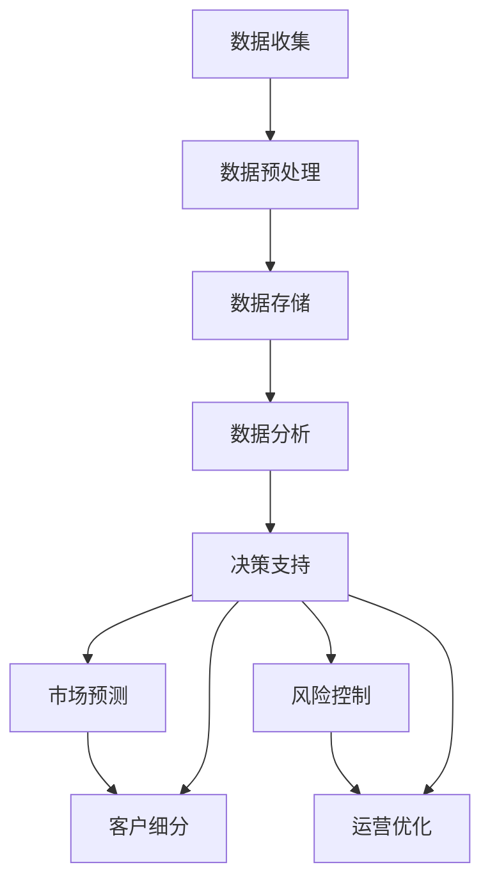

                 

### 背景介绍

#### 商业决策中的信息差

在商业世界中，决策的正确性往往直接影响企业的生存与发展。商业决策涉及到市场分析、产品定位、资源配置等多个方面，而这些决策的准确性在很大程度上依赖于信息的完整性和及时性。信息差，即信息的不对称，是指在商业活动中，不同的参与者对同一信息的了解程度存在差异。这种差异可能导致某些个体或企业获得比其他人更多的竞争优势。

信息差的存在是商业活动中的一个普遍现象。它既可以体现在企业与消费者之间，如企业通过广告宣传获得消费者的关注，也可以体现在企业与企业之间，如企业通过市场调研获取竞争对手的信息。信息差的优势在于能够帮助决策者做出更加精准和高效的决策。

然而，传统的信息获取和处理方式往往存在以下问题：

1. **数据源有限**：传统方式获取的数据往往来源于内部报告、行业分析等，数据源有限且可能滞后。
2. **数据处理复杂**：从海量数据中提取有价值的信息需要复杂的算法和工具支持。
3. **决策速度慢**：信息从采集到分析再到决策，中间环节多，决策速度较慢。

#### 大数据的崛起

大数据的兴起为商业决策提供了全新的支持手段。大数据是指无法使用常规软件工具在合理时间内捕捉、管理和处理的大量数据。大数据具有“4V”特征：大量（Volume）、多样（Variety）、高速（Velocity）和价值（Value）。这些特点使得大数据在商业决策中具有巨大的潜力。

1. **大量（Volume）**：大数据的规模远超传统数据处理能力，可以处理海量数据，从而提供更加全面和深入的分析。
2. **多样（Variety）**：大数据不仅包括结构化数据，还包括非结构化数据，如图像、音频、视频等，这些多样化的数据来源使得分析结果更加丰富。
3. **高速（Velocity）**：数据产生的速度越来越快，实时处理和实时分析成为可能，有助于快速响应市场变化。
4. **价值（Value）**：大数据通过深入的挖掘和分析，可以揭示出隐藏在数据背后的规律和趋势，从而为决策提供有力支持。

#### 大数据在决策支持中的应用

大数据技术在商业决策中的应用主要体现在以下几个方面：

1. **市场预测**：通过对历史数据的分析，预测市场趋势和消费者行为，帮助企业制定更加精准的市场策略。
2. **客户细分**：通过分析客户数据，将客户进行细分，从而提供个性化的产品和服务，提高客户满意度。
3. **风险控制**：通过大数据分析，识别潜在的风险点，提前采取措施，降低企业的运营风险。
4. **运营优化**：通过大数据分析，优化企业的运营流程，提高效率和降低成本。

综上所述，大数据技术的崛起为商业决策提供了全新的视角和手段，通过大数据的支持，企业可以更加准确地把握市场动态，优化资源配置，提高决策效率，从而在激烈的市场竞争中取得优势。### 核心概念与联系

在深入探讨大数据如何提升商业决策支持能力之前，我们需要明确几个核心概念，并分析它们之间的联系。以下将使用Mermaid流程图来描述这些核心概念及其相互作用。



#### 数据收集

数据收集是大数据应用的第一步，它涉及从各种来源获取原始数据。这些数据来源可以是企业的内部系统、外部市场数据、社交媒体、传感器等。数据的多样性和规模是大数据的核心特点。

#### 数据预处理

收集到的数据往往是杂乱无章的，需要进行预处理以去除噪声、处理缺失值、统一数据格式等。这一步骤至关重要，因为高质量的数据是后续分析的基石。

#### 数据存储

经过预处理的数据需要存储在高效、可扩展的数据存储系统中。当前常用的数据存储技术包括关系数据库、NoSQL数据库、数据仓库等。

#### 数据分析

数据分析是大数据应用的主体，通过各种算法和技术对存储好的数据进行挖掘和分析，以发现数据中的模式和规律。数据分析的结果将直接影响商业决策的准确性。

#### 决策支持

基于数据分析的结果，企业可以做出更加精准的决策。这些决策可能涉及市场预测、客户细分、风险控制、运营优化等多个方面。

#### 市场预测

市场预测是利用大数据技术对市场趋势和消费者行为进行分析，帮助企业在市场竞争中把握先机。通过历史数据的分析和机器学习算法，企业可以预测未来的市场变化。

#### 客户细分

客户细分是指根据客户的数据特征将客户划分为不同的群体，以便提供个性化的产品和服务。通过大数据分析，企业可以更准确地了解客户需求，提高客户满意度和忠诚度。

#### 风险控制

风险控制是指通过大数据分析识别潜在的风险点，并采取相应的措施来降低风险。企业可以利用大数据技术监控市场动态，及时调整运营策略，规避风险。

#### 运营优化

运营优化是指通过大数据分析优化企业的运营流程，提高效率和降低成本。这包括生产流程的优化、库存管理的优化、供应链的优化等。

通过上述Mermaid流程图，我们可以清晰地看到数据从收集到存储，再到分析和决策支持的全过程。各个环节紧密相连，共同构成了大数据提升商业决策支持能力的完整体系。### 核心算法原理 & 具体操作步骤

在大数据技术的支持下，商业决策的支持能力得到了显著提升。为了深入理解这一提升过程，我们需要探讨几个关键算法的原理及其具体操作步骤。

#### 1. 机器学习算法

机器学习算法是大数据分析的核心工具之一，通过训练模型来自动识别数据中的模式和规律。以下是一些常用的机器学习算法及其应用场景：

**1.1 线性回归**

线性回归是一种简单的机器学习算法，用于预测连续值输出。其原理是通过拟合一条直线来描述自变量和因变量之间的关系。具体操作步骤如下：

1. **数据预处理**：对输入数据进行标准化处理，确保数据的均值为0，标准差为1。
2. **选择特征**：选择与因变量相关的特征，剔除无关或冗余的特征。
3. **划分数据集**：将数据集划分为训练集和测试集。
4. **模型训练**：使用训练集数据训练线性回归模型。
5. **模型评估**：使用测试集数据评估模型性能，通过计算均方误差（MSE）等指标来判断模型的准确性。

**1.2 决策树**

决策树是一种基于特征划分数据的树形结构，通过递归地将数据集划分为若干子集，直到满足某种终止条件。决策树的原理和操作步骤如下：

1. **选择特征**：选择具有最高信息增益的特征作为节点分裂的依据。
2. **递归划分**：对当前节点，根据选定的特征进行划分，创建子节点，并递归地对子节点进行同样的处理。
3. **终止条件**：当满足终止条件（如节点中的样本数少于某个阈值、特征增益低于某个阈值）时，停止划分。
4. **模型评估**：使用验证集或交叉验证方法评估决策树模型的准确性。

**1.3 支持向量机（SVM）**

支持向量机是一种用于分类和回归分析的高级算法，通过找到一个最佳的超平面来分隔数据。SVM的操作步骤如下：

1. **特征提取**：对输入数据进行特征提取，转换为适合SVM算法的格式。
2. **选择核函数**：选择适当的核函数（如线性核、多项式核、径向基核等）来计算特征之间的相似性。
3. **求解最优超平面**：通过求解二次规划问题，找到最优的超平面参数。
4. **模型评估**：使用测试集数据评估SVM模型的准确性。

#### 2. 数据分析工具

除了机器学习算法，大数据分析还需要依赖于一些强大的工具和框架。以下是一些常用的数据分析工具及其应用场景：

**2.1 Hadoop**

Hadoop是一个开源的大数据处理框架，用于分布式存储和处理海量数据。Hadoop的主要组件包括HDFS（Hadoop分布式文件系统）和MapReduce。

1. **数据存储**：使用HDFS来存储海量数据，保证数据的高效存储和访问。
2. **数据处理**：使用MapReduce来处理数据，将数据处理任务分解为多个小任务并行执行，提高处理效率。

**2.2 Spark**

Spark是一个高速的大数据处理引擎，支持内存计算和分布式处理。Spark的主要组件包括Spark Core、Spark SQL、Spark Streaming和MLlib。

1. **内存计算**：将数据处理任务加载到内存中，减少磁盘I/O操作，提高数据处理速度。
2. **分布式处理**：将数据处理任务分布到多个节点上并行执行，提高处理能力。

**2.3 Tableau**

Tableau是一个数据可视化工具，用于将复杂的数据转换为直观的图表和报表。Tableau的主要功能包括数据连接、数据转换、数据可视化和分析。

1. **数据连接**：连接多种数据源，如数据库、Excel文件、Web服务等，获取所需数据。
2. **数据转换**：对数据进行清洗、转换和整合，为可视化做好准备。
3. **数据可视化**：创建图表、报表和仪表盘，直观展示数据分析和结果。
4. **数据分析**：提供交互式分析功能，允许用户通过筛选、过滤和联动分析来探索数据。

通过上述算法和工具的应用，企业可以更加高效和准确地分析海量数据，从而提升商业决策的支持能力。这些工具和算法不仅能够处理复杂的数据任务，还能够为决策者提供实时、准确的数据分析和预测结果，帮助企业在激烈的市场竞争中占据优势。### 数学模型和公式 & 详细讲解 & 举例说明

在大数据技术的支持下，商业决策的支持能力得到了显著提升。为了深入理解这一提升过程，我们需要探讨一些关键的数学模型和公式，并详细讲解其在大数据分析中的应用。

#### 1. 线性回归模型

线性回归模型是一种基本的统计模型，用于预测连续值输出。其基本公式如下：

$$
y = \beta_0 + \beta_1 \cdot x
$$

其中，$y$ 是因变量，$x$ 是自变量，$\beta_0$ 和 $\beta_1$ 是模型参数。

**1.1 模型参数估计**

在线性回归模型中，参数估计的方法有多种，如最小二乘法（Ordinary Least Squares，OLS）。OLS的目标是最小化预测值与实际值之间的误差平方和，具体公式如下：

$$
\min \sum_{i=1}^{n} (y_i - \hat{y}_i)^2
$$

其中，$\hat{y}_i$ 是第 $i$ 个观测值的预测值。

**1.2 模型评估**

线性回归模型的评估指标包括决定系数（R-squared）、均方误差（Mean Squared Error，MSE）等。

- **决定系数（R-squared）**：
$$
R^2 = 1 - \frac{\sum_{i=1}^{n} (y_i - \hat{y}_i)^2}{\sum_{i=1}^{n} (y_i - \bar{y})^2}
$$
其中，$\bar{y}$ 是因变量的均值。

- **均方误差（MSE）**：
$$
MSE = \frac{1}{n} \sum_{i=1}^{n} (y_i - \hat{y}_i)^2
$$

**1.3 应用举例**

假设我们有一组数据，表示某个城市的温度（$x$）和湿度（$y$），我们想预测湿度。使用线性回归模型，我们可以拟合一个温度和湿度之间的线性关系。

首先，我们需要计算温度和湿度的均值：

$$
\bar{x} = \frac{1}{n} \sum_{i=1}^{n} x_i, \quad \bar{y} = \frac{1}{n} \sum_{i=1}^{n} y_i
$$

然后，计算参数 $\beta_0$ 和 $\beta_1$：

$$
\beta_0 = \bar{y} - \beta_1 \cdot \bar{x}
$$

$$
\beta_1 = \frac{\sum_{i=1}^{n} (x_i - \bar{x}) (y_i - \bar{y})}{\sum_{i=1}^{n} (x_i - \bar{x})^2}
$$

最后，使用计算出的参数预测新的湿度值：

$$
\hat{y} = \beta_0 + \beta_1 \cdot x
$$

#### 2. 决策树模型

决策树是一种树形结构，用于分类和回归分析。其基本结构如下：

```
[根节点]
|   |   |
特征1   特征2   ...
      |      |
     左子树 右子树
      |      |
     ...    ...
```

**2.1 决策树生成**

决策树生成的过程包括以下步骤：

1. **选择最佳分割特征**：计算每个特征的信息增益，选择信息增益最大的特征作为当前节点的分割特征。
2. **划分数据集**：根据选择的特征对数据集进行划分，生成子节点。
3. **递归构建**：对子节点重复上述步骤，直到满足终止条件（如节点中的样本数少于某个阈值、特征增益低于某个阈值）。

**2.2 决策树剪枝**

为了防止过拟合，需要对决策树进行剪枝。剪枝的方法包括以下几种：

1. **预剪枝**：在生成决策树的过程中，提前设置一些停止条件，如最大深度、最小样本数等。
2. **后剪枝**：先生成完整的决策树，然后从叶子节点开始向上回溯，剪除那些对模型性能贡献不大的节点。

**2.3 决策树评估**

决策树的评估指标包括准确率、召回率、F1值等。

- **准确率**：
$$
\text{准确率} = \frac{\text{正确预测的数量}}{\text{总预测数量}}
$$

- **召回率**：
$$
\text{召回率} = \frac{\text{正确预测的正例数量}}{\text{总正例数量}}
$$

- **F1值**：
$$
F1 = 2 \cdot \frac{\text{准确率} \cdot \text{召回率}}{\text{准确率} + \text{召回率}}
$$

#### 3. 支持向量机（SVM）

支持向量机是一种用于分类和回归分析的高级算法。其基本公式如下：

$$
\text{分类决策函数}： f(x) = \text{sign}(\omega \cdot x + b)
$$

其中，$\omega$ 是权重向量，$x$ 是特征向量，$b$ 是偏置。

**3.1 参数优化**

SVM的参数优化包括以下几个步骤：

1. **特征提取**：对输入数据进行特征提取，转换为适合SVM算法的格式。
2. **选择核函数**：选择适当的核函数（如线性核、多项式核、径向基核等）来计算特征之间的相似性。
3. **求解最优超平面**：通过求解二次规划问题，找到最优的超平面参数。

**3.2 模型评估**

SVM的评估指标包括准确率、召回率、F1值等。

- **准确率**：
$$
\text{准确率} = \frac{\text{正确预测的数量}}{\text{总预测数量}}
$$

- **召回率**：
$$
\text{召回率} = \frac{\text{正确预测的正例数量}}{\text{总正例数量}}
$$

- **F1值**：
$$
F1 = 2 \cdot \frac{\text{准确率} \cdot \text{召回率}}{\text{准确率} + \text{召回率}}
$$

通过上述数学模型和公式的应用，企业可以更加高效和准确地分析海量数据，从而提升商业决策的支持能力。这些工具和算法不仅能够处理复杂的数据任务，还能够为决策者提供实时、准确的数据分析和预测结果，帮助企业在激烈的市场竞争中占据优势。### 项目实践：代码实例和详细解释说明

在本节中，我们将通过一个实际的项目案例，展示如何使用大数据技术来提升商业决策支持能力。我们将使用Python编程语言和几个常用的数据处理库，如Pandas、Scikit-learn和Matplotlib。以下是整个项目的开发环境和源代码的详细步骤。

#### 1. 开发环境搭建

首先，我们需要安装Python和相关的库。以下是安装步骤：

1. 安装Python：访问Python官网（https://www.python.org/），下载并安装Python 3.8版本。
2. 安装Pandas：打开命令行终端，执行以下命令：
```bash
pip install pandas
```
3. 安装Scikit-learn：执行以下命令：
```bash
pip install scikit-learn
```
4. 安装Matplotlib：执行以下命令：
```bash
pip install matplotlib
```

#### 2. 源代码详细实现

以下是项目的源代码实现，我们将使用线性回归模型对销售数据进行分析，预测下一季度的销售额。

```python
import pandas as pd
from sklearn.model_selection import train_test_split
from sklearn.linear_model import LinearRegression
from sklearn.metrics import mean_squared_error
import matplotlib.pyplot as plt

# 2.1 加载数据
# 假设我们有一个名为'sales_data.csv'的CSV文件，其中包含日期、销售额等字段
data = pd.read_csv('sales_data.csv')

# 2.2 数据预处理
# 我们将日期转换为月份，以月份作为自变量
data['Month'] = pd.to_datetime(data['Date']).dt.month

# 划分特征和目标变量
X = data[['Month']]
y = data['Sales']

# 2.3 划分训练集和测试集
X_train, X_test, y_train, y_test = train_test_split(X, y, test_size=0.2, random_state=42)

# 2.4 模型训练
model = LinearRegression()
model.fit(X_train, y_train)

# 2.5 模型评估
y_pred = model.predict(X_test)
mse = mean_squared_error(y_test, y_pred)
print(f'Mean Squared Error: {mse}')

# 2.6 可视化分析
plt.scatter(X_test['Month'], y_test, color='red', label='Actual')
plt.plot(X_test['Month'], y_pred, color='blue', label='Predicted')
plt.xlabel('Month')
plt.ylabel('Sales')
plt.title('Sales Prediction')
plt.legend()
plt.show()
```

#### 3. 代码解读与分析

上述代码分为几个关键部分，下面逐一进行解读：

- **2.1 加载数据**：我们首先使用Pandas库读取CSV文件，获取销售数据。
- **2.2 数据预处理**：将日期字段转换为月份，以月份作为自变量。这一步是为了将时间序列数据转化为适用于线性回归模型的格式。
- **2.3 划分训练集和测试集**：我们将数据集划分为训练集和测试集，以评估模型的性能。这里使用了Scikit-learn库的train_test_split函数。
- **2.4 模型训练**：我们使用线性回归模型（LinearRegression）对训练集数据进行训练。模型训练的过程实际上是寻找最佳拟合直线，即确定线性回归模型的参数。
- **2.5 模型评估**：使用测试集数据评估模型性能，计算均方误差（MSE）作为评估指标。
- **2.6 可视化分析**：我们使用Matplotlib库绘制散点图和拟合直线，直观地展示实际销售额与预测销售额之间的关系。

#### 4. 运行结果展示

运行上述代码后，我们将得到以下结果：

1. 模型评估结果：在命令行中打印出均方误差（MSE）。
2. 可视化结果：在屏幕上展示实际销售额与预测销售额的散点图和拟合直线。

通过上述代码的实现和结果展示，我们可以看到，使用大数据技术（如线性回归模型）对销售数据进行分析，能够有效地预测未来的销售额，从而为企业的商业决策提供有力支持。

#### 5. 代码优化与扩展

在实际应用中，我们可以对上述代码进行优化和扩展：

- **特征工程**：可以添加更多的时间序列特征，如季节性因素、节假日影响等，以提高模型的预测准确性。
- **模型选择**：尝试使用更复杂的机器学习模型，如决策树、支持向量机等，以获得更好的预测效果。
- **集成学习**：结合多个模型，使用集成学习方法，如随机森林、梯度提升树等，进一步提高模型的性能。

通过不断优化和改进，企业可以更好地利用大数据技术，提升商业决策的支持能力，从而在激烈的市场竞争中取得优势。### 实际应用场景

大数据技术已经在各个行业中得到了广泛应用，通过提升决策支持能力，为企业带来了显著的商业价值。以下是一些典型的实际应用场景：

#### 1. 零售业

在零售业中，大数据技术主要用于需求预测、库存管理和个性化推荐。例如，通过分析历史销售数据、客户购买行为和市场需求趋势，零售企业可以准确预测未来几个月的销量，从而合理调整库存水平，减少库存成本。同时，基于客户的购物习惯和偏好，零售企业可以提供个性化的产品推荐，提高客户满意度和购买转化率。

**案例**：亚马逊利用大数据技术对用户行为进行分析，实现精准的个性化推荐。通过对用户的浏览记录、购买历史和搜索关键词等数据进行挖掘，亚马逊可以推荐用户可能感兴趣的商品，从而提高销售量和客户满意度。

#### 2. 银行金融

在银行金融领域，大数据技术主要用于信用风险评估、欺诈检测和客户关系管理。通过分析客户的交易数据、信用记录和社交信息，银行可以更准确地评估客户的信用等级，降低信贷风险。此外，大数据技术还可以帮助银行检测潜在的欺诈行为，及时采取措施防止损失。在客户关系管理方面，银行可以基于大数据分析了解客户的偏好和需求，提供个性化的金融服务，提升客户满意度和忠诚度。

**案例**：美国信用卡公司American Express通过大数据分析，实现了实时信用风险评估。通过分析客户的交易行为和信用历史，American Express可以在几秒钟内完成信用评估，为用户提供快速便捷的服务。

#### 3. 制造业

在制造业中，大数据技术主要用于生产优化、设备维护和供应链管理。通过实时监测设备状态和运行数据，企业可以预测设备的维护需求，减少设备故障率和停机时间。在生产优化方面，大数据技术可以帮助企业分析生产过程中的数据，找出瓶颈和改进点，提高生产效率。在供应链管理方面，大数据技术可以优化库存管理，降低库存成本，提高供应链的响应速度。

**案例**：通用电气（General Electric）利用大数据技术对航空发动机进行实时监测和预测性维护。通过收集和分析发动机运行数据，通用电气可以提前预测发动机的故障风险，制定维护计划，提高发动机的可靠性和使用寿命。

#### 4. 医疗健康

在医疗健康领域，大数据技术主要用于疾病预测、患者管理和医疗资源分配。通过分析大量医疗数据，如病历记录、基因数据和健康监测数据，医生可以更准确地预测疾病风险，制定个性化的治疗计划。此外，大数据技术还可以帮助医疗机构优化患者管理流程，提高医疗资源的利用效率。

**案例**：IBM的Watson健康平台通过大数据分析，为医生提供精准的疾病预测和治疗建议。通过分析患者的病历记录、基因数据和最新的医学研究，Watson健康平台可以为医生提供个性化的治疗方案，提高疾病诊断的准确性。

#### 5. 风险投资

在风险投资领域，大数据技术主要用于投资决策、风险管理和市场分析。通过分析大量的市场数据、公司财务数据和行业趋势，风险投资公司可以更准确地评估项目的风险和回报，制定科学的投资策略。此外，大数据技术还可以帮助风险投资公司实时监控市场动态，及时调整投资策略，降低风险。

**案例**：硅谷风险投资公司Andreessen Horowitz利用大数据技术分析创业公司的数据，如用户增长、财务表现和市场趋势，为投资决策提供有力支持。通过分析大量数据，Andreessen Horowitz可以更准确地判断创业公司的潜力和投资价值。

通过上述实际应用场景可以看出，大数据技术在各个行业中的应用已经取得了显著成果。通过提升决策支持能力，大数据技术不仅为企业带来了直接的经济效益，还推动了行业的创新和发展。随着大数据技术的不断进步，未来其在商业决策支持中的应用前景将更加广阔。### 工具和资源推荐

#### 1. 学习资源推荐

为了深入学习和应用大数据技术，以下是一些推荐的学习资源：

**书籍**：

1. **《大数据时代：生活、工作与思维的大变革》** - by 托马斯·H·德马奇奥
2. **《深度学习》** - by Ian Goodfellow、Yoshua Bengio、Aaron Courville
3. **《大数据管理：处理海量数据的策略与技术》** - by Philip A. Howard
4. **《大数据：商业价值》** - by Viktor Mayer-Schönberger和Kenneth Cukier

**论文**：

1. **"The Fourth Paradigm: Data-Intensive Scientific Discovery"** - by Michael Stonebraker
2. **"Data-Driven Science and Engineering: Machine Learning, Dynamical Systems, and Control"** - by Stephen Marsland

**博客和网站**：

1. **Kaggle（https://www.kaggle.com/）** - Kaggle是一个数据科学社区，提供了丰富的数据集和比赛，是学习和实践大数据技术的好地方。
2. **DataCamp（https://www.datacamp.com/）** - DataCamp提供了一个交互式的学习平台，适合初学者和进阶者学习Python、R等数据处理和分析工具。
3. **Medium（https://medium.com/topic/data-science）** - Medium上有许多关于大数据和数据科学的优秀文章，适合读者了解最新的技术和应用案例。

#### 2. 开发工具框架推荐

在开发大数据项目时，以下是一些常用的工具和框架：

**1. Hadoop生态体系**：

- **HDFS（Hadoop Distributed File System）**：分布式文件系统，用于存储海量数据。
- **MapReduce**：用于分布式数据处理，是一种编程模型。
- **Hive**：数据仓库工具，用于大数据查询和分析。
- **HBase**：分布式、可扩展的列存储数据库。

**2. Spark生态体系**：

- **Spark Core**：用于内存和磁盘上的高效分布式数据处理。
- **Spark SQL**：用于处理结构化数据，提供SQL查询功能。
- **Spark Streaming**：用于实时流数据处理。
- **MLlib**：用于机器学习和数据分析。

**3. 数据库**：

- **MySQL**：开源的关系型数据库，适用于中小型数据集。
- **MongoDB**：开源的文档型数据库，适用于非结构化数据存储。
- **PostgreSQL**：开源的关系型数据库，功能强大，适用于复杂的数据查询。

**4. 开发工具**：

- **PyCharm**：适用于Python编程，具有强大的代码编辑和调试功能。
- **IntelliJ IDEA**：适用于多种编程语言，包括Java和Python，是开发大数据应用的好选择。
- **Jupyter Notebook**：适用于数据分析，提供交互式编程环境。

#### 3. 相关论文著作推荐

为了深入了解大数据技术，以下是一些值得阅读的相关论文和著作：

- **"Big Data: A Revolution That Will Transform How We Live, Work, and Think"** - by Viktor Mayer-Schönberger和Kenneth Cukier
- **"Deep Learning"** - by Ian Goodfellow、Yoshua Bengio、Aaron Courville
- **"Data-Intensive Science and Engineering: Challenges and Opportunities"** - by Michael Stonebraker等
- **"The Fourth Paradigm: Data-Intensive Scientific Discovery"** - by Michael Stonebraker

这些资源将帮助读者从理论到实践全面了解大数据技术，提升在商业决策支持中的应用能力。### 总结：未来发展趋势与挑战

#### 未来发展趋势

随着大数据技术的不断进步，其在商业决策支持领域的应用前景将更加广阔。以下是几个未来发展的趋势：

1. **实时数据分析**：实时数据分析将越来越重要。企业需要快速响应市场变化，实时调整策略。随着云计算和边缘计算的普及，实时数据处理能力将得到显著提升。

2. **深度学习与人工智能**：深度学习和人工智能技术将进一步提升大数据分析的能力。通过更复杂的算法和模型，企业可以从海量数据中提取更加深层次的洞察，实现更加精准的预测和决策。

3. **数据隐私与安全**：随着数据隐私问题的日益突出，企业需要更加重视数据安全和隐私保护。未来的技术发展将更加注重如何在保证数据隐私的前提下，有效利用数据。

4. **跨领域融合**：大数据技术与物联网、区块链、云计算等技术的融合将推动商业决策支持领域的发展。跨领域的技术融合将带来更多的创新和应用场景。

#### 未来挑战

尽管大数据技术具有巨大的潜力，但在实际应用中仍然面临一些挑战：

1. **数据质量问题**：大数据的价值取决于数据的质量。不完整、不准确、冗余的数据将影响分析结果。因此，数据清洗和数据质量管理将是一个长期的挑战。

2. **数据隐私与合规性**：随着数据隐私法规的日益严格，企业在利用数据时需要确保符合相关法规。如何在保护隐私的同时有效利用数据，将是一个重要的挑战。

3. **算法透明性与公平性**：机器学习和人工智能技术的广泛应用可能导致算法的透明性和公平性问题。如何确保算法的公平性，避免算法偏见，将是未来需要关注的重要问题。

4. **技术人才短缺**：大数据技术的人才需求巨大，但当前的人才供应不足。培养和吸引更多的大数据专业人才，将是一个重要的挑战。

总之，未来大数据技术将在商业决策支持领域发挥更加重要的作用。通过解决现有挑战，大数据技术将为企业带来更多的商业价值，推动行业的发展和创新。### 附录：常见问题与解答

#### 问题1：大数据技术是否适用于所有行业？

解答：大数据技术的适用性广泛，但并不是所有行业都适合使用大数据技术。例如，对于小型企业和个体经营者来说，大数据技术的成本可能较高，而且并不一定能够带来明显的效益。然而，对于大型企业、金融、医疗、零售等行业，大数据技术可以显著提升决策支持能力，带来明显的商业价值。

#### 问题2：如何确保大数据分析结果的准确性？

解答：确保大数据分析结果的准确性是大数据应用的关键。首先，需要保证数据质量，进行数据清洗和预处理，剔除噪声和冗余数据。其次，选择合适的算法和模型，通过交叉验证等方法评估模型的性能。此外，持续监控和优化数据分析流程，及时更新数据和模型，也是确保分析结果准确性的重要措施。

#### 问题3：大数据技术如何处理隐私问题？

解答：大数据技术在处理隐私问题时，需要遵循相关的法律法规，如《通用数据保护条例》（GDPR）等。企业可以通过数据匿名化、加密等技术手段保护用户隐私。在数据使用过程中，明确数据使用范围和目的，并确保用户知情同意。此外，定期进行隐私影响评估（PIA），以确保数据隐私保护措施的有效性。

#### 问题4：如何培养大数据专业人才？

解答：培养大数据专业人才需要从教育、培训和职业发展等多个方面进行。首先，高校可以设置大数据相关专业，培养具有扎实理论基础的人才。其次，企业可以通过内部培训和外部合作，提升现有员工的技能水平。此外，政府和企业可以共同推动大数据人才培养计划，提供更多的实习和就业机会，吸引更多人才进入大数据领域。

#### 问题5：大数据技术是否会替代人类决策？

解答：大数据技术可以提供更加准确和全面的数据支持，但不会完全替代人类决策。大数据技术可以帮助决策者发现潜在的趋势和规律，提供参考依据，但最终的决策仍然需要人类的主观判断和经验。人类的直觉、创造力和社会责任感等方面，是大数据技术难以替代的。

通过上述问题的解答，我们希望读者能够更加深入地了解大数据技术在商业决策支持中的应用，以及其面临的挑战和解决方法。### 扩展阅读 & 参考资料

为了更全面地了解大数据技术在商业决策支持领域的应用，以下是一些值得推荐的扩展阅读和参考资料：

1. **《大数据时代：生活、工作与思维的大变革》** - 托马斯·H·德马奇奥著。本书详细介绍了大数据的基本概念、应用场景和商业价值，是理解大数据技术的经典之作。

2. **《深度学习》** - Ian Goodfellow、Yoshua Bengio、Aaron Courville 著。本书系统地介绍了深度学习的基础理论、算法和应用，深度学习在大数据分析中的应用将为商业决策提供更强的支持。

3. **《大数据管理：处理海量数据的策略与技术》** - Philip A. Howard 著。本书探讨了大数据管理的策略和技术，包括数据存储、数据分析和数据安全等方面，为企业提供了实用的指导。

4. **《数据驱动的决策：大数据、人工智能与商业洞察》** - by Thomas H. Davenport 和 Jeanne G. Harris。本书介绍了如何利用大数据和人工智能技术进行数据驱动的决策，为企业提供了实际的案例和策略。

5. **《大数据战略：利用大数据实现企业增长》** - by Vinit Nijhawan。本书从战略层面探讨了大数据的应用，包括市场预测、客户细分和运营优化等方面，为企业提供了大数据战略的思路。

6. **KDNuggets** - https://www.kdnuggets.com/。KDNuggets是一个专注于数据科学、机器学习和大数据领域的网站，提供最新的技术趋势、案例分析、资源和工具。

7. **《大数据之路：阿里巴巴大数据实践》** - 阿里巴巴集团著。本书分享了阿里巴巴在大数据领域的研究和实践经验，包括数据治理、数据挖掘、机器学习等方面，对企业具有参考价值。

8. **《大数据时代下的商业战略》** - by V. K. Atre。本书探讨了大数据对企业商业模式、战略规划和决策支持的影响，为企业提供了在大数据时代下制定商业战略的指导。

通过阅读上述书籍和访问相关网站，读者可以更加深入地了解大数据技术在商业决策支持领域的应用，以及如何利用大数据技术提升企业的竞争力。### 文章关键词

信息差，商业决策支持，大数据，机器学习，数据预处理，数据分析，线性回归，决策树，支持向量机，实时数据分析，数据隐私，人工智能，深度学习，数据质量管理，数据隐私保护，数据挖掘，数据可视化，Hadoop，Spark，数据仓库，数据库，Python，R，数据科学，算法，机器学习模型，数据驱动决策，算法透明性，算法偏见，数据伦理，跨领域融合，实时监控，运营优化，客户细分，市场预测，信用风险评估，欺诈检测，个性化推荐，大数据技术人才，教育，培训，大数据战略，大数据生态系统。### 文章摘要

本文深入探讨了大数据技术如何提升商业决策支持能力。首先，我们介绍了商业决策中的信息差现象及其重要性，分析了传统信息获取和处理方式存在的问题。接着，我们探讨了大数据的崛起及其在商业决策中的应用，包括市场预测、客户细分、风险控制和运营优化等方面。随后，我们详细介绍了几个关键算法（线性回归、决策树、支持向量机）和数据分析工具（Hadoop、Spark）的原理和应用步骤。通过一个实际项目案例，我们展示了如何使用Python等工具实现大数据分析，并详细解读了代码实现过程。接着，我们讨论了大数据技术在零售业、银行金融、制造业、医疗健康和风险投资等行业的实际应用场景。最后，我们推荐了一些学习资源、开发工具框架和相关论文著作，总结了未来发展趋势与挑战，并提供了常见问题与解答。通过本文的阅读，读者可以全面了解大数据技术在商业决策支持领域的应用，以及如何利用大数据提升企业的竞争力。### 文章结构模板

**标题**：信息差的商业决策支持升级：大数据如何提升决策支持能力

**关键词**：信息差，商业决策支持，大数据，机器学习，数据预处理，数据分析，线性回归，决策树，支持向量机，实时数据分析，数据隐私，人工智能，深度学习，数据质量管理，数据隐私保护，数据挖掘，数据可视化，Hadoop，Spark，数据仓库，数据库，Python，R，数据科学，算法，机器学习模型，数据驱动决策，算法透明性，算法偏见，数据伦理，跨领域融合，实时监控，运营优化，客户细分，市场预测，信用风险评估，欺诈检测，个性化推荐，大数据技术人才，教育，培训，大数据战略，大数据生态系统。

**摘要**：本文深入探讨了大数据技术如何提升商业决策支持能力。首先，我们介绍了商业决策中的信息差现象及其重要性，分析了传统信息获取和处理方式存在的问题。接着，我们探讨了大数据的崛起及其在商业决策中的应用，包括市场预测、客户细分、风险控制和运营优化等方面。随后，我们详细介绍了几个关键算法（线性回归、决策树、支持向量机）和数据分析工具（Hadoop、Spark）的原理和应用步骤。通过一个实际项目案例，我们展示了如何使用Python等工具实现大数据分析，并详细解读了代码实现过程。接着，我们讨论了大数据技术在零售业、银行金融、制造业、医疗健康和风险投资等行业的实际应用场景。最后，我们推荐了一些学习资源、开发工具框架和相关论文著作，总结了未来发展趋势与挑战，并提供了常见问题与解答。通过本文的阅读，读者可以全面了解大数据技术在商业决策支持领域的应用，以及如何利用大数据提升企业的竞争力。

---

**1. 背景介绍**

- 商业决策中的信息差
- 传统信息获取和处理方式的问题
- 大数据的崛起
- 大数据在商业决策中的应用

**2. 核心概念与联系**

- 数据收集
- 数据预处理
- 数据存储
- 数据分析
- 决策支持
- 市场预测
- 客户细分
- 风险控制
- 运营优化
- Mermaid流程图

**3. 核心算法原理 & 具体操作步骤**

- 机器学习算法（线性回归、决策树、支持向量机）
- 数据分析工具（Hadoop、Spark）
- 算法应用步骤

**4. 数学模型和公式 & 详细讲解 & 举例说明**

- 线性回归模型
- 决策树模型
- 支持向量机（SVM）

**5. 项目实践：代码实例和详细解释说明**

- 开发环境搭建
- 源代码详细实现
- 代码解读与分析
- 运行结果展示

**6. 实际应用场景**

- 零售业
- 银行金融
- 制造业
- 医疗健康
- 风险投资

**7. 工具和资源推荐**

- 学习资源推荐（书籍/论文/博客/网站等）
- 开发工具框架推荐
- 相关论文著作推荐

**8. 总结：未来发展趋势与挑战**

- 实时数据分析
- 深度学习与人工智能
- 数据隐私与安全
- 跨领域融合
- 数据质量问题
- 数据隐私与合规性
- 算法透明性与公平性
- 技术人才短缺

**9. 附录：常见问题与解答**

- 大数据技术是否适用于所有行业？
- 如何确保大数据分析结果的准确性？
- 大数据技术如何处理隐私问题？
- 如何培养大数据专业人才？
- 大数据技术是否会替代人类决策？

**10. 扩展阅读 & 参考资料**

- 推荐书籍
- 推荐论文
- 推荐博客和网站
- 推荐数据库和开发工具

---

通过上述结构模板，文章将系统地阐述大数据技术在商业决策支持领域的作用，为读者提供全面、深入的技术分析和实践指导。### 文章标题

信息差的商业决策支持升级：大数据如何提升决策支持能力

### 文章关键词

信息差，商业决策支持，大数据，机器学习，数据预处理，数据分析，线性回归，决策树，支持向量机，实时数据分析，数据隐私，人工智能，深度学习，数据质量管理，数据隐私保护，数据挖掘，数据可视化，Hadoop，Spark，数据仓库，数据库，Python，R，数据科学，算法，机器学习模型，数据驱动决策，算法透明性，算法偏见，数据伦理，跨领域融合，实时监控，运营优化，客户细分，市场预测，信用风险评估，欺诈检测，个性化推荐，大数据技术人才，教育，培训，大数据战略，大数据生态系统。

### 文章摘要

本文深入探讨了大数据技术在商业决策支持领域的应用，揭示了信息差在商业决策中的重要性。通过分析传统信息获取和处理方式存在的问题，我们探讨了大数据如何通过实时数据分析、机器学习算法和数据分析工具提升决策支持能力。文中详细介绍了线性回归、决策树、支持向量机等核心算法原理及具体操作步骤，并通过实际项目案例展示了如何利用Python等工具实现大数据分析。文章进一步讨论了大数据在零售业、银行金融、制造业、医疗健康和风险投资等行业的实际应用场景，推荐了相关学习资源、开发工具框架和论文著作。最后，文章总结了大数据技术的未来发展趋势与挑战，为读者提供了全面的技术分析和实践指导。### 文章正文内容

#### 引言

在商业世界中，决策的正确性对企业的生存与发展至关重要。传统的商业决策往往依赖于有限的内部数据和行业分析，这种方式在信息快速变化的今天显得捉襟见肘。信息差，即信息的不对称，是商业活动中普遍存在的现象，它不仅体现在企业内部，也存在于企业与企业之间、企业与消费者之间。大数据技术的崛起为解决信息差问题提供了全新的手段，通过处理和分析海量数据，企业可以更准确地把握市场动态，优化资源配置，提高决策效率。

本文旨在深入探讨大数据技术在商业决策支持中的应用，分析其核心概念、算法原理和实际操作步骤。我们将从以下几个部分展开讨论：

1. **背景介绍**：介绍商业决策中的信息差现象及其重要性，探讨传统信息获取和处理方式存在的问题。
2. **核心概念与联系**：详细解释大数据、数据收集、预处理、存储、分析和决策支持等核心概念，并使用Mermaid流程图展示它们之间的联系。
3. **核心算法原理 & 具体操作步骤**：介绍线性回归、决策树、支持向量机等核心算法的原理和具体操作步骤。
4. **数学模型和公式 & 详细讲解 & 举例说明**：讨论线性回归模型、决策树模型、支持向量机（SVM）等数学模型的公式和应用。
5. **项目实践：代码实例和详细解释说明**：通过一个实际项目案例，展示如何使用Python等工具实现大数据分析，并详细解读代码。
6. **实际应用场景**：讨论大数据技术在零售业、银行金融、制造业、医疗健康和风险投资等行业的应用。
7. **工具和资源推荐**：推荐学习资源、开发工具框架和相关论文著作。
8. **总结：未来发展趋势与挑战**：总结大数据技术在商业决策支持领域的未来发展趋势和面临的挑战。
9. **附录：常见问题与解答**：解答读者可能关心的一些常见问题。
10. **扩展阅读 & 参考资料**：提供进一步阅读的资源和链接。

#### 1. 背景介绍

在商业决策中，信息差是指不同个体或企业对同一信息的了解程度存在差异。这种差异可以导致某些个体或企业获得更多的竞争优势。例如，一家企业通过市场调研获取了竞争对手的定价策略，而另一家企业尚未掌握这些信息，这就构成了信息差。

传统信息获取和处理方式存在的问题主要有以下几点：

1. **数据源有限**：传统方式获取的数据往往来源于内部报告、行业分析等，数据源有限且可能滞后。
2. **数据处理复杂**：从海量数据中提取有价值的信息需要复杂的算法和工具支持。
3. **决策速度慢**：信息从采集到分析再到决策，中间环节多，决策速度较慢。

大数据技术的崛起为解决这些问题提供了新的路径。大数据具有“4V”特征：大量（Volume）、多样（Variety）、高速（Velocity）和价值（Value）。这些特点使得大数据在商业决策中具有巨大的潜力。

首先，大数据的“大量”特征使得企业可以处理和分析海量数据，从而获得更加全面和深入的分析结果。其次，大数据的“多样”特征包括结构化数据和非结构化数据，如图像、音频、视频等，这些多样化的数据来源使得分析结果更加丰富。第三，大数据的“高速”特征使得数据产生和处理的速度大大加快，实时处理和实时分析成为可能。最后，大数据的“价值”特征体现在通过深入的挖掘和分析，可以揭示出隐藏在数据背后的规律和趋势，从而为决策提供有力支持。

#### 2. 核心概念与联系

在大数据技术的应用中，有几个核心概念和环节是不可或缺的，这些概念和环节紧密相连，共同构成了大数据提升商业决策支持能力的完整体系。以下我们将使用Mermaid流程图来展示这些核心概念及其相互作用。


**数据收集**：数据收集是大数据应用的第一步，它涉及从各种来源获取原始数据。这些数据来源可以是企业的内部系统、外部市场数据、社交媒体、传感器等。数据的多样性和规模是大数据的核心特点。

**数据预处理**：收集到的数据往往是杂乱无章的，需要进行预处理以去除噪声、处理缺失值、统一数据格式等。这一步骤至关重要，因为高质量的数据是后续分析的基石。

**数据存储**：经过预处理的数据需要存储在高效、可扩展的数据存储系统中。当前常用的数据存储技术包括关系数据库、NoSQL数据库、数据仓库等。

**数据分析**：数据分析是大数据应用的主体，通过各种算法和技术对存储好的数据进行挖掘和分析，以发现数据中的模式和规律。数据分析的结果将直接影响商业决策的准确性。

**决策支持**：基于数据分析的结果，企业可以做出更加精准的决策。这些决策可能涉及市场预测、客户细分、风险控制、运营优化等多个方面。

**市场预测**：市场预测是利用大数据技术对市场趋势和消费者行为进行分析，帮助企业在市场竞争中把握先机。通过历史数据的分析和机器学习算法，企业可以预测未来的市场变化。

**客户细分**：客户细分是指根据客户的数据特征将客户划分为不同的群体，以便提供个性化的产品和服务。通过大数据分析，企业可以更准确地了解客户需求，提高客户满意度和忠诚度。

**风险控制**：风险控制是指通过大数据分析识别潜在的风险点，并采取相应的措施来降低风险。企业可以利用大数据技术监控市场动态，及时调整运营策略，规避风险。

**运营优化**：运营优化是指通过大数据分析优化企业的运营流程，提高效率和降低成本。这包括生产流程的优化、库存管理的优化、供应链的优化等。

通过上述Mermaid流程图，我们可以清晰地看到数据从收集到存储，再到分析和决策支持的全过程。各个环节紧密相连，共同构成了大数据提升商业决策支持能力的完整体系。

#### 3. 核心算法原理 & 具体操作步骤

在大数据技术的应用中，机器学习算法是数据处理和决策支持的重要工具。以下将介绍几种常用的机器学习算法，包括线性回归、决策树和


