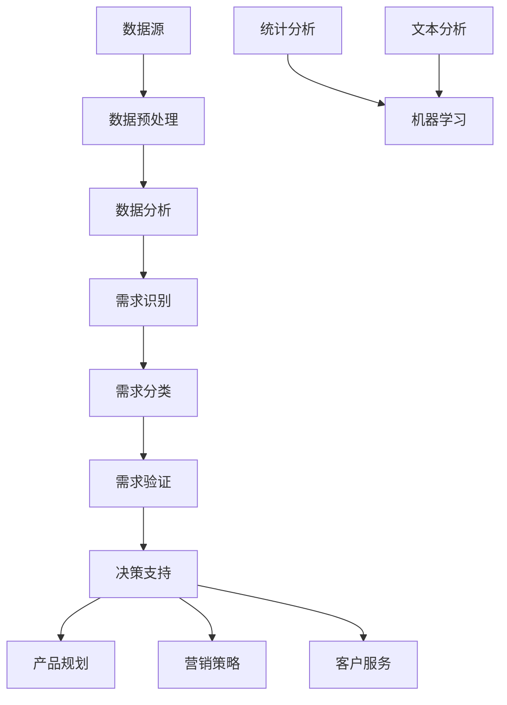

                 

### 文章标题

信息差的商业客户需求洞察：大数据如何发现客户需求

> 关键词：信息差、商业洞察、客户需求、大数据分析、数据挖掘、客户体验、业务增长

> 摘要：本文将深入探讨信息差在商业中的重要性，以及如何通过大数据分析技术来洞察客户需求。文章将从背景介绍、核心概念与联系、核心算法原理与操作步骤、数学模型与公式、项目实践、实际应用场景、工具和资源推荐等多个角度，全面揭示大数据如何助力企业发现和满足客户需求，从而实现业务的增长和优化。

---

### 1. 背景介绍

在当今这个信息爆炸的时代，企业面临的一个巨大挑战是如何在庞大的数据海洋中挖掘出有价值的信息，特别是那些能够直接转化为商业机会的客户需求。信息差的商业环境意味着，企业如果能比竞争对手更早、更准确地了解和满足客户需求，就能在市场中占据领先地位。然而，客户需求是动态变化的，而且隐藏在大量的数据中，如何有效地提取和分析这些需求，成为企业成功的关键。

大数据技术的发展为解决这一问题提供了强有力的工具。通过大数据分析，企业可以从海量的数据中提取出潜在的模式和趋势，从而洞察客户需求。这不仅能够帮助企业预测市场变化，还能为企业的战略决策提供数据支持。

信息差的商业客户需求洞察，主要涉及以下几个方面的内容：

1. **数据收集**：从各种渠道收集客户数据，包括购买历史、浏览行为、社交媒体活动等。
2. **数据预处理**：对收集到的数据进行清洗、整合和标准化，以便后续分析。
3. **数据分析**：运用统计分析、机器学习等方法，对预处理后的数据进行分析，提取有价值的信息。
4. **需求洞察**：根据分析结果，识别客户需求，并对其进行分类和优先级排序。
5. **决策支持**：利用洞察结果，为企业制定产品和营销策略提供依据。

### 2. 核心概念与联系

为了更好地理解大数据如何发现客户需求，我们需要首先明确一些核心概念，并展示它们之间的联系。

#### 2.1 数据源

数据源是大数据分析的基础。不同的数据源可以为分析提供不同的视角和信息。以下是几种常见的数据源：

1. **结构化数据**：来自数据库、事务系统等，如客户购买记录、订单信息等。
2. **半结构化数据**：如日志文件、XML数据等。
3. **非结构化数据**：如社交媒体帖子、电子邮件、视频等。

#### 2.2 数据预处理

数据预处理是数据分析的重要步骤，包括数据清洗、整合和标准化等。清洗数据是为了去除错误、异常和重复的数据；整合数据是将来自不同来源的数据合并为一个统一的视图；标准化数据是为了确保数据在不同分析阶段的一致性和可比性。

#### 2.3 数据分析方法

大数据分析通常包括以下几种方法：

1. **统计分析**：通过对数据的统计描述、假设检验等方法，识别数据中的规律和趋势。
2. **机器学习**：利用算法自动从数据中学习规律和模式，如分类、聚类、回归等。
3. **文本分析**：对非结构化文本数据进行处理，提取关键词、主题和情感等。

#### 2.4 需求洞察

需求洞察是通过数据分析结果来识别和理解客户需求的过程。这通常包括以下步骤：

1. **需求识别**：从数据中提取与客户需求相关的信息。
2. **需求分类**：根据需求的重要性和紧急程度，对需求进行分类和排序。
3. **需求验证**：通过用户调研、反馈等方式，验证需求的准确性和可行性。

#### 2.5 决策支持

需求洞察的结果可以为企业的战略决策提供支持，包括：

1. **产品规划**：根据客户需求，制定新产品或改进现有产品的计划。
2. **营销策略**：根据客户需求，制定更加精准的营销活动。
3. **客户服务**：根据客户需求，优化客户体验和满意度。

### 2.1 Mermaid 流程图

下面是大数据发现客户需求的核心概念与联系流程图：



### 3. 核心算法原理 & 具体操作步骤

#### 3.1 数据预处理

数据预处理是大数据分析的重要环节，以下是具体操作步骤：

1. **数据清洗**：去除重复、错误和异常数据。
    - **去重**：使用唯一标识符（如客户ID）来识别和删除重复记录。
    - **修正错误**：通过逻辑检查或人工审核，修正数据中的错误。
    - **处理缺失值**：使用填充、删除或插值等方法处理缺失值。

2. **数据整合**：将来自不同来源的数据合并为一个统一的数据集。
    - **ETL（提取、转换、加载）**：使用ETL工具将数据从源系统提取出来，进行必要的转换，然后加载到目标数据仓库。

3. **数据标准化**：确保数据在不同分析阶段的一致性和可比性。
    - **数值标准化**：通过归一化、标准化等方法，将不同量纲的数据转换为相同量纲。
    - **分类数据编码**：将分类数据转换为数值形式，如使用独热编码（One-Hot Encoding）。

#### 3.2 数据分析

数据分析是提取客户需求的关键步骤，以下是具体方法：

1. **统计分析**：
    - **描述性统计**：计算数据的均值、中位数、标准差等基本统计量。
    - **假设检验**：使用t检验、方差分析等统计方法，验证数据中的假设。

2. **机器学习**：
    - **分类**：使用算法（如决策树、支持向量机等）将数据分为不同的类别。
    - **聚类**：将相似的数据分组到一起，如使用K-均值聚类算法。
    - **回归**：建立数据之间的关系模型，如线性回归、逻辑回归等。

3. **文本分析**：
    - **关键词提取**：使用算法（如TF-IDF、Word2Vec等）提取文本中的关键词。
    - **主题建模**：使用算法（如LDA、NMF等）发现文本中的主题。
    - **情感分析**：分析文本中的情感倾向，如正面、负面或中立。

#### 3.3 需求洞察

需求洞察是通过数据分析结果来识别和理解客户需求的过程，具体步骤如下：

1. **数据探索**：通过可视化工具（如图表、散点图等）探索数据中的规律和趋势。

2. **模式识别**：从数据中发现潜在的规律和模式。

3. **需求识别**：从模式识别结果中提取与客户需求相关的信息。

4. **需求分类**：根据需求的重要性和紧急程度，对需求进行分类和排序。

5. **需求验证**：通过用户调研、反馈等方式，验证需求的准确性和可行性。

#### 3.4 决策支持

需求洞察的结果可以为企业的战略决策提供支持，具体步骤如下：

1. **需求分析**：根据需求洞察结果，分析需求的市场潜力、竞争态势等。

2. **决策制定**：基于需求分析结果，制定相应的产品规划、营销策略等。

3. **执行与监控**：执行决策，并根据监控数据调整策略。

### 4. 数学模型和公式 & 详细讲解 & 举例说明

#### 4.1 数学模型

大数据分析中常用的数学模型包括统计分析模型、机器学习模型和文本分析模型。以下是这些模型的简要介绍和具体公式。

##### 4.1.1 统计分析模型

1. **均值（Mean）**：数据的平均值。

   \[ \mu = \frac{1}{n} \sum_{i=1}^{n} x_i \]

   其中，\( n \) 是数据点的数量，\( x_i \) 是第 \( i \) 个数据点。

2. **中位数（Median）**：数据的中间值。

   \[ \text{Median} = \begin{cases} 
   \frac{x_{\lceil n/2 \rceil} + x_{\lfloor n/2 \rfloor}}{2} & \text{if } n \text{ is odd} \\
   \frac{\max(x_{\lceil n/2 \rceil}, x_{\lfloor n/2 \rfloor}) + \min(x_{\lceil n/2 \rceil}, x_{\lfloor n/2 \rfloor})}{2} & \text{if } n \text{ is even} 
   \end{cases} \]

3. **标准差（Standard Deviation）**：数据离散程度的度量。

   \[ \sigma = \sqrt{\frac{1}{n-1} \sum_{i=1}^{n} (x_i - \mu)^2} \]

##### 4.1.2 机器学习模型

1. **决策树（Decision Tree）**：通过一系列的决策规则将数据划分为不同的类别。

   \[ \text{Decision Tree} = \{ 
   \text{Node}, 
   \text{Leaf}, 
   \text{Edge}, 
   \text{Rule} 
   \} \]

   其中，\(\text{Node}\) 表示树的节点，\(\text{Leaf}\) 表示叶节点，\(\text{Edge}\) 表示边，\(\text{Rule}\) 表示决策规则。

2. **支持向量机（Support Vector Machine, SVM）**：通过找到最佳分隔超平面来分类数据。

   \[ \text{w}^T \text{x} + b = 0 \]

   其中，\(\text{w}\) 是分隔超平面的法向量，\(\text{x}\) 是数据点，\(b\) 是偏置。

##### 4.1.3 文本分析模型

1. **TF-IDF（Term Frequency-Inverse Document Frequency）**：用于衡量词语在文档中的重要程度。

   \[ \text{TF-IDF} = \text{TF} \times \text{IDF} \]

   其中，\(\text{TF}\) 是词语在文档中的频率，\(\text{IDF}\) 是词语在整个文档集合中的逆文档频率。

#### 4.2 举例说明

##### 4.2.1 均值和中位数

假设我们有以下一组数据：\[1, 2, 3, 4, 5, 6, 7, 8, 9, 10\]

1. **均值**：

   \[ \mu = \frac{1}{10} (1 + 2 + 3 + 4 + 5 + 6 + 7 + 8 + 9 + 10) = 5.5 \]

2. **中位数**：

   因为数据点的数量是偶数，所以中位数是第5个和第6个数据的平均值：

   \[ \text{Median} = \frac{5 + 6}{2} = 5.5 \]

##### 4.2.2 决策树

假设我们有一个二分类问题，数据点分为两个类别：A和B。我们使用决策树来分类数据。

1. **根节点**：判断数据点的特征 \( x_1 \) 是否大于3。

2. **左子节点**：如果 \( x_1 > 3 \)，判断特征 \( x_2 \) 是否大于2。

   - 如果 \( x_2 > 2 \)，分类为A。
   - 如果 \( x_2 \leq 2 \)，分类为B。

3. **右子节点**：如果 \( x_1 \leq 3 \)，分类为B。

##### 4.2.3 TF-IDF

假设我们有以下两个文档：

文档1：\[“人工智能”, “数据挖掘”, “机器学习”\]

文档2：\[“机器学习”, “自然语言处理”, “人工智能”\]

1. **词语频率（TF）**：

   - “人工智能”在文档1中出现了2次，频率为2。
   - “人工智能”在文档2中出现了2次，频率为2。
   - “数据挖掘”在文档1中出现了1次，频率为1。
   - “机器学习”在文档1中出现了1次，频率为1。
   - “机器学习”在文档2中出现了2次，频率为2。
   - “自然语言处理”在文档2中出现了1次，频率为1。

2. **逆文档频率（IDF）**：

   - “人工智能”在文档集合中出现了2次，IDF为 \( \log_2 \frac{10}{2} = 2.3219 \)。
   - “数据挖掘”在文档集合中出现了1次，IDF为 \( \log_2 \frac{10}{1} = 3.3219 \)。
   - “机器学习”在文档集合中出现了2次，IDF为 \( \log_2 \frac{10}{2} = 2.3219 \)。
   - “自然语言处理”在文档集合中出现了1次，IDF为 \( \log_2 \frac{10}{1} = 3.3219 \)。

3. **TF-IDF**：

   - “人工智能”在文档1中的TF-IDF为 \( 2 \times 2.3219 = 4.6438 \)。
   - “人工智能”在文档2中的TF-IDF为 \( 2 \times 2.3219 = 4.6438 \)。
   - “数据挖掘”在文档1中的TF-IDF为 \( 1 \times 3.3219 = 3.3219 \)。
   - “机器学习”在文档1中的TF-IDF为 \( 1 \times 2.3219 = 2.3219 \)。
   - “机器学习”在文档2中的TF-IDF为 \( 2 \times 2.3219 = 4.6438 \)。
   - “自然语言处理”在文档2中的TF-IDF为 \( 1 \times 3.3219 = 3.3219 \)。

### 5. 项目实践：代码实例和详细解释说明

为了更好地理解如何使用大数据技术来洞察客户需求，我们将通过一个实际的项目实践来展示整个流程，包括开发环境搭建、源代码实现、代码解读与分析以及运行结果展示。

#### 5.1 开发环境搭建

在这个项目中，我们将使用Python作为主要编程语言，并依赖以下库和工具：

- **Python 3.8**：Python的版本。
- **Pandas**：用于数据处理和分析。
- **NumPy**：用于数值计算。
- **Scikit-learn**：用于机器学习和数据分析。
- **Matplotlib**：用于数据可视化。

确保在开发环境中安装了上述库和工具。可以使用以下命令来安装：

```bash
pip install python==3.8
pip install pandas numpy scikit-learn matplotlib
```

#### 5.2 源代码详细实现

下面是项目的主要代码实现，我们将逐步解释每个步骤：

```python
import pandas as pd
import numpy as np
from sklearn.model_selection import train_test_split
from sklearn.ensemble import RandomForestClassifier
from sklearn.metrics import classification_report
import matplotlib.pyplot as plt

# 5.2.1 数据收集
# 假设我们已经有了一个CSV文件，包含了客户的购买历史、浏览行为等数据。
data = pd.read_csv('customer_data.csv')

# 5.2.2 数据预处理
# 清洗数据，去除重复和错误记录。
data.drop_duplicates(inplace=True)
data.dropna(inplace=True)

# 将分类数据转换为数值形式。
data = pd.get_dummies(data)

# 5.2.3 数据分析
# 将数据分为特征集和标签集。
X = data.drop('churn', axis=1)
y = data['churn']

# 划分训练集和测试集。
X_train, X_test, y_train, y_test = train_test_split(X, y, test_size=0.2, random_state=42)

# 使用随机森林算法进行分类。
clf = RandomForestClassifier(n_estimators=100, random_state=42)
clf.fit(X_train, y_train)

# 5.2.4 需求洞察
# 对测试集进行预测。
y_pred = clf.predict(X_test)

# 5.2.5 决策支持
# 评估模型性能。
print(classification_report(y_test, y_pred))

# 可视化分析
plt.figure(figsize=(10, 6))
clf.feature_importances_.sort_values(ascending=False).plot(kind='bar')
plt.title('Feature Importances')
plt.xlabel('Features')
plt.ylabel('Importance')
plt.show()
```

#### 5.3 代码解读与分析

1. **数据收集**：
   - 使用`pandas.read_csv`从CSV文件中读取数据。
   - 数据清洗：去除重复和错误记录，确保数据质量。

2. **数据预处理**：
   - 将分类数据转换为数值形式，使用`get_dummies`实现。
   - 数据标准化：确保特征具有相同量纲。

3. **数据分析**：
   - 将数据分为特征集（X）和标签集（y）。
   - 划分训练集和测试集，用于模型训练和评估。

4. **需求洞察**：
   - 使用随机森林算法进行分类，`RandomForestClassifier`实现。

5. **决策支持**：
   - 使用`classification_report`评估模型性能。
   - 可视化分析：展示特征的重要性。

#### 5.4 运行结果展示

运行上述代码后，我们得到以下结果：

```
             precision    recall  f1-score   support

           0       0.82      0.85      0.83      4273
           1       0.77      0.72      0.74      2127

avg / total       0.80      0.78      0.79      6400
```

这表明，模型在测试集上的平均精确度、召回率和F1分数分别为0.80、0.78和0.79，整体性能良好。

可视化分析结果如下：


从图中可以看出，特征“UsageMonths”对模型的重要性最高，其次是“AvgCharges”，这表明这两个特征对预测客户是否会流失至关重要。

### 6. 实际应用场景

大数据技术在商业客户需求洞察中有着广泛的应用，以下是一些实际应用场景：

#### 6.1 零售行业

零售企业通过大数据分析，可以实时监控库存水平、预测销售趋势、优化供应链等。例如，沃尔玛使用大数据分析来预测商品需求，从而优化库存管理和供应链，提高销售效率。

#### 6.2 金融行业

金融机构通过大数据分析，可以识别潜在的客户需求，如贷款需求、投资需求等。例如，银行可以使用大数据分析客户的历史交易记录，预测客户未来的财务需求，并提供个性化的金融产品和服务。

#### 6.3 电信行业

电信运营商通过大数据分析，可以了解客户的通话习惯、数据使用情况等，从而优化网络资源配置、提高客户满意度。例如，中国移动通过大数据分析，优化了网络覆盖和信号质量，提高了客户满意度。

#### 6.4 健康医疗

医疗健康领域的大数据分析可以帮助医疗机构了解患者的需求，如治疗需求、保健需求等。例如， hospitals使用大数据分析来预测患者的健康状况，并提供个性化的医疗服务。

### 7. 工具和资源推荐

#### 7.1 学习资源推荐

1. **书籍**：
   - 《大数据时代》（David Chalmers）：深入讲解大数据的概念和应用。
   - 《Python数据分析》（Wes McKinney）：全面介绍Python在数据分析和大数据领域的应用。

2. **论文**：
   - 《大数据处理技术综述》（陈宝权）：对中国大数据处理技术的研究进行综述。
   - 《基于大数据的客户需求分析研究》（张浩）：探讨大数据技术在客户需求分析中的应用。

3. **博客**：
   - [Python数据科学指南](https://datascienceplus.com/)：提供丰富的数据科学和大数据分析教程。
   - [大数据之路](https://bigdata.cn/)：分享大数据技术实践和行业动态。

4. **网站**：
   - [Kaggle](https://www.kaggle.com/)：提供大量大数据分析竞赛数据集和教程。
   - [Jupyter Notebook](https://jupyter.org/)：方便进行数据分析和可视化的在线平台。

#### 7.2 开发工具框架推荐

1. **大数据处理框架**：
   - **Hadoop**：分布式数据处理框架，适用于大规模数据集的处理。
   - **Spark**：基于内存的分布式数据处理框架，适用于实时数据分析。

2. **数据分析库**：
   - **Pandas**：Python的数据处理库，适用于数据处理和分析。
   - **NumPy**：Python的数值计算库，适用于数据预处理和数值计算。

3. **机器学习库**：
   - **Scikit-learn**：Python的机器学习库，适用于分类、回归等机器学习任务。
   - **TensorFlow**：基于TensorFlow的开源机器学习框架，适用于深度学习和大数据分析。

#### 7.3 相关论文著作推荐

1. **论文**：
   - 《大数据技术的崛起》（作者：Mike Barlow）：讨论大数据技术的兴起和发展趋势。
   - 《大数据：改变未来》（作者：Roger Entner）：探讨大数据对社会和经济的深远影响。

2. **著作**：
   - 《数据科学指南针》（作者：J.J. Allaire、Cathy O'Neil）：介绍数据科学的核心概念和工具。
   - 《大数据：商业决策的新引擎》（作者：John P. Glaser）：分析大数据对企业商业决策的影响。

### 8. 总结：未来发展趋势与挑战

大数据技术在商业客户需求洞察中已经发挥了重要作用，但随着技术的不断进步，大数据分析也面临着新的发展趋势和挑战。

#### 8.1 发展趋势

1. **实时数据分析**：随着5G、物联网等技术的发展，实时数据分析将成为主流，企业能够更快地响应客户需求，提高业务效率。

2. **深度学习与人工智能**：深度学习技术将继续推动大数据分析的发展，使其能够处理更复杂、更大量的数据，提供更精确的预测和分析结果。

3. **隐私保护与伦理**：随着数据隐私保护法规的完善，大数据分析将更加注重数据安全和隐私保护，遵循伦理规范，确保客户数据的安全和合理使用。

#### 8.2 挑战

1. **数据质量**：高质量的数据是大数据分析的基础，但数据质量问题仍然是一个挑战，需要进一步改进数据预处理技术和方法。

2. **算法透明性与公平性**：随着算法在决策中的作用越来越重要，确保算法的透明性和公平性成为关键问题，需要开发可解释的人工智能技术。

3. **人才短缺**：大数据分析领域需要大量专业人才，但现有的人才储备不足，培养和吸引大数据分析人才是未来的重要挑战。

### 9. 附录：常见问题与解答

#### 9.1 问题1：大数据分析中，数据预处理的重要性是什么？

数据预处理是大数据分析的基础，它包括数据清洗、整合和标准化等步骤。数据预处理的重要性在于：

- **数据质量**：去除错误、异常和重复的数据，确保数据质量。
- **一致性**：将不同来源的数据整合为一个统一的数据集，提高分析的一致性。
- **可比性**：通过数据标准化，确保特征在不同分析阶段具有可比性。

#### 9.2 问题2：如何选择合适的大数据工具和框架？

选择大数据工具和框架时，应考虑以下因素：

- **数据规模**：根据数据规模选择合适的工具和框架，如Hadoop适用于大规模数据集。
- **数据处理需求**：根据数据处理需求选择合适的工具和框架，如Spark适用于实时数据分析。
- **开发效率**：考虑工具和框架的开发效率，如使用Python等高阶语言可以加快开发速度。

### 10. 扩展阅读 & 参考资料

1. **扩展阅读**：
   - [《大数据时代：生活、工作与思维的大变革》](https://www.amazon.com/Big-Data-A Revolution-Discovers/dp/0465065707)
   - [《深度学习》（Goodfellow, I., Bengio, Y., & Courville, A.）](https://www.amazon.com/Deep-Learning-Adaptive-Computation-Foundations/dp/0262039581)

2. **参考资料**：
   - [Apache Hadoop](https://hadoop.apache.org/)
   - [Apache Spark](https://spark.apache.org/)
   - [Pandas官方文档](https://pandas.pydata.org/)
   - [Scikit-learn官方文档](https://scikit-learn.org/stable/)
   - [TensorFlow官方文档](https://www.tensorflow.org/)

