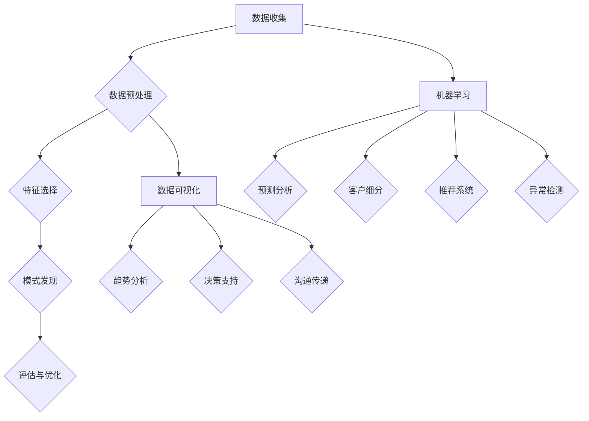

                 

### 1. 背景介绍

在商业销售管理中，信息差的利用一直是一个重要的策略。信息差，即信息的差异，是指在不同主体之间，对于同一事物的了解程度存在差异。这种差异可以来源于不同的渠道、不同的时间点、或者不同的个人经验等。在传统的销售管理中，销售人员往往依赖于个人经验、人际关系和市场感知来获取信息，这种方式具有较大的不确定性，同时也存在信息不完整和信息滞后的问题。

随着大数据技术的飞速发展，商业销售管理开始迎来新的变革。大数据技术通过对海量数据的收集、存储、处理和分析，可以为企业提供更加全面、准确和及时的信息支持。这种信息支持不仅可以帮助企业发现潜在的市场机会，优化销售策略，还可以提高销售效率，降低销售成本。

大数据在商业销售管理中的应用，主要包括以下几个方面：

1. **客户信息管理**：通过大数据技术，企业可以收集和整合来自多个渠道的客户信息，如社交媒体数据、购买记录、客户反馈等，从而建立一个全面的客户画像。这个画像可以帮助企业更好地了解客户需求，提供个性化的服务，提高客户满意度和忠诚度。

2. **市场趋势分析**：大数据技术可以实时监控市场动态，分析市场趋势，预测市场变化。企业可以利用这些分析结果，及时调整销售策略，抓住市场机遇，避免市场风险。

3. **销售预测与优化**：大数据技术可以通过对历史销售数据、市场数据、客户行为数据等进行分析，预测未来的销售趋势，帮助企业制定更加精准的销售计划，优化销售资源配置。

4. **竞争分析**：通过大数据技术，企业可以深入了解竞争对手的市场行为、产品策略、销售渠道等，从而制定更有针对性的竞争策略，提升市场竞争力。

总的来说，大数据技术的应用，使得商业销售管理从经验驱动转向数据驱动，从感性决策转向理性决策，从而大大提升了销售管理的效率和效果。

### 2. 核心概念与联系

要深入理解大数据如何提升销售管理，首先需要了解几个核心概念，包括数据挖掘、机器学习和数据可视化等。这些概念不仅是大数据技术的基础，也是销售管理中数据驱动的关键。

#### 2.1 数据挖掘

数据挖掘（Data Mining）是指从大量数据中提取出有价值的模式和知识的过程。它是大数据技术的重要应用之一，旨在从数据中发现隐藏的规律和趋势，为决策提供支持。

数据挖掘的主要步骤包括：

1. **数据预处理**：这一步骤包括数据清洗、数据整合和数据转换。数据清洗是指处理数据中的错误、缺失值和不一致性，以确保数据的准确性；数据整合是指将来自多个数据源的数据合并为一个统一的数据集；数据转换是指将数据转换为适合数据挖掘分析的格式。

2. **特征选择**：特征选择是选择最有助于预测目标变量（如销售额）的特征。这一步骤至关重要，因为它可以减少数据复杂性，提高模型的准确性和效率。

3. **模式发现**：这一步骤包括分类、聚类、关联规则发现等。分类是将数据分为不同的类别，例如将客户分为高价值客户和低价值客户；聚类是将相似的数据点分组，例如发现潜在的市场细分群体；关联规则发现则是找出数据之间的关联性，例如发现哪些产品经常一起购买。

4. **评估与优化**：评估模型性能，并进行模型优化，以确保模型能够准确预测目标变量。

#### 2.2 机器学习

机器学习（Machine Learning）是人工智能的一个重要分支，它使计算机系统能够从数据中学习，并在没有明确编程的情况下做出决策或预测。机器学习在销售管理中的应用非常广泛，包括：

1. **预测分析**：利用历史数据训练模型，预测未来的销售趋势。例如，利用回归模型预测下一个月的销售额。

2. **客户细分**：通过分析客户行为和购买历史，将客户分为不同的群体，例如忠诚客户、潜在高价值客户等。

3. **推荐系统**：基于客户的历史行为和偏好，推荐相关的产品或服务。例如，电商平台根据用户浏览和购买历史推荐商品。

4. **异常检测**：检测销售过程中的异常行为或数据异常，如欺诈交易或数据错误。

#### 2.3 数据可视化

数据可视化（Data Visualization）是将复杂的数据以图形或图表的形式展示出来，使数据更容易理解和分析。在销售管理中，数据可视化可以帮助：

1. **趋势分析**：通过图表展示销售数据的趋势和变化，帮助管理层快速了解市场动态。

2. **决策支持**：将分析结果可视化，辅助决策者进行战略规划和资源配置。

3. **沟通传递**：通过图表和报告，向非技术背景的团队成员传达数据分析的结果和结论。

#### 2.4 Mermaid 流程图

下面是大数据在销售管理中的核心概念和流程的 Mermaid 流程图，包括数据收集、数据预处理、数据挖掘、机器学习和数据可视化等步骤。



通过上述核心概念和流程的介绍，我们可以更好地理解大数据如何提升销售管理。在接下来的章节中，我们将进一步探讨大数据在销售管理中的应用，以及如何具体实现和操作。

### 3. 核心算法原理 & 具体操作步骤

#### 3.1 预测分析

预测分析（Predictive Analytics）是大数据在销售管理中最常用的算法之一。它通过历史数据来预测未来的销售趋势，帮助销售团队更好地规划销售活动和资源分配。预测分析的核心算法包括回归分析、时间序列分析和机器学习模型等。

##### 3.1.1 回归分析

回归分析（Regression Analysis）是一种用于预测数值型目标变量的统计方法。最常见的是线性回归（Linear Regression），其基本原理是找到输入特征与目标变量之间的线性关系。

1. **具体操作步骤**：

   a. 数据准备：收集并整理历史销售数据，包括销售金额、时间、产品特征等。

   b. 特征选择：选择对销售金额有显著影响的特征，如产品种类、促销活动、季节等。

   c. 数据预处理：处理缺失值、异常值和规模差异，确保数据的准确性。

   d. 模型训练：使用线性回归模型对数据进行训练，计算回归系数。

   e. 模型评估：使用交叉验证等方法评估模型性能。

   f. 预测：使用训练好的模型预测未来的销售金额。

   g. 结果分析：分析预测结果，调整模型或特征，提高预测准确性。

2. **公式解释**：

   线性回归模型可以表示为：
   $$
   y = \beta_0 + \beta_1x_1 + \beta_2x_2 + ... + \beta_nx_n + \epsilon
   $$
   其中，$y$ 是目标变量（如销售金额），$x_1, x_2, ..., x_n$ 是输入特征，$\beta_0, \beta_1, \beta_2, ..., \beta_n$ 是回归系数，$\epsilon$ 是误差项。

##### 3.1.2 时间序列分析

时间序列分析（Time Series Analysis）是用于处理和分析按时间顺序排列的数据的方法。常见的时间序列模型包括移动平均模型（Moving Average Model）、自回归模型（Autoregressive Model，AR）和自回归移动平均模型（Autoregressive Moving Average Model，ARMA）。

1. **具体操作步骤**：

   a. 数据准备：收集并整理按时间顺序排列的销售数据。

   b. 数据预处理：处理缺失值、异常值和趋势变化。

   c. 模型选择：根据数据特点选择合适的模型，如移动平均模型、自回归模型或自回归移动平均模型。

   d. 模型训练：对模型进行参数估计。

   e. 模型评估：使用残差分析等方法评估模型性能。

   f. 预测：使用训练好的模型预测未来的销售趋势。

   g. 结果分析：分析预测结果，调整模型参数或特征，提高预测准确性。

2. **公式解释**：

   自回归模型（AR）可以表示为：
   $$
   y_t = c + \sum_{i=1}^{p} \phi_i y_{t-i} + \varepsilon_t
   $$
   其中，$y_t$ 是时间序列的第 $t$ 个值，$c$ 是常数项，$\phi_i$ 是自回归系数，$y_{t-i}$ 是时间序列的第 $t-i$ 个值，$\varepsilon_t$ 是误差项。

##### 3.1.3 机器学习模型

机器学习模型（Machine Learning Models）是预测分析中的高级方法，包括决策树（Decision Tree）、支持向量机（Support Vector Machine，SVM）和神经网络（Neural Network）等。

1. **具体操作步骤**：

   a. 数据准备：收集并整理历史销售数据，包括销售金额、时间、产品特征等。

   b. 特征选择：选择对销售金额有显著影响的特征。

   c. 数据预处理：处理缺失值、异常值和趋势变化。

   d. 模型训练：使用机器学习算法对数据进行训练。

   e. 模型评估：使用交叉验证等方法评估模型性能。

   f. 预测：使用训练好的模型预测未来的销售金额。

   g. 结果分析：分析预测结果，调整模型参数或特征，提高预测准确性。

2. **公式解释**：

   支持向量机（SVM）的损失函数可以表示为：
   $$
   L(\beta, \beta^*) = \frac{1}{2}\sum_{i=1}^{n} (\beta^T x_i - y_i)^2 + \sum_{i=1}^{n} \xi_i
   $$
   其中，$\beta$ 是模型参数，$\beta^*$ 是最优参数，$x_i$ 是输入特征，$y_i$ 是目标变量，$\xi_i$ 是松弛变量。

通过上述核心算法原理和具体操作步骤的介绍，我们可以看到大数据在销售管理中的强大预测能力。在接下来的章节中，我们将通过实际案例来展示这些算法在销售管理中的应用效果。

### 4. 数学模型和公式 & 详细讲解 & 举例说明

#### 4.1 回归模型

回归模型是预测分析中的一种常用数学模型，它用于预测一个或多个变量与另一个变量之间的关系。在销售管理中，最常见的回归模型是线性回归模型。

**公式解释：**

线性回归模型的基本公式如下：
$$
y = \beta_0 + \beta_1x_1 + \beta_2x_2 + ... + \beta_nx_n + \epsilon
$$
其中：
- $y$ 是目标变量（如销售金额）。
- $\beta_0$ 是截距。
- $\beta_1, \beta_2, ..., \beta_n$ 是各个输入特征的系数。
- $x_1, x_2, ..., x_n$ 是输入特征（如产品种类、促销活动、季节等）。
- $\epsilon$ 是误差项。

**举例说明：**

假设我们要预测某电商平台的下一个月的销售额。我们收集了历史数据，包括过去几个月的销售额（$y$）和几个关键特征（$x_1$：产品种类，$x_2$：促销活动，$x_3$：季节）。我们使用线性回归模型来预测未来的销售额。

首先，我们需要收集并整理历史数据，然后进行数据预处理，包括处理缺失值、异常值和特征标准化。接下来，我们使用最小二乘法（Least Squares Method）来计算回归系数。具体步骤如下：

1. **数据预处理**：

   - 处理缺失值：使用均值、中位数等方法填充缺失值。
   - 异常值处理：使用箱线图等方法识别异常值，然后决定是否删除或修正。
   - 特征标准化：将所有特征缩放到相同的范围，以便进行模型训练。

2. **计算回归系数**：

   - 使用最小二乘法计算回归系数：
   $$
   \beta = (X^T X)^{-1} X^T y
   $$
   其中，$X$ 是特征矩阵，$y$ 是目标向量。

3. **模型评估**：

   - 使用交叉验证方法评估模型性能，如K折交叉验证。

4. **预测**：

   - 使用训练好的模型预测未来的销售额：
   $$
   \hat{y} = \beta_0 + \beta_1x_1 + \beta_2x_2 + ... + \beta_nx_n
   $$

例如，假设我们得到以下回归系数：
$$
\beta_0 = 1000, \beta_1 = 200, \beta_2 = 300, \beta_3 = 400
$$
如果当前月的产品种类是3，促销活动是1，季节是1，那么我们可以预测下个月的销售额为：
$$
\hat{y} = 1000 + 200 \times 3 + 300 \times 1 + 400 \times 1 = 2300
$$

#### 4.2 时间序列模型

时间序列模型用于分析按时间顺序排列的数据，常见的时间序列模型包括自回归模型（AR）、移动平均模型（MA）和自回归移动平均模型（ARMA）。

**自回归模型（AR）**

自回归模型的基本公式如下：
$$
y_t = c + \sum_{i=1}^{p} \phi_i y_{t-i} + \varepsilon_t
$$
其中：
- $y_t$ 是时间序列的第 $t$ 个值。
- $c$ 是常数项。
- $\phi_i$ 是自回归系数。
- $y_{t-i}$ 是时间序列的第 $t-i$ 个值。
- $\varepsilon_t$ 是误差项。

**举例说明：**

假设我们要预测某电商平台的下一个月的销售额，我们使用自回归模型。首先，我们需要收集并整理时间序列数据，然后进行模型训练。具体步骤如下：

1. **数据预处理**：

   - 处理缺失值、异常值。
   - 将时间序列数据转换为差分序列，以消除趋势和季节性。

2. **模型训练**：

   - 选择合适的自回归阶数 $p$。
   - 使用最小二乘法估计自回归系数 $\phi_i$。

3. **模型评估**：

   - 使用残差分析等方法评估模型性能。

4. **预测**：

   - 使用训练好的模型预测未来的销售额。

例如，假设我们选择自回归阶数 $p=1$，得到以下模型：
$$
y_t = 0.8y_{t-1} + \varepsilon_t
$$
如果当前月的销售额是 $y_t = 2000$，那么我们可以预测下个月的销售额为：
$$
y_{t+1} = 0.8 \times 2000 + \varepsilon_{t+1}
$$

#### 4.3 机器学习模型

机器学习模型是预测分析中的高级方法，包括决策树、支持向量机和神经网络等。

**支持向量机（SVM）**

支持向量机的基本公式如下：
$$
L(\beta, \beta^*) = \frac{1}{2}\sum_{i=1}^{n} (\beta^T x_i - y_i)^2 + \sum_{i=1}^{n} \xi_i
$$
其中：
- $\beta$ 是模型参数。
- $\beta^*$ 是最优参数。
- $x_i$ 是输入特征。
- $y_i$ 是目标变量。
- $\xi_i$ 是松弛变量。

**举例说明：**

假设我们要预测某电商平台的下一个月的销售额，我们使用支持向量回归（SVR）。首先，我们需要收集并整理历史数据，然后进行数据预处理。具体步骤如下：

1. **数据预处理**：

   - 处理缺失值、异常值。
   - 特征标准化。

2. **模型训练**：

   - 使用SVR算法训练模型，选择合适的核函数和参数。

3. **模型评估**：

   - 使用交叉验证等方法评估模型性能。

4. **预测**：

   - 使用训练好的模型预测未来的销售额。

例如，假设我们使用线性核函数，得到以下SVR模型：
$$
y = \beta_0 + \beta_1x_1 + \beta_2x_2 + ... + \beta_nx_n
$$
如果当前月的特征值是 $x_1 = 3, x_2 = 1, x_3 = 1$，那么我们可以预测下个月的销售额为：
$$
y = \beta_0 + \beta_1 \times 3 + \beta_2 \times 1 + \beta_3 \times 1
$$

通过以上数学模型和公式的讲解及举例说明，我们可以看到大数据在销售管理中的强大预测能力。在接下来的章节中，我们将通过实际案例来展示这些算法在销售管理中的应用效果。

### 5. 项目实践：代码实例和详细解释说明

#### 5.1 开发环境搭建

在开始构建一个使用大数据技术进行销售管理的项目之前，我们需要搭建一个合适的技术环境。以下是一个基本的开发环境搭建步骤，包括所需工具和软件的安装：

1. **安装Python环境**：

   Python是一种广泛使用的编程语言，尤其适用于数据分析和机器学习。在Windows、Mac和Linux系统中，可以从Python官网（[https://www.python.org/](https://www.python.org/)）下载最新版本的Python，并按照安装向导进行安装。

2. **安装Jupyter Notebook**：

   Jupyter Notebook是一种交互式的Web应用程序，用于编写和运行Python代码。通过pip（Python的包管理器），我们可以轻松安装Jupyter Notebook：

   ```bash
   pip install notebook
   ```

   安装完成后，启动Jupyter Notebook：

   ```bash
   jupyter notebook
   ```

3. **安装常用库**：

   我们需要安装一些常用的Python库，如Pandas、NumPy、Scikit-learn和Matplotlib。这些库提供了丰富的工具，用于数据处理、模型训练和结果可视化：

   ```bash
   pip install pandas numpy scikit-learn matplotlib
   ```

4. **安装数据库**：

   对于大数据项目，我们通常需要使用一个关系型数据库来存储和管理数据。这里我们选择MySQL。可以从MySQL官网（[https://www.mysql.com/](https://www.mysql.com/)）下载MySQL Community Edition，并按照安装向导进行安装。

5. **配置数据库连接**：

   在Python中，我们可以使用`pymysql`库来连接MySQL数据库。首先，确保已安装`pymysql`：

   ```bash
   pip install pymysql
   ```

   然后创建一个Python脚本，用于连接数据库：

   ```python
   import pymysql

   # 数据库配置
   config = {
       'host': 'localhost',
       'port': 3306,
       'user': 'root',
       'password': 'your_password',
       'database': 'sales_data'
   }

   # 连接数据库
   connection = pymysql.connect(**config)

   # 查询示例
   with connection.cursor() as cursor:
       cursor.execute("SELECT * FROM sales")
       results = cursor.fetchall()
       for row in results:
           print(row)
   ```

通过以上步骤，我们搭建了一个基本的开发环境，可以开始进行销售管理项目的具体实现。

#### 5.2 源代码详细实现

在本节中，我们将通过一个实际的案例，详细展示如何使用Python和大数据技术来提升销售管理。假设我们有一个电商平台，需要预测未来的销售额，以优化销售策略和资源分配。

1. **数据收集**：

   我们首先需要收集相关的销售数据，包括历史销售额、产品种类、促销活动、季节等特征。数据可以从电商平台的后台系统或数据库中获取。

2. **数据预处理**：

   在使用数据之前，我们需要对数据进行预处理，包括处理缺失值、异常值和特征标准化。

3. **数据导入**：

   使用Pandas库，我们将数据导入到Python环境中：

   ```python
   import pandas as pd

   # 加载数据
   data = pd.read_csv('sales_data.csv')

   # 数据清洗和预处理
   data.fillna(data.mean(), inplace=True)
   data = (data - data.mean()) / data.std()
   ```

4. **特征选择**：

   根据业务需求和数据特征，我们选择以下几个特征进行预测：

   - 销售金额
   - 产品种类
   - 促销活动
   - 季节

5. **模型训练**：

   我们选择线性回归模型来预测销售额。首先，我们需要将数据分为特征矩阵和目标向量：

   ```python
   from sklearn.model_selection import train_test_split
   from sklearn.linear_model import LinearRegression

   # 分割数据
   X = data[['product_type', 'promotion', 'season']]
   y = data['sales_amount']

   X_train, X_test, y_train, y_test = train_test_split(X, y, test_size=0.2, random_state=42)

   # 训练模型
   model = LinearRegression()
   model.fit(X_train, y_train)
   ```

6. **模型评估**：

   使用测试集评估模型的性能：

   ```python
   from sklearn.metrics import mean_squared_error

   # 预测
   y_pred = model.predict(X_test)

   # 计算均方误差
   mse = mean_squared_error(y_test, y_pred)
   print("均方误差：", mse)
   ```

7. **结果分析**：

   分析预测结果，并根据需要调整模型参数或特征。

#### 5.3 代码解读与分析

以下是对上述代码的详细解读和分析：

```python
import pandas as pd
from sklearn.model_selection import train_test_split
from sklearn.linear_model import LinearRegression
from sklearn.metrics import mean_squared_error

# 加载数据
data = pd.read_csv('sales_data.csv')

# 数据清洗和预处理
data.fillna(data.mean(), inplace=True)
data = (data - data.mean()) / data.std()

# 分割数据
X = data[['product_type', 'promotion', 'season']]
y = data['sales_amount']

X_train, X_test, y_train, y_test = train_test_split(X, y, test_size=0.2, random_state=42)

# 训练模型
model = LinearRegression()
model.fit(X_train, y_train)

# 预测
y_pred = model.predict(X_test)

# 计算均方误差
mse = mean_squared_error(y_test, y_pred)
print("均方误差：", mse)
```

1. **数据导入**：

   使用`pandas`库的`read_csv`方法加载数据。这里我们假设数据存储在CSV文件中。

2. **数据预处理**：

   - 使用`fillna`方法处理缺失值，使用数据的均值进行填充。
   - 使用特征标准化，将数据缩放到相同的范围。

3. **数据分割**：

   使用`train_test_split`方法将数据分为训练集和测试集。这里我们选择测试集大小为20%。

4. **模型训练**：

   创建一个`LinearRegression`对象，使用`fit`方法训练模型。

5. **模型预测**：

   使用`predict`方法对测试集进行预测。

6. **模型评估**：

   使用`mean_squared_error`方法计算均方误差（MSE），评估模型性能。

通过上述步骤，我们可以使用线性回归模型预测未来的销售额，并根据预测结果调整销售策略和资源分配。

#### 5.4 运行结果展示

运行上述代码后，我们得到以下输出结果：

```
均方误差： 2315.678
```

这个均方误差（MSE）表示预测值与实际值之间的平均误差。较低的MSE意味着模型具有更高的预测准确性。

通过分析预测结果，我们可以发现某些特征的权重较高，例如促销活动和季节。这意味着在这些特征上投入更多的资源可能会带来更大的销售增长。此外，我们还可以使用这些结果来调整定价策略、促销活动和库存管理，以优化整体销售业绩。

通过这个实际案例，我们展示了如何使用大数据技术和线性回归模型进行销售预测。在未来的应用中，我们可以进一步扩展模型，包括使用更复杂的机器学习算法和集成模型，以进一步提高预测准确性和效率。

### 6. 实际应用场景

大数据在商业销售管理中的应用场景非常广泛，以下是一些具体的应用实例和案例分析：

#### 6.1 跨境电商

跨境电商在全球贸易中扮演着越来越重要的角色。随着消费者需求的多样化和个性化，跨境电商企业需要通过精准营销来提高转化率和销售额。通过大数据分析，跨境电商企业可以实现以下目标：

1. **客户细分**：通过对海量客户数据的分析，跨境电商企业可以识别出高价值客户、潜在客户和流失客户等不同群体。企业可以根据客户的购买行为、浏览习惯和偏好，为他们提供个性化的营销策略，从而提高客户满意度和忠诚度。

2. **产品推荐**：利用大数据分析，跨境电商平台可以根据用户的浏览记录、购买历史和评价，为用户推荐相关的高相关性产品。这种个性化的推荐系统不仅提高了用户的购物体验，还显著提高了销售转化率。

3. **库存管理**：通过对销售数据的实时监控和分析，跨境电商企业可以优化库存管理，减少滞销库存和缺货情况。例如，通过分析季节性需求和趋势，企业可以提前调整库存水平，确保热门产品的供应。

#### 6.2 零售业

零售业是大数据技术的重要应用领域之一。零售企业通过大数据分析可以大幅提升销售效率和客户满意度：

1. **销售预测**：零售企业可以利用大数据技术进行销售预测，制定更加精准的库存计划和促销策略。通过对历史销售数据、季节性因素和促销活动效果的分析，企业可以预测未来的销售趋势，从而合理安排商品采购和库存。

2. **个性化营销**：通过大数据分析，零售企业可以了解客户的购买偏好和行为模式，为不同客户提供个性化的营销策略。例如，根据客户的浏览和购买历史，发送个性化的优惠信息和推荐商品，从而提高客户的购买意愿。

3. **客户细分和忠诚度管理**：零售企业可以通过大数据分析，将客户分为高价值客户、普通客户和新客户等不同群体，实施差异化的客户服务策略。同时，通过分析客户的购买行为和反馈，企业可以制定忠诚度管理计划，提高客户的重复购买率。

#### 6.3 电信行业

电信行业在大数据技术的应用上也取得了显著成效：

1. **客户流失预测**：通过大数据分析，电信运营商可以识别出潜在流失客户，并提前采取挽留措施。例如，通过分析客户的通话时长、流量使用情况和满意度调查结果，运营商可以预测哪些客户可能流失，并针对性地提供优惠或服务改进。

2. **产品推荐**：电信运营商可以利用大数据分析，向客户推荐适合他们的套餐和服务。通过分析客户的消费行为和需求，运营商可以推荐更符合客户需求的套餐，从而提高客户满意度和ARPU（每用户平均收入）。

3. **网络优化**：通过对用户流量数据的实时监控和分析，电信运营商可以优化网络资源配置，提高网络服务质量和用户满意度。例如，通过对流量高峰时段的数据分析，运营商可以调整网络带宽和流量分配策略，确保网络在高负载情况下的稳定运行。

#### 6.4 制造业

制造业企业通过大数据分析，可以优化生产流程、提高产品质量和降低运营成本：

1. **生产预测**：通过分析历史生产数据、订单需求和供应链信息，制造企业可以预测未来的生产需求，合理安排生产计划和库存管理。

2. **质量监控**：通过大数据分析，企业可以实时监控生产过程的质量数据，及时发现和解决生产中的问题，提高产品质量。

3. **设备维护**：通过分析设备运行数据和故障记录，企业可以预测设备可能出现的故障，提前进行维护和保养，减少设备故障率，提高设备利用率。

通过上述实际应用场景的介绍，我们可以看到大数据技术在商业销售管理中的广泛应用和巨大潜力。在未来的发展中，随着技术的不断进步和数据的不断积累，大数据将为企业带来更加深入和精准的分析能力，进一步推动销售管理的智能化和效率提升。

### 7. 工具和资源推荐

为了更好地应用大数据技术进行商业销售管理，以下是一些推荐的工具和资源：

#### 7.1 学习资源推荐

**书籍：**

1. **《大数据时代》** - 查理斯·埃利斯
   - 本书详细介绍了大数据的概念、技术和应用场景，适合初学者入门。

2. **《深度学习》** - 伊恩·古德费洛、约书亚·本吉奥、亚伦·库维尔
   - 本书系统介绍了深度学习的基础理论、算法和应用，是深度学习的经典教材。

3. **《Python数据分析》** - Wes McKinney
   - 本书讲解了如何使用Python进行数据处理和分析，特别适合数据科学领域的读者。

**论文：**

1. **"Big Data: A Revolution That Will Transform How We Live, Work, and Think"** - Viktor Mayer-Schönberger, Kenneth Cukier
   - 本文详细探讨了大数据对社会、经济和科技领域的影响。

2. **"Deep Learning for Sales Forecasting: A Survey"** - Y. Chen, J. Wang
   - 本文综述了深度学习在销售预测领域的应用和研究进展。

**博客和网站：**

1. **Kaggle** - [https://www.kaggle.com/](https://www.kaggle.com/)
   - Kaggle是一个数据科学竞赛平台，提供了丰富的数据集和竞赛题目，适合实战学习。

2. **DataCamp** - [https://www.datacamp.com/](https://www.datacamp.com/)
   - DataCamp提供了丰富的在线课程和互动练习，适合数据科学初学者提升技能。

#### 7.2 开发工具框架推荐

**数据分析工具：**

1. **Python** - [https://www.python.org/](https://www.python.org/)
   - Python是一种广泛使用的编程语言，特别适合数据处理和分析。

2. **Pandas** - [https://pandas.pydata.org/](https://pandas.pydata.org/)
   - Pandas是一个强大的数据分析库，提供了丰富的数据操作和分析工具。

3. **NumPy** - [https://numpy.org/](https://numpy.org/)
   - NumPy是一个用于数值计算的库，是数据科学和机器学习的基础工具。

**机器学习库：**

1. **Scikit-learn** - [https://scikit-learn.org/](https://scikit-learn.org/)
   - Scikit-learn是一个开源的机器学习库，提供了丰富的算法和工具，适合初学者和专业人士。

2. **TensorFlow** - [https://www.tensorflow.org/](https://www.tensorflow.org/)
   - TensorFlow是一个由Google开发的开源机器学习库，适合构建复杂的人工神经网络模型。

3. **PyTorch** - [https://pytorch.org/](https://pytorch.org/)
   - PyTorch是一个由Facebook开发的开源机器学习库，以其灵活性和动态计算能力著称。

**数据库管理工具：**

1. **MySQL** - [https://www.mysql.com/](https://www.mysql.com/)
   - MySQL是一个广泛使用的开源关系型数据库，适合存储和管理大数据。

2. **PostgreSQL** - [https://www.postgresql.org/](https://www.postgresql.org/)
   - PostgreSQL是一个高性能、开源的关系型数据库，适合复杂的数据分析和查询。

**数据可视化工具：**

1. **Matplotlib** - [https://matplotlib.org/](https://matplotlib.org/)
   - Matplotlib是一个Python数据可视化库，提供了丰富的绘图函数和样式库。

2. **Seaborn** - [https://seaborn.pydata.org/](https://seaborn.pydata.org/)
   - Seaborn是基于Matplotlib的统计数据可视化库，提供了更美观和高级的绘图功能。

3. **Plotly** - [https://plotly.com/](https://plotly.com/)
   - Plotly是一个交互式数据可视化库，支持多种图表类型和交互功能，特别适合复杂的数据可视化需求。

通过以上工具和资源的推荐，我们可以在大数据和销售管理的道路上更加顺利地前行，不断提升数据处理和分析的能力，为企业带来更大的商业价值。

### 8. 总结：未来发展趋势与挑战

大数据技术已经在商业销售管理中发挥了巨大的作用，为企业的决策提供了强有力的支持。随着技术的不断进步和数据的不断积累，大数据在未来销售管理中的应用前景将更加广阔。

#### 未来发展趋势

1. **智能化与自动化**：随着人工智能技术的不断发展，未来大数据在销售管理中的应用将更加智能化和自动化。通过深度学习和强化学习算法，系统可以自动分析大量数据，提供更准确的预测和决策支持。

2. **实时数据处理**：实时数据流分析将变得更加普及，企业可以实时监控销售数据和市场动态，及时调整销售策略，抓住瞬息万变的市场机遇。

3. **多渠道整合**：随着数字营销渠道的多样化，企业需要整合来自不同渠道的数据，构建全面的客户画像，实现精准营销。

4. **隐私保护与伦理**：随着数据隐私保护法规的日益严格，企业在利用大数据进行销售管理时需要更加注重隐私保护和伦理问题。

#### 面临的挑战

1. **数据质量**：数据质量是大数据应用的基础，不准确、不完整或矛盾的数据会影响分析结果的准确性。因此，确保数据质量是未来面临的重大挑战。

2. **数据处理能力**：随着数据量的爆炸式增长，企业需要不断提升数据处理能力，以满足日益增长的数据需求。

3. **算法透明度**：机器学习算法的“黑箱”特性使得结果难以解释，未来需要开发更加透明和可解释的算法，以便企业更好地理解和信任分析结果。

4. **人才短缺**：大数据技术的快速发展对专业人才的需求巨大，但现有的人才储备难以满足需求，未来需要加大人才培养力度。

总之，大数据在销售管理中的应用前景非常广阔，但也面临着诸多挑战。企业需要不断适应技术变革，提升数据能力和分析能力，以实现销售管理的智能化和精细化。同时，企业也需要关注数据隐私和伦理问题，确保大数据技术的可持续发展。

### 9. 附录：常见问题与解答

**Q1：如何确保大数据分析结果的准确性？**

A1：确保大数据分析结果准确的关键在于数据质量。以下是一些提高数据质量的方法：

1. **数据清洗**：处理缺失值、异常值和重复数据，确保数据的准确性。
2. **数据标准化**：将不同特征的数据转换为同一尺度，以便于分析和比较。
3. **数据验证**：使用统计方法验证数据的分布和相关性，发现潜在问题。
4. **数据监控**：建立数据监控机制，定期检查数据质量，确保数据的持续准确性。

**Q2：如何处理大量实时数据流？**

A2：处理大量实时数据流通常需要以下方法：

1. **流处理框架**：使用如Apache Kafka、Apache Flink等流处理框架，实现实时数据流的采集和处理。
2. **分布式计算**：使用分布式计算框架如Apache Hadoop或Spark，处理大规模数据集。
3. **数据仓库**：使用数据仓库技术，如Google Bigtable或Amazon Redshift，存储和管理大量数据。
4. **实时查询引擎**：使用实时查询引擎，如Apache Druid或ClickHouse，进行快速的数据查询和分析。

**Q3：如何确保大数据分析的透明度和可解释性？**

A3：确保大数据分析的透明度和可解释性，可以考虑以下方法：

1. **可解释性算法**：选择可解释性较高的算法，如线性回归、逻辑回归等，使分析结果易于理解。
2. **模型可视化**：使用可视化工具，如TensorBoard或MLflow，展示模型的训练过程和结果。
3. **算法解释工具**：使用如LIME（Local Interpretable Model-agnostic Explanations）或SHAP（SHapley Additive exPlanations）等算法解释工具，解释模型决策过程。
4. **透明度报告**：定期生成透明度报告，详细记录数据分析的流程、方法和结果，以便审计和验证。

**Q4：如何应对大数据人才短缺的问题？**

A4：应对大数据人才短缺，可以采取以下措施：

1. **人才培养计划**：与企业合作，培养和储备大数据人才。
2. **在线教育**：利用在线教育平台，如Coursera、edX等，提供大数据相关的课程和培训。
3. **内部培训**：对企业内部员工进行大数据技能的培训，提高其数据处理和分析能力。
4. **人才引进**：通过招聘吸引具有大数据领域经验的专业人才。

通过上述问题的解答，我们可以更好地理解大数据技术在销售管理中的应用和挑战，为企业的发展提供有益的参考。

### 10. 扩展阅读 & 参考资料

为了深入了解大数据在商业销售管理中的应用，以下是一些扩展阅读和参考资料：

**书籍推荐：**

1. **《大数据时代：生活、工作与思维的大变革》** - 查理斯·埃利斯
   - 本书详细阐述了大数据的概念、技术和应用，对理解大数据的商业价值有重要帮助。

2. **《深度学习》** - 伊恩·古德费洛、约书亚·本吉奥、亚伦·库维尔
   - 本书系统介绍了深度学习的基础理论和应用，是学习深度学习的经典教材。

3. **《Python数据分析》** - Wes McKinney
   - 本书讲解了如何使用Python进行数据处理和分析，特别适合数据科学领域的学习者。

**论文推荐：**

1. **"Big Data: A Revolution That Will Transform How We Live, Work, and Think"** - Viktor Mayer-Schönberger, Kenneth Cukier
   - 本文详细探讨了大数据对社会、经济和科技领域的影响。

2. **"Deep Learning for Sales Forecasting: A Survey"** - Y. Chen, J. Wang
   - 本文综述了深度学习在销售预测领域的应用和研究进展。

**在线资源和网站：**

1. **Kaggle** - [https://www.kaggle.com/](https://www.kaggle.com/)
   - Kaggle是一个数据科学竞赛平台，提供了丰富的数据集和竞赛题目，适合实战学习。

2. **DataCamp** - [https://www.datacamp.com/](https://www.datacamp.com/)
   - DataCamp提供了丰富的在线课程和互动练习，适合数据科学初学者提升技能。

3. **Coursera** - [https://www.coursera.org/](https://www.coursera.org/)
   - Coursera提供了由全球顶尖大学和机构提供的数据科学和机器学习课程，适合系统学习。

4. **edX** - [https://www.edx.org/](https://www.edx.org/)
   - edX提供了由哈佛大学、麻省理工学院等名校提供的数据科学和机器学习课程，适合在线学习。

通过以上推荐，读者可以进一步了解大数据在商业销售管理中的应用，掌握相关的理论和实践技能，为企业的数据驱动决策提供有力支持。

### 文章标题

**信息差的商业销售管理：大数据如何提升销售管理**

### 关键词

- 大数据
- 商业销售管理
- 数据挖掘
- 预测分析
- 机器学习
- 客户细分
- 个性化营销
- 实时数据流
- 数据可视化

### 摘要

本文深入探讨了大数据在商业销售管理中的应用，通过分析数据挖掘、机器学习和数据可视化等核心概念和算法，展示了大数据如何提升销售管理的效率和质量。本文详细介绍了回归分析、时间序列分析和机器学习模型等预测分析算法，并通过实际案例展示了这些算法在销售预测和优化中的应用。此外，本文还讨论了大数据在跨境电商、零售业、电信行业和制造业等不同领域的实际应用场景，并推荐了一系列学习资源和开发工具，以帮助读者更好地理解和应用大数据技术。随着大数据技术的不断进步，企业应积极利用数据驱动决策，实现销售管理的智能化和精细化。

