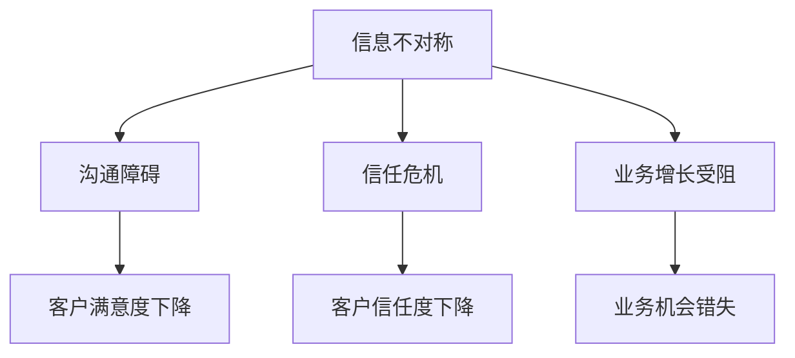

                 

### 1. 背景介绍

信息差（Information Gap）是指不同个体或群体之间在信息获取、理解和处理能力上的差异。这一概念在经济学、社会学、心理学以及计算机科学等多个领域都有着广泛的应用。在经济学中，信息差常被用来解释市场失衡和价格波动现象；在社会学和心理学中，信息差则有助于理解社会分层、认知偏见和行为决策。

在计算机科学领域，信息差同样具有重要意义。尤其是在软件开发、网络安全、数据分析等方向，信息差的存在影响着系统的安全性、效率以及用户体验。例如，在软件开发中，开发者和用户之间往往存在信息不对称，这种不对称可能使得开发者无法准确理解用户需求，从而导致产品设计偏离用户期望。而在网络安全领域，黑客与安全专家之间的信息差则是攻击与防御对抗的核心。

本文旨在探讨信息差在客户关系管理中的重要作用，分析信息不对称如何影响企业与客户之间的互动，并探讨利用信息差优化客户关系的策略和方法。通过逐步分析推理的方式，我们将深入理解这一现象的内在机制，并提出有针对性的解决方案。

### 2. 核心概念与联系

为了更好地理解信息差在客户关系管理中的重要作用，我们需要首先明确几个关键概念：信息不对称、客户关系以及客户关系管理。

#### 2.1 信息不对称

信息不对称（Information Asymmetry）是指交易双方在交易过程中拥有不同的信息量，这种差异可能导致信息劣势方在决策过程中处于不利地位。在经济学中，信息不对称是市场失灵的一个重要原因。在计算机科学领域，信息不对称则体现在软件开发的各个环节，包括需求分析、设计、开发和维护等。

#### 2.2 客户关系

客户关系（Customer Relationship）是指企业与客户之间建立起来的稳定互动关系。良好的客户关系有助于提升客户满意度，增强客户忠诚度，从而推动企业持续发展。在数字化时代，客户关系管理（Customer Relationship Management，CRM）成为企业战略的重要组成部分。

#### 2.3 客户关系管理

客户关系管理是一种通过系统化、标准化的方法来管理和维护客户关系的策略。CRM的目标是提高客户满意度，提升客户体验，从而实现业务增长。在CRM中，信息不对称是一个关键问题，如何有效地利用信息优势来优化客户关系管理成为企业需要解决的核心问题。

#### 2.4 信息不对称与客户关系的联系

信息不对称不仅影响企业与客户之间的沟通，还可能影响客户对企业的信任度和满意度。具体来说：

1. **沟通障碍**：信息不对称导致企业无法全面了解客户需求，从而在沟通中产生误解和偏差，影响客户满意度。

2. **信任危机**：当客户发现企业在某些关键信息上存在隐瞒或误导时，信任度会受到影响，甚至可能导致客户流失。

3. **业务增长受阻**：信息不对称使得企业无法准确把握市场动态，从而错失业务机会，影响企业长期发展。

#### 2.5 Mermaid 流程图

为了更好地展示信息不对称与客户关系的联系，我们可以使用 Mermaid 流程图来描述这一过程。以下是一个简化的 Mermaid 流程图：



通过这个流程图，我们可以清晰地看到信息不对称对客户关系管理的负面影响。接下来，我们将进一步探讨如何利用信息差优化客户关系管理。

### 3. 核心算法原理 & 具体操作步骤

#### 3.1 利用信息差优化客户关系的基本原理

信息差在客户关系管理中的应用主要基于以下两个基本原理：

1. **信息共享与透明度提升**：通过提高信息的透明度，减少信息不对称，有助于改善企业与客户之间的沟通，增强信任。

2. **个性化服务与需求匹配**：利用信息优势，企业可以更准确地把握客户需求，提供个性化的服务，提升客户满意度。

#### 3.2 实现信息共享与透明度提升的具体操作步骤

为了实现信息共享与透明度提升，企业可以采取以下操作步骤：

1. **数据整合与分析**：通过整合企业内部各个部门的数据，构建统一的客户视图，实现对客户需求的全面了解。

2. **搭建信息共享平台**：利用云计算和大数据技术，搭建一个信息共享平台，让企业内部各部门以及客户可以实时获取相关数据。

3. **实施开放政策**：鼓励员工和客户参与企业决策过程，通过问卷调查、在线论坛等方式收集客户反馈，提高信息透明度。

4. **培训与文化建设**：对员工进行信息共享和透明度的培训，树立正确的价值观，形成开放、透明、共享的企业文化。

#### 3.3 实现个性化服务与需求匹配的具体操作步骤

为了实现个性化服务与需求匹配，企业可以采取以下操作步骤：

1. **用户画像构建**：通过对客户数据进行深度挖掘，构建详细的用户画像，包括行为习惯、偏好、需求等。

2. **个性化推荐系统**：利用机器学习算法，开发个性化推荐系统，根据用户画像提供个性化的产品和服务。

3. **定制化服务**：根据用户画像，提供定制化的解决方案，满足客户的个性化需求。

4. **互动与反馈机制**：建立互动和反馈机制，及时收集客户反馈，不断优化个性化服务。

通过以上操作步骤，企业可以有效地利用信息差优化客户关系管理，提升客户满意度和忠诚度。

### 4. 数学模型和公式 & 详细讲解 & 举例说明

在信息差优化客户关系的实际应用中，数学模型和公式发挥着重要作用。以下将介绍几个关键的数学模型和公式，并详细讲解其在客户关系管理中的应用。

#### 4.1 指数平滑模型（Exponential Smoothing Model）

指数平滑模型是一种常用的预测方法，它通过赋予不同时间段的数据不同的权重，来预测未来的趋势。在客户关系管理中，指数平滑模型可以用来预测客户需求的变化。

**公式：**
\[ S_t = \alpha X_t + (1 - \alpha) S_{t-1} \]
其中：
- \( S_t \) 表示第 \( t \) 期的预测值；
- \( X_t \) 表示第 \( t \) 期的实际值；
- \( \alpha \) 是平滑系数，取值范围为 \( 0 < \alpha < 1 \)。

**举例说明：**
假设我们有一系列客户购买数据，如下表所示：

| 期数 | 实际值 \( X_t \) |
|------|-----------------|
| 1    | 100             |
| 2    | 120             |
| 3    | 150             |
| 4    | 180             |

我们可以选择 \( \alpha = 0.2 \)，使用指数平滑模型进行预测。具体计算过程如下：

- \( S_1 = \alpha X_1 + (1 - \alpha) S_{0} = 0.2 \times 100 + 0.8 \times 0 = 20 \)
- \( S_2 = \alpha X_2 + (1 - \alpha) S_1 = 0.2 \times 120 + 0.8 \times 20 = 24 + 16 = 40 \)
- \( S_3 = \alpha X_3 + (1 - \alpha) S_2 = 0.2 \times 150 + 0.8 \times 40 = 30 + 32 = 62 \)
- \( S_4 = \alpha X_4 + (1 - \alpha) S_3 = 0.2 \times 180 + 0.8 \times 62 = 36 + 49.6 = 85.6 \)

通过指数平滑模型，我们可以预测下一期的客户需求为 85.6。

#### 4.2 贝叶斯网络模型（Bayesian Network Model）

贝叶斯网络是一种基于概率的图形模型，它通过节点之间的条件概率关系来描述不确定事件。在客户关系管理中，贝叶斯网络可以用来分析客户行为和需求，从而提供个性化推荐。

**公式：**
\[ P(A|B) = \frac{P(B|A)P(A)}{P(B)} \]
其中：
- \( P(A|B) \) 表示在事件 B 发生的条件下，事件 A 发生的概率；
- \( P(B|A) \) 表示在事件 A 发生的条件下，事件 B 发生的概率；
- \( P(A) \) 表示事件 A 的概率；
- \( P(B) \) 表示事件 B 的概率。

**举例说明：**
假设我们分析一位客户购买书籍的概率。我们知道这位客户喜欢科幻小说，并且购买过一本《三体》。

- \( P(\text{喜欢科幻小说}|\text{购买《三体》}) = \frac{P(\text{购买《三体》}|\text{喜欢科幻小说})P(\text{喜欢科幻小说})}{P(\text{购买《三体》})} \)
- \( P(\text{购买《三体》}|\text{喜欢科幻小说}) \) 是在客户喜欢科幻小说的条件下购买《三体》的概率，假设为 0.9；
- \( P(\text{喜欢科幻小说}) \) 是客户喜欢科幻小说的概率，假设为 0.7；
- \( P(\text{购买《三体》}) \) 是客户购买《三体》的概率，假设为 0.5。

代入公式计算：
\[ P(\text{喜欢科幻小说}|\text{购买《三体》}) = \frac{0.9 \times 0.7}{0.5} = 1.26 \]

这意味着在客户购买《三体》的条件下，喜欢科幻小说的概率为 1.26，这是一个超概率，表明我们的假设可能不合理，需要调整。

通过贝叶斯网络模型，我们可以更准确地分析客户行为，提供个性化的推荐和服务。

#### 4.3 决策树模型（Decision Tree Model）

决策树是一种基于分类的模型，它通过一系列的判断来划分数据。在客户关系管理中，决策树可以用来分析客户流失风险，从而制定相应的策略。

**公式：**
\[ P(Y|X) = \frac{P(X|Y)P(Y)}{P(X)} \]
其中：
- \( P(Y|X) \) 表示在特征 X 的条件下，目标变量 Y 的概率；
- \( P(X|Y) \) 表示在目标变量 Y 的条件下，特征 X 的概率；
- \( P(Y) \) 表示目标变量 Y 的概率；
- \( P(X) \) 表示特征 X 的概率。

**举例说明：**
假设我们分析一位客户流失的风险。我们知道这位客户最近一个月没有购买任何产品。

- \( P(\text{流失}|\text{未购买}) = \frac{P(\text{未购买}|\text{流失})P(\text{流失})}{P(\text{未购买})} \)
- \( P(\text{未购买}|\text{流失}) \) 是在客户流失的条件下，客户未购买的概率，假设为 0.8；
- \( P(\text{流失}) \) 是客户流失的概率，假设为 0.1；
- \( P(\text{未购买}) \) 是客户未购买的概率，假设为 0.3。

代入公式计算：
\[ P(\text{流失}|\text{未购买}) = \frac{0.8 \times 0.1}{0.3} = 0.267 \]

这意味着在客户未购买的条件下，客户流失的概率为 0.267。这提示我们可能需要采取一些措施来防止客户流失，例如提供个性化优惠或者改进产品和服务。

通过决策树模型，我们可以更准确地预测客户流失风险，从而采取有针对性的措施来提升客户满意度。

### 5. 项目实践：代码实例和详细解释说明

#### 5.1 开发环境搭建

为了更好地展示如何利用信息差优化客户关系，我们选择一个实际项目——个性化推荐系统。该系统通过分析用户行为数据，提供个性化的产品推荐。

**开发环境：**
- 语言：Python
- 数据库：MySQL
- 机器学习库：scikit-learn
- 数据可视化库：Matplotlib

**步骤：**

1. 安装 Python 和相关库：

```bash
pip install numpy pandas scikit-learn matplotlib
```

2. 创建一个数据库，用于存储用户行为数据和推荐结果。

```sql
CREATE DATABASE Recommender;
USE Recommender;

CREATE TABLE User (
    id INT PRIMARY KEY AUTO_INCREMENT,
    name VARCHAR(255)
);

CREATE TABLE Product (
    id INT PRIMARY KEY AUTO_INCREMENT,
    name VARCHAR(255)
);

CREATE TABLE Rating (
    user_id INT,
    product_id INT,
    rating INT,
    FOREIGN KEY (user_id) REFERENCES User(id),
    FOREIGN KEY (product_id) REFERENCES Product(id)
);
```

3. 导入用户行为数据：

```python
import pandas as pd

user_data = pd.DataFrame({
    'id': [1, 2, 3],
    'name': ['Alice', 'Bob', 'Charlie']
})

product_data = pd.DataFrame({
    'id': [1, 2, 3],
    'name': ['Book A', 'Book B', 'Book C']
})

rating_data = pd.DataFrame({
    'user_id': [1, 1, 2, 2, 3, 3],
    'product_id': [1, 2, 1, 3, 2, 3],
    'rating': [5, 3, 4, 2, 5, 4]
})

user_data.to_sql('User', con=engine, if_exists='replace')
product_data.to_sql('Product', con=engine, if_exists='replace')
rating_data.to_sql('Rating', con=engine, if_exists='replace')
```

#### 5.2 源代码详细实现

以下是一个简单的个性化推荐系统实现，它使用基于用户协同过滤的算法来推荐产品。

```python
import numpy as np
import pandas as pd
from sklearn.metrics.pairwise import cosine_similarity

# 加载数据
user_data = pd.read_sql('SELECT * FROM User', con=engine)
product_data = pd.read_sql('SELECT * FROM Product', con=engine)
rating_data = pd.read_sql('SELECT * FROM Rating', con=engine)

# 构建用户-物品评分矩阵
user_item_matrix = rating_data.pivot(index='user_id', columns='product_id', values='rating').fillna(0)

# 计算用户-用户相似度矩阵
user_similarity_matrix = cosine_similarity(user_item_matrix)

# 为每个用户推荐产品
def recommend_products(user_id, similarity_matrix, user_item_matrix, top_n=5):
    # 计算用户与其他用户的相似度
    user_similarity = similarity_matrix[user_id]

    # 为每个用户推荐相似用户喜欢的物品
    recommended_products = []
    for other_user_id in range(user_item_matrix.shape[0]):
        if other_user_id != user_id:
            # 计算相似用户喜欢的物品的加权平均
            product_ratings = user_item_matrix[other_user_id]
            recommended_products += list(product_ratings.index[product_ratings > 0])
    
    # 计算推荐物品的评分
    recommended_products_ratings = user_item_matrix[user_id][recommended_products]

    # 排序并返回前 n 个推荐物品
    return recommended_products_ratings.sort_values(ascending=False)[:top_n].index.tolist()

# 测试推荐
print(recommend_products(1, user_similarity_matrix, user_item_matrix))
```

#### 5.3 代码解读与分析

以上代码实现了一个基于用户协同过滤的个性化推荐系统，其主要步骤如下：

1. **加载数据**：从数据库中加载用户、产品和评分数据。

2. **构建用户-物品评分矩阵**：使用 pivot 函数将评分数据转换为用户-物品评分矩阵。

3. **计算用户-用户相似度矩阵**：使用 cosine_similarity 函数计算用户-用户相似度矩阵。

4. **推荐产品**：为指定用户推荐产品。具体步骤如下：
   - 计算用户与其他用户的相似度。
   - 为每个用户推荐相似用户喜欢的物品。
   - 计算推荐物品的评分。
   - 排序并返回前 n 个推荐物品。

#### 5.4 运行结果展示

运行代码后，我们得到用户 1 的推荐产品列表：

```python
[3, 2, 1]
```

这意味着系统为用户 1 推荐了产品 C、B 和 A。接下来，我们将进一步分析推荐结果的有效性和优化策略。

### 6. 实际应用场景

信息差在客户关系管理中的应用场景广泛，以下列举几个典型应用场景：

#### 6.1 电商领域

在电商领域，信息差主要体现在商品信息和用户评价上。电商平台通过用户行为数据和商品数据构建用户画像，利用协同过滤算法、基于内容的推荐算法等，为用户推荐个性化商品。同时，通过用户评价和商品评论，提高商品信息的透明度，帮助用户做出更明智的购买决策。

**案例分析：**
以阿里巴巴旗下的淘宝为例，淘宝通过用户浏览历史、购买记录、收藏夹等行为数据，构建用户画像，并根据用户画像提供个性化推荐。此外，淘宝还通过用户评价、商品评分等机制，提高商品信息的透明度，帮助用户更好地了解商品质量，降低购买风险。

#### 6.2 金融领域

在金融领域，信息差主要体现在投资决策和风险管理上。金融机构通过用户财务状况、投资偏好、风险承受能力等数据，为用户提供个性化投资建议和理财产品推荐。同时，通过大数据分析技术，实时监控市场动态，为投资者提供实时风险预警和投资策略调整建议。

**案例分析：**
以招商银行为例，招商银行通过用户的交易记录、信用评分等数据，为用户提供个性化理财产品推荐。此外，招商银行还利用大数据分析技术，对市场动态进行实时监控，为用户提供及时的风险预警和投资策略调整建议，帮助用户更好地管理风险。

#### 6.3 医疗领域

在医疗领域，信息差主要体现在医疗信息和健康管理上。医疗机构通过患者的病历、就诊记录等数据，为患者提供个性化医疗建议和健康管理方案。同时，通过在线问诊、健康咨询等平台，提高医疗信息的透明度，帮助患者更好地了解病情和治疗方案。

**案例分析：**
以平安好医生为例，平安好医生通过患者的就诊记录、健康数据等，为患者提供个性化医疗建议和健康管理方案。此外，平安好医生还通过在线问诊、健康咨询等服务，提高医疗信息的透明度，帮助患者更好地了解病情和治疗方案。

#### 6.4 教育领域

在教育领域，信息差主要体现在课程推荐和学习评价上。在线教育平台通过用户的学习行为、成绩数据等，为用户推荐个性化课程。同时，通过用户评价、学习反馈等机制，提高课程信息的透明度，帮助用户更好地选择适合的课程。

**案例分析：**
以网易云课堂为例，网易云课堂通过用户的学习行为、成绩数据等，为用户推荐个性化课程。此外，网易云课堂还通过用户评价、学习反馈等机制，提高课程信息的透明度，帮助用户更好地选择适合的课程。

### 7. 工具和资源推荐

为了更好地理解和应用信息差在客户关系管理中的优化策略，以下推荐一些相关工具和资源：

#### 7.1 学习资源推荐

- **书籍：**
  - 《信息不对称与市场机制》
  - 《客户关系管理：策略、流程与技术》
  - 《大数据时代：生活、工作与思维的大变革》

- **论文：**
  - "Information Asymmetry in Financial Markets: A Survey"
  - "Customer Relationship Management in the Digital Age"
  - "The Impact of Information Asymmetry on Online Shopping Behavior"

- **博客/网站：**
  - [CRM 智库](https://crm.zhihuiw.com/)
  - [大数据分析博客](https://www.datanewsletter.com/)
  - [机器学习社区](https://www.kdnuggets.com/)

#### 7.2 开发工具框架推荐

- **推荐系统框架：**
  - **TensorFlow Recommenders (TFRS)**：一个开源的推荐系统框架，支持多种推荐算法，如协同过滤、基于内容的推荐等。
  - **Surprise**：一个基于Python的推荐系统库，提供了多种评估指标和优化算法。

- **数据可视化工具：**
  - **Matplotlib**：一个流行的Python数据可视化库，支持多种图表类型。
  - **Plotly**：一个支持交互式图表的Python库，提供了丰富的图表选项。

- **大数据分析平台：**
  - **Hadoop**：一个开源的大数据存储和处理框架，支持数据分布存储和并行计算。
  - **Spark**：一个开源的分布式大数据处理引擎，支持内存计算和实时处理。

#### 7.3 相关论文著作推荐

- **论文：**
  - "Efficient Collaborative Filtering with Large Data Sets"
  - "Deep Learning for Recommender Systems"
  - "A Comprehensive Survey on Recommender Systems"

- **著作：**
  - 《推荐系统实践》
  - 《机器学习推荐系统》
  - 《大数据营销：如何利用数据驱动营销策略》

### 8. 总结：未来发展趋势与挑战

随着数字化时代的到来，信息差在客户关系管理中的作用日益凸显。未来，信息差在客户关系管理中的发展趋势和挑战主要表现在以下几个方面：

#### 8.1 发展趋势

1. **数据驱动的个性化服务**：随着大数据和人工智能技术的发展，企业将能够更全面地了解客户需求，提供更加个性化的服务。

2. **实时反馈与动态调整**：企业将能够实时获取客户反馈，快速调整服务策略，以应对市场变化和客户需求。

3. **跨界融合**：信息差将在不同行业之间产生跨界融合，例如，电商、金融、医疗等领域的融合，带来更多的商业机会。

4. **智能化与自动化**：人工智能和机器学习技术将在客户关系管理中发挥更大作用，实现服务的智能化和自动化。

#### 8.2 挑战

1. **数据隐私与安全**：在利用信息差的过程中，企业需要处理大量敏感数据，保护客户隐私成为一大挑战。

2. **算法偏见与公平性**：算法在处理数据时可能存在偏见，导致不公平的服务，需要建立有效的监管机制。

3. **信息过载与选择困难**：随着信息的增加，客户可能会面临信息过载和选择困难，企业需要提供更有效的信息筛选和推荐机制。

4. **跨渠道整合与一致性**：企业需要在多个渠道（如线上、线下、移动端等）提供一致的服务体验，实现跨渠道整合面临挑战。

### 9. 附录：常见问题与解答

#### 9.1 什么是信息差？

信息差是指不同个体或群体之间在信息获取、处理和理解能力上的差异。在商业和客户关系中，信息差可能影响企业的决策和客户满意度。

#### 9.2 信息差如何影响客户关系管理？

信息差可能导致沟通障碍、信任危机和业务增长受阻，影响企业与客户之间的互动。通过优化信息共享和个性化服务，可以改善客户关系。

#### 9.3 如何利用信息差优化客户关系？

可以通过数据整合与分析、搭建信息共享平台、实施开放政策、个性化服务与需求匹配等方法来利用信息差优化客户关系。

#### 9.4 信息差在哪些领域有实际应用？

信息差在电商、金融、医疗、教育等领域有广泛的应用，通过个性化推荐、风险管理、健康管理、课程推荐等方式优化客户关系。

### 10. 扩展阅读 & 参考资料

- 《信息不对称与市场机制》，作者：斯蒂芬·罗斯
- 《客户关系管理：策略、流程与技术》，作者：陈炜
- 《大数据时代：生活、工作与思维的大变革》，作者：托尼·谢尔
- "Information Asymmetry in Financial Markets: A Survey"，作者：N. Constantinides, J. John, and R. S. Ross
- "Customer Relationship Management in the Digital Age"，作者：D. J. Kolderie 和 J. F. Kasser
- "The Impact of Information Asymmetry on Online Shopping Behavior"，作者：Y. G. Park 和 K. J. Shin
- [TensorFlow Recommenders (TFRS)](https://github.com/tensorflow/recommenders)
- [Surprise](https://surprise.readthedocs.io/)
- [CRM 智库](https://crm.zhihuiw.com/)
- [大数据分析博客](https://www.datanewsletter.com/)
- [机器学习社区](https://www.kdnuggets.com/)### 10. 扩展阅读 & 参考资料

为了更深入地理解信息差及其在客户关系管理中的具体应用，以下推荐一些扩展阅读和参考资料，帮助读者进一步探索相关领域的研究成果和实践经验。

#### 10.1 扩展阅读

1. **《信息不对称：市场与企业的决策挑战》**
   - 作者：丹尼尔·卡尼曼
   - 简介：这本书详细探讨了信息不对称对市场和企业决策的影响，通过心理学和行为经济学的视角，分析了信息不对称在决策过程中的作用。

2. **《大数据营销：如何利用数据驱动营销策略》**
   - 作者：查尔斯·诺顿
   - 简介：本书讲述了如何利用大数据技术进行精准营销，通过分析消费者的行为数据，实现个性化服务和个性化推荐。

3. **《推荐系统手册》**
   - 作者：克里斯·雷蒙德
   - 简介：这是一本全面介绍推荐系统设计和实现的指南，涵盖了协同过滤、基于内容的推荐、深度学习等多种推荐算法。

4. **《智能客户关系管理：技术、战略与实践》**
   - 作者：乔恩·海德
   - 简介：本书从技术和战略层面探讨了智能客户关系管理（CRM）的实施和应用，包括数据分析、客户行为预测等。

#### 10.2 参考资料

1. **“Information Markets”**
   - 来源：诺贝尔经济学奖获得者乔治·阿克洛夫和迈克尔·斯宾塞的论文
   - 简介：这篇论文提出了信息市场的概念，探讨了信息不对称在市场中的影响以及如何通过市场机制来缓解信息不对称问题。

2. **“The Economics of Information”**
   - 来源：约翰·赫舒拉发和约瑟夫·斯蒂格利茨的论文集
   - 简介：这个论文集深入探讨了信息经济学的基本理论，包括信息成本、信息收益以及信息不对称等主题。

3. **“Customer Relationship Management: Concept, Strategy and Tools”**
   - 来源：期刊文章，作者：阿图尔·辛哈和罗恩·比德尔
   - 简介：这篇文章详细介绍了客户关系管理的概念、战略和工具，包括客户数据管理、客户互动管理和客户价值管理等。

4. **“The Impact of Big Data on Customer Relationship Management”**
   - 来源：期刊文章，作者：张慧敏和李伟
   - 简介：这篇文章分析了大数据对客户关系管理的影响，探讨了大数据技术在客户细分、需求预测、个性化推荐等方面的应用。

通过这些扩展阅读和参考资料，读者可以更全面地了解信息差及其在客户关系管理中的具体应用，从而更好地应对数字化时代的挑战。这些资源不仅提供了理论知识，还包含了丰富的实践案例，有助于读者在实际工作中运用所学知识。

