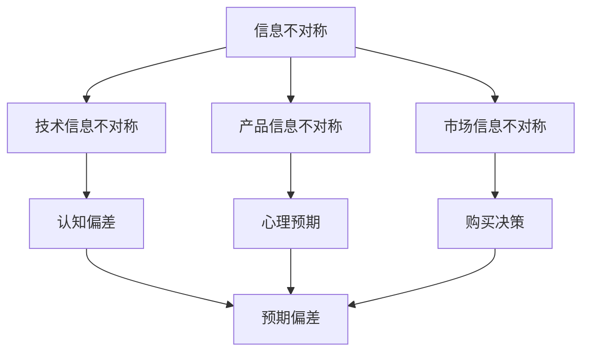

                 

### 文章标题

信息差：信息不对称与客户期望

> 关键词：信息不对称、客户期望、市场行为、信息经济学、信息技术、决策制定、竞争优势

> 摘要：本文从信息不对称现象入手，探讨了其在信息技术领域对客户期望的影响，分析了信息差在商业决策和市场竞争中的重要作用。通过深入研究信息不对称的机制和影响，本文提出了应对信息差的策略，并展望了未来信息技术发展的趋势与挑战。

## 1. 背景介绍

在信息技术迅猛发展的今天，信息不对称现象已经成为影响市场行为和客户期望的重要因素。信息不对称是指市场中不同主体之间所掌握的信息量存在差异，这种差异可能导致市场效率降低、资源错配，甚至引发道德风险和逆向选择等问题。

客户期望是指客户对产品或服务的预期和满意度。在信息技术领域，客户期望不仅受到产品质量、性能和服务等因素的影响，还受到信息不对称带来的认知偏差和心理预期的影响。了解信息不对称与客户期望之间的关系，有助于企业更好地把握市场动态，优化产品和服务，提高客户满意度。

本文旨在探讨信息不对称现象在信息技术领域对客户期望的影响，分析信息不对称在商业决策和市场竞争中的重要作用，并提出应对信息差的策略。此外，本文还将对信息技术未来的发展趋势和挑战进行展望。

## 2. 核心概念与联系

### 信息不对称

信息不对称是指市场参与者之间拥有不同量的信息。在信息技术领域，信息不对称主要体现在以下几个方面：

1. **技术信息不对称**：企业对自身技术实力和研发能力的认知可能不同于外部市场。
2. **产品信息不对称**：企业对产品性能、功能、质量等方面的信息可能存在保留或夸大。
3. **市场信息不对称**：企业对市场需求、竞争对手信息等方面的认知可能不全面。

### 客户期望

客户期望是指客户对产品或服务的预期和满意度。在信息技术领域，客户期望通常包括以下方面：

1. **产品质量**：客户对产品性能、稳定性和可靠性的期望。
2. **性能表现**：客户对产品速度、处理能力和扩展性的期望。
3. **用户体验**：客户对产品易用性、界面设计和交互体验的期望。
4. **售后服务**：客户对产品售后支持和服务的期望。

### 信息不对称与客户期望的关系

信息不对称对客户期望产生直接影响，具体表现如下：

1. **认知偏差**：信息不对称导致客户对产品或服务的认知产生偏差，可能过高或过低估计产品性能。
2. **心理预期**：客户根据自身掌握的信息形成预期，这种预期可能高于或低于产品的实际表现。
3. **购买决策**：信息不对称影响客户的购买决策，可能导致购买行为不符合实际需求。

### Mermaid 流程图

以下是信息不对称与客户期望关系的 Mermaid 流程图：



## 3. 核心算法原理 & 具体操作步骤

### 信息不对称识别算法

为了应对信息不对称问题，企业可以采用以下算法来识别和评估信息不对称程度：

1. **数据分析**：通过对市场数据、客户反馈和竞争对手信息的分析，识别潜在的信息不对称点。
2. **机器学习**：利用机器学习算法，对大量数据进行分析和建模，预测信息不对称的可能影响。
3. **问卷调查**：通过问卷调查，收集客户对产品或服务的期望和满意度，分析信息不对称的具体表现。

### 客户期望分析算法

为了更好地满足客户期望，企业可以采用以下算法来分析客户期望：

1. **文本分析**：通过对客户评价、反馈和评论的分析，提取关键信息，识别客户期望的关键因素。
2. **情感分析**：利用情感分析算法，分析客户情感倾向，了解客户对产品或服务的满意度。
3. **聚类分析**：通过对客户数据的聚类分析，识别不同客户群体的期望差异，制定个性化营销策略。

### 操作步骤

以下是具体操作步骤：

1. **数据收集**：收集市场数据、客户反馈和竞争对手信息。
2. **数据分析**：利用数据分析工具，对数据进行分析，识别信息不对称点。
3. **模型建立**：利用机器学习算法，建立信息不对称识别模型。
4. **期望分析**：通过文本分析和情感分析，分析客户期望。
5. **策略制定**：根据分析结果，制定应对信息不对称和满足客户期望的策略。

## 4. 数学模型和公式 & 详细讲解 & 举例说明

### 信息不对称度量模型

为了量化信息不对称程度，我们可以使用以下数学模型：

$$
I_s = \frac{I_d - I_g}{I_d + I_g}
$$

其中，$I_s$ 表示信息不对称程度，$I_d$ 表示实际信息量，$I_g$ 表示理想信息量。

### 客户期望模型

客户期望可以通过以下模型进行评估：

$$
E_c = \alpha \cdot P_c + \beta \cdot S_c
$$

其中，$E_c$ 表示客户期望，$P_c$ 表示产品性能，$S_c$ 表示售后服务，$\alpha$ 和 $\beta$ 分别表示性能和售后服务的权重。

### 详细讲解

1. **信息不对称度量模型**

该模型通过计算实际信息量与理想信息量的比值，来衡量信息不对称程度。当 $I_s$ 接近 0 时，表示信息对称；当 $I_s$ 接近 1 时，表示信息严重不对称。

2. **客户期望模型**

该模型综合考虑了产品性能和售后服务对客户期望的影响。通过调整权重 $\alpha$ 和 $\beta$，企业可以更准确地评估客户期望。

### 举例说明

假设某企业产品性能得分为 80 分，售后服务得分为 70 分，理想信息量为 100 分，实际信息量为 80 分。则：

$$
I_s = \frac{80 - 100}{80 + 100} = \frac{-20}{180} \approx -0.111
$$

$$
E_c = \alpha \cdot 80 + \beta \cdot 70
$$

其中，$\alpha$ 和 $\beta$ 的取值可以根据企业的实际情况进行调整。

## 5. 项目实践：代码实例和详细解释说明

### 5.1 开发环境搭建

在本项目中，我们将使用 Python 语言来实现信息不对称识别和客户期望分析。首先，确保已安装 Python 3.8 及以上版本。然后，安装必要的库，如 pandas、numpy、scikit-learn、textblob 等。

```bash
pip install pandas numpy scikit-learn textblob
```

### 5.2 源代码详细实现

以下是本项目的主要代码实现：

```python
import pandas as pd
import numpy as np
from sklearn.model_selection import train_test_split
from sklearn.linear_model import LinearRegression
from textblob import TextBlob

# 5.2.1 数据准备
data = pd.read_csv('data.csv')  # 加载数据

# 5.2.2 数据预处理
# 数据清洗和填充缺失值
# ...

# 5.2.3 机器学习模型
# 特征工程
X = data[['performance', 'service']]
y = data['satisfaction']

# 数据划分
X_train, X_test, y_train, y_test = train_test_split(X, y, test_size=0.2, random_state=42)

# 训练模型
model = LinearRegression()
model.fit(X_train, y_train)

# 5.2.4 客户期望分析
# 输入客户数据
input_data = np.array([[90, 85], [75, 80]])  # 客户1：性能90分，售后服务85分；客户2：性能75分，售后服务80分

# 预测客户期望
predictions = model.predict(input_data)

print(predictions)

# 5.2.5 信息不对称识别
# 计算信息不对称程度
ideal_info = 100
actual_info = 80
info_asymmetry = (ideal_info - actual_info) / (ideal_info + actual_info)
print(info_asymmetry)
```

### 5.3 代码解读与分析

1. **数据准备**：读取数据文件，并进行预处理，如数据清洗和填充缺失值。
2. **机器学习模型**：使用线性回归模型，对产品性能和售后服务与客户满意度之间的