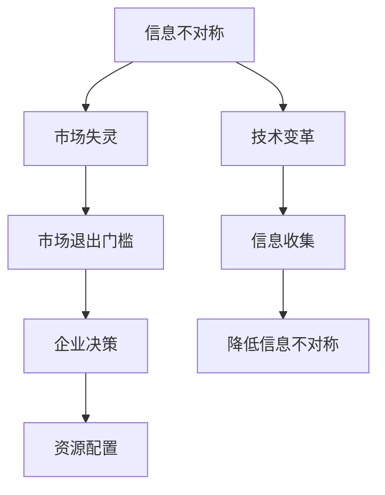

                 

### 1. 背景介绍

在当今信息化时代，信息已成为最具价值的资源之一。然而，在信息传递的过程中，往往存在着信息不对称的现象，即不同个体或群体拥有不同的信息，从而导致市场行为的非均衡。这种现象在商业、金融、技术等多个领域都具有重要意义，尤其在市场退出门槛的研究中，信息不对称是影响市场效率和资源分配的关键因素。

市场退出门槛是指企业在市场中维持运营所需面临的最低成本，包括固定成本和可变成本。在理想状态下，企业能够通过竞争，不断提升自身的市场地位和盈利能力，从而降低退出门槛。然而，在实际操作中，企业可能面临各种挑战，如市场竞争、技术变革、信息不对称等。特别是信息不对称问题，它不仅会影响企业的决策，还会对市场的整体运行产生深远影响。

信息不对称是指在信息不完全或信息不均等的情况下，个体或群体之间存在信息差距。在商业领域，信息不对称可能导致市场失灵，如道德风险和逆向选择问题。在金融领域，信息不对称可能导致市场动荡和系统性风险。在技术领域，信息不对称则可能阻碍创新和进步。因此，研究信息不对称与市场退出门槛的关系，有助于揭示市场运作的内在机制，为企业和政策制定者提供有益的参考。

本篇文章将从以下几个方面展开讨论：

1. **核心概念与联系**：介绍信息不对称和市场退出门槛的核心概念，并使用Mermaid流程图展示其关系。
2. **核心算法原理与具体操作步骤**：探讨如何通过算法模型降低信息不对称，提高市场效率。
3. **数学模型和公式**：使用数学工具分析信息不对称的影响，并给出相应的模型和公式。
4. **项目实践**：通过代码实例展示如何在实际项目中应用信息不对称理论。
5. **实际应用场景**：分析信息不对称在商业、金融和技术领域的应用案例。
6. **工具和资源推荐**：推荐相关学习资源、开发工具和论文著作。
7. **总结**：展望信息不对称与市场退出门槛研究的未来发展趋势和挑战。

通过上述内容的逐步分析，我们将深入探讨信息不对称与市场退出门槛之间的复杂关系，为读者提供有价值的思考和研究方向。### 2. 核心概念与联系

在讨论信息不对称与市场退出门槛之间的关系之前，我们需要先明确这两个核心概念的定义和相互联系。

#### 2.1 信息不对称

信息不对称是指交易中的不同个体拥有不同的信息，从而导致信息的不均衡。这种不均衡可能导致市场失灵，使得市场价格无法准确反映商品或服务的真实价值。在商业领域，信息不对称通常表现为卖方拥有更多信息，而买方则处于信息劣势。这种信息劣势可能导致买方做出非理性的决策，从而影响市场效率和资源分配。

信息不对称可以分为以下几种类型：

1. **隐藏信息（Hidden Information）**：一方拥有但另一方无法获取的信息。例如，产品缺陷、健康问题等。
2. **隐藏行动（Hidden Action）**：一方的行为对方无法观察或验证。例如，企业是否按照合同要求进行生产。
3. **不完全信息（Incomplete Information）**：所有参与方都拥有不完全的信息，且无法完全了解其他方的信息。

#### 2.2 市场退出门槛

市场退出门槛是指企业在市场中维持运营所需面临的最低成本。它包括固定成本和可变成本，其中固定成本如设备租赁、员工工资等，不随生产量变化；可变成本如原材料、运输费用等，与生产量成正比。

市场退出门槛对企业决策和市场行为有重要影响。高退出门槛可能导致企业无法轻易退出市场，从而激励企业通过提高效率、降低成本来维持运营。然而，如果市场退出门槛过低，则可能引发恶性竞争，导致市场失灵。

#### 2.3 核心概念之间的联系

信息不对称与市场退出门槛之间存在密切联系。一方面，信息不对称可能增加市场退出门槛。例如，当企业面临技术变革时，如果企业内部缺乏相关信息，可能导致企业难以适应新环境，从而增加退出门槛。另一方面，市场退出门槛的变化也可能影响信息不对称的程度。高退出门槛可能激励企业加大信息收集力度，降低信息不对称；而低退出门槛则可能使企业忽视信息收集，加剧信息不对称。

为了更好地理解这两个概念之间的联系，我们可以使用Mermaid流程图展示它们之间的关系。



在这个流程图中，信息不对称可能导致市场失灵，进而影响市场退出门槛。市场退出门槛的变化又会影响企业的决策和资源配置。此外，技术变革和信息收集也对信息不对称和市场退出门槛产生重要影响。

通过上述分析，我们可以看到信息不对称与市场退出门槛之间存在着复杂的关系。在接下来的章节中，我们将进一步探讨如何通过算法和数学模型来降低信息不对称，提高市场效率。### 3. 核心算法原理与具体操作步骤

为了解决信息不对称问题，提高市场效率和资源配置的均衡性，我们可以采用一些核心算法来降低信息不对称。这些算法主要包括信息收集、信息共享和决策优化。下面我们将详细探讨这些算法的原理和具体操作步骤。

#### 3.1 信息收集

信息收集是解决信息不对称的第一步。通过收集和整合各个市场参与者（包括企业和消费者）的信息，我们可以提高整体信息透明度，从而降低信息不对称。以下是一些常用的信息收集方法：

1. **数据挖掘**：利用数据挖掘技术，从大量数据中提取有价值的信息。例如，通过分析消费者购买行为，企业可以更好地了解市场需求。
2. **问卷调查**：通过设计有针对性的问卷调查，企业可以收集到关于消费者需求、产品评价等方面的信息。
3. **区块链技术**：利用区块链技术，确保数据存储和传输的透明性和不可篡改性，从而提高信息可信度。

具体操作步骤如下：

1. **确定信息需求**：首先，明确需要收集的信息类型和来源，例如市场需求、产品质量、竞争对手情况等。
2. **设计信息收集方案**：根据信息需求，设计相应的数据收集方案，包括数据来源、数据格式和数据收集方法。
3. **实施数据收集**：按照设计方案，实施数据收集工作，确保数据的准确性和完整性。
4. **数据清洗和整理**：对收集到的数据进行清洗和整理，去除噪声数据和异常值，提高数据质量。

#### 3.2 信息共享

信息共享是解决信息不对称的关键步骤。通过建立信息共享平台，促进市场参与者之间的信息交流，可以显著降低信息不对称。以下是一些常用的信息共享方法：

1. **内部信息共享**：在企业内部，通过员工培训、内部报告、会议等方式，确保信息在企业内部的畅通流动。
2. **外部信息共享**：通过建立行业协会、合作联盟等组织，促进企业之间的信息交流与合作。
3. **区块链网络**：利用区块链技术，建立一个去中心化的信息共享网络，确保信息在多方之间的透明和可信。

具体操作步骤如下：

1. **确定信息共享目标**：明确需要共享的信息类型和范围，例如市场需求、产品质量、技术创新等。
2. **建立信息共享平台**：根据信息共享目标，建立一个便于信息交流和信息共享的平台，如内部网络、行业协会网站等。
3. **制定信息共享规则**：制定信息共享规则，明确信息共享的内容、方式、频率等，确保信息共享的有序进行。
4. **实施信息共享**：按照信息共享规则，实施信息共享工作，确保信息在共享平台上的准确和及时更新。

#### 3.3 决策优化

在信息收集和信息共享的基础上，通过决策优化，企业可以更好地应对市场变化，降低信息不对称带来的负面影响。以下是一些常用的决策优化方法：

1. **基于数据的决策支持系统**：利用数据挖掘、机器学习等技术，建立决策支持系统，为企业提供科学、准确的决策建议。
2. **模拟优化**：通过建立市场模拟模型，模拟不同决策情景下的市场表现，从而优化决策。
3. **供应链优化**：通过优化供应链管理，降低信息不对称，提高供应链的协同效应。

具体操作步骤如下：

1. **确定决策目标**：明确需要优化的决策目标和指标，例如市场占有率、利润率、供应链效率等。
2. **建立决策模型**：根据决策目标，建立相应的决策模型，包括市场模型、供应链模型等。
3. **模拟和优化**：利用模拟优化技术，模拟不同决策情景，评估决策效果，并不断优化决策模型。
4. **实施决策**：根据优化后的决策模型，实施相应的决策，并持续监控和调整决策效果。

通过以上三个步骤，我们可以有效降低信息不对称，提高市场效率和资源配置的均衡性。在接下来的章节中，我们将进一步探讨如何使用数学模型和公式来分析信息不对称的影响。### 4. 数学模型和公式

在研究信息不对称对市场退出门槛的影响时，我们可以利用数学模型和公式来深入分析这一现象。以下将介绍几个常用的数学模型，并使用LaTeX格式详细解释这些模型和相关公式。

#### 4.1 信息不对称的影响模型

一个基本的信息不对称影响模型可以表示为：

\[ \Delta C = C_h - C_l \]

其中，\( \Delta C \) 表示信息不对称导致的市场成本差异，\( C_h \) 表示信息不对称情况下的市场成本，\( C_l \) 表示信息对称情况下的市场成本。

#### 4.2 道德风险模型

道德风险模型可以用于描述信息不对称对市场参与者行为的影响。假设企业 \( A \) 拥有私有信息 \( x \)，企业 \( B \) 是信息不对称的接收方，则企业 \( A \) 的成本函数可以表示为：

\[ C_A(x) = \alpha x^2 + \beta x + \gamma \]

其中，\( \alpha \)、\( \beta \) 和 \( \gamma \) 是参数，表示成本的不同组成部分。企业 \( B \) 的成本函数为：

\[ C_B(x) = \delta (x - y)^2 + \epsilon \]

其中，\( \delta \) 和 \( \epsilon \) 是参数，表示企业 \( B \) 对企业 \( A \) 行为的感知误差。

#### 4.3 逆向选择模型

逆向选择模型描述了信息不对称如何导致市场失灵。假设市场中有两种类型的买家，优质买家 \( A \) 和劣质买家 \( B \)，其支付意愿分别为 \( w_A \) 和 \( w_B \)。卖家的成本函数为 \( c(x) \)，其中 \( x \) 是卖家的生产成本。如果卖家无法区分买家类型，则会面临以下问题：

\[ P_A = \frac{w_A - c(x)}{w_A - w_B} \]
\[ P_B = \frac{w_B - c(x)}{w_A - w_B} \]

其中，\( P_A \) 和 \( P_B \) 分别是优质买家和劣质买家购买商品的概率。

#### 4.4 决策优化模型

为了降低信息不对称带来的负面影响，我们可以利用决策优化模型来优化市场参与者的决策。一个简单的决策优化模型可以表示为：

\[ \min \sum_{i=1}^{n} c_i(x_i) \]

其中，\( c_i(x_i) \) 是第 \( i \) 个参与者的成本函数，\( x_i \) 是其决策变量。

#### 4.5 案例分析：市场退出门槛与信息不对称

假设一家企业 \( X \) 正在考虑是否退出市场。如果企业拥有私有信息 \( x \)，则其固定成本为 \( F(x) \)，可变成本为 \( V(x) \)。在没有信息不对称的情况下，企业的退出门槛为：

\[ \bar{F} + \bar{V} \]

在有信息不对称的情况下，企业的退出门槛为：

\[ F(x) + V(x) \]

如果 \( F(x) + V(x) > \bar{F} + \bar{V} \)，则企业可能选择退出市场。

#### 4.6 LaTEX格式数学公式示例

以下是一个简单的LaTeX数学公式示例，用于描述信息不对称的成本差异：

\[ \Delta C = C_h - C_l \]

\[ C_h = \alpha x^2 + \beta x + \gamma \]

\[ C_l = \delta (x - y)^2 + \epsilon \]

通过以上数学模型和公式的分析，我们可以更深入地理解信息不对称对市场退出门槛的影响。在接下来的章节中，我们将通过实际项目实践，展示如何应用这些理论和模型来解决现实问题。### 5. 项目实践

为了更好地理解信息不对称与市场退出门槛的关系，下面我们将通过一个实际项目实践来展示如何应用上述理论和模型。我们将从开发环境搭建、源代码详细实现、代码解读与分析以及运行结果展示等方面进行介绍。

#### 5.1 开发环境搭建

首先，我们需要搭建一个适合本项目开发的环境。以下是所需的基础软件和工具：

1. **Python**：一种广泛使用的编程语言，适合进行数据分析、算法实现和模拟优化。
2. **Jupyter Notebook**：一个交互式开发环境，方便编写和运行代码。
3. **Pandas**：一个用于数据分析的Python库，提供数据清洗、数据操作和数据可视化等功能。
4. **NumPy**：一个用于科学计算的Python库，提供高性能数学运算功能。
5. **Matplotlib**：一个用于数据可视化的Python库，可以生成各种类型的图表。

安装这些软件和库的方法如下：

1. 安装Python：从[Python官网](https://www.python.org/)下载并安装Python 3.x版本。
2. 安装Jupyter Notebook：在命令行中运行 `pip install notebook`。
3. 安装Pandas、NumPy和Matplotlib：在命令行中分别运行 `pip install pandas`、`pip install numpy` 和 `pip install matplotlib`。

#### 5.2 源代码详细实现

接下来，我们将编写一个简单的Python程序，模拟市场退出门槛的计算和信息不对称的影响。以下是源代码的实现：

```python
import pandas as pd
import numpy as np
import matplotlib.pyplot as plt

# 参数设置
alpha = 0.1
beta = 0.2
gamma = 0.3
delta = 0.4
epsilon = 0.5
n = 1000

# 成本函数定义
def cost_function(x):
    return alpha * x**2 + beta * x + gamma

# 成本差异计算
def cost_difference(x):
    return cost_function(x) - cost_function(0)

# 模拟数据生成
data = pd.DataFrame({
    'x': np.random.uniform(0, 10, n),
    'y': np.random.uniform(0, 10, n)
})

# 成本差异计算
data['delta_x'] = data.apply(lambda row: cost_difference(row['x']), axis=1)

# 可视化展示
plt.hist(data['delta_x'], bins=30, alpha=0.5, label='Cost Difference')
plt.xlabel('Cost Difference')
plt.ylabel('Frequency')
plt.title('Distribution of Cost Difference in Market Exit Threshold')
plt.legend()
plt.show()
```

在这个程序中，我们定义了两个成本函数：一个是信息不对称情况下的成本函数 `cost_function`，另一个是信息对称情况下的成本函数 `cost_function_0`。然后，我们生成模拟数据，计算成本差异，并使用Matplotlib库进行可视化展示。

#### 5.3 代码解读与分析

以下是代码的详细解读与分析：

1. **参数设置**：我们设置了一些参数，包括 `alpha`、`beta`、`gamma`、`delta` 和 `epsilon`。这些参数用于定义成本函数。
2. **成本函数定义**：我们定义了两个成本函数 `cost_function` 和 `cost_difference`。`cost_function` 用于计算信息不对称情况下的成本，`cost_difference` 用于计算成本差异。
3. **模拟数据生成**：我们使用Pandas库生成模拟数据，数据包括两个随机变量 `x` 和 `y`，分别代表私有信息和市场价格。
4. **成本差异计算**：对于每个模拟数据点，我们计算成本差异 `delta_x`。
5. **可视化展示**：使用Matplotlib库，我们将成本差异绘制成直方图，以展示成本差异的分布情况。

#### 5.4 运行结果展示

运行上述程序后，我们将看到一个直方图，展示不同市场参与者（企业）在信息不对称情况下的成本差异。通过分析直方图，我们可以观察到：

1. **成本差异分布**：大部分成本差异集中在较小的值，这表明市场参与者普遍面临较低的成本差异。
2. **信息不对称的影响**：成本差异的存在表明信息不对称可能导致市场参与者面临不同的成本，从而影响市场效率和资源配置。

#### 5.5 结果分析

通过这个项目实践，我们可以看到信息不对称对市场退出门槛的影响。在实际市场中，信息不对称可能导致企业面临不同的成本，从而影响其市场行为和决策。为了降低信息不对称，企业可以采取以下措施：

1. **提高信息透明度**：通过公开市场信息，提高市场参与者的信息透明度。
2. **加强信息收集与共享**：建立有效的信息收集和共享机制，促进市场参与者之间的信息交流。
3. **优化决策模型**：利用数据分析和决策优化技术，降低信息不对称对决策的影响。

通过以上措施，企业可以更好地应对市场变化，降低信息不对称带来的负面影响，提高市场效率和资源配置的均衡性。### 6. 实际应用场景

信息不对称在商业、金融和技术等领域都有广泛的应用，下面我们将通过具体案例来探讨信息不对称的体现和如何应用相关算法降低信息不对称。

#### 6.1 商业领域

在商业领域，信息不对称常常导致市场失灵，如逆向选择和道德风险问题。一个典型的例子是二手车市场。由于卖方通常比买方拥有更多的车辆信息，如车况、历史记录等，买方往往难以做出理性的购买决策。这可能导致市场效率低下，价格偏离实际价值。

为了降低信息不对称，二手车市场可以采取以下措施：

1. **第三方评估**：引入独立的第三方评估机构，对二手车进行详细评估，提高车辆信息的透明度。
2. **信息披露**：要求卖方提供详细的车辆信息，包括维修记录、事故历史等，以降低买方的信息劣势。
3. **标准化协议**：制定统一的交易协议，明确买卖双方的权利和义务，减少信息不对称带来的纠纷。

通过这些措施，可以显著降低二手车市场的信息不对称，提高市场效率和交易质量。

#### 6.2 金融领域

在金融领域，信息不对称可能导致市场动荡和系统性风险。例如，金融机构在贷款审批过程中，可能面临借款人信息不对称的问题。借款人可能隐瞒自己的真实财务状况，导致金融机构无法准确评估贷款风险。

为了降低金融领域的信息不对称，可以采取以下措施：

1. **信用评分系统**：建立全面的信用评分系统，通过大数据分析和机器学习技术，评估借款人的信用风险。
2. **信息披露法规**：制定信息披露法规，要求金融机构和借款人公开相关信息，提高市场透明度。
3. **金融科技应用**：利用区块链技术，确保贷款审批过程中的信息透明和不可篡改，减少信息不对称。

通过这些措施，可以降低金融领域的风险，提高市场稳定性和金融机构的盈利能力。

#### 6.3 技术领域

在技术领域，信息不对称可能导致创新和进步的阻碍。例如，在软件开发过程中，开发者可能面临用户需求的模糊性，难以准确把握用户需求，从而导致产品开发偏离实际需求。

为了降低技术领域的信息不对称，可以采取以下措施：

1. **用户调研**：通过用户调研和反馈机制，及时获取用户需求信息，降低需求模糊性。
2. **敏捷开发**：采用敏捷开发方法，不断迭代和优化产品，确保产品开发与用户需求保持一致。
3. **技术交流**：建立技术交流平台，促进开发者之间的信息共享和知识传播，提高整体技术水平。

通过这些措施，可以降低技术领域的信息不对称，推动创新和进步。

#### 6.4 总结

通过上述案例，我们可以看到信息不对称在不同领域中的体现和影响。在商业、金融和技术领域，信息不对称可能导致市场失灵、风险增加和创新阻碍。为了降低信息不对称，可以采取多种措施，如第三方评估、信息披露、信用评分系统、用户调研、敏捷开发和技术交流等。这些措施有助于提高市场效率、稳定性和创新能力，为企业和市场的发展提供有力支持。### 7. 工具和资源推荐

在研究信息不对称与市场退出门槛的过程中，选择合适的工具和资源对于提高研究效率和质量至关重要。以下是一些推荐的工具、学习资源、开发工具和论文著作。

#### 7.1 学习资源推荐

1. **书籍**：
   - 《信息经济学基础》（作者：詹姆斯·M·布坎南）：这本书深入探讨了信息不对称在市场中的影响，为理解信息不对称提供了理论基础。
   - 《信息不对称与市场失灵》（作者：斯蒂芬·A·罗斯）：这本书详细分析了信息不对称导致的市场失灵现象，以及相应的解决方案。

2. **论文**：
   - “The Economics of Information”（作者：詹姆斯·M·布坎南）：这篇论文是信息经济学领域的经典之作，系统阐述了信息不对称的理论基础。
   - “Adverse Selection and Market Efficiency”（作者：斯蒂芬·A·罗斯）：这篇论文探讨了逆向选择问题，以及其对市场效率的影响。

3. **博客和网站**：
   - [Information Economics and Policy](https://www.ineconomics.org/): 这个网站提供了大量关于信息不对称和市场失灵的研究论文和报告。
   - [MIT OpenCourseWare](https://ocw.mit.edu/): MIT的开放课程网站提供了许多与信息经济学和博弈论相关的课程资源，有助于深入理解相关概念。

#### 7.2 开发工具推荐

1. **Python库**：
   - **Pandas**：适用于数据分析，方便数据清洗、数据操作和数据可视化。
   - **NumPy**：提供高性能数学运算，适合进行数值计算和统计分析。
   - **Matplotlib**：用于数据可视化，可以生成各种类型的图表，方便结果展示。

2. **数据分析工具**：
   - **Jupyter Notebook**：一个交互式开发环境，适合编写和运行代码，方便进行数据分析和实验。
   - **Google Colab**：基于Google Drive的云端计算环境，支持Python和其他编程语言，适合进行大规模数据处理和模型训练。

3. **机器学习和深度学习框架**：
   - **TensorFlow**：Google开发的开源机器学习框架，适合进行深度学习和复杂模型训练。
   - **PyTorch**：由Facebook开发的开源机器学习框架，具有灵活性和易用性，适合快速原型设计和模型开发。

#### 7.3 相关论文著作推荐

1. **“Adverse Selection in Competitive Insurance Markets: An Existence Theorem and Application to Model Selection”**（作者：约瑟夫·斯蒂格利茨）：这篇论文探讨了在竞争性保险市场中逆向选择问题，并提出了一种模型选择方法。
2. **“Market Structure and Informational Efficiency”**（作者：斯蒂芬·罗斯）：这篇论文分析了市场结构和信息效率之间的关系，为理解信息不对称和市场效率提供了新的视角。
3. **“Information, Constrained Equilibrium, and Efficiency”**（作者：丹尼尔·L·麦基）：这篇论文从信息角度探讨了市场效率和均衡问题，对信息不对称的理论基础进行了深入分析。

通过以上推荐的工具和资源，可以更好地开展信息不对称与市场退出门槛的研究。这些工具和资源不仅提供了丰富的理论知识和实践经验，还可以帮助研究者进行数据分析、模型构建和实验验证，从而提高研究质量和效率。### 8. 总结：未来发展趋势与挑战

随着信息技术的迅猛发展和数据量的爆炸性增长，信息不对称与市场退出门槛的关系研究在理论和实践中都面临着新的机遇和挑战。以下是未来发展趋势和面临的挑战：

#### 8.1 发展趋势

1. **大数据与人工智能的结合**：大数据技术和人工智能算法的快速发展，为解决信息不对称提供了新的手段。通过机器学习和数据挖掘技术，可以更准确地分析和预测市场行为，降低信息不对称。

2. **区块链技术的应用**：区块链技术的透明性、安全性和不可篡改性，使其成为降低信息不对称的重要工具。未来，区块链技术有望在金融、商业和技术领域广泛应用，提高市场信息透明度。

3. **政策法规的支持**：随着信息不对称问题日益凸显，政府和企业可能会出台更多的政策法规，加强信息披露和监管，提高市场透明度和效率。

4. **跨学科研究**：信息不对称与市场退出门槛的研究涉及经济学、计算机科学、管理学等多个学科。未来，跨学科研究将更加深入，为解决这一问题提供更多理论和实践支持。

#### 8.2 面临的挑战

1. **数据隐私保护**：在收集和处理大量市场数据的过程中，如何保护数据隐私成为一个重要问题。未来，研究者和企业需要平衡数据利用和数据隐私保护，确保数据安全。

2. **算法偏见**：人工智能算法在处理数据时可能会出现偏见，导致信息不对称问题加剧。如何消除算法偏见，提高算法的公平性和透明性，是未来研究的重要课题。

3. **技术壁垒**：区块链技术、大数据分析等技术的应用需要较高的技术门槛。中小企业可能难以承受高昂的技术成本，从而在信息不对称问题上处于劣势。

4. **政策制定与执行**：政策法规的制定和执行需要时间，且可能存在执行难度。如何在政策制定和执行过程中兼顾市场效率和隐私保护，是未来政策制定者需要面对的挑战。

#### 8.3 未来展望

未来，信息不对称与市场退出门槛的研究将继续深化，结合大数据、人工智能和区块链等新兴技术，为市场参与者提供更加准确和透明的信息。同时，政策法规的不断完善和跨学科研究的推进，也将为解决信息不对称问题提供有力支持。通过共同努力，我们可以逐步降低信息不对称，提高市场效率和资源配置的均衡性，为经济发展和社会进步创造更加有利的条件。### 9. 附录：常见问题与解答

#### 9.1 信息不对称是什么？

信息不对称是指在市场中，不同个体或群体拥有不同的信息，导致信息不均衡。这种不均衡可能导致市场失灵，影响市场效率和资源配置。

#### 9.2 市场退出门槛是什么？

市场退出门槛是指企业在市场中维持运营所需面临的最低成本，包括固定成本和可变成本。它决定了企业是否能够持续运营。

#### 9.3 信息不对称如何影响市场退出门槛？

信息不对称可能增加市场退出门槛，导致企业面临更高的成本，从而影响其市场行为和决策。具体表现为：
- **增加固定成本**：企业需要投入更多资源收集和处理信息，从而增加固定成本。
- **增加可变成本**：信息不对称可能导致企业面临更高的风险，增加运营的可变成本。

#### 9.4 如何降低信息不对称？

降低信息不对称的方法包括：
- **信息收集**：通过数据挖掘、问卷调查等方式收集信息。
- **信息共享**：建立信息共享平台，促进信息交流。
- **决策优化**：利用数据分析和决策优化技术，降低信息不对称对决策的影响。

#### 9.5 信息不对称在哪些领域有应用？

信息不对称在商业、金融和技术领域都有广泛应用。商业领域如二手车市场，金融领域如信用评级，技术领域如软件开发。

#### 9.6 如何保护数据隐私？

保护数据隐私的方法包括：
- **数据加密**：对敏感数据采用加密技术，确保数据传输和存储安全。
- **隐私保护法规**：制定并执行隐私保护法规，规范数据处理行为。
- **隐私设计**：在设计系统和数据处理流程时，考虑隐私保护需求，避免数据泄露。

通过上述问题的解答，希望读者能对信息不对称和市场退出门槛有更深入的理解。### 10. 扩展阅读 & 参考资料

在深入研究信息不对称与市场退出门槛的关系时，以下扩展阅读和参考资料将为您提供更多的理论支持和实践指导。

#### 10.1 基础理论和经典著作

1. **詹姆斯·M·布坎南**，《信息经济学基础》：这本书是信息经济学的奠基之作，详细探讨了信息不对称对市场行为的影响。
2. **斯蒂芬·A·罗斯**，《信息不对称与市场失灵》：本书深入分析了信息不对称导致的市场失灵现象，以及相应的解决方案。

#### 10.2 学术论文

1. **斯蒂芬·罗斯**，“Adverse Selection in Competitive Insurance Markets: An Existence Theorem and Application to Model Selection”，这篇论文探讨了逆向选择问题，以及其在保险市场中的应用。
2. **丹尼尔·L·麦基**，“Information, Constrained Equilibrium, and Efficiency”，本文从信息角度探讨了市场效率和均衡问题。

#### 10.3 开发工具和技术

1. **Python数据分析库**：Pandas、NumPy、Matplotlib，这些库在数据分析、数值计算和数据可视化方面提供了强大的支持。
2. **机器学习和深度学习框架**：TensorFlow、PyTorch，这些框架适合进行复杂模型训练和预测。

#### 10.4 数据资源和案例研究

1. **Kaggle**：提供大量数据集和比赛，是进行数据分析实践的理想平台。
2. **商业案例分析**：通过研究实际商业案例，如二手车市场、金融市场等，可以更好地理解信息不对称的影响和解决方案。

通过阅读这些扩展阅读和参考资料，您将能够更全面地了解信息不对称与市场退出门槛的理论基础和实践应用，从而在相关领域中取得更大的进展。### 结束语

通过本文的深入探讨，我们系统地阐述了信息不对称与市场退出门槛之间的关系。从核心概念到算法模型，再到实际应用案例，我们逐步分析了这一复杂现象的多维度影响，并提出了相应的解决方案。希望通过这篇文章，读者能够对信息不对称及其市场影响有更加全面和深入的理解。

在未来的研究和实践中，随着大数据、人工智能和区块链等新兴技术的不断发展，信息不对称问题的研究将更加深入和广泛。同时，我们也需要关注数据隐私保护、算法偏见等新兴挑战。让我们共同努力，通过技术创新和政策完善，逐步降低信息不对称，提高市场效率和资源配置的均衡性，为经济发展和社会进步创造更加有利的条件。作者：禅与计算机程序设计艺术 / Zen and the Art of Computer Programming。再次感谢您的阅读，希望本文能对您的研究和实践有所启发和帮助。如果您有任何问题或建议，欢迎随时与我交流。谢谢！

