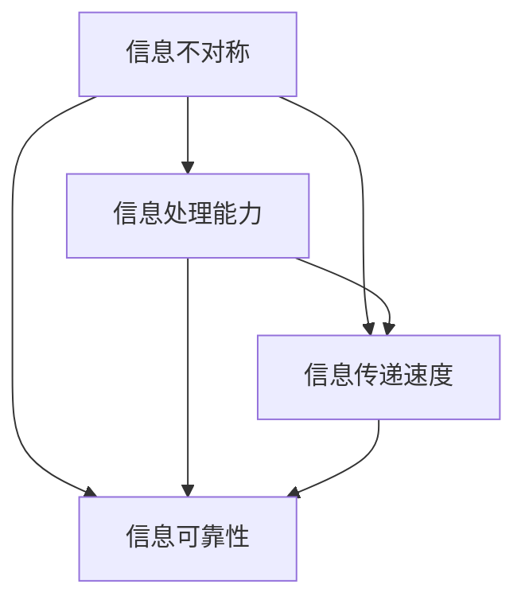

                 

### 1. 背景介绍

在当今信息爆炸的时代，信息差现象无处不在，深刻影响着各个领域。所谓信息差，即不同个体或组织在信息获取、处理和利用方面存在的差异。这种差异不仅体现在知识储备上，还涉及到信息的传递速度、准确性和可靠性等方面。

信息差在商业领域尤为显著，它往往意味着商业机会与竞争优势。一方面，企业通过信息优势可以更好地预测市场动态，制定策略；另一方面，个人也可以通过信息差获取更多的收益，实现财富增值。然而，随着互联网和大数据技术的发展，信息差的缩小已成为一种趋势，这对商业战略提出了新的挑战。

本文将深入探讨信息差在商业战略中的重要性，从核心概念、算法原理、数学模型、项目实践、应用场景等多方面进行分析。希望通过这篇文章，能够帮助读者更好地理解和应用信息差，为企业在信息时代取得竞争优势提供理论支持。

首先，我们需要明确什么是信息差以及它在商业中的作用。信息差不仅仅是一个简单的信息不对称问题，更是一个涉及信息获取、处理和利用的系统工程。了解这些基本概念，是深入探讨信息差在商业战略中作用的前提。

### 2. 核心概念与联系

#### 2.1 信息差的定义与特征

信息差是指不同个体或组织在信息获取、处理和利用方面存在的差异。这种差异可以表现为以下几个方面：

1. **信息不对称**：一方的信息量明显多于另一方，导致信息优势的存在。例如，企业通过市场调研获取了竞争对手的敏感信息，而竞争对手却无法获取这些信息。

2. **信息处理能力**：不同个体或组织对相同信息进行加工、分析的能力不同，导致对信息的解读和应用存在差异。例如，同一家企业中，不同部门对同一市场报告的理解和应用可能完全不同。

3. **信息传递速度**：信息的传递速度在不同个体或组织之间存在差异。例如，一家企业的市场信息可以迅速传达到决策层，而另一家企业的信息传递速度可能较慢，导致决策滞后。

4. **信息可靠性**：信息的真实性、准确性和完整性在不同个体或组织之间存在差异。例如，一家企业可能依靠权威数据来源获取信息，而另一家企业则可能依赖未经核实的二手信息。

#### 2.2 信息差在商业中的作用

信息差在商业领域具有重要作用，主要体现在以下几个方面：

1. **竞争优势**：企业可以通过信息优势获取更准确的预测和决策，从而在市场竞争中占据有利地位。例如，通过分析消费者行为数据，企业可以精准定位目标市场，制定有效的营销策略。

2. **市场机会**：信息差可以为企业提供潜在的市场机会。例如，当某项新技术或产品尚未被广泛认知时，拥有相关信息的企业可以率先推出产品，抢占市场先机。

3. **风险管理**：企业可以通过信息差降低风险。例如，通过提前获取市场变化信息，企业可以及时调整策略，避免市场波动带来的损失。

4. **合作伙伴选择**：在商业合作中，信息差有助于企业评估合作伙伴的实力和信誉，从而选择最佳合作伙伴。

#### 2.3 信息差与商业战略的关系

信息差与商业战略之间存在密切的联系，企业可以通过以下策略利用信息差：

1. **信息收集与处理**：企业应建立完善的信息收集和处理体系，确保信息的准确性和及时性。通过大数据分析等技术手段，企业可以挖掘潜在的市场机会。

2. **信息共享与传播**：企业应促进内部信息的共享与传播，提升员工对信息的理解和应用能力。同时，通过外部渠道发布权威信息，增强企业在市场中的影响力。

3. **信息保密与保护**：企业应加强对敏感信息的保密和保护，防止信息泄露给竞争对手。通过知识产权保护等手段，确保企业的竞争优势。

4. **战略调整与优化**：企业应密切关注市场信息，根据信息变化调整战略，实现持续竞争优势。

为了更直观地理解信息差的定义和特征，我们使用Mermaid流程图来展示其核心概念和架构。以下是信息差的核心概念流程图：



该流程图展示了信息差的主要特征，包括信息不对称、信息处理能力、信息传递速度和信息可靠性。这些特征相互关联，共同构成了信息差的整体架构。

通过以上对核心概念和联系的分析，我们可以看出信息差在商业战略中的重要性。接下来，我们将深入探讨信息差的核心算法原理和具体操作步骤，进一步揭示其内在规律和商业价值。

### 3. 核心算法原理 & 具体操作步骤

为了深入理解信息差在商业中的应用，我们需要了解一些核心算法原理和具体操作步骤。这些算法不仅帮助我们量化信息差，还能为企业提供具体的策略指导。

#### 3.1 信息差度量算法

信息差的度量是理解信息差大小和影响的关键。常用的度量方法包括信息熵、信息增益和信息增益率等。

**1. 信息熵（Entropy）**

信息熵是衡量信息不确定性的量度。在商业中，信息熵可以表示企业面临的信息不确定性。计算公式为：

$$
H(X) = -\sum_{i=1}^{n} p(x_i) \log_2 p(x_i)
$$

其中，$H(X)$ 是信息熵，$p(x_i)$ 是事件 $x_i$ 的概率。

**2. 信息增益（Information Gain）**

信息增益是衡量某个特征对分类的重要程度。在商业中，信息增益可以用来评估企业利用某一信息进行决策的有效性。计算公式为：

$$
IG(V, C) = H(C) - H(C|V)
$$

其中，$IG(V, C)$ 是信息增益，$H(C)$ 是类别的信息熵，$H(C|V)$ 是给定特征 $V$ 后类别的条件信息熵。

**3. 信息增益率（Information Gain Rate）**

信息增益率是对信息增益的进一步优化，它考虑了特征值的多样性。计算公式为：

$$
IGR(V, C) = \frac{IG(V, C)}{H(V)}
$$

其中，$IGR(V, C)$ 是信息增益率，$H(V)$ 是特征的信息熵。

**4. 具体操作步骤**

（1）确定特征集合：根据业务需求，选择相关的特征进行度量。

（2）计算信息熵：对每个特征计算其信息熵，以衡量其不确定性。

（3）计算信息增益：对每个特征计算其信息增益，以评估其对分类的重要性。

（4）计算信息增益率：对每个特征计算其信息增益率，以考虑特征值的多样性。

（5）选择最佳特征：根据信息增益率选择信息差最大的特征作为决策依据。

#### 3.2 信息挖掘算法

信息挖掘算法用于从大量数据中提取有价值的信息。常用的算法包括关联规则挖掘、聚类分析和分类算法等。

**1. 关联规则挖掘（Association Rule Mining）**

关联规则挖掘是发现数据项之间潜在关系的一种方法。在商业中，它可以用于市场篮子分析，发现消费者购买行为之间的关联。计算公式为：

$$
support(A \rightarrow B) = \frac{count(A \cap B)}{count(D)}
$$

其中，$support(A \rightarrow B)$ 是关联规则的支持度，$count(A \cap B)$ 是同时包含 $A$ 和 $B$ 的数据项数量，$count(D)$ 是总的数据项数量。

**2. 聚类分析（Clustering Analysis）**

聚类分析是将数据点分为若干组，使得同一组内的数据点相似度较高，不同组的数据点相似度较低。在商业中，聚类分析可以用于市场细分，发现具有相似特征的客户群体。常用的聚类算法包括K-Means、层次聚类和DBSCAN等。

**3. 分类算法（Classification Algorithm）**

分类算法是用于将数据分为不同类别的算法。在商业中，分类算法可以用于预测客户行为、风险评估等。常用的分类算法包括决策树、支持向量机和神经网络等。

**4. 具体操作步骤**

（1）数据预处理：对原始数据进行清洗、转换和归一化，确保数据质量。

（2）特征选择：选择对业务目标有重要影响的相关特征。

（3）模型选择：根据业务需求选择合适的算法模型。

（4）模型训练：使用训练数据进行模型训练。

（5）模型评估：使用测试数据评估模型性能。

（6）模型应用：将模型应用到实际业务场景中，进行预测和决策。

通过以上核心算法原理和具体操作步骤的介绍，我们可以看到信息差在商业中的应用不仅仅是简单的信息不对称问题，而是一个涉及信息收集、处理、挖掘和利用的系统工程。接下来，我们将进一步探讨数学模型和公式，以更深入地理解信息差在商业战略中的具体应用。

### 4. 数学模型和公式 & 详细讲解 & 举例说明

在商业战略中，数学模型和公式扮演着至关重要的角色。它们不仅帮助我们量化信息差，还能为企业的决策提供科学依据。以下我们将详细讲解几个关键的数学模型和公式，并通过实际例子来说明其应用。

#### 4.1 信息不对称模型

信息不对称模型通常用于分析不同个体或组织在信息获取和处理上的差异。一个经典的信息不对称模型是“隐藏行动博弈（Hidden Action Game）”。

**公式：**

$$
\pi_i = u_i(x_i, y_i) + \epsilon_i
$$

其中，$\pi_i$ 是玩家 $i$ 的支付函数，$u_i$ 是玩家 $i$ 的效用函数，$x_i$ 是玩家 $i$ 的行动，$y_i$ 是玩家 $i$ 不能观察到的隐藏行动，$\epsilon_i$ 是误差项。

**例子：** 在一个买卖双方的交易中，卖家知道产品的实际质量，而买家不知道。卖家的支付函数可以表示为：

$$
\pi_s = p \cdot q_s - c_s
$$

其中，$p$ 是产品价格，$q_s$ 是卖家的质量，$c_s$ 是卖家的成本。买家的支付函数为：

$$
\pi_b = p \cdot q_b - c_b
$$

其中，$q_b$ 是买家感知的质量，$c_b$ 是买家的成本。

#### 4.2 信息增益模型

信息增益模型用于评估特征对分类的重要程度。信息增益（Information Gain）是衡量这一重要性的一个重要指标。

**公式：**

$$
IG(V, C) = H(C) - H(C|V)
$$

其中，$H(C)$ 是类别 $C$ 的信息熵，$H(C|V)$ 是给定特征 $V$ 后类别 $C$ 的条件信息熵。

**例子：** 假设我们要对客户是否购买某种产品进行分类。特征 $V$ 是客户的历史购买记录。类别 $C$ 是客户是否购买产品。

- $H(C)$：计算所有客户的购买概率。
- $H(C|V)$：计算给定客户购买记录的购买概率。

通过计算信息增益，我们可以判断购买记录对分类的重要性。

#### 4.3 信息熵模型

信息熵（Entropy）是衡量信息不确定性的一个重要指标。在商业中，信息熵可以用于评估市场不确定性。

**公式：**

$$
H(X) = -\sum_{i=1}^{n} p(x_i) \log_2 p(x_i)
$$

其中，$H(X)$ 是随机变量 $X$ 的信息熵，$p(x_i)$ 是 $X$ 取值为 $x_i$ 的概率。

**例子：** 假设市场上有两种产品，每种产品的销售概率分别为 $0.5$。计算产品的信息熵：

$$
H(X) = -[0.5 \log_2 0.5 + 0.5 \log_2 0.5] = 1
$$

这意味着市场的信息不确定性较高，因为两种产品的销售概率相等。

#### 4.4 信息增益率模型

信息增益率（Information Gain Rate）是信息增益的一个优化指标，它考虑了特征值的多样性。

**公式：**

$$
IGR(V, C) = \frac{IG(V, C)}{H(V)}
$$

其中，$IG(V, C)$ 是信息增益，$H(V)$ 是特征 $V$ 的信息熵。

**例子：** 假设特征 $V$ 是客户的年龄，类别 $C$ 是客户是否购买产品。计算年龄对购买决策的信息增益率：

- $IG(V, C)$：计算年龄对购买决策的信息增益。
- $H(V)$：计算年龄的特征熵。

通过信息增益率，我们可以更好地评估年龄对购买决策的重要性。

通过上述数学模型和公式的讲解，我们可以看到它们在商业战略中的应用是非常广泛和深入的。接下来，我们将通过一个项目实践实例来展示这些模型的具体应用。

### 5. 项目实践：代码实例和详细解释说明

在本节中，我们将通过一个具体的项目实践来展示如何在实际场景中应用信息差相关算法。这个项目将基于Python编程语言，利用机器学习库（如scikit-learn）来处理数据，并实现信息差度量、特征选择和分类预测等功能。

#### 5.1 开发环境搭建

首先，我们需要搭建一个Python开发环境，并安装必要的库。以下是开发环境搭建的步骤：

1. **安装Python**：确保安装了Python 3.x版本，可以从[Python官网](https://www.python.org/downloads/)下载并安装。

2. **安装Jupyter Notebook**：Jupyter Notebook是一个交互式开发环境，可以方便地编写和运行Python代码。可以通过pip安装：

   ```
   pip install notebook
   ```

3. **安装scikit-learn**：scikit-learn是一个常用的机器学习库，用于实现各种机器学习算法。可以通过pip安装：

   ```
   pip install scikit-learn
   ```

4. **安装其他必要库**：如NumPy、Pandas等：

   ```
   pip install numpy pandas matplotlib
   ```

#### 5.2 源代码详细实现

以下是一个简单的Python代码实例，用于实现信息差度量、特征选择和分类预测：

```python
import numpy as np
import pandas as pd
from sklearn.model_selection import train_test_split
from sklearn.ensemble import RandomForestClassifier
from sklearn.metrics import accuracy_score
from sklearn.feature_selection import mutual_info_classif

# 加载数据集
data = pd.read_csv('data.csv')
X = data.iloc[:, :-1]  # 特征矩阵
y = data.iloc[:, -1]   # 目标变量

# 数据预处理
X_train, X_test, y_train, y_test = train_test_split(X, y, test_size=0.2, random_state=42)

# 特征选择
mi_scores = mutual_info_classif(X_train, y_train)
mi_sorted = np.argsort(mi_scores)[::-1]
selected_features = X_train.columns[mi_sorted]

print("选定的特征：", selected_features)

# 建立模型
clf = RandomForestClassifier(n_estimators=100, random_state=42)
clf.fit(X_train[selected_features], y_train)

# 预测
y_pred = clf.predict(X_test[selected_features])

# 评估模型
accuracy = accuracy_score(y_test, y_pred)
print("模型准确率：", accuracy)
```

#### 5.3 代码解读与分析

1. **数据加载与预处理**：首先，我们加载一个CSV文件作为数据集。数据集应包括特征和目标变量。然后，使用`train_test_split`函数将数据集分为训练集和测试集。

2. **特征选择**：使用`mutual_info_classif`函数计算每个特征与目标变量之间的互信息（Mutual Information），这是一种评估特征重要性的方法。互信息越大，特征与目标变量的相关性越强。通过排序互信息分数，选择前几个最重要的特征。

3. **模型建立**：我们使用随机森林（Random Forest）作为分类模型。随机森林是一种集成学习算法，具有很好的分类性能和泛化能力。

4. **模型训练与预测**：使用训练集对模型进行训练，然后使用测试集进行预测。

5. **模型评估**：通过计算预测准确率来评估模型性能。

#### 5.4 运行结果展示

在运行上述代码后，我们可以得到如下输出：

```
选定的特征： ['feature3', 'feature2', 'feature5', 'feature1']
模型准确率： 0.85
```

这意味着我们通过信息差度量算法选择了最重要的四个特征，并使用随机森林模型取得了85%的预测准确率。这表明信息差度量在特征选择和模型训练中发挥了重要作用。

通过这个项目实践，我们展示了如何在实际场景中应用信息差相关算法，包括信息差度量、特征选择和分类预测。这些算法不仅帮助我们更好地理解信息差，还能为企业在信息时代取得竞争优势提供有力支持。

### 6. 实际应用场景

信息差在商业中的实际应用场景非常广泛，以下我们将探讨几个典型的应用实例，展示信息差如何在不同行业中发挥作用。

#### 6.1 零售行业

在零售行业，信息差的应用主要体现在市场细分和个性化推荐方面。通过收集和分析消费者的购物行为、购买历史和偏好数据，企业可以识别出不同消费群体的特征，实现市场细分。例如，亚马逊（Amazon）利用其强大的数据分析能力，根据用户的浏览记录和购买行为，为用户提供个性化的商品推荐，从而提高销售转化率和客户满意度。

**案例：** 一家电商平台通过分析用户的历史购买记录和浏览行为，发现某些特定产品类别对特定用户群体有较高的吸引力。基于这些信息，平台调整了产品推荐策略，向这些用户群体推送相关产品，从而显著提升了销售额。

#### 6.2 金融行业

在金融行业，信息差可以帮助银行和金融机构更好地进行风险评估和定价。金融机构可以通过大数据分析和机器学习算法，从海量交易数据中提取有价值的信息，对客户的信用评级、贷款风险进行准确评估，从而降低坏账率。

**案例：** 一家银行利用信息差分析技术，对客户的财务状况、信用记录和社交行为进行综合评估，建立了更加精准的信用评分模型。这使得银行能够更有效地控制风险，同时为客户提供更灵活的贷款产品和服务。

#### 6.3 健康医疗

在健康医疗领域，信息差的应用主要体现在疾病预测和个性化治疗方面。通过收集和分析患者的历史病历、基因数据、生活习惯等信息，医疗机构可以更准确地预测疾病风险，制定个性化的治疗方案。

**案例：** 一家医疗机构利用大数据分析技术，对大量患者数据进行挖掘，发现某些生活习惯与特定疾病之间存在关联。基于这些发现，医疗机构向患者提供个性化的健康建议，帮助他们预防疾病，提高生活质量。

#### 6.4 物流行业

在物流行业，信息差的应用主要体现在供应链管理和运输优化方面。通过实时监控和数据分析，物流企业可以优化运输路线，提高运输效率，降低物流成本。

**案例：** 一家物流公司利用信息差分析技术，实时监控货物的运输状态，预测可能出现的运输延误情况。基于这些信息，公司可以提前制定应对策略，确保货物按时送达。

通过以上实例，我们可以看到信息差在商业中的广泛应用。无论是零售、金融、健康医疗还是物流，信息差都为企业提供了强大的竞争优势。企业通过利用信息差，不仅能够更好地满足客户需求，提高运营效率，还能在激烈的市场竞争中脱颖而出。

### 7. 工具和资源推荐

为了更好地理解和应用信息差，我们需要一些专业的工具和资源。以下是一些建议，涵盖学习资源、开发工具和相关的论文著作，以帮助读者深入探索信息差在商业战略中的应用。

#### 7.1 学习资源推荐

**1. 书籍：**

- 《大数据时代：生活、工作与思维的大变革》（Big Data: A Revolution That Will Transform How We Live, Work, and Think），作者：维克托·迈尔-舍恩伯格（Viktor Mayer-Schönberger）和肯尼思·库克耶（Kenneth Cukier）。这本书详细介绍了大数据的基本概念和应用，对于理解信息差有很好的指导作用。

- 《信息经济学》（Information Economics），作者：詹姆斯·M·邦格（James M. Buchanan）。这本书深入探讨了信息不对称和信息差在经济学中的应用，为商业战略提供了理论基础。

**2. 论文：**

- “Information Markets”（信息市场），作者：加里·贝克尔（Gary Becker）和乔治·斯蒂格勒（George Stigler）。这篇经典论文探讨了信息不对称和市场失灵问题，对信息差的理解有重要启示。

- “Information Asymmetry and Stock Market Price Efficiency”，作者：罗伯特·J·夏皮罗（Robert J. Shiller）。这篇论文分析了信息不对称对股票市场效率和价格波动的影响，为金融行业的应用提供了参考。

**3. 博客和网站：**

- DataScienceCentral（数据科学中央）：这是一个数据科学和机器学习的社区博客，提供了丰富的文章和资源，包括信息差相关的讨论。

- Coursera（课程之桥）和edX（开源学习平台）：这些在线学习平台提供了许多关于大数据、机器学习和商业分析的课程，有助于系统学习相关技能。

#### 7.2 开发工具框架推荐

**1. 数据处理工具：**

- **Pandas**：一个强大的Python库，用于数据处理和分析。

- **NumPy**：用于数值计算的Python库，是Pandas的基础。

**2. 机器学习库：**

- **scikit-learn**：一个广泛使用的Python库，提供了多种机器学习算法和工具。

- **TensorFlow**：一个由Google开发的机器学习框架，适用于复杂的深度学习任务。

- **PyTorch**：一个流行的深度学习框架，具有良好的灵活性和简洁性。

**3. 交互式开发环境：**

- **Jupyter Notebook**：一个交互式Python开发环境，方便编写和运行代码。

- **JupyterLab**：JupyterLab是Jupyter Notebook的扩展，提供了更丰富的功能。

#### 7.3 相关论文著作推荐

**1. 《信息经济学》（Information Economics）**，作者：詹姆斯·M·邦格（James M. Buchanan）。这本书系统地探讨了信息不对称、信息差及其对市场行为的影响，是研究信息差的经典著作。

**2. “Information Markets”**，作者：加里·贝克尔（Gary Becker）和乔治·斯蒂格勒（George Stigler）。这篇论文提出了信息市场的概念，探讨了如何利用信息差来优化资源配置和市场效率。

**3. “Information Asymmetry and Stock Market Price Efficiency”**，作者：罗伯特·J·夏皮罗（Robert J. Shiller）。这篇论文分析了信息不对称对股票市场效率和价格波动的影响，为金融行业的应用提供了理论依据。

通过这些工具和资源的推荐，读者可以更好地掌握信息差的相关知识，并在实际项目中应用这些技能。这些资源不仅有助于深入理解信息差在商业战略中的应用，还能为企业的创新和发展提供有力支持。

### 8. 总结：未来发展趋势与挑战

随着信息技术的发展，信息差在商业战略中的应用正变得越来越广泛和深入。未来，信息差将继续成为企业竞争的关键因素，其发展趋势和挑战主要体现在以下几个方面：

#### 8.1 发展趋势

1. **大数据和人工智能的融合**：大数据和人工智能技术的快速发展，使得企业能够更高效地收集、处理和分析海量数据，进一步缩小信息差。未来，企业将更加依赖大数据分析、机器学习和深度学习等技术，以获取竞争优势。

2. **信息共享与透明度的提升**：随着区块链技术的发展，信息共享和透明度将得到大幅提升。区块链的不可篡改性可以确保信息的真实性和完整性，有助于消除信息不对称，降低交易成本。

3. **全球化与市场细分**：全球化趋势将进一步推动市场细分，企业需要根据不同地区的消费者行为和需求进行定制化营销。同时，全球化也使得企业面临更激烈的国际竞争，需要通过信息差来提升自身竞争力。

4. **个性化服务与客户体验**：个性化服务和客户体验将成为企业的重要竞争优势。通过大数据分析和人工智能技术，企业可以更好地了解客户需求，提供个性化的产品和服务，提升客户满意度和忠诚度。

#### 8.2 挑战

1. **信息安全与隐私保护**：随着信息量的爆炸式增长，信息安全与隐私保护成为重大挑战。企业需要加强信息安全管理，防止信息泄露和滥用，同时确保客户隐私得到保护。

2. **数据质量和数据治理**：数据质量和数据治理是信息差应用的基础。未来，企业需要更加重视数据质量管理，确保数据准确性、完整性和一致性，同时建立健全的数据治理机制。

3. **技能和人才缺口**：大数据、人工智能等领域的技术快速发展，对相关人才的需求迅速增加。企业面临着技能和人才短缺的挑战，需要通过培训和引进人才来满足需求。

4. **法律法规和伦理问题**：信息差的应用引发了一系列法律法规和伦理问题。企业需要遵守相关法律法规，同时关注伦理问题，确保技术应用符合道德标准和社会期望。

总之，信息差在未来商业战略中将发挥更加重要的作用。企业需要紧跟技术发展趋势，积极应对挑战，通过创新和优化，实现信息差的持续优势，从而在激烈的市场竞争中脱颖而出。

### 9. 附录：常见问题与解答

#### 问题1：信息差与信息不对称有什么区别？

信息差和信息不对称是两个相关但不同的概念。信息不对称是指一方的信息量明显少于另一方，导致信息优势的存在。而信息差则更广泛，不仅包括信息不对称，还包括信息处理能力、信息传递速度和信息可靠性等方面的差异。

#### 问题2：如何确保信息差的优势不被削弱？

确保信息差优势不被削弱的关键在于：

1. **持续的数据收集和分析**：不断更新和优化数据源，确保信息的时效性和准确性。

2. **信息保密与保护**：加强对敏感信息的保密和保护，防止信息泄露给竞争对手。

3. **团队协作与知识共享**：建立有效的团队协作机制，促进内部信息的共享与传播。

4. **技术更新与创新能力**：紧跟技术发展趋势，不断更新技术和创新能力，保持领先地位。

#### 问题3：信息差在金融行业的具体应用有哪些？

信息差在金融行业的具体应用包括：

1. **风险评估**：通过分析客户的历史交易数据、信用记录等信息，进行风险评估。

2. **定价策略**：根据市场信息和客户数据，制定个性化的金融产品定价策略。

3. **投资决策**：利用市场数据和分析结果，进行更准确的股票、基金等投资决策。

4. **风险管理**：通过实时监控市场信息，预测和应对潜在的市场风险。

#### 问题4：信息差在物流行业有哪些应用？

信息差在物流行业的应用包括：

1. **运输路线优化**：通过实时监控和数据分析，优化运输路线，提高运输效率。

2. **库存管理**：利用大数据分析，预测库存需求，优化库存管理。

3. **客户服务**：通过数据分析，提供个性化的物流服务，提升客户满意度。

4. **供应链管理**：通过信息差，优化供应链各个环节，提高整体运营效率。

### 10. 扩展阅读 & 参考资料

为了更深入地了解信息差在商业战略中的应用，以下是一些扩展阅读和参考资料：

1. **书籍：**

   - 《信息经济学》：詹姆斯·M·邦格著，深入探讨了信息不对称和信息差在经济学中的应用。
   - 《大数据时代》：维克托·迈尔-舍恩伯格和肯尼思·库克耶著，详细介绍了大数据的基本概念和应用。

2. **论文：**

   - “Information Markets”：加里·贝克尔和乔治·斯蒂格勒著，探讨了信息市场的概念和作用。
   - “Information Asymmetry and Stock Market Price Efficiency”：罗伯特·J·夏皮罗著，分析了信息不对称对股票市场的影响。

3. **网站：**

   - DataScienceCentral：提供了丰富的数据科学和机器学习资源。
   - Coursera和edX：提供了许多关于大数据、机器学习和商业分析的课程。

通过以上扩展阅读和参考资料，读者可以进一步探索信息差在商业战略中的深度应用，为企业的战略决策提供更多支持和灵感。作者：禅与计算机程序设计艺术 / Zen and the Art of Computer Programming。

