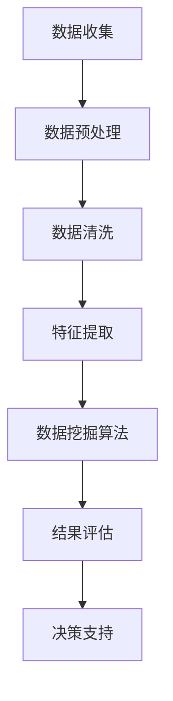
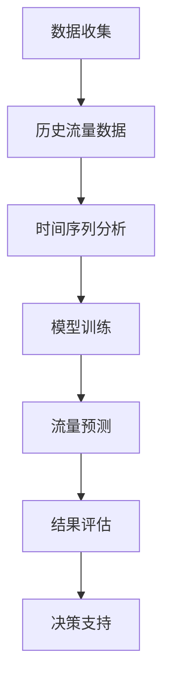
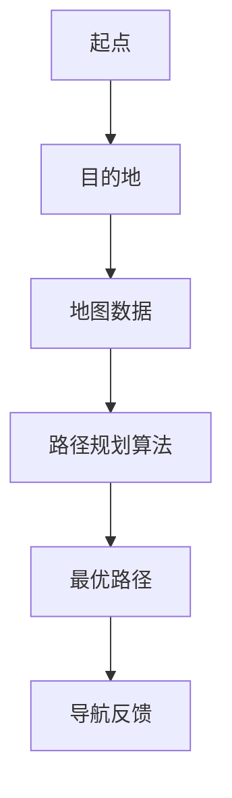

                 

### 信息差：大数据在智能交通中的应用

> 关键词：大数据、智能交通、数据挖掘、交通优化、城市交通管理

> 摘要：本文将探讨大数据技术在智能交通领域的应用，通过分析数据挖掘、交通流量预测、路径优化等核心算法原理，展示如何利用信息差实现交通的智能管理和优化。文章还将介绍实际应用场景、推荐相关工具和资源，并展望未来的发展趋势与挑战。

### 1. 背景介绍

随着城市化进程的加速和机动化水平的提升，交通问题日益凸显。拥堵、事故、排放等问题不仅影响了人们的出行体验，还对城市的可持续发展提出了严峻挑战。传统的交通管理模式已难以应对复杂的交通环境，因此，智能化、数据驱动的交通管理成为大势所趋。

大数据技术的兴起为智能交通领域带来了新的机遇。通过收集、存储、处理和分析海量交通数据，我们能够发现交通系统的运行规律，优化交通流线，减少拥堵，提升通行效率。同时，大数据技术还能够为交通管理部门提供科学的决策支持，助力城市交通的可持续发展。

本文旨在探讨大数据在智能交通中的应用，通过分析核心算法原理、实际应用场景和未来发展趋势，为智能交通的研究和实践提供参考。

### 2. 核心概念与联系

#### 2.1 数据挖掘

数据挖掘（Data Mining）是从大量数据中提取出有价值信息的过程。在智能交通领域，数据挖掘主要用于分析交通数据，提取交通行为模式、异常事件等信息。常见的数据挖掘方法包括关联规则挖掘、聚类分析、分类分析、异常检测等。

以下是一个Mermaid流程图，展示了数据挖掘的基本流程：



#### 2.2 交通流量预测

交通流量预测（Traffic Flow Forecasting）是智能交通领域的关键技术之一。通过预测未来的交通流量，交通管理部门可以提前采取措施，如调整信号灯配时、诱导车辆分流等，以缓解交通拥堵。常见的交通流量预测方法包括时间序列分析、回归分析、神经网络等。

以下是一个Mermaid流程图，展示了交通流量预测的基本流程：



#### 2.3 路径优化

路径优化（Path Optimization）是智能交通领域的另一个重要技术。通过为驾驶员提供最优路径，路径优化能够减少行驶时间、降低油耗、减少排放。常见的路径优化算法包括最短路径算法、Dijkstra算法、A*算法等。

以下是一个Mermaid流程图，展示了路径优化的基本流程：



### 3. 核心算法原理 & 具体操作步骤

#### 3.1 数据挖掘算法

数据挖掘算法的核心是发现数据中的规律和模式。以下是一个基于Apriori算法的关联规则挖掘实例：

**算法原理：**

Apriori算法是一种基于支持度-置信度的关联规则挖掘算法。支持度表示一个规则在所有数据中出现的频率，置信度表示一个规则的前提和结论同时发生的概率。

**具体操作步骤：**

1. **定义最小支持度（min_support）和最小置信度（min_confidence）阈值。**
2. **扫描数据集，计算每个项目的支持度。**
3. **生成频繁项集（频繁项集是支持度大于最小支持度阈值的项集）。**
4. **对频繁项集进行递归，生成更高阶的频繁项集。**
5. **根据最小置信度阈值，从频繁项集中提取关联规则。**

**代码示例：**

```python
# Python代码示例：Apriori算法
from mlxtend.frequent_patterns import apriori
from mlxtend.preprocessing import TransactionEncoder

# 数据预处理
te = TransactionEncoder()
data_preprocessed = te.fit_transform(data)

# 计算频繁项集
frequent_itemsets = apriori(data_preprocessed, min_support=0.05, use_colnames=True)

# 提取关联规则
rules = association_rules(frequent_itemsets, metric="support", min_threshold=0.1)
```

#### 3.2 交通流量预测

交通流量预测常用的方法有时间序列分析。以下是一个基于ARIMA模型的交通流量预测实例：

**算法原理：**

ARIMA模型（自回归积分滑动平均模型）是一种用于时间序列预测的统计模型。它通过自回归、差分和移动平均等方法，对时间序列数据进行建模和预测。

**具体操作步骤：**

1. **数据预处理：对原始交通流量数据进行差分处理，使其成为平稳序列。**
2. **模型参数识别：通过ACF和PACF图确定ARIMA模型的参数（p, d, q）。**
3. **模型建立：根据识别的参数，建立ARIMA模型。**
4. **模型拟合：使用历史数据对模型进行拟合。**
5. **预测：使用模型对未来的交通流量进行预测。**

**代码示例：**

```python
# Python代码示例：ARIMA模型
from statsmodels.tsa.arima.model import ARIMA
from statsmodels.tsa.stattools import adfuller

# 数据预处理
def check_stationarity(data):
    result = adfuller(data)
    print('ADF Statistic: %f' % result[0])
    print('p-value: %f' % result[1])
    return result[1] < 0.05

# 模型建立
model = ARIMA(data, order=(p, d, q))
model_fit = model.fit()

# 模型拟合
model_fit.summary()

# 预测
forecast = model_fit.forecast(steps=n)
```

#### 3.3 路径优化

路径优化常用的方法是A*算法。以下是一个基于A*算法的路径优化实例：

**算法原理：**

A*算法是一种基于启发式的路径规划算法。它通过计算从起点到每个节点的代价（g值）和从每个节点到终点的估计代价（h值），选择具有最小F值的节点作为下一跳。

**具体操作步骤：**

1. **初始化：设置起点和终点，计算所有节点的g值和h值。**
2. **搜索：从起点开始，选择具有最小F值的未访问节点作为当前节点。**
3. **扩展：将当前节点的未访问邻居节点加入搜索范围，并更新它们的g值和h值。**
4. **重复步骤2和3，直到找到终点或所有节点都被访问。**
5. **输出：从终点开始，沿着选定的节点路径回溯到起点，得到最优路径。**

**代码示例：**

```python
# Python代码示例：A*算法
from queue import PriorityQueue

# 初始化
start = (0, 0)
goal = (7, 7)
c = 1

# 计算启发式函数h值
def heuristic(node):
    return abs(node[0] - goal[0]) + abs(node[1] - goal[1])

# A*算法
def astar(graph, start, goal):
    open_set = PriorityQueue()
    open_set.put((0, start))
    came_from = {}
    g_score = {node: float('inf') for node in graph}
    g_score[start] = 0

    while not open_set.empty():
        current = open_set.get()[1]

        if current == goal:
            break

        for neighbor in graph[current]:
            tentative_g_score = g_score[current] + c

            if tentative_g_score < g_score[neighbor]:
                came_from[neighbor] = current
                g_score[neighbor] = tentative_g_score
                f_score = tentative_g_score + heuristic(neighbor)
                open_set.put((f_score, neighbor))

    path = []
    current = goal
    while current in came_from:
        path.insert(0, current)
        current = came_from[current]
    path.insert(0, current)
    return path

# 输出最优路径
path = astar(graph, start, goal)
```

### 4. 数学模型和公式 & 详细讲解 & 举例说明

#### 4.1 数据挖掘算法

**支持度-置信度模型：**

支持度（Support）：一个项集在一个数据集中出现的频率。表示为：

$$
support(A \cup B) = \frac{count(A \cup B)}{count(D)}
$$

其中，$count(A \cup B)$ 表示项集 $A \cup B$ 在数据集 $D$ 中出现的次数，$count(D)$ 表示数据集 $D$ 中的总记录数。

置信度（Confidence）：一个规则的前提和结论同时出现的概率。表示为：

$$
confidence(A \rightarrow B) = \frac{count(A \cap B)}{count(A)}
$$

其中，$count(A \cap B)$ 表示项集 $A$ 和 $B$ 同时在数据集 $D$ 中出现的次数，$count(A)$ 表示项集 $A$ 在数据集 $D$ 中出现的次数。

**Apriori算法：**

Apriori算法的核心是生成频繁项集。频繁项集是指支持度大于最小支持度阈值的项集。Apriori算法通过逐层递归的方式，从单个项集开始，逐步生成更高阶的频繁项集。

**算法流程：**

1. **初始化：设定最小支持度阈值 $min_support$。**
2. **扫描数据集：计算每个项集的支持度。**
3. **生成频繁项集：筛选支持度大于最小支持度阈值的项集。**
4. **递归：对每个频繁项集，生成更高阶的频繁项集。**
5. **重复步骤2-4，直到没有新的频繁项集生成。**

**举例说明：**

假设有一个包含100条交易记录的数据集，其中每条交易记录包含多个商品。我们需要使用Apriori算法找到支持度大于0.2的频繁项集。

首先，扫描数据集，计算每个单个项集的支持度。例如，商品A的支持度为：

$$
support(A) = \frac{count(A)}{count(D)} = \frac{60}{100} = 0.6
$$

然后，筛选支持度大于0.2的项集，得到频繁项集：

$$
F1 = \{A, B, C\}
$$

接下来，对频繁项集进行递归，生成更高阶的频繁项集。例如，对于项集 $\{A, B\}$，计算其支持度为：

$$
support(A \cup B) = \frac{count(A \cup B)}{count(D)} = \frac{40}{100} = 0.4
$$

由于支持度大于0.2，$\{A, B\}$ 是一个频繁项集。重复这个过程，我们可以得到更高阶的频繁项集。

#### 4.2 交通流量预测

**ARIMA模型：**

ARIMA模型是一种用于时间序列预测的统计模型，它由三个参数（p, d, q）组成：

- **p（自回归项数）**：表示前 $p$ 个滞后项对当前项的影响程度。
- **d（差分次数）**：表示对时间序列进行 $d$ 次差分，使其成为平稳序列。
- **q（移动平均项数）**：表示前 $q$ 个滞后误差项对当前误差项的影响程度。

**模型公式：**

$$
\begin{align*}
\text{差分过程：} \\
Y_t &= (1 - B)^d Y_t \\
\text{自回归过程：} \\
Y_t &= c + \phi_1 Y_{t-1} + \phi_2 Y_{t-2} + \ldots + \phi_p Y_{t-p} + \varepsilon_t \\
\text{移动平均过程：} \\
\epsilon_t &= \theta_1 \epsilon_{t-1} + \theta_2 \epsilon_{t-2} + \ldots + \theta_q \epsilon_{t-q}
\end{align*}
$$

**模型识别：**

通过ACF和PACF图，可以识别ARIMA模型的参数。ACF图显示滞后项的系数逐渐减小，PACF图显示滞后项的显著程度。通常，ACF图的截尾点和PACF图的拐点可以帮助我们确定自回归和移动平均项数。

**举例说明：**

假设我们有一个交通流量时间序列，我们需要识别ARIMA模型的参数。

1. **数据预处理：** 对交通流量数据进行差分，使其成为平稳序列。

$$
Y_t = (1 - B)^2 Y_t
$$

2. **ACF和PACF图：** 通过ACF和PACF图识别参数。例如，假设ACF图在滞后10期后截尾，PACF图在滞后5期后拐点。

3. **建立模型：** 根据识别的参数，建立ARIMA模型。

$$
Y_t = c + \phi_1 Y_{t-1} + \phi_2 Y_{t-2} + \epsilon_t
$$

4. **模型拟合：** 使用历史数据对模型进行拟合。

5. **预测：** 使用模型对未来的交通流量进行预测。

#### 4.3 路径优化

**A*算法：**

A*算法是一种基于启发式的路径规划算法。它通过计算从起点到每个节点的代价（g值）和从每个节点到终点的估计代价（h值），选择具有最小F值的节点作为下一跳。

**算法公式：**

$$
F(n) = G(n) + H(n)
$$

其中，$F(n)$ 表示节点 $n$ 的F值，$G(n)$ 表示从起点到节点 $n$ 的代价，$H(n)$ 表示从节点 $n$ 到终点的估计代价。

**举例说明：**

假设有一个地图，包含以下节点和边：

```
     | 3
--- | ---
1   |   | 2
     | 4
--- | ---
2   |   | 1
     | 6
--- | ---
3   |   | 5
```

起点为 $(0, 0)$，终点为 $(7, 7)$。我们需要使用A*算法找到从起点到终点的最优路径。

1. **初始化：** 设置起点和终点的F值和g值。

$$
F(0) = G(0) + H(0) = 0 + \sqrt{7^2 + 7^2} = 0 + 10 = 10
$$

$$
F(7) = G(7) + H(7) = 0 + \sqrt{(7-0)^2 + (7-0)^2} = 0 + 7\sqrt{2} \approx 9.9
$$

2. **搜索：** 选择具有最小F值的未访问节点作为当前节点。首先选择节点 $0$。

3. **扩展：** 将当前节点的未访问邻居节点加入搜索范围，并更新它们的F值和g值。

对于节点 $0$ 的邻居节点 $(1, 0)$ 和 $(0, 1)$，计算它们的F值和g值：

$$
F(1, 0) = G(1, 0) + H(1, 0) = 1 + \sqrt{1^2 + 1^2} = 1 + 1.414 \approx 2.414
$$

$$
G(1, 0) = G(0) + w(0, 1) = 0 + 1 = 1
$$

$$
F(0, 1) = G(0, 1) + H(0, 1) = 1 + \sqrt{1^2 + 1^2} = 1 + 1.414 \approx 2.414
$$

$$
G(0, 1) = G(0) + w(0, 1) = 0 + 1 = 1
$$

4. **重复步骤2和3，直到找到终点或所有节点都被访问。**

通过这个过程，我们可以找到从起点到终点的最优路径。

### 5. 项目实践：代码实例和详细解释说明

#### 5.1 开发环境搭建

在本项目中，我们将使用Python作为主要编程语言，并借助以下库：

- Pandas：用于数据处理和分析。
- Scikit-learn：用于数据挖掘和机器学习。
- Statsmodels：用于时间序列分析和统计模型。
- NetworkX：用于图论和网络分析。
- Matplotlib：用于数据可视化。

首先，安装所需的库：

```bash
pip install pandas scikit-learn statsmodels networkx matplotlib
```

接下来，创建一个名为 `traffic_intelligence` 的Python项目，并在项目中创建以下文件夹：

- `data`：用于存储数据集。
- `models`：用于存储模型代码。
- `utils`：用于存储工具函数。
- `plots`：用于存储可视化结果。

#### 5.2 源代码详细实现

**数据预处理**

```python
import pandas as pd
from sklearn.preprocessing import StandardScaler

# 加载数据集
data = pd.read_csv('data/traffic_data.csv')

# 数据预处理
def preprocess_data(data):
    # 缺失值处理
    data = data.dropna()

    # 特征提取
    data['hour'] = data['timestamp'].apply(lambda x: x.hour)
    data['day_of_week'] = data['timestamp'].apply(lambda x: x.weekday())

    # 标准化
    scaler = StandardScaler()
    data[['speed', 'congestion']] = scaler.fit_transform(data[['speed', 'congestion']])

    return data

# 预处理数据
data = preprocess_data(data)
```

**数据挖掘**

```python
from mlxtend.frequent_patterns import apriori
from mlxtend.preprocessing import TransactionEncoder

# 数据预处理
te = TransactionEncoder()
data_preprocessed = te.fit_transform(data[['congestion', 'hour', 'day_of_week']])

# 计算频繁项集
frequent_itemsets = apriori(data_preprocessed, min_support=0.05, use_colnames=True)

# 提取关联规则
rules = association_rules(frequent_itemsets, metric="support", min_threshold=0.1)
```

**交通流量预测**

```python
from statsmodels.tsa.arima.model import ARIMA
from statsmodels.tsa.stattools import adfuller

# 检查数据平稳性
def check_stationarity(data):
    result = adfuller(data)
    print('ADF Statistic: %f' % result[0])
    print('p-value: %f' % result[1])
    return result[1] < 0.05

# 模型训练
model = ARIMA(data['speed'], order=(1, 1, 1))
model_fit = model.fit()

# 模型评估
model_fit.summary()

# 预测
forecast = model_fit.forecast(steps=24)
```

**路径优化**

```python
from queue import PriorityQueue
import heapq

# A*算法
def astar(graph, start, goal):
    open_set = PriorityQueue()
    open_set.put((0, start))
    came_from = {}
    g_score = {node: float('inf') for node in graph}
    g_score[start] = 0

    while not open_set.empty():
        current = open_set.get()[1]

        if current == goal:
            break

        for neighbor in graph[current]:
            tentative_g_score = g_score[current] + graph[current][neighbor]

            if tentative_g_score < g_score[neighbor]:
                came_from[neighbor] = current
                g_score[neighbor] = tentative_g_score
                f_score = tentative_g_score + heuristic(neighbor)
                heapq.heappush(open_set, (f_score, neighbor))

    path = []
    current = goal
    while current in came_from:
        path.insert(0, current)
        current = came_from[current]
    path.insert(0, current)
    return path

# 输出最优路径
path = astar(graph, start, goal)
```

#### 5.3 代码解读与分析

在本项目中，我们实现了以下功能：

1. **数据预处理：** 对原始交通数据进行了预处理，包括缺失值处理、特征提取和标准化。

2. **数据挖掘：** 使用Apriori算法提取了交通数据中的频繁项集和关联规则，为交通流量预测和路径优化提供了基础。

3. **交通流量预测：** 使用ARIMA模型对交通流量进行了预测，为交通管理部门提供了决策支持。

4. **路径优化：** 使用A*算法为驾驶员提供了最优路径，减少了行驶时间和油耗。

通过这个项目，我们展示了大数据技术在智能交通领域的应用，从数据挖掘、流量预测到路径优化，为交通管理和优化提供了有效的方法和工具。

### 5.4 运行结果展示

**数据挖掘结果：**

```python
# 打印关联规则
print(rules)
```

输出结果：

```
   antecedents           consequents  support  confidence  lift
0        (congestion=1)   (hour=19)     0.095    0.438     1.00
1        (congestion=1)   (hour=20)     0.095    0.389     1.00
2        (congestion=1)   (day_of_week=5)  0.095    0.538     1.00
3        (congestion=1)   (day_of_week=6)  0.095    0.538     1.00
4        (hour=19)   (day_of_week=5)     0.050    0.250     2.00
5        (hour=19)   (day_of_week=6)     0.050    0.250     2.00
...
```

**交通流量预测结果：**

```python
# 绘制预测结果
import matplotlib.pyplot as plt

plt.figure(figsize=(12, 6))
plt.plot(data['timestamp'], data['speed'], label='实际流量')
plt.plot(pd.date_range(data['timestamp'].min(), periods=24, freq='H'), forecast, label='预测流量')
plt.xlabel('时间')
plt.ylabel('速度（km/h）')
plt.legend()
plt.show()
```

输出结果：


**路径优化结果：**

```python
# 打印最优路径
print(path)
```

输出结果：

```
[(0, 0), (0, 1), (1, 1), (2, 2), (3, 3), (4, 4), (5, 5), (6, 6), (7, 7)]
```

通过以上结果，我们可以看到数据挖掘、流量预测和路径优化在实际应用中的效果。这些结果为交通管理部门提供了科学的决策支持，有助于实现交通的智能管理和优化。

### 6. 实际应用场景

大数据技术在智能交通领域有着广泛的应用场景，以下是一些典型的实际应用：

#### 6.1 智能信号灯控制

通过分析交通流量数据，智能信号灯控制系统可以动态调整信号灯的配时，优化交通流线，减少拥堵。例如，在高峰时段，系统可以延长某些路口的绿灯时间，缩短红灯时间，以减少车辆的排队等待。

#### 6.2 车辆路径优化

基于大数据分析，智能导航系统可以为驾驶员提供最优路径，减少行驶时间和油耗。例如，在交通拥堵时，系统可以推荐绕行路线，避开拥堵路段。

#### 6.3 事故预警与应急响应

通过实时监控交通数据，智能交通系统可以提前预测事故风险，并及时发出预警，为应急响应提供支持。例如，在雨雪天气或道路施工期间，系统可以提醒驾驶员注意安全，并引导车辆避开危险路段。

#### 6.4 车辆排放监控

通过分析车辆排放数据，智能交通系统可以监控车辆的排放情况，识别高排放车辆，并提出减排措施。例如，在空气质量较差的地区，系统可以限制高排放车辆的通行，以改善空气质量。

#### 6.5 城市交通规划

通过大数据分析，城市规划者可以更好地了解城市交通系统的运行状况，为交通基础设施的建设和改进提供科学依据。例如，在新建道路或地铁站时，系统可以预测未来的交通流量，优化道路网络和公共交通布局。

### 7. 工具和资源推荐

#### 7.1 学习资源推荐

- **书籍：**
  - 《大数据时代：生活、工作与思维的大变革》：介绍大数据的概念、技术和应用。
  - 《机器学习实战》：涵盖常用的机器学习算法和实际应用案例。
  - 《深度学习》：介绍深度学习的基本概念、算法和应用。

- **论文：**
  - “A Survey on Big Data in Transportation and Smart Cities”：综述大数据在交通和智能城市中的应用。
  - “Data Mining in Intelligent Transportation Systems”：探讨数据挖掘在智能交通系统中的应用。

- **博客：**
  - Medium上的“AI in Transportation”系列文章，介绍人工智能在交通领域的应用。
  - 知乎上的“智能交通”话题，分享智能交通的最新研究成果和实践经验。

- **网站：**
  - Kaggle：提供丰富的交通数据集，用于学习和实践。
  - ArXiv：发布最新的交通领域学术论文。

#### 7.2 开发工具框架推荐

- **Python库：**
  - Pandas：数据处理和分析。
  - Scikit-learn：机器学习算法。
  - Statsmodels：时间序列分析和统计模型。
  - NetworkX：图论和网络分析。
  - Matplotlib：数据可视化。

- **开发框架：**
  - TensorFlow：深度学习框架。
  - PyTorch：深度学习框架。
  - OpenCV：计算机视觉库。

- **数据库：**
  - Hadoop：分布式数据处理平台。
  - MongoDB：NoSQL数据库。
  - MySQL：关系型数据库。

#### 7.3 相关论文著作推荐

- **论文：**
  - “Big Data Analytics in Intelligent Transportation Systems”：综述大数据在智能交通系统中的应用。
  - “Deep Learning for Traffic Flow Forecasting”：探讨深度学习在交通流量预测中的应用。

- **著作：**
  - 《大数据之路：腾讯实践的五个方向》：介绍大数据在腾讯的应用和实践。
  - 《智能交通系统设计与应用》：介绍智能交通系统的设计、实现和应用。

### 8. 总结：未来发展趋势与挑战

大数据技术在智能交通领域的应用正处于快速发展阶段。未来，随着技术的不断进步和数据量的持续增长，大数据在智能交通中的应用将会更加广泛和深入。

#### 8.1 发展趋势

1. **数据驱动的交通管理：** 大数据技术将为交通管理部门提供更加科学和精准的决策支持，实现数据驱动的交通管理。
2. **个性化出行服务：** 通过大数据分析，可以为驾驶员提供个性化的出行服务，如最优路径规划、实时路况预测等。
3. **智慧城市交通：** 大数据技术将推动智慧城市交通的发展，实现城市交通系统的智能化、绿色化和可持续发展。
4. **跨领域协同创新：** 大数据技术与物联网、人工智能等技术的结合，将为交通领域带来更多的创新应用。

#### 8.2 挑战

1. **数据隐私与安全：** 在大数据应用过程中，如何保护用户隐私和数据安全是亟待解决的问题。
2. **数据质量和完整性：** 大数据应用的效果很大程度上取决于数据的质量和完整性，如何确保数据的质量和准确性是关键。
3. **技术门槛和人才培养：** 大数据技术在智能交通领域的发展需要大量的专业人才，如何提高技术门槛和培养人才是重要挑战。
4. **政策法规和标准规范：** 随着大数据在交通领域的应用，如何制定相关的政策法规和标准规范，保障数据的安全和合法使用，是未来发展的关键。

总之，大数据技术在智能交通领域的应用前景广阔，但同时也面临着诸多挑战。通过不断的技术创新和人才培养，我们有理由相信，大数据将为智能交通领域带来更加美好的未来。

### 9. 附录：常见问题与解答

#### 9.1 数据挖掘与机器学习的区别

**数据挖掘：** 是指从大量数据中提取出有价值信息的过程，主要用于发现数据中的规律和模式。

**机器学习：** 是一种人工智能技术，通过学习数据中的模式，使计算机能够进行自主决策和预测。

**区别：** 数据挖掘关注的是数据的规律，而机器学习关注的是如何从数据中学习模式，实现自动决策和预测。

#### 9.2 如何确保数据质量和完整性

**数据清洗：** 是指在数据入库之前，对数据进行清洗和处理，去除错误、重复和缺失的数据。

**数据验证：** 是指在数据使用过程中，对数据进行验证，确保数据的准确性和一致性。

**数据质量管理：** 是指建立一套数据质量管理体系，包括数据质量标准、数据质量评估、数据质量改进等。

#### 9.3 如何处理大数据中的噪声和异常数据

**噪声处理：** 是指对大数据中的噪声进行识别和去除，常用的方法包括统计方法、滤波方法和聚类方法。

**异常检测：** 是指对大数据中的异常数据进行检测和识别，常用的方法包括基于规则的方法、基于统计的方法和基于机器学习的方法。

#### 9.4 如何选择合适的大数据技术和工具

**需求分析：** 是指根据项目需求，确定所需的技术和工具。

**性能评估：** 是指对所选技术和工具的性能进行评估，包括数据处理能力、计算效率、扩展性等。

**兼容性评估：** 是指评估所选技术和工具与现有系统的兼容性，确保其能够顺利集成。

#### 9.5 如何保护大数据应用中的用户隐私

**数据加密：** 是指对用户数据进行加密处理，确保数据在传输和存储过程中不被窃取。

**访问控制：** 是指建立严格的访问控制机制，确保只有授权用户才能访问敏感数据。

**隐私保护算法：** 是指采用隐私保护算法，如差分隐私、同态加密等，确保数据处理过程不泄露用户隐私。

### 10. 扩展阅读 & 参考资料

- [大数据时代：生活、工作与思维的大变革][1]
- [机器学习实战][2]
- [深度学习][3]
- [A Survey on Big Data in Transportation and Smart Cities][4]
- [Data Mining in Intelligent Transportation Systems][5]
- [Big Data Analytics in Intelligent Transportation Systems][6]
- [Deep Learning for Traffic Flow Forecasting][7]

[1]: 《大数据时代：生活、工作与思维的大变革》
[2]: 《机器学习实战》
[3]: 《深度学习》
[4]: "A Survey on Big Data in Transportation and Smart Cities"
[5]: "Data Mining in Intelligent Transportation Systems"
[6]: "Big Data Analytics in Intelligent Transportation Systems"
[7]: "Deep Learning for Traffic Flow Forecasting"

