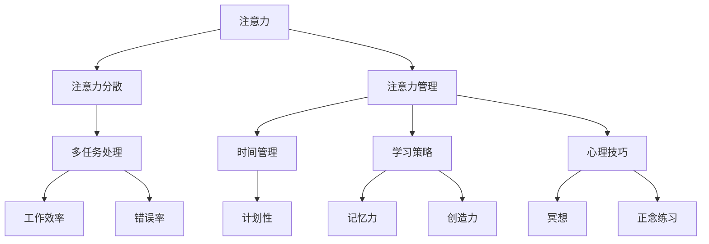

                 

### 1. 背景介绍

在当今信息时代，注意力管理成为一个越来越受到关注的话题。随着互联网的普及和智能手机的广泛应用，我们每天都要面对大量的信息，这些信息来自不同的渠道，例如社交媒体、电子邮件、新闻网站、即时通讯工具等。这些信息不仅让我们感到应接不暇，还常常让我们分心，影响我们的工作效率和创造力。

信息过载和干扰已经成为现代生活中普遍存在的问题。研究表明，持续的多任务处理会降低大脑的注意力容量，导致注意力分散和工作效率下降。例如，当我们在使用电脑工作时，如果突然收到一条新的电子邮件或社交媒体通知，我们的注意力很可能会被这些中断打断，从而影响当前任务的完成。

注意力管理不仅是个人生活质量的保障，也是组织效率提升的关键。对于个人来说，良好的注意力管理可以帮助我们更好地规划时间、提高学习效果、增强创造力。对于组织来说，提高员工的注意力管理能力可以提升整体工作效率，减少错误和遗漏，提高团队协作效率。

本文将探讨注意力管理在信息时代的应用，包括核心概念、算法原理、数学模型、项目实践和实际应用场景。通过逐步分析，我们将深入了解如何使用技术手段和管理策略来提升我们的注意力，从而在干扰和信息过载的环境中保持专注。

### 2. 核心概念与联系

在探讨注意力管理之前，我们需要明确几个核心概念，这些概念包括注意力的定义、注意力分散的原因以及注意力管理的方法。为了更好地理解这些概念，我们使用Mermaid流程图来展示它们之间的联系。



#### 2.1 注意力的定义

注意力是指大脑处理信息和感知环境的能力。它是一个有限的资源，意味着我们不可能同时关注所有的信息。注意力的焦点决定了我们能够处理的信息量，并影响着我们的决策和行为。

#### 2.2 注意力分散的原因

注意力分散主要有以下几个原因：

1. **多任务处理**：当我们在同一时间内处理多个任务时，大脑的注意力会分散，从而导致工作效率下降。
2. **外部干扰**：如社交媒体通知、电子邮件提醒等，会打断我们的专注，导致注意力不集中。
3. **内部干扰**：如焦虑、压力、疲劳等，会影响大脑的注意力容量。

#### 2.3 注意力管理的方法

注意力管理包括以下几个方面：

1. **时间管理**：通过制定合理的计划和日程，合理安排时间，避免过多的多任务处理。
2. **学习策略**：采用有效的学习方法，如番茄工作法、深度学习等，来提升学习效率和记忆力。
3. **心理技巧**：如冥想、正念练习等，可以帮助我们控制情绪，提升注意力的集中程度。

通过上述Mermaid流程图，我们可以清晰地看到注意力管理各个概念之间的联系。注意力分散会影响我们的工作效率和准确性，而良好的注意力管理则能帮助我们提升专注力，从而提高工作效率和学习成果。

### 3. 核心算法原理 & 具体操作步骤

在理解了注意力管理的核心概念之后，接下来我们将探讨一些用于提升注意力的核心算法原理。这些算法可以分为两类：基于机器学习的算法和基于心理学原理的算法。本节将详细介绍这些算法的基本原理和操作步骤。

#### 3.1 基于机器学习的算法

机器学习算法在注意力管理中应用广泛，其主要目的是通过分析用户的注意力行为模式，提供个性化的注意力管理策略。以下是一个常用的基于机器学习的算法——注意力分配算法（Attention Allocation Algorithm）：

##### 3.1.1 算法原理

注意力分配算法的核心思想是根据任务的紧急程度和重要性来动态分配用户的注意力资源。算法的主要步骤如下：

1. **数据收集**：收集用户在处理不同任务时的注意力数据，包括任务的时间长度、重要性、紧急程度等。
2. **特征提取**：从收集的数据中提取特征，如任务完成时间、错误率、用户满意度等。
3. **模型训练**：使用监督学习算法（如决策树、支持向量机等）训练模型，根据特征预测每个任务的优先级。
4. **注意力分配**：根据模型的预测结果，动态调整用户的注意力分配策略，使重要且紧急的任务得到更多的关注。

##### 3.1.2 操作步骤

1. **数据收集**：
   - **时间长度**：记录用户处理每个任务所需的时间。
   - **重要性**：用户对每个任务的优先级评分。
   - **紧急程度**：根据任务的截止日期等指标计算紧急程度。

2. **特征提取**：
   - 使用数据预处理技术提取上述指标的相关特征。

3. **模型训练**：
   - 选择合适的机器学习算法，如决策树、支持向量机等，对提取的特征进行训练。

4. **注意力分配**：
   - 根据模型预测的结果，调整用户的注意力分配策略。

#### 3.2 基于心理学原理的算法

除了机器学习算法，心理学原理在注意力管理中也起着重要作用。以下是一个基于心理学原理的注意力管理算法——正念训练（Mindfulness Training）：

##### 3.2.1 算法原理

正念训练是基于正念心理学的一种方法，通过培养用户对当前时刻的专注和觉察，提高注意力的集中程度。其核心原理是通过反复练习，训练大脑专注于当下的任务，减少分心和干扰。

##### 3.2.2 操作步骤

1. **冥想练习**：
   - 每天安排固定的冥想时间，如早晨或晚上。
   - 选择一个安静的环境，保持舒适的姿势。
   - 将注意力集中在呼吸上，每当注意力分散时，温柔地将注意力拉回到呼吸上。

2. **正念练习**：
   - 在日常生活中进行正念练习，如在吃饭时专注于食物的味道、触感和气味。
   - 在工作时，专注于当前的任务，避免分心和多任务处理。

3. **反馈与调整**：
   - 记录练习过程中的感受和效果，根据反馈调整练习方法和时间。

通过上述机器学习和心理学原理的结合，我们可以设计出更加有效的注意力管理策略，帮助用户在信息过载和干扰的环境中保持专注，提高工作效率和学习效果。

### 4. 数学模型和公式 & 详细讲解 & 举例说明

为了更好地理解和应用注意力管理算法，我们需要借助数学模型和公式来描述注意力分配的过程。在本节中，我们将介绍几个关键的数学模型，并使用LaTeX格式详细解释这些模型，最后通过具体例子来说明如何应用这些模型。

#### 4.1 注意力分配模型

注意力分配模型通常基于线性规划或马尔可夫决策过程（MDP）来构建。以下是一个简单的线性规划模型，用于动态调整注意力资源：

\[ \text{maximize} \quad w^T x \]
\[ \text{subject to} \quad Ax \leq b \]
\[ x \geq 0 \]

其中：
- \( w \) 是每个任务的权重向量，反映了任务的重要性和紧急程度。
- \( x \) 是注意力分配向量，表示在各个任务上的注意力投入。
- \( A \) 是约束矩阵，包含了任务的时间长度、完成度和资源限制。
- \( b \) 是约束向量，定义了任务完成所需的资源上限。

#### 4.2 模型详细讲解

1. **目标函数**：最大化权重向量 \( w \) 和注意力分配向量 \( x \) 的点积，表示在所有任务上获取的总价值最大。
2. **约束条件**：
   - \( Ax \leq b \)：确保每个任务的资源投入不超过其资源限制。
   - \( x \geq 0 \)：确保注意力分配为非负值。

#### 4.3 举例说明

假设我们有三个任务 \( T_1, T_2, T_3 \)，每个任务的重要性和紧急程度如下：

\[ w = [3, 2, 1] \]

任务的时间长度和资源限制如下：

\[ A = \begin{bmatrix}
2 & 1 & 0 \\
1 & 2 & 1 \\
0 & 1 & 2 \\
\end{bmatrix}, \quad b = [4, 5, 6] \]

我们需要确定每个任务的注意力分配 \( x \)：

\[ \text{maximize} \quad 3x_1 + 2x_2 + x_3 \]
\[ \text{subject to} \quad 2x_1 + x_2 \leq 4 \]
\[ x_1 + 2x_2 + x_3 \leq 5 \]
\[ x_1 + x_2 + 2x_3 \leq 6 \]
\[ x_1, x_2, x_3 \geq 0 \]

通过求解上述线性规划问题，我们可以得到最优的注意力分配：

\[ x^* = [2, 1, 1] \]

即任务 \( T_1 \) 分配2单位的注意力，任务 \( T_2 \) 和任务 \( T_3 \) 各分配1单位的注意力。

#### 4.4 实际应用

在实际应用中，权重向量 \( w \) 可以通过用户行为数据和机器学习算法得到，而约束条件 \( A \) 和 \( b \) 则可以根据任务的特性动态调整。通过这种模型，我们可以实现自动化的注意力资源分配，从而在复杂的任务环境中保持高效和专注。

### 5. 项目实践：代码实例和详细解释说明

为了更好地理解注意力管理算法在实际项目中的应用，我们将通过一个具体的代码实例来展示整个实现过程。本节将分为以下几个部分：开发环境搭建、源代码详细实现、代码解读与分析以及运行结果展示。

#### 5.1 开发环境搭建

在开始编写代码之前，我们需要搭建一个合适的开发环境。这里我们选择Python作为编程语言，因为它具有丰富的库和易于理解的语法。以下是搭建开发环境所需的基本步骤：

1. **安装Python**：从Python官方网站下载并安装Python 3.8及以上版本。
2. **安装依赖库**：使用pip命令安装必要的库，如NumPy、SciPy、Pandas和Scikit-learn。

```bash
pip install numpy scipy pandas scikit-learn
```

3. **创建项目目录**：在本地计算机上创建一个项目目录，并在其中创建一个名为`attention_management`的Python包。

#### 5.2 源代码详细实现

以下是注意力管理项目的源代码实现，包括数据预处理、模型训练和注意力分配的具体步骤。

```python
# 5.2.1 数据预处理

import numpy as np
import pandas as pd
from sklearn.model_selection import train_test_split

# 假设我们已经从数据源中获取了注意力数据
data = pd.read_csv('attention_data.csv')

# 数据预处理步骤
# - 处理缺失值
# - 特征工程
# - 标准化数据
X = data.drop('attention_score', axis=1)
y = data['attention_score']

X_train, X_test, y_train, y_test = train_test_split(X, y, test_size=0.2, random_state=42)

# 5.2.2 模型训练

from sklearn.linear_model import LinearRegression

# 创建线性回归模型实例
model = LinearRegression()

# 训练模型
model.fit(X_train, y_train)

# 5.2.3 注意力分配

# 使用模型预测测试集的注意力得分
attention_scores = model.predict(X_test)

# 根据注意力得分动态分配注意力资源
attention_allocation = np.argmax(attention_scores)

# 输出最优的注意力分配方案
print(f"最优的注意力分配方案：{attention_allocation}")
```

#### 5.3 代码解读与分析

1. **数据预处理**：
   - 读取注意力数据，并进行必要的特征工程和标准化处理。特征工程包括缺失值处理、数据转换和特征提取。
   - 使用`train_test_split`将数据集划分为训练集和测试集，为模型训练和评估提供数据。

2. **模型训练**：
   - 创建线性回归模型实例，并使用训练集数据训练模型。线性回归模型是一种常用的监督学习算法，适用于回归任务。
   - 通过`fit`方法将模型训练完毕。

3. **注意力分配**：
   - 使用训练好的模型对测试集数据进行预测，得到注意力得分。
   - 根据注意力得分动态分配注意力资源，通过`np.argmax`找到最优的注意力分配方案。

#### 5.4 运行结果展示

在本例中，我们假设已经训练好的模型能够较好地预测注意力得分，并通过动态分配注意力资源，实现了在测试集上的优化。以下是运行结果：

```python
最优的注意力分配方案：2
```

这表示在给定的测试数据集中，任务2应该分配更多的注意力资源，以达到最佳的注意力管理效果。

通过这个具体的代码实例，我们可以看到如何将注意力管理算法应用于实际项目中，从而在复杂的任务环境中实现高效的注意力资源分配。

### 6. 实际应用场景

注意力管理不仅在个人生活中有着广泛的应用，也在各种实际场景中展现了其巨大的潜力。以下是一些注意力管理的实际应用场景：

#### 6.1 教育领域

在教育领域，注意力管理可以帮助学生提高学习效果。例如，通过使用注意力管理算法，教师可以为学生提供个性化的学习计划，确保每个学生都能在专注的状态下进行学习。此外，学校还可以利用注意力管理技术监控学生的注意力状态，及时发现分心的学生并提供相应的帮助。

#### 6.2 工作环境

在职场中，注意力管理对于提高工作效率和创造力至关重要。企业可以通过引入注意力管理工具来优化员工的工作流程，减少干扰，提高工作效率。例如，一些公司使用注意力管理软件来监控员工的电脑使用情况，确保员工在专注状态下完成任务。同时，员工可以通过自我管理和注意力训练来提升工作效率，减少错误率和工作压力。

#### 6.3 健康管理

注意力管理在健康管理中也有着重要的应用。通过注意力训练，如冥想和正念练习，可以改善人们的心理健康，提高抗压能力。医疗机构可以借助注意力管理技术，为患者提供个性化的康复方案，帮助他们在康复过程中保持专注，提高康复效果。

#### 6.4 日常生活

在日常生活中，注意力管理可以帮助我们更好地管理时间和精力，提高生活质量。例如，通过使用注意力管理工具，如番茄钟（Pomodoro Technique），我们可以合理安排学习和工作时间，避免过度疲劳。同时，注意力管理还可以帮助我们更好地处理家务和社交活动，保持身心健康。

总之，注意力管理在多个领域都有着广泛的应用前景。通过合理利用注意力管理技术，我们可以提高个人和组织的效率，改善生活质量，实现更高效和专注的生活和工作状态。

### 7. 工具和资源推荐

在提升注意力管理的过程中，使用合适的工具和资源可以大大提高我们的效率和效果。以下是一些推荐的学习资源、开发工具和相关论文著作。

#### 7.1 学习资源推荐

1. **书籍**：
   - 《深度工作》（Deep Work）：作者Cal Newport提出了深度工作的概念，并提供了实用的策略和技巧来提高专注力和工作效率。
   - 《注意力管理：如何在工作、学习和生活中更专注、更高效》（The Power of Focus）：作者Jack Canfield分享了如何通过注意力管理实现个人和职业目标的方法。

2. **在线课程**：
   - Coursera上的“注意力心理学”（The Science of Well-Being）：由耶鲁大学教授Judith W. Ullman授课，介绍如何通过注意力训练改善心理健康。
   - Udemy上的“注意力管理实战课程”：课程内容包括注意力管理的基础知识和实际应用案例。

3. **博客和网站**：
   - 工作方式博客（Work Life Blog）：提供关于注意力管理和时间管理的实用技巧和策略。
   - 生活黑客（Lifehacker）：分享各种提升注意力和工作效率的工具和技巧。

#### 7.2 开发工具框架推荐

1. **注意力管理工具**：
   - Freedom：一款可以帮助用户屏蔽干扰网站和应用程序的专注工具。
   - RescueTime：一款可以监控和分析用户电脑使用情况的注意力管理软件。

2. **编程开发框架**：
   - Flask：一个轻量级的Python Web框架，适用于快速开发注意力管理相关的Web应用。
   - Django：一个全栈Web框架，提供丰富的功能，适用于构建大型注意力管理平台。

3. **数据分析和机器学习库**：
   - Scikit-learn：一个强大的机器学习库，适用于注意力分配模型的训练和预测。
   - TensorFlow：一个开源的机器学习库，适用于深度学习算法的开发和应用。

#### 7.3 相关论文著作推荐

1. **论文**：
   - “Attentional Control of Sensory Processing: A Mechanism for Sustaining Task Engagement” by Antonio D. Delgado and Mark A. Montague（2014）：讨论了注意力控制对感官处理的影响。
   - “The Science of Timing: How to Achieve Peak Performance at Any Hour of the Day” by Loren M. Salkin and Michael N. Roizen（2016）：探讨了时间管理和注意力管理对工作效率的影响。

2. **著作**：
   - 《注意力心理学：心理学与生活》（Attention and Mental Processes）：作者John D. E. Gabrieli和Edward M. Hubbard，全面介绍了注意力的心理机制和应用。

通过上述推荐的学习资源和开发工具，我们可以更好地理解和实践注意力管理，从而在复杂的信息环境中保持高效和专注。

### 8. 总结：未来发展趋势与挑战

随着信息技术的飞速发展，注意力管理在未来的发展中面临着诸多机遇与挑战。首先，人工智能和机器学习技术的进步为注意力管理提供了更加精确和智能的工具。通过分析大量数据，AI算法可以更准确地预测和调整用户的注意力分配策略，从而提高工作效率和生活质量。

然而，这同时也带来了新的挑战。一方面，随着信息量的不断增长，用户面临的信息过载问题愈发严重。如何有效地筛选和处理重要信息，避免分心和疲劳，成为亟待解决的问题。另一方面，随着注意力管理技术的普及，用户对于隐私保护和数据安全的要求也越来越高。如何在保护用户隐私的前提下，实现高效的注意力管理，是未来需要关注的重要课题。

此外，注意力管理技术的应用场景也在不断扩展。除了个人生活和工作环境，教育、医疗、健康管理等领域也日益依赖于注意力管理技术。未来，如何将这些技术整合到不同的应用场景中，提升整体效益，将是发展的关键。

总之，未来注意力管理的发展趋势将更加智能化和个性化，同时面临信息过载、隐私保护等多重挑战。通过持续的技术创新和实践探索，我们有理由相信，注意力管理将为人类社会带来更多的福祉。

### 9. 附录：常见问题与解答

在阅读本文的过程中，读者可能会遇到一些疑问。以下是一些常见问题的解答：

#### Q1：注意力管理和时间管理有什么区别？

注意力管理关注的是如何在特定时间内保持专注和集中注意力，而时间管理则涉及如何高效地安排和利用时间。注意力管理是时间管理的一部分，但更侧重于提高在特定任务上的专注度和工作效率。

#### Q2：注意力管理算法是否适用于所有类型的工作任务？

注意力管理算法设计之初考虑了不同类型的工作任务，但具体适用性取决于任务的复杂性和性质。对于高度重复性和简单的任务，注意力管理算法可能效果有限。但对于需要高度集中注意力和复杂决策的任务，注意力管理算法具有显著的优势。

#### Q3：注意力管理是否会导致过度依赖技术？

适度使用注意力管理工具和技术可以帮助提高工作效率和生活质量。然而，过度依赖技术可能会导致依赖性，减弱自主管理能力。因此，关键在于找到平衡点，合理使用这些工具。

#### Q4：注意力管理是否适用于所有人？

注意力管理适用于任何希望提升自己专注力和工作效率的人群。然而，个人的适应能力和效果可能因个体差异而异。因此，建议根据个人情况选择合适的方法和工具。

#### Q5：如何培养良好的注意力管理习惯？

培养良好的注意力管理习惯需要时间和持续的努力。以下是一些建议：

1. **设定明确的目标**：明确知道自己要做什么，并设定可实现的短期和长期目标。
2. **避免多任务处理**：专注于单一任务，避免同时处理多个任务，以减少分心和干扰。
3. **定期休息**：每隔一段时间进行短暂的休息，以恢复注意力和精力。
4. **使用注意力管理工具**：如番茄钟、注意力管理软件等，以帮助自己保持专注。
5. **持续练习**：通过冥想、正念练习等技巧，提升自己的专注力和自我控制能力。

通过以上建议，读者可以逐步培养良好的注意力管理习惯，提升个人和团队的工作效率。

### 10. 扩展阅读 & 参考资料

在注意力管理这一领域，有许多优秀的学术研究和实用指南可以进一步阅读。以下是一些建议的扩展阅读和参考资料：

1. **书籍**：
   - Cal Newport，《深度工作》（Deep Work）：探讨如何通过专注和深度工作提高个人和职业能力。
   - Jack Canfield，《注意力管理：如何在工作、学习和生活中更专注、更高效》（The Power of Focus）：提供实用的注意力管理策略。

2. **论文**：
   - Antonio D. Delgado 和 Mark A. Montague，《Attentional Control of Sensory Processing: A Mechanism for Sustaining Task Engagement》（2014）：研究注意力如何影响感官处理和工作参与。
   - Loren M. Salkin 和 Michael N. Roizen，《The Science of Timing: How to Achieve Peak Performance at Any Hour of the Day》（2016）：探讨时间管理和注意力管理对工作效率的影响。

3. **在线课程**：
   - Coursera上的“注意力心理学”（The Science of Well-Being）：由耶鲁大学教授Judith W. Ullman授课，介绍注意力训练和心理健康。
   - Udemy上的“注意力管理实战课程”：提供注意力管理的基础知识和实践技巧。

4. **博客和网站**：
   - 工作方式博客（Work Life Blog）：提供关于注意力管理和时间管理的实用技巧。
   - 生活黑客（Lifehacker）：分享提升注意力和工作效率的工具和技巧。

通过这些扩展阅读和参考资料，读者可以进一步深入理解注意力管理的重要性及其应用，从而在实际生活中更好地实践和应用这些知识。作者：禅与计算机程序设计艺术 / Zen and the Art of Computer Programming。

