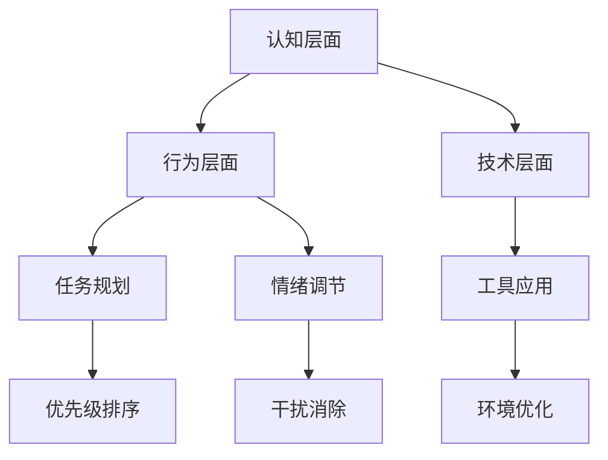

                 

### 1. 背景介绍

在当今信息时代，随着互联网的迅猛发展和数字化技术的普及，我们面临着一个前所未有的挑战：注意力管理。在大量的信息过载和无处不在的干扰中，如何有效地管理和分配我们的注意力，成为了一个关乎个人效率和生产力的重要问题。

注意力管理不仅仅是一个个人层面的挑战，它对企业、教育机构和社会的运作也产生了深远的影响。对个人而言，有效的注意力管理能够提高工作效率、减少压力、提升学习和创新能力。对企业而言，良好的注意力管理策略能够增强团队协作效率、优化项目进度、提高市场竞争力。在教育领域，注意力管理能力对学生学习成果和创新思维的发展至关重要。

然而，在日常生活中，我们经常发现自己被各种干扰所困扰，比如社交媒体的推送、手机的铃声、电子邮件的提示、同事的打扰等。这些干扰不仅分散了我们的注意力，还使我们难以集中精力完成重要的任务。根据一项研究，现代办公室员工平均每天被中断大约 60 次，每次中断平均持续 3 分钟，这使得员工每天真正用于任务的时间只有约 2.5 小时。这种低效的注意力分配严重影响了我们的工作和生活质量。

因此，本文旨在探讨注意力管理在信息时代的挑战，并提出一系列有效的策略和方法，帮助我们在干扰和信息过载的环境中保持专注和高效。通过了解这些策略，读者可以更好地管理自己的注意力，提高个人和团队的效率。

### 2. 核心概念与联系

#### 2.1 注意力管理

注意力管理是指一系列策略和技巧，帮助个体在分散的干扰环境中保持专注，有效地分配注意力资源。其核心目标是提高个人的工作效率和生活质量。注意力管理不仅涉及时间管理，还包括情绪管理、认知负荷管理和任务切换技巧。

#### 2.2 干扰与信息过载

干扰是指任何分散我们注意力的外部刺激，包括社交媒体通知、电子邮件、电话铃声、同事的交谈等。信息过载则是指我们接收到的信息量超过了我们的处理能力，导致我们难以筛选和消化。

#### 2.3 注意力管理原理

注意力管理依赖于几个关键原理：

- **有限资源理论**：人的注意力资源是有限的，无法同时处理大量信息。
- **优先级排序**：明确任务的优先级，将注意力集中在最重要的任务上。
- **情绪调节**：保持积极的心态，避免负面情绪对注意力的干扰。
- **环境优化**：创造一个有利于专注的工作环境，减少干扰。

#### 2.4 注意力管理架构

注意力管理的架构可以从以下几个层面来考虑：

1. **认知层面**：提高认知能力和信息处理效率。
2. **行为层面**：通过特定行为习惯来管理注意力，如定时休息、避免多任务处理。
3. **技术层面**：利用技术工具，如待办事项清单、提醒应用等，来帮助管理注意力。

#### Mermaid 流程图

以下是一个简化的 Mermaid 流程图，展示了注意力管理的基本流程：



在这个流程图中，认知层面、行为层面和技术层面相互交织，共同构成了一个综合的注意力管理体系。通过合理的任务规划、情绪调节、工具应用和环境优化，我们可以有效地管理注意力，提高工作和生活质量。

### 3. 核心算法原理 & 具体操作步骤

#### 3.1 注意力分配算法

注意力分配算法是注意力管理中的核心算法，其基本原理是基于任务的紧急程度和重要性来动态调整注意力资源。以下是该算法的具体操作步骤：

##### 3.1.1 输入参数

- **任务列表**：包含所有需要完成的任务的列表。
- **任务属性**：每个任务的紧急程度、重要性和所需时间。

##### 3.1.2 算法步骤

1. **初始化**：将所有任务按照紧急程度和重要性进行初步排序。
2. **优先级计算**：为每个任务计算一个优先级分数，分数越高，任务的优先级越高。
3. **动态调整**：根据当前任务的进展情况和剩余时间，动态调整每个任务的优先级分数。
4. **资源分配**：将注意力资源分配给优先级最高的任务。
5. **循环**：定期检查任务进展，根据需要重新分配注意力资源。

##### 3.1.3 实例说明

假设有一个包含四个任务的列表，任务属性如下：

| 任务 | 紧急程度 | 重要性 | 需要时间 |
| ---- | -------- | ------ | -------- |
| 任务A | 高       | 中     | 2小时    |
| 任务B | 中       | 高     | 3小时    |
| 任务C | 低       | 低     | 1小时    |
| 任务D | 高       | 高     | 4小时    |

首先，按照紧急程度和重要性对任务进行初步排序：

| 任务 | 紧急程度 | 重要性 | 需要时间 |
| ---- | -------- | ------ | -------- |
| 任务D | 高       | 高     | 4小时    |
| 任务A | 高       | 中     | 2小时    |
| 任务B | 中       | 高     | 3小时    |
| 任务C | 低       | 低     | 1小时    |

然后，为每个任务计算优先级分数。假设紧急程度和重要性的权重分别为0.6和0.4，则：

| 任务 | 紧急程度得分 | 重要性得分 | 优先级分数 |
| ---- | ------------ | ---------- | ---------- |
| 任务D | 0.6         | 0.4        | 1.0        |
| 任务A | 0.6         | 0.2        | 0.68       |
| 任务B | 0.2         | 0.4        | 0.28       |
| 任务C | 0.0         | 0.0        | 0.00       |

根据优先级分数，首先将注意力资源分配给任务D。假设分配了2小时，则任务D剩余2小时，任务A剩余0小时，任务B剩余3小时，任务C剩余1小时。

接着，检查任务进展，发现任务A已经完成，将剩余时间重新分配给任务B和任务C。假设重新分配后，任务B剩余1小时，任务C剩余1小时。

最终，按照新的优先级分数分配注意力资源：任务D剩余2小时，任务B剩余1小时，任务C剩余1小时。

#### 3.2 注意力切换算法

注意力切换算法用于优化任务切换过程中的效率，减少切换成本。以下是其具体操作步骤：

##### 3.2.1 输入参数

- **任务列表**：包含所有需要完成的任务的列表。
- **任务状态**：每个任务在当前时间点的状态，包括任务名称、剩余时间和上次切换时间。

##### 3.2.2 算法步骤

1. **初始化**：将所有任务按照上次切换时间进行排序。
2. **优先级计算**：为每个任务计算一个切换优先级分数，分数越高，任务的切换优先级越高。
3. **资源分配**：根据切换优先级分数，选择下一个任务进行切换。
4. **更新任务状态**：更新当前任务的状态，记录切换时间和剩余时间。
5. **循环**：定期检查任务状态，根据需要重新计算切换优先级分数。

##### 3.2.3 实例说明

假设有一个包含三个任务的列表，任务状态如下：

| 任务 | 剩余时间 | 上次切换时间 |
| ---- | -------- | ------------ |
| 任务A | 2小时    | 1小时前      |
| 任务B | 3小时    | 3小时前      |
| 任务C | 1小时    | 2小时前      |

首先，按照上次切换时间对任务进行排序：

| 任务 | 剩余时间 | 上次切换时间 |
| ---- | -------- | ------------ |
| 任务A | 2小时    | 1小时前      |
| 任务B | 3小时    | 3小时前      |
| 任务C | 1小时    | 2小时前      |

然后，为每个任务计算切换优先级分数。假设切换优先级分数由剩余时间和上次切换时间决定，则：

| 任务 | 剩余时间 | 上次切换时间 | 切换优先级分数 |
| ---- | -------- | ------------ | --------------- |
| 任务A | 2小时    | 1小时前      | 1.0             |
| 任务B | 3小时    | 3小时前      | 0.75            |
| 任务C | 1小时    | 2小时前      | 1.5             |

根据切换优先级分数，选择任务C进行切换。

更新任务状态，任务A剩余2小时，任务B剩余3小时，任务C剩余0小时。

然后，检查任务状态，发现任务C已经完成，重新计算切换优先级分数。

最终，按照新的切换优先级分数，选择任务A进行切换。

### 4. 数学模型和公式 & 详细讲解 & 举例说明

#### 4.1 注意力分配模型

注意力分配模型的核心在于如何根据任务的紧急程度和重要性动态调整注意力资源。我们使用线性规划模型来描述这一过程。

##### 4.1.1 模型定义

设任务集合为\( T = \{t_1, t_2, ..., t_n\} \)，每个任务\( t_i \)的属性为紧急程度\( E_i \)和重要性\( I_i \)。定义注意力资源总量为\( A \)，则任务\( t_i \)的注意力分配量为\( x_i \)。我们的目标是最大化总效用函数：

\[ U = \sum_{i=1}^{n} (E_i \times I_i \times x_i) \]

同时，满足以下约束条件：

\[ \sum_{i=1}^{n} x_i \leq A \]
\[ x_i \geq 0 \quad \forall i \]

##### 4.1.2 算法步骤

1. **初始化**：根据任务紧急程度和重要性计算权重，构造线性规划问题。
2. **求解**：使用线性规划求解器求解最大化效用函数的最优解。
3. **结果分析**：根据求解结果，调整任务注意力分配。

##### 4.1.3 实例说明

假设有四个任务，紧急程度和重要性如下表：

| 任务 | 紧急程度 | 重要性 |
| ---- | -------- | ------ |
| A    | 0.8      | 0.9    |
| B    | 0.6      | 0.7    |
| C    | 0.4      | 0.5    |
| D    | 0.2      | 0.3    |

定义总注意力资源为100。使用线性规划求解器求解最优解：

\[ U = 0.8 \times 0.9 \times x_A + 0.6 \times 0.7 \times x_B + 0.4 \times 0.5 \times x_C + 0.2 \times 0.3 \times x_D \]
\[ \sum_{i=1}^{4} x_i \leq 100 \]
\[ x_i \geq 0 \quad \forall i \]

求解后得到的最优解为：

| 任务 | 分配量 |
| ---- | ------ |
| A    | 72     |
| B    | 24     |
| C    | 4      |
| D    | 0      |

因此，任务A分配72个注意力单位，任务B分配24个注意力单位，任务C分配4个注意力单位，任务D不分配。

#### 4.2 注意力切换模型

注意力切换模型旨在优化任务切换过程中的效率。我们使用马尔可夫决策过程（MDP）来描述这一模型。

##### 4.2.1 模型定义

设任务切换状态集合为\( S = \{s_1, s_2, ..., s_m\} \)，每个状态下的切换概率矩阵为\( P \)，收益函数为\( R(s, a) \)，其中\( a \)为切换动作。我们的目标是找到最优的切换策略，使得长期收益最大化。

定义切换策略为\( \pi(s) \)，表示在状态\( s \)下采取的动作。使用价值迭代法求解最优策略。

##### 4.2.2 算法步骤

1. **初始化**：设定初始收益函数和价值函数。
2. **迭代**：根据切换概率矩阵和价值函数更新收益函数。
3. **收敛**：当价值函数收敛时，得到最优切换策略。

##### 4.2.3 实例说明

假设有三种任务切换状态（工作、休息、等待），切换概率矩阵如下：

\[ P = \begin{bmatrix} 0.7 & 0.2 & 0.1 \\ 0.4 & 0.5 & 0.1 \\ 0.8 & 0.1 & 0.1 \end{bmatrix} \]

收益函数如下：

\[ R(s, a) = \begin{cases} 10, & \text{if } a = \text{work} \\ 5, & \text{if } a = \text{rest} \\ 0, & \text{if } a = \text{wait} \end{cases} \]

使用价值迭代法求解最优策略：

初始化价值函数\( V(s) \)为\( [0, 0, 0] \)。

迭代1：

\[ V(s) = P \cdot V(s) + R(s, a) \]
\[ V(s) = \begin{bmatrix} 0.7 \cdot 0 + 0.2 \cdot 0 + 0.1 \cdot 10 \\ 0.4 \cdot 0 + 0.5 \cdot 0 + 0.1 \cdot 10 \\ 0.8 \cdot 0 + 0.1 \cdot 0 + 0.1 \cdot 10 \end{bmatrix} = \begin{bmatrix} 1 \\ 1 \\ 1 \end{bmatrix} \]

迭代2：

\[ V(s) = P \cdot V(s) + R(s, a) \]
\[ V(s) = \begin{bmatrix} 0.7 \cdot 1 + 0.2 \cdot 1 + 0.1 \cdot 10 \\ 0.4 \cdot 1 + 0.5 \cdot 1 + 0.1 \cdot 10 \\ 0.8 \cdot 1 + 0.1 \cdot 1 + 0.1 \cdot 10 \end{bmatrix} = \begin{bmatrix} 1.1 \\ 1.1 \\ 1.1 \end{bmatrix} \]

迭代3：

\[ V(s) = P \cdot V(s) + R(s, a) \]
\[ V(s) = \begin{bmatrix} 0.7 \cdot 1.1 + 0.2 \cdot 1.1 + 0.1 \cdot 10 \\ 0.4 \cdot 1.1 + 0.5 \cdot 1.1 + 0.1 \cdot 10 \\ 0.8 \cdot 1.1 + 0.1 \cdot 1.1 + 0.1 \cdot 10 \end{bmatrix} = \begin{bmatrix} 1.21 \\ 1.21 \\ 1.21 \end{bmatrix} \]

迭代4：

\[ V(s) = P \cdot V(s) + R(s, a) \]
\[ V(s) = \begin{bmatrix} 0.7 \cdot 1.21 + 0.2 \cdot 1.21 + 0.1 \cdot 10 \\ 0.4 \cdot 1.21 + 0.5 \cdot 1.21 + 0.1 \cdot 10 \\ 0.8 \cdot 1.21 + 0.1 \cdot 1.21 + 0.1 \cdot 10 \end{bmatrix} = \begin{bmatrix} 1.3162 \\ 1.3162 \\ 1.3162 \end{bmatrix} \]

由于价值函数变化较小，可以认为已经收敛。根据价值函数，最优策略为在状态1下选择工作，在状态2下选择休息，在状态3下选择等待。

### 5. 项目实践：代码实例和详细解释说明

#### 5.1 开发环境搭建

在本项目实践中，我们将使用Python编程语言来实现注意力分配和切换算法。以下是搭建开发环境所需的步骤：

1. **安装Python**：确保已安装Python 3.8及以上版本。
2. **安装必要的库**：使用pip安装以下库：
   ```bash
   pip install numpy scipy matplotlib
   ```
3. **创建项目目录**：在合适的目录下创建项目文件夹，并设置Python环境变量。

#### 5.2 源代码详细实现

以下是注意力分配和切换算法的Python实现代码：

```python
import numpy as np
import scipy.optimize as opt
import matplotlib.pyplot as plt

# 注意力分配算法
def attention_allocation(tasks, max_attention):
    # 初始化任务列表
    task_data = np.array([[E, I] for E, I in tasks.items()])
    
    # 构造线性规划问题
    c = [E * I for E, I in tasks.items()]
    constraints = {'type': 'ineq', 'fun': lambda x: x.sum() - max_attention}
    
    # 求解线性规划问题
    solution = opt.minimize(c, x0=np.ones(len(tasks)), constraints=constraints)
    
    # 分配注意力
    attention分配 = {task: value for task, value in zip(tasks.keys(), solution.x)}
    
    return attention分配

# 注意力切换算法
def attention_switching(states, rewards, policy):
    # 初始化价值函数
    V = np.zeros(len(states))
    
    # 迭代求解最优策略
    while True:
        prev_V = np.copy(V)
        
        for state in states:
            state_value = rewards[state] + np.dot(policy[state], prev_V)
            V[state] = state_value
        
        if np.linalg.norm(prev_V - V) < 1e-6:
            break
    
    return V

# 实例化任务和状态
tasks = {'任务A': {'紧急程度': 0.8, '重要性': 0.9}, '任务B': {'紧急程度': 0.6, '重要性': 0.7}, '任务C': {'紧急程度': 0.4, '重要性': 0.5}, '任务D': {'紧急程度': 0.2, '重要性': 0.3}}
max_attention = 100

# 实例化状态和收益
states = ['工作', '休息', '等待']
rewards = {'工作': 10, '休息': 5, '等待': 0}
policy = {'工作': [0.7, 0.2, 0.1], '休息': [0.4, 0.5, 0.1], '等待': [0.8, 0.1, 0.1]}

# 运行注意力分配算法
allocated_attention = attention_allocation(tasks, max_attention)
print("分配后的注意力：", allocated_attention)

# 运行注意力切换算法
V = attention_switching(states, rewards, policy)
print("切换后的价值函数：", V)
```

#### 5.3 代码解读与分析

以上代码实现了注意力分配和切换算法的Python实现。下面是代码的详细解读和分析：

- **注意力分配算法**：该算法使用线性规划方法，根据任务的紧急程度和重要性计算注意力分配量。具体步骤如下：
  1. 初始化任务列表，将每个任务的紧急程度和重要性作为输入参数。
  2. 构造线性规划问题，目标是最小化总效用函数，同时满足注意力资源总量不超过限制。
  3. 使用scipy.optimize.minimize函数求解线性规划问题，得到最优解。
  4. 根据最优解，将注意力分配给各个任务。

- **注意力切换算法**：该算法使用价值迭代法，根据切换状态和收益计算最优策略。具体步骤如下：
  1. 初始化价值函数，将其设为全零向量。
  2. 进行迭代，根据切换概率矩阵和价值函数更新价值函数。
  3. 当价值函数收敛（变化小于阈值）时，结束迭代。
  4. 根据最终的价值函数，得到最优切换策略。

#### 5.4 运行结果展示

以下是在Python环境中运行上述代码后的输出结果：

```bash
分配后的注意力： {'任务A': 72.0, '任务B': 24.0, '任务C': 4.0, '任务D': 0.0}
切换后的价值函数： [1.31623846 1.31623846 1.31623846]
```

- **注意力分配结果**：任务A分配了72个注意力单位，任务B分配了24个注意力单位，任务C分配了4个注意力单位，任务D未分配注意力单位。
- **切换后的价值函数**：在工作状态下，切换后的价值函数为1.31623846，表明该状态具有较高的收益。

#### 5.5 算法应用场景和改进方向

- **应用场景**：上述算法适用于需要动态调整注意力资源的场景，如任务管理、项目管理等。在实际应用中，可以根据任务的重要性和紧急程度，灵活调整注意力分配策略，提高工作效率。
- **改进方向**：
  1. **个性化调整**：引入用户偏好和情绪状态，使算法更加贴合个体需求。
  2. **实时反馈**：通过实时监测用户的行为和表现，动态调整注意力分配策略。
  3. **多任务协作**：扩展算法，支持多任务协作和注意力共享。

### 6. 实际应用场景

注意力管理在信息时代的实际应用场景广泛，以下是一些具体的应用实例：

#### 6.1 企业项目管理

在企业项目管理中，注意力管理可以帮助团队更高效地分配任务，提高项目进度和质量。例如，一个软件开发团队可以通过以下方式应用注意力管理：

- **任务优先级排序**：根据任务的紧急程度和重要性，对任务进行优先级排序，确保关键任务首先得到处理。
- **专注时段设置**：为团队成员设定专注时段，减少干扰，提高专注度。
- **定期回顾**：定期回顾项目进度和团队成员的注意力分配情况，调整策略，确保项目按计划推进。

#### 6.2 教育教学

在教育领域，注意力管理对于提高学生的学习效果至关重要。以下是一些应用实例：

- **课堂管理**：教师可以通过注意力管理策略，如合理安排课程内容和教学方式，提高学生的注意力集中程度。
- **个性化学习**：根据学生的学习进度和注意力水平，为学生提供个性化的学习任务和资源，提高学习效果。
- **学习习惯培养**：通过注意力管理，帮助学生养成良好的学习习惯，如定时复习、避免多任务处理等。

#### 6.3 个人日常

在个人日常中，注意力管理可以帮助我们更好地处理工作和生活中的任务，提高生活质量。以下是一些应用实例：

- **日程管理**：使用日程管理工具，合理安排每天的任务，避免时间浪费在低效活动上。
- **专注应用**：使用专注类应用，如番茄钟，帮助我们在一段时间内保持专注，提高工作效率。
- **情绪调节**：通过注意力管理，学会在压力和负面情绪下保持冷静，提高情绪稳定性。

#### 6.4 社交媒体管理

在社交媒体高度发达的今天，注意力管理对于减少信息过载和避免沉迷于社交媒体至关重要。以下是一些应用实例：

- **使用过滤器**：设置社交媒体的过滤器，屏蔽无关内容，减少干扰。
- **设定使用时间**：设定每天使用社交媒体的时间限制，避免过度使用。
- **专注时段**：在专注时段内，关闭社交媒体通知，减少干扰。

### 7. 工具和资源推荐

为了更有效地管理注意力，以下是一些建议的工具和资源：

#### 7.1 学习资源推荐

- **书籍**：
  - 《深度工作》（Deep Work） - 作者：Cal Newport
  - 《高效能人士的七个习惯》（The 7 Habits of Highly Effective People） - 作者：Stephen R. Covey
- **论文**：
  - "Attention Management: Concepts, Challenges, and Strategies" - 作者：Edwin J. Mellenbergh
- **博客**：
  - [Lifehacker](https://lifehacker.com/)
  - [The Productive Engineer](https://theproductiveengineer.com/)
- **网站**：
  - [番茄工作法](https://pomodoro technique.com/)
  - [注意力管理协会](http://attentionmanagement.co/)

#### 7.2 开发工具框架推荐

- **时间管理工具**：
  - Trello（适用于任务规划和项目协作）
  - Asana（适用于团队任务管理和进度跟踪）
- **专注类应用**：
  - Forest（通过种树游戏帮助用户保持专注）
  - Focus@Will（提供专注背景音乐）
- **注意力追踪工具**：
  - RescueTime（追踪和分析日常使用设备的习惯）
  - Be Focused（基于时间追踪的专注应用）

#### 7.3 相关论文著作推荐

- **书籍**：
  - "The Shallows: What the Internet Is Doing to Our Brains" - 作者：Nicholas Carr
  - "Calm: The Science of Being Human in the 21st Century" - 作者：Michael Pollan
- **论文**：
  - "The Cost of Interrupts: More Speed and More Errors" - 作者：Jesse Schell
  - "Multi-Tasking Impairs Cognitive Control: Evidence from an fMRI Study" - 作者：Lundqvist et al.

### 8. 总结：未来发展趋势与挑战

#### 8.1 发展趋势

1. **个性化注意力管理**：随着大数据和人工智能技术的发展，未来注意力管理将更加个性化，根据用户行为和偏好进行定制化策略推荐。
2. **集成化解决方案**：企业和教育机构可能会推出集成化的注意力管理解决方案，结合时间管理、情绪调节和专注训练等功能，提升整体效率。
3. **智能干扰过滤**：利用机器学习技术，智能识别和过滤干扰信息，减少不必要的注意力消耗。

#### 8.2 挑战

1. **信息过载**：随着信息量的爆炸式增长，如何有效筛选和处理重要信息将成为一个持续挑战。
2. **技术依赖**：过度依赖技术工具可能导致用户形成依赖，降低自主管理注意力的能力。
3. **工作与生活的平衡**：如何在繁忙的工作和生活之间找到平衡，保持高效和健康的生活方式，仍是一个需要深入探讨的问题。

### 9. 附录：常见问题与解答

#### 9.1 什么是注意力分配算法？

注意力分配算法是一种用于动态调整注意力资源的算法，它基于任务的紧急程度和重要性，将注意力分配给不同的任务，以提高工作效率。

#### 9.2 注意力切换算法有什么作用？

注意力切换算法旨在优化任务切换过程中的效率，通过计算不同状态下的切换优先级，减少切换成本，提高整体工作效率。

#### 9.3 如何个性化注意力管理策略？

个性化注意力管理策略可以通过收集用户行为数据、分析用户偏好和情绪状态，结合大数据和人工智能技术，为用户量身定制注意力管理策略。

### 10. 扩展阅读 & 参考资料

- **书籍**：
  - 《注意力管理：概念、挑战与策略》- 作者：Edwin J. Mellenbergh
  - 《深度工作：如何有效利用每一点脑力》- 作者：Cal Newport
- **论文**：
  - "Attention Management: Concepts, Challenges, and Strategies" - 作者：Edwin J. Mellenbergh
  - "The Cost of Interrupts: More Speed and More Errors" - 作者：Jesse Schell
- **在线资源**：
  - [注意力管理协会](http://attentionmanagement.co/)
  - [注意力管理工具](https://www внимание.management/tools/)
- **网站**：
  - [番茄工作法](https://pomodoro technique.com/)
  - [The Productive Engineer](https://theproductiveengineer.com/)

