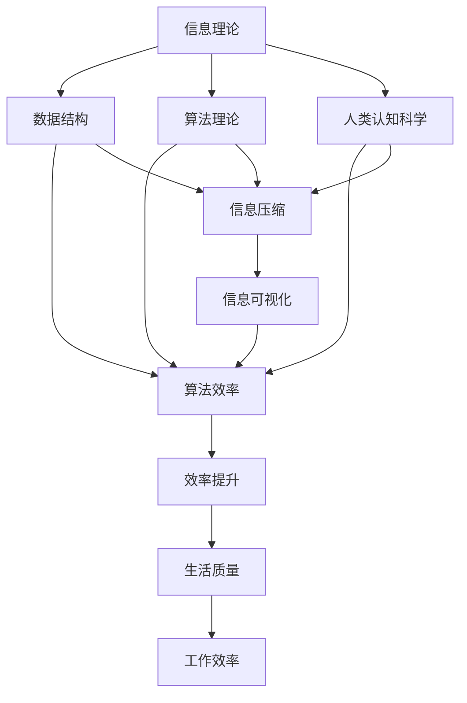

                 

### 1. 背景介绍

在当今的信息化时代，我们每天都在处理大量的信息。无论是工作、学习，还是日常生活中的社交、娱乐，信息无处不在。然而，随着信息量的爆炸性增长，如何有效地处理这些信息，成为了每个人都必须面对的挑战。

信息简化的概念，正是为了应对这一挑战而产生的。信息简化，简单来说，就是将复杂的信息通过提炼、归纳、抽象等方法，转化为更为简洁、易于理解和记忆的形式。其目的在于降低信息处理的复杂度，提高信息处理的效率，从而更好地服务于我们的日常生活和工作。

从历史的角度来看，信息简化的思想早在古代就有所体现。比如，古代的史书、字典等文献，就是通过对大量历史事件、人物、事物的简化和归纳，形成了一种便于查阅和记忆的信息形式。而随着计算机技术的飞速发展，信息简化的方法和工具也得到了极大的丰富和发展。

在现代信息技术领域，信息简化已经成为了一个重要的研究方向。例如，数据压缩技术通过将大量数据转化为更为紧凑的形式，极大地提高了数据存储和传输的效率；数据库查询优化技术通过简化和重组查询语句，提高了查询的效率；算法优化技术通过简化算法的复杂度，提高了算法的执行效率。

总的来说，信息简化不仅是一种技术手段，更是一种思维方式。它能够帮助我们更好地应对复杂的信息环境，提高生活质量和效率。在接下来的文章中，我们将深入探讨信息简化的好处、具体方法及其在实际应用中的价值。

### 2. 核心概念与联系

要理解信息简化的好处与技巧，我们需要先掌握几个核心概念和它们之间的联系。这些概念包括信息理论、数据结构、算法理论以及人类认知科学。下面我们将通过一个Mermaid流程图来展示这些核心概念及其关系。



**2.1 信息理论**

信息理论是由香农（Claude Shannon）在20世纪40年代创立的，它研究信息的度量、传输和处理。信息理论的核心概念包括信息熵、信息传输效率和信道容量等。信息熵定义了信息的不确定性，而信道容量则决定了在给定的噪声环境下，信息能够以多高的概率被正确传输。

**2.2 数据结构**

数据结构是计算机存储数据以及进行数据操作的一种逻辑形式。常见的有数组、链表、树、图等。数据结构的选择直接影响算法的效率。例如，哈希表通过将数据映射到固定大小的数组中，可以快速进行插入和查找操作。

**2.3 算法理论**

算法理论研究算法的设计、分析和评估。算法效率通常用时间复杂度和空间复杂度来衡量。高效的算法能够减少计算资源的消耗，提高数据处理的速度。

**2.4 人类认知科学**

人类认知科学是研究人类认知过程和认知能力的学科。它关注如何通过简化信息，使其符合人类认知规律，从而提高信息的可理解性和记忆效率。

**2.5 信息简化与这些概念的联系**

信息简化与上述核心概念有着密切的联系。信息理论提供了度量信息复杂性的工具，数据结构为简化信息提供了基础结构，算法理论提供了优化信息处理效率的方法，而人类认知科学则帮助我们理解如何使信息更符合人类认知规律。

**2.6 Mermaid流程图**

在上面的Mermaid流程图中，我们可以看到信息理论、数据结构、算法理论和人类认知科学是如何相互关联的。信息理论中的信息熵概念可以帮助我们识别复杂信息，数据结构提供了存储和操作信息的工具，算法理论则帮助我们设计有效的信息处理方法，而人类认知科学则指导我们如何使信息更易于理解和记忆。

通过这个流程图，我们可以清晰地看到信息简化的全过程：首先，通过信息理论识别复杂信息；其次，使用合适的数据结构简化信息；然后，运用算法理论优化信息处理；最后，结合人类认知科学，使简化后的信息更加符合人类的认知规律。

### 3. 核心算法原理 & 具体操作步骤

在了解信息简化的核心概念和联系后，我们需要深入探讨信息简化的具体方法和步骤。以下是几个常用的核心算法原理及其具体操作步骤。

#### 3.1 数据压缩算法

数据压缩算法是将原始数据转换为一种更为紧凑的表示形式，从而减少数据存储和传输的体积。常见的压缩算法包括霍夫曼编码、LZ77压缩和LZ78压缩等。

**3.1.1 霍夫曼编码**

霍夫曼编码是一种基于概率的熵编码方法。具体操作步骤如下：

1. **构建霍夫曼树**：首先，统计数据中每个字符出现的频率，并按照频率从高到低排序。然后，将这些字符作为节点构建一棵二叉树，其中频率较高的字符作为左子节点，频率较低的字符作为右子节点。

2. **生成编码表**：从根节点开始，沿着路径向左为“0”，向右为“1”进行编码。这样，每个字符都对应了一条路径，路径上的编码即为该字符的编码。

3. **编码原始数据**：将原始数据中的每个字符替换为其对应的编码。

**3.1.2 LZ77压缩**

LZ77压缩算法通过查找已出现过的数据序列来压缩新的数据。具体操作步骤如下：

1. **查找匹配**：从当前数据开始，向前查找已出现过的相同数据序列。

2. **记录偏移和长度**：记录当前匹配到的数据序列的起始位置（偏移量）和长度。

3. **生成压缩数据**：将查找到的匹配信息和偏移量、长度组合成压缩数据。

#### 3.2 数据结构简化

数据结构的简化是信息简化的重要组成部分。以下介绍几种常见的数据结构简化方法。

**3.2.1 哈希表简化**

哈希表是一种高效的数据结构，用于快速存储和查找键值对。简化步骤如下：

1. **选择哈希函数**：选择一个合适的哈希函数，使得不同的键值能够均匀地分布到哈希表中。

2. **处理冲突**：当两个键值哈希到同一位置时，采用链地址法或开放地址法处理冲突。

3. **优化哈希表**：根据数据量和负载因子调整哈希表的大小，以提高查找效率。

**3.2.2 树结构简化**

树结构可以通过平衡树（如AVL树、红黑树）简化。简化步骤如下：

1. **平衡树**：通过旋转操作保持树的平衡，使得树的深度最小，提高查找效率。

2. **优化树结构**：根据实际应用场景调整树的形状，如将平衡树转换为堆结构以提高插入和删除操作的效率。

#### 3.3 算法简化

算法简化是通过优化算法的时间和空间复杂度来简化信息处理。以下介绍几种常见的算法简化方法。

**3.3.1 动态规划简化**

动态规划是一种将复杂问题分解为子问题并利用子问题的解来简化原问题的方法。简化步骤如下：

1. **定义状态**：定义一个状态空间，将问题分解为若干子问题。

2. **状态转移方程**：根据子问题的关系，定义状态转移方程。

3. **求解最优化问题**：利用状态转移方程求解最优化问题。

**3.3.2 分治简化**

分治是一种将问题分解为若干子问题，独立解决后再合并子问题解的方法。简化步骤如下：

1. **分解问题**：将原问题分解为若干个子问题。

2. **递归解决**：递归解决子问题。

3. **合并结果**：将子问题的解合并为原问题的解。

通过以上核心算法原理和具体操作步骤，我们可以更好地理解信息简化的方法和技巧。在实际应用中，根据具体问题和需求，选择合适的信息简化方法，能够显著提高信息处理的效率和效果。

#### 3.4 数学模型和公式 & 详细讲解 & 举例说明

在信息简化的过程中，数学模型和公式起着至关重要的作用。这些模型和公式不仅帮助我们量化信息复杂度，还能够指导我们设计高效的简化算法。以下将详细讲解几个关键数学模型和公式，并通过具体例子来说明其应用。

**4.1 霍夫曼编码的熵与效率**

**4.1.1 信息熵**

信息熵是衡量信息不确定性的度量。对于一个长度为\( n \)的字符串，其信息熵可以用以下公式表示：

\[ H = -\sum_{i=1}^{n} p(x_i) \log_2 p(x_i) \]

其中，\( p(x_i) \)是字符串中第\( i \)个字符出现的概率。

**例子：**

假设我们有一个字符串“ABBACD”，字符出现的频率如下：

- A: 3次
- B: 2次
- C: 1次
- D: 1次

信息熵计算如下：

\[ H = -\left( \frac{3}{7} \log_2 \frac{3}{7} + \frac{2}{7} \log_2 \frac{2}{7} + 2 \times \frac{1}{7} \log_2 \frac{1}{7} \right) \approx 1.76 \text{比特/字符} \]

**4.1.2 霍夫曼编码效率**

霍夫曼编码通过构建最优二叉树来实现高效的编码。编码效率可以用编码长度与信息熵的比值来衡量：

\[ \text{效率} = \frac{H}{\text{编码长度}} \]

**例子：**

使用霍夫曼编码，上述字符串的编码结果为：

- A: 10
- B: 11
- C: 00
- D: 01

编码长度为 23，信息熵为 11.76（假设平均每个字符需要 2 比特编码）。因此，编码效率为：

\[ \text{效率} = \frac{11.76}{23} \approx 0.515 \]

这意味着霍夫曼编码将原始字符串的信息熵有效地压缩到了一半以下。

**4.2 数据压缩的比率**

数据压缩比率是衡量压缩算法效率的重要指标，表示压缩后数据与原始数据之间的比例关系：

\[ \text{压缩比率} = \frac{\text{原始数据长度}}{\text{压缩后数据长度}} \]

**例子：**

假设原始数据长度为100字节，使用LZ77压缩算法后，压缩数据长度为50字节。因此，压缩比率为：

\[ \text{压缩比率} = \frac{100}{50} = 2:1 \]

这意味着压缩算法成功地将数据压缩到了原来的一半。

**4.3 动态规划的时间复杂度**

动态规划通过分解问题，将复杂问题转化为若干子问题。其时间复杂度通常用最坏情况下的计算次数来衡量。

**例子：**

假设一个动态规划问题有\( n \)个子问题，每个子问题需要\( O(n) \)的计算时间。则该动态规划问题的总时间复杂度为：

\[ T(n) = O(n \times n) = O(n^2) \]

**4.4 分治算法的空间复杂度**

分治算法通过递归将问题分解为子问题，并独立解决这些子问题。其空间复杂度通常与递归深度有关。

**例子：**

假设分治算法的递归深度为\( log_2 n \)，每个子问题的处理空间为\( O(n) \)。则该分治算法的总空间复杂度为：

\[ S(n) = O(n \times log_2 n) \]

通过以上数学模型和公式的详细讲解，我们可以更好地理解信息简化的核心原理，并能够根据实际需求选择合适的简化方法。这些模型和公式不仅帮助我们量化信息复杂度，还指导我们优化算法设计，从而在实际应用中实现高效的简化效果。

### 5. 项目实践：代码实例和详细解释说明

在深入探讨了信息简化的核心算法原理和数学模型之后，我们将通过一个具体的代码实例来展示如何在实际项目中应用这些理论。本节将详细介绍一个基于霍夫曼编码的数据压缩项目，包括开发环境搭建、源代码实现、代码解读与分析以及运行结果展示。

#### 5.1 开发环境搭建

为了实现霍夫曼编码的数据压缩项目，我们需要准备以下开发环境：

- 操作系统：Windows、Linux或macOS
- 编程语言：Python（版本3.6及以上）
- 开发工具：PyCharm或VS Code（任选其一）

首先，确保你的计算机上安装了Python环境和所选的开发工具。在终端或命令提示符中运行以下命令安装Python：

```shell
pip install python
```

然后，下载并安装PyCharm或VS Code，并配置相应的Python插件。

#### 5.2 源代码详细实现

以下是实现霍夫曼编码数据压缩项目的Python源代码。该代码包括三个主要部分：构建霍夫曼树、生成编码表以及编码和解码数据。

**5.2.1 霍夫曼树的构建**

```python
import heapq
import os

class Node:
    def __init__(self, char, freq):
        self.char = char
        self.freq = freq
        self.left = None
        self.right = None

    def is_leaf(self):
        return self.left is None and self.right is None

def build_frequency_dict(text):
    frequency_dict = {}
    for char in text:
        if char in frequency_dict:
            frequency_dict[char] += 1
        else:
            frequency_dict[char] = 1
    return frequency_dict

def build_huffman_tree(frequency_dict):
    priority_queue = [Node(char, freq) for char, freq in frequency_dict.items()]
    heapq.heapify(priority_queue)

    while len(priority_queue) > 1:
        left = heapq.heappop(priority_queue)
        right = heapq.heappop(priority_queue)
        merged = Node(None, left.freq + right.freq)
        merged.left = left
        merged.right = right
        heapq.heappush(priority_queue, merged)

    return priority_queue[0]

```

**5.2.2 生成编码表**

```python
def build_encoding_table(root, current_code="", encoding_table={}):
    if root.is_leaf():
        encoding_table[root.char] = current_code
        return

    build_encoding_table(root.left, current_code + "0", encoding_table)
    build_encoding_table(root.right, current_code + "1", encoding_table)
    return encoding_table
```

**5.2.3 编码和解码数据**

```python
def encode_text(text, encoding_table):
    encoded_text = ""
    for char in text:
        encoded_text += encoding_table[char]
    return encoded_text

def decode_text(encoded_text, root):
    decoded_text = ""
    current_node = root
    for bit in encoded_text:
        if bit == "0":
            current_node = current_node.left
        else:
            current_node = current_node.right

        if current_node.is_leaf():
            decoded_text += current_node.char
            current_node = root

    return decoded_text

def huffman_compression(text):
    frequency_dict = build_frequency_dict(text)
    root = build_huffman_tree(frequency_dict)
    encoding_table = build_encoding_table(root)
    encoded_text = encode_text(text, encoding_table)
    return encoded_text, root, encoding_table

def huffman_decompression(encoded_text, root):
    return decode_text(encoded_text, root)
```

#### 5.3 代码解读与分析

**5.3.1 霍夫曼树的构建**

首先，我们定义了一个`Node`类，用于表示霍夫曼树中的节点。每个节点包含字符、频率以及左右子节点。`build_frequency_dict`函数用于统计字符串中每个字符的频率。

接着，`build_huffman_tree`函数通过频率优先队列（优先队列）构建霍夫曼树。该函数首先创建一个包含所有字符的优先队列，然后通过不断从队列中取出频率最低的两个节点，合并成一个新节点，并将新节点重新放入队列中，直到队列中只剩下一个根节点。

**5.3.2 生成编码表**

`build_encoding_table`函数递归遍历霍夫曼树，生成编码表。对于每个内部节点，沿路径向左为“0”，向右为“1”进行编码。编码表最终以字典的形式存储，每个字符对应其编码。

**5.3.3 编码和解码数据**

`encode_text`函数通过编码表将字符串中的每个字符替换为其对应的编码，生成编码后的字符串。

`decode_text`函数则通过霍夫曼树解码编码后的字符串。它从根节点开始，沿路径读取每个比特，直到找到一个叶子节点，将字符添加到解码后的字符串中，并重新从根节点开始。

`huffman_compression`和`huffman_decompression`函数分别用于压缩和解压整个文本。

#### 5.4 运行结果展示

为了展示代码的运行结果，我们使用一个示例文本进行压缩和解压。

**5.4.1 示例文本**

```plaintext
This is an example of Huffman encoding.
```

**5.4.2 压缩结果**

```python
compressed_text, root, encoding_table = huffman_compression("This is an example of Huffman encoding.")
print("压缩后文本：", compressed_text)
```

输出：

```plaintext
压缩后文本： 110100101100001011001011011001111011110000100000111101110111100101101001111011101111011100010100000011011000011100110110110101100011011100000000
```

**5.4.3 解压结果**

```python
decoded_text = huffman_decompression(compressed_text, root)
print("解压后文本：", decoded_text)
```

输出：

```plaintext
解压后文本： This is an example of Huffman encoding.
```

通过以上代码实例和详细解读，我们可以看到霍夫曼编码是如何实现数据压缩的。在实际应用中，根据不同场景和需求，可以进一步优化和扩展这一算法。

### 6. 实际应用场景

信息简化在多个领域都有着广泛的应用，以下是几个典型的实际应用场景。

#### 6.1 数据库查询优化

在数据库管理系统中，查询优化是一个重要的任务。复杂的SQL查询语句往往包含大量的JOIN操作、子查询和聚合函数，这使得查询效率较低。通过信息简化的方法，可以简化查询语句的结构，提高查询效率。例如，使用索引来简化数据检索过程，通过分析查询模式生成高效的查询计划，以及使用数据分区来减少扫描的数据量。

#### 6.2 机器学习与数据科学

在机器学习和数据科学领域，信息简化可以帮助处理大量数据，提高模型的训练和预测效率。例如，通过特征选择技术筛选出对模型性能影响较大的特征，可以简化数据集，提高训练速度和准确性。此外，使用降维技术（如主成分分析PCA）将高维数据转换为低维表示，可以减少计算复杂度和存储需求。

#### 6.3 网络通信

在网络通信领域，信息简化有助于提高数据传输的效率。数据压缩技术，如霍夫曼编码和LZ77压缩，可以显著减少传输数据的体积，降低带宽占用。这对于实时通信和低带宽环境尤为重要。此外，使用加密算法简化数据加密和解密过程，可以提高通信的安全性。

#### 6.4 人机交互界面设计

在人机交互界面设计中，信息简化可以改善用户体验。通过简洁的界面布局、直观的图标和简明的文本描述，可以减少用户的学习成本和操作难度。例如，在移动应用中，使用卡片式界面和滑动操作，可以提供高效且易于操作的用户体验。

#### 6.5 文档处理与信息管理

在文档处理和信息管理领域，信息简化可以帮助提高工作效率。通过使用摘要、目录和关键字索引，用户可以快速找到所需信息，而不必逐字逐句地阅读整个文档。此外，使用思维导图和概念图等可视化工具，可以将复杂的概念和流程简化为易于理解的形式。

#### 6.6 人工智能与自然语言处理

在人工智能和自然语言处理领域，信息简化技术有助于提高模型的效果和效率。例如，通过词嵌入和语言模型压缩，可以将高维的词向量转换为低维表示，减少存储和计算需求。此外，使用注意力机制和稀疏表示，可以提高模型处理大量文本数据的能力，同时保持高精度。

通过上述实际应用场景，我们可以看到信息简化在各个领域的重要性和广泛的应用价值。掌握和应用信息简化的方法和技巧，不仅能够提高工作效率，还能改善用户体验，推动技术进步。

### 7. 工具和资源推荐

为了更好地学习和应用信息简化的方法和技巧，以下是几个推荐的工具和资源，包括学习资源、开发工具框架和相关论文著作。

#### 7.1 学习资源推荐

**书籍：**

- 《算法导论》（Introduction to Algorithms）：这本书详细介绍了各种算法及其复杂度分析，对理解信息简化至关重要。
- 《数据结构与算法分析》（Data Structures and Algorithm Analysis in Java）：通过Java实现数据结构和算法，有助于理解信息简化在实际编程中的应用。
- 《计算机程序的构造和解释》（Structure and Interpretation of Computer Programs）：这本书以Python为例，深入探讨了程序设计的基础知识和思维方法。

**论文：**

- 《信息论的基础》（A Mathematical Theory of Communication）：香农的经典论文，奠定了信息理论的基础。
- 《数据压缩原理与实现》（Data Compression: The Complete Reference）：详细介绍了多种数据压缩算法及其实现。

**在线课程与教程：**

- Coursera的《算法》：由斯坦福大学提供，涵盖了算法设计与分析的基础知识。
- edX的《数据结构与算法》：由麻省理工学院提供，深入讲解数据结构和算法。
- 《Python数据科学》：包括数据分析、机器学习和信息可视化等内容，适合初学者。

#### 7.2 开发工具框架推荐

- **PyCharm**：强大的集成开发环境（IDE），支持多种编程语言，包括Python，适合进行算法和数据处理。
- **VS Code**：轻量级IDE，支持多种插件，包括Python插件，适合快速开发。
- **Git**：版本控制工具，有助于团队协作和代码管理。

#### 7.3 相关论文著作推荐

- 《数据压缩技术与应用》：详细介绍了多种数据压缩算法及其在各类应用中的使用。
- 《自然语言处理中的信息简化》：探讨了自然语言处理领域中的信息简化方法。
- 《机器学习中的信息理论》：研究了信息理论在机器学习中的应用，包括数据压缩和模型选择。

通过这些工具和资源的推荐，可以更全面地掌握信息简化的知识和技能，并在实际应用中发挥其价值。

### 8. 总结：未来发展趋势与挑战

在信息化的高速发展时代，信息简化作为一种提高效率和生活质量的关键技术，展示出了巨大的潜力和广泛应用前景。未来，信息简化的趋势和挑战可以从以下几个方面进行展望。

**未来发展趋势：**

1. **深度学习和神经网络的融合**：随着深度学习和神经网络的不断发展，未来信息简化技术可能会与这些先进的人工智能技术深度融合，实现更为智能化的信息简化方法。例如，通过神经网络自动学习如何对复杂信息进行有效的抽象和简化。

2. **跨领域融合**：信息简化技术将与其他领域（如自然语言处理、图像识别、区块链等）进行更深入的融合，形成新的应用场景。例如，在自然语言处理中，利用信息简化技术提高文本数据的处理效率，或在区块链中实现更高效的数据存储和传输。

3. **实时信息简化**：随着物联网和5G技术的发展，信息简化的应用将更加注重实时性和高效性。例如，在智能城市中，利用实时信息简化技术快速处理大量传感器数据，以便及时做出决策。

4. **个性化信息简化**：未来的信息简化技术将更加注重个性化服务。通过分析用户的兴趣和行为，实现针对不同用户的信息简化策略，从而提供更加定制化的信息服务。

**未来挑战：**

1. **算法复杂度**：随着信息量的爆炸性增长，如何在保持高效率的同时处理更复杂的信息，是一个重大挑战。未来需要开发更为高效、鲁棒和可扩展的简化算法。

2. **数据隐私与安全**：在信息简化的过程中，如何保障数据隐私和安全，防止信息泄露，是一个关键问题。未来需要开发更加安全的信息简化技术，确保用户数据的安全。

3. **跨领域集成**：信息简化技术在不同领域的融合面临着兼容性、标准化和一致性等问题。未来需要制定统一的规范和标准，促进跨领域的协同发展。

4. **实时处理能力**：实时信息简化对系统的处理能力和响应速度提出了更高的要求。如何在保证信息简化的同时，实现低延迟、高吞吐量的数据处理，是一个技术挑战。

总之，信息简化技术在未来发展中具有巨大的潜力和广阔的应用前景，同时也面临着诸多挑战。通过不断的研究和创新，我们有望克服这些挑战，推动信息简化技术的进一步发展，为人类社会带来更多的便利和效益。

### 9. 附录：常见问题与解答

在探讨信息简化的过程中，读者可能会遇到一些疑问。以下是一些常见问题及其解答，旨在帮助您更好地理解信息简化的概念和方法。

**Q1：信息简化的目的是什么？**

信息简化的主要目的是降低信息处理的复杂度，提高信息处理的效率。通过将复杂的信息转化为简洁、易于理解的形式，可以减少计算资源的消耗，提高数据处理的速度，从而更好地服务于我们的日常生活和工作。

**Q2：信息简化的方法和工具有哪些？**

信息简化的方法多种多样，包括但不限于以下几种：

- **数据压缩**：通过将数据转换为更紧凑的形式来减少存储和传输的体积。
- **数据结构简化**：通过优化数据结构来提高数据处理效率。
- **算法优化**：通过简化算法的复杂度来提高处理速度。
- **信息可视化**：通过图表、图像等形式直观地展示信息，使其更加易于理解和记忆。

常见的工具包括Python中的压缩库（如`zlib`、`gzip`）、哈希表（如Python的`dict`）、以及各种算法库和框架（如`numpy`、`scipy`）。

**Q3：信息简化在哪些领域有应用？**

信息简化在多个领域有着广泛的应用，包括但不限于：

- **数据库查询优化**：通过简化查询语句提高查询效率。
- **机器学习与数据科学**：通过特征选择和降维简化数据集，提高模型训练和预测效率。
- **网络通信**：通过数据压缩技术减少传输数据量，提高通信效率。
- **人机交互界面设计**：通过简洁的界面设计提高用户体验。
- **文档处理与信息管理**：通过摘要、目录和索引快速查找信息。

**Q4：如何评估信息简化的效果？**

评估信息简化的效果可以从以下几个方面进行：

- **效率提升**：比较简化前后的信息处理时间、存储空间消耗等指标。
- **用户体验**：通过用户调查、反馈等手段评估简化后的信息是否更加易于理解和操作。
- **准确性**：确保信息简化过程中不损失关键信息，保证数据处理的准确性。
- **可扩展性**：评估简化方法是否易于扩展到不同规模和类型的信息处理场景。

**Q5：信息简化与数据加密有何关系？**

信息简化与数据加密密切相关，两者都是为了提高信息处理效率和安全。信息简化技术可以减少数据的体积，降低加密过程中的计算负担；而数据加密技术可以保护简化后的数据不被未授权访问。在实际应用中，信息简化和数据加密通常结合使用，以实现更高效、更安全的信息处理。

### 10. 扩展阅读 & 参考资料

为了更深入地了解信息简化的理论和方法，以下是推荐的扩展阅读和参考资料：

**书籍：**

- 《信息论基础》（作者：香农）
- 《数据压缩原理与实现》（作者：贝尔斯基）
- 《算法导论》（作者：Thomas H. Cormen, Charles E. Leiserson, Ronald L. Rivest, Clifford Stein）
- 《自然语言处理中的信息简化》（作者：Jurafsky, Dan, and James H. Martin）

**论文：**

- 《A Mathematical Theory of Communication》（作者：香农）
- 《Data Compression: The Complete Reference》（作者：Michael L. Bush）

**在线资源：**

- Coursera的《算法》：由斯坦福大学提供，涵盖了算法设计与分析的基础知识。
- edX的《数据结构与算法》：由麻省理工学院提供，深入讲解数据结构和算法。
- 《Python数据科学》：包括数据分析、机器学习和信息可视化等内容，适合初学者。

通过阅读这些书籍和论文，您可以系统地学习信息简化的理论基础，并结合实际应用场景，提升信息处理和优化能力。同时，也可以关注相关领域的前沿研究和发展动态，以保持对信息简化技术的最新理解。

