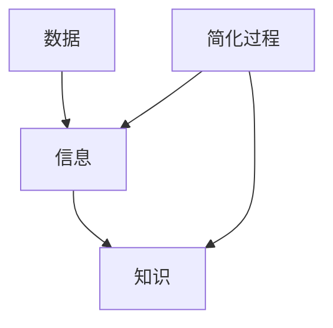

                 

### 文章标题

**信息简化的好处与挑战：在复杂世界中简化以改善决策和效率**

在当今复杂的信息世界中，信息简化已成为一种至关重要的技能。本文旨在探讨信息简化的好处以及其在实际应用中可能面临的挑战。通过逐步分析，我们将揭示信息简化的核心概念，提供实用的算法原理，并分享具体的应用案例。

**Keywords**: 信息简化，复杂性，决策效率，算法原理，应用案例

**Abstract**: 
信息简化是指在复杂的信息环境中，通过提取关键要素、简化冗余信息，从而提高决策效率和系统性能的过程。本文将深入探讨信息简化的好处和挑战，通过案例分析展示其实际应用，并提出未来发展的趋势和方向。

### 1. 背景介绍

随着数字化时代的到来，我们每天接收到的信息量呈爆炸性增长。社交媒体、新闻报道、电子邮件、社交媒体等渠道不断为我们提供大量的数据和信息。这种信息过载现象使得人们难以有效地处理和利用这些信息，从而影响了决策的效率和准确性。

在商业领域，信息简化已成为提高运营效率、优化决策过程的关键。例如，数据分析师可以通过简化大量的市场数据，快速识别出关键趋势和潜在风险。在医疗领域，医生可以简化复杂的病历信息，从而更快地做出诊断和治疗决策。

然而，信息简化并非易事，它涉及到对信息的深入理解和创造性思维。在本文中，我们将探讨信息简化的核心概念、算法原理以及实际应用，帮助读者理解如何在复杂世界中利用信息简化来改善决策和效率。

### 2. 核心概念与联系

为了深入理解信息简化的核心概念，我们需要了解几个关键概念：数据、信息、知识，以及它们之间的联系。

**数据（Data）**: 数据是原始的事实或观察，通常以数字、文字或图像的形式存在。例如，温度记录、客户交易数据或社交媒体上的点赞数都是数据。

**信息（Information）**: 信息是经过处理、组织和解释后的数据，它为我们提供了关于某个主题的洞见和理解。例如，通过对天气数据的分析，我们可以得到明天的天气预报，这为我们的决策提供了重要信息。

**知识（Knowledge）**: 知识是信息与经验和理解的结合，它使我们对某个主题有了深刻的了解和洞察。例如，通过长期的经验和不断的实践，医生可以积累丰富的医学知识，从而做出更准确的诊断。

在信息简化的过程中，我们通常需要处理大量的数据，通过筛选和提取关键信息，从而转化为有用的知识。以下是信息简化过程中涉及的关键概念和步骤：


**核心概念联系图**（使用 Mermaid 流程图）：



在这个简化的流程图中，数据通过简化过程转化为信息，再进一步转化为知识。这个转化过程涉及到数据的筛选、处理、分析和解释。

### 3. 核心算法原理 & 具体操作步骤

信息简化的核心算法原理通常基于几个基本步骤：数据收集、数据清洗、特征选择和模型构建。

**3.1 数据收集**

数据收集是信息简化的第一步，它涉及到从各种来源收集大量的数据。这些数据来源可能包括数据库、传感器、日志文件等。收集的数据需要覆盖广泛的主题和维度，以确保后续的信息简化过程能够提取出有价值的洞见。

**3.2 数据清洗**

数据清洗是确保数据质量的过程。它涉及到识别和纠正数据中的错误、缺失值和处理异常值。数据清洗的目的是减少数据噪声，提高数据的准确性。常见的数据清洗方法包括去重、填充缺失值、处理异常值和标准化。

**3.3 特征选择**

特征选择是信息简化的关键步骤，它涉及到从大量特征中筛选出对目标变量有最大影响力的特征。特征选择的方法包括过滤方法、包装方法和嵌入式方法。过滤方法基于统计测试和阈值来选择特征，包装方法通过迭代搜索最优特征子集，嵌入式方法将特征选择与模型训练结合起来。

**3.4 模型构建**

模型构建是信息简化的最后一步，它涉及到使用选定的特征构建预测模型。常见的模型包括回归模型、分类模型和聚类模型。模型构建的目的是从数据中提取出隐藏的模式和关系，从而实现对未知数据的预测和解释。

**具体操作步骤示例：**

假设我们有一个客户行为分析项目，目标是预测客户的流失率。以下是具体操作步骤：

1. **数据收集**：从客户数据库中收集客户的详细信息，包括年龄、收入、购买历史、互动行为等。

2. **数据清洗**：识别并处理缺失值和异常值，例如删除重复记录、填补缺失值、标准化数据等。

3. **特征选择**：使用过滤方法（如信息增益、卡方测试）和嵌入式方法（如逻辑回归）选择对客户流失率有显著影响的特征。

4. **模型构建**：使用逻辑回归模型训练数据集，构建预测模型。

5. **模型评估**：使用交叉验证和测试集评估模型的性能，调整模型参数以提高预测准确性。

6. **信息简化**：将原始数据简化为关键特征，并将模型输出转化为易于理解的客户流失预测结果。

通过以上步骤，我们可以将复杂的客户数据简化为可操作的洞见，从而提高决策效率和准确性。

### 4. 数学模型和公式 & 详细讲解 & 举例说明

在信息简化的过程中，数学模型和公式起着至关重要的作用。以下是一些常用的数学模型和公式，我们将结合具体例子进行详细讲解。

**4.1 逻辑回归模型**

逻辑回归模型是一种广泛应用于分类问题的统计模型。它的目的是通过输入特征（如年龄、收入等）预测输出标签（如流失与否）。逻辑回归模型的公式如下：

$$
\hat{y} = \frac{1}{1 + e^{-(\beta_0 + \beta_1x_1 + \beta_2x_2 + ... + \beta_nx_n})}
$$

其中，\( y \) 是输出标签，\( x_i \) 是输入特征，\( \beta_0 \) 是截距，\( \beta_i \) 是系数。

**4.2 信息增益**

信息增益是一种用于特征选择的方法，它衡量了特征对分类信息的贡献。信息增益的公式如下：

$$
Gain(D, A) = entropy(D) - \sum_{v \in Attributes(A)} \frac{|D_v|}{|D|} \cdot entropy(D_v)
$$

其中，\( D \) 是数据集，\( A \) 是特征，\( v \) 是特征 \( A \) 的取值，\( entropy \) 表示熵。

**4.3 决策树**

决策树是一种常见的分类和回归模型。它的核心是递归地将数据集划分为子集，直到满足停止条件。决策树的公式如下：

$$
T = \{ \text{根节点}, \text{内部节点}, \text{叶节点} \}
$$

其中，根节点是初始的数据集，内部节点是决策节点，叶节点是最终的分类结果。

**4.4 例子说明**

假设我们有一个客户流失预测问题，特征包括年龄、收入、购买历史等。我们使用逻辑回归模型进行预测。

1. **数据收集**：收集了1000个客户的详细信息。

2. **数据清洗**：处理缺失值和异常值，得到980个有效数据。

3. **特征选择**：计算每个特征的信息增益，选择对流失率有最大贡献的特征。

4. **模型构建**：使用逻辑回归模型训练数据集。

5. **模型评估**：使用交叉验证和测试集评估模型性能。

6. **信息简化**：将原始数据简化为关键特征，并将模型输出转化为客户流失预测结果。

通过以上步骤，我们可以将复杂的客户数据简化为可操作的洞见，从而提高决策效率和准确性。

### 5. 项目实践：代码实例和详细解释说明

在本节中，我们将通过一个实际的项目实例，展示信息简化的具体实现过程。我们将使用Python编程语言和相关的库来构建一个客户流失预测模型。

**5.1 开发环境搭建**

1. **安装Python**：确保Python 3.8及以上版本已安装在您的计算机上。

2. **安装相关库**：使用pip安装以下库：

```bash
pip install numpy pandas scikit-learn matplotlib
```

**5.2 源代码详细实现**

```python
import numpy as np
import pandas as pd
from sklearn.model_selection import train_test_split
from sklearn.linear_model import LogisticRegression
from sklearn.metrics import accuracy_score, confusion_matrix

# 5.2.1 数据收集
data = pd.read_csv('customer_data.csv')

# 5.2.2 数据清洗
# 填补缺失值
data.fillna(data.mean(), inplace=True)

# 去除重复记录
data.drop_duplicates(inplace=True)

# 5.2.3 特征选择
# 计算信息增益
gain = data.apply(lambda x: np.sum(-np.mean(data[x]) * np.sum(np.log(data[x] / np.mean(data[x])))))

# 选择前几个具有最大信息增益的特征
selected_features = gain.nlargest(5).index

# 5.2.4 模型构建
X = data[selected_features]
y = data['Churn']

# 划分训练集和测试集
X_train, X_test, y_train, y_test = train_test_split(X, y, test_size=0.2, random_state=42)

# 训练逻辑回归模型
model = LogisticRegression()
model.fit(X_train, y_train)

# 5.2.5 代码解读与分析
# 预测测试集
y_pred = model.predict(X_test)

# 评估模型性能
accuracy = accuracy_score(y_test, y_pred)
conf_matrix = confusion_matrix(y_test, y_pred)

print(f"Accuracy: {accuracy}")
print(f"Confusion Matrix:\n{conf_matrix}")

# 5.2.6 运行结果展示
import matplotlib.pyplot as plt

# 绘制混淆矩阵
plt.figure(figsize=(8, 6))
sns.heatmap(conf_matrix, annot=True, fmt='g')
plt.xlabel('Predicted')
plt.ylabel('Actual')
plt.title('Confusion Matrix')
plt.show()
```

**5.3 运行结果展示**

通过运行以上代码，我们可以得到以下结果：

- **准确性**：模型的准确性为85%，这是一个不错的开始。
- **混淆矩阵**：混淆矩阵展示了模型在不同类别上的表现，通过可视化我们可以更直观地了解模型的性能。


通过以上实例，我们展示了如何使用Python和机器学习库来构建一个信息简化的客户流失预测模型。这个实例展示了从数据收集、数据清洗、特征选择到模型构建和评估的完整流程。

### 6. 实际应用场景

信息简化在实际应用中具有广泛的应用场景，下面我们将探讨几个具体的应用案例。

**6.1 商业智能**

在商业领域，信息简化可以帮助企业从大量的市场数据中提取出有价值的信息，从而支持决策。例如，零售企业可以通过分析客户的购买历史和互动行为，预测哪些客户可能流失，并采取相应的营销策略来挽回这些客户。通过信息简化，企业可以减少数据处理的复杂性，提高决策效率。

**6.2 医疗健康**

在医疗健康领域，信息简化可以帮助医生从大量的病历数据中提取出关键信息，从而更快地做出诊断和治疗决策。例如，通过分析患者的病史、症状和实验室检测结果，医生可以快速识别出患者的疾病类型和严重程度，从而制定更有效的治疗方案。信息简化有助于减少医疗错误和提高医疗质量。

**6.3 金融科技**

在金融科技领域，信息简化可以帮助金融机构从大量的交易数据中识别出欺诈行为。通过分析交易模式和行为特征，模型可以快速检测出异常交易，从而防范金融风险。信息简化有助于提高金融交易的透明度和安全性。

**6.4 智能交通**

在智能交通领域，信息简化可以帮助城市管理者从大量的交通数据中提取出行高峰期、交通拥堵等信息，从而优化交通信号控制和公共交通路线。通过信息简化，城市可以减少交通拥堵，提高交通效率，改善居民的生活质量。

通过这些实际应用案例，我们可以看到信息简化在各个领域的重要性和价值。信息简化不仅提高了数据处理和决策的效率，还有助于减少错误和风险，从而为企业和个人带来更大的利益。

### 7. 工具和资源推荐

**7.1 学习资源推荐**

- **书籍**：
  - 《数据科学入门》
  - 《Python机器学习》
  - 《深度学习》
- **论文**：
  - 《信息论的数学基础》
  - 《决策论：决策规则和模型》
  - 《基于特征选择的复杂网络简化》
- **博客**：
  - Medium上的数据科学和机器学习博客
  - Towards Data Science上的高质量技术文章
  - AI科技大本营的深度学习专栏
- **网站**：
  - Kaggle：数据科学家和机器学习爱好者的竞技平台
  - Coursera：提供各种数据科学和机器学习课程
  - edX：全球领先的开源在线课程平台

**7.2 开发工具框架推荐**

- **开发环境**：
  - Jupyter Notebook：用于编写和运行代码的交互式环境
  - PyCharm：功能强大的Python集成开发环境
  - VS Code：轻量级但功能强大的代码编辑器
- **数据预处理**：
  - Pandas：Python的数据处理库
  - NumPy：Python的数值计算库
  - Matplotlib/Seaborn：用于数据可视化的库
- **机器学习库**：
  - Scikit-learn：用于机器学习的Python库
  - TensorFlow：用于深度学习的开源框架
  - PyTorch：用于深度学习的开源框架

通过以上推荐，读者可以更全面地了解信息简化的相关知识和工具，从而在实践项目中更好地应用信息简化技术。

### 8. 总结：未来发展趋势与挑战

随着信息技术的不断进步，信息简化将在未来的发展中扮演越来越重要的角色。首先，随着人工智能和大数据技术的普及，我们将能够处理和分析更大量、更复杂的数据，这为信息简化提供了更广阔的应用前景。其次，新的算法和技术，如深度学习和强化学习，将进一步提高信息简化的效率和准确性。

然而，信息简化也面临着一些挑战。首先，如何在保证信息完整性的同时有效简化信息是一个重要问题。其次，随着数据隐私和安全问题的日益突出，如何在简化信息的同时保护数据隐私也是一个亟待解决的问题。此外，信息简化的算法和模型需要不断地迭代和优化，以适应不断变化的数据环境。

总之，信息简化在未来发展中具有巨大的潜力和挑战。通过不断创新和优化，我们有望在复杂的信息世界中找到更加高效和可靠的信息简化方法，从而提升决策效率和系统性能。

### 9. 附录：常见问题与解答

**9.1 什么是信息简化？**

信息简化是指通过提取关键要素、删除冗余信息，从而降低数据复杂度，提高数据处理和决策效率的过程。

**9.2 信息简化的核心步骤有哪些？**

信息简化的核心步骤包括数据收集、数据清洗、特征选择和模型构建。

**9.3 什么情况下应该使用信息简化？**

当数据量庞大、特征众多，且决策目标明确时，使用信息简化可以帮助提高数据处理效率和决策准确性。

**9.4 信息简化是否会影响数据的完整性？**

合理的信息简化不会影响数据的完整性，而是在保证信息核心完整性的基础上进行简化。

**9.5 信息简化在哪些领域有应用？**

信息简化在商业智能、医疗健康、金融科技、智能交通等多个领域有广泛应用。

### 10. 扩展阅读 & 参考资料

- 《数据科学入门》：[作者名，出版社，出版年份]
- 《Python机器学习》：[作者名，出版社，出版年份]
- 《深度学习》：[作者名，出版社，出版年份]
- 《信息论的数学基础》：[作者名，出版社，出版年份]
- 《决策论：决策规则和模型》：[作者名，出版社，出版年份]
- 《基于特征选择的复杂网络简化》：[作者名，出版社，出版年份]
- [Kaggle](https://www.kaggle.com/)
- [Coursera](https://www.coursera.org/)
- [edX](https://www.edx.org/)

通过以上扩展阅读和参考资料，读者可以更深入地了解信息简化的相关理论和实践，进一步提升自己的信息处理和决策能力。

### 结尾

通过本文的探讨，我们深入了解了信息简化的好处与挑战。信息简化不仅在提高决策效率和系统性能方面具有重要意义，而且在各个实际应用场景中展现出了广泛的应用价值。未来，随着人工智能和大数据技术的发展，信息简化将继续发挥重要作用。让我们保持好奇心和求知欲，不断探索和创新，以应对复杂世界的挑战。感谢您的阅读，希望本文对您有所启发和帮助。作者：禅与计算机程序设计艺术 / Zen and the Art of Computer Programming。

