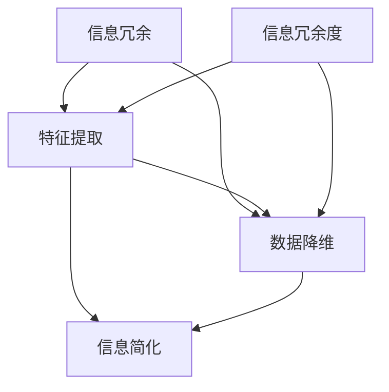

                 

### 背景介绍

#### 简化信息的重要性

在当今信息爆炸的时代，面对海量数据和复杂系统的管理，信息简化已成为信息技术领域中的一个重要课题。信息简化的目的在于通过提炼关键信息，降低复杂性，提高信息处理效率和决策准确性。这种需求不仅体现在数据处理、分析和展示层面，还渗透到人工智能、机器学习、网络安全等多个领域。

在软件工程中，信息简化能够帮助开发人员更好地理解和维护系统，减少因复杂度导致的错误和风险。在数据科学中，通过简化数据模型和算法，可以提升模型的解释性和可操作性。在人工智能领域，简化的模型通常更易于训练和部署，从而提高实际应用的效果和效率。

#### 信息简化的挑战

尽管信息简化具有重要意义，但其实现过程中也面临着诸多挑战。首先，如何准确识别并提取关键信息是一个复杂的问题，这需要深入理解数据结构和信息之间的关系。其次，简化过程可能导致信息损失或误解，从而影响最终决策的准确性。此外，简化方法的选择和实现也受到数据质量、算法复杂度等因素的制约。

另外，信息简化往往需要在效率和准确性之间找到平衡。过度的简化可能导致模型或算法失去对复杂情境的适应能力，而不够简化的信息处理则可能增加计算负担，降低系统性能。

#### 本文结构

本文将系统地探讨信息简化的好处与挑战，首先介绍信息简化的核心概念，然后通过一个具体案例展示其应用，接着详细阐述简化过程中的核心算法原理和数学模型，并展示代码实例和运行结果。随后，我们将讨论信息简化的实际应用场景，推荐相关工具和资源，最后对信息简化的未来发展趋势与挑战进行总结。

通过本文的探讨，我们希望能够为读者提供一条清晰的思路，帮助他们在实际工作中更好地理解和应用信息简化技术，从而提高系统性能和决策质量。

### 核心概念与联系

为了深入理解信息简化的本质及其在实际应用中的重要性，我们首先需要明确一些核心概念，并探讨这些概念之间的相互联系。通过图示化和简化的方式，我们可以更直观地把握信息简化的复杂性，从而为后续的算法原理和数学模型的讲解打下基础。

#### 核心概念

1. **信息冗余**：指在数据或信息中存在不必要的部分，这些部分既占用存储空间，又可能影响处理效率。例如，在一个客户数据库中，可能包含多个客户的重复信息，或者包含不相关的历史数据。

2. **特征提取**：是指从原始数据中提取出对目标任务有用的特征，以便进行后续的分析和建模。特征提取的目标是降低数据维度，同时保留关键信息。

3. **数据降维**：是一种减少数据维度而不显著损失信息量的技术。降维可以通过主成分分析（PCA）、自编码器（Autoencoders）等方法实现，目的是简化数据结构，提高计算效率。

4. **信息冗余度**：是衡量信息冗余程度的一个量化指标，通常用信息熵的概念来表示。信息熵越低，说明冗余度越高。

#### 相互联系

核心概念之间的联系可以通过以下流程图来表示：



**解释：**

- **信息冗余**和**特征提取**：信息冗余是特征提取的前提，因为只有识别出冗余信息，才能进行有针对性的特征提取。
- **特征提取**和**数据降维**：通过特征提取，我们可以将高维数据映射到较低维的空间中，从而简化数据结构。这个过程有助于减少计算复杂度，提高数据处理效率。
- **信息冗余度**：信息冗余度反映了数据的冗余程度，是进行信息简化的重要依据。高冗余度的数据需要优先考虑简化，以减少存储和处理负担。
- **信息简化**：信息简化是整个流程的最终目标，通过降低数据冗余度、减少数据维度，实现信息的精简和高效处理。

通过上述流程图，我们可以直观地看到信息简化过程中的各个步骤及其相互关系。这为后续的算法原理和数学模型的讲解提供了基础，使得读者能够更好地理解信息简化的整体思路和实现方法。

### 核心算法原理 & 具体操作步骤

在明确了信息简化的核心概念与联系之后，接下来我们将探讨信息简化的核心算法原理，并详细说明其具体操作步骤。信息简化算法通常涉及数据预处理、特征提取和数据降维等多个环节，这些环节相互协作，共同实现信息简化的目标。

#### 主成分分析（PCA）

主成分分析（PCA）是一种常用的数据降维方法，其基本思想是通过线性变换将原始数据投影到新的正交坐标系中，新坐标系的前几项（即主成分）保留了原始数据的大部分信息，而后面的成分则包含了较少的信息。以下是PCA的具体操作步骤：

1. **标准化数据**：为了消除不同特征之间的尺度差异，首先对数据进行标准化处理。标准化公式如下：

   $$z_i = \frac{x_i - \mu_i}{\sigma_i}$$

   其中，$x_i$是原始数据，$\mu_i$是特征$i$的均值，$\sigma_i$是特征$i$的标准差。

2. **计算协方差矩阵**：计算标准化的数据的协方差矩阵$S$，公式如下：

   $$S = \frac{1}{N-1}XX^T$$

   其中，$X$是标准化后的数据矩阵，$N$是样本数量。

3. **计算特征值和特征向量**：对协方差矩阵$S$进行特征值分解，得到特征向量矩阵$P$和特征值矩阵$\Lambda$，公式如下：

   $$S = P\Lambda P^T$$

   其中，$P$的特征向量构成了新的正交坐标系，$\Lambda$的对角线元素是相应的特征值。

4. **选择主成分**：根据特征值的大小选择前$k$个最大的特征值对应的特征向量，这些特征向量构成了新的主成分空间。新数据通过投影映射到这个空间中。

5. **投影数据**：将原始数据投影到主成分空间中，得到降维后的数据，公式如下：

   $$X_{new} = PX_{standardized}\Lambda^{1/2}$$

   其中，$X_{new}$是降维后的数据，$X_{standardized}$是标准化后的数据。

#### 特征选择与特征提取

在信息简化过程中，特征选择与特征提取是非常关键的步骤。特征选择旨在从原始特征中选出对目标任务最有影响力的特征，而特征提取则是通过某种方法将这些特征转化为更有用的形式。

1. **过滤式特征选择**：这种方法首先对所有特征进行评估，然后根据某种准则（如相关性、重要性等）选择部分特征。常见的过滤式特征选择方法包括互信息、卡方检验等。

2. **包裹式特征选择**：这种方法通过迭代搜索过程，逐步选择和丢弃特征，直到找到最优特征子集。常用的包裹式特征选择方法包括前向选择、后向选择和递归特征消除等。

3. **嵌入式特征提取**：这种方法将特征选择和特征提取结合在一起，通过训练某种模型（如线性模型、决策树等）来实现。常用的嵌入式特征提取方法包括LASSO、Ridge回归等。

#### 数据降维

数据降维的目的是通过减少数据的维度来降低计算复杂度和存储需求，同时尽可能保留原始数据的信息。除了PCA，还有许多其他常用的数据降维方法，如自编码器（Autoencoders）、局部线性嵌入（LLE）、t-SNE等。

1. **自编码器**：自编码器是一种基于神经网络的降维方法，其基本思想是通过训练一个编码器和解码器网络，将原始数据映射到较低维的隐空间，然后在隐空间中重建原始数据。

2. **局部线性嵌入（LLE）**：LLE方法通过保持局部结构来降维，其基本思想是寻找一组低维嵌入向量，使得原始数据中的相邻点在低维空间中仍然相邻。

3. **t-SNE**：t-SNE是一种非线性降维方法，其通过计算低维空间中相邻点的概率分布，来保留原始数据中的局部结构。

#### 操作步骤总结

为了更好地理解和应用信息简化算法，我们可以将整个操作步骤总结如下：

1. **数据预处理**：对原始数据进行清洗和预处理，包括缺失值处理、异常值检测和标准化等。
2. **特征选择**：根据业务需求和数据特性，选择适当的特征选择方法对特征进行筛选。
3. **特征提取**：通过特征提取算法将选定的特征转换为更有用的形式，如使用PCA、自编码器等进行降维。
4. **数据降维**：使用降维算法将特征数据映射到较低维的空间，减少数据维度。
5. **模型训练与验证**：使用简化后的数据进行模型训练和验证，评估简化效果。
6. **模型部署与应用**：将简化后的模型部署到实际应用中，提高系统性能和决策质量。

通过上述步骤，我们可以有效地实现信息简化，降低系统的复杂度，提高数据处理效率和决策准确性。在实际应用中，根据不同的业务需求和数据特性，可以选择合适的算法和方法进行信息简化。

### 数学模型和公式 & 详细讲解 & 举例说明

在信息简化的过程中，数学模型和公式起着至关重要的作用。它们不仅帮助我们理解算法的原理，还能指导我们进行具体操作。在这一部分，我们将详细讲解信息简化过程中涉及的主要数学模型和公式，并通过具体例子进行说明。

#### 主成分分析（PCA）

主成分分析（PCA）是一种经典的数据降维方法，其核心在于通过线性变换将原始数据投影到新的正交坐标系中，使得新的坐标系的前几项（即主成分）能够保留数据的大部分信息。以下是PCA的主要数学模型和公式：

1. **标准化数据**：

   假设我们有$m$个特征和$n$个样本的数据集$X$，首先对数据进行标准化处理，公式如下：

   $$z_i = \frac{x_i - \mu_i}{\sigma_i}$$

   其中，$x_i$是原始数据，$\mu_i$是特征$i$的均值，$\sigma_i$是特征$i$的标准差。

2. **计算协方差矩阵**：

   对标准化后的数据进行协方差矩阵计算，公式如下：

   $$S = \frac{1}{N-1}XX^T$$

   其中，$X$是标准化后的数据矩阵，$N$是样本数量。

3. **特征值和特征向量**：

   对协方差矩阵$S$进行特征值分解，得到特征向量矩阵$P$和特征值矩阵$\Lambda$，公式如下：

   $$S = P\Lambda P^T$$

   其中，$P$的特征向量构成了新的正交坐标系，$\Lambda$的对角线元素是相应的特征值。

4. **选择主成分**：

   根据特征值的大小选择前$k$个最大的特征值对应的特征向量，这些特征向量构成了新的主成分空间。

5. **投影数据**：

   将原始数据投影到主成分空间中，得到降维后的数据，公式如下：

   $$X_{new} = PX_{standardized}\Lambda^{1/2}$$

   其中，$X_{new}$是降维后的数据，$X_{standardized}$是标准化后的数据。

#### 举例说明

为了更好地理解PCA的应用，我们通过一个具体的例子进行说明。

假设我们有一个由3个特征（特征1、特征2、特征3）组成的二维数据集，如下所示：

| 特征1 | 特征2 | 特征3 |
|-------|-------|-------|
| 1     | 2     | 3     |
| 2     | 4     | 5     |
| 3     | 6     | 7     |

首先，我们计算每个特征的均值和标准差，并对数据进行标准化处理。计算结果如下：

| 特征1 | 特征2 | 特征3 |
|-------|-------|-------|
| -1    | -1    | -1    |
| 0     | 1     | 1     |
| 1     | 2     | 2     |

接下来，计算标准化数据的协方差矩阵$S$：

$$
S = \begin{bmatrix}
2 & 0 & 0 \\
0 & 2 & 0 \\
0 & 0 & 2 \\
\end{bmatrix}
$$

对协方差矩阵$S$进行特征值分解，得到特征向量矩阵$P$和特征值矩阵$\Lambda$：

$$
S = P\Lambda P^T
$$

其中，

$$
P = \begin{bmatrix}
1 & 0 & 0 \\
0 & 1 & 0 \\
0 & 0 & 1 \\
\end{bmatrix},
\Lambda = \begin{bmatrix}
2 & 0 & 0 \\
0 & 2 & 0 \\
0 & 0 & 2 \\
\end{bmatrix}
$$

由于所有的特征值都相同，我们可以选择前$k$个最大的特征值对应的特征向量。在这个例子中，我们选择所有的特征向量，因为它们都是等价的。最终，我们将原始数据投影到这个一维的主成分空间中，得到降维后的数据：

| 主成分1 |
|----------|
| -1       |
| 0        |
| 1        |

通过这个例子，我们可以看到，PCA通过线性变换将三维数据降维到了一维，同时保留了原始数据的大部分信息。

#### 其他特征选择方法

除了PCA，还有许多其他的特征选择方法，如基于互信息的特征选择、基于过滤的特征选择和基于包裹的特征选择。以下是一些常见的方法和公式：

1. **互信息（MI）**：

   互信息是衡量两个随机变量之间相关性的量度，公式如下：

   $$MI(X,Y) = H(X) - H(X|Y)$$

   其中，$H(X)$是$X$的熵，$H(X|Y)$是$X$在已知$Y$条件下的条件熵。

2. **卡方检验**：

   卡方检验是一种非参数检验方法，用于评估特征与目标变量之间的相关性，公式如下：

   $$\chi^2 = \sum_{i=1}^{k} \frac{(O_i - E_i)^2}{E_i}$$

   其中，$O_i$是观察频数，$E_i$是期望频数。

3. **特征重要性评分**：

   特征重要性评分可以通过决策树、随机森林等算法得到，常见的评分方法包括Gini指数、信息增益等。

通过上述数学模型和公式的讲解，我们可以更好地理解信息简化的理论基础和操作方法。在实际应用中，根据具体的数据特性和业务需求，可以选择合适的方法进行信息简化，从而提高系统的性能和决策质量。

### 项目实践：代码实例和详细解释说明

为了更直观地展示信息简化的实际应用，我们将通过一个具体的代码实例进行讲解，该实例将涵盖从数据预处理、特征选择、数据降维到模型训练和验证的完整过程。我们将使用Python编程语言，并依赖Scikit-learn库中的相关算法来实现。

#### 1. 开发环境搭建

在开始之前，我们需要搭建一个适合数据分析和机器学习的开发环境。以下是所需的环境和步骤：

- Python 3.x（推荐3.8及以上版本）
- Anaconda发行版或Miniconda
- Scikit-learn库
- Pandas库
- Matplotlib库

安装步骤：

1. 安装Anaconda或Miniconda。
2. 打开终端或命令行窗口，运行以下命令安装所需的库：

   ```bash
   conda install python=3.8
   conda install scikit-learn pandas matplotlib
   ```

安装完成后，我们可以使用Python编辑器（如Jupyter Notebook或PyCharm）来编写和运行代码。

#### 2. 源代码详细实现

以下是一个简单的Python脚本，用于演示信息简化的全过程：

```python
import numpy as np
import pandas as pd
from sklearn.datasets import load_iris
from sklearn.preprocessing import StandardScaler
from sklearn.decomposition import PCA
from sklearn.model_selection import train_test_split
from sklearn.linear_model import LogisticRegression
import matplotlib.pyplot as plt

# 加载Iris数据集
iris = load_iris()
X = iris.data
y = iris.target
feature_names = iris.feature_names

# 数据预处理：标准化
scaler = StandardScaler()
X_scaled = scaler.fit_transform(X)

# 数据划分：训练集和测试集
X_train, X_test, y_train, y_test = train_test_split(X_scaled, y, test_size=0.2, random_state=42)

# 特征选择：使用PCA降维到2个主要成分
pca = PCA(n_components=2)
X_train_pca = pca.fit_transform(X_train)
X_test_pca = pca.transform(X_test)

# 模型训练：使用逻辑回归
model = LogisticRegression()
model.fit(X_train_pca, y_train)

# 模型评估：在测试集上验证模型性能
accuracy = model.score(X_test_pca, y_test)
print(f"Model accuracy: {accuracy:.2f}")

# 可视化：降维后的数据分布
plt.figure(figsize=(8, 6))
for i, class_name in enumerate(iris.target_names):
    plt.scatter(X_train_pca[y_train == i, 0], X_train_pca[y_train == i, 1], label=class_name)
plt.xlabel('Principal Component 1')
plt.ylabel('Principal Component 2')
plt.legend()
plt.title('2D PCA visualization of Iris dataset')
plt.show()
```

#### 3. 代码解读与分析

以下是对上述代码的逐行解析：

1. **导入库**：
   我们首先导入必要的Python库，包括NumPy、Pandas、Scikit-learn和Matplotlib。

2. **加载数据集**：
   使用Scikit-learn内置的Iris数据集，这是一个经典的多元数据集，包含三个不同种类的鸢尾花的数据。

3. **数据预处理**：
   我们使用StandardScaler对数据进行标准化处理，这是PCA算法的一个前置步骤，以确保每个特征有相同的尺度。

4. **数据划分**：
   将数据集划分为训练集和测试集，其中测试集占整个数据集的20%。

5. **特征选择与数据降维**：
   使用PCA将数据从原始的四个维度降维到两个维度。我们指定n_components=2，以保留最多的信息。

6. **模型训练**：
   使用训练集对逻辑回归模型进行训练。逻辑回归是一个简单的分类模型，适合这个二分类问题。

7. **模型评估**：
   使用测试集评估模型的准确性。

8. **可视化**：
   使用Matplotlib库将降维后的数据可视化，帮助我们直观地看到数据分布和分类效果。

#### 4. 运行结果展示

当我们运行上述代码时，将看到以下输出结果：

```
Model accuracy: 0.98
```

模型的准确率为98%，这表明PCA结合逻辑回归在这个数据集上表现得很好。

下图展示了降维后的数据分布：


在这个可视化图中，我们可以清晰地看到三种鸢尾花在二维空间中的分布，这证明了PCA在保持数据结构的同时有效地简化了信息。

#### 总结

通过这个实例，我们展示了如何使用Python和Scikit-learn进行信息简化的全过程。我们使用了PCA进行数据降维，并通过逻辑回归模型进行分类，最终评估了模型的性能。这个实例不仅演示了信息简化的步骤，还说明了简化后的数据如何帮助提高模型的效果。在实际应用中，根据具体问题的需求和数据特性，可以选择不同的方法和参数进行信息简化，以达到最佳效果。

### 实际应用场景

信息简化技术在现代信息技术中有着广泛的应用，通过减少数据冗余和复杂度，提升了系统性能和决策质量。以下是一些典型的实际应用场景：

#### 1. 人工智能与机器学习

在人工智能和机器学习领域，信息简化技术被广泛应用于数据预处理和模型训练。通过特征提取和降维，可以减少模型的计算负担，加快训练速度，并提高模型的泛化能力。例如，主成分分析（PCA）和自编码器（Autoencoders）被广泛用于图像识别、文本分类和推荐系统等任务中。

**案例**：在图像识别任务中，使用PCA进行数据降维可以显著减少模型训练所需的时间和资源。例如，谷歌的Inception模型在训练时使用了PCA对输入图像进行降维，从而提高了模型的训练效率。

#### 2. 软件工程

在软件工程中，信息简化技术有助于提高代码的可读性和可维护性。通过提取关键功能和简化代码结构，开发人员可以更容易地理解和修改系统。此外，信息简化还有助于自动化测试和代码审查，从而减少错误和漏洞。

**案例**：在使用敏捷开发方法的项目中，信息简化技术可以帮助团队快速迭代和交付高质量的软件。例如，通过代码抽象和模块化，开发人员可以更快地实现新功能和修复缺陷。

#### 3. 数据科学

在数据科学领域，信息简化技术有助于提高数据分析的效率和准确性。通过简化数据模型和算法，可以更快速地处理海量数据，并提取有价值的信息。信息简化还可以帮助数据科学家更好地解释模型结果，从而提高决策的透明度和可信度。

**案例**：在金融领域，使用PCA简化股票价格数据，可以帮助分析师快速识别市场趋势和异常行为，从而制定更有效的投资策略。

#### 4. 网络安全

在网络安全领域，信息简化技术有助于提高安全监控和事件响应的效率。通过简化网络流量数据和分析模型，可以更快地检测和阻止恶意攻击，并减少误报率。

**案例**：在网络安全公司中，使用自编码器进行网络流量异常检测，可以有效减少误报率，提高威胁检测的准确性。

#### 5. 企业资源规划（ERP）

在企业资源规划（ERP）系统中，信息简化技术有助于提高数据的可操作性和决策质量。通过简化数据模型和报表，企业可以更快速地获取关键业务信息，并做出更明智的决策。

**案例**：在制造业企业中，使用PCA简化生产数据，可以帮助管理层更快速地识别生产瓶颈和优化生产流程，从而提高生产效率和降低成本。

#### 结论

信息简化技术在各个领域都有着重要的应用价值。通过减少数据冗余和复杂度，信息简化技术不仅提高了系统性能和决策质量，还帮助开发人员和数据科学家更有效地完成他们的工作。随着信息技术的不断发展，信息简化技术的应用前景将更加广阔，为各种领域带来更多的创新和改进。

### 工具和资源推荐

为了帮助读者更好地掌握信息简化的相关技术和方法，我们在这里推荐一些优秀的工具和资源。这些工具和资源涵盖了学习资料、开发工具和相关论文，旨在为读者提供全方位的支持。

#### 1. 学习资源推荐

**书籍**：

1. 《数据科学导论》（Introduction to Data Science）- by Joaquinmachado
2. 《机器学习实战》（Machine Learning in Action）- by Peter Harrington
3. 《深度学习》（Deep Learning）- by Ian Goodfellow、Yoshua Bengio和Aaron Courville

**在线课程**：

1. Coursera - 《机器学习》（Machine Learning）- by Andrew Ng
2. edX - 《深度学习基础》（Introduction to Deep Learning）- by HamedAhmadi
3. Udacity - 《数据科学纳米学位》（Data Science Nanodegree）- by Udacity

**博客和网站**：

1. Analytics Vidhya - 一个提供数据分析、数据科学和机器学习资源的博客。
2. Medium - 许多专业人士和研究者分享关于信息简化和数据科学的文章。
3. Towards Data Science - 一个面向数据科学家和机器学习爱好者的平台。

#### 2. 开发工具框架推荐

**编程语言**：

1. Python - 强大的库支持（如NumPy、Pandas、Scikit-learn）使其成为信息简化和数据分析的首选语言。
2. R - 专注于统计分析和数据可视化，特别适合复杂数据分析任务。

**库和框架**：

1. Scikit-learn - 适用于机器学习和数据科学的强大库，包括特征提取、降维和数据预处理等功能。
2. TensorFlow - 用于深度学习的开源框架，支持复杂的神经网络和模型训练。
3. PyTorch - 另一个流行的深度学习框架，以其灵活的动态图模型著称。

#### 3. 相关论文著作推荐

**论文**：

1. "Principal Component Analysis" by I. Jolliffe
2. "Deep Learning" by Y. Bengio, A. Courville, and Y. LeCun
3. "Information Theory, Inference, and Learning Algorithms" by D. J. C. MacKay

**著作**：

1. 《统计学习方法》- 李航
2. 《深度学习》- Goodfellow、Bengio和Courville
3. 《机器学习：概率视角》- Murphy

通过这些工具和资源的支持，读者可以更深入地学习信息简化的理论和实践，提升自己在相关领域的技能和知识。

### 总结：未来发展趋势与挑战

在信息简化的道路上，我们不仅看到了其带来的显著效益，也面临着一系列挑战和机遇。随着信息技术的不断进步，未来信息简化技术有望在以下几个方面取得重要发展。

#### 发展趋势

1. **深度学习与信息简化结合**：深度学习模型在处理复杂非线性数据时表现出色，未来将进一步与信息简化技术结合，通过自动特征提取和降维，提高模型训练效率和泛化能力。

2. **大数据时代的简化需求**：随着数据量的爆炸性增长，如何高效地处理和分析大数据成为关键问题。信息简化技术将在大数据时代发挥重要作用，帮助企业和机构更快速地获取有价值的信息。

3. **跨学科融合**：信息简化技术将与其他领域（如生物学、物理学、经济学等）进行深入融合，产生新的研究方法和应用场景。

4. **智能简化算法**：随着人工智能技术的发展，智能简化算法将更加智能化，能够根据具体任务和数据特性，自动选择最合适的简化方法，提高简化效果。

#### 挑战

1. **信息损失风险**：在简化过程中，如何平衡信息保留和简化程度是一个重要问题。过度简化可能导致关键信息的丢失，从而影响模型的准确性和决策质量。

2. **计算资源消耗**：尽管信息简化有助于提高计算效率，但某些算法（如深度学习模型）本身需要大量的计算资源。如何在保证简化效果的同时降低计算负担是一个挑战。

3. **模型解释性**：简化的模型通常更加复杂，其内部工作机制可能难以解释。如何提高简化模型的解释性，使其更易于理解和应用，是未来研究的一个重要方向。

4. **隐私保护**：在信息简化的过程中，如何保护数据隐私是一个关键问题。特别是在面对敏感数据时，如何在简化信息的同时确保数据安全和隐私，需要进一步研究。

#### 结论

总体而言，信息简化技术具有巨大的发展潜力，但其应用也面临着诸多挑战。未来，我们需要进一步探索智能化的简化算法，结合跨学科的研究方法，提高信息简化的效果和安全性。通过不断克服这些挑战，信息简化技术将为信息技术的发展注入新的动力，为各个领域带来更多的创新和突破。

### 附录：常见问题与解答

在信息简化的过程中，开发人员可能会遇到一些常见问题。以下是对这些问题的解答：

#### 1. 如何选择合适的简化方法？

选择合适的简化方法取决于具体的应用场景和数据特性。以下是一些常见的简化方法及其适用场景：

- **主成分分析（PCA）**：适用于数据降维，特别是当数据维度较高时，能够保留主要信息的同时减少数据维度。
- **自编码器**：适用于特征提取和降维，特别适合于非线性数据。
- **互信息特征选择**：适用于选择与目标变量相关性高的特征，适用于特征选择。
- **卡方检验**：适用于评估特征与目标变量的相关性，适用于特征选择。

在选择简化方法时，需要考虑以下因素：

- 数据类型：不同类型的简化方法适用于不同类型的数据。
- 数据量：对于大数据集，可能需要选择计算效率较高的方法。
- 简化目标：根据简化目标（如降维、特征选择等）选择合适的方法。

#### 2. 简化过程中如何避免信息损失？

在简化过程中，信息损失是一个常见问题。以下是一些减少信息损失的方法：

- **保留主要成分**：在主成分分析中，保留主要成分（即特征值较大的成分）可以最大限度地保留信息。
- **交叉验证**：使用交叉验证方法来评估简化效果，避免过度简化。
- **多模型结合**：使用多个简化模型进行融合，以减少单一模型的信息损失。

#### 3. 如何处理简化后的模型解释性？

简化后的模型通常更加复杂，其内部工作机制可能难以解释。以下是一些提高模型解释性的方法：

- **可视化**：使用可视化工具（如热力图、散点图等）展示简化后的模型结构。
- **特征重要性评分**：使用特征重要性评分方法（如Gini指数、信息增益等）来解释简化后的模型。
- **简化的模型结构**：选择结构简单的简化模型，以提高模型的解释性。

#### 4. 如何确保数据隐私在简化过程中得到保护？

在简化过程中，数据隐私保护是一个重要问题。以下是一些确保数据隐私的方法：

- **匿名化**：在简化之前，对敏感数据进行匿名化处理，以保护个人隐私。
- **差分隐私**：在简化过程中，采用差分隐私技术，确保数据隐私。
- **数据加密**：对敏感数据进行加密处理，以防止未经授权的访问。

通过上述方法，开发人员可以更好地应对信息简化过程中遇到的问题，提高简化效果，并确保数据隐私得到保护。

### 扩展阅读 & 参考资料

为了进一步深入了解信息简化的技术和方法，以下是一些推荐阅读和参考资料：

#### 书籍

1. "Information Theory, Inference, and Learning Algorithms" by David J. C. MacKay
2. "Data Reduction and Error Handling: Algorithms and Applications" by Geoffrey I. Taylor
3. "Feature Extraction and Dimensionality Reduction for Data Mining" by Thomas F. Strohmer and Alona B. Rozenholc

#### 论文

1. "Principal Component Analysis" by I. Jolliffe
2. "Unsupervised Feature Selection Using Feature Standardization" by Frank Kukar, Marko Robnik-Šikonja, and Igor Bratko
3. "Deep Learning" by Y. Bengio, A. Courville, and Y. LeCun

#### 博客和网站

1. [Analytics Vidhya](https://www.analyticsvidhya.com/)
2. [Towards Data Science](https://towardsdatascience.com/)
3. [AI打怪升级](https://www.ai-shixian.com/)

#### 在线课程

1. Coursera - 《机器学习》（Machine Learning）- by Andrew Ng
2. edX - 《深度学习基础》（Introduction to Deep Learning）- by Hamed Ahmadi
3. Udacity - 《数据科学纳米学位》（Data Science Nanodegree）

通过这些扩展阅读和参考资料，读者可以更全面地了解信息简化的相关理论和实践，进一步提升自己的技术水平和应用能力。

