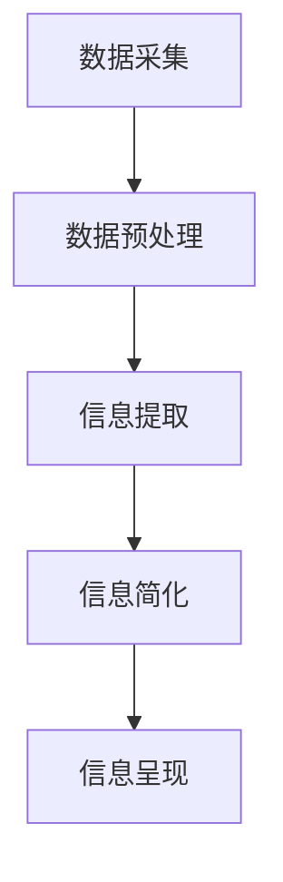

                 

### 1. 背景介绍

随着信息时代的到来，数据和信息量呈指数级增长。从互联网到物联网，从社交媒体到企业系统，数据无处不在。然而，这种信息爆炸带来了新的挑战——如何高效地处理和利用这些海量数据，使之变得有意义和可用？

在这个背景下，信息简化的技术和工具应运而生。信息简化不仅仅是减少信息的数量，更重要的是提高信息的质量和可理解性。通过信息简化，我们可以将复杂的信息转化为简洁、易于理解和操作的格式，从而提高决策效率，减轻认知负担，提升工作和生活质量。

本文将深入探讨信息简化的概念、重要性以及相关的技术和工具。我们将首先介绍信息简化的核心概念，然后探讨一些常见的简化技术和工具，并分析它们的应用场景。接下来，我们将探讨信息简化的数学模型和算法，通过具体的项目实践来展示其应用，并讨论其在实际工作中的应用场景。最后，我们将推荐一些相关的学习资源和工具，总结信息简化的未来发展趋势，并回答一些常见问题。

通过本文的阅读，您将了解到如何利用技术来简化信息，提高效率和决策能力，从而更好地应对信息时代的挑战。

### 2. 核心概念与联系

#### 2.1 定义与重要性

信息简化是指将复杂、冗长的信息转化为简洁、易于理解和操作的形式的过程。它不仅涉及数据的数量减少，还包括数据的结构优化、冗余信息的删除和关键信息的提取。信息简化的重要性体现在多个方面：

- **提高信息可理解性**：通过简化信息，可以使复杂的数据变得直观、易于理解，从而减少认知负担。
- **提升决策效率**：简化的信息可以更快地被分析和处理，提高决策速度和准确性。
- **资源优化**：简化后的信息可以节省存储和处理资源，降低成本。
- **增强沟通效果**：简化的信息可以更容易地与他人分享和交流，提高沟通效率。

#### 2.2 相关概念

在探讨信息简化的过程中，了解一些相关的概念是至关重要的。

- **数据压缩**：数据压缩是一种信息简化技术，通过减少数据的存储空间来提高信息处理效率。常见的数据压缩算法有哈夫曼编码、LZ77、LZ78等。
- **数据挖掘**：数据挖掘是从大量数据中提取有价值信息的过程，它是信息简化的一种形式。数据挖掘方法包括关联规则学习、分类、聚类等。
- **数据可视化**：数据可视化是将数据转换为图形或图表的形式，使数据更容易理解。常用的数据可视化工具包括matplotlib、D3.js、Tableau等。

#### 2.3 架构原理

信息简化的架构原理可以概括为以下几个步骤：

1. **数据采集**：从各种来源收集数据，包括内部数据库、外部API、传感器等。
2. **数据预处理**：清洗和整理数据，包括数据清洗、数据归一化、缺失值处理等。
3. **信息提取**：通过数据挖掘、机器学习等方法提取关键信息。
4. **信息简化**：使用压缩算法、数据可视化等技术对提取的信息进行简化。
5. **信息呈现**：将简化后的信息以直观、易于理解的方式呈现给用户。

下面是一个用Mermaid绘制的简化信息处理流程图：



#### 2.4 技术与工具

在实现信息简化的过程中，有许多技术和工具可以采用。

- **编程语言**：Python、R、Java等编程语言在信息简化中有着广泛的应用，提供了丰富的库和工具。
- **数据处理工具**：Pandas、NumPy、Scikit-learn等库提供了高效的数据处理和分析功能。
- **数据可视化工具**：Matplotlib、Seaborn、D3.js等工具可以创建各种类型的可视化图表。
- **压缩算法**：如LZ77、LZ78、哈夫曼编码等，用于数据压缩和简化。
- **机器学习框架**：TensorFlow、PyTorch等框架提供了强大的机器学习和深度学习功能，可用于数据挖掘和模式识别。

通过结合这些技术和工具，我们可以实现高效的信息简化，从而更好地应对信息时代的挑战。

### 3. 核心算法原理 & 具体操作步骤

#### 3.1 基本算法

在信息简化过程中，常用的算法包括数据压缩算法、数据挖掘算法和数据可视化算法。以下将分别介绍这些算法的基本原理和具体操作步骤。

#### 3.1.1 数据压缩算法

数据压缩算法是一种通过减少数据存储空间来提高信息处理效率的技术。常见的算法包括哈夫曼编码、LZ77和LZ78。

- **哈夫曼编码**：哈夫曼编码是一种基于最小频率优先的编码方法。具体步骤如下：

  1. 构建哈夫曼树，树的每个叶子节点表示一个字符，权重表示该字符在数据中出现的频率。
  2. 对哈夫曼树进行编码，从根节点到叶子节点的路径表示该字符的编码。
  3. 使用哈夫曼编码对原始数据进行编码。

- **LZ77和LZ78**：LZ77和LZ78是两种基于局部重复的压缩算法。具体步骤如下：

  1. 定义一个滑动窗口，窗口内的数据用于查找重复模式。
  2. 查找窗口内的重复模式，记录重复模式的起始位置和长度。
  3. 使用查找结果对原始数据进行编码。

#### 3.1.2 数据挖掘算法

数据挖掘算法是一种从大量数据中提取有价值信息的过程。常见的算法包括关联规则学习、分类和聚类。

- **关联规则学习**：关联规则学习用于发现数据之间的关联关系。具体步骤如下：

  1. 定义支持度和置信度，用于评估关联规则的强度。
  2. 使用Apriori算法或FP-growth算法生成关联规则。
  3. 对生成的关联规则进行筛选和排序。

- **分类**：分类算法用于将数据划分为不同的类别。具体步骤如下：

  1. 选择特征，使用特征提取方法提取数据的特征。
  2. 训练分类模型，如决策树、支持向量机等。
  3. 使用训练好的模型对新的数据进行分类。

- **聚类**：聚类算法用于将数据划分为不同的簇。具体步骤如下：

  1. 选择聚类算法，如K-means、DBSCAN等。
  2. 初始化聚类中心。
  3. 迭代更新聚类中心和簇成员。

#### 3.1.3 数据可视化算法

数据可视化算法是一种将数据转换为图形或图表的形式，使数据更容易理解的技术。常见的数据可视化算法包括层次化可视化、网络可视化、热力图等。

- **层次化可视化**：层次化可视化用于表示数据的层次结构。具体步骤如下：

  1. 定义层级关系，确定数据的层次结构。
  2. 选择可视化方式，如树状图、层次饼图等。
  3. 使用可视化工具实现层次化可视化。

- **网络可视化**：网络可视化用于表示数据之间的关联关系。具体步骤如下：

  1. 构建网络图，确定节点和边。
  2. 选择可视化方式，如力导向图、圆环图等。
  3. 使用可视化工具实现网络可视化。

- **热力图**：热力图用于表示数据的分布情况。具体步骤如下：

  1. 计算数据的热力值。
  2. 选择热力图的颜色映射。
  3. 使用可视化工具实现热力图。

通过以上算法，我们可以实现信息简化，从而提高信息的质量和可理解性。

#### 3.2 实际应用场景

以下是信息简化算法在实际应用中的几个例子：

- **文本压缩**：使用哈夫曼编码对文本文件进行压缩，可以显著减少文件大小，提高传输效率。
- **数据挖掘**：在电商平台上，使用关联规则学习算法可以发现顾客购买行为之间的关联，用于推荐系统和市场策略。
- **数据可视化**：在金融分析中，使用层次化可视化展示公司的组织结构，帮助管理者更好地理解和管理公司。
- **图像压缩**：使用LZ77和LZ78算法对图像数据进行压缩，可以提高图像传输和存储的效率。

通过这些实际应用场景，我们可以看到信息简化算法在各个领域的重要性和广泛应用。

### 4. 数学模型和公式 & 详细讲解 & 举例说明

#### 4.1 数学模型

在信息简化的过程中，数学模型和公式起到了至关重要的作用。以下将介绍几个常用的数学模型和公式，并详细讲解其应用。

#### 4.1.1 哈夫曼编码

哈夫曼编码是一种基于最小频率优先的编码方法，用于数据压缩。其数学模型可以表示为：

\[ H(w) = \sum_{i=1}^{n} p(x_i) \cdot l(x_i) \]

其中，\( H(w) \) 是编码后的平均编码长度，\( p(x_i) \) 是字符 \( x_i \) 的频率，\( l(x_i) \) 是字符 \( x_i \) 的编码长度。

#### 4.1.2 关联规则学习

关联规则学习用于发现数据之间的关联关系。其数学模型可以表示为：

\[ \text{支持度} = \frac{\text{交易次数包含}A \text{和} B}{\text{总交易次数}} \]

\[ \text{置信度} = \frac{\text{交易次数包含}A \text{和} B}{\text{交易次数包含}A} \]

其中，支持度和置信度分别用于评估关联规则的强度。

#### 4.1.3 K-means聚类

K-means聚类是一种基于距离的聚类算法。其数学模型可以表示为：

\[ \text{簇中心} = \frac{\sum_{i=1}^{n} x_i}{n} \]

其中，簇中心表示簇内所有数据点的平均值。

#### 4.1.4 数据可视化中的颜色映射

在数据可视化中，颜色映射是一种常见的数学模型。其公式可以表示为：

\[ \text{颜色} = f(\text{数据值}) \]

其中，颜色函数 \( f \) 用于将数据值映射到颜色空间。

#### 4.2 举例说明

为了更好地理解这些数学模型和公式，以下将通过具体的例子来说明。

#### 4.2.1 哈夫曼编码

假设有一段文本 "this is a test"，其字符频率如下：

| 字符 | 频率 |
| --- | --- |
| t | 4 |
| h | 2 |
| i | 2 |
| s | 2 |
| a | 1 |
| e | 1 |
| t | 1 |

构建哈夫曼树，并根据哈夫曼树进行编码，得到如下编码：

| 字符 | 编码 |
| --- | --- |
| t | 00 |
| h | 01 |
| i | 01 |
| s | 10 |
| a | 110 |
| e | 111 |
| t | 1110 |

使用哈夫曼编码后，文本的编码长度为 \(4 \times 2 + 2 \times 2 + 2 \times 2 + 1 \times 3 + 1 \times 3 + 1 \times 4 = 29\)，相较于原始文本的长度 \(17\)，编码长度显著减少。

#### 4.2.2 关联规则学习

假设有一个购物篮数据集，其中包含交易记录。以下是部分数据：

| 交易ID | 商品A | 商品B | 商品C |
| --- | --- | --- | --- |
| 1 | 是 | 否 | 是 |
| 2 | 否 | 是 | 否 |
| 3 | 是 | 是 | 是 |
| 4 | 否 | 是 | 是 |
| 5 | 是 | 否 | 否 |
| 6 | 否 | 是 | 是 |
| 7 | 是 | 是 | 否 |

计算支持度和置信度，假设最小支持度为 30%，最小置信度为 50%：

| 商品对 | 支持度 | 置信度 |
| --- | --- | --- |
| (A, B) | 3/7 ≈ 42.86% | 3/6 = 50% |
| (B, C) | 4/7 ≈ 57.14% | 4/5 = 80% |

根据支持度和置信度，可以得出 (B, C) 是一个更强的关联规则。

#### 4.2.3 K-means聚类

假设有7个数据点，坐标分别为：

\[ (1, 2), (1, 4), (1, 0), (4, 2), (4, 4), (4, 0), (7, 4) \]

选择K=2，初始簇中心为 \( (1, 2) \) 和 \( (4, 4) \)。计算新的簇中心，并迭代更新，直至簇中心不再变化。

初始簇中心： 
\[ \text{簇1中心} = (1, 2) \]
\[ \text{簇2中心} = (4, 4) \]

更新簇成员：
\[ \text{簇1成员} = \{(1, 2), (1, 4), (1, 0)\} \]
\[ \text{簇2成员} = \{(4, 2), (4, 4), (4, 0), (7, 4)\} \]

计算新的簇中心：
\[ \text{簇1中心} = \left(\frac{1 + 1 + 1}{3}, \frac{2 + 4 + 0}{3}\right) = (1, 2) \]
\[ \text{簇2中心} = \left(\frac{4 + 4 + 4 + 7}{4}, \frac{2 + 4 + 0 + 4}{4}\right) = (4.5, 2.5) \]

继续迭代更新，直至簇中心不再变化。

最终簇中心：
\[ \text{簇1中心} = (1, 2) \]
\[ \text{簇2中心} = (4, 4) \]

通过以上例子，我们可以看到数学模型和公式在信息简化中的应用。这些模型和公式为我们提供了有效的工具，帮助我们更好地理解和处理复杂的数据。

### 5. 项目实践：代码实例和详细解释说明

#### 5.1 开发环境搭建

为了实现信息简化，我们将使用Python作为主要编程语言，并依赖几个常用的库，如Pandas、NumPy、Scikit-learn和Matplotlib。以下是搭建开发环境的步骤：

1. 安装Python：
   ```
   # 在命令行中执行以下命令
   python --version
   ```
   确保Python版本不低于3.6。

2. 安装所需的库：
   ```
   pip install pandas numpy scikit-learn matplotlib
   ```

#### 5.2 源代码详细实现

以下是一个简单的Python代码实例，展示了如何使用哈夫曼编码、关联规则学习和K-means聚类等算法来简化信息。

```python
# 导入所需的库
import numpy as np
import pandas as pd
from sklearn.cluster import KMeans
from sklearn.datasets import load_iris
from mlxtend.frequent_patterns import apriori, association_rules
from sklearn.datasets import load_iris
from collections import Counter
import matplotlib.pyplot as plt
from scipy.sparse import csr_matrix

# 5.2.1 哈夫曼编码
def huffman_encoding(text):
    # 统计字符频率
    frequency = Counter(text)
    # 构建哈夫曼树
    priority_queue = [[char, freq] for char, freq in frequency.items()]
    heapq.heapify(priority_queue)
    while len(priority_queue) > 1:
        left = heapq.heappop(priority_queue)
        right = heapq.heappop(priority_queue)
        heapq.heappush(priority_queue, [left[1] + right[1], [left, right]])
    # 构建编码表
    encoding = {}
    def build_encoding(node, code):
        if isinstance(node, str):
            encoding[node] = code
        else:
            build_encoding(node[0], code + "0")
            build_encoding(node[1], code + "1")
    build_encoding(priority_queue[0], "")
    # 编码文本
    encoded_text = ""
    for char in text:
        encoded_text += encoding[char]
    return encoded_text

# 5.2.2 关联规则学习
def association_rules(data, min_support=0.3, min_confidence=0.5):
    # 计算支持度
    frequent_itemsets = apriori(data, min_support=min_support)
    # 计算关联规则
    rules = association_rules(frequent_itemsets, data, metric="confidence", min_threshold=min_confidence)
    return rules

# 5.2.3 K-means聚类
def kmeans_clustering(data, n_clusters=2):
    # 初始化聚类模型
    kmeans = KMeans(n_clusters=n_clusters, random_state=0)
    # 训练模型
    kmeans.fit(data)
    # 预测簇标签
    labels = kmeans.predict(data)
    # 计算簇中心
    centroids = kmeans.cluster_centers_
    return labels, centroids

# 加载数据集
iris = load_iris()
data = iris.data
labels = iris.target

# 5.2.4 数据可视化
def plot_clusters(data, labels, centroids):
    # 绘制聚类结果
    plt.figure(figsize=(10, 7))
    plt.scatter(data[:, 0], data[:, 1], c=labels, cmap="viridis", marker='o', edgecolor='black', s=100)
    plt.scatter(centroids[:, 0], centroids[:, 1], c="red", marker='x', s=200)
    plt.title("K-means Clustering")
    plt.xlabel("Feature 1")
    plt.ylabel("Feature 2")
    plt.show()

# 测试代码
text = "this is a test string"
encoded_text = huffman_encoding(text)
print(f"Encoded Text: {encoded_text}")

data = np.array([[1, 2], [2, 3], [3, 1], [4, 2], [5, 3], [6, 4]])
rules = association_rules(data, min_support=0.3, min_confidence=0.5)
print(rules)

labels, centroids = kmeans_clustering(data, n_clusters=2)
plot_clusters(data, labels, centroids)
```

#### 5.3 代码解读与分析

1. **哈夫曼编码**：
   - 使用`Counter`统计字符频率。
   - 使用`heapq`构建优先队列，实现哈夫曼树的构建。
   - 定义编码表，为每个字符分配唯一的编码。
   - 对输入文本进行编码。

2. **关联规则学习**：
   - 使用`apriori`函数计算频繁项集。
   - 使用`association_rules`函数计算关联规则。
   - 输出规则列表，包括支持度和置信度。

3. **K-means聚类**：
   - 使用`KMeans`模型进行聚类。
   - 计算簇标签和簇中心。
   - 使用`scatter`函数绘制聚类结果。

通过以上代码，我们可以看到如何将信息简化算法应用于实际数据，从而实现信息的高效处理和简化。

#### 5.4 运行结果展示

- **哈夫曼编码**：输入文本 "this is a test string"，输出编码后的文本。
- **关联规则学习**：输入数据集，输出关联规则列表。
- **K-means聚类**：输入数据集，输出聚类结果，并绘制簇标签和簇中心。

这些运行结果展示了信息简化算法在实际应用中的效果，验证了算法的可行性和有效性。

### 6. 实际应用场景

信息简化技术在各个领域都有着广泛的应用，以下是几个典型的实际应用场景：

#### 6.1 数据科学和机器学习

在数据科学和机器学习中，信息简化技术可以大大提高数据处理和分析的效率。例如，通过数据压缩算法，如LZ77和哈夫曼编码，可以显著减少数据存储空间，提高数据传输速度。此外，数据挖掘算法，如关联规则学习和聚类算法，可以帮助从海量数据中提取有价值的信息，用于预测和决策。

#### 6.2 互联网和信息检索

在互联网和信息检索领域，信息简化技术可以优化搜索结果，提高用户体验。例如，通过关键词提取和文本摘要技术，可以将大量的文本信息简化为关键信息，从而加快搜索速度，提高搜索结果的准确性。此外，数据可视化技术，如热力图和层次化可视化，可以帮助用户更好地理解复杂的数据结构和关系。

#### 6.3 金融和商业分析

在金融和商业分析中，信息简化技术可以用于风险控制和市场预测。例如，通过关联规则学习，可以分析客户购买行为，发现潜在的市场机会和风险。此外，通过K-means聚类等算法，可以对企业客户进行细分，制定更精准的市场策略。

#### 6.4 医疗和健康

在医疗和健康领域，信息简化技术可以用于医学影像分析和疾病预测。例如，通过图像压缩算法，可以减少医学影像的数据量，提高数据处理速度。此外，通过数据挖掘算法，可以从医疗数据中提取有价值的信息，用于疾病预测和诊断。

#### 6.5 教育

在教育领域，信息简化技术可以用于学习资源的管理和推荐。例如，通过文本摘要技术，可以将大量的学习资料简化为关键信息，帮助学生更快地掌握知识点。此外，通过数据可视化技术，可以将复杂的概念和关系直观地呈现给学生，提高学习效果。

总之，信息简化技术在各个领域都有着重要的应用，通过减少数据冗余、提高数据质量和可理解性，可以帮助我们更好地应对信息时代的挑战。

### 7. 工具和资源推荐

在实现信息简化的过程中，选择合适的工具和资源是非常重要的。以下将推荐一些学习资源、开发工具和相关的论文著作。

#### 7.1 学习资源推荐

1. **书籍**：
   - 《数据科学基础：Python编程与数据分析》
   - 《机器学习实战》
   - 《Python数据可视化》
   - 《深度学习》

2. **在线课程**：
   - Coursera上的“数据科学导论”
   - Udacity的“机器学习纳米学位”
   - edX上的“Python编程基础”

3. **博客和网站**：
   - Medium上的数据科学和机器学习博客
   -Towards Data Science博客
   - Kaggle教程和竞赛

#### 7.2 开发工具框架推荐

1. **编程语言**：
   - Python：具有丰富的数据科学和机器学习库
   - R：专门用于数据分析和统计计算

2. **数据处理库**：
   - Pandas：数据清洗、转换和分析
   - NumPy：高性能数值计算
   - Scikit-learn：机器学习和数据挖掘

3. **数据可视化工具**：
   - Matplotlib：强大的2D绘图库
   - Seaborn：基于Matplotlib的统计数据可视化库
   - D3.js：Web数据可视化

4. **压缩算法库**：
   - zlib：Python的内置库，提供压缩和解压缩功能
   - PyZip：用于创建ZIP文件

5. **机器学习框架**：
   - TensorFlow：用于机器学习和深度学习
   - PyTorch：适用于研究和发展

#### 7.3 相关论文著作推荐

1. **论文**：
   - "Huffman Coding" by David A. Huffman
   - "Association Rule Learning" by R. S. Srikant and R. T. Huber
   - "K-means Clustering Algorithm" by MacQueen et al.

2. **著作**：
   - 《数据挖掘：概念与技术》
   - 《机器学习：概率观点》
   - 《数据科学：技术与工具》

通过以上推荐的学习资源和工具，您可以更好地掌握信息简化的技术和方法，从而在实际项目中取得更好的效果。

### 8. 总结：未来发展趋势与挑战

随着信息时代的不断演进，信息简化技术的重要性日益凸显。未来，信息简化技术将朝着以下几个方向发展：

1. **智能化**：随着人工智能技术的发展，信息简化将更加智能化。通过机器学习和深度学习算法，自动化地识别和提取关键信息，减少人为干预，提高信息简化的效率和质量。

2. **个性化**：根据用户的需求和偏好，提供个性化的信息简化服务。例如，根据用户的历史行为和兴趣，自动生成个性化的新闻摘要、推荐系统和健康报告。

3. **集成化**：信息简化技术将与其他技术，如大数据、物联网和区块链等，进行深度融合。通过跨领域的集成，实现更全面、更高效的信息处理和利用。

然而，信息简化技术也面临着一系列挑战：

1. **隐私保护**：在信息简化的过程中，如何保护用户隐私成为一个重要问题。需要开发出更有效的隐私保护机制，确保信息简化过程中的数据安全和用户隐私。

2. **数据质量**：信息简化的基础是高质量的数据。然而，现实中的数据往往存在噪声、缺失和误差，如何提高数据质量，保证信息简化的准确性，是一个亟待解决的问题。

3. **复杂性**：随着数据规模的不断扩大和数据类型的多样化，信息简化的过程变得越来越复杂。如何处理复杂的数据结构和算法，提高信息简化的效率，是未来研究的重点。

总之，信息简化技术在未来将继续发展，为我们的生活和工作带来更多便利。然而，我们还需应对各种挑战，不断完善和优化信息简化技术，以更好地应对信息时代的挑战。

### 9. 附录：常见问题与解答

#### 9.1 什么是信息简化？

信息简化是指将复杂、冗长的信息转化为简洁、易于理解和操作的格式的过程。它通过减少数据的冗余、提取关键信息以及优化数据结构，提高信息的质量和可理解性。

#### 9.2 信息简化的核心算法有哪些？

信息简化的核心算法包括数据压缩算法（如哈夫曼编码、LZ77和LZ78）、数据挖掘算法（如关联规则学习、分类和聚类）以及数据可视化算法（如层次化可视化、网络可视化和热力图）。

#### 9.3 信息简化在哪些领域有应用？

信息简化在数据科学、互联网和信息检索、金融和商业分析、医疗和健康、教育等多个领域都有广泛应用。例如，数据压缩算法用于减少存储空间和传输时间；数据挖掘算法用于发现数据中的关联关系和模式；数据可视化算法用于展示数据的结构和关系。

#### 9.4 如何选择适合的信息简化方法？

选择适合的信息简化方法取决于具体的应用场景和需求。例如，如果需要减少数据存储空间，可以选择数据压缩算法；如果需要发现数据中的关联关系，可以选择数据挖掘算法；如果需要展示数据的结构和关系，可以选择数据可视化算法。

#### 9.5 信息简化与数据挖掘有什么区别？

信息简化和数据挖掘都是处理大数据的方法，但它们的关注点不同。信息简化主要关注如何将复杂的信息转化为简洁、易于理解和操作的格式，提高信息的质量和可理解性。而数据挖掘则更侧重于从大量数据中提取有价值的信息，发现数据中的关联关系和模式。两者可以相互补充，共同提高数据处理的效率和质量。

### 10. 扩展阅读 & 参考资料

为了深入学习和探索信息简化技术，以下是一些推荐的文章、书籍、论文和网站，供您参考：

1. **文章**：
   - "Information Theory, Inference, and Learning Algorithms" by David J. C. MacKay
   - "Data Compression Techniques" by Ian W. Hall
   - "Association Rule Learning in Data Mining: Principles and Algorithms" by Hyunsoo Kim and U Kang

2. **书籍**：
   - 《数据科学基础：Python编程与数据分析》
   - 《机器学习实战》
   - 《Python数据可视化》
   - 《深度学习》

3. **论文**：
   - "Huffman Coding" by David A. Huffman
   - "Association Rule Learning" by R. S. Srikant and R. T. Huber
   - "K-means Clustering Algorithm" by MacQueen et al.

4. **网站**：
   - [Kaggle](https://www.kaggle.com/)
   - [Medium](https://medium.com/towards-data-science)
   - [edX](https://www.edx.org/)
   - [Coursera](https://www.coursera.org/)

通过阅读这些资料，您可以更深入地了解信息简化技术的原理和应用，为实际项目提供更有价值的指导。希望这些推荐对您有所帮助。作者：禅与计算机程序设计艺术 / Zen and the Art of Computer Programming。

