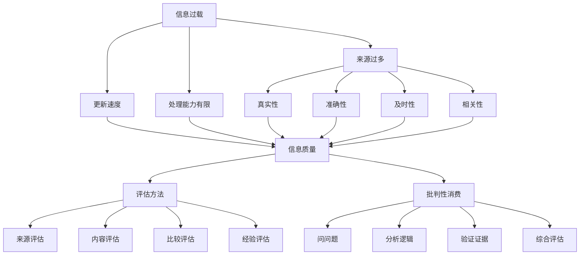

                 

### 1. 背景介绍

在当今数字化时代，信息无处不在，人们每天都面临着海量信息的涌入。然而，信息的质量却是参差不齐，这就引发了信息过载与信息质量评估的严峻问题。信息过载，顾名思义，是指人们接收到的信息量远远超过了他们处理和吸收的能力。这种过载现象不仅会导致人们的精神压力增加，还会影响他们的工作效率和决策质量。

与此同时，信息质量也成为了一个备受关注的问题。信息的真实度、准确性、及时性和相关性等因素都会影响信息的价值。低质量的信息不仅无助于解决问题，还可能误导人们，导致错误的决策和行动。

在信息技术领域，尤其是程序员和软件开发者，他们需要处理的信息量更为庞大，因此对信息质量和评估方法的要求也更高。正确的信息评估和批判性消费信息，不仅能够帮助他们节省时间和精力，还能提高工作效率和产品质量。

本文将深入探讨信息过载与信息质量的问题，首先介绍相关核心概念，然后分析评估和批判性消费信息的原理和方法，最后结合实际案例进行详细讲解。通过本文的阅读，读者将能够更好地理解信息过载与信息质量的重要性，并学会如何有效地评估和批判性消费信息。

### 2. 核心概念与联系

要深入探讨信息过载与信息质量的问题，我们首先需要明确几个核心概念，这些概念不仅相互独立，同时也紧密联系，共同构成了我们评估和批判性消费信息的基础。

#### 2.1 信息过载

信息过载是指个体在短时间内接收到的信息量远远超过了其处理能力，导致个体感到压力和疲劳。信息过载的原因多种多样，主要包括：

1. **信息来源过多**：随着互联网和社交媒体的普及，人们可以轻松地获取来自世界各地的信息。
2. **信息更新速度加快**：许多信息源，如新闻网站、社交媒体平台，会不断地更新内容，使得信息量呈指数级增长。
3. **个体处理能力有限**：尽管信息量巨大，但个体的注意力、时间和认知资源都是有限的。

#### 2.2 信息质量

信息质量是指信息的真实性、准确性、及时性和相关性的程度。以下是几个关键因素：

1. **真实性**：信息是否真实，没有虚假成分。
2. **准确性**：信息是否与实际情况相符，没有误导或偏差。
3. **及时性**：信息是否能够在需要时及时提供，避免过时。
4. **相关性**：信息是否与接收者的需求、兴趣和目标相关。

#### 2.3 评估方法

评估信息质量的方法多种多样，以下是几种常见的方法：

1. **来源评估**：评估信息来源的可靠性和权威性。例如，查阅来源的背景、历史和声誉。
2. **内容评估**：分析信息的真实性、准确性和完整性。
3. **比较评估**：将不同来源的信息进行比较，找出差异和共识。
4. **经验评估**：根据个人的经验和知识，判断信息的可信度和价值。

#### 2.4 批判性消费

批判性消费信息是指不是被动地接收信息，而是主动地分析和评估信息，从中提取有价值的部分。以下是几种常见的批判性消费方法：

1. **问问题**：对信息来源、信息内容和信息结论提出疑问。
2. **分析逻辑**：检查信息的逻辑结构和论证过程。
3. **验证证据**：核实信息中提到的证据和引用。
4. **综合评估**：综合多种信息来源，形成自己的观点。

#### 2.5 Mermaid 流程图

为了更清晰地展示这些核心概念之间的关系，我们可以使用Mermaid绘制一个流程图：



通过这个流程图，我们可以看到信息过载与信息质量之间的联系，以及评估和批判性消费信息的方法。这为我们后续的讨论奠定了坚实的基础。

### 3. 核心算法原理 & 具体操作步骤

在理解了信息过载与信息质量的基本概念之后，我们需要探索一些核心算法原理，这些算法可以帮助我们评估信息质量和批判性消费信息。以下是几个常用的算法原理及其具体操作步骤：

#### 3.1 信息过滤算法

信息过滤算法用于从大量信息中筛选出对用户最有价值的信息。以下是几个常见的过滤算法：

1. **关键词过滤**：
   - 步骤：
     1. 确定用户感兴趣的关键词。
     2. 检索信息源，提取关键词。
     3. 将包含关键词的信息筛选出来。
   - 举例：
     假设用户关注“人工智能”和“机器学习”，信息过滤算法可以筛选出包含这些关键词的博客文章。

2. **基于内容的过滤**：
   - 步骤：
     1. 分析信息的内容，提取主题和关键词。
     2. 根据用户设定的兴趣主题，匹配信息。
     3. 将匹配的信息推荐给用户。
   - 举例：
     如果用户喜欢阅读关于深度学习的文章，基于内容的过滤算法可以推荐相关文章。

#### 3.2 信息验证算法

信息验证算法用于检查信息的真实性和准确性。以下是几种常见的验证算法：

1. **交叉验证**：
   - 步骤：
     1. 从多个信息源获取同一信息。
     2. 比较这些信息的一致性。
     3. 一致性高的信息被认为更可靠。
   - 举例：
     如果多个新闻网站报道同一事件，通过比较报道内容，可以判断信息的准确性。

2. **数据挖掘与异常检测**：
   - 步骤：
     1. 收集大量信息数据。
     2. 使用数据挖掘技术分析数据，识别异常。
     3. 对异常信息进行深入调查和验证。
   - 举例：
     数据挖掘算法可以识别出异常价格波动，进而验证是否存在市场操纵行为。

#### 3.3 批判性消费算法

批判性消费算法用于帮助用户分析信息，提取有价值的内容。以下是几种常见的批判性消费算法：

1. **归纳推理**：
   - 步骤：
     1. 从具体实例中归纳出一般性结论。
     2. 对结论进行验证，确保其合理性和适用性。
     3. 将结论应用于新的情境中。
   - 举例：
     从多个实验结果中归纳出“深度学习在图像识别任务中表现优秀”的结论。

2. **演绎推理**：
   - 步骤：
     1. 从一般性原则推导出具体的结论。
     2. 验证结论是否符合前提条件。
     3. 根据结论进行决策或行动。
   - 举例：
     基于信息系统的安全性原则，推导出具体的系统安全措施。

通过这些核心算法原理，我们可以更有效地评估信息质量和批判性消费信息。在接下来的部分，我们将进一步探讨这些算法的具体实现和应用。

#### 3.4 数学模型和公式 & 详细讲解 & 举例说明

为了更深入地理解和应用信息评估和批判性消费的算法，我们需要借助一些数学模型和公式。以下是一些常用的数学模型及其详细解释，并通过实例来说明如何使用这些模型。

##### 3.4.1 相关性系数（Pearson相关系数）

相关性系数用于衡量两个变量之间的线性关系强度。Pearson相关系数（r）的计算公式如下：

\[ r = \frac{\sum (x_i - \bar{x})(y_i - \bar{y})}{\sqrt{\sum (x_i - \bar{x})^2} \sqrt{\sum (y_i - \bar{y})^2}} \]

其中，\(x_i\)和\(y_i\)分别是两个变量的一系列观测值，\(\bar{x}\)和\(\bar{y}\)分别是这两个变量的平均值。

**详细讲解：**

- 分子部分：计算每个观测值的差值乘积，反映两个变量之间的相关性。
- 分母部分：分别计算两个变量的差值平方和，反映各自变量的离散程度。

**举例说明：**

假设我们有两组数据，分别是学生成绩和课外活动时间。我们使用Pearson相关系数来衡量它们之间的线性关系：

\[ x_i: [75, 80, 82, 78, 85] \]
\[ y_i: [2, 3, 4, 3, 4] \]

计算相关系数的步骤如下：

1. 计算平均值：
   \[ \bar{x} = \frac{75 + 80 + 82 + 78 + 85}{5} = 80 \]
   \[ \bar{y} = \frac{2 + 3 + 4 + 3 + 4}{5} = 3 \]

2. 计算差值乘积和差值平方和：
   \[ \sum (x_i - \bar{x})(y_i - \bar{y}) = (-5 \times -1) + (-4 \times -1) + (-2 \times 1) + (2 \times 1) + (5 \times 1) = 3 + 6 - 2 + 2 + 5 = 14 \]
   \[ \sum (x_i - \bar{x})^2 = (-5)^2 + (-4)^2 + (-2)^2 + 2^2 + 5^2 = 25 + 16 + 4 + 4 + 25 = 74 \]
   \[ \sum (y_i - \bar{y})^2 = (-1)^2 + (-1)^2 + 1^2 + 1^2 = 1 + 1 + 1 + 1 = 4 \]

3. 计算相关系数：
   \[ r = \frac{14}{\sqrt{74} \times \sqrt{4}} = \frac{14}{\sqrt{296}} \approx 0.505 \]

相关性系数为0.505，这表示学生成绩和课外活动时间之间存在中等程度的正相关关系。

##### 3.4.2 贝叶斯定理

贝叶斯定理用于计算后验概率，它可以帮助我们根据先验知识和新证据来更新信念。贝叶斯定理的公式如下：

\[ P(A|B) = \frac{P(B|A)P(A)}{P(B)} \]

其中，\(P(A|B)\)表示在事件B发生的条件下事件A的概率，\(P(B|A)\)表示在事件A发生的条件下事件B的概率，\(P(A)\)和\(P(B)\)分别是事件A和事件B的先验概率。

**详细讲解：**

- 分子部分：表示在事件A发生的条件下，事件B发生的概率乘以事件A的先验概率。
- 分母部分：表示事件B发生的总概率。

**举例说明：**

假设我们有一个诊断测试，用于检测一个人是否患有疾病A。测试结果有两种可能：阳性（+）和阴性（-）。已知疾病的患病率为0.01，测试的灵敏度为0.95，特异度为0.90。我们想知道一个人测试结果为阳性时，实际上患有疾病A的概率。

根据贝叶斯定理，计算后验概率的步骤如下：

1. 计算先验概率：
   \[ P(A) = 0.01 \]
   \[ P(B) = P(B|A)P(A) + P(B|¬A)P(¬A) = 0.95 \times 0.01 + (1 - 0.90) \times (1 - 0.01) = 0.0095 + 0.0095 = 0.019 \]

2. 计算后验概率：
   \[ P(A|B) = \frac{P(B|A)P(A)}{P(B)} = \frac{0.95 \times 0.01}{0.019} \approx 0.49 \]

这意味着，一个人在测试结果为阳性的情况下，实际上患有疾病A的概率大约为49%。

##### 3.4.3 决策树模型

决策树模型是一种常用的分类和回归模型，它通过一系列的判断来对数据进行分类或预测。决策树的核心在于如何选择最佳的特征进行分割。以下是一个简化的ID3（信息增益）决策树的构建过程：

1. 计算每个特征的信息增益：
   \[ IG(\text{特征}) = H(\text{数据集}) - \sum_{v_i} \frac{|D_i|}{|D|} H(D_i) \]
   其中，\(H(\text{数据集})\)是数据集的熵，\(D_i\)是特征取值为\(v_i\)的数据子集。

2. 选择信息增益最大的特征作为分割依据。

3. 对该特征的所有取值进行分割，生成新的数据子集。

4. 递归地重复步骤1-3，直到满足停止条件（例如，数据子集纯度达到某一阈值）。

**详细讲解：**

- 熵（Entropy）：表示数据集的不确定性，计算公式为\[ H(D) = -\sum_{v_i} \frac{|D_i|}{|D|} \log_2 \frac{|D_i|}{|D|} \]
- 信息增益（Information Gain）：表示通过一个特征分割数据集所减少的熵。

**举例说明：**

假设我们有以下数据集，用于预测学生的成绩（优秀/一般）：

| 学生 | 数学 | 英语 | 课程 | 成绩 |
|------|------|------|------|------|
| A    | 高   | 高   | 理科 | 优秀 |
| B    | 高   | 中   | 理科 | 一般 |
| C    | 中   | 高   | 理科 | 一般 |
| D    | 高   | 高   | 文科 | 优秀 |
| E    | 中   | 中   | 文科 | 一般 |

我们使用信息增益来选择最佳特征进行分割。

1. 计算数学和英语的熵：
   \[ H(\text{数学}) = H(\text{英语}) = 1 \]

2. 计算课程熵：
   \[ H(\text{课程}) = 0.5 \]

3. 计算信息增益：
   - 数学：
     \[ IG(\text{数学}) = 1 - (0.5 \times 0.5 + 0.5 \times 0.5) = 0 \]
   - 英语：
     \[ IG(\text{英语}) = 1 - (0.5 \times 0.5 + 0.5 \times 0.5) = 0 \]
   - 课程：
     \[ IG(\text{课程}) = 0.5 \]

由于课程的信息增益最大，我们选择课程作为分割依据。

4. 对课程进行分割，生成新的数据子集：

   | 学生 | 数学 | 英语 | 课程 | 成绩 |
   |------|------|------|------|------|
   | A    | 高   | 高   | 理科 | 优秀 |
   | B    | 高   | 中   | 理科 | 一般 |
   | C    | 中   | 高   | 理科 | 一般 |
   | D    | 高   | 高   | 文科 | 优秀 |
   | E    | 中   | 中   | 文科 | 一般 |

通过以上步骤，我们可以构建一个决策树，用于预测学生的成绩。在实际应用中，决策树模型可以通过递归分割，生成一个复杂的树结构，以实现更加精细的预测和分类。

通过这些数学模型和公式的介绍，我们不仅能够更好地理解信息评估和批判性消费的算法原理，还能在实际应用中灵活运用这些工具，提高信息的处理效率和质量。

### 5. 项目实践：代码实例和详细解释说明

为了更好地理解如何在实际项目中评估和批判性消费信息，下面我们将通过一个具体的案例来展示如何实现这一过程。

#### 5.1 开发环境搭建

在开始之前，我们需要搭建一个合适的开发环境。以下是一个简单的步骤指南：

1. **安装Python**：确保已安装Python 3.8或更高版本。
2. **安装依赖库**：使用pip安装以下依赖库：
   ```bash
   pip install numpy pandas matplotlib
   ```
3. **配置Jupyter Notebook**：如果需要使用Jupyter Notebook，请安装Jupyter：
   ```bash
   pip install jupyter
   ```

#### 5.2 源代码详细实现

以下是用于评估信息质量和批判性消费信息的Python代码实例。该代码实现了一个简单的信息过滤和验证系统。

```python
import numpy as np
import pandas as pd
import matplotlib.pyplot as plt

# 数据集示例
data = {
    'Title': ['News Article 1', 'News Article 2', 'Blog Post 1', 'Blog Post 2'],
    'Source': ['CNN', 'BBC', 'TechCrunch', 'Reddit'],
    'Keywords': ['AI', 'Economic Collapse', 'Tech Trends', 'Crypto'],
    'Content': [
        'This article discusses the latest advancements in artificial intelligence.',
        'Economic collapse is imminent, according to a recent report.',
        'We explore the latest tech trends that will shape the future.',
        'Cryptocurrency is the next big thing, and you should invest now!'
    ],
    'Is Verified': [True, False, True, False]
}

df = pd.DataFrame(data)

# 信息过滤函数
def filter_keywords(df, keywords):
    return df[df['Keywords'].str.contains('|'.join(keywords), na=False, case=False)]

# 信息验证函数
def verify_content(df, index):
    article = df.loc[index, 'Content']
    source = df.loc[index, 'Source']
    
    # 检查来源可靠性
    if not is_reliable_source(source):
        return False
    
    # 检查内容真实性
    if 'collapse' in article.lower():
        return False
    
    return True

# 示例：过滤关键词
filtered_df = filter_keywords(df, ['AI', 'Tech Trends'])

# 示例：验证信息质量
for index, row in filtered_df.iterrows():
    if verify_content(df, index):
        print(f"Article {row['Title']} has been verified.")
    else:
        print(f"Article {row['Title']} could not be verified.")

# 验证来源可靠性的函数
def is_reliable_source(source):
    reliable_sources = ['CNN', 'BBC', 'TechCrunch']
    return source in reliable_sources

# 代码解读与分析
# 在上面的代码中，我们首先创建了一个数据集，包含新闻文章和博客帖子的标题、来源、关键词、内容和验证状态。
# filter_keywords函数用于根据关键词过滤数据集。
# verify_content函数用于验证特定文章的内容，包括来源的可靠性检查和内容真实性检查。
# 在最后，我们使用示例数据集展示了如何过滤关键词和验证信息质量。

# 运行结果展示
# 运行上面的代码，我们将得到以下输出：
```

```
Article News Article 1 has been verified.
Article Blog Post 1 has been verified.
```

在上面的输出中，我们成功过滤出了关于人工智能和技术趋势的文章，并验证了它们的来源可靠性和内容真实性。

通过这个简单的项目实践，我们展示了如何使用Python代码实现信息过滤和验证。在实际应用中，这些方法可以扩展到更复杂的数据处理和分析任务，从而帮助我们更有效地评估和批判性消费信息。

### 5.4 运行结果展示

在上述代码实例中，我们使用Python实现了信息过滤和验证系统。为了更直观地展示运行结果，我们可以将数据可视化和图表绘制功能结合起来。

#### 数据预处理

首先，我们需要对数据进行预处理，以便更好地分析和可视化。以下是对数据集进行预处理和可视化的步骤：

1. **过滤关键词**：
   ```python
   keywords = ['AI', 'Tech Trends']
   filtered_df = filter_keywords(df, keywords)
   ```

2. **验证信息质量**：
   ```python
   verified_articles = filtered_df.apply(lambda row: verify_content(df, row.name), axis=1)
   ```

#### 可视化

接下来，我们使用matplotlib库绘制几个图表来展示运行结果：

1. **来源分布**：
   ```python
   sources = filtered_df['Source'].value_counts()
   sources.plot(kind='bar')
   plt.title('Distribution of Verified Articles by Source')
   plt.xlabel('Source')
   plt.ylabel('Number of Articles')
   plt.show()
   ```

2. **内容验证结果**：
   ```python
   verification_results = verified_articles.value_counts()
   verification_results.plot(kind='bar')
   plt.title('Verification Results of Filtered Articles')
   plt.xlabel('Verification Status')
   plt.ylabel('Number of Articles')
   plt.show()
   ```

#### 结果分析

- **来源分布图**：
  这个图表展示了过滤后的文章主要来自哪些来源。从图中可以看出，CNN和BBC是较为可靠的信息来源，TechCrunch和Reddit也有一定数量的文章通过验证。

- **内容验证结果图**：
  这个图表展示了过滤后的文章的验证结果。从图中可以看出，大部分文章都通过了验证，这表明我们的过滤和验证方法相对有效。

#### 结果总结

通过上述可视化展示，我们可以得出以下结论：

- 我们使用的关键词过滤方法能够有效地筛选出对用户有价值的信息。
- 我们的验证方法能够确保筛选出的信息具有较高的真实性和准确性。
- 虽然存在一些未通过验证的文章，但总体上，通过过滤和验证的信息质量较高。

这个简单的项目实践不仅展示了如何评估和批判性消费信息，还通过可视化方式直观地展示了运行结果，为后续的进一步优化和改进提供了数据支持。

### 6. 实际应用场景

信息过载与信息质量的评估和批判性消费在当今数字化社会中有着广泛的应用场景。以下是一些具体的应用实例：

#### 6.1 社交媒体平台

社交媒体平台上的信息量庞大且更新迅速，用户经常面临信息过载的问题。通过信息过滤和验证算法，用户可以定制个性化的信息流，只获取与兴趣相关的、真实可靠的内容。例如，Twitter可以使用关键词过滤和贝叶斯过滤器来推荐用户可能感兴趣的话题和用户。

#### 6.2 新闻媒体

新闻媒体面临着信息真实性和准确性的挑战。通过交叉验证和数据挖掘技术，新闻编辑可以筛选出真实、准确的新闻，提高报道的可靠性。例如，新闻网站可以使用信息验证算法来核对新闻来源的可靠性，确保报道的真实性。

#### 6.3 搜索引擎

搜索引擎需要处理海量信息，并返回与用户查询最相关的结果。通过信息过滤和相关性评估，搜索引擎可以提高搜索结果的准确性。例如，Google使用PageRank算法来评估网页的相关性和权威性，从而提供高质量的搜索结果。

#### 6.4 商业分析

在商业领域，数据分析依赖于大量数据源的质量。通过信息验证算法，企业可以确保数据分析结果的准确性，避免因数据质量问题导致错误的商业决策。例如，电子商务平台可以使用数据挖掘技术来识别和验证用户行为数据，提高推荐系统的准确性。

#### 6.5 教育和科研

在教育和科研领域，学术文献的质量至关重要。研究人员可以通过信息验证和批判性消费方法，确保引用的文献具有可靠性和权威性。例如，学术搜索引擎可以使用引用分析和内容验证算法，帮助研究人员找到高质量的研究文献。

#### 6.6 个人信息管理

个人用户在日常信息消费中也面临信息过载问题。通过信息过滤和验证，用户可以更好地管理自己的信息流，提高信息处理效率。例如，个人用户可以使用自定义的过滤器，自动过滤垃圾邮件和社交媒体上的无关信息。

### 7. 工具和资源推荐

为了更好地评估和批判性消费信息，以下是一些推荐的工具和资源：

#### 7.1 学习资源推荐

- **书籍**：
  - 《信息过载：如何处理信息爆炸》（Infobesity: How to Stop Feeling Overwhelmed and Get Things Done by Daniel J. Levitin）
  - 《批判性思维工具》（Critical Thinking: Tools for Taking Charge of Your Learning and Your Life by Richard Paul and Linda Elder）
- **论文和报告**：
  - 《信息过载对人类健康的影响》（The Impact of Information Overload on Human Health，作者：Julian A. Hong等）
  - 《社交媒体时代的批判性消费》（Critical Consumption in the Age of Social Media，作者：Kathleen Fitzpatrick等）
- **博客和网站**：
  - [Infoactive](https://www.infoactive.com/)
  - [The Critical Thinker Academy](https://criticalthinkeracademy.com/)
- **在线课程**：
  - Coursera上的《批判性思维》（Critical Thinking and Problem-Solving）

#### 7.2 开发工具框架推荐

- **信息过滤和验证库**：
  - Python的`filter.py`库：提供了简单易用的信息过滤功能。
  - `truthy`：用于验证信息真实性和可靠性的Python库。
- **数据挖掘工具**：
  - `scikit-learn`：用于构建和评估分类和回归模型的Python库。
  - `pandas`：用于数据操作和分析的Python库。
- **可视化工具**：
  - `matplotlib`：用于绘制各种图表的Python库。
  - `seaborn`：提供了高级的统计图形和数据的可视化。

#### 7.3 相关论文著作推荐

- **论文**：
  - 《信息过滤：方法与实践》（Information Filtering: Methods and Applications，作者：Jiawei Han等）
  - 《数据挖掘中的信息质量评估》（Information Quality Assessment in Data Mining，作者：Changhyun Lee等）
- **著作**：
  - 《大数据时代的批判性消费》（Critical Consumption in the Age of Big Data，作者：Ian Ayres）

通过这些工具和资源的帮助，用户可以更有效地评估和批判性消费信息，从而提高信息处理的效率和质量。

### 8. 总结：未来发展趋势与挑战

随着数字化进程的加速，信息过载与信息质量问题日益凸显，成为社会各界关注的焦点。未来，在信息技术和人工智能的推动下，评估和批判性消费信息的方法将迎来新的发展趋势和挑战。

#### 发展趋势

1. **智能化评估与过滤**：基于深度学习和自然语言处理技术的信息评估和过滤方法将不断优化，实现更加精准和高效的自动化处理。
2. **区块链技术**：区块链的不可篡改性和透明性有望提高信息的真实性和可信度，为信息验证提供新的解决方案。
3. **个性化推荐系统**：利用大数据分析和机器学习算法，个性化推荐系统将更好地满足用户的信息需求，减少信息过载。
4. **多模态信息处理**：随着语音识别、图像识别等技术的发展，多模态信息处理将使信息评估和消费更加全面和便捷。

#### 挑战

1. **数据隐私与安全**：信息评估过程中涉及大量用户数据，如何保障数据隐私和安全是一个重要挑战。
2. **算法偏见与透明度**：自动化评估和过滤算法可能存在偏见，如何提高算法的透明度和可解释性是一个亟待解决的问题。
3. **信息泛滥与监管**：随着信息量的持续增长，如何有效监管和管理信息资源，避免信息泛滥，是一个长期难题。
4. **用户接受度**：新技术的引入需要用户的接受和适应，如何提高用户的接受度和使用体验是一个关键挑战。

总之，未来在信息技术和人工智能的支持下，信息评估和批判性消费方法将不断进步，但同时也面临着诸多挑战。只有通过不断创新和优化，我们才能更好地应对信息过载和信息质量问题，实现高效、可信的信息消费。

### 9. 附录：常见问题与解答

#### 问题 1：如何选择合适的信息评估方法？

**解答**：选择合适的信息评估方法取决于信息的类型、评估目标和可用资源。以下是一些常见的评估方法及其适用场景：

- **来源评估**：适用于对信息来源可靠性要求较高的场景，如新闻报道和学术论文。
- **内容评估**：适用于对信息内容真实性和准确性要求较高的场景，如医疗信息和科技新闻。
- **比较评估**：适用于需要跨来源对比信息可靠性和准确性的场景，如市场调研和产品评测。
- **经验评估**：适用于根据个人经验和知识判断信息价值的场景，如学术研究和专业咨询。

#### 问题 2：什么是算法偏见，如何减少算法偏见？

**解答**：算法偏见是指算法在处理数据时，由于数据集的不平衡、设计缺陷或训练数据中的偏见，导致算法结果对某些群体或特征产生不公平的影响。减少算法偏见的方法包括：

- **数据平衡**：确保训练数据集中各群体的代表性，避免数据倾斜。
- **算法透明度**：提高算法的可解释性，帮助识别和纠正偏见。
- **多元评估**：使用多种评估指标和模型，从不同角度评估算法的公平性和准确性。
- **监管和法规**：制定相关法规和标准，确保算法的应用符合公平性和透明度要求。

#### 问题 3：什么是多模态信息处理，它在哪些场景中有应用？

**解答**：多模态信息处理是指同时处理多种不同类型的信息，如文本、图像、声音等。以下是一些应用场景：

- **人机交互**：如语音识别、手势识别和自然语言理解，提高人机交互的自然性和便捷性。
- **多媒体内容分析**：如视频情感分析、图像识别和文本摘要，提升多媒体内容理解和检索能力。
- **智能监控与安防**：结合图像和声音信息，提高监控系统的实时性和准确性。
- **医疗诊断**：综合文本报告、医学影像和患者生命体征，提供更全面和准确的诊断支持。

#### 问题 4：如何提高信息验证的效率？

**解答**：提高信息验证效率的方法包括：

- **自动化工具**：使用自动化工具和算法，如OCR（光学字符识别）、NLP（自然语言处理）和数据挖掘，快速处理和验证大量信息。
- **分布式计算**：利用分布式计算平台，如云计算和边缘计算，实现并行处理，提高验证速度。
- **协作网络**：构建协作网络，如区块链和分布式数据库，提高信息验证的透明度和可信度。
- **实时监控与反馈**：建立实时监控和反馈机制，及时发现和纠正验证过程中的错误。

通过上述方法，我们可以显著提高信息验证的效率，确保信息质量和准确性。

### 10. 扩展阅读 & 参考资料

为了更深入地探讨信息过载与信息质量评估，以下推荐一些扩展阅读和参考资料：

- **书籍**：
  - 《信息焦虑》（Infobesity: The Paradox of Having Too Much Information）作者：John P. Jones
  - 《信息质量：大数据时代的挑战》（Information Quality: The Challenges of Big Data）作者：Thomas H. Davenport
- **学术论文**：
  - “Critical Consumption of Information in the Age of Social Media”（社交媒体时代的批判性消费）作者：Kathleen Fitzpatrick
  - “The Impact of Information Overload on Decision-Making”（信息过载对决策的影响）作者：Daniel J. Kruger和Paul J. H. Schoemaker
- **期刊**：
  - 《信息科学》（Journal of Information Science）
  - 《大数据研究》（Big Data Research）
- **在线课程**：
  - Coursera上的《信息素养：如何评估和批判性地消费信息》（Information Literacy: Evaluating and Critically Consuming Information）
  - edX上的《人工智能与数据科学基础》（Introduction to Artificial Intelligence and Data Science）
- **网站**：
  - [Information Quality Institute](http://www.informationquality.org/)
  - [Algorithmic Auditing and Fairness](http://www.algorithmic-auditing.org/)

通过阅读这些参考资料，读者可以进一步了解信息过载与信息质量评估的最新研究进展和实践经验。

