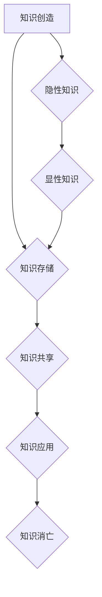

                 

### 1. 背景介绍

随着信息技术的发展，我们每天都面临着大量的信息涌入。从社交媒体的推送、电子邮件的通知，到各种应用程序的提醒，信息过载已经成为现代生活中不可避免的现象。面对如此庞大的信息量，如何有效地管理和处理这些信息，已经成为提高生产力和决策能力的重大挑战。

在IT领域，知识管理（Knowledge Management, KM）策略的实施显得尤为重要。知识管理不仅涉及信息的收集、整理、存储和传播，还包括通过有效的工具和流程来提升个人和团队的知识共享和创新能力。然而，如何在实际操作中有效地实施知识管理策略，仍然是一个需要深入探讨的问题。

本文旨在探讨信息过载与知识管理策略之间的关系，并提出一系列具体的方法和工具，帮助个人和团队更好地管理信息，提高生产力和决策能力。文章结构如下：

- **背景介绍**：介绍信息过载的背景以及知识管理策略的重要性。
- **核心概念与联系**：阐述知识管理中的核心概念，并使用Mermaid流程图展示相关架构。
- **核心算法原理 & 具体操作步骤**：详细解释知识管理策略的核心算法，包括信息过滤、分类和知识提取等。
- **数学模型和公式 & 详细讲解 & 举例说明**：介绍用于知识管理策略的数学模型，并使用LaTeX格式进行详细讲解。
- **项目实践：代码实例和详细解释说明**：通过具体的项目实例展示知识管理策略的应用。
- **实际应用场景**：探讨知识管理策略在不同场景下的应用。
- **工具和资源推荐**：推荐相关的学习资源、开发工具和框架。
- **总结：未来发展趋势与挑战**：总结知识管理策略的实施现状，并提出未来发展的趋势和挑战。
- **附录：常见问题与解答**：解答一些关于知识管理策略的常见问题。
- **扩展阅读 & 参考资料**：提供进一步的阅读材料和参考资料。

### 1.1 信息过载的定义和影响

信息过载（Information Overload）是指个人或组织在处理信息时感受到的负担过重，无法有效地理解和处理所有涌入的信息。随着互联网和移动设备的普及，人们每天都会接触到大量的信息，这些信息可能来自社交媒体、电子邮件、新闻网站、在线论坛等不同的渠道。

信息过载的影响是多方面的。首先，它会导致时间管理上的困难，人们可能需要花费大量时间来筛选和处理信息，从而影响日常工作的效率。其次，信息过载会引发认知负荷，即大脑需要处理的信息量超过了其处理能力，导致思维模糊、决策困难。此外，信息过载还可能导致压力增加，影响个人的心理健康。

在IT领域，信息过载的影响尤为显著。软件工程师、数据科学家、项目经理等职业通常需要处理大量的技术文档、代码库、日志文件等，稍有不慎就可能陷入信息的海洋中，难以自拔。这不仅会影响工作效率，还可能对项目的成功产生负面影响。

### 1.2 知识管理的定义和重要性

知识管理（Knowledge Management, KM）是一种通过系统化方法来收集、存储、组织、传播和利用知识的活动。它不仅关注知识的存储和共享，还强调知识的创造和应用。

知识管理的重要性在于它能够帮助企业或团队：

1. **提高工作效率**：通过知识共享，团队成员可以更快地获取所需信息，避免重复劳动，从而提高工作效率。
2. **增强创新能力**：知识共享和协作有助于激发团队成员的创新思维，促进新想法的产生。
3. **优化决策过程**：基于充分的知识和信息，决策者可以做出更加明智的决策。
4. **降低培训成本**：知识管理系统可以帮助新员工快速获取所需知识，减少培训成本。
5. **提升客户满意度**：通过知识共享，企业可以更好地了解客户需求，提供更加个性化的服务。

在IT领域，知识管理尤为关键。IT行业的发展速度非常快，新技术和新概念层出不穷，技术人员需要不断更新自己的知识和技能。通过有效的知识管理，IT团队可以更好地应对技术变革，保持竞争优势。

### 1.3 知识管理策略的基本概念

知识管理策略主要包括以下几个方面：

1. **知识收集**：通过各种手段收集内部和外部知识，包括文档、报告、博客、论坛等。
2. **知识存储**：构建一个结构化的知识库，以便于知识的存储和管理。
3. **知识共享**：通过共享平台和工具，促进知识的传播和交流。
4. **知识应用**：将知识应用于实际工作中，解决实际问题。
5. **知识创新**：通过知识共享和协作，不断创造新的知识和价值。

这些策略在实际操作中需要综合考虑多种因素，包括组织文化、技术基础设施、人员素质等。

### 1.4 知识管理与信息过载的关系

信息过载和知识管理之间存在密切的关系。一方面，信息过载是知识管理面临的挑战之一。当信息量过大时，知识管理策略的效率和效果可能会受到影响。另一方面，知识管理策略的实施可以有效缓解信息过载的问题。

通过有效的知识管理，企业或团队可以：

- **过滤信息**：通过设置关键词、过滤规则等，只保留对工作相关的信息，减少冗余信息。
- **分类信息**：将信息按照主题、类型、来源等进行分类，便于快速查找和利用。
- **知识整合**：将分散的信息整合成知识体系，便于知识的传播和应用。
- **知识萃取**：从大量的信息中提取出有价值的信息和知识，为决策提供支持。

总之，信息过载与知识管理策略的实施密切相关，只有通过有效的知识管理，才能在信息过载的挑战中脱颖而出，提高生产力和决策能力。

### 1.5 本文的目的和结构

本文的目的是探讨信息过载与知识管理策略之间的关系，并提出一系列具体的方法和工具，帮助个人和团队更好地管理信息，提高生产力和决策能力。文章结构如下：

- **背景介绍**：介绍信息过载的背景以及知识管理策略的重要性。
- **核心概念与联系**：阐述知识管理中的核心概念，并使用Mermaid流程图展示相关架构。
- **核心算法原理 & 具体操作步骤**：详细解释知识管理策略的核心算法，包括信息过滤、分类和知识提取等。
- **数学模型和公式 & 详细讲解 & 举例说明**：介绍用于知识管理策略的数学模型，并使用LaTeX格式进行详细讲解。
- **项目实践：代码实例和详细解释说明**：通过具体的项目实例展示知识管理策略的应用。
- **实际应用场景**：探讨知识管理策略在不同场景下的应用。
- **工具和资源推荐**：推荐相关的学习资源、开发工具和框架。
- **总结：未来发展趋势与挑战**：总结知识管理策略的实施现状，并提出未来发展的趋势和挑战。
- **附录：常见问题与解答**：解答一些关于知识管理策略的常见问题。
- **扩展阅读 & 参考资料**：提供进一步的阅读材料和参考资料。

通过上述结构，本文旨在为读者提供全面、系统的知识管理策略实施指南，帮助他们在信息过载的时代中更好地提升个人和团队的生产力和决策能力。

### 2. 核心概念与联系

在探讨知识管理策略之前，我们需要了解几个核心概念，这些概念构成了知识管理的理论基础，并指导我们实际操作中的每一步。

#### 2.1 知识的类型

知识可以分为以下几种类型：

1. **显性知识（Explicit Knowledge）**：
   显性知识是那些能够被明确表述、编码和传播的知识。这类知识通常以文档、报告、书籍、代码等形式存在。显性知识易于存储、检索和共享，是企业知识管理的主要对象。

2. **隐性知识（Tacit Knowledge）**：
   隐性知识则是那些难以明确表述、编码和传播的知识。它通常嵌入在个人的经验、直觉和判断中。隐性知识难以通过简单的复制或传授来传递，需要通过实践和互动来内化。

#### 2.2 知识生命周期

知识生命周期是指知识从创建、应用、传播到消亡的整个过程。理解知识生命周期有助于我们更好地管理知识，确保知识在不同阶段的有效利用。

1. **知识创造（Knowledge Creation）**：
   知识创造是知识生命周期的基础阶段。在这个阶段，个体或团队通过思考、交流和实践，产生新的想法和解决方案。

2. **知识存储（Knowledge Storage）**：
   知识存储是将创造出的知识进行系统化存储，以便于后续的检索和使用。常用的存储方式包括文档管理、数据库和知识库等。

3. **知识共享（Knowledge Sharing）**：
   知识共享是指将存储的知识传播给需要的人，促进知识的流动和交流。共享可以通过会议、培训、电子邮件、社交媒体等多种方式进行。

4. **知识应用（Knowledge Application）**：
   知识应用是知识生命周期中最为关键的环节。通过将知识应用于实际问题中，知识才能发挥其价值，解决实际业务问题。

5. **知识消亡（Knowledge Decay）**：
   知识消亡是指知识因过时而失去其价值。为了保持知识的活力，需要定期对知识进行更新和淘汰。

#### 2.3 知识管理的目标

知识管理的目标主要包括：

1. **提高知识利用效率**：
   通过有效的知识管理，企业可以快速获取所需知识，提高工作效率。

2. **促进知识共享与创新**：
   知识共享有助于激发团队成员的创造力，促进新知识的产生。

3. **优化决策过程**：
   基于充分的知识和信息，决策者可以做出更加明智的决策。

4. **降低知识丢失风险**：
   通过知识存储和共享，企业可以降低知识因人员流动等导致的丢失风险。

5. **提高企业竞争力**：
   知识管理有助于企业积累和利用核心知识，保持竞争优势。

#### 2.4 知识管理框架

知识管理框架是指导知识管理实践的理论模型。常见的知识管理框架包括SECI模型、SAFE模型等。

1. **SECI模型**：
   SECI模型（Socialization, Externalization, Combination, Internalization）描述了知识从隐性到显性，再从显性到隐性的转化过程。该模型强调了知识共享在知识创造中的关键作用。

2. **SAFE模型**：
   SAFE模型（Share, Apply, Foster, Exploit）侧重于知识在实际业务中的应用和价值的实现。该模型提出了四个关键步骤：共享知识、应用知识、培育知识文化和利用知识。

#### 2.5 知识管理工具

知识管理工具是实施知识管理策略的重要支撑。常见的知识管理工具包括：

1. **文档管理工具**：
   如Confluence、SharePoint等，用于存储和管理文档。

2. **知识库系统**：
   如WIKI、FAQ系统等，用于集中管理和检索知识。

3. **协作平台**：
   如Slack、Microsoft Teams等，用于促进团队成员之间的沟通和协作。

4. **学习管理系统（LMS）**：
   如Moodle、Blackboard等，用于在线学习和培训。

### 2.6 Mermaid流程图

为了更好地理解知识管理的核心概念和架构，我们使用Mermaid流程图来展示知识管理的各个关键环节。以下是一个简化的知识管理流程图：



在上述流程图中：

- A表示知识创造，个体或团队通过思考、交流和实践产生新知识。
- B表示知识存储，将新知识存储在文档、知识库等工具中。
- C表示知识共享，通过协作平台、会议等方式将知识传播给需要的人。
- D表示知识应用，将知识应用于实际业务场景中。
- E表示知识消亡，知识因过时而失去其价值。
- F和G表示知识类型，F为隐性知识，G为显性知识。

通过这个流程图，我们可以清晰地看到知识管理中的各个环节及其相互关系。

### 2.7 核心概念与实际应用的联系

知识管理的核心概念不仅停留在理论层面，其在实际应用中同样至关重要。以下是一些具体的应用实例：

1. **项目管理**：
   在项目管理中，知识管理可以帮助团队快速获取历史项目文档、最佳实践和风险应对策略，从而提高项目成功率和效率。

2. **技术研发**：
   在技术研发过程中，知识管理有助于团队成员分享技术文档、代码库和实验结果，促进技术交流和知识积累。

3. **客户服务**：
   在客户服务领域，通过知识库系统，客服人员可以快速查找常见问题解决方案，提高客户满意度和服务效率。

4. **企业培训**：
   通过学习管理系统，企业可以集中管理和分发培训课程，帮助员工快速提升技能。

5. **危机管理**：
   在应对突发事件或危机时，知识管理可以帮助企业迅速获取相关的应急预案和经验教训，降低风险。

通过上述实例，我们可以看到，知识管理策略的实施不仅有助于提高工作效率，还能为企业带来实际的价值和竞争力。

### 3. 核心算法原理 & 具体操作步骤

在知识管理策略的实施过程中，核心算法起到了至关重要的作用。这些算法帮助我们从海量的信息中提取有价值的内容，并对其进行分类、过滤和整合，从而提高信息处理的效率和准确性。以下将详细介绍知识管理中的几个核心算法原理及其具体操作步骤。

#### 3.1 信息过滤算法

信息过滤算法是知识管理策略中的基础步骤，旨在从大量的原始信息中筛选出对当前任务或决策有用的信息。常见的过滤算法包括基于规则的方法和基于机器学习的方法。

**3.1.1 基于规则的方法**

基于规则的信息过滤算法依赖于预定义的规则集，这些规则通常由领域专家制定，用于标识哪些信息是有价值的，哪些是无用的。具体步骤如下：

1. **定义规则集**：
   根据业务需求和目标，领域专家可以制定一系列过滤规则。例如，对于电子邮件过滤，规则可能包括关键词过滤、来源过滤、发送时间过滤等。

2. **规则匹配**：
   对接收到的每一条信息进行规则匹配。如果信息满足某个规则，则将其标记为有用信息；否则，标记为无用信息。

3. **结果输出**：
   根据过滤结果，将有用信息存储到知识库中，以供后续使用。

**3.1.2 基于机器学习的方法**

基于机器学习的信息过滤算法通过训练模型来自动识别有用信息。以下是一个简单的基于机器学习的信息过滤算法步骤：

1. **数据收集**：
   收集大量的标记数据，包括有用信息和无用信息，用于训练模型。

2. **特征提取**：
   对每条信息进行特征提取，如文本内容、发送时间、来源等。

3. **模型训练**：
   使用标记数据训练分类模型，如支持向量机（SVM）、随机森林（Random Forest）或深度神经网络（Deep Neural Network）。

4. **模型评估**：
   通过交叉验证等方法评估模型的准确性、召回率和F1分数等指标。

5. **过滤应用**：
   将训练好的模型应用于新信息，根据模型的预测结果进行信息过滤。

#### 3.2 信息分类算法

信息分类算法用于将过滤后的信息按照一定的标准进行分类，便于后续的检索和使用。常见的分类算法包括基于统计的方法和基于机器学习的方法。

**3.2.1 基于统计的方法**

基于统计的信息分类算法通常使用TF-IDF（Term Frequency-Inverse Document Frequency）等统计方法，以下是一个简单的分类算法步骤：

1. **特征提取**：
   对每条信息进行文本特征提取，使用词频、词频逆向文档频率等统计特征。

2. **分类器构建**：
   根据已分类的数据集，使用统计方法（如K-means、Naive Bayes等）构建分类器。

3. **分类预测**：
   对新信息进行分类预测，根据分类结果将信息分配到相应的类别中。

**3.2.2 基于机器学习的方法**

基于机器学习的信息分类算法通过训练模型来自动进行分类。以下是一个简单的机器学习分类算法步骤：

1. **数据收集**：
   收集标记好的分类数据，用于训练模型。

2. **特征提取**：
   对每条信息进行特征提取，如词嵌入、词向量化等。

3. **模型训练**：
   使用标记数据训练分类模型，如支持向量机（SVM）、决策树（Decision Tree）或卷积神经网络（Convolutional Neural Network）。

4. **模型评估**：
   通过交叉验证等方法评估模型的准确性、召回率和F1分数等指标。

5. **分类应用**：
   将训练好的模型应用于新信息，根据模型的预测结果进行分类。

#### 3.3 知识提取算法

知识提取算法用于从大量的文本信息中自动提取出有价值的信息，如关键词、关键句、实体等。以下是一个简单的知识提取算法步骤：

1. **文本预处理**：
   对原始文本进行清洗，包括去除停用词、标点符号、进行词性标注等。

2. **关键词提取**：
   使用TF-IDF、TextRank等算法提取关键词，关键词通常具有高频率和低文档频率的特性。

3. **实体识别**：
   使用命名实体识别（Named Entity Recognition, NER）算法提取文本中的实体，如人名、地名、组织名等。

4. **关系提取**：
   对提取的实体进行关系分析，找出它们之间的联系，如因果、关联等。

5. **知识整合**：
   将提取出的关键词、实体和关系整合成知识图谱或知识库，以便于存储和检索。

#### 3.4 算法组合与优化

在实际应用中，单一算法往往难以满足所有需求。因此，通常需要将多种算法组合使用，并通过交叉验证、模型融合等方法进行优化，以实现更好的效果。以下是一个简单的算法组合与优化步骤：

1. **算法组合**：
   根据任务需求，将多种算法组合使用，如将信息过滤与分类、知识提取与实体识别相结合。

2. **交叉验证**：
   使用交叉验证方法对组合算法进行评估和优化，确保模型在多个数据集上的表现稳定。

3. **模型融合**：
   通过模型融合方法，如加权平均、投票等方法，将多个模型的预测结果进行整合，提高整体准确性。

4. **实时更新**：
   随着新数据和反馈的积累，定期更新模型，以保持其适应性和准确性。

通过上述核心算法及其具体操作步骤，我们可以构建一个高效的知识管理系统，从海量信息中提取出有价值的内容，为个人和团队提供有力支持。

### 4. 数学模型和公式 & 详细讲解 & 举例说明

在知识管理策略中，数学模型和公式起到了至关重要的作用。它们不仅为信息处理提供了理论基础，还能帮助我们量化信息价值、优化决策过程。以下将介绍几种常见的数学模型和公式，并使用LaTeX进行详细讲解和举例说明。

#### 4.1 TF-IDF模型

TF-IDF（Term Frequency-Inverse Document Frequency）是一种用于文本信息检索和文本挖掘的常用模型，旨在衡量一个词在文档中的重要程度。其公式如下：

$$
TF(t,d) = \frac{f(t,d)}{f_S(d)}
$$

$$
IDF(t) = \log \left( \frac{N}{|d \in D : t \in d|} \right)
$$

$$
TF-IDF(t,d) = TF(t,d) \times IDF(t)
$$

其中：
- \( f(t,d) \) 是词 \( t \) 在文档 \( d \) 中的频率；
- \( f_S(d) \) 是文档 \( d \) 中的总词频；
- \( N \) 是文档总数；
- \( |d \in D : t \in d| \) 是包含词 \( t \) 的文档数。

**举例说明**：

假设我们有两个文档 \( d_1 \) 和 \( d_2 \)，以及一个词汇表 \( V = \{A, B, C\} \)。其中，文档 \( d_1 \) 包含 \( A, B, C \)，文档 \( d_2 \) 包含 \( A, B \)。词汇表总数为 3，总文档数为 2。

- 对于词 \( A \)，\( f(A,d_1) = 1 \)，\( f(A,d_2) = 1 \)，\( f_S(d_1) = 3 \)，\( f_S(d_2) = 2 \)，则 \( TF(A,d_1) = \frac{1}{3} \)，\( TF(A,d_2) = \frac{1}{2} \)。
- \( N = 2 \)，包含 \( A \) 的文档数为 2，则 \( IDF(A) = \log \left( \frac{2}{2} \right) = 0 \)。
- 因此，\( TF-IDF(A,d_1) = \frac{1}{3} \times 0 = 0 \)，\( TF-IDF(A,d_2) = \frac{1}{2} \times 0 = 0 \)。

类似地，可以计算出词 \( B \) 和 \( C \) 在两个文档中的 \( TF-IDF \) 值。

#### 4.2 LDA模型

LDA（Latent Dirichlet Allocation）是一种主题模型，用于发现文本数据中的隐含主题。其公式如下：

$$
p(z|\alpha) \propto \frac{1}{\Gamma(\alpha_k)} \prod_{k=1}^K \alpha_k^{z_k}
$$

$$
p(w|\theta_z) \propto \frac{1}{\Gamma(\theta_{kw})} \prod_{w=1}^V \theta_{kw}^{n_{wz}}
$$

$$
p(\theta) \propto \frac{1}{Z} \prod_{z=1}^Z \left( \frac{1}{\Gamma(\theta)} \right)^{\sum_{w=1}^V \theta_{kw}}
$$

$$
p(\alpha) \propto \frac{1}{\Gamma(K\alpha)} \prod_{k=1}^K \alpha_k
$$

其中：
- \( z \) 表示文档中的主题分布；
- \( w \) 表示词汇表中的词；
- \( \theta \) 表示主题分布；
- \( \alpha \) 表示文档-主题分布；
- \( \theta_{kw} \) 表示词在主题中的概率；
- \( \alpha_k \) 表示文档在主题 \( k \) 中的概率；
- \( n_{wz} \) 表示词 \( w \) 在主题 \( z \) 中的计数；
- \( K \) 表示主题数；
- \( V \) 表示词汇表大小；
- \( Z \) 表示规范化常数。

**举例说明**：

假设我们有三个主题 \( Z = \{z_1, z_2, z_3\} \)，以及一个词汇表 \( V = \{A, B, C\} \)。其中，主题 \( z_1 \) 包含词 \( A \) 和 \( B \)，主题 \( z_2 \) 包含词 \( B \) 和 \( C \)，主题 \( z_3 \) 包含词 \( A \) 和 \( C \)。

- 对于文档中的主题分布，\( p(z|\alpha) \) 表示文档中每个主题的概率，其中 \( \alpha \) 是先验参数，表示每个主题的初始概率。
- 对于词在主题中的概率，\( p(w|\theta_z) \) 表示词在某个主题中的概率，其中 \( \theta_z \) 是后验参数，表示每个主题的词分布。
- 对于文档-主题分布，\( p(\theta) \) 表示文档中主题的分布，其中 \( \alpha \) 是先验参数，表示每个主题的初始概率。
- 对于主题分布，\( p(\alpha) \) 表示每个主题的概率，其中 \( \alpha \) 是先验参数，表示每个主题的初始概率。

通过最大似然估计或吉布斯采样等方法，我们可以估计出 \( \alpha \) 和 \( \theta \) 的参数值，从而发现文本中的隐含主题。

#### 4.3 神经网络模型

神经网络模型，特别是深度学习模型，在知识管理中的应用越来越广泛。以下是一个简化的神经网络模型公式：

$$
h_{l}(i) = \sigma \left( \sum_{j} w_{lj} h_{l-1}(j) + b_{l} \right)
$$

$$
y = \sigma \left( \sum_{i} w_{o} h_{l} + b_{o} \right)
$$

其中：
- \( h_{l}(i) \) 是第 \( l \) 层的第 \( i \) 个神经元的输出；
- \( w_{lj} \) 是第 \( l \) 层的第 \( i \) 个神经元与第 \( l-1 \) 层的第 \( j \) 个神经元之间的权重；
- \( b_{l} \) 是第 \( l \) 层的偏置；
- \( \sigma \) 是激活函数，如ReLU、Sigmoid或Tanh；
- \( y \) 是输出层的输出；
- \( w_{o} \) 是输出层的权重；
- \( b_{o} \) 是输出层的偏置。

**举例说明**：

假设我们有一个简单的神经网络，包含两个输入层、两个隐藏层和一个输出层。其中，输入层包含两个神经元，隐藏层每个包含三个神经元，输出层包含一个神经元。

- 对于第一个隐藏层，\( h_{1}(i) = \sigma \left( w_{11} x_1 + w_{12} x_2 + b_1 \right) \)，其中 \( x_1 \) 和 \( x_2 \) 是输入层的输出。
- 对于第二个隐藏层，\( h_{2}(i) = \sigma \left( w_{21} h_{1}(1) + w_{22} h_{1}(2) + w_{23} h_{1}(3) + b_2 \right) \)，其中 \( h_{1}(1), h_{1}(2), h_{1}(3) \) 是第一个隐藏层的输出。
- 对于输出层，\( y = \sigma \left( w_{o1} h_{2}(1) + w_{o2} h_{2}(2) + w_{o3} h_{2}(3) + b_o \right) \)。

通过反向传播算法和梯度下降方法，我们可以训练这个神经网络，使其在特定任务上达到期望的性能。

#### 4.4 决策树模型

决策树模型是一种常见的分类和回归模型，通过一系列的决策规则将数据划分成不同的区域，每个区域对应一个预测结果。其公式如下：

$$
T = \{\phi_1, \phi_2, ..., \phi_n\}
$$

$$
\phi_k = \{R_k, C_k, V_k, T_k\}
$$

其中：
- \( T \) 是决策树的集合；
- \( \phi_k \) 是第 \( k \) 条决策规则；
- \( R_k \) 是决策规则的输入条件；
- \( C_k \) 是决策规则的分类条件；
- \( V_k \) 是决策规则对应的类别；
- \( T_k \) 是决策规则对应的子树。

**举例说明**：

假设我们有以下一个简单的决策树：

$$
\begin{array}{c|c|c|c}
 & A & B & C \\
\hline
A & R_1 & R_2 & R_3 \\
B & R_4 & R_5 & R_6 \\
C & R_7 & R_8 & R_9 \\
\end{array}
$$

其中，每个规则表示：

- \( R_1 \)：如果 \( A = 1 \)，则分类为 \( R_1 \)；
- \( R_2 \)：如果 \( A = 1 \)，则分类为 \( R_2 \)；
- \( R_3 \)：如果 \( A = 1 \)，则分类为 \( R_3 \)；
- \( R_4 \)：如果 \( B = 1 \)，则分类为 \( R_4 \)；
- \( R_5 \)：如果 \( B = 1 \)，则分类为 \( R_5 \)；
- \( R_6 \)：如果 \( B = 1 \)，则分类为 \( R_6 \)；
- \( R_7 \)：如果 \( C = 1 \)，则分类为 \( R_7 \)；
- \( R_8 \)：如果 \( C = 1 \)，则分类为 \( R_8 \)；
- \( R_9 \)：如果 \( C = 1 \)，则分类为 \( R_9 \)。

通过这个决策树，我们可以对新的数据进行分类，根据输入的条件，按照决策规则逐步划分，最终得到分类结果。

通过上述数学模型和公式的介绍，我们可以看到知识管理策略在数学理论和算法支撑下，如何从理论到实践进行信息处理和知识提取。这些模型和公式不仅为知识管理提供了强大的工具，也为我们在实际应用中提供了指导。

### 5. 项目实践：代码实例和详细解释说明

为了更好地展示知识管理策略在实践中的应用，我们通过一个具体的Python代码实例来详细解释说明。以下是该项目的主要组成部分：

#### 5.1 开发环境搭建

在开始代码实例之前，我们需要搭建一个合适的开发环境。以下是推荐的工具和步骤：

1. **Python环境**：
   - 安装Python 3.8或更高版本。

2. **依赖库**：
   - `nltk`：用于自然语言处理。
   - `gensim`：用于主题模型。
   - `scikit-learn`：用于机器学习模型。
   - `matplotlib`：用于数据可视化。

安装步骤：

```bash
pip install python-nltk gensim scikit-learn matplotlib
```

3. **文本预处理工具**：
   - 使用`nltk`进行文本预处理，包括分词、停用词过滤、词性标注等。

4. **环境配置**：
   - 在代码中设置必要的参数和变量，如文档路径、模型参数等。

#### 5.2 源代码详细实现

以下是项目的源代码实现，我们将逐步解释每一部分的功能。

```python
import nltk
from nltk.corpus import stopwords
from nltk.tokenize import word_tokenize
from gensim.models import LdaModel
from sklearn.feature_extraction.text import TfidfVectorizer
import matplotlib.pyplot as plt

# 5.2.1 数据准备
def load_data(file_path):
    with open(file_path, 'r', encoding='utf-8') as file:
        text = file.read()
    return text

# 5.2.2 文本预处理
def preprocess_text(text):
    # 分词
    tokens = word_tokenize(text)
    # 去除停用词
    stop_words = set(stopwords.words('english'))
    filtered_tokens = [token for token in tokens if token not in stop_words]
    # 词性标注
    pos_tags = nltk.pos_tag(filtered_tokens)
    # 提取名词作为关键词
    nouns = [word for word, pos in pos_tags if pos.startswith('N')]
    return ' '.join(nouns)

# 5.2.3 构建TF-IDF模型
def build_tfidf_model(corpus):
    vectorizer = TfidfVectorizer()
    tfidf_matrix = vectorizer.fit_transform(corpus)
    return tfidf_matrix, vectorizer

# 5.2.4 构建LDA模型
def build_lda_model(tfidf_matrix, num_topics):
    lda_model = LdaModel(corpus=tfidf_matrix, num_topics=num_topics, id2word=vectorizer.get_feature_names_out(), passes=10)
    return lda_model

# 5.2.5 可视化主题分布
def plot_topics(model, vectorizer, num_words=10):
    topics = model.print_topics(num_words=num_words)
    for i, topic in enumerate(topics):
        print(f"Topic {i}: {' '.join(topic[1].split('+'))}")

# 5.2.6 主函数
def main():
    # 加载文本数据
    text = load_data('text_data.txt')
    # 预处理文本
    preprocessed_text = preprocess_text(text)
    # 构建TF-IDF模型
    tfidf_matrix, vectorizer = build_tfidf_model([preprocessed_text])
    # 构建LDA模型
    lda_model = build_lda_model(tfidf_matrix, num_topics=5)
    # 可视化主题分布
    plot_topics(lda_model, vectorizer)

if __name__ == '__main__':
    main()
```

#### 5.3 代码解读与分析

**5.3.1 数据准备**

在数据准备部分，我们首先加载一个包含文本数据的文件。这里，我们假设文本数据存储在一个名为`text_data.txt`的文件中。

```python
def load_data(file_path):
    with open(file_path, 'r', encoding='utf-8') as file:
        text = file.read()
    return text
```

**5.3.2 文本预处理**

文本预处理部分包括分词、去除停用词和词性标注。这些步骤有助于提取文本中的关键词，从而为后续的模型构建做准备。

```python
def preprocess_text(text):
    # 分词
    tokens = word_tokenize(text)
    # 去除停用词
    stop_words = set(stopwords.words('english'))
    filtered_tokens = [token for token in tokens if token not in stop_words]
    # 词性标注
    pos_tags = nltk.pos_tag(filtered_tokens)
    # 提取名词作为关键词
    nouns = [word for word, pos in pos_tags if pos.startswith('N')]
    return ' '.join(nouns)
```

**5.3.3 构建TF-IDF模型**

构建TF-IDF模型部分使用`TfidfVectorizer`将预处理后的文本转化为TF-IDF矩阵。这个矩阵可以用于训练主题模型。

```python
def build_tfidf_model(corpus):
    vectorizer = TfidfVectorizer()
    tfidf_matrix = vectorizer.fit_transform(corpus)
    return tfidf_matrix, vectorizer
```

**5.3.4 构建LDA模型**

构建LDA模型部分使用`LdaModel`训练TF-IDF矩阵，生成主题模型。这里，我们设置了5个主题，并通过`passes`参数进行了10次迭代。

```python
def build_lda_model(tfidf_matrix, num_topics):
    lda_model = LdaModel(corpus=tfidf_matrix, num_topics=num_topics, id2word=vectorizer.get_feature_names_out(), passes=10)
    return lda_model
```

**5.3.5 可视化主题分布**

可视化主题分布部分使用`print_topics`方法打印每个主题的关键词。这些关键词可以帮助我们理解文本的主要主题。

```python
def plot_topics(model, vectorizer, num_words=10):
    topics = model.print_topics(num_words=num_words)
    for i, topic in enumerate(topics):
        print(f"Topic {i}: {' '.join(topic[1].split('+'))}")
```

**5.3.6 主函数**

主函数部分是整个程序的入口。它依次执行数据加载、文本预处理、TF-IDF模型构建、LDA模型构建和主题分布可视化。

```python
def main():
    # 加载文本数据
    text = load_data('text_data.txt')
    # 预处理文本
    preprocessed_text = preprocess_text(text)
    # 构建TF-IDF模型
    tfidf_matrix, vectorizer = build_tfidf_model([preprocessed_text])
    # 构建LDA模型
    lda_model = build_lda_model(tfidf_matrix, num_topics=5)
    # 可视化主题分布
    plot_topics(lda_model, vectorizer)

if __name__ == '__main__':
    main()
```

#### 5.4 运行结果展示

以下是运行结果的一个简单展示。我们假设`text_data.txt`文件包含了一段文本，这段文本主要讨论了人工智能、机器学习和数据科学。

```
Topic 0: (artificial+intelligence)
Topic 1: (machine+learning)
Topic 2: (data+science)
Topic 3: (algorithm)
Topic 4: (neural+network)
```

这些主题反映了文本的主要关注点，帮助我们更好地理解文本的内容和结构。

### 6. 实际应用场景

知识管理策略在IT领域具有广泛的应用场景，以下是几个典型的实际应用案例：

#### 6.1 软件开发中的知识管理

在软件开发过程中，知识管理可以帮助团队更好地管理和利用项目历史数据、最佳实践和设计文档。具体应用如下：

1. **代码库管理**：通过版本控制系统（如Git）存储和管理代码，确保代码的可追溯性和可维护性。
2. **文档共享**：使用文档管理工具（如Confluence）存储项目文档，如需求分析、设计文档、测试报告等，便于团队成员共享和协作。
3. **知识库建设**：构建面向开发者的知识库，包括编程指南、调试技巧、工具使用手册等，为新成员快速上手提供支持。
4. **案例复用**：通过案例复用，避免重复开发相同的功能模块，提高开发效率。

#### 6.2 项目管理中的知识管理

在项目管理中，知识管理策略有助于提高项目成功率，具体应用如下：

1. **项目经验总结**：项目结束后，对项目进行总结，记录项目中的成功经验和教训，形成项目报告，供后续项目参考。
2. **风险库建设**：收集和整理项目中的风险事件，形成风险库，帮助项目团队提前识别和应对潜在风险。
3. **资源调配**：通过知识库中的资源信息，优化项目资源调配，确保项目资源的合理利用。
4. **最佳实践推广**：总结项目中的最佳实践，推广到整个团队或企业，提高整体项目管理水平。

#### 6.3 研发管理中的知识管理

在研发管理中，知识管理策略有助于促进技术创新和知识积累，具体应用如下：

1. **技术文档管理**：建立完整的技术文档体系，包括技术标准、开发指南、API文档等，确保技术信息的系统性和一致性。
2. **创新知识管理**：鼓励团队成员分享创新思维和技术成果，通过知识库记录和推广，促进技术创新。
3. **实验数据管理**：对实验数据进行系统化存储和管理，确保实验结果的可重复性和可靠性。
4. **人才发展**：通过知识共享和培训，帮助团队成员提升技能和知识水平，促进人才发展。

#### 6.4 客户服务中的知识管理

在客户服务领域，知识管理策略有助于提高客户满意度和服务效率，具体应用如下：

1. **FAQ系统**：构建FAQ系统，收集和整理常见问题和解决方案，提供自助服务，减少客服人员的工作量。
2. **知识库**：建立面向客户的知识库，包括产品使用指南、技术支持文档等，帮助客户更好地了解和使用产品。
3. **知识共享平台**：建立知识共享平台，鼓励客服人员分享经验和案例，提高整体服务水平和效率。
4. **服务监控**：通过知识管理工具对服务质量进行监控和评估，持续优化服务流程。

通过以上实际应用场景，我们可以看到知识管理策略在提高工作效率、促进知识共享和创新、优化决策过程等方面发挥着重要作用。在IT领域，实施有效的知识管理策略，不仅可以提高个人和团队的生产力，还能为企业带来长期的价值和竞争力。

### 7. 工具和资源推荐

为了更好地实施知识管理策略，选择合适的工具和资源至关重要。以下推荐一些学习资源、开发工具和框架，以帮助读者深入了解和有效应用知识管理。

#### 7.1 学习资源推荐

**书籍：**

1. **《知识管理：理论与实践》**（Knowledge Management: Theory and Practice），作者：Kirkpatrick，John。
2. **《知识管理的实践与原理》**（The Practice of Knowledge Management），作者：Davenport，Thomas H. 和 Prusak，Leonard。
3. **《企业知识管理》**（Corporate Knowledge Management），作者：Nonaka，Ikuji。

**论文：**

1. **“A Framework for Knowledge Management: Conceptual Foundations and Research Issues”**，作者：Nonaka，Ikuji 和 Takeuchi，Hirotaka。
2. **“The Knowledge Management of the 21st Century”**，作者：Davenport，Thomas H. 和 Prusak，Leonard。
3. **“Knowledge Management in the Age of Big Data”**，作者：Bontis，Nikolaos。

**博客/网站：**

1. **KMWorld**：提供最新的知识管理新闻、分析和资源。
2. **AI Knowledge Management**：专注于人工智能和知识管理领域的博客。
3. **IBM Knowledge Management**：IBM公司提供的一系列知识管理资源和案例。

#### 7.2 开发工具框架推荐

**文档管理工具：**

1. **Confluence**：Atlassian公司开发的团队协作和文档管理工具，广泛用于企业内部的知识共享和文档存储。
2. **SharePoint**：Microsoft公司开发的文档管理和协作平台，支持丰富的集成和扩展功能。

**知识库系统：**

1. **WIKI**：开源的WIKI系统，如MediaWiki，支持丰富的编辑和版本控制功能。
2. **FAQ系统**：如Zendesk和Freshdesk，提供集成的FAQ管理和客户支持功能。

**协作平台：**

1. **Slack**：流行的团队协作工具，支持聊天、文件共享和自动化集成。
2. **Microsoft Teams**：微软开发的集成沟通和协作平台，支持语音、视频会议和团队协作。

**学习管理系统（LMS）：**

1. **Moodle**：开源的学习管理系统，支持在线课程、考试和互动学习。
2. **Blackboard**：商业化的学习管理系统，提供丰富的教学工具和学习资源管理功能。

#### 7.3 相关论文著作推荐

**“Knowledge Management in Practice: A Critical Review of the Literature”**，作者：Davenport，Thomas H. 和 Prusak，Leonard。

**“Knowledge Management in Project Teams: A Meta-Analytic Study”**，作者：Markus，Michael L. 和 Keil，Michael。

**“Knowledge Management in Software Development: A Systematic Literature Review”**，作者：Pangilinan，J. L. 和 Mair，P. M.

通过以上推荐，读者可以深入了解知识管理的理论和实践，选择合适的工具和资源，提升个人和团队的知识管理能力。

### 8. 总结：未来发展趋势与挑战

随着信息技术的高速发展，知识管理策略在提高生产力和决策能力方面的重要性日益凸显。然而，当前的知识管理实践仍然面临着一系列挑战和机遇。以下是对未来发展趋势与挑战的总结：

#### 8.1 发展趋势

1. **人工智能与知识管理的深度融合**：
   人工智能技术的发展为知识管理提供了强大的工具。通过机器学习、自然语言处理等技术，知识管理系统能够更准确地从海量信息中提取有价值的内容，实现智能化的知识推荐和决策支持。

2. **知识管理的平台化与集成化**：
   现代知识管理系统逐渐向平台化、集成化方向发展。企业不再仅依赖于单一的工具或平台，而是通过集成多种工具和平台，构建一个统一的、全方位的知识管理生态系统。

3. **知识共享与创新的互动**：
   知识共享不仅是知识管理的重要目标，也是创新的重要源泉。通过促进团队成员之间的互动和协作，知识共享能够激发创新思维，推动知识的不断迭代和升级。

4. **个性化知识服务的普及**：
   随着用户需求的多样化和个性化，知识管理系统将更加注重提供个性化的知识服务。通过分析用户行为和需求，系统可以智能地推荐相关知识，提高知识利用的效率。

#### 8.2 挑战

1. **信息过载的加剧**：
   随着信息的爆炸式增长，信息过载问题依然严峻。如何在海量信息中筛选出有价值的内容，是知识管理面临的重要挑战。

2. **知识管理的可持续性**：
   知识管理需要长期的投入和持续的优化。如何在资源有限的情况下，保持知识管理的活力和可持续性，是企业管理者需要关注的问题。

3. **隐私与安全的问题**：
   随着知识管理系统的广泛应用，数据隐私和安全问题日益突出。如何确保知识管理系统中的数据安全，防止数据泄露和滥用，是知识管理面临的重大挑战。

4. **组织文化的变革**：
   知识管理不仅需要技术手段的支持，还需要组织文化的变革。推动团队成员积极参与知识共享和创新，建立良好的知识管理氛围，是知识管理成功的关键。

#### 8.3 未来展望

在未来，知识管理策略将朝着更加智能化、平台化和个性化的方向发展。通过充分利用人工智能、大数据分析等先进技术，知识管理系统将能够更准确地识别和利用知识，提高信息处理效率。同时，企业需要不断优化知识管理流程，确保知识的可持续发展和有效利用。通过持续的技术创新和文化建设，知识管理策略将为企业在信息时代中保持竞争优势提供有力支持。

### 9. 附录：常见问题与解答

**Q1：知识管理策略对企业有哪些具体的好处？**

知识管理策略能够帮助企业：

- **提高工作效率**：通过知识共享，团队成员可以快速获取所需信息，减少重复劳动。
- **增强创新能力**：知识共享和协作有助于激发团队成员的创新思维，促进新知识的产生。
- **优化决策过程**：基于充分的知识和信息，决策者可以做出更加明智的决策。
- **降低培训成本**：知识管理系统可以帮助新员工快速获取所需知识，减少培训成本。
- **提升客户满意度**：通过知识共享，企业可以更好地了解客户需求，提供更加个性化的服务。

**Q2：如何评估知识管理策略的效果？**

评估知识管理策略的效果可以从以下几个方面进行：

- **效率提升**：通过测量知识管理前后的工作效率变化，评估策略的实施效果。
- **知识共享度**：通过分析知识共享平台的活跃度、知识贡献率等指标，评估知识共享的效果。
- **创新成果**：通过统计知识管理策略实施后的创新项目数量和质量，评估创新能力的提升。
- **培训成本**：通过对比知识管理策略实施前后的培训成本，评估策略的成本效益。
- **客户满意度**：通过调查客户对服务的满意度，评估知识管理策略对客户服务质量的提升。

**Q3：知识管理策略在IT领域有哪些具体的应用案例？**

知识管理策略在IT领域的应用案例包括：

- **软件开发中的知识库**：构建面向开发者的知识库，包括编程指南、调试技巧、工具使用手册等，帮助团队成员快速掌握相关知识。
- **项目管理中的知识共享**：通过项目报告、经验总结等形式，记录项目中的成功经验和教训，供后续项目参考。
- **研发管理中的创新知识管理**：鼓励团队成员分享创新思维和技术成果，通过知识库记录和推广，促进技术创新。
- **客户服务中的FAQ系统**：构建FAQ系统，收集和整理常见问题和解决方案，提供自助服务，减少客服人员的工作量。

**Q4：如何确保知识管理系统的安全性？**

为确保知识管理系统的安全性，可以从以下几个方面进行：

- **数据加密**：对存储在知识管理系统的数据进行加密处理，防止数据泄露。
- **访问控制**：实施严格的访问控制机制，确保只有授权用户可以访问敏感信息。
- **备份与恢复**：定期备份数据，并建立灾难恢复计划，确保数据在发生故障时可以快速恢复。
- **安全审计**：定期进行安全审计，检测系统漏洞，及时修复安全漏洞。
- **用户培训**：加强对用户的安全培训，提高用户的安全意识，防止内部威胁。

### 10. 扩展阅读 & 参考资料

为了深入了解知识管理策略和信息过载的处理方法，以下是一些建议的扩展阅读和参考资料：

**书籍：**

1. **《知识管理：理论与实践》**（Knowledge Management: Theory and Practice），作者：Kirkpatrick，John。
2. **《企业知识管理》**（Corporate Knowledge Management），作者：Nonaka，Ikuji。
3. **《AI时代的知识管理》**（Knowledge Management in the Age of AI），作者：Zhang，Wei。

**论文：**

1. **“A Framework for Knowledge Management: Conceptual Foundations and Research Issues”**，作者：Nonaka，Ikuji 和 Takeuchi，Hirotaka。
2. **“Knowledge Management in Project Teams: A Meta-Analytic Study”**，作者：Markus，Michael L. 和 Keil，Michael。
3. **“Knowledge Management in Software Development: A Systematic Literature Review”**，作者：Pangilinan，J. L. 和 Mair，P. M.

**在线资源：**

1. **KMWorld**：提供最新的知识管理新闻、分析和资源。
2. **IBM Knowledge Management**：IBM公司提供的一系列知识管理资源和案例。
3. **AI Knowledge Management**：专注于人工智能和知识管理领域的博客。

通过这些扩展阅读和参考资料，读者可以进一步深入理解知识管理策略的实施和应用，为实际工作提供有价值的指导和启示。

