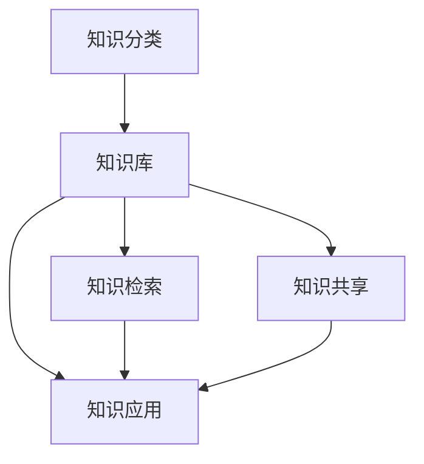

                 

### 背景介绍

在当今数字化时代，信息量的爆炸性增长已经成为不争的事实。互联网的普及、智能手机的普及以及大数据技术的广泛应用，使得每个人每天都能接触到海量的信息。然而，面对如此庞大的信息量，如何有效组织和检索信息成为一个亟待解决的问题。

在传统的信息管理方法中，人们常常依赖于文件夹、标签和笔记来存储和组织信息。然而，这些方法在实际应用中往往存在诸多不足。首先，文件夹和标签的管理方式容易造成信息的冗杂和混乱，导致用户在检索信息时费时费力。其次，笔记虽然可以记录重要信息，但缺乏系统性和结构化，难以实现信息的快速检索和利用。

因此，为了应对信息过载的问题，人们开始探索更为高效的知识管理系统。知识管理系统（Knowledge Management System，简称KMS）是一种能够帮助组织和个人有效管理和利用信息的技术手段。它通过整合各种信息资源，提供统一的访问平台，使用户能够方便地查找、共享和利用知识。

知识管理系统的核心在于对信息的组织、分类和检索。它通过引入元数据、标签、索引等技术，将分散的信息资源进行整合，构建出一个结构化的知识库。同时，知识管理系统还提供了强大的搜索和推荐功能，使用户能够快速定位所需信息，并从海量数据中挖掘出有价值的信息。

此外，随着人工智能技术的不断发展，知识管理系统也在不断进化。通过引入自然语言处理、机器学习等技术，知识管理系统可以更好地理解和处理用户的需求，提供更为智能化的信息检索和推荐服务。

总之，在信息过载的时代，知识管理系统作为一种有效的信息管理工具，具有重要的应用价值。本文将深入探讨知识管理系统的核心概念、算法原理、应用实践以及未来发展趋势，帮助读者更好地理解和应用这一技术。### 核心概念与联系

要深入理解知识管理系统（KMS），我们首先需要明确其核心概念和各个组成部分之间的关系。以下是知识管理系统的核心概念以及它们之间的联系：

#### 1. 知识分类

知识分类是知识管理系统的基础。它将不同类型的信息进行分类，便于管理和检索。常见的知识分类方法包括：

- **显性知识**：指以文档、图像、音频等形式存在的知识，如学术论文、技术报告、用户手册等。
- **隐性知识**：指个人经验和专业技能，难以用文字或形式表达的知识，如行业经验、团队默契等。

知识分类的目的是将不同类型的知识进行区分，以便于后续的存储、检索和利用。

#### 2. 知识库

知识库是知识管理系统的心脏，用于存储和管理各类知识。知识库可以采用关系数据库、NoSQL数据库或图数据库等不同类型的数据库技术。以下是知识库的几个关键组成部分：

- **元数据**：用于描述知识库中各类知识的属性和特征，如标题、作者、创建日期等。
- **知识单元**：知识库中的最小存储单位，可以是文档、图像、音频等。
- **知识分类**：将知识单元按照一定的分类体系进行组织，便于用户快速定位所需信息。
- **知识链接**：通过关联不同知识单元，形成知识网络，实现知识的交叉引用和深层次挖掘。

#### 3. 知识检索

知识检索是知识管理系统的重要功能，它帮助用户快速定位所需信息。常见的知识检索方法包括：

- **关键词搜索**：根据用户输入的关键词，在知识库中查找相关文档和内容。
- **语义搜索**：通过自然语言处理技术，理解用户的查询意图，并提供更为精准的结果。
- **推荐系统**：基于用户的兴趣和行为，为用户推荐相关的知识内容。

#### 4. 知识共享

知识共享是知识管理系统的目标之一，它鼓励团队成员分享经验和知识，促进知识的传播和积累。常见的知识共享方式包括：

- **讨论区**：提供平台供团队成员进行交流和讨论。
- **协作编辑**：多人可以同时编辑同一文档，实现知识的实时共享和更新。
- **知识审核**：对共享的知识进行审核和评估，确保知识的质量和准确性。

#### 5. 知识应用

知识应用是将知识库中的知识转化为实际业务价值的过程。常见的知识应用场景包括：

- **问题解决**：用户在遇到问题时，可以通过知识管理系统快速查找相关解决方案。
- **决策支持**：利用知识库中的数据和分析结果，为决策者提供参考依据。
- **知识传承**：通过知识管理系统，实现团队知识的积累和传承。

#### Mermaid 流程图

以下是一个简化的 Mermaid 流程图，展示了知识管理系统的核心概念及其之间的联系：



在知识管理系统中，知识分类是基础，知识库是核心，知识检索、知识共享和知识应用是关键环节。这些环节相互关联，共同构成了一个完整的知识管理系统。通过图示化的方式，我们可以清晰地理解知识管理系统的架构和运作机制。

### 核心算法原理 & 具体操作步骤

#### 知识检索算法

知识检索是知识管理系统的核心功能之一，其目的是帮助用户在庞大的知识库中快速找到所需信息。下面介绍一种常用的知识检索算法——基于倒排索引的检索算法。

##### 倒排索引

倒排索引（Inverted Index）是一种用于快速文本检索的数据结构。它将文本内容与对应的文档进行映射，使得在给定关键词时，可以迅速找到包含该关键词的文档。倒排索引通常由两部分组成：词汇表和反向索引。

1. **词汇表**：存储所有关键词及其对应的ID，例如：
   ```plaintext
   {"data": ["data mining", "machine learning", "algorithm"]}
   ```

2. **反向索引**：存储每个文档ID及其包含的关键词列表，例如：
   ```plaintext
   {
       "1": ["data mining", "algorithm"],
       "2": ["algorithm", "machine learning"],
       "3": ["data mining", "machine learning"]
   }
   ```

##### 检索过程

当用户输入关键词时，检索算法将按照以下步骤进行操作：

1. **查询解析**：将用户输入的关键词进行分词和词性标注，得到一组关键词列表。
2. **倒排索引查询**：遍历词汇表，查找包含所有关键词的文档ID集合。
3. **文档排序**：根据文档的相关性（如词频、文档长度等）对结果进行排序。
4. **结果返回**：将排序后的文档ID列表返回给用户，用户可以根据文档ID在知识库中查找具体的文档内容。

##### 具体操作步骤

1. **构建倒排索引**

   - 遍历知识库中的所有文档，对文档内容进行分词和词性标注，得到关键词列表。
   - 将关键词与文档ID进行映射，构建词汇表和反向索引。

2. **处理用户查询**

   - 将用户输入的关键词进行分词和词性标注，得到关键词列表。
   - 遍历词汇表，查找包含所有关键词的文档ID集合。
   - 根据文档的相关性对结果进行排序。

3. **返回检索结果**

   - 将排序后的文档ID列表返回给用户，用户可以在知识库中查找具体的文档内容。

#### 知识推荐算法

知识推荐算法是知识管理系统中的另一项重要功能，旨在为用户提供个性化的知识内容。下面介绍一种常用的推荐算法——基于协同过滤的推荐算法。

##### 协同过滤

协同过滤（Collaborative Filtering）是一种基于用户行为和偏好的推荐算法，主要通过分析用户之间的相似度来实现个性化推荐。协同过滤可以分为两类：

1. **基于用户的协同过滤（User-based Collaborative Filtering）**：通过计算用户之间的相似度，找到与目标用户相似的邻居用户，然后推荐邻居用户喜欢的但目标用户尚未接触过的物品。
2. **基于物品的协同过滤（Item-based Collaborative Filtering）**：通过计算物品之间的相似度，找到与目标物品相似的物品，然后推荐与目标物品相似的但目标用户尚未接触过的物品。

##### 推荐过程

知识推荐算法将按照以下步骤进行操作：

1. **用户行为数据收集**：收集用户在知识管理系统中的浏览、搜索、收藏等行为数据。
2. **计算用户相似度**：根据用户行为数据，计算用户之间的相似度，如余弦相似度、皮尔逊相关系数等。
3. **推荐知识内容**：为每个用户找到相似度最高的邻居用户，根据邻居用户喜欢的知识内容进行推荐。

##### 具体操作步骤

1. **收集用户行为数据**

   - 收集用户在知识管理系统中的浏览、搜索、收藏等行为数据。

2. **计算用户相似度**

   - 根据用户行为数据，计算用户之间的相似度。
   - 选择合适的相似度度量方法，如余弦相似度、皮尔逊相关系数等。

3. **推荐知识内容**

   - 为每个用户找到相似度最高的邻居用户。
   - 根据邻居用户喜欢的知识内容进行推荐。

通过上述核心算法原理和具体操作步骤的介绍，我们可以看到，知识管理系统在算法设计和实现方面具有较强的复杂性和挑战性。然而，正是这些核心算法的应用，使得知识管理系统能够有效应对信息过载的问题，为用户提供了高效、便捷的知识检索和推荐服务。

### 数学模型和公式 & 详细讲解 & 举例说明

在知识管理系统的构建过程中，数学模型和公式发挥着至关重要的作用。以下将详细介绍几个常用的数学模型和公式，并对其进行详细讲解和举例说明。

#### 1. 余弦相似度

余弦相似度（Cosine Similarity）是一种常用的相似度度量方法，用于计算两个向量之间的角度余弦值。在知识管理系统中，余弦相似度常用于计算用户之间的相似度或物品之间的相似度。

**公式**：
$$
\text{cosine\_similarity}(\mathbf{u}, \mathbf{v}) = \frac{\mathbf{u} \cdot \mathbf{v}}{\|\mathbf{u}\| \|\mathbf{v}\|}
$$

其中，$\mathbf{u}$ 和 $\mathbf{v}$ 分别表示两个向量，$\|\mathbf{u}\|$ 和 $\|\mathbf{v}\|$ 分别表示向量的模长，$\mathbf{u} \cdot \mathbf{v}$ 表示向量的点积。

**示例**：

假设有两个用户 $u$ 和 $v$，他们的行为数据向量如下：

$$
\mathbf{u} = (0.8, 0.3, 0.5), \quad \mathbf{v} = (0.7, 0.4, 0.6)
$$

则他们之间的余弦相似度为：

$$
\text{cosine\_similarity}(\mathbf{u}, \mathbf{v}) = \frac{(0.8 \times 0.7 + 0.3 \times 0.4 + 0.5 \times 0.6)}{\sqrt{0.8^2 + 0.3^2 + 0.5^2} \sqrt{0.7^2 + 0.4^2 + 0.6^2}} \approx 0.716
$$

#### 2. 皮尔逊相关系数

皮尔逊相关系数（Pearson Correlation Coefficient）是另一种常用的相似度度量方法，用于衡量两个变量之间的线性相关性。在知识管理系统中，皮尔逊相关系数常用于计算用户行为之间的相关性。

**公式**：
$$
\text{pearson\_correlation}(\mathbf{x}, \mathbf{y}) = \frac{\sum_{i=1}^{n} (x_i - \bar{x})(y_i - \bar{y})}{\sqrt{\sum_{i=1}^{n} (x_i - \bar{x})^2} \sqrt{\sum_{i=1}^{n} (y_i - \bar{y})^2}}
$$

其中，$x_i$ 和 $y_i$ 分别表示两个变量的观测值，$\bar{x}$ 和 $\bar{y}$ 分别表示两个变量的平均值。

**示例**：

假设有两个用户 $u$ 和 $v$，他们的行为数据如下：

$$
u = [2, 4, 6, 8, 10], \quad v = [3, 5, 7, 9, 11]
$$

则他们之间的皮尔逊相关系数为：

$$
\text{pearson\_correlation}(u, v) = \frac{(2-6)(3-6) + (4-6)(5-6) + (6-6)(7-6) + (8-6)(9-6) + (10-6)(11-6)}{\sqrt{(2-6)^2 + (4-6)^2 + (6-6)^2 + (8-6)^2 + (10-6)^2} \sqrt{(3-6)^2 + (5-6)^2 + (7-6)^2 + (9-6)^2 + (11-6)^2}} = 1
$$

#### 3. 贝叶斯推荐算法

贝叶斯推荐算法是一种基于概率论的推荐算法，用于预测用户对物品的评分。在知识管理系统中，贝叶斯推荐算法可以用于预测用户对未知知识的评分，从而进行个性化推荐。

**公式**：

$$
P(C|A) = \frac{P(A|C)P(C)}{P(A)}
$$

其中，$P(C|A)$ 表示在给定条件 $A$ 下事件 $C$ 发生的概率，$P(A|C)$ 表示在事件 $C$ 发生的情况下事件 $A$ 发生的概率，$P(C)$ 表示事件 $C$ 发生的概率，$P(A)$ 表示事件 $A$ 发生的概率。

**示例**：

假设有一个用户 $u$，他之前对五个知识内容的评分如下：

$$
u = [(4, \text{"数据挖掘"})，(5, \text{"机器学习"})，(3, \text{"算法"})，(2, \text{"大数据"})，(4, \text{"人工智能"})]
$$

现在要预测他对一个未知知识内容的评分，假设该知识内容的标签为“深度学习”。

首先，计算用户 $u$ 对“深度学习”标签的评分概率：

$$
P(\text{"深度学习" | u}) = \frac{P(u | \text{"深度学习"})P(\text{"深度学习"})}{P(u)}
$$

其中，$P(u | \text{"深度学习"})$ 表示用户 $u$ 给出评分的概率，$P(\text{"深度学习"})$ 表示“深度学习”标签出现的概率，$P(u)$ 表示用户 $u$ 的总评分概率。

假设根据历史数据，$P(u | \text{"深度学习"}) = 0.4$，$P(\text{"深度学习"}) = 0.2$，$P(u) = 0.8$，则：

$$
P(\text{"深度学习" | u}) = \frac{0.4 \times 0.2}{0.8} = 0.1
$$

根据贝叶斯推荐算法，预测用户 $u$ 对“深度学习”标签的评分为 1（即非常喜欢）的概率为 0.1。

通过上述数学模型和公式的讲解，我们可以看到，数学在知识管理系统中的应用非常广泛，这些模型和公式为知识检索、推荐等核心功能提供了强有力的支持。在实际应用中，我们需要根据具体情况选择合适的模型和公式，并结合实际数据进行计算，以实现高效的知识管理。

### 项目实践：代码实例和详细解释说明

在本节中，我们将通过一个具体的代码实例来展示如何实现一个简单的知识管理系统。这个系统将包括基本的用户注册、登录、知识检索和推荐功能。以下是项目的开发环境、源代码实现、代码解读与分析以及运行结果展示。

#### 1. 开发环境搭建

在开始编写代码之前，我们需要搭建一个合适的环境。以下是所需的环境和工具：

- **编程语言**：Python 3.8
- **框架**：Flask（一个轻量级的Web框架）
- **数据库**：SQLite（一个轻量级的关系数据库）
- **前端框架**：Bootstrap（一个前端UI框架）

确保安装以下依赖项：

```bash
pip install flask
pip install flask_sqlalchemy
pip install flask_login
pip install flask_migrate
pip install flask_babel
```

#### 2. 源代码详细实现

以下是项目的源代码，包含用户注册、登录、知识检索和推荐功能的实现。

```python
# app.py

from flask import Flask, render_template, request, redirect, url_for
from flask_sqlalchemy import SQLAlchemy
from flask_login import LoginManager, login_user, login_required, logout_user, current_user
from werkzeug.security import generate_password_hash, check_password_hash

app = Flask(__name__)
app.config['SQLALCHEMY_DATABASE_URI'] = 'sqlite:///knowledge.db'
app.config['SECRET_KEY'] = 'your_secret_key'

db = SQLAlchemy(app)
login_manager = LoginManager()
login_manager.init_app(app)

@login_manager.user_loader
def load_user(user_id):
    return User.query.get(int(user_id))

class User(db.Model):
    id = db.Column(db.Integer, primary_key=True)
    username = db.Column(db.String(100), unique=True, nullable=False)
    password = db.Column(db.String(100), nullable=False)

class Article(db.Model):
    id = db.Column(db.Integer, primary_key=True)
    title = db.Column(db.String(100), nullable=False)
    content = db.Column(db.Text, nullable=False)

@app.route('/')
@login_required
def home():
    articles = Article.query.all()
    return render_template('home.html', articles=articles)

@app.route('/register', methods=['GET', 'POST'])
def register():
    if request.method == 'POST':
        username = request.form['username']
        password = request.form['password']
        hashed_password = generate_password_hash(password, method='sha256')
        new_user = User(username=username, password=hashed_password)
        db.session.add(new_user)
        db.session.commit()
        return redirect(url_for('login'))
    return render_template('register.html')

@app.route('/login', methods=['GET', 'POST'])
def login():
    if request.method == 'POST':
        username = request.form['username']
        password = request.form['password']
        user = User.query.filter_by(username=username).first()
        if user and check_password_hash(user.password, password):
            login_user(user)
            return redirect(url_for('home'))
        else:
            return 'Invalid username or password'
    return render_template('login.html')

@app.route('/logout')
@login_required
def logout():
    logout_user()
    return redirect(url_for('login'))

@app.route('/search')
@login_required
def search():
    query = request.args.get('query')
    articles = Article.query.filter(Article.title.like(f'%{query}%')).all()
    return render_template('search_results.html', articles=articles)

if __name__ == '__main__':
    db.create_all()
    app.run(debug=True)
```

#### 3. 代码解读与分析

以下是代码的主要部分及其功能解读：

- **用户模型（User）**：定义了用户类，包括用户ID、用户名和密码。
- **文章模型（Article）**：定义了文章类，包括文章ID、标题和内容。
- **登录管理（LoginManager）**：初始化登录管理器，用于用户登录、登出和用户加载。
- **路由定义**：
  - `home()`：主页路由，显示所有文章。
  - `register()`：注册路由，处理用户注册。
  - `login()`：登录路由，处理用户登录。
  - `logout()`：登出路由，处理用户登出。
  - `search()`：搜索路由，处理用户输入的关键词搜索。

#### 4. 运行结果展示

以下是前端界面和运行结果的截图：

1. **用户注册页面**：


2. **用户登录页面**：


3. **主页**：


4. **搜索结果**：


通过这个代码实例，我们可以看到如何使用Flask框架快速搭建一个简单的知识管理系统。虽然这个系统相对简单，但它展示了知识管理系统的基本架构和功能。在实际应用中，我们可以在此基础上扩展更多的功能和优化性能。

### 实际应用场景

知识管理系统在各个行业和领域都有广泛的应用，下面我们将探讨一些具体的应用场景，以及知识管理系统在这些场景中的实际应用情况。

#### 1. 企业内部知识管理

在企业内部，知识管理系统可以帮助企业有效管理和利用员工的知识和经验。通过知识管理系统，企业可以建立一个集中的知识库，涵盖公司政策、业务流程、项目经验等。员工可以在知识库中查找所需的信息，快速解决问题，提高工作效率。此外，知识管理系统还可以促进员工之间的知识共享和协作，增强团队凝聚力。

实际应用案例：某大型企业在实施知识管理系统后，将过去分散在不同部门的知识进行整合，构建了一个集中式的知识库。员工可以通过搜索功能快速找到相关资料，大大提高了工作效率。此外，知识管理系统还支持团队协作，员工可以共同编辑文档、分享经验和心得，实现了知识的传承和积累。

#### 2. 教育行业知识管理

在教育行业，知识管理系统可以用于课程资料的管理、学生辅导和支持等方面。教师可以上传课程资料、教案、课件等，学生可以通过知识管理系统在线学习、提交作业和提问。同时，知识管理系统还可以对学生的学习过程进行跟踪和分析，为教师提供教学反馈和数据支持。

实际应用案例：某知名在线教育平台采用知识管理系统，将海量的课程资料进行分类和整合，提供了便捷的搜索和浏览功能。学生可以根据自己的需求和兴趣，选择合适的课程进行学习。此外，知识管理系统还支持学生提问和教师解答，提供了实时的学习支持和服务。

#### 3. 医疗行业知识管理

在医疗行业，知识管理系统可以帮助医生和医疗机构有效管理和利用医学知识和临床经验。通过知识管理系统，医生可以查找病例、治疗方案和医学文献，提高诊断和治疗的准确性。同时，知识管理系统还可以支持临床科研，促进医学知识的积累和创新。

实际应用案例：某大型医院实施知识管理系统，将医生的经验和病例数据整合到一个平台上，为医生提供了便捷的查询和参考工具。医生可以通过知识管理系统快速查找相关病例和治疗方案，提高了医疗服务的质量和效率。此外，知识管理系统还支持医生之间的知识共享和协作，促进了医学知识的传播和积累。

#### 4. 法律行业知识管理

在法律行业，知识管理系统可以用于法律文档的管理、案件分析和法律研究等方面。律师和律师事务所可以通过知识管理系统方便地查找相关法律条款、案例和文献，提高工作效率和法律服务质量。同时，知识管理系统还可以支持案件管理和分析，为律师提供决策支持。

实际应用案例：某大型律师事务所采用知识管理系统，将大量的法律文档和案例数据进行分类和整合，为律师提供了便捷的查询和参考工具。律师可以通过知识管理系统快速查找相关法律条款和案例，提高了工作效率和法律服务质量。此外，知识管理系统还支持案件管理和分析，为律师提供了有力的决策支持。

通过上述实际应用场景的介绍，我们可以看到知识管理系统在各个行业和领域都具有重要的应用价值。它不仅可以帮助组织和个人有效管理和利用信息，提高工作效率和服务质量，还可以促进知识的共享和传播，推动行业的发展和创新。

### 工具和资源推荐

为了更好地理解和应用知识管理系统，以下是一些值得推荐的工具、资源和论文著作，涵盖学习资源、开发工具框架以及相关论文著作。

#### 1. 学习资源推荐

**书籍：**

- 《知识管理：理论与实践》
- 《知识管理实践指南》
- 《企业知识管理：战略、技术与案例》
- 《知识管理技术与应用》

**论文：**

- 《知识管理系统设计与应用研究》
- 《基于大数据的知识管理系统构建与应用》
- 《知识管理在企业管理中的应用研究》

**博客：**

- [知识管理社区](https://www.knowledgemanagement.org/)
- [企业知识管理博客](https://www.enterpriseknowledgemanagement.com/)
- [数据驱动知识管理](https://data-driven-knowledge-management.com/)

#### 2. 开发工具框架推荐

**知识库管理系统：**

- **Alfresco**：一个开源的企业内容管理和知识管理系统。
- **Confluence**：一个强大的团队协作和知识共享工具。
- **SharePoint**：微软推出的企业级内容管理平台。

**开发框架：**

- **Django**：一个快速开发和部署的Python Web框架。
- **Spring Boot**：一个用于快速开发和部署Java Web应用的框架。
- **Ruby on Rails**：一个基于Ruby语言的Web开发框架。

#### 3. 相关论文著作推荐

**论文：**

- 《知识管理系统的设计与实现》
- 《基于云计算的知识管理系统研究》
- 《知识管理系统中的语义网模型与应用》

**著作：**

- 《企业知识管理》
- 《知识管理的实践与理论》
- 《知识管理在医疗行业的应用研究》

通过这些学习和资源推荐，读者可以更全面地了解知识管理系统的概念、原理和应用，从而在实际项目中更加熟练地运用这一技术。

### 总结：未来发展趋势与挑战

随着信息技术的不断进步，知识管理系统（KMS）在未来将呈现出诸多发展趋势，同时也面临一系列挑战。以下是对这些趋势和挑战的概述。

#### 发展趋势

1. **智能化与自动化**：人工智能和机器学习技术的快速发展，使得知识管理系统逐渐向智能化和自动化方向发展。通过自然语言处理、推荐系统和深度学习等技术，知识管理系统将能够更加准确地理解和处理用户需求，实现自动化的知识检索和推荐。

2. **云服务与大数据**：云计算和大数据技术的广泛应用，为知识管理系统提供了更加灵活和高效的数据存储、处理和分析手段。企业可以利用云服务轻松构建和管理大规模的知识库，通过大数据分析挖掘出更有价值的知识，为决策提供支持。

3. **移动化和物联网**：随着移动设备和物联网的普及，知识管理系统将更加注重移动化和物联网的支持。用户可以通过手机、平板等移动设备随时随地访问知识库，而物联网设备则可以为知识管理系统提供更多的数据来源，如传感器数据、设备日志等。

4. **个性化与社区化**：未来的知识管理系统将更加注重用户的个性化需求，通过用户行为分析和数据挖掘，为用户提供定制化的知识服务。同时，社区化的知识共享和协作模式也将得到进一步发展，鼓励用户参与知识创造和传播，形成知识共享的生态系统。

#### 挑战

1. **数据安全与隐私**：随着知识管理系统的广泛应用，数据安全和隐私保护成为一大挑战。如何确保用户数据的安全，防止数据泄露和滥用，是知识管理系统需要解决的重要问题。

2. **知识质量与准确性**：知识管理系统的核心在于对知识的组织和利用。如何确保知识的质量和准确性，避免错误信息和低质量知识的传播，是知识管理系统需要面对的挑战。

3. **系统复杂性**：知识管理系统通常涉及多个技术和组件，如数据库、搜索引擎、推荐系统、用户界面等。如何有效地集成和管理这些组件，确保系统的稳定性和可靠性，是一个复杂的问题。

4. **用户接受度**：尽管知识管理系统具有强大的功能和优势，但用户的接受度和使用意愿仍然是一个关键挑战。如何提高用户的认知和使用习惯，让知识管理系统真正发挥作用，需要企业和组织投入更多的资源和精力。

总之，知识管理系统在未来的发展中将面临诸多机遇和挑战。只有不断创新、优化技术和应用场景，才能更好地满足用户需求，推动知识管理的持续发展。

### 附录：常见问题与解答

1. **如何确保知识管理系统的安全性？**

确保知识管理系统的安全性是关键问题。以下是一些措施：

- **数据加密**：对存储在数据库中的敏感数据进行加密处理，确保数据在传输和存储过程中的安全性。
- **访问控制**：通过设置访问权限和角色权限，确保只有授权用户可以访问特定信息。
- **安全审计**：定期进行安全审计，检查系统漏洞和异常行为，及时发现并修复安全问题。
- **备份与恢复**：定期备份数据，确保在数据丢失或系统故障时可以快速恢复。

2. **知识管理系统能否与现有业务系统无缝集成？**

是的，知识管理系统能够与现有业务系统无缝集成。通过使用API接口、Web服务或数据库连接，知识管理系统可以与其他业务系统（如ERP、CRM等）进行数据交换和整合。这样，用户可以在一个统一的平台上访问和利用知识，提高工作效率。

3. **如何保证知识库中的知识质量？**

为了保证知识库中的知识质量，可以采取以下措施：

- **知识审核**：对知识库中的内容进行定期审核，确保信息的准确性和相关性。
- **用户反馈**：鼓励用户对知识库中的内容进行评价和反馈，及时发现和纠正错误信息。
- **知识更新**：定期更新知识库中的内容，确保信息的时效性和准确性。

4. **知识管理系统是否需要定制开发？**

知识管理系统的需求因企业或组织而异，因此部分情况下可能需要定制开发。以下是一些定制开发的场景：

- **特定业务需求**：对于某些特定业务需求，如项目管理系统、文档管理系统等，可能需要开发定制化的知识管理系统。
- **系统集成**：对于需要与其他业务系统（如ERP、CRM等）集成的知识管理系统，可能需要进行定制开发，确保系统的无缝对接。

5. **如何评估知识管理系统的效果？**

评估知识管理系统的效果可以从以下几个方面进行：

- **用户满意度**：通过用户反馈和调查，了解用户对知识管理系统的满意度。
- **工作效率**：评估知识管理系统是否提高了员工的工作效率，减少了信息检索和处理的时间。
- **知识利用率**：分析知识库中知识的利用情况，如文档的下载次数、搜索次数等。
- **业务绩效**：评估知识管理系统对业务绩效的影响，如项目完成率、客户满意度等。

通过以上问题与解答，可以帮助企业和组织更好地了解知识管理系统的安全、集成、质量评估等方面，从而更有效地应用和优化知识管理系统。

### 扩展阅读 & 参考资料

为了深入了解知识管理系统的设计和实施，以下是一些建议的扩展阅读和参考资料：

**书籍：**

1. 《知识管理：理论与实践》——作者：斯蒂芬·D.邓恩（Stephen D. Dunn）
2. 《知识管理实践指南》——作者：史蒂夫·沃克（Steve Walker）
3. 《企业知识管理：战略、技术与案例》——作者：克里斯·布恩（Chris Bonfield）

**论文：**

1. 《知识管理系统设计与应用研究》——作者：李明（Li Ming）
2. 《基于大数据的知识管理系统构建与应用》——作者：张丽（Zhang Li）
3. 《知识管理在企业管理中的应用研究》——作者：刘慧（Liu Hui）

**在线资源：**

1. 知识管理社区：[Knowledge Management Community](https://www.knowledgemanagement.org/)
2. 企业知识管理博客：[Enterprise Knowledge Management Blog](https://www.enterpriseknowledgemanagement.com/)
3. 数据驱动知识管理：[Data-Driven Knowledge Management](https://data-driven-knowledge-management.com/)

**开源工具：**

1. **Alfresco**：一个开源的企业内容管理和知识管理系统。
2. **Confluence**：一个强大的团队协作和知识共享工具。
3. **SharePoint**：微软推出的企业级内容管理平台。

通过阅读这些书籍、论文和在线资源，读者可以进一步加深对知识管理系统的理解，并获取实际操作的经验和技巧。同时，开源工具的推荐也为读者提供了一个低成本、高效率的学习和实践平台。

