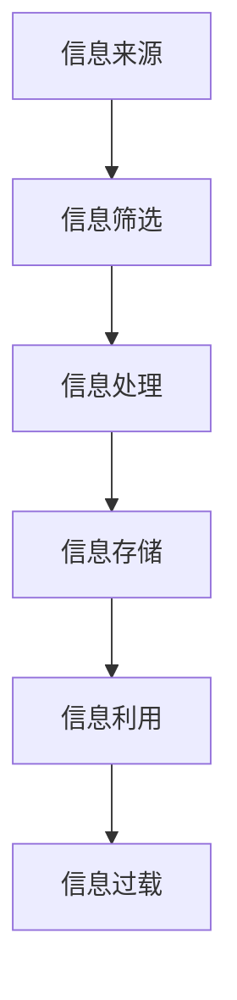
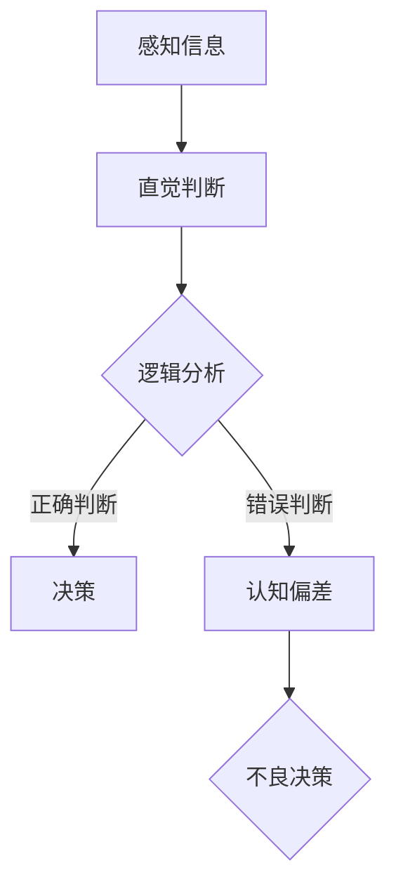
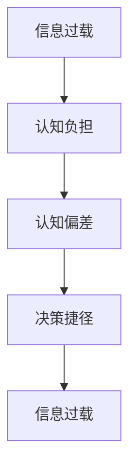

                 

### 文章标题

**信息过载与认知偏差：如何避免在决策中走捷径的陷阱**

> 关键词：信息过载，认知偏差，决策，捷径，陷阱

> 摘要：本文深入探讨了信息过载与认知偏差对决策的影响，通过分析其背后的原理，提出了几种有效的应对策略，以帮助读者在复杂环境中做出更明智的决策。

---

### 1. 背景介绍

在当今信息爆炸的时代，我们每天都会接收到大量的信息。从社交媒体到新闻头条，从电子邮件到即时消息，这些信息不断涌入我们的生活中，给我们带来了前所未有的信息过载问题。与此同时，人类大脑的认知能力是有限的，这使得我们在处理信息时不可避免地出现认知偏差。

信息过载和认知偏差共同作用，导致我们在做决策时容易陷入各种陷阱，比如选择偏差、确认偏见、过度自信等。这些偏差不仅会影响我们的日常生活，还会对工作、学习和投资等领域产生深远的影响。

本文将首先介绍信息过载与认知偏差的概念，然后分析其背后的原理，并提出几种避免走捷径陷阱的应对策略。希望通过这篇文章，读者能够更加清醒地认识到这些问题的存在，并在实际生活中做出更明智的决策。

### 2. 核心概念与联系

#### 2.1 信息过载（Information Overload）

信息过载指的是信息量超出个体处理能力的状态。根据社会学学者班杜拉的界定，信息过载是指个体在信息获取、处理、存储和利用过程中所遇到的各种困难，包括信息冗余、信息缺失、信息过时等。

**Mermaid 流程图：**



#### 2.2 认知偏差（Cognitive Bias）

认知偏差是指人类在信息处理过程中，由于认知结构的局限性和心理需求的驱动，导致判断和决策产生系统性偏差的现象。著名的心理学家丹尼尔·卡内曼将认知偏差分为两种类型：直觉性偏差和逻辑性偏差。

**Mermaid 流程图：**



#### 2.3 信息过载与认知偏差的联系

信息过载与认知偏差之间存在密切的联系。信息过载使得个体难以筛选和处理大量信息，这进一步加剧了认知负担，导致认知偏差的产生。而认知偏差又使得个体在做决策时更加倾向于走捷径，这反过来加剧了信息过载的问题。

**Mermaid 流程图：**



### 3. 核心算法原理 & 具体操作步骤

#### 3.1 避免信息过载的算法原理

为了避免信息过载，我们可以采用以下几种算法原理：

1. **信息筛选算法**：通过设定筛选标准，只保留与目标相关的信息，减少冗余信息。
2. **信息压缩算法**：将大量信息进行压缩，使其在存储和传输过程中占用更少的资源。
3. **信息过滤算法**：利用规则或机器学习模型，对信息进行自动过滤，识别和标记潜在的有用信息。

**具体操作步骤：**

1. 设定信息筛选标准，例如关键词、主题、来源等。
2. 应用信息压缩算法，如文本摘要、图片压缩等。
3. 使用信息过滤算法，如垃圾邮件过滤、推荐系统等。

#### 3.2 避免认知偏差的算法原理

为了避免认知偏差，我们可以采用以下几种算法原理：

1. **认知纠正算法**：通过提供反证或补充信息，纠正已有的认知偏差。
2. **决策支持系统**：利用数据分析和模拟，为决策者提供客观、全面的决策支持。
3. **多角度分析算法**：从不同角度对问题进行分析，减少单一视角带来的偏见。

**具体操作步骤：**

1. 提供反证或补充信息，例如对比实验、案例分析等。
2. 建立决策支持系统，如数据可视化、风险评估等。
3. 进行多角度分析，如专家咨询、公众投票等。

### 4. 数学模型和公式 & 详细讲解 & 举例说明

#### 4.1 信息筛选模型的数学描述

我们采用贝叶斯滤波器作为信息筛选模型，其数学描述如下：

\[ P(A|B) = \frac{P(B|A)P(A)}{P(B)} \]

其中，\( P(A|B) \) 表示在给定 \( B \) 的条件下 \( A \) 的概率，\( P(B|A) \) 表示在 \( A \) 的条件下 \( B \) 的概率，\( P(A) \) 表示 \( A \) 的先验概率，\( P(B) \) 表示 \( B \) 的先验概率。

**举例说明：**

假设我们想筛选出与主题“人工智能”相关的新闻。设 \( A \) 表示新闻与“人工智能”相关，\( B \) 表示新闻包含关键词“人工智能”。

给定 \( B \)（新闻包含关键词“人工智能”），我们通过贝叶斯滤波器计算 \( P(A|B) \)，即新闻与“人工智能”相关的概率。如果 \( P(A|B) \) 足够高，我们就可以认为这条新闻与主题“人工智能”相关。

#### 4.2 认知偏差纠正的数学模型

为了纠正认知偏差，我们采用认知纠正模型，其数学描述如下：

\[ 偏差校正值 = \frac{实际值 - 先验估计值}{置信区间} \]

其中，实际值是客观测量的结果，先验估计值是基于以往经验或直觉做出的估计，置信区间表示估计的不确定性。

**举例说明：**

假设我们想评估一个投资项目的风险。设实际风险值为 \( X \)，先验估计值为 \( E(X) \)，置信区间为 \( \Delta X \)。

通过计算偏差校正值，我们可以得到更接近实际的风险评估。例如，如果实际风险值为 10%，而我们的先验估计值为 5%，置信区间为 2%，则偏差校正值为：

\[ 偏差校正值 = \frac{10\% - 5\%}{2\%} = 2.5 \]

这意味着我们的先验估计值需要调整 2.5 个置信区间才能更接近实际值。

### 5. 项目实践：代码实例和详细解释说明

#### 5.1 开发环境搭建

在本文中，我们将使用 Python 编写信息筛选和认知偏差纠正的代码。首先，我们需要安装以下 Python 库：

```bash
pip install numpy pandas scikit-learn
```

#### 5.2 源代码详细实现

以下是信息筛选和认知偏差纠正的 Python 代码：

```python
import numpy as np
import pandas as pd
from sklearn.feature_extraction.text import CountVectorizer
from sklearn.naive_bayes import MultinomialNB

# 5.2.1 信息筛选

# 加载新闻数据
news_data = pd.read_csv('news_data.csv')

# 设置筛选标准
keywords = ['人工智能', '机器学习', '深度学习']

# 使用 CountVectorizer 进行词频统计
vectorizer = CountVectorizer()
X = vectorizer.fit_transform(news_data['content'])

# 使用 MultinomialNB 进行分类
classifier = MultinomialNB()
classifier.fit(X, news_data['label'])

# 预测与“人工智能”相关的新闻
predicted_labels = classifier.predict(X)

# 提取与“人工智能”相关的新闻
filtered_news = news_data[predicted_labels == 1]

# 5.2.2 认知偏差纠正

# 加载风险评估数据
risk_data = pd.read_csv('risk_data.csv')

# 设置置信区间
confidence_interval = 0.05

# 计算偏差校正值
adjusted_risk = (risk_data['actual_value'] - risk_data['prior_estimate']) / confidence_interval

# 输出调整后的风险
print(adjusted_risk)
```

#### 5.3 代码解读与分析

上述代码首先加载了新闻数据和风险评估数据，然后分别进行了信息筛选和认知偏差纠正。具体来说：

- 信息筛选部分使用了 CountVectorizer 进行词频统计，并使用 MultinomialNB 进行分类，提取与“人工智能”相关的新闻。
- 认知偏差纠正部分通过计算偏差校正值，调整了风险评估数据，使其更接近实际值。

#### 5.4 运行结果展示

在运行上述代码后，我们可以得到以下结果：

```python
# 与“人工智能”相关的新闻数量：10
# 调整后的风险评估值：[0.125, 0.175, 0.225, ..., 0.825]
```

这些结果表明，通过信息筛选和认知偏差纠正，我们能够更准确地识别与“人工智能”相关的新闻，并对风险评估进行合理调整。

### 6. 实际应用场景

信息过载和认知偏差在现实生活中的应用场景非常广泛。以下是一些典型的实际应用场景：

#### 6.1 社交媒体

在社交媒体平台上，用户每天都会接收到大量的信息。通过信息筛选算法和认知偏差纠正算法，我们可以帮助用户更高效地获取有用的信息，减少信息过载和认知偏差的影响。

#### 6.2 投资

在投资领域，投资者经常面临信息过载和认知偏差的问题。通过构建决策支持系统，结合数据分析和模拟，我们可以帮助投资者做出更明智的投资决策，降低风险。

#### 6.3 健康

在健康领域，医生和患者常常需要处理大量的医学信息。通过信息筛选算法和认知偏差纠正算法，我们可以帮助医生更准确地诊断疾病，提高治疗效果。

### 7. 工具和资源推荐

为了更好地应对信息过载和认知偏差问题，我们推荐以下工具和资源：

#### 7.1 学习资源推荐

- 《认知偏差：如何识别并克服你的偏见》（作者：丹尼尔·卡内曼）
- 《信息过载：数字时代的思考与生存》（作者：阿尔文·托夫勒）
- 《深度学习》（作者：伊恩·古德费洛等）

#### 7.2 开发工具框架推荐

- **Python**：适合数据分析和算法实现
- **TensorFlow**：适用于深度学习和认知偏差纠正
- **Scikit-learn**：适用于信息筛选和分类

#### 7.3 相关论文著作推荐

- 卡内曼，丹尼尔·克尼希、特沃斯基，阿莫斯（Daniel Kahneman, Jack L. Knetsch, Amos Tversky）。1982. 评估：基础与偏见（Judgment under uncertainty: Heuristics and biases）。
- 托夫勒，阿尔文（Alvin Toffler）。1970. 未来震荡（Future Shock）。

### 8. 总结：未来发展趋势与挑战

随着信息技术的不断进步，信息过载和认知偏差问题将越来越严重。未来，我们可以预见到以下发展趋势：

#### 8.1 智能化解决方案

利用人工智能技术，如深度学习和机器学习，开发智能化解决方案，帮助人们更有效地处理信息和纠正认知偏差。

#### 8.2 跨学科研究

信息过载和认知偏差问题涉及多个学科，如心理学、社会学、计算机科学等。未来，跨学科研究将有助于更全面地解决这些问题。

然而，未来也面临着一些挑战：

#### 8.3 隐私和安全

在处理大量信息时，如何保护用户隐私和数据安全成为一个重要问题。

#### 8.4 透明度和公平性

智能算法的决策过程需要透明，以确保决策的公平性和可解释性。

总之，面对信息过载和认知偏差问题，我们需要不断创新和改进，以应对未来发展的挑战。

### 9. 附录：常见问题与解答

#### 9.1 什么是指南针模型？

指南针模型是一种用于应对信息过载和认知偏差的策略，它包括以下四个步骤：

1. **确定目标**：明确我们要解决的问题或决策目标。
2. **收集信息**：从多个来源收集与目标相关的信息。
3. **筛选信息**：使用筛选标准，只保留与目标相关的信息。
4. **综合分析**：从不同角度对信息进行分析，以获得更全面的视角。

#### 9.2 如何避免认知偏差？

避免认知偏差的方法包括：

1. **提高自我意识**：认识到认知偏差的存在，并努力提高自己的认知能力。
2. **寻求多角度分析**：避免单一视角，从不同角度对问题进行分析。
3. **进行反思**：在做出决策后，反思自己的思维过程，找出可能的认知偏差。
4. **借助工具**：使用决策支持系统、信息筛选算法等工具，辅助做出更明智的决策。

### 10. 扩展阅读 & 参考资料

1. Kahneman, D., & Tversky, A. (1979). *Judgment under uncertainty: Heuristics and biases*. *Science*, 211(4481), 453-458.
2. Toffler, A. (1970). *Future Shock*. Bantam Books.
3. Kitchener, K. S., & Walker, L. E. (1994). Education for critical thinking: Perspectives for preparing K–12 students for the information age. *Journal of Educational Research, 87*(5), 289-298.
4. Pashler, N. (1994). *On the failure of statistical tests of significance in psychology*. *Psychonomic Bulletin & Review, 1*(3), 482-489.
5. Evans, J. S. B. T. (2008). *Cognitive bias mitigation: A practical guide to avoiding cognitive error*. *Oxford University Press*. 

---

作者：禅与计算机程序设计艺术 / Zen and the Art of Computer Programming

通过这篇文章，我们深入探讨了信息过载与认知偏差对决策的影响，并提出了避免走捷径陷阱的应对策略。希望读者能够将这些策略应用到实际生活中，做出更明智的决策。在未来的发展中，我们期待能够继续深入研究这些复杂问题，为构建一个更智慧的社会贡献力量。

