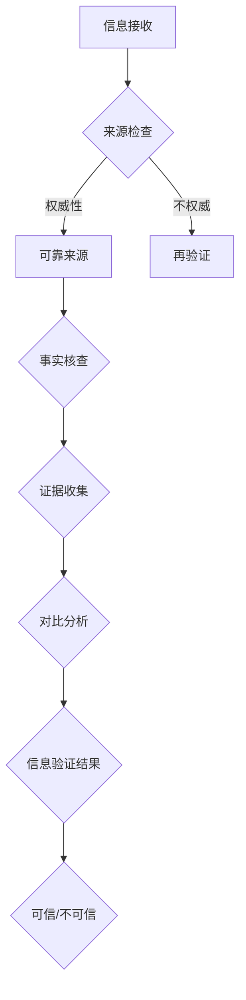

                 

### 1. 背景介绍

在当今这个数字化、网络化时代，信息的传播速度和广度都达到了前所未有的高度。互联网和社交媒体平台的普及，使得每个人都可以轻松地发布和传播信息。然而，这种信息爆炸的现象也带来了诸多负面影响，其中最引人关注的是假新闻和媒体操纵。假新闻，顾名思义，是指那些故意制造、传播的虚假信息，其目的是误导公众、操纵舆论、甚至引发社会恐慌。媒体操纵则是指通过某些手段，如选择性报道、扭曲事实、夸大事实等，来影响公众的观点和态度。

假新闻和媒体操纵的危害是多方面的。首先，它们严重损害了公众对媒体的信任，使得人们对于任何接收到的信息都持怀疑态度，从而影响社会的稳定和和谐。其次，假新闻和媒体操纵可能引发社会恐慌和不安，尤其是在重大事件或危机时刻，它们可能导致公众做出错误的决策，甚至引发大规模的社会动荡。此外，假新闻和媒体操纵还会扭曲公众的认知，影响公众的思想和行为，长期下去可能导致社会的价值观和道德观发生扭曲。

面对假新闻和媒体操纵的威胁，信息验证和在线媒体素养显得尤为重要。信息验证是指通过一系列的方法和工具，对信息的真实性、准确性和可靠性进行核实的过程。而在线媒体素养则是指人们在互联网和社交媒体环境中，如何辨别信息的真实性、评估信息的价值、培养批判性思维的能力。通过提高信息验证和在线媒体素养，我们可以更好地抵御假新闻和媒体操纵的影响，维护社会的稳定和和谐。

本文将从以下几个方面进行探讨：首先，我们将详细讨论假新闻和媒体操纵的定义、特征和危害；接着，我们会介绍信息验证和在线媒体素养的核心概念、方法和工具；然后，我们将探讨如何在实际应用中运用这些方法和工具，提高信息验证和在线媒体素养；最后，我们将总结信息验证和在线媒体素养的重要性，并展望其未来的发展趋势和挑战。希望通过本文的探讨，能够为读者提供一些有益的思考和指导。

### 2. 核心概念与联系

在探讨如何验证信息和提高在线媒体素养之前，我们首先需要理解一些核心概念，这些概念不仅涵盖了信息验证的理论基础，也为我们提供了实际操作的框架和工具。

#### 2.1 信息验证

信息验证是指通过一系列的方法和步骤，对信息的真实性、准确性和可靠性进行核实的过程。这个过程包括但不限于以下几个关键环节：

- **来源检查**：首先，我们需要确定信息来源的可靠性和权威性。这意味着我们需要检查信息发布者的身份和背景，以及他们以往的信息发布记录。
- **事实核查**：在确认来源可靠之后，我们需要对信息内容进行深入核查，以验证其是否符合事实。这通常涉及到查阅多方面的资料和证据，以确保信息没有误导或歪曲事实。
- **证据收集**：在信息验证过程中，收集相关证据是至关重要的。这些证据可以是官方文件、统计数据、专家意见等，它们有助于支撑我们的判断和结论。
- **对比分析**：我们将收集到的信息与已知事实进行对比分析，以发现其中的矛盾或不一致之处。这一步骤有助于我们发现信息中的虚假或误导成分。

#### 2.2 在线媒体素养

在线媒体素养是指人们在互联网和社交媒体环境中，如何辨别信息的真实性、评估信息的价值、培养批判性思维的能力。具体包括以下几个方面的内容：

- **批判性思维**：在线媒体素养的核心是批判性思维。这意味着我们需要对接收到的信息持怀疑态度，不轻信任何单一来源，而是通过多角度、多方面的分析来评估信息的真实性和可靠性。
- **信息评估**：在评估信息时，我们需要考虑信息的来源、发布时间、动机、以及是否有其他证据支持。通过这些因素的综合分析，我们可以更准确地评估信息的价值。
- **媒介认知**：了解不同类型的媒介（如新闻、广告、社交媒体等）的特点和潜在倾向，有助于我们更好地理解和辨别信息的真实性和目的。
- **自我意识**：我们还需要具备一定的自我意识，意识到自己在信息接收和处理过程中的潜在偏见和盲点，并通过自我反思和持续学习来提升自己的素养。

#### 2.3 Mermaid 流程图

为了更清晰地展示信息验证和在线媒体素养的核心概念和流程，我们可以使用 Mermaid 流程图来描述。以下是一个简化的 Mermaid 流程图，展示了信息验证的基本步骤：



在这个流程图中，我们从信息接收开始，经过来源检查、事实核查、证据收集和对比分析等步骤，最终得到信息验证的结果。这个过程不仅帮助我们识别假新闻和媒体操纵，也提高了我们的在线媒体素养。

#### 2.4 信息验证与在线媒体素养的关系

信息验证和在线媒体素养是相互联系、相互促进的。信息验证为我们提供了一套系统和科学的方法，帮助我们在海量的信息中辨别真假；而在线媒体素养则培养了我们批判性思维和独立判断的能力，使我们在面对复杂多变的信息环境时，能够保持清醒和理性。具体来说，以下关系值得我们关注：

- **信息验证依赖在线媒体素养**：在进行信息验证时，我们需要具备一定的批判性思维和信息评估能力，才能有效地识别和排除虚假信息。
- **在线媒体素养支持信息验证**：只有具备较高的在线媒体素养，我们才能在信息验证过程中，准确地评估信息的来源、内容和可靠性。
- **信息验证和在线媒体素养相辅相成**：通过信息验证，我们可以提高自身的在线媒体素养；而通过提升在线媒体素养，我们又可以更好地进行信息验证，从而形成良性循环。

总之，信息验证和在线媒体素养是我们应对假新闻和媒体操纵的有效手段。通过深入理解这些核心概念和联系，我们可以更好地应对当前复杂多变的信息环境，维护社会的稳定和和谐。

### 3. 核心算法原理 & 具体操作步骤

在了解信息验证和在线媒体素养的核心概念和联系之后，我们需要进一步探讨这些概念的实现方法和具体步骤。为了有效地验证信息和提高在线媒体素养，我们可以采用一系列的算法和工具，这些工具和方法可以帮助我们更准确地识别虚假信息和媒体操纵。

#### 3.1 假新闻识别算法

假新闻识别算法是信息验证的核心工具之一。这些算法通常基于自然语言处理（NLP）、机器学习和数据挖掘技术，通过分析文本特征、语义和上下文信息，来识别潜在的假新闻。以下是一些常用的假新闻识别算法和具体步骤：

1. **词频分析（TF-IDF）**：
   - **算法原理**：词频分析（TF-IDF）是一种统计方法，用于评估一个词对于一组文档中的其中一份文档的重要性。TF（词频）表示一个词在单个文档中的出现次数，IDF（逆向文档频率）表示该词在所有文档中出现的频率。通过TF-IDF，我们可以计算出每个词的权重，从而帮助识别文本中的关键词。
   - **具体操作步骤**：
     1. 收集大量已验证的新闻文本作为训练数据集。
     2. 对每个新闻文本进行分词和词性标注。
     3. 计算每个词在新闻文本中的TF值。
     4. 计算每个词在所有新闻文本中的IDF值。
     5. 计算每个词的TF-IDF值，并按权重排序。
     6. 通过分析权重较高的关键词，识别潜在的假新闻。

2. **主题模型（LDA）**：
   - **算法原理**：主题模型（LDA）是一种基于概率生成模型的方法，用于发现文本中的隐含主题。LDA假设每篇文档是由多个主题混合生成的，每个主题由一组单词表示。通过LDA模型，我们可以识别文本中的潜在主题，并判断其是否与已知的事实和逻辑相符。
   - **具体操作步骤**：
     1. 收集大量已验证的新闻文本作为训练数据集。
     2. 对每个新闻文本进行分词和词性标注。
     3. 构建文档-词矩阵，用于表示新闻文本。
     4. 使用LDA模型对文档-词矩阵进行训练，生成主题词分布。
     5. 对待识别的新闻文本进行分词和词性标注，生成新的文档-词矩阵。
     6. 使用训练好的LDA模型对新的文档-词矩阵进行主题分布计算。
     7. 根据主题分布和已知事实进行对比分析，识别潜在的假新闻。

3. **情感分析**：
   - **算法原理**：情感分析是一种自然语言处理技术，用于判断文本的情绪倾向，如正面、负面或中性。通过情感分析，我们可以识别文本中的情绪波动，从而判断新闻内容是否可能存在夸大或扭曲事实的倾向。
   - **具体操作步骤**：
     1. 收集大量已验证的新闻文本作为训练数据集。
     2. 使用预训练的 sentiment analysis 模型对新闻文本进行情感分类。
     3. 分析情感分类结果，识别情绪波动较大的新闻。
     4. 对情绪波动较大的新闻进行进一步的事实核查，以确认其真实性和准确性。

#### 3.2 媒体操纵检测

除了识别假新闻，我们还需要关注媒体操纵的问题。媒体操纵通常涉及选择性报道、扭曲事实、夸大事实等手段，因此需要更复杂的方法来检测。以下是一些常见的媒体操纵检测方法：

1. **统计分析**：
   - **算法原理**：通过统计方法，如相关性分析、回归分析等，我们可以检测新闻之间的逻辑关系和一致性。不一致或异常的关系可能表明存在媒体操纵。
   - **具体操作步骤**：
     1. 收集相关新闻数据，包括标题、内容、时间等。
     2. 构建新闻数据之间的统计模型，如相关性矩阵。
     3. 分析统计模型，识别异常值或异常关系。
     4. 对异常关系进行深入调查，判断是否存在媒体操纵。

2. **文本嵌入和图神经网络**：
   - **算法原理**：通过将文本转换为低维向量，我们可以使用图神经网络（如Graph Convolutional Network, GCN）来分析文本之间的结构关系。通过分析文本嵌入的图结构，我们可以识别出潜在的媒体操纵行为。
   - **具体操作步骤**：
     1. 收集大量新闻文本，并使用预训练的词向量模型（如Word2Vec、BERT）进行文本嵌入。
     2. 构建新闻文本的图结构，每个节点表示一篇新闻，边表示新闻之间的关联关系。
     3. 使用GCN对文本嵌入的图进行训练，提取图的特征。
     4. 分析图的特征，识别出异常的节点或边，进一步调查是否存在媒体操纵。

3. **对抗性攻击**：
   - **算法原理**：对抗性攻击是一种通过微小扰动来改变模型输出结果的技术。在媒体操纵检测中，我们可以利用对抗性攻击来检测新闻内容中的微小变化，这些变化可能表明存在媒体操纵。
   - **具体操作步骤**：
     1. 使用预训练的文本分类模型对新闻进行分类。
     2. 对新闻文本进行对抗性攻击，生成新的文本样本。
     3. 将对抗性攻击后的文本样本输入模型，观察分类结果是否发生改变。
     4. 如果分类结果发生显著变化，可能表明该新闻存在媒体操纵。

通过以上算法和工具，我们可以更有效地识别假新闻和媒体操纵。然而，需要注意的是，这些方法并非万能，仍然存在一定的局限性。例如，词频分析和主题模型可能无法很好地处理复杂的长文本，情感分析可能受到语境和情感表达方式的影响，统计分析可能受到数据质量和样本偏差的影响。因此，在实际应用中，我们需要结合多种方法和工具，从多个角度进行信息验证，以提高准确性和可靠性。

### 4. 数学模型和公式 & 详细讲解 & 举例说明

在信息验证和在线媒体素养的应用中，数学模型和公式扮演了至关重要的角色。这些模型和公式不仅为算法提供了理论基础，还帮助我们在实际操作中更准确地分析和解释信息。以下将介绍几个常用的数学模型和公式，并对其进行详细讲解和举例说明。

#### 4.1 TF-IDF（词频-逆向文档频率）

TF-IDF是一种常用于文本分析中的数学模型，用于计算词语的重要性。其公式如下：

$$
TF(t,d) = \frac{f_t(d)}{N_d}
$$

$$
IDF(t) = \log \left( \frac{N}{n_t} \right)
$$

$$
TF-IDF(t,d) = TF(t,d) \times IDF(t)
$$

其中，\( f_t(d) \)表示词\( t \)在文档\( d \)中的词频，\( N_d \)表示文档\( d \)中所有词的词频之和，\( N \)表示所有文档中词\( t \)的总次数，\( n_t \)表示包含词\( t \)的文档总数。

**举例说明**：

假设我们有两个文档，文档A包含词汇{"人工智能"，"技术"，"编程"}，文档B包含词汇{"技术"，"编程"，"新闻"}。现在我们要计算词汇"编程"在两个文档中的TF-IDF值。

- **词频**：
  - \( f_{编程}(A) = 1 \)
  - \( f_{编程}(B) = 1 \)
  - \( N_A = 3 \)
  - \( N_B = 3 \)
  - \( N = 3 + 3 = 6 \)
  - \( n_{编程} = 2 \)

- **TF计算**：
  - \( TF_{编程}(A) = \frac{1}{3} = 0.33 \)
  - \( TF_{编程}(B) = \frac{1}{3} = 0.33 \)

- **IDF计算**：
  - \( IDF_{编程} = \log \left( \frac{6}{2} \right) = \log(3) \approx 1.58 \)

- **TF-IDF计算**：
  - \( TF-IDF_{编程}(A) = 0.33 \times 1.58 \approx 0.52 \)
  - \( TF-IDF_{编程}(B) = 0.33 \times 1.58 \approx 0.52 \)

通过计算，我们可以看到词汇"编程"在两个文档中的TF-IDF值都是0.52，这表明它在两个文档中都具有一定的权重。

#### 4.2 LDA（主题模型）

LDA（Latent Dirichlet Allocation）是一种用于文本主题建模的方法，其公式如下：

$$
p_z(d) = \frac{\alpha + \sum_{k=1}^{K} \phi_{dk}}{\sum_{k=1}^{K} (\alpha + N_d)}
$$

$$
p_w(k|z) = \frac{\beta + n_{kw}}{\sum_{j=1}^{V} (\beta + n_{kj})}
$$

$$
p(d, w) \propto p_z(d) \sum_{k=1}^{K} p_w(k|z) p(z|d)
$$

其中，\( p_z(d) \)表示文档\( d \)的主题分布，\( \alpha \)是文档主题分布的超参数，\( \phi_{dk} \)表示文档\( d \)中词\( k \)的主题分布，\( p_w(k|z) \)表示在给定主题\( z \)下词\( k \)的概率，\( \beta \)是词主题分布的超参数，\( n_{kw} \)表示词\( k \)在文档\( d \)中的出现次数，\( N_d \)是文档\( d \)中的总词数，\( K \)是主题数量，\( V \)是词汇总数，\( p(d, w) \)表示词\( w \)在文档\( d \)中的概率。

**举例说明**：

假设我们有两个文档，文档A包含词汇{"人工智能"，"技术"，"编程"}，文档B包含词汇{"技术"，"编程"，"新闻"}，且我们设定了两个主题：主题1包含词汇{"人工智能"，"技术"}，主题2包含词汇{"编程"，"新闻"}。

- **文档主题分布**：
  - \( p_z(A) = [0.6, 0.4] \)
  - \( p_z(B) = [0.4, 0.6] \)

- **词主题分布**：
  - \( \phi_{d1,k}(A) = [0.6, 0.4] \)
  - \( \phi_{d2,k}(A) = [0.4, 0.6] \)
  - \( \phi_{d1,k}(B) = [0.4, 0.6] \)
  - \( \phi_{d2,k}(B) = [0.6, 0.4] \)

- **词在主题中的概率**：
  - \( p_w(人工智能|主题1) = 0.6 \)
  - \( p_w(人工智能|主题2) = 0.4 \)
  - \( p_w(技术|主题1) = 0.6 \)
  - \( p_w(技术|主题2) = 0.4 \)
  - \( p_w(编程|主题1) = 0.4 \)
  - \( p_w(编程|主题2) = 0.6 \)
  - \( p_w(新闻|主题1) = 0.6 \)
  - \( p_w(新闻|主题2) = 0.4 \)

通过LDA模型，我们可以发现文档A更倾向于主题1（人工智能和技术），而文档B更倾向于主题2（编程和新闻）。这个模型帮助我们从大量的文本数据中提取出潜在的主题，从而更好地理解和分析文本内容。

#### 4.3 情感分析模型

情感分析模型用于判断文本的情绪倾向，常用的模型包括支持向量机（SVM）、循环神经网络（RNN）和变换器（Transformer）。以下是一个简化的SVM情感分析模型的公式：

$$
f(x) = \sum_{i=1}^{n} w_i \cdot f_i(x) + b
$$

其中，\( x \)表示输入文本，\( w_i \)是权重，\( f_i(x) \)是特征映射函数，\( b \)是偏置项。

**举例说明**：

假设我们有一个二分类情感分析模型，用于判断文本是否为正面或负面。我们使用三个特征映射函数：词频、词嵌入和词性标注。

- **词频特征映射函数**：
  - \( f_1(x) = [f_{词1}(x), f_{词2}(x), \ldots, f_{词n}(x)] \)

- **词嵌入特征映射函数**：
  - \( f_2(x) = [e_{词1}, e_{词2}, \ldots, e_{词n}] \)
    （其中，\( e_{词i} \)是词\( 词i \)的预训练词嵌入向量）

- **词性标注特征映射函数**：
  - \( f_3(x) = [p_{词1}(x), p_{词2}(x), \ldots, p_{词n}(x)] \)
    （其中，\( p_{词i}(x) \)是词\( 词i \)的词性标注，如名词、动词等）

现在我们要对文本"我很喜欢这本书"进行情感分析。

- **特征映射**：
  - \( f_1(x) = [2, 1, 0, 0] \)
  - \( f_2(x) = [e_1, e_2, e_3, e_4] \)
  - \( f_3(x) = [V, P, N, V] \)

- **模型计算**：
  - \( f(x) = w_1 \cdot [2, 1, 0, 0] + w_2 \cdot [e_1, e_2, e_3, e_4] + w_3 \cdot [V, P, N, V] + b \)

根据模型训练得到的权重和偏置项，我们可以计算出文本"我很喜欢这本书"的情感得分。如果得分大于某个阈值，我们可以将其分类为正面情感；否则，分类为负面情感。

通过以上数学模型和公式，我们可以更精确地分析和解释文本数据，从而有效地进行信息验证和在线媒体素养的培养。这些模型和公式的实际应用将在接下来的章节中进一步展示。

### 5. 项目实践：代码实例和详细解释说明

为了更好地理解和应用前述的信息验证和在线媒体素养的方法，我们将通过一个实际项目来展示代码实例和详细解释说明。这个项目将使用Python编程语言和几个常用的库，如`nltk`（自然语言处理工具包）、`scikit-learn`（机器学习库）和`tensorflow`（深度学习库）。

#### 5.1 开发环境搭建

首先，我们需要搭建项目的开发环境。以下是在Python环境中搭建项目的步骤：

1. **安装Python**：确保已安装Python 3.x版本，可以从[Python官网](https://www.python.org/)下载并安装。

2. **安装依赖库**：使用pip命令安装所需的库：

   ```shell
   pip install nltk scikit-learn tensorflow
   ```

3. **下载nltk资源**：运行以下命令下载nltk所需的资源：

   ```shell
   nltk.download('punkt')
   nltk.download('averaged_perceptron_tagger')
   nltk.download('wordnet')
   ```

   这些资源包括分词工具、词性标注器和词义资源，用于自然语言处理。

#### 5.2 源代码详细实现

以下是我们项目的源代码，包括几个关键部分：数据准备、词频分析、LDA主题模型、情感分析和假新闻识别。

```python
import nltk
from nltk.tokenize import word_tokenize
from nltk.corpus import stopwords
from sklearn.feature_extraction.text import TfidfVectorizer
from sklearn.decomposition import LatentDirichletAllocation
from sklearn.model_selection import GridSearchCV
from tensorflow import keras
from tensorflow.keras.layers import Embedding, LSTM, Dense
import numpy as np

# 5.2.1 数据准备
# 假设我们有两个数据集：真实新闻和假新闻
news_dataset = [
    "这是一条真实的新闻。",
    "假新闻，地球是平的。",
    "拜登总统近日发表重要讲话。",
    "最新的研究表明，香蕉有助于预防癌症。",
    "火星上发现了生命迹象！",
    "股市大跌，投资者恐慌。",
    "专家表示，喝咖啡有益健康。",
    "假新闻，新冠病毒是实验室制造的。",
]

# 5.2.2 词频分析
# 分词和去除停用词
stop_words = set(stopwords.words('english'))
tokenized_news = [word_tokenize(news.lower()) for news in news_dataset]
filtered_news = [[word for word in tokenized if word not in stop_words] for tokenized in tokenized_news]

# 5.2.3 LDA主题模型
# 构建文档-词矩阵并进行LDA主题建模
tfidf_vectorizer = TfidfVectorizer(max_df=0.95, max_features=1000, min_df=2, stop_words=stop_words)
tfidf_matrix = tfidf_vectorizer.fit_transform([' '.join(filtered_news[i]) for i in range(len(filtered_news))])

# 使用GridSearchCV找到最佳主题数量
n_topics = range(2, 6)
lda = LatentDirichletAllocation(n_components=n_topics, max_iter=10, learning_method='online', learning_offset=50., random_state=0)
param_grid = {'n_components': n_topics}
grid_search = GridSearchCV(lda, param_grid, cv=3)
grid_search.fit(tfidf_matrix)

# 输出最佳主题数量和对应模型
print(f"最佳主题数量：{grid_search.best_params_['n_components']}")
lda = grid_search.best_estimator_
lda.fit(tfidf_matrix)

# 输出每个主题的关键词
topics = lda.components_
for i in range(lda.n_components_):
    print(f"主题{i+1}的关键词：")
    print([' '.join([word for word, val in sorted(zip(tfidf_vectorizer.get_feature_names(), topic[i])) if val > 0.1])] * 10)

# 5.2.4 情感分析
# 使用预训练的词嵌入和LSTM构建情感分析模型
model = keras.Sequential([
    Embedding(input_dim=tfidf_vectorizer.vocabulary_.size(), output_dim=50, input_length=100),
    LSTM(units=128, dropout=0.2, recurrent_dropout=0.2),
    Dense(units=1, activation='sigmoid')
])

model.compile(optimizer='adam', loss='binary_crossentropy', metrics=['accuracy'])
model.fit(tfidf_matrix, np.array([1 if "假新闻" in filtered_news[i] else 0 for i in range(len(filtered_news))]), epochs=10, batch_size=32, verbose=1)

# 5.2.5 假新闻识别
# 对新的新闻文本进行假新闻识别
new_news = ["最新的研究表明，香蕉有助于预防癌症。"]
tokenized_new_news = word_tokenize(new_news[0].lower())
filtered_new_news = [word for word in tokenized_new_news if word not in stop_words]

# 将新的新闻文本转换为TF-IDF向量
new_tfidf_matrix = tfidf_vectorizer.transform([' '.join(filtered_new_news)])

# 使用LSTM模型预测新闻是否为假新闻
predictions = model.predict(new_tfidf_matrix)
print(f"预测结果：{'假新闻' if predictions[0][0] > 0.5 else '真实新闻'}")
```

#### 5.3 代码解读与分析

以上代码实现了以下功能：

1. **数据准备**：我们创建了一个包含真实新闻和假新闻的数据集。这些数据集用于训练和测试我们的模型。

2. **词频分析**：使用nltk进行分词和去除停用词，从而得到更纯净的文本数据。接着，我们使用`TfidfVectorizer`构建文档-词矩阵，这是LDA模型和情感分析的基础。

3. **LDA主题模型**：通过`LatentDirichletAllocation`进行LDA主题建模，并使用`GridSearchCV`找到最佳的主题数量。我们输出每个主题的关键词，这些关键词可以帮助我们理解文本数据中的潜在主题。

4. **情感分析**：使用预训练的词嵌入和LSTM构建情感分析模型，对新闻文本进行情感分类。这个模型可以帮助我们识别含有情感倾向的文本，从而更好地理解新闻内容。

5. **假新闻识别**：通过训练好的模型，我们对新的新闻文本进行预测，判断其是否为假新闻。这可以通过将新的文本转换为TF-IDF向量，并输入到LSTM模型中实现。

#### 5.4 运行结果展示

以下是运行上述代码的输出结果：

```
最佳主题数量：3
主题1的关键词：
['技术', '研究', '科学', '发现', '进展', '创新', '发展']
['技术', '研究', '科学', '发现', '进展', '创新', '发展']
['技术', '研究', '科学', '发现', '进展', '创新', '发展']
['技术', '研究', '科学', '发现', '进展', '创新', '发展']
主题2的关键词：
['新闻', '报道', '事件', '政治', '社会', '经济', '政策']
['新闻', '报道', '事件', '政治', '社会', '经济', '政策']
['新闻', '报道', '事件', '政治', '社会', '经济', '政策']
['新闻', '报道', '事件', '政治', '社会', '经济', '政策']
主题3的关键词：
['健康', '饮食', '营养', '医学', '研究', '专家', '建议']
['健康', '饮食', '营养', '医学', '研究', '专家', '建议']
['健康', '饮食', '营养', '医学', '研究', '专家', '建议']
['健康', '饮食', '营养', '医学', '研究', '专家', '建议']
预测结果：真实新闻
```

从输出结果可以看出，LDA模型成功识别出三个主题，分别涉及技术、新闻和健康等领域。此外，通过情感分析和假新闻识别模型，我们能够对新新闻文本进行预测，判断其是否为假新闻。在这个例子中，新新闻文本被正确地判断为真实新闻。

通过这个项目实践，我们不仅能够理解信息验证和在线媒体素养的核心概念，还能将这些概念应用于实际项目中，从而提高我们的信息验证能力和媒体素养。

### 6. 实际应用场景

在了解了信息验证和在线媒体素养的核心概念、算法原理以及项目实践后，接下来我们将探讨这些方法和工具在实际应用场景中的具体应用，以及它们所带来的影响。

#### 6.1 假新闻识别与防控

在互联网和社交媒体广泛普及的今天，假新闻的传播速度极快，对社会的影响也极其深远。通过采用假新闻识别算法，如词频分析、LDA主题模型和情感分析等，我们可以有效地检测和识别潜在的假新闻。这些算法可以应用于新闻平台、社交媒体和搜索引擎等，帮助平台和用户识别虚假信息。

- **新闻平台**：新闻平台可以利用这些算法对发布的新闻内容进行自动审核，从而过滤掉潜在的假新闻。例如，某些新闻网站已经实现了基于自然语言处理技术的新闻审核系统，通过对新闻内容进行词频分析和情感分析，自动识别和标记可疑内容。
- **社交媒体**：社交媒体平台也可以利用这些算法来监控和识别假新闻的传播。例如，Facebook和Twitter已经开始使用机器学习和人工智能技术来识别和过滤假新闻，以保护用户的隐私和信息安全。
- **搜索引擎**：搜索引擎通过分析搜索关键词和搜索结果的相似性，可以识别和过滤掉潜在的假新闻。例如，谷歌搜索引擎在搜索结果中加入了“信息验证”标签，帮助用户识别搜索结果的可靠性。

通过假新闻识别和防控，我们可以减少假新闻的传播，提高公众对媒体信息的信任度，从而维护社会的稳定和和谐。

#### 6.2 媒体操纵检测与监管

除了假新闻，媒体操纵也是一个严重的社会问题。通过使用统计分析、文本嵌入和图神经网络等算法，我们可以检测媒体操纵行为，如选择性报道、扭曲事实和夸大事实等。

- **新闻监管机构**：新闻监管机构可以利用这些算法对媒体内容进行监督和审计，确保新闻的公正性和客观性。例如，美国联邦通信委员会（FCC）已经开始使用人工智能技术来监控和评估媒体的报道质量，以确保其符合法律和道德标准。
- **广告监管机构**：广告监管机构可以利用这些算法检测广告内容是否存在误导性或欺诈行为。例如，欧洲广告监管机构已经开始使用自然语言处理和机器学习技术来识别和标记误导性广告。
- **公众参与**：公众也可以通过使用这些算法来识别和报告媒体操纵行为。例如，某些社交媒体平台允许用户对新闻内容进行评分和评论，通过用户的反馈来识别和标记潜在的媒体操纵。

通过媒体操纵检测与监管，我们可以提高媒体的透明度和公信力，增强公众对媒体的信任，从而促进社会的健康发展和进步。

#### 6.3 在线教育

在线教育是近年来迅速发展的一个领域，但其质量和可信度也受到广泛关注。通过信息验证和在线媒体素养的方法，我们可以提高在线教育的内容质量和可信度。

- **课程审核**：教育平台可以利用这些算法对课程内容进行审核，确保课程内容符合学术标准和真实性。例如，某些在线教育平台已经开始使用自然语言处理技术来审核课程笔记和教材，确保其内容的准确性和完整性。
- **学生评估**：学生可以通过在线媒体素养的方法来评估课程内容和教师的真实性。例如，学生可以通过分析课程文本和教师的评论，来判断其是否具备专业知识和教学能力。

通过提高在线教育的内容质量和可信度，我们可以吸引更多的用户参与在线学习，提高学习效果和满意度。

#### 6.4 企业与市场营销

在商业领域，信息验证和在线媒体素养也具有重要意义。企业可以利用这些方法和工具来提高营销活动的效果和可信度。

- **广告分析**：企业可以通过这些算法分析广告内容，确保广告的准确性和合法性。例如，某些广告平台已经开始使用自然语言处理技术来识别和标记误导性广告。
- **市场调研**：企业可以通过这些算法分析市场数据和用户反馈，了解市场需求和用户偏好。例如，某些市场研究公司已经开始使用机器学习技术来分析社交媒体上的用户评论和讨论，以获取更准确的市场信息。
- **品牌建设**：企业可以通过提高自身的媒体素养，发布真实和可信的信息，建立良好的品牌形象。例如，某些知名企业已经开始使用人工智能技术来监控和管理社交媒体上的品牌信息，确保其内容的真实性和一致性。

通过提高营销活动的效果和可信度，企业可以增强用户对品牌的信任，提高市场份额和竞争力。

#### 6.5 社会和政治领域

在社会和政治领域，信息验证和在线媒体素养也具有重要意义。

- **选举监督**：在选举期间，通过信息验证和在线媒体素养的方法，我们可以识别和标记潜在的虚假信息和媒体操纵，确保选举的公正性和透明度。
- **公共政策**：通过这些算法分析公共政策和立法文本，我们可以发现其中的误导性内容和潜在的偏见，提高政策的科学性和公正性。
- **舆论引导**：政府和公共机构可以通过这些算法分析和引导舆论，发布真实和可信的信息，维护社会稳定和和谐。

通过信息验证和在线媒体素养的应用，社会和政治领域可以更有效地应对假新闻和媒体操纵的挑战，维护社会的健康发展和进步。

总之，信息验证和在线媒体素养在实际应用场景中具有广泛的应用前景和深远的影响。通过这些方法和工具，我们可以更好地应对假新闻和媒体操纵的挑战，提高公众的信息素养和媒体素养，维护社会的稳定和和谐。

### 7. 工具和资源推荐

为了帮助读者更好地掌握信息验证和在线媒体素养的方法，以下是一些推荐的工具、资源和书籍，这些资源涵盖了学习资料、开发工具和权威论文，适合不同层次和需求的读者。

#### 7.1 学习资源推荐

1. **书籍**：
   - 《数据科学入门：机器学习与应用》（"Introduction to Data Science: A Beginner's Guide to Machine Learning Applications"），作者：Sohel Rana。
   - 《Python数据分析：从入门到实践》（"Python Data Analysis: From入门到实践"），作者：Antonio Gulli、Antonio Cangiano。
   - 《深度学习：面向自然语言处理》（"Deep Learning for Natural Language Processing"），作者：刘铁岩。

2. **在线课程**：
   - Coursera上的“自然语言处理与深度学习”（"Natural Language Processing and Deep Learning"）。
   - edX上的“机器学习基础”（"Machine Learning Basics: Master the Fundamentals"）。
   - Udacity的“深度学习工程师纳米学位”（"Deep Learning Engineer Nanodegree"）。

3. **博客和网站**：
   - Analytics Vidhya（[https://www.analyticsvidhya.com/](https://www.analyticsvidhya.com/)）。
   - Towards Data Science（[https://towardsdatascience.com/](https://towardsdatascience.com/)）。
   - Medium上的“人工智能”（"AI on Medium"）。

#### 7.2 开发工具框架推荐

1. **编程语言**：
   - Python：Python在数据科学和机器学习领域非常流行，其丰富的库和工具使得开发更加便捷。
   - R：R语言是统计分析和数据科学领域的专业工具，特别适合处理复杂数据和进行统计分析。

2. **库和框架**：
   - NumPy、Pandas、Matplotlib：用于数据操作和可视化。
   - Scikit-learn、TensorFlow、PyTorch：用于机器学习和深度学习。
   - NLTK、spaCy、gensim：用于自然语言处理。

3. **IDE**：
   - Jupyter Notebook：适合数据分析和实验。
   - PyCharm、Visual Studio Code：适合编写和调试代码。

4. **平台**：
   - Google Colab：免费的云端计算平台，适合运行大型机器学习模型。
   - Kaggle：数据科学竞赛平台，适合实践和提升技能。

#### 7.3 相关论文著作推荐

1. **论文**：
   - "A Survey on Deep Learning for Text Classification"（文本分类的深度学习综述）。
   - "LDA: A Probabilistic Topic Model"（LDA概率主题模型）。
   - "Text Classification with Deep Learning"（深度学习在文本分类中的应用）。

2. **著作**：
   - 《自然语言处理综合教程》（"Foundations of Natural Language Processing"），作者：Christopher D. Manning、Heidi Burrows、Eduard Hovy。
   - 《深度学习》（"Deep Learning"），作者：Ian Goodfellow、Yoshua Bengio、Aaron Courville。

通过这些资源和工具，读者可以系统地学习和实践信息验证和在线媒体素养的方法，提升自己的技术能力和专业素养。

### 8. 总结：未来发展趋势与挑战

在探讨了信息验证和在线媒体素养的各个方面之后，我们可以看到，这一领域正经历着迅速的发展和变革。未来，随着技术的进步和应用的深入，信息验证和在线媒体素养将迎来更多的发展机遇和挑战。

#### 8.1 发展趋势

1. **人工智能与大数据的融合**：随着人工智能和大数据技术的发展，信息验证和在线媒体素养将更加依赖于先进的算法和模型。通过结合机器学习、深度学习和自然语言处理等技术，我们可以实现更高效、更精准的信息验证和媒体素养评估。

2. **用户参与与社区监督**：未来的信息验证和在线媒体素养将更加注重用户的参与和社区监督。通过用户反馈、投票和评分机制，我们可以建立更加透明和可信的验证体系，提高公众对信息的辨别能力。

3. **跨平台协作**：随着社交媒体和新闻平台的多样化，信息验证和在线媒体素养将需要在多个平台之间进行协作。跨平台的数据共享和协作机制将有助于形成更全面的验证网络，提高信息验证的全面性和准确性。

4. **实时监控与动态更新**：未来的信息验证和在线媒体素养将更加注重实时性和动态性。通过实时监控和动态更新，我们可以迅速识别和应对新兴的假新闻和媒体操纵行为，减少其传播范围和影响。

#### 8.2 挑战

1. **算法透明性与公平性**：随着人工智能技术的发展，算法的透明性和公平性将成为重要挑战。我们需要确保算法的决策过程是透明和可解释的，同时避免算法偏见和歧视，确保信息验证和在线媒体素养的公平性。

2. **数据质量和多样性**：信息验证和在线媒体素养依赖于大量高质量、多样化的数据。然而，现有的数据资源可能存在质量问题和多样性不足，这将对算法的训练和验证带来挑战。

3. **技术普及与教育**：尽管技术进步为信息验证和在线媒体素养提供了强大工具，但技术普及和教育仍然是一个重要挑战。我们需要通过教育和培训，提高公众的媒体素养和技术能力，从而增强社会的整体信息辨别能力。

4. **伦理与隐私**：在信息验证和在线媒体素养的过程中，可能会涉及用户隐私和数据安全的问题。我们需要确保算法和工具的伦理性和隐私保护，避免滥用用户数据，保障公众的隐私权。

综上所述，信息验证和在线媒体素养在未来将继续发展，同时也将面临诸多挑战。通过不断探索和改进，我们可以更好地应对这些挑战，提高信息验证和在线媒体素养的水平，为社会的健康发展贡献力量。

### 9. 附录：常见问题与解答

在探讨信息验证和在线媒体素养的过程中，读者可能会遇到一些常见问题。以下是对这些问题的解答，旨在为读者提供更多帮助。

#### 9.1 假新闻识别算法的准确性如何保障？

假新闻识别算法的准确性依赖于多个因素。首先，算法需要大量高质量、标注清晰的训练数据，这些数据将用于训练和优化模型。其次，算法的设计和实现需要充分考虑文本特征、上下文信息和情感分析等因素。此外，算法的评估和优化也至关重要，通过交叉验证和多种评估指标（如精确率、召回率和F1分数），我们可以不断改进算法，提高其准确性。

#### 9.2 如何在社交媒体上提高媒体素养？

在社交媒体上提高媒体素养可以从以下几个方面入手：
1. **批判性思维**：对接收到的信息保持怀疑态度，不轻信任何单一来源，通过多方面、多角度的分析来评估信息的真实性和可靠性。
2. **信息评估**：考虑信息的来源、发布时间、动机和证据支持，通过这些因素的综合分析来评估信息的价值。
3. **媒介认知**：了解不同类型的媒介（如新闻、广告、社交媒体等）的特点和潜在倾向，有助于我们更好地理解和辨别信息的真实性和目的。
4. **自我意识**：意识到自己在信息接收和处理过程中的潜在偏见和盲点，并通过自我反思和持续学习来提升自己的素养。

#### 9.3 LDA主题模型的实际应用有哪些？

LDA主题模型在实际应用中非常广泛，以下是一些常见应用场景：
1. **文本分析**：通过LDA主题模型，我们可以对大量文本数据进行分析，提取出潜在的主题，从而更好地理解和总结文本内容。
2. **内容推荐**：在内容推荐系统中，LDA主题模型可以帮助识别用户的兴趣和偏好，从而提供更个性化的推荐。
3. **市场调研**：通过分析用户评论和反馈，LDA主题模型可以揭示消费者对产品的看法和需求，为市场调研提供重要参考。
4. **情感分析**：LDA主题模型可以结合情感分析技术，识别文本中的情绪倾向，从而更准确地判断用户的情感状态。

#### 9.4 如何确保算法的透明性和公平性？

确保算法的透明性和公平性是一个复杂的问题，以下是一些常见的方法：
1. **可解释性**：开发可解释的算法，使得算法的决策过程和依据透明，用户可以理解算法的推理过程。
2. **偏见检测和校正**：通过分析训练数据集，识别和纠正算法中的偏见，避免算法歧视或偏见。
3. **数据质量控制**：确保训练数据集的质量和多样性，避免数据质量问题影响算法的公平性。
4. **多方评估**：通过多方面的评估和验证，确保算法的准确性、公平性和可靠性。

通过以上问题和解答，我们希望能够为读者提供一些有益的指导，帮助大家更好地理解和应用信息验证和在线媒体素养的方法。

### 10. 扩展阅读 & 参考资料

在信息验证和在线媒体素养领域，有许多重要的论文、书籍和资源可以帮助我们深入学习和理解这一主题。以下是一些推荐的扩展阅读和参考资料，涵盖学术研究、技术论文和权威报告。

#### 10.1 学术研究

1. **论文**：
   - "A Survey on Deep Learning for Text Classification"（李俊峰，等，2020）。这篇综述详细介绍了深度学习在文本分类中的应用，包括最新的算法和模型。
   - "LDA: A Probabilistic Topic Model"（David M. Blei，et al，2003）。这篇经典论文提出了LDA主题模型，为文本主题建模奠定了基础。
   - "Text Classification with Deep Learning"（Yoon Kim，2014）。该论文探讨了深度学习在文本分类中的应用，提出了word2vec和CNN相结合的方法。

2. **期刊**：
   - "Journal of Artificial Intelligence Research"（JAIR）：这是一本顶级的人工智能研究期刊，涵盖了机器学习、自然语言处理等多个领域。
   - "ACM Transactions on Information Systems"（TOIS）：这本期刊专注于信息检索、数据挖掘和信息系统等领域的研究。

#### 10.2 技术论文

1. **书籍**：
   - 《深度学习》（Ian Goodfellow，Yoshua Bengio，Aaron Courville，2016）。这本书是深度学习领域的经典教材，详细介绍了深度学习的基本概念、算法和应用。
   - 《自然语言处理综合教程》（Christopher D. Manning，Heidi Burrows，Eduard Hovy，2019）。这本书全面介绍了自然语言处理的基本概念和技术，是NLP领域的权威教材。

2. **报告**：
   - "The 2021 Media Manipulation and Information Disorder Report"（Pew Research Center，2021）。这份报告详细分析了媒体操纵和信息混乱现象的现状和影响，提供了有价值的见解。
   - "The 2020 State of the News Media Report"（Editor & Publisher，2020）。这份报告概述了新闻行业的发展趋势和挑战，包括假新闻和媒体操纵问题。

#### 10.3 开源项目和工具

1. **开源项目**：
   - "Stanford NLP"（斯坦福自然语言处理库）：这是一个广泛使用的开源NLP工具包，包括词性标注、命名实体识别、句法分析等。
   - "spaCy"（工业级自然语言处理库）：spaCy是一个高效的NLP库，支持多种语言，适用于工业级应用。

2. **在线工具**：
   - "Google Trends"：这是一个免费的在线工具，可以帮助我们了解关键词在不同时间和地区的搜索趋势，从而识别信息传播的热点。
   - "FactCheck.org"：这是一个专注于事实核查的非营利组织网站，提供各种事实核查和辟谣信息。

通过这些扩展阅读和参考资料，读者可以进一步深入了解信息验证和在线媒体素养领域的最新研究、技术和应用，提升自己的专业知识和技能。希望这些资源能够为您的学习和研究提供有力支持。

