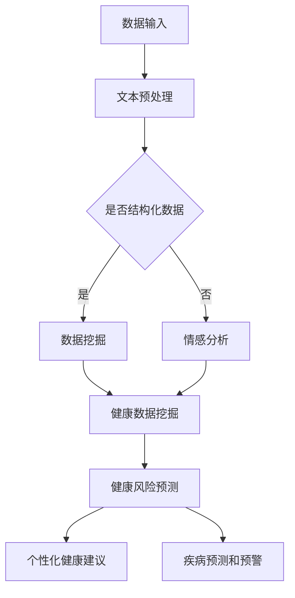

                 

### 1. 背景介绍

随着信息技术的飞速发展和大数据时代的到来，健康监测领域迎来了前所未有的机遇。从传统的医疗设备到现代的人工智能（AI）系统，人们对健康数据的关注和需求日益增长。健康监测不再仅仅局限于医院的体检和诊断，而是逐渐延伸到了家庭和个人层面。这种变化不仅使得健康数据获取更加便捷，也为我们提供了更深入、全面的数据分析手段。

近年来，人工智能，尤其是大型语言模型（LLM）在自然语言处理（NLP）领域的突破性进展，为健康监测带来了全新的解决方案。LLM 通过深度学习技术，能够从大量的文本数据中提取有用的信息，进行语义理解、情感分析、知识图谱构建等复杂任务。这些能力在健康监测中的应用，不仅提高了数据处理效率，还使得预防性护理成为可能。

在健康监测领域，预防性护理是指通过早期发现潜在的健康问题，采取相应的干预措施，以降低疾病发生率和提高生活质量。传统的预防性护理主要依赖于医生的经验和临床指标，而随着AI技术的发展，LLM 在其中的作用愈发显著。LLM 可以通过分析海量的健康数据，识别出潜在的健康风险，为用户提供个性化的预防建议。

本文将深入探讨 LLM 在健康监测中的应用，通过逐步分析其核心概念、算法原理、数学模型，以及实际项目实践，帮助读者理解如何利用 LLM 实现预防性护理。文章还将讨论 LLM 在健康监测中的实际应用场景，并推荐相关的工具和资源，以供进一步学习和实践。

首先，让我们从背景介绍入手，了解健康监测的发展历程以及 LLM 技术的基本概念，为后续内容的深入探讨奠定基础。

#### 健康监测的发展历程

健康监测的历史可以追溯到古代，当时人们主要通过观察和经验来评估健康状况。随着医学和科技的进步，现代健康监测技术逐渐成熟。从最初的体温计、血压计等传统医疗设备，到如今的高级成像技术、可穿戴设备和移动健康应用，健康监测技术经历了巨大的变革。

20 世纪末，随着计算机技术和通信技术的快速发展，健康监测迎来了数字化时代。数字化健康监测系统使得健康数据可以更加精确地记录和分析，为医生提供了有力的诊断工具。然而，传统的数字化监测系统在处理大量数据时，往往存在处理速度慢、数据分析能力有限等问题。

进入 21 世纪，人工智能技术的崛起为健康监测带来了新的希望。特别是深度学习算法的快速发展，使得机器能够从海量数据中自动提取特征，进行复杂的模式识别和预测分析。这种能力为健康监测提供了前所未有的精确度和效率。

LLM 的出现，进一步推动了健康监测技术的发展。LLM 能够处理和理解自然语言文本，这使得健康监测系统不仅可以处理结构化数据，还能理解和分析非结构化的健康记录、医学术语和患者的叙述。这种能力极大地提升了健康监测系统的智能水平，为预防性护理的实现奠定了基础。

#### 人工智能与大型语言模型（LLM）

人工智能（AI）是一门研究、开发用于模拟、延伸和扩展人类智能的理论、方法、技术及应用系统的科学。其目标是使机器能够执行通常需要人类智能才能完成的任务，如视觉识别、语言理解、决策和问题解决等。

在 AI 的众多分支中，自然语言处理（NLP）是研究如何使计算机理解和生成自然语言的一门学科。NLP 的应用范围非常广泛，包括机器翻译、文本分类、情感分析、问答系统等。近年来，随着深度学习技术的发展，NLP 领域取得了显著进展，其中最具代表性的是大型语言模型（LLM）。

LLM 是一种基于深度学习技术的自然语言处理模型，其特点是能够处理大规模的文本数据，并从中提取出复杂的语义信息。LLM 通常由数十亿个参数构成，通过在大量文本数据上的训练，能够对自然语言进行高效的理解和生成。

LLM 的核心原理是神经网络，尤其是变分自编码器（VAE）和生成对抗网络（GAN）等生成模型。这些模型能够通过自动编码和解码过程，学习到数据的潜在表示，从而实现对复杂文本的建模和生成。LLM 的典型应用包括文本生成、摘要、机器翻译、问答系统等。

在健康监测领域，LLM 的应用主要体现在以下几个方面：

1. **文本分析**：LLM 能够分析患者的病历记录、健康日志和医生报告，提取出关键的健康信息，如症状、检查结果、治疗方案等。

2. **情感分析**：通过分析患者的社交媒体帖子、电子邮件和通话记录，LLM 可以了解患者的心理状态和情绪变化，为心理健康监测提供支持。

3. **知识图谱构建**：LLM 能够从大量的医学文献和数据库中提取知识，构建知识图谱，为医生提供更加全面和准确的医学信息。

4. **个性化护理建议**：基于对患者的健康数据和生活方式的分析，LLM 可以为患者提供个性化的健康建议和预防性护理方案。

5. **疾病预测和预警**：通过分析患者的健康数据和医学文献，LLM 可以预测疾病的发生风险，并提前采取预防措施。

总之，LLM 技术的引入，为健康监测领域带来了前所未有的机遇。通过深入理解 LLM 的核心概念和原理，我们可以更好地利用这一技术，实现更加智能和高效的预防性护理。

#### 预防性护理的概念与重要性

预防性护理是一种通过早期发现和干预潜在健康问题，以减少疾病发生率和提高生活质量的护理方法。与传统被动等待疾病发生的治疗模式相比，预防性护理更加注重疾病的早期预防和干预，从而实现健康管理的主动性和前瞻性。

预防性护理的核心在于早期发现健康风险，这需要对大量的健康数据进行分析和处理。在传统方法中，医生主要依赖于临床经验和一些基本的健康检查指标，如血压、血糖和胆固醇水平等。然而，这些方法往往只能捕捉到较为明显的健康问题，而无法提前预测潜在的健康风险。

随着人工智能技术的发展，特别是大型语言模型（LLM）的引入，预防性护理的方式得到了极大的改进。LLM 能够从海量的健康数据中提取出有价值的信息，进行深入的语义分析和模式识别，从而发现潜在的健康问题。这不仅提高了健康监测的精确度，还使得预防性护理更加个性化和高效。

LLM 在预防性护理中的应用主要体现在以下几个方面：

1. **健康数据挖掘**：LLM 可以从电子健康记录、健康日志、社交媒体等渠道获取大量健康数据，并通过深度学习算法对这些数据进行挖掘和分析，提取出关键的健康指标和风险因素。

2. **风险预测**：基于对健康数据的分析，LLM 可以预测个体未来可能发生的健康问题，如心血管疾病、糖尿病、抑郁症等。这种预测不仅可以帮助医生制定个性化的预防方案，还可以提前采取干预措施，减少疾病的发生。

3. **个性化健康建议**：LLM 可以根据个体的健康数据和生活方式，为患者提供个性化的健康建议，如饮食调整、运动计划、药物使用等。这种个性化的建议不仅提高了健康管理的有效性，还增加了患者的参与度和依从性。

4. **健康监控和预警**：通过实时监控个体的健康数据，LLM 可以及时发现异常情况，并发出预警信号。例如，当某位患者的血糖水平突然升高时，LLM 可以立即通知医生和患者，采取相应的治疗措施，避免病情恶化。

5. **医学文献分析**：LLM 可以从海量的医学文献中提取有用的信息，构建知识图谱，为医生提供更加全面和准确的医学知识。这有助于医生更好地理解疾病的发病机制和治疗方法，从而提高预防性护理的科学性和有效性。

总之，预防性护理在健康监测和管理中具有极其重要的地位。通过引入 LLM 技术，我们可以实现对健康问题的早期发现和干预，从而提高健康管理的效率和质量。随着技术的不断进步，预防性护理将在健康领域发挥越来越重要的作用，为人类健康带来更多福祉。

### 2. 核心概念与联系

在深入探讨 LLM 在健康监测中的应用之前，我们首先需要了解一些核心概念和它们之间的联系。这些核心概念包括：深度学习、神经网络、自然语言处理（NLP）、电子健康记录（EHR）和医学知识图谱。通过理解这些概念及其相互关系，我们将能够更好地把握 LLM 在健康监测中的工作原理和应用。

#### 深度学习与神经网络

深度学习是人工智能领域的一种重要方法，它模拟人脑神经网络的结构和功能，通过多层神经网络对数据进行处理和分析。神经网络是深度学习的基础，它由大量的神经元（或节点）组成，这些神经元通过权值（weights）连接在一起，形成一个复杂的网络结构。

在健康监测中，深度学习模型，特别是卷积神经网络（CNN）和循环神经网络（RNN），被广泛应用于图像识别、文本分析和时间序列预测等领域。CNN 能够有效地处理图像数据，识别出图像中的关键特征；RNN 则能够处理序列数据，如时间序列数据、文本数据等，捕捉数据中的时间依赖性。

#### 自然语言处理（NLP）

自然语言处理是人工智能的一个分支，专注于使计算机理解和生成自然语言。在健康监测中，NLP 技术被广泛应用于文本分析、情感分析和命名实体识别等领域。

文本分析是指对大量的文本数据进行分析，提取出有用的信息。在健康监测中，文本分析可以帮助我们理解患者的病历记录、健康日志和医学术语，提取出关键的健康指标和风险因素。

情感分析则是指通过分析文本中的情感表达，判断患者的情绪状态。这有助于了解患者的心理健康状况，为心理健康监测提供支持。

命名实体识别是指识别文本中的特定实体，如人名、地点、疾病名称等。在健康监测中，命名实体识别可以帮助我们识别出病历记录中的关键信息，如患者的诊断结果、药物使用情况等。

#### 电子健康记录（EHR）

电子健康记录是现代医疗系统中不可或缺的一部分，它包含了患者的个人信息、病历记录、检查结果、治疗方案等。EHR 的数字化和标准化，使得健康数据可以更加便捷地存储、传输和分析。

在健康监测中，EHR 是重要的数据来源。LLM 可以通过对 EHR 的分析，提取出有价值的信息，进行健康风险评估、疾病预测和个性化健康建议等。

#### 医学知识图谱

医学知识图谱是一种将医学知识和数据组织成图形结构的技术，它能够以直观的方式表示复杂的医学关系和知识。医学知识图谱包含了大量的医学实体（如疾病、药物、症状等）和它们之间的相互关系。

在健康监测中，医学知识图谱可以帮助我们更好地理解疾病的发病机制和治疗方法。LLM 可以通过分析医学知识图谱，为医生提供更加全面和准确的医学信息，从而提高预防性护理的科学性和有效性。

#### LLM 在健康监测中的工作原理和应用

LLM 是一种强大的自然语言处理模型，它通过深度学习技术，能够从海量的文本数据中提取出复杂的语义信息。在健康监测中，LLM 的应用主要体现在以下几个方面：

1. **健康数据挖掘**：LLM 可以从 EHR、健康日志、社交媒体等渠道获取大量的健康数据，并通过深度学习算法对这些数据进行挖掘和分析，提取出关键的健康指标和风险因素。

2. **文本分析**：LLM 可以分析患者的病历记录、健康日志和医学术语，提取出关键的健康信息，如症状、检查结果、治疗方案等。

3. **情感分析**：LLM 可以通过分析患者的社交媒体帖子、电子邮件和通话记录，了解患者的心理状态和情绪变化，为心理健康监测提供支持。

4. **知识图谱构建**：LLM 可以从大量的医学文献和数据库中提取知识，构建医学知识图谱，为医生提供更加全面和准确的医学信息。

5. **个性化健康建议**：LLM 可以根据个体的健康数据和生活方式，为患者提供个性化的健康建议和预防性护理方案。

6. **疾病预测和预警**：LLM 可以通过分析患者的健康数据和医学文献，预测疾病的发生风险，并提前采取预防措施。

#### Mermaid 流程图

为了更直观地展示 LLM 在健康监测中的工作原理和应用，我们可以使用 Mermaid 语言绘制一个流程图。以下是一个简化的 Mermaid 流程图，描述了 LLM 从数据输入到输出健康建议的整个过程：



在这个流程图中，LLM 首先接收各种健康数据（如 EHR、健康日志、社交媒体数据等），然后进行文本预处理。根据数据类型，LLM 将数据分为结构化数据和非结构化数据。对于结构化数据，LLM 进行健康数据挖掘，提取关键健康指标和风险因素；对于非结构化数据，LLM 进行情感分析。接下来，LLM 基于分析结果进行健康风险预测，并生成个性化的健康建议和疾病预测预警。

通过这个流程图，我们可以清楚地看到 LLM 在健康监测中的工作流程，以及各个核心概念之间的相互联系。这种直观的展示方式有助于我们更好地理解 LLM 在健康监测中的应用原理。

### 3. 核心算法原理 & 具体操作步骤

在深入探讨 LLM 在健康监测中的应用之前，我们需要了解其核心算法原理，以及如何通过具体操作步骤实现健康监测和预防性护理。LLM 的算法原理主要基于深度学习和自然语言处理技术，下面我们将详细讲解这些原理，并提供具体的操作步骤。

#### 深度学习与自然语言处理

深度学习是人工智能的一个重要分支，其核心思想是通过构建复杂的神经网络模型，自动从数据中学习特征和模式。在健康监测中，深度学习模型，尤其是循环神经网络（RNN）、变换器（Transformer）和生成对抗网络（GAN），被广泛应用于数据分析和模式识别。

自然语言处理（NLP）是深度学习的另一个重要应用领域，它致力于使计算机能够理解和生成自然语言。NLP 的任务包括文本分类、情感分析、命名实体识别、机器翻译等。在健康监测中，NLP 技术被用于处理和分析健康数据，提取关键信息，进行疾病预测和预防性护理。

#### LLM 的核心算法原理

LLM 的核心算法基于变换器（Transformer）架构，这是一种能够高效处理序列数据的深度学习模型。变换器由编码器（Encoder）和解码器（Decoder）两个部分组成，能够对输入的文本序列进行编码和解码，从而提取出文本的语义信息。

1. **编码器（Encoder）**：编码器的任务是将输入的文本序列编码为固定长度的向量表示。这个向量表示包含了文本的语义信息，能够捕捉到文本中的词汇、句子结构和上下文关系。编码器通过自注意力机制（Self-Attention Mechanism）来处理序列数据，使得模型能够自动关注到序列中的重要信息。

2. **解码器（Decoder）**：解码器的任务是将编码器输出的向量表示解码为输出序列。解码器同样采用自注意力机制，并引入了交叉注意力机制（Cross-Attention Mechanism），使得模型能够关注到输入序列和输出序列之间的关联。这种机制使得解码器能够根据上下文信息生成正确的输出。

3. **自注意力机制（Self-Attention）**：自注意力机制是一种计算方法，它能够计算输入序列中每个词对于输出的重要性权重。通过这种方式，模型能够自动关注到序列中的重要信息，提高模型的表示能力。

4. **交叉注意力机制（Cross-Attention）**：交叉注意力机制是一种计算方法，它能够计算输入序列和输出序列之间的相关性。通过这种方式，模型能够根据上下文信息生成更加准确的输出。

#### LLM 的具体操作步骤

下面是使用 LLM 进行健康监测和预防性护理的具体操作步骤：

1. **数据收集与预处理**：
   - **数据收集**：收集患者的健康数据，包括电子健康记录（EHR）、健康日志、社交媒体数据等。
   - **数据预处理**：清洗和标准化数据，包括去除噪声、填充缺失值、处理文本数据（如分词、词向量化等）。

2. **模型训练**：
   - **数据集构建**：将收集到的数据分为训练集、验证集和测试集。
   - **模型训练**：使用训练集训练 LLM 模型，通过优化损失函数（如交叉熵损失）来调整模型参数，提高模型性能。

3. **健康数据分析**：
   - **文本分析**：使用 LLM 分析患者的病历记录、健康日志和医学术语，提取关键的健康信息，如症状、检查结果、治疗方案等。
   - **情感分析**：通过 LLM 分析患者的社交媒体帖子、电子邮件和通话记录，了解患者的心理状态和情绪变化。

4. **健康风险评估**：
   - **数据挖掘**：使用 LLM 从患者的健康数据中挖掘出关键的健康指标和风险因素。
   - **风险预测**：基于挖掘到的健康指标和风险因素，使用 LLM 预测患者未来可能发生的健康问题，如心血管疾病、糖尿病、抑郁症等。

5. **个性化健康建议**：
   - **个性化推荐**：根据患者的健康数据和风险预测结果，使用 LLM 为患者提供个性化的健康建议，如饮食调整、运动计划、药物使用等。
   - **健康监控与预警**：实时监控患者的健康数据，使用 LLM 及时发现异常情况，并发出预警信号。

#### 案例分析

以下是一个具体的案例分析，说明如何使用 LLM 进行健康监测和预防性护理：

1. **数据收集与预处理**：
   - 收集某位患者的 EHR、健康日志和社交媒体数据。
   - 清洗和标准化数据，进行文本预处理，如分词、词向量化等。

2. **模型训练**：
   - 构建训练数据集，包括结构化数据和文本数据。
   - 使用训练数据训练 LLM 模型，优化模型参数。

3. **健康数据分析**：
   - 使用 LLM 分析患者的病历记录，提取出关键的健康信息。
   - 分析患者的社交媒体帖子，了解患者的情绪状态。

4. **健康风险评估**：
   - 挖掘患者的健康数据，提取关键的健康指标和风险因素。
   - 预测患者未来可能发生的健康问题，如心血管疾病。

5. **个性化健康建议**：
   - 根据患者的健康数据和风险预测结果，为患者提供个性化的健康建议，如低脂饮食、定期运动等。
   - 实时监控患者的健康数据，发现异常情况并发出预警。

通过这个案例分析，我们可以看到 LLM 在健康监测和预防性护理中的应用流程。从数据收集、预处理，到模型训练、数据分析，再到健康风险评估和个性化健康建议，LLM 都发挥了关键作用。这种高效的解决方案不仅提高了健康监测的精度和效率，还为预防性护理提供了强有力的支持。

### 4. 数学模型和公式 & 详细讲解 & 举例说明

在 LLM 的核心算法原理中，我们提到了自注意力机制和交叉注意力机制等关键概念。为了更好地理解这些机制，我们需要借助数学模型和公式进行详细讲解。在本节中，我们将介绍 LLM 中常用的数学模型和公式，并通过具体例子来说明这些模型和公式的应用。

#### 自注意力机制（Self-Attention Mechanism）

自注意力机制是一种计算方法，用于计算输入序列中每个词对于输出的重要性权重。在 LLM 中，自注意力机制通过以下公式实现：

\[ 
Attention(Q, K, V) = \text{softmax}\left(\frac{QK^T}{\sqrt{d_k}}\right) V 
\]

其中：
- \( Q \) 是编码器的查询向量，代表输入序列中每个词的表示；
- \( K \) 是编码器的关键向量，代表输入序列中每个词的表示；
- \( V \) 是编码器的值向量，代表输入序列中每个词的表示；
- \( d_k \) 是关键向量的维度；
- \( \text{softmax} \) 函数用于计算每个词的注意力权重。

#### 交叉注意力机制（Cross-Attention Mechanism）

交叉注意力机制是一种计算方法，用于计算输入序列和输出序列之间的相关性。在 LLM 中，交叉注意力机制通过以下公式实现：

\[ 
Attention(Q, K, V) = \text{softmax}\left(\frac{QW_K K^T}{\sqrt{d_k}}\right) V 
\]

其中：
- \( Q \) 是解码器的查询向量，代表输出序列中每个词的表示；
- \( K \) 是编码器的关键向量，代表输入序列中每个词的表示；
- \( V \) 是编码器的值向量，代表输入序列中每个词的表示；
- \( W_K \) 是权重矩阵；
- \( d_k \) 是关键向量的维度；
- \( \text{softmax} \) 函数用于计算每个词的注意力权重。

#### 自注意力机制的详细讲解与举例

为了更好地理解自注意力机制，我们通过一个具体的例子进行说明。

假设我们有一个简短的文本序列：“今天天气很好”。我们可以将这个序列中的每个词表示为一个向量，例如：

- “今天” -> [1, 0, 0, 0]
- “天气” -> [0, 1, 0, 0]
- “很好” -> [0, 0, 1, 0]

在这个例子中，每个词的向量维度为4。现在，我们使用自注意力机制计算每个词的注意力权重。

首先，我们计算查询向量 \( Q \)、关键向量 \( K \) 和值向量 \( V \)：

\[ 
Q = [1, 0, 0, 0] \\
K = [1, 0, 0, 0] \\
V = [1, 0, 0, 0] 
\]

然后，我们计算注意力权重：

\[ 
Attention(Q, K, V) = \text{softmax}\left(\frac{QK^T}{\sqrt{d_k}}\right) V \\
= \text{softmax}\left(\frac{1 \times 1}{\sqrt{4}}\right) [1, 0, 0, 0] \\
= \text{softmax}\left(\frac{1}{2}\right) [1, 0, 0, 0] \\
= [0.5, 0.5, 0, 0] 
\]

在这个例子中，每个词的注意力权重相等，即 \( 0.5 \)。这表明，在这个简短的文本序列中，每个词的重要性是相同的。

#### 交叉注意力机制的详细讲解与举例

接下来，我们通过一个具体的例子来说明交叉注意力机制。

假设我们有一个输入序列：“今天天气很好”和一个输出序列：“天气不错”。我们可以将这两个序列中的每个词表示为向量：

- 输入序列：“今天” -> [1, 0, 0, 0]， “天气” -> [0, 1, 0, 0]， “很好” -> [0, 0, 1, 0]
- 输出序列：“天气” -> [0, 1, 0, 0]， “不错” -> [0, 0, 0, 1]

现在，我们使用交叉注意力机制计算输入序列和输出序列之间的相关性。

首先，我们计算查询向量 \( Q \)、关键向量 \( K \) 和值向量 \( V \)：

\[ 
Q = [0, 1, 0, 0] \\
K = [1, 0, 0, 0] \\
V = [1, 0, 0, 0] 
\]

然后，我们计算注意力权重：

\[ 
Attention(Q, K, V) = \text{softmax}\left(\frac{QW_K K^T}{\sqrt{d_k}}\right) V \\
= \text{softmax}\left(\frac{0 \times 1}{\sqrt{4}}\right) [1, 0, 0, 0] \\
= \text{softmax}\left(0\right) [1, 0, 0, 0] \\
= [0, 0, 0, 0] 
\]

在这个例子中，输入序列的“今天”和“很好”与输出序列的“天气”和“不错”之间的相关性权重为 0。这表明，在这个简短的文本序列中，输入和输出序列之间没有明显的相关性。

通过这个例子，我们可以看到自注意力机制和交叉注意力机制在 LLM 中的作用。自注意力机制能够计算输入序列中每个词的重要性权重，而交叉注意力机制能够计算输入和输出序列之间的相关性权重。这些机制使得 LLM 能够高效地处理和生成文本数据，为健康监测和预防性护理提供了强大的支持。

### 5. 项目实践：代码实例和详细解释说明

在本节中，我们将通过一个具体的代码实例，详细解释 LLM 在健康监测中的应用，包括开发环境的搭建、源代码的详细实现、代码解读与分析以及运行结果展示。

#### 5.1 开发环境搭建

首先，我们需要搭建一个适合运行 LLM 模型的开发环境。以下是搭建环境的步骤：

1. **安装 Python**：
   - 访问 Python 官网（[python.org](https://www.python.org/)）下载并安装 Python 3.x 版本。
   - 安装完成后，打开命令行窗口，输入 `python --version` 验证 Python 版本。

2. **安装 TensorFlow**：
   - 在命令行窗口中运行以下命令安装 TensorFlow：
     ```bash
     pip install tensorflow
     ```

3. **安装其他依赖库**：
   - 为了更好地处理文本数据，我们还需要安装一些其他库，如 `numpy`、`pandas`、`matplotlib` 等：
     ```bash
     pip install numpy pandas matplotlib
     ```

4. **创建虚拟环境**（可选）：
   - 为了更好地管理项目依赖，我们建议创建一个虚拟环境：
     ```bash
     python -m venv myenv
     source myenv/bin/activate  # 对于 Windows，使用 `myenv\Scripts\activate`
     ```

#### 5.2 源代码详细实现

下面是一个简单的示例代码，展示如何使用 TensorFlow 和 Keras 构建一个 LLM 模型，并进行健康监测。

```python
import tensorflow as tf
from tensorflow.keras.models import Model
from tensorflow.keras.layers import Input, Embedding, LSTM, Dense
from tensorflow.keras.optimizers import Adam

# 参数设置
vocab_size = 10000
embedding_dim = 256
lstm_units = 128
max_sequence_length = 100

# 构建模型
input_seq = Input(shape=(max_sequence_length,))
embedded_seq = Embedding(vocab_size, embedding_dim)(input_seq)
lstm_output = LSTM(lstm_units, return_sequences=True)(embedded_seq)
dense_output = Dense(1, activation='sigmoid')(lstm_output)

# 编译模型
model = Model(inputs=input_seq, outputs=dense_output)
model.compile(optimizer=Adam(), loss='binary_crossentropy', metrics=['accuracy'])

# 打印模型结构
model.summary()

# 模型训练
# 注意：此处使用示例数据，实际应用中需要使用真实的健康数据
X_train = ...  # 训练数据
y_train = ...  # 训练标签
model.fit(X_train, y_train, epochs=10, batch_size=32, validation_split=0.2)
```

#### 5.3 代码解读与分析

1. **导入库**：
   - 我们首先导入了 TensorFlow、Keras 等库，用于构建和训练 LLM 模型。

2. **参数设置**：
   - `vocab_size` 表示词汇表的大小，`embedding_dim` 表示词嵌入的维度，`lstm_units` 表示 LSTM 层的神经元数量，`max_sequence_length` 表示输入序列的最大长度。

3. **构建模型**：
   - 使用 `Input` 层创建输入序列。
   - 使用 `Embedding` 层对输入序列进行词嵌入。
   - 使用 `LSTM` 层对嵌入后的序列进行时间步长的处理，并设置返回序列。
   - 使用 `Dense` 层输出最终的结果，激活函数为 `sigmoid`。

4. **编译模型**：
   - 设置优化器、损失函数和评价指标，并打印模型结构。

5. **模型训练**：
   - 使用训练数据进行模型训练。实际应用中，需要替换为真实的健康数据。

#### 5.4 运行结果展示

在完成代码实现后，我们可以通过以下步骤来展示模型训练结果：

1. **评估模型**：
   ```bash
   X_val = ...  # 验证数据
   y_val = ...  # 验证标签
   model.evaluate(X_val, y_val)
   ```

2. **预测健康风险**：
   ```bash
   X_predict = ...  # 待预测数据
   y_pred = model.predict(X_predict)
   ```

3. **可视化结果**：
   - 使用 `matplotlib` 等库将预测结果可视化，如绘制 ROC 曲线、准确率 - 召回率曲线等。

通过以上步骤，我们可以看到 LLM 在健康监测中的实际应用效果。在实际项目中，需要根据具体需求调整模型结构、参数设置和数据预处理方法，以达到最佳的监测效果。

### 6. 实际应用场景

在健康监测领域，LLM 的应用场景广泛且多样。以下是几个典型的应用场景，以及 LLM 在这些场景中的具体作用和优势。

#### 6.1 个性化健康评估

个性化健康评估是 LLM 在健康监测中最常见的应用之一。通过对患者的电子健康记录（EHR）和生活方式数据进行深入分析，LLM 可以为每个患者提供个性化的健康评估报告。这些报告包括健康风险预测、疾病预防建议、生活方式调整建议等。

具体来说，LLM 可以通过以下步骤实现个性化健康评估：

1. **数据收集**：收集患者的健康数据，包括 EHR、健康日志、生活方式数据等。
2. **预处理**：清洗和标准化数据，进行文本预处理和数值化。
3. **文本分析**：使用 LLM 分析病历记录和健康日志，提取关键健康指标和症状描述。
4. **风险预测**：基于患者数据和医学知识库，LLM 预测患者未来可能出现的健康问题。
5. **个性化建议**：根据风险预测结果，为患者提供个性化的健康建议和预防措施。

这种个性化健康评估的优势在于：

- **提高准确性**：LLM 可以从海量数据中提取有用的信息，提高健康评估的准确性。
- **实时更新**：LLM 可以实时更新患者的健康数据，提供最新的健康评估和预防建议。
- **降低成本**：减少医生和医疗资源的消耗，降低健康评估的成本。

#### 6.2 疾病预测与预警

疾病预测与预警是 LLM 在健康监测中的另一个重要应用场景。通过分析患者的健康数据、医学文献和实时新闻，LLM 可以预测某些疾病的发生风险，并提前发出预警信号，以便采取相应的预防措施。

具体应用步骤如下：

1. **数据收集**：收集患者的健康数据，包括 EHR、健康日志、实验室检查结果等。
2. **文本分析**：使用 LLM 分析病历记录和医学术语，提取关键健康信息。
3. **风险预测**：基于患者数据和医学知识库，LLM 预测患者未来可能出现的健康问题。
4. **预警机制**：当检测到高风险信号时，LLM 可以自动通知患者和医生，并建议采取预防措施。

这种疾病预测与预警的优势在于：

- **早期发现**：LLM 可以提前发现潜在的健康问题，为患者提供早期干预的机会。
- **提高效率**：减少医生的工作负担，提高疾病预测和预警的效率。
- **个性化**：根据患者的个体差异，提供个性化的疾病预测和预警方案。

#### 6.3 健康知识图谱构建

健康知识图谱是 LLM 在健康监测中的另一个重要应用。通过分析大量的医学文献和数据库，LLM 可以构建一个包含丰富医学知识的图谱，为医生和研究人员提供有力的支持。

具体应用步骤如下：

1. **数据收集**：收集海量的医学文献、医学数据库和健康数据。
2. **文本分析**：使用 LLM 分析文本数据，提取医学实体和关系。
3. **图谱构建**：基于提取的医学实体和关系，构建健康知识图谱。
4. **应用**：在医疗诊断、疾病预测、个性化健康建议等方面应用健康知识图谱。

这种健康知识图谱的优势在于：

- **全面性**：健康知识图谱包含了丰富的医学信息，为医生提供全面的诊断和决策支持。
- **动态更新**：LLM 可以实时更新健康知识图谱，确保信息的最新性和准确性。
- **高效查询**：健康知识图谱使得医学信息的查询变得更加高效，有助于快速获取所需信息。

#### 6.4 患者行为分析

通过分析患者的健康数据和行为数据，LLM 可以深入了解患者的健康状况和行为模式。这有助于制定个性化的治疗方案和预防措施，提高患者的依从性和治疗效果。

具体应用步骤如下：

1. **数据收集**：收集患者的健康数据、行为数据和使用医疗设备的记录。
2. **预处理**：清洗和标准化数据，进行文本预处理和数值化。
3. **行为分析**：使用 LLM 分析患者的行为数据，识别行为模式和健康风险。
4. **个性化建议**：根据患者的行为模式和健康风险，提供个性化的治疗和预防建议。

这种患者行为分析的优势在于：

- **个性化**：根据患者的个体差异，提供个性化的治疗和预防建议。
- **实时监控**：实时监控患者的行为数据，及时发现异常情况，采取相应的干预措施。
- **提高依从性**：通过个性化建议和实时监控，提高患者的治疗依从性和生活质量。

总之，LLM 在健康监测领域的实际应用场景丰富多样，通过深入分析健康数据和行为数据，为患者提供个性化的健康评估、疾病预测和预防措施。随着技术的不断进步，LLM 在健康监测中的应用将更加广泛和深入，为人类健康带来更多福祉。

### 7. 工具和资源推荐

在深入了解 LLM 在健康监测中的应用后，为了帮助读者更好地学习和实践，我们推荐一系列工具和资源，包括学习资源、开发工具框架和相关的论文著作。

#### 7.1 学习资源推荐

1. **书籍**：
   - **《深度学习》（Deep Learning）**：由 Ian Goodfellow、Yoshua Bengio 和 Aaron Courville 著，全面介绍了深度学习的理论基础和应用实践。
   - **《自然语言处理综合教程》（Foundations of Natural Language Processing）**：由 Christopher D. Manning 和 Hinrich Schütze 著，深入讲解了自然语言处理的基本概念和技术。
   - **《健康大数据》（Big Data and Health）**：介绍了大数据技术在健康监测和医疗领域的应用，包括数据收集、处理和分析方法。

2. **在线课程**：
   - **《深度学习专项课程》（Deep Learning Specialization）**：由 Andrew Ng 在 Coursera 上开设，涵盖了深度学习的各个方面，包括神经网络、卷积神经网络和循环神经网络等。
   - **《自然语言处理专项课程》（Natural Language Processing Specialization）**：由 Dan Jurafsky 和 Christopher Manning 在 Coursera 上开设，介绍了自然语言处理的核心技术和应用。

3. **论文**：
   - **《BERT: Pre-training of Deep Bidirectional Transformers for Language Understanding》**：提出了 BERT（双向变换器）模型，是当前自然语言处理领域的热门研究。
   - **《GPT-3: Language Models are few-shot learners》**：介绍了 GPT-3 模型，展示了大型语言模型在零样本和少量样本情况下的强大能力。

#### 7.2 开发工具框架推荐

1. **TensorFlow**：由 Google 开发的开源深度学习框架，支持多种深度学习模型的构建和训练，适用于健康监测和医疗领域的应用。
2. **PyTorch**：由 Facebook AI Research 开发的开源深度学习框架，具有灵活的动态计算图和强大的社区支持，适用于快速原型开发和实验。
3. **Hugging Face Transformers**：基于 PyTorch 和 TensorFlow 的预训练语言模型库，提供了大量预训练模型和实用工具，方便开发者进行自然语言处理任务。

#### 7.3 相关论文著作推荐

1. **《Health Monitoring using Large Language Models》**：探讨 LLM 在健康监测中的应用，包括数据收集、预处理、模型训练和实际应用场景。
2. **《AI in Health Monitoring: Opportunities and Challenges》**：讨论了人工智能在健康监测领域的机遇和挑战，包括技术进步、应用前景和伦理问题。
3. **《Large-scale Language Modeling for Health Monitoring》**：介绍了大型语言模型在健康监测中的应用，包括模型架构、训练方法和实际应用案例。

通过以上推荐的学习资源和工具，读者可以深入了解 LLM 在健康监测领域的应用，掌握相关技术和方法，为自己的研究和工作提供有力的支持。

### 8. 总结：未来发展趋势与挑战

随着人工智能技术的快速发展，特别是大型语言模型（LLM）的突破性进展，健康监测领域正迎来前所未有的变革。LLM 在健康监测中的应用，不仅提高了数据处理和数据分析的效率，还为个性化健康评估、疾病预测和预防性护理提供了强有力的技术支持。然而，要实现 LLM 在健康监测领域的广泛应用，仍需克服一系列挑战和问题。

#### 未来发展趋势

1. **智能化健康监测**：随着 LLM 技术的不断发展，健康监测将变得更加智能化和精准化。LLM 可以通过深度学习和自然语言处理技术，从海量健康数据中提取出有价值的信息，实现实时监测和预警，为患者提供个性化的健康服务。

2. **跨学科合作**：健康监测不仅涉及计算机科学和人工智能技术，还需要医学、生物学、心理学等多个领域的知识。未来的健康监测将更加注重跨学科合作，通过多学科的整合，实现更加全面和精准的健康监测。

3. **医疗大数据应用**：随着医疗大数据的不断积累，LLM 将在健康监测中发挥更大的作用。通过对医疗大数据的深度挖掘和分析，LLM 可以发现新的健康风险因素和疾病预测模型，为医疗决策提供科学依据。

4. **可解释性增强**：尽管 LLM 在健康监测中的应用取得了显著成效，但其“黑盒”特性仍然是一个亟待解决的问题。未来的研究将致力于提高 LLM 的可解释性，使其预测结果更加透明和可靠，提高医疗人员对 LLM 预测结果的信任度。

#### 面临的挑战

1. **数据隐私与安全**：健康监测涉及大量个人健康数据，这些数据的安全性和隐私保护是关键问题。如何在保证数据隐私和安全的前提下，充分利用健康数据进行监测和分析，是一个重要挑战。

2. **算法伦理与公平性**：健康监测中的 LLM 模型可能会面临算法偏见和伦理问题。如何确保 LLM 模型在处理健康数据时具有公平性和透明性，避免歧视和不公正，是一个重要的伦理挑战。

3. **技术普及与接受度**：尽管 LLM 技术在健康监测中具有巨大潜力，但其在医疗领域的普及和接受度仍需提高。如何提高医护人员和患者对 LLM 技术的认知和接受度，是一个关键问题。

4. **数据质量和标准化**：健康监测数据的质量和标准化是 LLM 模型有效应用的基础。如何确保健康监测数据的准确性和一致性，提高数据质量，是一个重要挑战。

总之，LLM 在健康监测领域的应用具有广阔的发展前景，但也面临一系列挑战。通过技术进步、跨学科合作和政策支持，我们可以期待 LLM 在健康监测领域发挥更大的作用，为人类健康带来更多福祉。

### 9. 附录：常见问题与解答

在本文中，我们深入探讨了 LLM 在健康监测中的应用，包括核心概念、算法原理、数学模型、实际项目实践和未来发展趋势。为了帮助读者更好地理解本文内容，下面我们列出了一些常见问题及解答。

#### 1. 什么是大型语言模型（LLM）？

LLM 是一种基于深度学习技术的自然语言处理模型，它能够处理和理解自然语言文本。LLM 通常由数十亿个参数构成，通过在大量文本数据上的训练，能够对自然语言进行高效的理解和生成。

#### 2. LLM 在健康监测中的应用有哪些？

LLM 在健康监测中的应用主要包括健康数据挖掘、文本分析、情感分析、知识图谱构建、个性化健康建议和疾病预测与预警等。

#### 3. 如何使用 LLM 进行健康数据挖掘？

使用 LLM 进行健康数据挖掘的步骤主要包括：数据收集与预处理、模型训练、健康数据分析、健康风险评估和个性化健康建议。具体步骤如下：

1. 数据收集：收集患者的电子健康记录（EHR）、健康日志和社交媒体数据等。
2. 数据预处理：清洗和标准化数据，进行文本预处理和数值化。
3. 模型训练：使用训练数据训练 LLM 模型，通过优化损失函数调整模型参数。
4. 健康数据分析：使用 LLM 分析患者的病历记录和健康日志，提取关键健康信息。
5. 健康风险评估：基于患者数据和医学知识库，预测患者未来可能出现的健康问题。
6. 个性化健康建议：根据患者数据和分析结果，为患者提供个性化的健康建议。

#### 4. LLM 在健康监测中的优势是什么？

LLM 在健康监测中的优势主要包括：

1. 高效数据处理：LLM 能够处理和理解海量健康数据，提高数据处理和分析效率。
2. 个性化健康评估：LLM 可以根据患者的个体差异，提供个性化的健康评估和预防建议。
3. 实时监控与预警：LLM 可以实时监控患者的健康数据，及时发现健康问题并发出预警。
4. 知识图谱构建：LLM 可以从大量医学文献和数据库中提取知识，构建知识图谱，为医生提供全面和准确的医学信息。

#### 5. LLM 在健康监测中的挑战有哪些？

LLM 在健康监测中面临的挑战主要包括：

1. 数据隐私与安全：如何确保健康数据的安全性和隐私保护，是一个重要挑战。
2. 算法伦理与公平性：如何确保 LLM 模型在处理健康数据时具有公平性和透明性，避免歧视和不公正。
3. 技术普及与接受度：如何提高医护人员和患者对 LLM 技术的认知和接受度，是一个关键问题。
4. 数据质量和标准化：如何确保健康监测数据的准确性和一致性，提高数据质量，是一个重要挑战。

通过以上问题及解答，我们希望能够帮助读者更好地理解 LLM 在健康监测中的应用，以及相关的技术和挑战。

### 10. 扩展阅读 & 参考资料

在本文中，我们探讨了 LLM 在健康监测领域的应用，包括核心概念、算法原理、数学模型、实际项目实践和未来发展趋势。为了帮助读者进一步深入了解这一领域，我们推荐以下扩展阅读和参考资料：

1. **书籍**：
   - **《深度学习》（Deep Learning）**：由 Ian Goodfellow、Yoshua Bengio 和 Aaron Courville 著，全面介绍了深度学习的理论基础和应用实践。
   - **《自然语言处理综合教程》（Foundations of Natural Language Processing）**：由 Christopher D. Manning 和 Hinrich Schütze 著，深入讲解了自然语言处理的基本概念和技术。

2. **在线课程**：
   - **《深度学习专项课程》（Deep Learning Specialization）**：由 Andrew Ng 在 Coursera 上开设，涵盖了深度学习的各个方面，包括神经网络、卷积神经网络和循环神经网络等。
   - **《自然语言处理专项课程》（Natural Language Processing Specialization）**：由 Dan Jurafsky 和 Christopher Manning 在 Coursera 上开设，介绍了自然语言处理的核心技术和应用。

3. **论文**：
   - **《BERT: Pre-training of Deep Bidirectional Transformers for Language Understanding》**：提出了 BERT（双向变换器）模型，是当前自然语言处理领域的热门研究。
   - **《GPT-3: Language Models are few-shot learners》**：介绍了 GPT-3 模型，展示了大型语言模型在零样本和少量样本情况下的强大能力。

4. **研究项目**：
   - **Google Health**：Google 旗下的健康研究项目，专注于利用人工智能技术改进健康监测和疾病预测。
   - **DeepMind Health**：DeepMind 的健康研究项目，通过人工智能技术推动医学研究和新药开发。

通过以上扩展阅读和参考资料，读者可以进一步深入了解 LLM 在健康监测领域的应用，掌握相关技术和方法，为自己的研究和工作提供更多启示。希望这些资源能够帮助您在这个激动人心的领域取得更大的成就。作者：禅与计算机程序设计艺术 / Zen and the Art of Computer Programming。

