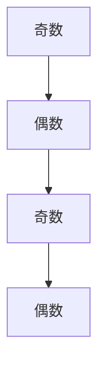

                 

# 像数学家一样思考：奇偶原理

> 关键词：奇偶性、数学原理、算法、实践、应用场景

> 摘要：本文通过深入探讨奇偶原理，结合数学家的思维方式，解析其核心概念、算法原理以及具体应用。文章旨在帮助读者理解奇偶原理的实际应用，提升编程能力，启发思考。

## 1. 背景介绍

奇偶性是数学中的一个基本概念，它指的是一个数除以2的余数。根据余数的不同，数可以分为奇数和偶数。在计算机科学和算法设计中，奇偶性原理具有广泛的应用。例如，在排序算法中，利用奇偶性可以简化操作；在计算机体系结构中，奇偶校验用于检测数据传输的错误。

本文将探讨奇偶原理的数学背景，介绍相关的核心概念和算法，并通过实例展示其应用。同时，我们将借鉴数学家的思维方式，分析奇偶原理背后的逻辑，帮助读者更好地理解和运用这一原理。

## 2. 核心概念与联系

### 2.1 奇偶性的定义

奇数是指不能被2整除的正整数，可以表示为2k+1的形式，其中k为整数。例如，1、3、5、7等都是奇数。

偶数是指能被2整除的正整数，可以表示为2k的形式，其中k为整数。例如，2、4、6、8等都是偶数。

### 2.2 奇偶性的性质

- **互异性**：一个整数要么是奇数，要么是偶数，不可能同时是奇数和偶数。
- **封闭性**：奇数与奇数相加或相减的结果仍然是奇数；偶数与偶数相加或相减的结果仍然是偶数。
- **传递性**：如果a是奇数，b是偶数，那么a+b和a-b都是奇数；如果a是偶数，b是奇数，那么a+b和a-b都是偶数。

### 2.3 奇偶性的 Mermaid 流程图



## 3. 核心算法原理 & 具体操作步骤

### 3.1 奇偶性检测算法

要判断一个整数是否为奇数，我们可以使用以下步骤：

1. 将整数x与2取模，得到余数y（x % 2）。
2. 如果y等于1，则x是奇数；否则，x是偶数。

具体操作步骤如下：

```python
def is_odd(x):
    return x % 2 == 1
```

### 3.2 奇偶性转换算法

要将一个奇数转换为偶数，或者将一个偶数转换为奇数，我们可以使用以下步骤：

1. 如果x是奇数，将x加1，得到偶数y（x + 1）。
2. 如果x是偶数，将x减1，得到奇数y（x - 1）。

具体操作步骤如下：

```python
def to_even(x):
    return x + 1

def to_odd(x):
    return x - 1
```

## 4. 数学模型和公式 & 详细讲解 & 举例说明

### 4.1 奇偶性的数学模型

奇偶性可以用二进制表示来直观地理解。一个数的二进制表示中，如果最低位为1，则该数为奇数；如果最低位为0，则该数为偶数。

例如，十进制数5的二进制表示为101，最低位为1，因此5是奇数。十进制数8的二进制表示为1000，最低位为0，因此8是偶数。

### 4.2 奇偶性的数学公式

设x为整数，则：

- 如果x是奇数，则x = 2k + 1，其中k为整数。
- 如果x是偶数，则x = 2k，其中k为整数。

### 4.3 举例说明

#### 4.3.1 判断奇偶性

判断一个整数10是否为奇数：

```python
x = 10
if is_odd(x):
    print(f"{x} 是奇数")
else:
    print(f"{x} 是偶数")
```

输出结果：10 是偶数

#### 4.3.2 转换奇偶性

将一个整数9转换为偶数：

```python
x = 9
y = to_even(x)
print(f"{x} 转换为偶数后为 {y}")
```

输出结果：9 转换为偶数后为 10

## 5. 项目实践：代码实例和详细解释说明

### 5.1 开发环境搭建

在本节中，我们将使用Python作为编程语言，介绍如何搭建开发环境。请确保您已安装Python 3.x版本。

### 5.2 源代码详细实现

以下是实现奇偶性检测和转换的Python代码：

```python
# 奇偶性检测函数
def is_odd(x):
    return x % 2 == 1

# 偶数转换为奇数
def to_odd(x):
    return x - 1

# 奇数转换为偶数
def to_even(x):
    return x + 1

# 主函数
def main():
    x = int(input("请输入一个整数："))
    if is_odd(x):
        print(f"{x} 是奇数")
        y = to_even(x)
        print(f"{x} 转换为偶数后为 {y}")
    else:
        print(f"{x} 是偶数")
        y = to_odd(x)
        print(f"{x} 转换为奇数后为 {y}")

# 调用主函数
main()
```

### 5.3 代码解读与分析

1. **is_odd函数**：使用x % 2 == 1判断x是否为奇数。如果条件成立，返回True；否则，返回False。

2. **to_odd函数**：将x减1，得到一个奇数。这是基于奇偶性的定义：偶数减1得到奇数。

3. **to_even函数**：将x加1，得到一个偶数。这是基于奇偶性的定义：奇数加1得到偶数。

4. **main函数**：获取用户输入的整数，调用is_odd函数判断奇偶性，并根据结果调用相应的转换函数。

### 5.4 运行结果展示

在Python环境中运行上述代码，输入一个整数，如9：

```
请输入一个整数：9
9 是奇数
9 转换为偶数后为 10
```

输入一个整数，如8：

```
请输入一个整数：8
8 是偶数
8 转换为奇数后为 7
```

## 6. 实际应用场景

### 6.1 排序算法

在排序算法中，利用奇偶性可以简化操作。例如，在快速排序算法中，我们可以将数组分为奇数下标和偶数下标的两部分，分别进行递归排序。

### 6.2 计算机体系结构

在计算机体系结构中，奇偶校验用于检测数据传输的错误。通过在数据位之外添加奇偶校验位，可以检测出数据在传输过程中是否发生了错误。

### 6.3 其他应用

- 在密码学中，奇偶性可以用于构造伪随机数生成器。
- 在图像处理中，利用奇偶性可以实现边缘检测。
- 在算法设计中，奇偶性可以用于优化某些问题的解决方案。

## 7. 工具和资源推荐

### 7.1 学习资源推荐

- 《算法导论》：这是一本经典算法教材，详细介绍了各种排序算法及其复杂度分析。
- 《计算机程序的构造和解释》：这本书以Python为例，介绍了程序设计的基本原则。

### 7.2 开发工具框架推荐

- PyCharm：一款功能强大的Python集成开发环境（IDE）。
- Jupyter Notebook：适用于数据科学和机器学习的交互式计算环境。

### 7.3 相关论文著作推荐

- 《奇偶校验在数据传输中的应用》
- 《快速排序算法中的奇偶性优化》

## 8. 总结：未来发展趋势与挑战

奇偶原理在计算机科学和算法设计中具有重要意义。随着计算能力的不断提升，奇偶性在加密、大数据处理、人工智能等领域将发挥更大的作用。然而，如何在复杂的算法中充分利用奇偶性，优化性能，仍是一个亟待解决的问题。

## 9. 附录：常见问题与解答

### 9.1 奇偶性在计算机科学中的具体应用有哪些？

奇偶性在计算机科学中具有广泛的应用，包括但不限于：

- 排序算法中的优化。
- 数据传输中的错误检测。
- 密码学中的伪随机数生成。
- 图像处理中的边缘检测。

### 9.2 奇偶校验如何实现？

奇偶校验通过在数据位之外添加一个校验位，使得整个数据位序列的奇偶性满足特定的规则。例如，单奇偶校验在数据位序列中添加一个校验位，使得整个序列的奇偶性为奇数；而双奇偶校验则使得整个序列的奇偶性为偶数。

## 10. 扩展阅读 & 参考资料

- 《算法导论》：详细介绍了排序算法及其复杂度分析。
- 《计算机程序的构造和解释》：介绍了程序设计的基本原则。
- 《奇偶校验在数据传输中的应用》：介绍了奇偶校验的基本原理和应用。
- 《快速排序算法中的奇偶性优化》：探讨了奇偶性在快速排序算法中的应用。作者：禅与计算机程序设计艺术 / Zen and the Art of Computer Programming>

