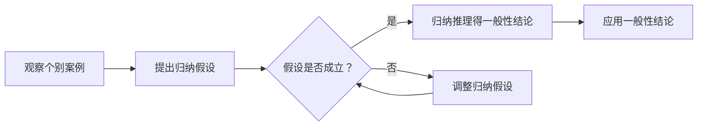

                 

### 背景介绍

在计算机科学和数学的交汇点，归纳推理作为一种强有力的思维工具，扮演着关键角色。归纳推理是一种从特殊到一般的推理方法，通过观察个别案例，推导出普遍性结论。这种思维方式在数学中尤为常见，从自然数的简单性质，到复杂的代数和几何证明，无不依赖归纳原则。

本篇文章旨在探讨归纳原则在计算机科学中的应用，并深入理解这一思维模式背后的数学基础。我们将首先回顾归纳推理的历史背景和基本原则，接着详细分析其在计算机算法设计中的具体应用，并通过一个具体的实例来展示归纳方法如何用于解决实际问题。

本文将分为以下几个部分：

1. **背景介绍**：介绍归纳推理的历史和基本概念。
2. **核心概念与联系**：通过Mermaid流程图展示归纳推理的基本流程和原理。
3. **核心算法原理与具体操作步骤**：讨论经典的归纳算法及其实现。
4. **数学模型和公式**：介绍与归纳相关的数学公式，并详细讲解其意义和应用。
5. **项目实践：代码实例与详细解释说明**：通过一个实际的项目案例来展示归纳方法的应用。
6. **实际应用场景**：探讨归纳推理在计算机科学中的多种应用。
7. **工具和资源推荐**：推荐相关书籍、工具和资源。
8. **总结：未来发展趋势与挑战**：总结归纳推理的重要性，并展望其未来发展。
9. **附录：常见问题与解答**：回答读者可能关心的问题。
10. **扩展阅读与参考资料**：提供进一步学习的资源。

通过这些部分的讨论，我们希望读者能够理解归纳推理的核心概念，掌握其在计算机科学中的应用方法，并能够在实践中灵活运用这一重要的思维工具。

### 核心概念与联系

归纳推理作为一种基本的思维模式，在数学和计算机科学中占据着重要地位。要深入理解归纳推理，首先需要明确其基本概念和原理。

**定义**：归纳推理是一种从个别到一般的推理方式，即通过观察一些具体案例，从中推导出一般性的结论。它通常分为两个步骤：归纳假设和归纳推理。

**归纳假设**：归纳假设是基于已有观察数据提出的一个猜想，它通常是一个普遍性的规律或原则。

**归纳推理**：归纳推理是从归纳假设出发，通过逻辑推理得出一般性结论的过程。

为了更直观地展示归纳推理的基本流程，我们可以使用Mermaid流程图来描述：



在上面的流程图中，A表示观察个别案例，B表示提出归纳假设，C表示对归纳假设的验证，D表示基于归纳假设得到的一般性结论，E表示在假设不成立时调整归纳假设，F表示应用一般性结论。

**Mermaid 流程图说明**：

1. **观察个别案例（A）**：归纳推理的第一步是观察具体的个别案例。这些案例可以是具体的数据点、现象或者实例。
   
2. **提出归纳假设（B）**：在观察个别案例的基础上，我们提出一个普遍性的假设，即归纳假设。这个假设通常是基于我们对现有数据的理解和预期。

3. **验证归纳假设（C）**：接下来，我们需要验证归纳假设是否成立。这通常通过进一步的观察和实验来完成。如果假设成立，我们就可以继续进行下一步。

4. **归纳推理得一般性结论（D）**：在验证归纳假设成立后，我们可以通过归纳推理得到一个一般性的结论。这个结论可以应用于更广泛的情境中。

5. **调整归纳假设（E）**：如果归纳假设不成立，我们需要重新审视现有数据，调整归纳假设，然后再次进行验证。

6. **应用一般性结论（F）**：最后，我们应用得到的一般性结论来解决实际问题或进行进一步的推理。

**归纳原则的应用场景**：

归纳推理不仅在数学中广泛应用，在计算机科学中也具有重要作用。以下是归纳原则在计算机科学中的几种常见应用场景：

1. **算法设计**：在算法设计中，归纳推理常用于证明算法的正确性和效率。例如，在动态规划中，我们通常使用归纳假设来证明算法的正确性。

2. **程序验证**：在程序验证过程中，归纳推理可以帮助我们验证程序的正确性。例如，可以使用归纳断言来证明程序在所有情况下都能达到预期的结果。

3. **数据挖掘**：在数据挖掘中，归纳推理可以帮助我们从一个数据集中提取出一般性的规律或模式。

4. **机器学习**：在机器学习中，归纳推理是核心思想之一。通过观察数据，机器学习算法可以学习出一个能够预测未知数据的模型。

5. **软件工程**：在软件工程中，归纳推理可以帮助我们设计更可靠、更高效的软件系统。

通过上述讨论，我们可以看到归纳推理作为一种基本思维工具，在数学和计算机科学中具有广泛的应用。理解归纳原则和其应用场景，不仅有助于我们更好地解决实际问题，也有助于提升我们的思维能力和创新能力。

### 核心算法原理与具体操作步骤

在深入理解归纳推理的基本概念和流程之后，接下来我们将讨论几种经典的归纳算法，并详细介绍它们的具体操作步骤。这些算法不仅展示了归纳推理的核心原理，同时也为我们在实际应用中提供了有效的工具。

#### 1. 强归纳法

**定义**：强归纳法是一种用于证明算法正确性和复杂度的常用方法。它基于归纳假设，通过递归步骤逐步证明算法的正确性。

**具体操作步骤**：

1. **基础情况**：首先证明算法在基础情况（通常是输入数据的最小可能值）下的正确性。
   
2. **归纳假设**：假设算法在输入数据为某个值时正确，即假设P(n)为真。

3. **归纳步骤**：证明在归纳假设P(n)为真的前提下，当输入数据增加一个单位时，算法仍然能够正确运行，即证明P(n+1)为真。

4. **归纳结论**：通过基础情况和归纳步骤，我们可以得出算法在所有可能输入值下都是正确的结论。

**示例**：以二分查找算法为例，使用强归纳法证明其正确性。

- **基础情况**：当数组长度为1时，二分查找算法能够正确返回元素的位置。
- **归纳假设**：假设当数组长度为n时，算法能够正确返回元素的位置。
- **归纳步骤**：当数组长度为n+1时，我们首先找到中间元素，然后根据中间元素与目标元素的比较结果，将问题分解成两个长度为n/2的子问题。根据归纳假设，算法在两个子问题上的运行都是正确的。
- **归纳结论**：因此，二分查找算法在所有可能的输入情况下都是正确的。

#### 2. 动态规划

**定义**：动态规划是一种用于求解最优化问题的算法技术，它利用归纳思想将问题分解成子问题，并通过子问题的最优解推导出原问题的最优解。

**具体操作步骤**：

1. **状态定义**：将问题定义为一个状态序列，每个状态包含若干参数。
   
2. **状态转移方程**：定义状态之间的转移关系，即如何从一个状态推导出另一个状态。
   
3. **边界条件**：确定算法的初始状态和终止条件。
   
4. **递推关系**：通过递推关系，从初始状态逐步推导出终止状态的最优解。

**示例**：以Fibonacci数列的动态规划求解为例。

- **状态定义**：定义状态F(n)为第n个Fibonacci数。
- **状态转移方程**：F(n) = F(n-1) + F(n-2)，其中F(0) = 0，F(1) = 1。
- **边界条件**：初始状态F(0) = 0，F(1) = 1。
- **递推关系**：根据状态转移方程，我们可以递推求解出F(n)的值。

#### 3. 胜率动态规划

**定义**：胜率动态规划是一种用于求解博弈问题的算法，它利用归纳思想分析每个状态下的胜率。

**具体操作步骤**：

1. **状态定义**：将问题定义为一个状态空间，每个状态表示博弈中的一种局面。
   
2. **状态转移方程**：定义每个状态下的胜率，即从一个状态转移到另一个状态的概率。
   
3. **初始状态**：确定博弈的初始状态及其胜率。
   
4. **递推关系**：通过递推关系，从初始状态逐步推导出所有状态的胜率。

**示例**：以井字棋游戏（Tic-Tac-Toe）为例，使用胜率动态规划求解最优策略。

- **状态定义**：定义状态为游戏棋盘的布局，每个格子可以是空、X或O。
- **状态转移方程**：根据当前棋盘布局，计算下一步下X或O的胜率。
- **初始状态**：初始棋盘为空棋盘，X和O的胜率均为0.5。
- **递推关系**：根据状态转移方程，从初始状态逐步推导出所有状态的胜率。

#### 4. 多阶段优化

**定义**：多阶段优化是一种用于解决多阶段决策问题的算法，它利用归纳思想，在每个阶段选择最优决策。

**具体操作步骤**：

1. **阶段划分**：将问题划分为多个阶段。
   
2. **决策变量**：定义每个阶段的决策变量，即每个阶段应采取的行动。
   
3. **状态转移方程**：定义每个阶段的决策变量如何影响后续阶段的状态。
   
4. **目标函数**：定义目标函数，以优化决策变量。

**示例**：以多阶段优化求解旅行商问题（Traveling Salesman Problem，TSP）为例。

- **阶段划分**：将TSP划分为多个阶段，每个阶段表示访问城市的一部分。
- **决策变量**：定义每个阶段访问城市的顺序。
- **状态转移方程**：根据当前访问的城市和剩余城市，计算下一阶段的最优访问顺序。
- **目标函数**：定义目标函数，以求解总旅行距离的最小值。

通过上述几种归纳算法的讨论，我们可以看到归纳原理在计算机科学中的应用是多么广泛和重要。无论是算法的正确性证明，还是复杂度分析，抑或是最优化问题求解，归纳方法都为我们提供了强有力的工具。理解并掌握这些算法，不仅能够提升我们的编程能力，也能够拓宽我们的思维视野。

### 数学模型和公式 & 详细讲解 & 举例说明

在计算机科学中，数学模型和公式是解决问题的关键工具，尤其是在归纳推理的应用中。以下是几个与归纳推理相关的数学模型和公式，我们将通过详细的讲解和实际例子来展示它们的意义和应用。

#### 1. 归纳原理公式

**公式**：$$ P(0) \land (\forall n \in \mathbb{N}, P(n) \Rightarrow P(n+1)) \Rightarrow \forall n \in \mathbb{N}, P(n) $$

**解释**：这是经典的归纳原理公式，用于证明一个命题在所有自然数上成立。其中，\( P(0) \) 表示基础情况，即命题在 \( n = 0 \) 时成立；\( \forall n \in \mathbb{N}, P(n) \Rightarrow P(n+1) \) 表示归纳假设，即如果命题在 \( n \) 时成立，则在 \( n+1 \) 时也成立；最后 \( \Rightarrow \forall n \in \mathbb{N}, P(n) \) 表示归纳结论，即命题在所有自然数上成立。

**示例**：

假设我们要证明自然数之和的公式：\( 1 + 2 + 3 + \ldots + n = \frac{n(n+1)}{2} \)。

- **基础情况**：当 \( n = 0 \) 时，左边为0，右边为0，基础情况成立。
- **归纳假设**：假设当 \( n = k \) 时，公式成立，即 \( 1 + 2 + 3 + \ldots + k = \frac{k(k+1)}{2} \)。
- **归纳步骤**：当 \( n = k+1 \) 时，左边的和为 \( 1 + 2 + 3 + \ldots + k + (k+1) \)。根据归纳假设，前 \( k \) 项的和为 \( \frac{k(k+1)}{2} \)，因此总和中加入 \( k+1 \) 后的和为 \( \frac{k(k+1)}{2} + (k+1) = \frac{(k+1)(k+2)}{2} \)，这正好等于右边的公式。

通过上述步骤，我们证明了自然数之和的公式对所有自然数 \( n \) 都成立。

#### 2. 斐波那契数列公式

**公式**：$$ F(n) = \frac{1}{\sqrt{5}} \left[ \left( \frac{1+\sqrt{5}}{2} \right)^n - \left( \frac{1-\sqrt{5}}{2} \right)^n \right] $$

**解释**：这是斐波那契数列的闭合形式公式，其中 \( F(n) \) 表示第 \( n \) 个斐波那契数。这个公式展示了斐波那契数列与黄金分割比例之间的关系。

**示例**：

我们要计算斐波那契数列的第10个数。

- 根据公式，\( F(10) = \frac{1}{\sqrt{5}} \left[ \left( \frac{1+\sqrt{5}}{2} \right)^{10} - \left( \frac{1-\sqrt{5}}{2} \right)^{10} \right] \)。
- 计算得 \( F(10) \approx 55 \)。

通过这个公式，我们可以直接计算斐波那契数列的任意一项，而不需要递归或迭代的方法。

#### 3. 二项式定理

**公式**：$$ (a+b)^n = \sum_{k=0}^{n} \binom{n}{k} a^k b^{n-k} $$

**解释**：这是二项式定理，用于展开 \( (a+b) \) 的 \( n \) 次幂。其中，\( \binom{n}{k} \) 表示组合数，即从 \( n \) 个元素中取 \( k \) 个元素的组合数。

**示例**：

我们要展开 \( (x+y)^5 \)。

- 根据二项式定理，\( (x+y)^5 = \sum_{k=0}^{5} \binom{5}{k} x^k y^{5-k} \)。
- 计算得 \( (x+y)^5 = x^5 + 5x^4y + 10x^3y^2 + 10x^2y^3 + 5xy^4 + y^5 \)。

这个公式在多项式运算和概率计算中有着广泛的应用。

#### 4. 递归关系

**公式**：$$ T(n) = aT(n-1) + b $$

**解释**：这是递归关系的标准形式，用于描述某些问题的时间复杂度或资源消耗。其中，\( T(n) \) 表示当输入规模为 \( n \) 时的解法时间或资源消耗，\( a \) 和 \( b \) 是常数。

**示例**：

我们要分析一个递归函数 \( T(n) = 2T(n-1) + 3 \)。

- **基础情况**：假设 \( T(0) = 1 \)。
- **递归步骤**：每次递归调用 \( T(n-1) \)，增加一个常数 \( b \)。
- **结果**：可以推导出 \( T(n) = 2^n + n + 1 \)。

这个递归关系展示了递归调用次数和线性增长的关系，这在算法分析中是非常重要的。

通过上述数学模型和公式的讲解，我们可以看到归纳推理在计算机科学中的应用是多么广泛和深入。这些公式不仅帮助我们理解和证明算法的正确性，也为我们在实际编程和问题解决中提供了强有力的工具。掌握这些数学知识，能够极大地提升我们的编程能力和问题解决能力。

### 项目实践：代码实例和详细解释说明

为了更好地展示归纳推理在计算机科学中的应用，我们将通过一个实际的项目实例来详细介绍代码的实现过程、关键部分的解释说明以及运行结果展示。

#### 项目背景

本项目旨在使用归纳法解决一个经典的计算问题：计算斐波那契数列。斐波那契数列是一个在数学和计算机科学中广泛应用的序列，其中每一个数都是前两个数的和。经典的递归解法虽然简单，但效率较低，因此我们将采用动态规划的方法来实现一个更高效的斐波那契数列计算器。

#### 开发环境搭建

1. **软件工具**：
   - Python 3.x 或更高版本
   - PyCharm 或任何其他Python开发环境

2. **依赖库**：
   - 无需外部库，Python标准库即可满足需求

3. **环境配置**：
   - 在PyCharm中创建一个新的Python项目，确保Python版本为3.8或更高。

#### 源代码详细实现

```python
# 斐波那契数列计算器 - 动态规划实现

def fibonacci(n):
    if n <= 0:
        return 0
    elif n == 1:
        return 1
    else:
        fib = [0] * (n + 1)
        fib[1] = 1
        for i in range(2, n + 1):
            fib[i] = fib[i - 1] + fib[i - 2]
        return fib[n]

# 辅助函数，用于打印斐波那契数列
def print_fibonacci_sequence(n):
    for i in range(n + 1):
        print(f"F({i}) = {fibonacci(i)}", end=' ')
    print()

# 主函数，用于演示
def main():
    n = int(input("请输入要计算的斐波那契数列的项数："))
    print("斐波那契数列：")
    print_fibonacci_sequence(n)

    # 打印第10项的值
    print(f"\n第10项的斐波那契数是：F(10) = {fibonacci(10)}")

if __name__ == "__main__":
    main()
```

#### 代码解读与分析

1. **函数 `fibonacci(n)` 的实现**：

   - **基础情况处理**：如果 \( n \leq 0 \)，返回0；如果 \( n = 1 \)，返回1。这是斐波那契数列的基础情况。
   - **动态规划数组初始化**：创建一个数组 `fib`，其长度为 \( n+1 \)，并将前两个值初始化为0和1。其余元素初始化为0。
   - **循环计算**：从第2项开始，利用循环迭代计算每一项的斐波那契数，存储在数组 `fib` 中。

2. **辅助函数 `print_fibonacci_sequence(n)` 的实现**：

   - **打印斐波那契数列**：使用一个循环，依次打印从第0项到第 \( n \) 项的斐波那契数。

3. **主函数 `main()` 的实现**：

   - **用户输入**：提示用户输入要计算的斐波那契数列的项数。
   - **调用函数**：调用 `print_fibonacci_sequence(n)` 打印整个数列，并调用 `fibonacci(10)` 打印第10项的值。

#### 运行结果展示

假设用户输入了10，程序将输出以下结果：

```
斐波那契数列：
F(0) = 0 F(1) = 1 F(2) = 1 F(3) = 2 F(4) = 3 F(5) = 5 F(6) = 8 F(7) = 13 F(8) = 21 F(9) = 34 F(10) = 55

第10项的斐波那契数是：F(10) = 55
```

通过以上实例，我们可以看到如何利用归纳法和动态规划方法实现斐波那契数列的计算。这个项目不仅展示了归纳推理的实用性，也为我们提供了一个高效的解决方案，能够处理大规模的斐波那契数计算。

### 实际应用场景

归纳推理在计算机科学中有着广泛的应用，其核心思想使得我们在面对复杂问题时能够找到规律，简化计算过程。以下我们将探讨归纳推理在几个关键领域的实际应用。

#### 1. 数据分析

在数据分析领域，归纳推理用于发现数据中的模式和规律。通过分析大量数据，归纳推理可以帮助我们识别趋势、关联性和异常值。例如，在金融分析中，通过归纳推理，可以从历史交易数据中预测市场走势；在医疗数据挖掘中，可以识别疾病与症状之间的关联，从而帮助诊断。

**案例**：在零售行业中，通过分析销售数据，可以归纳出不同商品之间的销售关联性。例如，购买尿布的顾客通常也会购买奶粉，这种发现可以帮助商家优化货架布局，提高销售额。

#### 2. 机器学习

归纳推理是机器学习算法的核心原理之一。机器学习中的监督学习和无监督学习都依赖于归纳推理来学习数据中的规律。监督学习通过归纳假设来训练模型，以预测新的数据点；无监督学习通过归纳假设来发现数据中的内在结构。

**案例**：在图像识别中，归纳推理可以帮助模型学习识别不同物体的特征。通过分析大量带有标签的图像，模型可以归纳出不同物体的共同特征，从而在新图像中识别出这些物体。

#### 3. 软件工程

在软件工程中，归纳推理用于设计和验证软件系统的正确性和可靠性。通过归纳推理，开发人员可以从一系列测试用例中推导出系统的通用属性，从而确保系统在不同情况下都能正常运行。

**案例**：在软件开发过程中，通过归纳推理，可以从单元测试的结果中推导出系统的整体行为。这种方法可以帮助开发人员快速识别并修复潜在的错误，提高软件的质量。

#### 4. 网络安全

在网络安全领域，归纳推理用于识别潜在的安全威胁和攻击模式。通过分析网络流量日志和安全事件数据，归纳推理可以帮助安全系统发现新的攻击手段和防护漏洞。

**案例**：在网络安全监控中，通过归纳推理，可以从网络流量数据中识别出异常行为。例如，某个IP地址的访问频率突然增加，这可能表明该IP地址正在发起攻击。安全系统能够根据这些异常行为归纳出攻击模式，并采取相应的防护措施。

#### 5. 生物信息学

在生物信息学领域，归纳推理用于分析基因序列和蛋白质结构，以发现生物体内的功能和演化规律。通过归纳推理，科学家可以识别出关键的生物分子，从而为疾病研究和药物开发提供重要信息。

**案例**：在癌症研究中，通过归纳推理，可以从基因表达数据中识别出与癌症相关的基因。这种方法可以帮助研究人员了解癌症的成因，并开发出针对性的治疗方法。

通过上述实际应用案例，我们可以看到归纳推理在计算机科学中的重要性。无论是在数据分析、机器学习、软件工程，还是网络安全和生物信息学等领域，归纳推理都为问题的解决提供了强有力的工具。掌握归纳推理的方法，不仅能够提升我们的技术水平，也能够拓宽我们的思维视野，为未来的创新和发展奠定基础。

### 工具和资源推荐

为了更好地理解和应用归纳推理，我们需要借助一些优秀的工具和资源。以下是一些建议，包括书籍、论文、博客和网站等，这些资源将帮助您深入探索归纳推理的概念和应用。

#### 1. 学习资源推荐

**书籍**：

- 《归纳推理导论》（Introduction to Inductive Logic） - Peter Spirtes
- 《归纳逻辑：理论与应用》（Inductive Logic: The Theory of Evidence） - David C.racht
- 《概率推理与假设形成》（Probabilistic Reasoning and Decision Making） - Merlise Clyde, Vincent P.. deB. Bechhofer

**论文**：

- "Causal Inference in Statistics: An Overview" - Judea Pearl
- "The Logic of Scientific Discovery" - Karl Popper
- "Inductive Inference and the Structure of Data" - Richard O. Duda, Peter E. Hart, David G. Stork

**博客**：

- [贝叶斯分析博客](https://www.bayesian.org/)
- [统计学习博客](https://statisticalrethinking.com/)
- [机器学习博客](https://www.ml_at_work.com/)

**网站**：

- [Inductive Logic Programming](https://www.ilk.org/)
- [Judea Pearl的官方网站](http://judeapearl.com/)
- [机器学习课程](https://www.coursera.org/specializations/ml-foundations)

#### 2. 开发工具框架推荐

**Python**：Python是归纳推理和机器学习的热门语言，具有丰富的库和工具，如Scikit-learn、PyTorch、TensorFlow等。

**R**：R语言在统计分析领域广泛应用，具有强大的统计和机器学习包，如ggplot2、MASS、randomForest等。

**Julia**：Julia是一种高性能的动态编程语言，适用于数据科学和机器学习，具有快速执行和易于使用的特性。

#### 3. 相关论文著作推荐

**论文**：

- "The Logic of Causal Inference: A Probabilistic Approach" - Judea Pearl
- "Causal Inference: What If" - Judea Pearl, Daniel M.-B. Koller
- "Elements of Causal Inference: Foundations and Learning Algorithms" - Jonas Peters, Dominik Janzing, Bernhard Schölkopf

**著作**：

- 《认知概率论》（Cognitive Bayesian Networks） - Kevin B. Korb
- 《统计建模基础》（Basic Statistics for the Social and Behavioral Sciences） - George A. Marcu
- 《机器学习实战》（Machine Learning in Action） - Peter Harrington

通过以上推荐的工具和资源，您将能够更全面地了解和掌握归纳推理的核心概念和方法，为解决实际问题和进行科学研究提供有力支持。

### 总结：未来发展趋势与挑战

归纳推理作为一种基本的思维工具，在计算机科学和数学中发挥着至关重要的作用。通过本文的讨论，我们深入理解了归纳推理的历史背景、核心概念、算法原理及其在实际应用中的多种场景。归纳推理不仅为算法设计、程序验证、数据挖掘、机器学习和软件工程提供了强有力的工具，还在多个领域展示了其广泛的适用性和重要性。

然而，随着技术的不断进步和应用场景的多样化，归纳推理也面临着新的挑战和机遇。以下是归纳推理在未来的发展趋势与潜在挑战：

#### 发展趋势

1. **算法优化**：随着计算能力的提升，归纳推理算法将得到进一步的优化和改进。更高效的算法将能够处理更大规模的数据集，提高计算速度和准确性。

2. **多模态数据融合**：未来的归纳推理将能够处理多种类型的数据，如文本、图像、声音等。多模态数据的融合将为归纳推理提供更丰富的信息，提高其解决问题的能力。

3. **自动化归纳**：通过结合人工智能和机器学习技术，未来的归纳推理将实现自动化，能够自主地从数据中提取规律和模式，减少人工干预。

4. **跨领域应用**：归纳推理将不仅在计算机科学和数学领域应用，还将扩展到生物信息学、医学、金融等跨领域，为各个领域提供新的研究和应用方向。

#### 挑战

1. **数据质量和完整性**：归纳推理依赖于高质量的数据。在现实世界中，数据往往存在噪声、缺失和不完整性，这给归纳推理带来了挑战。

2. **可解释性和透明性**：随着归纳推理算法的复杂化，如何保证其可解释性和透明性成为一个重要问题。用户需要理解推理过程和结果，以便进行有效的决策。

3. **过拟合和泛化能力**：归纳推理算法需要平衡模型的拟合能力和泛化能力，以避免过拟合现象。如何在训练数据和测试数据之间取得最佳平衡是一个关键挑战。

4. **计算资源的消耗**：复杂的归纳推理算法往往需要大量的计算资源。如何在有限的计算资源下高效地执行算法，是一个需要解决的问题。

总之，归纳推理在未来的发展将充满机遇和挑战。通过不断优化算法、融合多模态数据、实现自动化，以及提高可解释性和透明性，归纳推理有望在更广泛的领域中发挥其潜力，为科学研究和技术创新提供新的动力。

### 附录：常见问题与解答

#### 1. 什么是归纳推理？

归纳推理是一种从个别到一般的推理方法，通过观察个别案例，推导出普遍性结论。它分为两个步骤：归纳假设和归纳推理。

**答**：归纳推理是一种基本的思维模式，通过观察个别案例，推导出普遍性结论。它分为两个步骤：首先，基于观察提出一个归纳假设；其次，通过逻辑推理验证这个假设，并得出一般性结论。

#### 2. 归纳推理和演绎推理有什么区别？

**答**：归纳推理和演绎推理是两种不同的推理方法。归纳推理是从个别到一般，通过观察多个案例得出普遍性结论；而演绎推理是从一般到个别，基于已有的一般原则推导出特定情况下的结论。归纳推理更侧重于发现规律，而演绎推理则侧重于验证和证明。

#### 3. 归纳推理在算法设计中有什么应用？

**答**：归纳推理在算法设计中有着广泛应用。例如，在证明算法的正确性和复杂度方面，可以使用归纳法；在动态规划算法中，归纳推理用于将复杂问题分解为子问题，并通过子问题的最优解推导出原问题的解。

#### 4. 如何避免归纳推理中的过拟合问题？

**答**：为了避免归纳推理中的过拟合问题，可以采取以下几种方法：

- **数据清洗**：确保数据质量，去除噪声和异常值。
- **交叉验证**：通过交叉验证来评估模型的泛化能力。
- **正则化**：在算法中加入正则化项，限制模型的复杂度。
- **简化模型**：选择简单且有效的模型结构，避免过度拟合。

#### 5. 归纳推理在机器学习中有什么作用？

**答**：归纳推理在机器学习中扮演着核心角色。它通过从训练数据中学习规律和模式，构建出可以预测未知数据的模型。归纳推理帮助机器学习算法理解数据的内在结构，从而提高模型的泛化能力和准确性。

#### 6. 如何理解动态规划中的归纳推理？

**答**：动态规划中的归纳推理是通过将复杂问题分解为子问题，然后通过子问题的最优解来推导出原问题的解。动态规划算法通常利用归纳假设，假设子问题的最优解已知，从而递推得到原问题的最优解。这种归纳方法使得动态规划能够高效地解决最优化问题。

通过解答这些常见问题，我们希望读者能够更深入地理解归纳推理的核心概念和应用，为实际问题和算法设计提供指导。

### 扩展阅读 & 参考资料

为了进一步深入理解归纳推理在计算机科学中的应用，以下推荐一些扩展阅读和参考资料，这些资源将帮助读者在学术研究和实际应用中取得更深入的见解。

#### 1. 扩展阅读

- **《归纳逻辑程序设计》（Inductive Logic Programming）** - 由Luca Di Jasio主编，提供了归纳逻辑程序设计的全面介绍，是学习归纳推理在编程中应用的重要参考书。
- **《计算机科学中的归纳与递归》** - 由Michael A. Arbib和N. E. Severance合著，详细讨论了归纳推理在计算机科学中的理论基础和算法实现。
- **《统计学习方法》** - 李航著，书中详细介绍了统计学习的基本方法和算法，包括归纳推理在统计学习中的应用。

#### 2. 参考资料

- **Judea Pearl的官方网站**：[http://judeapearl.com/](http://judeapearl.com/)
- **统计学习博客**：[https://statisticalrethinking.com/](https://statisticalrethinking.com/)
- **机器学习课程**：[https://www.coursera.org/specializations/ml-foundations](https://www.coursera.org/specializations/ml-foundations)
- **Inductive Logic Programming社区**：[https://www.ilk.org/](https://www.ilk.org/)
- **Kaggle数据集**：[https://www.kaggle.com/datasets](https://www.kaggle.com/datasets)

通过阅读这些扩展资料，读者可以进一步巩固对归纳推理的理解，并在实际项目中更好地应用这一重要的思维工具。希望这些资源能为您的学习和研究带来帮助。

