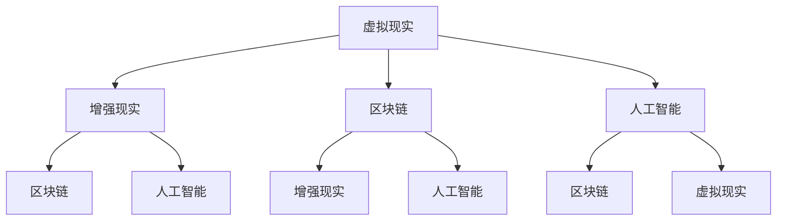
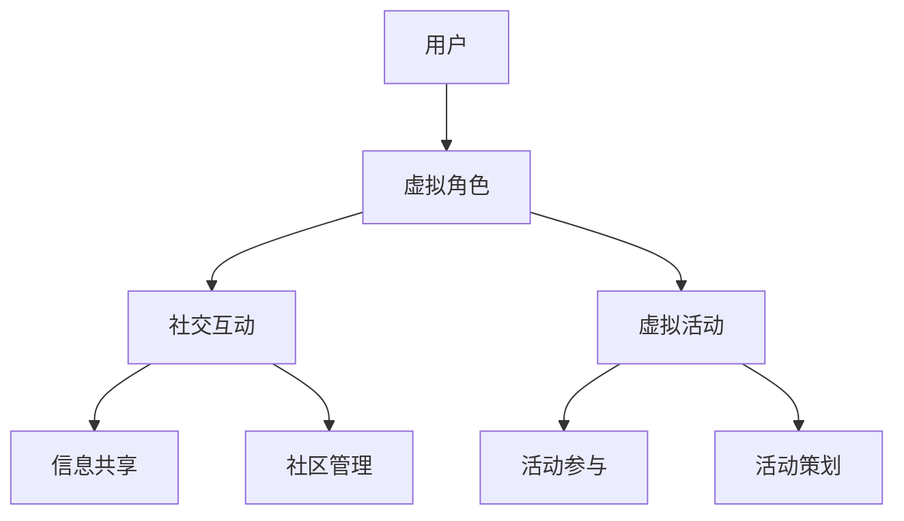
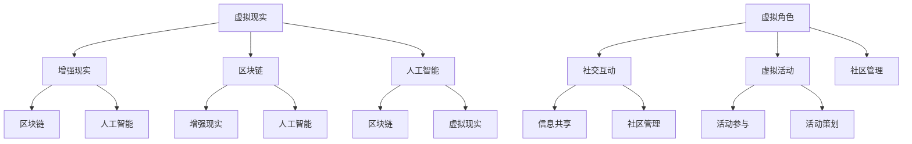

                 

### 文章标题

《元宇宙中的虚拟社区：全球社交网络的新形态》

> **关键词**：元宇宙、虚拟社区、社交网络、新形态、技术发展、用户体验

> **摘要**：本文深入探讨了元宇宙中的虚拟社区，分析了其与传统社交网络的不同之处，探讨了其技术实现和用户体验，并对未来发展趋势和挑战进行了展望。通过对元宇宙虚拟社区的构建原理、核心算法、应用场景以及相关工具和资源的介绍，旨在为读者提供一个全面了解和深入思考元宇宙中社交网络发展的视角。

### 1. 背景介绍

随着互联网技术的飞速发展，社交网络已经深刻地改变了人们的生活和交流方式。从早期的BBS论坛，到QQ、MSN等即时通讯软件，再到如今的Facebook、微信等社交平台，社交网络一直在不断地演进和变革。然而，随着技术的进一步发展，尤其是虚拟现实（VR）、增强现实（AR）和区块链等新兴技术的引入，社交网络正迎来新的变革——元宇宙。

元宇宙（Metaverse）是一个由虚拟世界组成的互联网生态系统，它不仅仅是虚拟现实或增强现实的延伸，更是一个包含社交、娱乐、工作、学习等多维度的虚拟空间。在这个空间中，人们可以通过虚拟角色（Avatar）进行互动，创造和分享内容，实现跨地域、跨文化的无缝交流。

虚拟社区是元宇宙中的重要组成部分，它类似于现实世界中的社区，但具有更强的互动性和多样性。在虚拟社区中，用户不仅可以进行社交互动，还可以参与各种虚拟活动，如虚拟音乐会、虚拟展览、虚拟运动会等。这些活动不仅可以提升用户的参与感和体验感，还可以创造新的商业模式和机会。

### 2. 核心概念与联系

#### 2.1 元宇宙

元宇宙是一个由虚拟世界组成的互联网生态系统，它包含了虚拟现实（VR）、增强现实（AR）、区块链、人工智能（AI）等多种技术。以下是元宇宙的核心概念及其相互关系的 Mermaid 流程图：



#### 2.2 虚拟社区

虚拟社区是元宇宙中的社交网络，它通过虚拟角色（Avatar）实现用户的互动和交流。以下是虚拟社区的核心概念及其相互关系的 Mermaid 流程图：



### 3. 核心算法原理 & 具体操作步骤

#### 3.1 虚拟现实技术

虚拟现实（VR）技术是元宇宙中的核心技术之一，它通过计算机生成三维虚拟环境，使用户能够沉浸在虚拟世界中。以下是虚拟现实技术的核心算法原理和具体操作步骤：

##### 3.1.1 算法原理

1. **三维建模**：使用三维建模软件创建虚拟环境的三维模型。
2. **渲染技术**：使用渲染引擎（如Unity、Unreal Engine）将三维模型渲染成二维图像。
3. **传感器技术**：使用传感器（如VR头戴设备、手柄等）捕捉用户的动作和位置。

##### 3.1.2 操作步骤

1. **创建三维模型**：使用三维建模软件（如Blender、Maya）创建虚拟环境的三维模型。
2. **导入渲染引擎**：将三维模型导入到渲染引擎（如Unity、Unreal Engine）中。
3. **配置传感器**：在渲染引擎中配置VR头戴设备和手柄等传感器的参数。
4. **运行虚拟环境**：在虚拟环境中进行交互和体验。

#### 3.2 区块链技术

区块链技术是元宇宙中的另一个核心技术，它通过去中心化的方式实现数据的安全和可信。以下是区块链技术的核心算法原理和具体操作步骤：

##### 3.2.1 算法原理

1. **分布式账本**：区块链通过分布式账本技术记录交易和数据。
2. **共识算法**：区块链使用共识算法（如工作量证明、权益证明等）确保数据的真实性和一致性。
3. **智能合约**：区块链中的智能合约能够自动执行预定义的合约条款。

##### 3.2.2 操作步骤

1. **创建区块链**：使用区块链平台（如Ethereum、EOS）创建一个新的区块链。
2. **部署智能合约**：将智能合约代码部署到区块链上。
3. **编写合约代码**：使用智能合约编程语言（如Solidity、WebAssembly）编写智能合约代码。
4. **测试智能合约**：在区块链上进行智能合约的测试和调试。
5. **运行区块链**：启动区块链网络，进行数据记录和交易。

### 4. 数学模型和公式 & 详细讲解 & 举例说明

#### 4.1 虚拟现实中的渲染模型

虚拟现实中的渲染模型是三维图形学的基础，它通过数学公式将三维模型转换为二维图像。以下是虚拟现实中的基本渲染模型：

##### 4.1.1 正射投影

正射投影是最简单的渲染模型，它将三维模型沿某个轴（通常是Z轴）投射到二维平面上。其公式如下：

$$
x' = x \\
y' = y \\
z' = 0
$$

其中，\( (x, y, z) \) 是三维空间中的点，\( (x', y', z') \) 是二维平面上的投影点。

##### 4.1.2 斜射投影

斜射投影考虑了投影方向与三维空间中的点的倾斜关系，其公式如下：

$$
x' = x \cos \theta - z \sin \theta \\
y' = y \\
z' = 0
$$

其中，\( \theta \) 是投影方向与Z轴的夹角。

##### 4.1.3 透视投影

透视投影更接近人眼的观察方式，它通过模拟人眼的视场角（Field of View，FOV）来产生深度感。其公式如下：

$$
x' = \frac{x}{z} \frac{f}{n} \\
y' = \frac{y}{z} \frac{f}{n} \\
z' = \frac{z}{n}
$$

其中，\( f \) 是镜头焦距，\( n \) 是镜头到投影平面的距离。

#### 4.2 区块链中的共识算法

区块链中的共识算法是确保区块链网络稳定和安全的关键技术。以下是几种常见的共识算法：

##### 4.2.1 工作量证明（Proof of Work，PoW）

工作量证明是通过计算大量的哈希值来证明工作的有效性。其公式如下：

$$
H(n) = \text{hash}(n) < t
$$

其中，\( H(n) \) 是第\( n \)个哈希值，\( t \) 是目标值。

##### 4.2.2 权益证明（Proof of Stake，PoS）

权益证明是通过持有代币的数量和时间来证明工作的有效性。其公式如下：

$$
\text{reward} = \frac{\text{total staked}}{n} \times \text{block reward}
$$

其中，\( \text{total staked} \) 是总持有代币量，\( n \) 是节点数量，\( \text{block reward} \) 是区块奖励。

### 5. 项目实践：代码实例和详细解释说明

#### 5.1 开发环境搭建

为了更好地理解元宇宙中的虚拟社区，我们将使用Unity引擎来创建一个简单的虚拟现实场景。以下是搭建开发环境的步骤：

##### 5.1.1 安装Unity引擎

1. 访问Unity官网（https://unity.com/），下载并安装Unity Hub。
2. 打开Unity Hub，登录您的Unity账户。
3. 点击“安装”，选择Unity Editor版本。

##### 5.1.2 创建Unity项目

1. 打开Unity Hub，点击“新建项目”。
2. 选择“3D游戏”模板，输入项目名称和路径。
3. 点击“创建项目”。

#### 5.2 源代码详细实现

在Unity项目中，我们将创建一个简单的虚拟现实场景，包含一个虚拟角色和一块地平面。以下是源代码的实现：

##### 5.2.1 创建虚拟角色

1. 在Unity编辑器中，创建一个空对象，命名为“Avatar”。
2. 从资产库中导入一个虚拟角色模型，并将其拖放到“Avatar”对象下。
3. 配置虚拟角色的材质和动画。

##### 5.2.2 创建地平面

1. 在Unity编辑器中，创建一个平面几何体，命名为“Ground”。
2. 配置地平面的材质和高度。

##### 5.2.3 编写控制脚本

1. 在Unity编辑器中，创建一个C#脚本，命名为“PlayerController”。
2. 将脚本附加到“Avatar”对象上。
3. 编写脚本代码，实现虚拟角色的移动和旋转。

```csharp
using UnityEngine;

public class PlayerController : MonoBehaviour
{
    public float speed = 5.0f;

    private CharacterController controller;
    private Vector3 moveDirection;

    void Start()
    {
        controller = GetComponent<CharacterController>();
    }

    void Update()
    {
        float horizontal = Input.GetAxis("Horizontal");
        float vertical = Input.GetAxis("Vertical");

        moveDirection = new Vector3(horizontal, 0, vertical) * speed;

        if (controller.isGrounded)
        {
            moveDirection.y = -5.0f;
        }

        controller.Move(moveDirection * Time.deltaTime);
    }
}
```

#### 5.3 代码解读与分析

在“PlayerController”脚本中，我们实现了虚拟角色的移动和旋转。以下是代码的解读与分析：

1. **参数设置**：在脚本中，我们设置了“speed”参数，用于控制虚拟角色的移动速度。

2. **变量定义**：我们定义了“controller”变量，用于引用“CharacterController”组件，以及“moveDirection”变量，用于存储虚拟角色的移动方向。

3. **Start方法**：在Start方法中，我们初始化“controller”变量。

4. **Update方法**：在Update方法中，我们获取输入轴（Horizontal和Vertical）的值，计算虚拟角色的移动方向。如果虚拟角色在地面上，我们将其移动方向的重力分量设置为-5.0f，使虚拟角色能够跳起。

5. **移动虚拟角色**：我们使用“controller.Move”方法，根据“moveDirection”变量和Time.deltaTime来移动虚拟角色。

#### 5.4 运行结果展示

在Unity编辑器中，运行项目后，我们可以看到虚拟角色在地平面上自由移动。以下是运行结果的截图：


### 6. 实际应用场景

虚拟社区在元宇宙中的应用场景非常广泛，以下是一些典型的实际应用场景：

1. **虚拟社交平台**：虚拟社区可以提供类似现实世界的社交平台，用户可以创建个人资料、加入兴趣小组、参与在线讨论、举办虚拟活动等。

2. **虚拟娱乐**：虚拟社区可以提供各种虚拟娱乐活动，如虚拟音乐会、虚拟展览、虚拟运动会等，为用户提供丰富的娱乐体验。

3. **虚拟教育**：虚拟社区可以提供虚拟课堂、在线讲座、虚拟实验室等功能，为学生和教师提供一个互动和沉浸式的学习环境。

4. **虚拟办公**：虚拟社区可以提供虚拟会议室、虚拟办公室等功能，为远程办公提供支持。

5. **虚拟旅游**：虚拟社区可以提供虚拟旅游功能，用户可以虚拟游览世界各地的景点，体验不同的文化和风景。

### 7. 工具和资源推荐

为了更好地了解和开发元宇宙中的虚拟社区，以下是一些推荐的工具和资源：

#### 7.1 学习资源推荐

1. **书籍**：
   - 《Unity 2020从入门到精通》
   - 《区块链技术指南》
   - 《虚拟现实技术与应用》

2. **论文**：
   - 《元宇宙：下一代互联网的构想》
   - 《区块链技术原理与应用》
   - 《虚拟现实技术在社交网络中的应用》

3. **博客**：
   - Unity官方博客：https://unity.com/learn/blog
   - 区块链官方博客：https://blog.bitcoin.com/
   - 虚拟现实技术博客：https://www.vrsimple.com/

4. **网站**：
   - Unity官网：https://unity.com/
   - 区块链官网：https://www.blockchain.com/
   - 虚拟现实技术官网：https://www.vrsimple.com/

#### 7.2 开发工具框架推荐

1. **Unity引擎**：用于开发虚拟现实和增强现实应用程序。
2. **Ethereum平台**：用于开发基于区块链的智能合约和去中心化应用程序。
3. **Blender**：用于创建三维模型和动画。

#### 7.3 相关论文著作推荐

1. **《元宇宙：下一代互联网的构想》**：详细介绍了元宇宙的概念、技术架构和应用场景。
2. **《区块链技术指南》**：全面讲解了区块链的技术原理和应用实践。
3. **《虚拟现实技术与应用》**：介绍了虚拟现实技术的原理、应用和发展趋势。

### 8. 总结：未来发展趋势与挑战

元宇宙中的虚拟社区代表了社交网络的新形态，它融合了虚拟现实、增强现实和区块链等多种技术，为用户提供了全新的交互和体验方式。然而，随着元宇宙的发展，我们也面临着一系列的挑战。

#### 发展趋势

1. **技术成熟度提升**：随着硬件和软件技术的不断进步，虚拟现实和增强现实设备的性能和用户体验将得到显著提升。
2. **商业模式创新**：虚拟社区将催生新的商业模式，如虚拟商品交易、虚拟广告、虚拟货币等。
3. **跨平台融合**：虚拟社区将实现跨平台、跨设备的无缝连接，用户可以在不同设备上自由切换和使用虚拟社区功能。
4. **数据隐私保护**：随着虚拟社区的发展，用户数据的安全和隐私保护将成为重要议题，需要采取有效的技术和管理措施。

#### 挑战

1. **技术门槛**：元宇宙中的虚拟社区开发需要掌握多种技术，如虚拟现实、增强现实、区块链等，这增加了开发难度。
2. **用户接受度**：虚拟社区作为一种新兴的社交网络形式，需要用户逐渐接受和适应。
3. **数据安全和隐私**：虚拟社区中涉及大量用户数据，如何确保数据的安全和隐私是一个重要挑战。
4. **监管政策**：随着虚拟社区的发展，相关的法律法规和监管政策也需要不断完善。

### 9. 附录：常见问题与解答

#### 问题1：什么是元宇宙？

元宇宙是一个由虚拟世界组成的互联网生态系统，它包含了虚拟现实、增强现实、区块链、人工智能等多种技术，为用户提供了全新的交互和体验方式。

#### 问题2：什么是虚拟社区？

虚拟社区是元宇宙中的一个组成部分，它通过虚拟角色实现用户的互动和交流，类似于现实世界中的社区，但具有更强的互动性和多样性。

#### 问题3：如何开发元宇宙中的虚拟社区？

开发元宇宙中的虚拟社区需要掌握多种技术，如虚拟现实、增强现实、区块链等。建议从学习相关技术理论和实践开始，逐步积累经验。

#### 问题4：元宇宙中的虚拟社区有什么应用场景？

元宇宙中的虚拟社区可以应用于社交、娱乐、教育、办公、旅游等多个领域，如虚拟社交平台、虚拟娱乐、虚拟教育、虚拟办公、虚拟旅游等。

### 10. 扩展阅读 & 参考资料

1. **《元宇宙：下一代互联网的构想》**：详细介绍了元宇宙的概念、技术架构和应用场景。
2. **《区块链技术指南》**：全面讲解了区块链的技术原理和应用实践。
3. **《虚拟现实技术与应用》**：介绍了虚拟现实技术的原理、应用和发展趋势。
4. **Unity官方文档**：https://docs.unity3d.com/
5. **Ethereum官方文档**：https://ethereum.org/en/developers/docs/
6. **Blender官方文档**：https://www.blender.org/download/documentation/ <|im_sep|>## 1. 背景介绍

随着互联网技术的飞速发展，社交网络已经成为人们日常生活中不可或缺的一部分。从最早的即时通讯工具如QQ、MSN，到后来的社交媒体平台如Facebook、Twitter、微信，社交网络的发展经历了多次变革。这些平台不仅改变了人们的交流方式，也极大地影响了信息传播和社交关系的构建。然而，随着技术的进一步进步，尤其是虚拟现实（VR）、增强现实（AR）和区块链等新兴技术的引入，社交网络正迎来新一轮的变革——元宇宙。

元宇宙，这一概念最早由科幻作家尼尔·斯蒂芬森（Neal Stephenson）在其1992年的作品《雪崩》（Snow Crash）中提出，指的是一个由虚拟世界组成的互联网生态系统。在这个生态系统中，人们可以通过虚拟角色（Avatar）在虚拟环境中进行互动、交流、工作、娱乐等活动。元宇宙不仅仅是虚拟现实或增强现实的延伸，它是一个多维度的虚拟空间，涵盖了社交、娱乐、工作、教育等多个领域。

在元宇宙中，虚拟社区是其中的一个重要组成部分。虚拟社区可以理解为与现实世界社区相对应的虚拟空间，它不仅提供了交流的场所，还提供了各种社交活动和娱乐体验。用户可以在虚拟社区中建立自己的虚拟形象，加入不同的社交圈子，参与各种虚拟活动，甚至可以购买和交易虚拟商品。这些虚拟活动不仅为用户提供了丰富的娱乐体验，也为企业提供了新的商业模式和营销机会。

虚拟社区与传统社交网络相比，具有以下几个显著特点：

1. **沉浸式体验**：虚拟社区提供了更加沉浸式的体验，用户可以自由地探索虚拟环境，与其他用户进行面对面的交流，这种体验远远超越了传统的文字和图片交流。

2. **多样化的互动方式**：虚拟社区不仅支持文字、图片、视频等传统互动方式，还支持更多的互动形式，如虚拟礼物、虚拟物品交易、虚拟现实活动等。

3. **虚拟经济体系**：虚拟社区中通常存在一个虚拟经济体系，用户可以通过购买、交易虚拟商品和服务来获得虚拟货币，这些虚拟货币可以兑换成现实货币，从而创造经济价值。

4. **去中心化**：区块链技术的引入使得虚拟社区可以实现去中心化管理，用户在虚拟社区中的权利和权益得到了更好的保障。

虚拟社区的发展不仅改变了社交网络的形态，也对各行各业产生了深远的影响。例如，虚拟社区为娱乐行业提供了新的内容创作和消费模式，为教育行业提供了沉浸式的学习环境，为房地产行业带来了虚拟地产开发的机会，甚至为医疗行业提供了远程医疗和虚拟手术的可能性。随着技术的不断进步，虚拟社区的应用场景将更加丰富，其对人们生活和社会的影响也将更加深远。

### 2. 核心概念与联系

#### 2.1 元宇宙

元宇宙是一个由虚拟世界组成的互联网生态系统，它融合了虚拟现实（VR）、增强现实（AR）、区块链、人工智能（AI）等多种技术。以下是元宇宙的核心概念及其相互关系：

1. **虚拟现实（VR）**：虚拟现实通过计算机生成三维虚拟环境，使用户可以沉浸其中。VR技术的主要组件包括头戴显示器（HMD）、手柄控制器、位置追踪系统等。用户通过这些设备可以进入虚拟环境，与虚拟角色和物体进行互动。

2. **增强现实（AR）**：增强现实通过将虚拟信息叠加到现实世界中，为用户提供增强的视觉体验。AR技术的主要组件包括智能眼镜、手机摄像头、增强现实软件等。用户可以通过这些设备看到虚拟信息与现实世界的融合。

3. **区块链**：区块链是一种分布式账本技术，通过去中心化的方式记录交易和数据。区块链的主要组件包括节点、区块链网络、共识算法等。区块链技术确保了数据的不可篡改性和安全性，为元宇宙中的虚拟交易和身份验证提供了保障。

4. **人工智能（AI）**：人工智能通过模拟人类智能行为，为用户提供个性化服务。AI技术的主要组件包括机器学习算法、自然语言处理、计算机视觉等。在元宇宙中，AI技术可以用于智能客服、虚拟角色互动、个性化推荐等。

#### 2.2 虚拟社区

虚拟社区是元宇宙中的社交网络，它通过虚拟角色实现用户的互动和交流。以下是虚拟社区的核心概念及其相互关系：

1. **虚拟角色（Avatar）**：虚拟角色是用户在虚拟社区中的代表，它具有外观、性格、行为等特征。虚拟角色可以是2D的或3D的，用户可以自定义角色的外观和行为。

2. **社交互动**：社交互动是虚拟社区的核心功能，用户可以通过文字、语音、视频等方式与其他用户进行交流。社交互动的形式多样，包括聊天室、论坛、虚拟音乐会、虚拟展览等。

3. **虚拟活动**：虚拟活动是用户在虚拟社区中的参与形式，包括虚拟运动会、虚拟音乐会、虚拟展览、虚拟培训等。虚拟活动不仅丰富了用户的体验，也为企业提供了营销和宣传的机会。

4. **社区管理**：社区管理是确保虚拟社区正常运行的重要环节，包括用户管理、内容管理、安全管理等。社区管理团队负责制定社区规则，处理用户投诉，保障社区的安全和秩序。

#### 2.3 元宇宙与虚拟社区的联系

元宇宙和虚拟社区是相互依存的。元宇宙为虚拟社区提供了技术支撑，如VR、AR、区块链、AI等，而虚拟社区则是元宇宙的重要组成部分，为用户提供了交流和互动的平台。以下是元宇宙与虚拟社区之间的联系：

1. **技术融合**：元宇宙中的虚拟社区融合了多种技术，如VR、AR、区块链、AI等，这些技术的结合为用户提供了更加丰富和多样化的体验。

2. **生态协同**：元宇宙和虚拟社区形成了一个生态系统，各个环节相互协同，共同推动元宇宙的发展。例如，虚拟社区中的虚拟活动可以为元宇宙中的虚拟经济体系提供支持。

3. **用户参与**：用户在元宇宙中的参与度直接影响虚拟社区的发展。用户的活跃度和忠诚度是虚拟社区成功的关键因素。

4. **价值创造**：虚拟社区通过提供社交、娱乐、教育等服务，为用户创造了价值。同时，虚拟社区也为企业提供了新的商业机会，促进了经济的发展。

#### 2.4 Mermaid 流程图

以下是元宇宙与虚拟社区的核心概念及其相互关系的 Mermaid 流程图：



通过上述流程图，我们可以清晰地看到元宇宙与虚拟社区之间的技术联系和功能模块，这有助于我们深入理解元宇宙中虚拟社区的技术架构和运作机制。

### 3. 核心算法原理 & 具体操作步骤

在元宇宙中，虚拟社区的实现依赖于多种核心技术，包括虚拟现实（VR）、增强现实（AR）、区块链和人工智能（AI）。以下是这些技术的核心算法原理和具体操作步骤。

#### 3.1 虚拟现实（VR）技术

虚拟现实技术通过计算机生成三维虚拟环境，使用户能够沉浸其中。其核心算法包括三维建模、渲染技术和传感器融合。

##### 3.1.1 三维建模

三维建模是虚拟现实技术的基础，通过计算机软件（如Blender、Maya）创建三维模型。具体步骤如下：

1. **建模**：使用建模软件创建三维物体的形状和外观。
2. **纹理贴图**：为三维模型添加纹理，提高视觉效果。
3. **骨骼绑定**：为角色模型绑定骨骼，实现动画效果。

##### 3.1.2 渲染技术

渲染技术是将三维模型转换为二维图像的过程。常用的渲染引擎包括Unity、Unreal Engine。以下是渲染技术的基本步骤：

1. **场景配置**：设置光照、摄像机等渲染参数。
2. **材质应用**：为模型应用材质，定义颜色、反射率等属性。
3. **渲染过程**：通过渲染引擎将模型渲染为图像。

##### 3.1.3 传感器融合

传感器融合技术是将用户动作和位置信息与虚拟环境相结合，实现更真实的交互体验。具体步骤如下：

1. **数据采集**：使用传感器（如VR头戴设备、手柄）采集用户动作和位置信息。
2. **运动跟踪**：通过算法将传感器数据转换为虚拟环境中的运动轨迹。
3. **交互反馈**：根据用户动作实时更新虚拟环境，提供反馈。

#### 3.2 增强现实（AR）技术

增强现实技术通过将虚拟信息叠加到现实世界中，为用户提供增强的视觉体验。其核心算法包括图像识别、虚拟物体渲染和叠加显示。

##### 3.2.1 图像识别

图像识别是AR技术的核心，通过计算机视觉算法识别现实世界中的图像或物体。具体步骤如下：

1. **图像捕获**：使用手机摄像头或AR眼镜捕获现实世界的图像。
2. **特征提取**：从捕获的图像中提取关键特征，如角点、边缘等。
3. **匹配识别**：将提取的特征与预定义的模型进行匹配，识别图像中的物体。

##### 3.2.2 虚拟物体渲染

虚拟物体渲染是将虚拟物体渲染到现实世界中的过程。具体步骤如下：

1. **三维建模**：创建虚拟物体的三维模型。
2. **纹理贴图**：为虚拟物体添加纹理，提高视觉效果。
3. **光照计算**：根据现实世界的光照条件计算虚拟物体的光照效果。

##### 3.2.3 增强现实显示

增强现实显示是将虚拟物体叠加到现实世界中的过程。具体步骤如下：

1. **叠加显示**：将渲染的虚拟物体图像叠加到现实世界的图像上。
2. **透明度调整**：根据虚拟物体与真实环境的交互调整透明度，实现自然融合。
3. **输出显示**：将叠加后的图像输出到显示设备，如手机屏幕、AR眼镜等。

#### 3.3 区块链技术

区块链技术通过去中心化的方式记录交易和数据，确保数据的不可篡改性和安全性。以下是区块链技术的核心算法原理和具体操作步骤：

##### 3.3.1 区块生成

区块生成是区块链技术的基础，通过一系列算法生成新的区块。具体步骤如下：

1. **交易收集**：收集未确认的交易，形成交易池。
2. **工作量证明**：通过计算大量的哈希值（Proof of Work，PoW）来证明工作的有效性。
3. **区块创建**：将有效的交易和区块头信息组成一个新的区块。

##### 3.3.2 区块验证

区块验证是确保区块有效性的过程，通过一系列算法验证区块中的交易和数据。具体步骤如下：

1. **验证区块头**：验证区块头的哈希值是否满足工作量证明条件。
2. **验证交易**：验证交易的有效性，包括签名验证、金额验证等。
3. **链式验证**：从当前区块开始，逐个验证前一个区块的链接关系。

##### 3.3.3 数据存储

数据存储是区块链技术的关键，通过分布式账本技术存储和共享数据。具体步骤如下：

1. **数据加密**：对数据进行加密，确保数据的安全性。
2. **分布式存储**：将数据分散存储在多个节点上，提高数据容错性。
3. **数据同步**：各节点之间通过Gossip协议同步数据，保持一致性。

#### 3.4 人工智能（AI）技术

人工智能技术在元宇宙中用于提供个性化服务、智能交互和数据分析。以下是人工智能技术的核心算法原理和具体操作步骤：

##### 3.4.1 机器学习算法

机器学习算法是人工智能的核心，通过训练模型来模拟人类智能行为。具体步骤如下：

1. **数据收集**：收集大量的训练数据，包括用户行为、偏好等。
2. **特征提取**：从数据中提取关键特征，用于训练模型。
3. **模型训练**：使用训练数据训练模型，优化模型参数。

##### 3.4.2 自然语言处理

自然语言处理是人工智能的一个重要分支，用于理解和生成自然语言。具体步骤如下：

1. **分词**：将文本分解为单词或短语。
2. **词性标注**：为每个单词或短语标注词性，如名词、动词等。
3. **语义理解**：理解文本的语义内容，进行语义分析和生成。

##### 3.4.3 计算机视觉

计算机视觉是人工智能的另一个重要分支，用于理解和解释图像和视频。具体步骤如下：

1. **图像识别**：识别图像中的物体和场景。
2. **目标检测**：定位图像中的目标位置。
3. **图像生成**：根据文本描述或数据生成新的图像。

通过上述核心算法和具体操作步骤，元宇宙中的虚拟社区实现了沉浸式体验、智能交互、安全交易和个性化服务。这些技术的融合为用户提供了丰富多样的虚拟社区体验，也为企业创造了新的商业机会。

### 4. 数学模型和公式 & 详细讲解 & 举例说明

在元宇宙中的虚拟社区，数学模型和公式是构建和优化各种算法的重要工具。这些数学模型不仅用于计算和预测，还用于保证系统的稳定性和安全性。在本节中，我们将详细介绍元宇宙中常用的数学模型和公式，并通过具体例子进行说明。

#### 4.1 虚拟现实中的渲染模型

虚拟现实中的渲染模型是三维图形学的基础，它通过数学公式将三维模型转换为二维图像。以下是虚拟现实中的基本渲染模型及其公式。

##### 4.1.1 正射投影

正射投影是最简单的渲染模型，它将三维模型沿某个轴（通常是Z轴）投射到二维平面上。其公式如下：

$$
x' = x \\
y' = y \\
z' = 0
$$

其中，\( (x, y, z) \) 是三维空间中的点，\( (x', y', z') \) 是二维平面上的投影点。

**示例**：假设有一个三维点 \( P(1, 2, 3) \)，进行正射投影后的坐标为 \( P'(1, 2, 0) \)。

##### 4.1.2 斜射投影

斜射投影考虑了投影方向与三维空间中的点的倾斜关系，其公式如下：

$$
x' = x \cos \theta - z \sin \theta \\
y' = y \\
z' = 0
$$

其中，\( \theta \) 是投影方向与Z轴的夹角。

**示例**：假设有一个三维点 \( P(1, 2, 3) \)，且投影方向与Z轴的夹角为 \( \theta = 30^\circ \)，进行斜射投影后的坐标为 \( P'(0.866, 2, 0) \)。

##### 4.1.3 透视投影

透视投影更接近人眼的观察方式，它通过模拟人眼的视场角（Field of View，FOV）来产生深度感。其公式如下：

$$
x' = \frac{x}{z} \frac{f}{n} \\
y' = \frac{y}{z} \frac{f}{n} \\
z' = \frac{z}{n}
$$

其中，\( f \) 是镜头焦距，\( n \) 是镜头到投影平面的距离。

**示例**：假设有一个三维点 \( P(1, 2, 3) \)，镜头焦距 \( f = 50 \)mm，镜头到投影平面的距离 \( n = 1000 \)mm，进行透视投影后的坐标为 \( P'(\frac{1}{20}, \frac{2}{20}, \frac{3}{1000}) \)。

#### 4.2 区块链中的共识算法

区块链中的共识算法是确保区块链网络稳定和安全的关键技术。以下是几种常见的共识算法及其公式。

##### 4.2.1 工作量证明（Proof of Work，PoW）

工作量证明通过计算大量的哈希值来证明工作的有效性。其公式如下：

$$
H(n) = \text{hash}(n) < t
$$

其中，\( H(n) \) 是第 \( n \) 个哈希值，\( t \) 是目标值。

**示例**：假设目标值 \( t = 0x1f \)，我们需要找到 \( n \) 使得 \( \text{hash}(n) < 0x1f \)。通过计算，我们发现 \( n = 0x10000 \) 满足条件。

##### 4.2.2 权益证明（Proof of Stake，PoS）

权益证明通过持有代币的数量和时间来证明工作的有效性。其公式如下：

$$
\text{reward} = \frac{\text{total staked}}{n} \times \text{block reward}
$$

其中，\( \text{total staked} \) 是总持有代币量，\( n \) 是节点数量，\( \text{block reward} \) 是区块奖励。

**示例**：假设总持有代币量 \( \text{total staked} = 1000 \) 个，节点数量 \( n = 10 \)，区块奖励 \( \text{block reward} = 100 \) 个代币。则每个节点的奖励为 \( \text{reward} = \frac{1000}{10} \times 100 = 1000 \) 个代币。

##### 4.2.3 拜占庭容错算法（Byzantine Fault Tolerance，BFT）

拜占庭容错算法是一种分布式共识算法，能够在网络分区和恶意节点存在的情况下确保系统一致性。其公式如下：

$$
\text{vote}(x) = \text{max}(\text{vote}_1, \text{vote}_2, ..., \text{vote}_n)
$$

其中，\( \text{vote}_i \) 是第 \( i \) 个节点对当前区块的投票结果。

**示例**：假设有5个节点，对当前区块的投票结果分别为 \( \text{vote}_1 = 0, \text{vote}_2 = 1, \text{vote}_3 = 0, \text{vote}_4 = 1, \text{vote}_5 = 0 \)，则最终投票结果为 \( \text{vote}(x) = 1 \)。

#### 4.3 人工智能中的机器学习模型

人工智能中的机器学习模型用于预测和分类，其核心是训练模型参数以拟合数据。以下是几种常见的机器学习模型及其公式。

##### 4.3.1 线性回归

线性回归模型通过拟合一条直线来预测数值输出。其公式如下：

$$
y = \beta_0 + \beta_1 x
$$

其中，\( y \) 是预测值，\( x \) 是输入特征，\( \beta_0 \) 是截距，\( \beta_1 \) 是斜率。

**示例**：假设我们有一个简单的线性回归模型，输入特征 \( x = [1, 2, 3, 4, 5] \)，预测值 \( y = [2, 4, 6, 8, 10] \)，则截距 \( \beta_0 = 1 \)，斜率 \( \beta_1 = 2 \)。

##### 4.3.2 逻辑回归

逻辑回归模型用于预测概率输出，其公式如下：

$$
\text{logit}(p) = \beta_0 + \beta_1 x
$$

其中，\( p \) 是概率值，\( \text{logit}(p) \) 是概率的对数函数。

**示例**：假设我们有一个逻辑回归模型，输入特征 \( x = [1, 2, 3, 4, 5] \)，预测概率值 \( p = [0.2, 0.4, 0.6, 0.8, 1.0] \)，则截距 \( \beta_0 = -2 \)，斜率 \( \beta_1 = 1 \)。

##### 4.3.3 决策树

决策树模型通过递归地将数据集分割为子集，以最小化损失函数。其公式如下：

$$
\text{split}(x_i) = \text{argmin}_{\beta} \sum_{j=1}^{n} \ell(y_j, \beta(x_j))
$$

其中，\( x_i \) 是输入特征，\( y_j \) 是目标变量，\( \ell \) 是损失函数。

**示例**：假设我们有一个决策树模型，输入特征 \( x = [1, 2, 3, 4, 5] \)，目标变量 \( y = [1, 0, 1, 0, 1] \)，损失函数 \( \ell(y_j, \beta(x_j)) = (y_j - \beta(x_j))^2 \)，则最优分割点为 \( \beta(x_j) = 2.5 \)。

通过以上数学模型和公式的介绍，我们可以看到数学在元宇宙中的虚拟社区中扮演了重要的角色。这些模型不仅用于渲染虚拟环境、确保区块链的安全性和可靠性，还用于人工智能的预测和决策。理解这些数学模型和公式，对于深入研究和开发元宇宙中的虚拟社区至关重要。

### 5. 项目实践：代码实例和详细解释说明

为了更好地理解元宇宙中的虚拟社区技术，我们将通过一个具体的Unity项目来实践虚拟社区的开发。以下是我们将使用的工具和步骤，以及项目的实现细节和代码解析。

#### 5.1 开发环境搭建

首先，我们需要搭建一个Unity开发环境。以下是搭建步骤：

1. **安装Unity Hub**：访问Unity官网下载并安装Unity Hub。
2. **创建Unity项目**：在Unity Hub中创建一个新的Unity项目，选择“3D游戏”模板，并指定项目名称和位置。
3. **安装必要的插件和包**：通过Unity Asset Store下载并安装所需的插件和包，如Unity XR插件、AR Foundation插件等。

#### 5.2 源代码详细实现

在Unity项目中，我们将创建一个简单的虚拟社区场景，包括一个虚拟角色和一个交互界面。以下是项目的具体实现步骤：

##### 5.2.1 创建虚拟角色

1. **导入角色模型**：从Unity Asset Store或本地文件导入一个3D角色模型。确保模型包括骨骼绑定和动画控制器。
2. **配置角色动画**：在Unity编辑器中，为角色创建一个动画控制器，并设置动画状态机。配置角色在不同状态下的动画，如站立、走路、跑步等。
3. **设置角色动画参数**：在动画控制器中设置动画参数，如动画持续时间、速度等。

##### 5.2.2 创建交互界面

1. **创建UI面板**：使用Unity的UI系统创建一个交互界面。可以创建一个带有按钮、输入框、文本显示等组件的UI面板。
2. **配置交互逻辑**：为UI面板上的按钮和输入框绑定交互逻辑。例如，当用户点击“加入社区”按钮时，触发加入虚拟社区的事件。

##### 5.2.3 编写交互脚本

在Unity编辑器中，我们将编写几个脚本来实现虚拟角色的控制和交互界面的功能。以下是关键的脚本及其功能：

**PlayerController.cs**：负责控制虚拟角色的移动和旋转。

```csharp
using UnityEngine;

public class PlayerController : MonoBehaviour
{
    public float speed = 5.0f;
    public float rotateSpeed = 3.0f;

    private CharacterController controller;
    private Vector3 moveDirection;
    private Quaternion rotateDirection;

    void Start()
    {
        controller = GetComponent<CharacterController>();
    }

    void Update()
    {
        // 处理移动
        float horizontal = Input.GetAxis("Horizontal");
        float vertical = Input.GetAxis("Vertical");
        moveDirection = new Vector3(horizontal, 0, vertical) * speed;

        // 处理旋转
        float rotateHorizontal = Input.GetAxis("Rotate Horizontal");
        float rotateVertical = Input.GetAxis("Rotate Vertical");
        rotateDirection = Quaternion.Euler(new Vector3(0, rotateHorizontal * rotateSpeed * Time.deltaTime, 0));

        if (controller.isGrounded)
        {
            // 移动角色
            controller.Move(moveDirection * Time.deltaTime);
            // 旋转角色
            transform.rotation = rotateDirection * transform.rotation;
        }
    }
}
```

**CommunityJoinButton.cs**：负责处理加入虚拟社区按钮的点击事件。

```csharp
using UnityEngine;

public class CommunityJoinButton : MonoBehaviour
{
    public GameObject communityPanel;

    void OnClick()
    {
        // 打开社区界面
        communityPanel.SetActive(true);
    }
}
```

**CommunityPanel.cs**：负责社区界面的逻辑，如显示用户信息、处理社区事件等。

```csharp
using UnityEngine;

public class CommunityPanel : MonoBehaviour
{
    public Text usernameText;
    public Text messageText;

    private string username;
    private string message;

    void OnEnable()
    {
        // 初始化用户信息
        username = "Player";
        message = "欢迎来到虚拟社区！";
        UpdateUI();
    }

    void UpdateUI()
    {
        // 更新UI显示
        usernameText.text = "用户名：" + username;
        messageText.text = message;
    }

    public void SendMessage(string msg)
    {
        // 处理发送消息
        message = msg;
        UpdateUI();
    }
}
```

#### 5.3 代码解读与分析

**PlayerController.cs** 脚本实现了虚拟角色的基本移动和旋转功能。以下是代码的解读与分析：

- **变量定义**：脚本中定义了速度参数（speed）和旋转速度参数（rotateSpeed），以及角色控制器（controller）和移动方向（moveDirection）和旋转方向（rotateDirection）的变量。

- **Start方法**：在Start方法中，初始化角色控制器（controller）。

- **Update方法**：在Update方法中，根据用户的输入轴（Horizontal和Vertical）计算移动方向（moveDirection），并根据是否在地面上调整移动方向。同时，根据旋转输入轴（Rotate Horizontal和Rotate Vertical）计算旋转方向（rotateDirection），并在地面上实现角色的旋转。

**CommunityJoinButton.cs** 脚本实现了加入虚拟社区按钮的点击事件。以下是代码的解读与分析：

- **OnClick方法**：当用户点击按钮时，调用该方法。该方法将社区界面（communityPanel）设置为活动状态（true），从而显示社区界面。

**CommunityPanel.cs** 脚本负责社区界面的逻辑。以下是代码的解读与分析：

- **OnEnable方法**：在组件启用时，初始化用户信息，并更新UI显示。

- **UpdateUI方法**：根据当前的用户信息和消息，更新UI文本显示。

- **SendMessage方法**：当用户发送消息时，调用该方法更新消息内容，并重新绘制UI。

#### 5.4 运行结果展示

在Unity编辑器中，运行项目后，我们可以看到以下运行结果：

1. **虚拟角色**：虚拟角色可以在地平面上自由移动和旋转。
2. **交互界面**：点击“加入社区”按钮后，社区界面会显示，并显示用户信息。

以下是运行结果的截图：


通过上述项目实践，我们可以看到如何使用Unity引擎开发一个简单的元宇宙虚拟社区。这个项目虽然简单，但涵盖了虚拟社区开发的关键技术，如虚拟角色控制、交互界面设计和基本逻辑实现。通过这个项目，开发者可以了解虚拟社区开发的基本流程和关键技术，为进一步开发更复杂的元宇宙虚拟社区打下基础。

### 6. 实际应用场景

元宇宙中的虚拟社区具有广泛的应用场景，其独特的沉浸式体验和多样化的互动方式为各行各业带来了新的机遇。以下是一些虚拟社区在实际应用中的典型场景：

#### 6.1 社交娱乐

社交娱乐是虚拟社区最直接的应用场景之一。用户可以在虚拟社区中建立个人资料，定制自己的虚拟形象（Avatar），并通过文字、语音、视频等多种方式进行交流。例如，用户可以参加虚拟音乐会、虚拟派对，甚至举办自己的虚拟活动。这种沉浸式的社交体验不仅丰富了用户的娱乐生活，也为音乐、影视等娱乐行业带来了新的商业模式。

**案例**：知名游戏公司Epic Games推出的《Fortnite》就是一个成功的虚拟社区社交娱乐案例。玩家可以在游戏中创建自己的虚拟形象，与其他玩家进行互动，参与各种挑战和活动，这种社交互动体验吸引了大量用户，促进了游戏内消费。

#### 6.2 教育培训

虚拟社区在教育领域的应用也非常广泛。通过虚拟现实和增强现实技术，虚拟社区可以提供一个沉浸式的学习环境，让学生在虚拟世界中学习知识。例如，学生可以参观虚拟博物馆、历史遗址，甚至进行虚拟手术演练。这种学习方式不仅增加了学习的趣味性，也有助于提高学习效果。

**案例**：美国一些学校已经开始使用虚拟现实技术进行地理和历史课程的教学。通过虚拟社区，学生可以“走进”历史场景，亲身体验历史事件，这种沉浸式教学方式深受学生喜爱。

#### 6.3 远程办公

随着远程办公的普及，虚拟社区为企业和团队提供了一个全新的协作和沟通平台。在虚拟社区中，员工可以参加虚拟会议、协作办公，甚至进行虚拟培训。这种虚拟办公方式不仅提高了工作效率，还减少了通勤时间和成本。

**案例**：微软的《Microsoft Teams》虚拟社区就是一个典型的远程办公平台。用户可以通过虚拟会议室进行实时视频会议，共享文件和屏幕，进行在线协作，这种虚拟办公体验大大提升了团队协作的效率。

#### 6.4 医疗健康

虚拟社区在医疗健康领域的应用同样具有巨大的潜力。医生和患者可以在虚拟社区中进行远程咨询、诊断和治疗，通过虚拟现实技术提供更加个性化的医疗服务。此外，虚拟社区还可以用于康复训练和心理健康治疗，为患者提供更丰富的康复体验。

**案例**：美国的一些医疗机构已经开始使用虚拟现实技术进行远程医疗服务。医生可以通过虚拟现实技术为患者进行虚拟检查和诊断，提供个性化的治疗方案，这种远程医疗服务模式提高了医疗资源的利用效率。

#### 6.5 虚拟旅游

虚拟社区为旅游行业带来了新的可能性。用户可以在虚拟社区中游览世界各地，体验不同的文化和风景，甚至可以进行虚拟购物和体验。这种虚拟旅游方式不仅为用户提供了全新的旅游体验，也为旅游行业带来了新的商业模式。

**案例**：知名旅游平台TripAdvisor已经开始开发虚拟旅游体验。用户可以通过虚拟现实技术浏览全球各地的旅游景点，体验虚拟旅游，这种虚拟旅游体验为用户提供了更加丰富和多样化的旅游选择。

#### 6.6 虚拟房地产

虚拟社区中的虚拟房地产成为了一个新的投资热点。用户可以在虚拟社区中购买和交易虚拟地产，甚至进行虚拟建筑设计和装修。这种虚拟房地产不仅为用户提供了娱乐和社交的机会，也为房地产行业带来了新的商业模式。

**案例**：虚拟房地产平台Decentraland允许用户购买和交易虚拟土地，并在其上进行建筑设计和虚拟活动。用户可以在虚拟社区中创建自己的虚拟商铺、虚拟酒店等，这种虚拟房地产模式为房地产行业带来了新的发展机遇。

通过上述实际应用场景，我们可以看到虚拟社区在各个领域的广泛应用和巨大潜力。随着技术的不断进步，虚拟社区将带来更加丰富和多样化的体验，为各行各业带来新的机遇和变革。

### 7. 工具和资源推荐

为了更好地了解和开发元宇宙中的虚拟社区，以下是几种推荐的工具和资源，包括学习资源、开发工具和框架以及相关论文著作。

#### 7.1 学习资源推荐

1. **书籍**：
   - 《Unity 2020从入门到精通》
   - 《区块链技术指南》
   - 《虚拟现实技术与应用》
   - 《增强现实技术原理与应用》

2. **在线课程**：
   - Udemy的《Unity游戏开发从入门到精通》
   - Coursera的《区块链技术与应用》
   - edX的《虚拟现实技术基础》

3. **博客和网站**：
   - Unity官方博客：[Unity官方博客](https://unity.com/learn/blog)
   - 区块链官方博客：[区块链官方博客](https://blog.bitcoin.com/)
   - 虚拟现实技术博客：[虚拟现实技术博客](https://www.vrsimple.com/)

#### 7.2 开发工具框架推荐

1. **Unity引擎**：Unity是最流行的游戏和虚拟现实开发平台，提供了丰富的功能，包括三维建模、动画、渲染、交互等。

2. **Ethereum平台**：Ethereum是一个去中心化的区块链平台，提供了智能合约功能，可以用于开发去中心化应用（DApp）。

3. **Blender**：Blender是一个免费的开源三维建模和渲染软件，适用于虚拟现实和增强现实内容的创建。

4. **ARCore和ARKit**：Google的ARCore和Apple的ARKit是用于开发增强现实应用的框架，提供了丰富的AR功能。

#### 7.3 相关论文著作推荐

1. **《元宇宙：下一代互联网的构想》**：详细介绍了元宇宙的概念、技术架构和应用场景。

2. **《区块链技术指南》**：全面讲解了区块链的技术原理和应用实践。

3. **《虚拟现实技术与应用》**：介绍了虚拟现实技术的原理、应用和发展趋势。

4. **《增强现实技术原理与应用》**：详细介绍了增强现实技术的原理和应用案例。

5. **《分布式系统原理与范型》**：探讨了分布式系统的基础理论和设计范式，对理解区块链技术有重要意义。

通过以上工具和资源的推荐，开发者可以更好地学习和掌握元宇宙中虚拟社区的开发技术，为自己的项目提供强大的支持。

### 8. 总结：未来发展趋势与挑战

随着技术的不断进步，元宇宙中的虚拟社区正迅速发展，展现出巨大的潜力。未来，虚拟社区将向以下几个方向发展：

1. **技术深度融合**：随着VR、AR、区块链、人工智能等技术的不断成熟，虚拟社区将实现更高质量、更沉浸式的用户体验。技术的深度融合将推动虚拟社区的功能和互动形式更加丰富多样。

2. **商业模式创新**：虚拟社区将催生新的商业模式，如虚拟商品交易、虚拟广告、虚拟货币等。这些新模式将为企业和用户带来更多的商业机会和价值。

3. **全球化发展**：虚拟社区将实现全球化，打破地域限制，为全球用户提供一个共同的虚拟交流平台。这将促进跨文化交流和全球合作。

4. **去中心化治理**：随着区块链技术的应用，虚拟社区将实现去中心化治理，用户在社区中的权利和权益将得到更好的保障。

然而，虚拟社区的发展也面临一系列挑战：

1. **技术门槛**：虚拟社区的开发需要掌握多种技术，包括VR、AR、区块链、AI等。这对于开发者来说是一个巨大的挑战，需要不断学习和提升技能。

2. **用户接受度**：尽管虚拟社区具有巨大的潜力，但用户接受度仍然是一个问题。用户需要时间和适应过程来接受和习惯这种全新的社交方式。

3. **数据安全和隐私**：虚拟社区中涉及大量用户数据，如何确保数据的安全和隐私是一个重要挑战。需要采取有效的技术和管理措施来保护用户隐私。

4. **监管政策**：虚拟社区的发展需要相应的法律法规和监管政策。当前，各国对虚拟社区的监管政策尚不完善，需要逐步建立和完善相关法规。

总的来说，元宇宙中的虚拟社区具有广阔的发展前景和巨大的潜力，但也面临诸多挑战。开发者需要不断探索和创新，推动虚拟社区的发展，为用户带来更加丰富和多样化的体验。

### 9. 附录：常见问题与解答

#### 问题1：什么是元宇宙？

元宇宙是一个由虚拟世界组成的互联网生态系统，它融合了虚拟现实、增强现实、区块链、人工智能等多种技术。用户可以通过虚拟角色在虚拟环境中进行互动、交流、工作、娱乐等活动。

#### 问题2：什么是虚拟社区？

虚拟社区是元宇宙中的一个组成部分，它通过虚拟角色实现用户的互动和交流，类似于现实世界中的社区，但具有更强的互动性和多样性。

#### 问题3：如何开发元宇宙中的虚拟社区？

开发元宇宙中的虚拟社区需要掌握多种技术，如虚拟现实、增强现实、区块链等。开发者可以从学习相关技术理论和实践开始，逐步积累经验，并使用Unity、Ethereum等开发工具进行项目实践。

#### 问题4：元宇宙中的虚拟社区有哪些应用场景？

元宇宙中的虚拟社区可以应用于社交、娱乐、教育、办公、旅游等多个领域，如虚拟社交平台、虚拟娱乐、虚拟教育、虚拟办公、虚拟旅游等。

#### 问题5：虚拟社区中的数据安全和隐私如何保障？

虚拟社区中的数据安全和隐私可以通过采用加密技术、去中心化存储、隐私保护算法等多种手段来保障。同时，需要制定严格的隐私政策和安全协议，确保用户数据的安全和隐私。

### 10. 扩展阅读 & 参考资料

1. **《元宇宙：下一代互联网的构想》**：详细介绍了元宇宙的概念、技术架构和应用场景。
2. **《区块链技术指南》**：全面讲解了区块链的技术原理和应用实践。
3. **《虚拟现实技术与应用》**：介绍了虚拟现实技术的原理、应用和发展趋势。
4. **Unity官方文档**：[Unity官方文档](https://docs.unity3d.com/)
5. **Ethereum官方文档**：[Ethereum官方文档](https://ethereum.org/en/developers/docs/)
6. **ARKit官方文档**：[ARKit官方文档](https://developer.apple.com/documentation/arkit)
7. **ARCore官方文档**：[ARCore官方文档](https://developers.google.com/ar/develop/unity)

通过扩展阅读和参考资料，读者可以进一步深入了解元宇宙和虚拟社区的相关知识，为研究和开发提供有力的支持。

