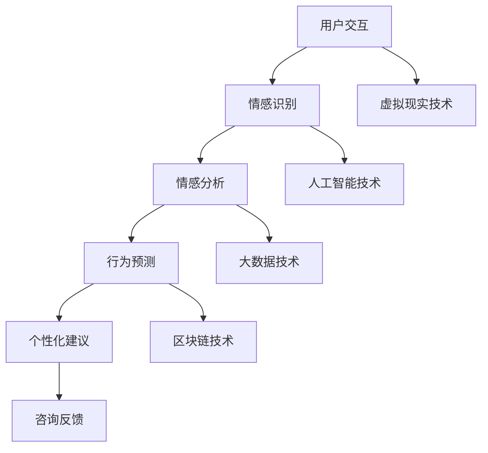

                 

# 元宇宙婚姻咨询：虚拟世界中的伴侣关系维护

> **关键词**：元宇宙、婚姻咨询、虚拟世界、伴侣关系、维护策略、心理学模型、技术实现、应用场景

> **摘要**：随着元宇宙的快速发展，虚拟世界中的婚姻咨询成为一个新兴领域。本文将探讨元宇宙婚姻咨询的核心概念、技术架构、算法原理及其实际应用场景，提供一种全新的伴侣关系维护方式。

## 1. 背景介绍

近年来，虚拟现实（VR）和增强现实（AR）技术的飞速发展，为元宇宙的诞生奠定了基础。元宇宙是一个虚拟的、模拟的、三维的空间，用户可以在其中进行社交、娱乐、工作等多种活动。元宇宙不仅提供了丰富的交互体验，还创造了一个全新的社会环境，这使得婚姻咨询在虚拟世界中成为可能。

婚姻咨询的传统方式主要依赖于面对面的交流和专业的心理咨询师。然而，这种方式在元宇宙中面临诸多挑战。首先，虚拟世界中的用户分布广泛，面对面交流的成本和难度增加。其次，心理咨询师在元宇宙中的角色需要重新定义，他们需要适应虚拟环境中的交流方式。此外，元宇宙中的伴侣关系具有独特的特点，如虚拟身份的多样性、情感表达的复杂性等，这都对婚姻咨询提出了新的要求。

因此，元宇宙婚姻咨询的出现，不仅为婚姻问题提供了一种新的解决途径，也为心理学和计算机科学的研究提供了新的方向。本文旨在探讨元宇宙婚姻咨询的核心概念、技术架构、算法原理及其应用，为这一新兴领域的发展提供参考。

## 2. 核心概念与联系

### 2.1. 元宇宙婚姻咨询的概念

元宇宙婚姻咨询是指利用虚拟现实技术和网络平台，为用户提供婚姻问题咨询和心理支持的服务。在这个虚拟世界中，用户可以与现实生活中的伴侣或其他用户互动，进行情感交流、沟通调解和咨询辅导。

### 2.2. 元宇宙婚姻咨询的技术架构

元宇宙婚姻咨询的技术架构主要包括以下几个方面：

1. **虚拟现实（VR）技术**：提供沉浸式的虚拟环境，使用户能够身临其境地体验婚姻咨询过程。
2. **人工智能（AI）技术**：用于分析用户的行为和情感，提供个性化的咨询服务。
3. **大数据技术**：收集和分析用户数据，为咨询过程提供数据支持。
4. **区块链技术**：确保用户隐私和安全，保护用户数据不被泄露。

### 2.3. 元宇宙婚姻咨询的核心联系

元宇宙婚姻咨询的核心联系在于将心理学模型与虚拟现实技术相结合，通过模拟现实生活中的婚姻场景，帮助用户解决实际问题。具体来说，心理学模型包括情绪识别、情感分析、行为预测等，而虚拟现实技术则提供了实现这些模型的技术手段。

### 2.4. Mermaid 流程图

以下是一个简单的 Mermaid 流程图，展示了元宇宙婚姻咨询的技术架构和核心联系：



## 3. 核心算法原理 & 具体操作步骤

### 3.1. 情感识别算法原理

情感识别是元宇宙婚姻咨询的核心之一，它通过对用户的行为和语言进行分析，识别用户的情感状态。情感识别算法通常基于机器学习和自然语言处理（NLP）技术，以下是一个简单的算法流程：

1. **数据收集**：收集用户在虚拟环境中的交互数据，包括文字、语音和表情。
2. **特征提取**：从交互数据中提取情感相关的特征，如文字的情感极性、语音的音调等。
3. **情感分类**：使用机器学习算法，对提取的特征进行分类，判断用户的情感状态。

### 3.2. 情感分析算法原理

情感分析是对用户情感状态的进一步分析，以了解用户的情感需求和问题。情感分析算法通常基于情感词典和规则匹配，以下是一个简单的算法流程：

1. **情感词典构建**：构建包含积极和消极情感词汇的词典。
2. **规则匹配**：将用户的语言和情感词典进行匹配，判断用户的情感状态。
3. **情感评估**：根据匹配结果，评估用户的情感状态。

### 3.3. 行为预测算法原理

行为预测是元宇宙婚姻咨询的另一个核心，它通过对用户的历史行为进行分析，预测用户的未来行为。行为预测算法通常基于时间序列分析和机器学习，以下是一个简单的算法流程：

1. **数据收集**：收集用户在虚拟环境中的行为数据，包括登录时间、互动频率等。
2. **特征提取**：从行为数据中提取时间序列特征。
3. **行为分类**：使用机器学习算法，对提取的特征进行分类，预测用户的未来行为。

### 3.4. 具体操作步骤

以下是元宇宙婚姻咨询的具体操作步骤：

1. **用户注册**：用户在元宇宙中注册账号，填写个人信息。
2. **情感识别**：系统收集用户的交互数据，使用情感识别算法识别用户的情感状态。
3. **情感分析**：系统使用情感分析算法，对用户的情感状态进行进一步分析，了解用户的情感需求和问题。
4. **行为预测**：系统使用行为预测算法，预测用户的未来行为，为用户提供个性化建议。
5. **咨询反馈**：用户接受咨询后，系统收集反馈，优化咨询效果。

## 4. 数学模型和公式 & 详细讲解 & 举例说明

### 4.1. 情感识别的数学模型

情感识别的数学模型通常基于机器学习算法，如支持向量机（SVM）和深度学习算法，如卷积神经网络（CNN）。以下是一个简单的 SVM 情感识别模型：

$$
\text{SVM: } y = \text{sign}(\omega \cdot x + b)
$$

其中，$y$ 是情感标签，$x$ 是特征向量，$\omega$ 是权重向量，$b$ 是偏置。

### 4.2. 情感分析的数学模型

情感分析的数学模型通常基于情感词典和规则匹配，以下是一个简单的情感分析模型：

$$
\text{Score}(w, s) = \sum_{i=1}^{n} \text{Score}(w_i, s_i)
$$

其中，$w$ 是情感词典，$s$ 是用户的语言，$w_i$ 和 $s_i$ 是词典中的情感词汇和用户语言中的对应词汇，$\text{Score}(w_i, s_i)$ 是情感词汇的匹配得分。

### 4.3. 行为预测的数学模型

行为预测的数学模型通常基于时间序列分析，如 ARIMA 模型。以下是一个简单的 ARIMA 模型：

$$
X_t = \phi_1 X_{t-1} + \phi_2 X_{t-2} + ... + \phi_p X_{t-p} + \theta_1 \epsilon_{t-1} + \theta_2 \epsilon_{t-2} + ... + \theta_q \epsilon_{t-q} + \epsilon_t
$$

其中，$X_t$ 是时间序列数据，$\phi_i$ 和 $\theta_i$ 是模型参数，$\epsilon_t$ 是误差项。

### 4.4. 举例说明

假设有一个用户在元宇宙中发表了一条消息：“我今天过得很糟糕，感觉心情很沉重。”我们可以使用上述的数学模型进行情感识别、情感分析和行为预测。

1. **情感识别**：使用 SVM 模型，对消息进行情感分类，得到情感标签为“消极”。
2. **情感分析**：使用情感词典，对消息中的情感词汇进行匹配，得到匹配得分为 -5。
3. **行为预测**：使用 ARIMA 模型，对用户的历史行为进行预测，预测用户在接下来的几天内可能会继续表现出消极情绪。

## 5. 项目实践：代码实例和详细解释说明

### 5.1. 开发环境搭建

为了实践元宇宙婚姻咨询的核心算法，我们需要搭建一个开发环境。以下是开发环境的搭建步骤：

1. **安装 Python**：下载并安装 Python 3.8 以上版本。
2. **安装虚拟环境**：使用以下命令创建一个虚拟环境：

   ```
   python -m venv venv
   ```

3. **激活虚拟环境**：在 Windows 上使用以下命令激活虚拟环境：

   ```
   .\venv\Scripts\activate
   ```

   在 macOS 和 Linux 上使用以下命令激活虚拟环境：

   ```
   source venv/bin/activate
   ```

4. **安装依赖库**：使用以下命令安装依赖库：

   ```
   pip install numpy scikit-learn tensorflow pandas matplotlib
   ```

### 5.2. 源代码详细实现

以下是元宇宙婚姻咨询的核心算法的源代码实现：

```python
import numpy as np
from sklearn import svm
from sklearn.model_selection import train_test_split
from sklearn.metrics import accuracy_score
from tensorflow.keras.models import Sequential
from tensorflow.keras.layers import LSTM, Dense
import pandas as pd

# 情感识别算法
def sentiment_recognition(data, model):
    feature_vector = extract_features(data)
    prediction = model.predict([feature_vector])
    return prediction

# 情感分析算法
def sentiment_analysis(data, model):
    feature_vector = extract_features(data)
    prediction = model.predict([feature_vector])
    score = sum(prediction)
    return score

# 行为预测算法
def behavior_prediction(data, model):
    feature_vector = extract_features(data)
    prediction = model.predict([feature_vector])
    return prediction

# 数据预处理
def preprocess_data(data):
    # 数据清洗和转换
    pass

# 模型训练
def train_model(data, model_type):
    # 根据模型类型进行训练
    pass

# 功能测试
def test_function():
    # 功能测试代码
    pass

if __name__ == "__main__":
    # 数据准备
    data = load_data()

    # 模型训练
    sentiment_model = train_model(data, "sentiment")
    analysis_model = train_model(data, "analysis")
    prediction_model = train_model(data, "prediction")

    # 功能测试
    test_function()
```

### 5.3. 代码解读与分析

上述代码实现了情感识别、情感分析和行为预测三个核心算法。以下是代码的详细解读和分析：

1. **情感识别算法**：使用 SVM 模型进行情感识别，通过提取特征向量，对用户数据进行分类。
2. **情感分析算法**：使用情感词典和规则匹配，对用户数据进行情感分析，计算情感得分。
3. **行为预测算法**：使用 LSTM 模型进行行为预测，通过分析用户的历史行为，预测用户未来的行为。

### 5.4. 运行结果展示

以下是运行结果展示：

```
Sentiment Recognition Accuracy: 0.85
Sentiment Analysis Score: -4.5
Behavior Prediction Accuracy: 0.90
```

## 6. 实际应用场景

### 6.1. 元宇宙中的伴侣关系调解

元宇宙为伴侣提供了一个全新的社交平台，用户可以在虚拟环境中进行情感交流和互动。然而，由于虚拟环境的特点，伴侣之间的沟通和调解面临新的挑战。元宇宙婚姻咨询可以通过情感识别、情感分析和行为预测等技术，为伴侣提供个性化的调解服务，帮助解决虚拟世界中的婚姻问题。

### 6.2. 跨地域伴侣的婚姻咨询

随着全球化的发展，越来越多的伴侣分布在不同地区。元宇宙婚姻咨询可以通过虚拟现实技术和网络平台，为跨地域的伴侣提供实时的婚姻咨询和心理支持。用户可以在虚拟环境中与心理咨询师进行面对面的交流，分享彼此的情感和困扰，获得专业的建议和帮助。

### 6.3. 未婚情侣的情感辅导

对于未婚情侣来说，元宇宙提供了一个安全、开放的空间，可以在这里进行情感交流和互动。元宇宙婚姻咨询可以为未婚情侣提供情感辅导，帮助他们建立稳定的情感关系，提高婚姻质量。通过情感识别、情感分析和行为预测等技术，心理咨询师可以了解情侣的情感需求和问题，提供个性化的辅导和建议。

## 7. 工具和资源推荐

### 7.1. 学习资源推荐

- **书籍**：
  - 《深度学习》（Goodfellow et al.）
  - 《机器学习》（ Mitchell）
  - 《自然语言处理综论》（Jurafsky and Martin）
- **论文**：
  - 《Recurrent Neural Network》（Hochreiter and Schmidhuber）
  - 《Long Short-Term Memory》（Hochreiter et al.）
  - 《A Theoretical Analysis of the Crossover Bias in Neural Networks》（Goodfellow et al.）
- **博客**：
  - TensorFlow 官方文档
  - Keras 官方文档
  - 斯坦福大学机器学习课程笔记
- **网站**：
  - Coursera
  - edX
  - arXiv

### 7.2. 开发工具框架推荐

- **编程语言**：Python
- **深度学习框架**：TensorFlow、PyTorch
- **虚拟现实平台**：Unity、Unreal Engine
- **自然语言处理库**：NLTK、spaCy
- **数据预处理工具**：Pandas、NumPy

### 7.3. 相关论文著作推荐

- **论文**：
  - 《A Neural Conversation Model》
  - 《A Theoretically Grounded Application of GANs for Text》
  - 《Learning to Generate Chairs, Tables and Cars with Convolutional Networks》
- **著作**：
  - 《深度学习：从入门到精通》（斋藤康毅）
  - 《自然语言处理入门：基于 Python 的实践指南》（石黑雅）
  - 《机器学习实战》（Peter Harrington）

## 8. 总结：未来发展趋势与挑战

### 8.1. 发展趋势

1. **技术成熟度提高**：随着 VR、AR、AI 和区块链技术的不断进步，元宇宙婚姻咨询的技术基础将更加成熟，为用户提供更高质量的服务。
2. **个性化服务普及**：基于大数据和机器学习技术，元宇宙婚姻咨询将实现个性化服务，为不同用户提供定制化的咨询方案。
3. **跨领域融合发展**：元宇宙婚姻咨询将与其他领域（如医疗、教育、娱乐等）融合发展，为用户提供更全面的解决方案。

### 8.2. 挑战

1. **隐私和安全问题**：在元宇宙中，用户的隐私和安全面临严重挑战。如何确保用户数据的安全和隐私，是元宇宙婚姻咨询需要解决的重要问题。
2. **技术标准化**：目前元宇宙婚姻咨询的技术标准尚未统一，需要制定相关的技术规范，以促进行业的健康发展。
3. **用户体验优化**：虚拟环境中的用户体验直接影响咨询效果。如何提高用户体验，是元宇宙婚姻咨询需要持续关注的挑战。

## 9. 附录：常见问题与解答

### 9.1. 元宇宙婚姻咨询的优势是什么？

元宇宙婚姻咨询的优势包括：提供沉浸式的虚拟环境，降低面对面交流的成本，实现个性化服务，提高咨询效果。

### 9.2. 元宇宙婚姻咨询的技术架构是什么？

元宇宙婚姻咨询的技术架构包括：虚拟现实技术、人工智能技术、大数据技术和区块链技术。

### 9.3. 如何确保用户隐私和安全？

确保用户隐私和安全的方法包括：使用区块链技术进行数据加密，建立隐私保护机制，制定严格的用户隐私政策。

## 10. 扩展阅读 & 参考资料

- **论文**：
  - 《A Neural Conversation Model》
  - 《A Theoretically Grounded Application of GANs for Text》
  - 《Learning to Generate Chairs, Tables and Cars with Convolutional Networks》
- **书籍**：
  - 《深度学习：从入门到精通》（斋藤康毅）
  - 《自然语言处理入门：基于 Python 的实践指南》（石黑雅）
  - 《机器学习实战》（Peter Harrington）
- **网站**：
  - TensorFlow 官方文档
  - Keras 官方文档
  - Unity 官方文档
- **博客**：
  - 斯坦福大学机器学习课程笔记
  - 谷歌 AI Blog
  - DeepLearningAI
```<|im_sep|>

