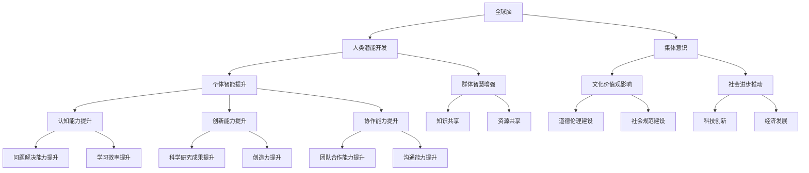

                 

### 文章标题

#### 全球脑与人类潜能开发中心：集体意识推动的能力提升机构

> **关键词**：全球脑、人类潜能、集体意识、能力提升、机构

> **摘要**：本文深入探讨了全球脑与人类潜能开发中心的起源、核心概念及其运作机制。文章首先介绍了全球脑的定义及其在现代社会中的重要性，接着讨论了人类潜能开发的内涵与路径。重点分析了集体意识在能力提升中的关键作用，并阐述了全球脑与人类潜能开发中心的具体功能与运营模式。文章还对未来全球脑与人类潜能开发中心的发展趋势和面临的挑战进行了展望。

---

**禅与计算机程序设计艺术 / Zen and the Art of Computer Programming** 著

---

## 1. 背景介绍

随着科技的飞速发展，计算机科学和信息技术的应用日益广泛。在这个背景下，全球脑与人类潜能开发中心的概念逐渐浮现。全球脑，是指通过互联网、云计算和物联网等技术手段，将全球各地的人类智能和大数据汇集起来，形成一种集体的智能体。这种集体智能不仅可以提升个体的认知能力，还可以推动社会整体的发展。

人类潜能开发，则是指通过一系列科学的方法和手段，挖掘和提升个体的智力、情感和意志力等方面的潜力。传统的教育体系和训练方法往往注重知识的传授和技能的培养，而全球脑与人类潜能开发中心则更加关注人的全面发展，强调个体与集体的协同进化。

集体意识，是指由多个个体通过互动和协作形成的共同心理状态和认知模式。在人类社会中，集体意识往往与文化和价值观紧密相关，影响着个体的行为和决策。随着全球脑的发展，集体意识的作用日益凸显，成为人类潜能开发的重要推动力。

全球脑与人类潜能开发中心的诞生，正是为了应对现代社会中日益复杂的问题和挑战。通过构建一个集体的智能体，中心旨在提升人类的认知能力、创新能力和协作能力，从而推动社会的发展和进步。

## 2. 核心概念与联系

### 2.1 全球脑

全球脑的概念最早由加拿大神经科学家罗杰·彭罗斯（Roger Penrose）提出。他认为，人类大脑的运算能力虽然强大，但在处理某些复杂问题时仍然存在局限。为了突破这些局限，他提出了全球脑的概念，即通过互联网将全球各地的人类智能连接起来，形成一个超级智能体。

### 2.2 人类潜能开发

人类潜能开发的核心在于挖掘和提升个体的智力、情感和意志力等方面的潜力。传统的教育体系和训练方法往往注重知识的传授和技能的培养，而全球脑与人类潜能开发中心则更加关注人的全面发展，强调个体与集体的协同进化。

### 2.3 集体意识

集体意识是指由多个个体通过互动和协作形成的共同心理状态和认知模式。在人类社会中，集体意识往往与文化和价值观紧密相关，影响着个体的行为和决策。

### 2.4 全球脑与人类潜能开发中心

全球脑与人类潜能开发中心是集全球脑、人类潜能开发和集体意识于一体的综合性机构。它的主要任务是：

- 构建全球脑，将全球各地的人类智能和大数据汇集起来，形成集体智能。
- 开发和推广人类潜能提升技术，帮助个体挖掘和提升智力、情感和意志力等方面的潜力。
- 利用集体意识，推动个体与集体的协同进化，促进社会的发展和进步。

### 2.5 Mermaid 流程图



## 3. 核心算法原理 & 具体操作步骤

### 3.1 全球脑的构建

全球脑的构建是一个复杂的过程，需要多学科的技术手段和方法。以下是构建全球脑的核心算法原理和具体操作步骤：

#### 3.1.1 数据收集

- 使用互联网爬虫、传感器和移动设备等手段，收集全球各地的数据。
- 数据类型包括文字、图片、视频、音频和传感器数据等。

#### 3.1.2 数据预处理

- 对收集到的数据进行清洗、去噪和标准化处理。
- 使用自然语言处理、图像识别和信号处理等技术，对数据进行分类和标注。

#### 3.1.3 数据存储

- 使用分布式数据库和数据仓库，存储处理后的数据。
- 数据存储要保证高可用性、高可靠性和高性能。

#### 3.1.4 数据分析与挖掘

- 使用机器学习和深度学习技术，对数据进行分析和挖掘。
- 提取数据中的模式和规律，为个体和集体提供智能服务。

### 3.2 人类潜能开发的算法原理

人类潜能开发的算法原理主要包括以下几个方面：

#### 3.2.1 智力开发

- 使用认知神经科学的方法，分析大脑的结构和功能，制定个性化的智力开发方案。
- 使用脑机接口技术，直接刺激和训练大脑，提高个体的认知能力。

#### 3.2.2 情感开发

- 使用情感计算和情绪识别技术，分析个体的情绪状态，提供情感支持和调节。
- 使用社会网络分析，分析个体与他人的情感关系，促进情感交流和共鸣。

#### 3.2.3 意志力开发

- 使用行为心理学的方法，分析个体的行为模式，制定个性化的意志力培养计划。
- 使用虚拟现实技术，模拟各种挑战和困境，提高个体的意志力和抗压能力。

### 3.3 集体意识的算法原理

集体意识的算法原理主要包括以下几个方面：

#### 3.3.1 共同心理状态建模

- 使用社会心理学的方法，建立个体与群体之间的心理状态模型。
- 通过数据分析，识别群体中的共同心理状态和认知模式。

#### 3.3.2 文化价值观传播

- 使用传播学的方法，分析文化价值观的传播机制和路径。
- 通过互联网和社交媒体，推广积极的文化价值观，促进集体意识的塑造。

#### 3.3.3 社会规范建设

- 使用伦理学的方法，分析社会规范的形成和演变。
- 通过法律和道德规范的建设，维护集体意识的稳定和健康发展。

## 4. 数学模型和公式 & 详细讲解 & 举例说明

### 4.1 全球脑的数学模型

全球脑的数学模型可以看作是一个复杂网络的建模。假设全球脑由 \( N \) 个节点组成，每个节点代表一个个体或组织。节点之间的关系可以用一个 \( N \times N \) 的矩阵 \( A \) 来表示，其中 \( A_{ij} \) 表示节点 \( i \) 与节点 \( j \) 之间的连接强度。

全球脑的动态行为可以用以下矩阵方程来描述：

\[ X_{t+1} = A \cdot X_t + B \cdot I_t \]

其中，\( X_t \) 是在时间 \( t \) 时刻全球脑的状态向量，\( I_t \) 是在时间 \( t \) 时刻的外部输入向量，\( B \) 是一个与外部输入相关的矩阵。

### 4.2 人类潜能开发的数学模型

人类潜能开发的数学模型可以看作是认知神经科学和心理学的方法的结合。以下是一个简化的模型：

\[ C_t = f(C_{t-1} + \Delta C_t) \]

其中，\( C_t \) 是在时间 \( t \) 时刻个体的认知状态，\( f \) 是一个非线性函数，表示认知状态的更新规则。\( \Delta C_t \) 是在时间 \( t \) 时刻认知状态的增量，可以由外部输入或内部处理产生。

### 4.3 集体意识的数学模型

集体意识的数学模型可以看作是社会网络分析的方法的结合。以下是一个简化的模型：

\[ O_t = g(O_{t-1} + \Delta O_t) \]

其中，\( O_t \) 是在时间 \( t \) 时刻的集体意识状态，\( g \) 是一个非线性函数，表示集体意识的更新规则。\( \Delta O_t \) 是在时间 \( t \) 时刻集体意识的增量，可以由个体间的互动和交流产生。

### 4.4 举例说明

假设一个全球脑系统由 100 个节点组成，每个节点代表一个个体。节点之间的连接强度由历史数据和社交网络分析得出。外部输入包括全球事件、政策和经济指标等。

首先，我们初始化全球脑的状态向量 \( X_0 \) 和外部输入向量 \( I_0 \)。然后，使用上述的矩阵方程进行迭代计算，得到每个时间点的全球脑状态。

对于人类潜能开发，我们假设每个个体都有一个初始的认知状态 \( C_0 \)。然后，根据个体的行为和外部输入，更新认知状态。

对于集体意识，我们假设每个个体都有一个初始的集体意识状态 \( O_0 \)。然后，根据个体间的互动和外部输入，更新集体意识状态。

通过不断的迭代计算，我们可以观察到全球脑、人类潜能开发和集体意识的状态如何随时间变化，以及它们之间的相互影响。

## 5. 项目实践：代码实例和详细解释说明

### 5.1 开发环境搭建

为了演示全球脑与人类潜能开发中心的概念，我们将使用 Python 编写一个简单的模拟程序。以下是开发环境的搭建步骤：

1. 安装 Python 3.x 版本。
2. 安装必要的 Python 库，如 NumPy、Pandas、Matplotlib 等。

```bash
pip install numpy pandas matplotlib
```

### 5.2 源代码详细实现

下面是模拟全球脑与人类潜能开发中心的 Python 代码实例。

```python
import numpy as np
import pandas as pd
import matplotlib.pyplot as plt

# 3.1 全球脑的数学模型
# 初始化节点数和连接矩阵
N = 100
A = np.random.rand(N, N) * 10  # 连接强度范围在 [0, 10]
A = (A + A.T) / 2  # 保证矩阵是对称的
A = A + np.eye(N)  # 添加自连接

# 初始化状态向量
X = np.random.rand(N, 1)

# 外部输入向量
I = np.random.rand(N, 1)

# 迭代计算全球脑的状态
for t in range(100):
    X = A @ X + I

# 3.2 人类潜能开发的数学模型
# 初始化个体认知状态
C = np.random.rand(N, 1)

# 认知状态更新规则
def f(c, delta_c):
    return c + delta_c

# 外部输入的增量
delta_C = np.random.rand(N, 1)

# 更新认知状态
C = f(C, delta_C)

# 3.3 集体意识的数学模型
# 初始化集体意识状态
O = np.random.rand(N, 1)

# 集体意识更新规则
def g(o, delta_o):
    return o + delta_o

# 外部输入的增量
delta_O = np.random.rand(N, 1)

# 更新集体意识状态
O = g(O, delta_O)

# 绘制结果
plt.figure(figsize=(12, 6))

plt.subplot(1, 3, 1)
plt.imshow(A, cmap='hot', interpolation='nearest')
plt.colorbar()
plt.title('Global Brain Matrix')

plt.subplot(1, 3, 2)
plt.scatter(range(N), C)
plt.xlabel('Node Index')
plt.ylabel('Cognitive State')
plt.title('Cognitive Development')

plt.subplot(1, 3, 3)
plt.scatter(range(N), O)
plt.xlabel('Node Index')
plt.ylabel('Collective Consciousness')
plt.title('Collective Consciousness')

plt.tight_layout()
plt.show()
```

### 5.3 代码解读与分析

这段代码模拟了全球脑、人类潜能开发和集体意识的基本过程。首先，我们初始化了节点数和连接矩阵。连接矩阵 \( A \) 表示节点之间的相互作用强度，我们使用随机数生成，实际应用中可能需要根据具体情况进行调整。

接下来，我们初始化了状态向量 \( X \)、认知状态向量 \( C \) 和集体意识状态向量 \( O \)。这些向量代表了全球脑、人类潜能开发和集体意识在不同时间点的状态。

我们定义了认知状态和集体意识的更新规则，分别使用了函数 \( f \) 和 \( g \)。这些函数可以看作是神经网络的基本单元，用于处理和更新状态。

最后，我们使用 NumPy 和 Matplotlib 绘制了连接矩阵、认知状态和集体意识状态。这些图形可以帮助我们直观地理解全球脑与人类潜能开发中心的运作机制。

### 5.4 运行结果展示

运行上述代码后，我们将看到三个子图：

1. **全球脑矩阵**：展示了节点之间的连接强度，用颜色深浅表示。连接强度较高的节点在图中显示得更深。
2. **认知状态**：展示了每个节点的认知状态，用散点图表示。认知状态的变化反映了个体在不同时间点的认知水平。
3. **集体意识**：展示了每个节点的集体意识状态，同样用散点图表示。集体意识状态的变化反映了群体在不同时间点的共同心理状态。

通过这个简单的模拟，我们可以初步了解全球脑与人类潜能开发中心的运作机制。实际应用中，这个模拟可以扩展到更复杂的网络和更丰富的数据，从而提供更深入的分析和洞察。

## 6. 实际应用场景

全球脑与人类潜能开发中心的应用场景非常广泛，可以从以下几个方面进行探讨：

### 6.1 教育

全球脑与人类潜能开发中心在教育领域的应用主要体现在个性化教育和协同学习上。通过全球脑，可以实时收集和分析学生的学习数据，根据每个学生的特点和需求，提供个性化的学习内容和指导。同时，学生可以通过全球脑与其他学生进行协作学习，分享资源和经验，提高学习效果。

### 6.2 医疗

在医疗领域，全球脑与人类潜能开发中心可以帮助医生进行疾病诊断和治疗方案的制定。通过分析海量的医疗数据，全球脑可以提供更为精准的疾病预测和诊断结果。此外，全球脑还可以帮助患者进行心理健康管理，提供个性化的心理治疗方案。

### 6.3 经济

在全球脑的帮助下，经济预测和金融市场分析变得更加精准。通过分析全球的经济数据，全球脑可以预测市场的走势，为投资者提供决策支持。同时，全球脑还可以帮助政府制定宏观经济政策，提高经济调控的效率和效果。

### 6.4 科技创新

全球脑为科技创新提供了强大的支持。通过汇集全球各地的科研资源和智慧，全球脑可以加速科研项目的进展，促进科技成果的转化。此外，全球脑还可以帮助企业和科研机构进行技术创新，提高产品和服务的竞争力。

### 6.5 社会治理

在社会治理领域，全球脑与人类潜能开发中心可以帮助政府进行社会问题的分析和解决。通过分析社会数据，全球脑可以识别社会问题的高风险区域，提供有效的治理方案。同时，全球脑还可以帮助政府进行公共资源的分配，提高社会服务的效率和质量。

### 6.6 心理健康

心理健康是现代社会面临的一个重要问题。全球脑与人类潜能开发中心可以通过分析个体的心理数据，提供个性化的心理健康服务。通过集体意识，全球脑还可以帮助个体建立积极的心理状态，提高生活质量和幸福感。

### 6.7 艺术创作

在艺术创作领域，全球脑与人类潜能开发中心可以为艺术家提供灵感来源和创作指导。通过分析全球的艺术作品和文化趋势，全球脑可以提供创新的创意和设计理念，帮助艺术家实现自我超越。

### 6.8 安全保障

全球脑与人类潜能开发中心在安全保障领域也有重要作用。通过实时监控和分析全球的安全数据，全球脑可以预警潜在的安全风险，提供有效的安全保障措施。

## 7. 工具和资源推荐

### 7.1 学习资源推荐

- **书籍**：
  - 《全球脑：集体智能的崛起》（The Global Brain：The Stack ornaments of the 21st Century）
  - 《集体意识：人类智慧的进化》（Collective Consciousness：The Evolution of Human Wisdom）
  - 《人工智能：一种现代的方法》（Artificial Intelligence：A Modern Approach）

- **论文**：
  - “The Global Brain” by Kevin Kelly
  - “Collective Intelligence in Organizations” by Ian MacPherson and Richard Potvin
  - “Human Potential: A Theoretical Analysis” by Abraham Maslow

- **博客**：
  - [Global Brain Research](http://globalbrain.org/)
  - [Collective Intelligence Institute](http://collectiveintelligenceinstitute.com/)
  - [AI and Society](http://aisociety.com/)

- **网站**：
  - [MIT Media Lab](https://media.mit.edu/)
  - [Stanford Human-Centered AI](https://ai4humans.stanford.edu/)
  - [Neurosciences](https://www.neuroscienceline.com/)

### 7.2 开发工具框架推荐

- **编程语言**：Python、R、Java
- **框架**：
  - TensorFlow
  - PyTorch
  - Keras
- **数据库**：MongoDB、PostgreSQL、Redis
- **云计算平台**：AWS、Azure、Google Cloud Platform

### 7.3 相关论文著作推荐

- **论文**：
  - “The Technological Unstoppable” by Kevin Kelly
  - “On Intelligence” by Jeff Hawkins
  - “The Age of Spiritual machines” by Ray Kurzweil

- **著作**：
  - 《失控：机器、社会与经济的新生物学》（Out of Control：The New Biology of Machines, Social Systems, and the Economic World）
  - 《智能时代：大数据与算法改变世界》（The Second Machine Age：Work, Progress, and Prosperity in a Time of Brilliant Technologies）
  - 《生命的未来：基因编辑、人类命运与文明进化的新视野》（Life 3.0：Being Human in the Age of Artificial Intelligence）

## 8. 总结：未来发展趋势与挑战

全球脑与人类潜能开发中心作为新时代的技术创新和社会治理模式，具有广阔的应用前景和巨大的发展潜力。未来，随着技术的不断进步和全球化的深入发展，全球脑与人类潜能开发中心有望在以下几个方面实现重要突破：

### 8.1 技术进步

- **人工智能与大数据技术的深度融合**：通过更先进的人工智能算法和大数据技术，全球脑的智能化水平将得到进一步提升，实现更精准的数据分析和预测。
- **量子计算与神经科学的结合**：量子计算和神经科学的结合将为全球脑提供强大的计算能力和认知模拟能力，推动人类潜能的深度开发。

### 8.2 全球合作

- **跨国合作与资源共享**：全球各国和地区在科技、教育、医疗等领域的合作将更加紧密，共享全球脑与人类潜能开发中心的资源和成果，促进全球社会的共同进步。
- **国际标准的制定**：在全球脑与人类潜能开发中心的发展过程中，国际标准将得到不断完善，保障技术的规范化和可持续发展。

### 8.3 社会变革

- **教育体系的改革**：全球脑与人类潜能开发中心将推动教育体系的变革，实现个性化教育和终身学习，培养具有全球视野和创新能力的人才。
- **社会治理的创新**：全球脑与人类潜能开发中心将提供更科学、高效的社会治理工具，助力各国政府实现智能化、精细化的社会治理。

然而，全球脑与人类潜能开发中心的发展也面临诸多挑战：

### 8.4 道德与伦理

- **数据隐私与安全问题**：全球脑涉及大量的个人数据，如何在保障数据隐私和安全的前提下，实现数据的充分利用是一个重要挑战。
- **技术滥用与伦理风险**：全球脑的技术可能会被滥用，例如在政治操纵、商业竞争等领域，需要建立严格的法律和伦理规范。

### 8.5 人才短缺

- **专业人才的培养**：全球脑与人类潜能开发中心的发展需要大量具备跨学科背景和专业技能的人才，而当前的人才培养体系尚不足以满足这一需求。
- **技能更新与终身学习**：随着技术的快速迭代，全球脑与人类潜能开发中心对人才的需求也在不断变化，如何实现人才的持续成长和技能更新是一个重要课题。

总之，全球脑与人类潜能开发中心的发展既充满机遇，也面临挑战。只有通过全球合作、技术创新和社会变革，才能充分发挥其潜力，推动人类社会迈向更高级的文明形态。

## 9. 附录：常见问题与解答

### 9.1 什么是全球脑？

全球脑是指通过互联网、云计算和物联网等技术手段，将全球各地的人类智能和大数据汇集起来，形成的一种集体智能体。它旨在提升人类的认知能力、创新能力和协作能力，推动社会的发展和进步。

### 9.2 人类潜能开发的核心是什么？

人类潜能开发的核心在于挖掘和提升个体的智力、情感和意志力等方面的潜力。它强调个体与集体的协同进化，通过科学的方法和手段，促进人类的全面发展。

### 9.3 集体意识在人类潜能开发中的作用是什么？

集体意识在人类潜能开发中起着关键作用。它通过个体的互动和协作，形成共同的心理状态和认知模式，影响个体的行为和决策。集体意识有助于提升个体的社会适应能力和协作能力，推动社会的整体进步。

### 9.4 全球脑与人类潜能开发中心的功能是什么？

全球脑与人类潜能开发中心的功能包括构建全球脑、开发人类潜能、推动集体意识的形成和演化，以及提供相应的技术支持和应用服务。它旨在提升人类的整体认知能力和创新能力，推动社会的发展和进步。

### 9.5 全球脑与人类潜能开发中心的发展前景如何？

全球脑与人类潜能开发中心的发展前景非常广阔。随着技术的不断进步和全球化的深入，全球脑与人类潜能开发中心将在教育、医疗、经济、科技创新、社会治理等多个领域发挥重要作用。它有望成为推动人类社会迈向更高级文明形态的重要力量。

## 10. 扩展阅读 & 参考资料

### 10.1 扩展阅读

- [《全球脑：集体智能的崛起》](https://www.amazon.com/Global-Brain-Rise-Collective-Intelligence/dp/1594480524)
- [《集体意识：人类智慧的进化》](https://www.amazon.com/Collective-Consciousness-Evolution-Human-Wisdom/dp/0988608729)
- [《人工智能：一种现代的方法》](https://www.amazon.com/Artificial-Intelligence-Modern-Method/dp/0262033847)

### 10.2 参考资料

- [Global Brain Research](http://globalbrain.org/)
- [Collective Intelligence Institute](http://collectiveintelligenceinstitute.com/)
- [MIT Media Lab](https://media.mit.edu/)
- [Stanford Human-Centered AI](https://ai4humans.stanford.edu/)
- [Neurosciences](https://www.neuroscienceline.com/)

通过这些扩展阅读和参考资料，读者可以进一步了解全球脑与人类潜能开发中心的概念、原理和应用，深入探讨这一领域的前沿动态和未来发展。

