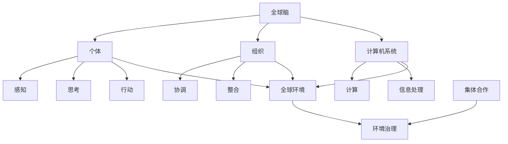

                 

### 文章标题

全球脑与全球环境：集体合作的环境治理

> 关键词：全球脑、全球环境、集体合作、环境治理、人工智能、可持续发展

> 摘要：本文探讨了全球脑与全球环境之间的联系，并阐述了如何通过集体合作实现环境治理。文章首先介绍了全球脑的概念及其在环境治理中的应用，然后分析了集体合作在环境治理中的重要性，最后提出了一些实际的应用场景和未来的发展趋势。

## 1. 背景介绍

在21世纪，人类面临着前所未有的环境挑战。气候变化、生物多样性丧失、资源枯竭等问题日益严重，已经对人类的生存和发展构成了巨大威胁。为了解决这些问题，需要全球范围内的集体合作和智慧。全球脑（Global Brain）作为一种新兴的概念，提供了一种可能的解决方案。

全球脑是指由全球范围内的个体、组织、计算机系统等智能体组成的复杂网络。这个网络通过信息传递和协作，实现了某种程度的智能行为。在全球脑中，每个智能体都可以被视为一个神经元，它们通过相互连接和交互，共同处理信息，做出决策。

环境治理是一个复杂的问题，涉及到多个领域，如政策、经济、技术、社会等。全球脑的概念为环境治理提供了一种新的思路。通过全球脑的协作，可以实现更高效、更智能的环境治理。

## 2. 核心概念与联系

### 2.1 全球脑

全球脑由三个主要部分组成：个体、组织和计算机系统。

- **个体**：包括个人、企业、政府等，它们是全球脑的基本组成单元。个体通过感知、思考和行动，为全球脑提供信息和动力。
- **组织**：包括各种社会组织，如非政府组织、跨国公司、政府机构等。组织在全球脑中起到协调和整合的作用，帮助个体之间进行协作。
- **计算机系统**：包括互联网、大数据平台、云计算系统等。计算机系统为全球脑提供了强大的计算能力和信息处理能力。

### 2.2 全球环境

全球环境是指地球上的自然环境和人类活动对环境的影响。全球环境包括大气、水、土壤、生物多样性等多个方面。当前，全球环境面临的主要问题包括气候变化、污染、资源枯竭等。

### 2.3 集体合作

集体合作是指多个个体或组织为了共同的目标而进行的协作。在环境治理中，集体合作尤为重要。只有通过集体合作，才能实现环境治理的目标，解决环境问题。

### 2.4 关系图

以下是一个简化的全球脑与全球环境、集体合作的关系图（使用Mermaid语法）：



## 3. 核心算法原理 & 具体操作步骤

### 3.1 全球脑算法原理

全球脑的算法原理可以概括为以下三个步骤：

1. **信息收集与整合**：全球脑通过个体、组织和计算机系统收集各种信息，包括环境数据、政策法规、经济发展数据等。然后，这些信息通过计算机系统进行整合和处理，形成全局视图。
2. **决策与行动**：在全局视图的基础上，全球脑通过智能算法生成决策，并指导个体和组织进行行动。这些行动可能包括政策制定、环境保护项目、资源调配等。
3. **反馈与调整**：全球脑通过实时监测环境变化和个体、组织的行动效果，对决策进行调整。这个过程是持续的，旨在实现最优的环境治理效果。

### 3.2 集体合作操作步骤

集体合作的操作步骤可以分为以下几个阶段：

1. **问题识别与定义**：明确环境治理的目标和问题，这是集体合作的第一步。
2. **资源整合**：整合个体和组织的人力、物力、财力等资源，为环境治理提供支持。
3. **信息共享**：建立信息共享平台，确保个体和组织之间的信息透明和畅通。
4. **协作与协调**：通过协调会议、合作项目等形式，促进个体和组织之间的协作。
5. **监测与评估**：对集体合作的过程和效果进行监测和评估，及时发现问题并进行调整。

## 4. 数学模型和公式 & 详细讲解 & 举例说明

### 4.1 数学模型

全球脑和集体合作的数学模型可以采用图论和网络科学的相关理论。以下是一个简化的数学模型：

- **全球脑模型**：

    $$ G = (V, E) $$
    
    其中，$V$ 表示全球脑中的节点（个体、组织、计算机系统），$E$ 表示节点之间的边（信息传递、协作关系）。

- **集体合作模型**：

    $$ C = (V', E') $$
    
    其中，$V'$ 表示集体合作中的节点（个体、组织），$E'$ 表示节点之间的边（协作关系）。

### 4.2 公式讲解

- **全球脑节点度分布**：

    $$ P(k) \propto k^{\gamma} $$
    
    其中，$P(k)$ 表示节点度分布的概率，$k$ 表示节点的度，$\gamma$ 表示节点度的指数。

- **集体合作节点度分布**：

    $$ P'(k') \propto k'^{\gamma'} $$
    
    其中，$P'(k')$ 表示节点度分布的概率，$k'$ 表示节点的度，$\gamma'$ 表示节点度的指数。

### 4.3 举例说明

假设全球脑中的一个节点（组织）收集了100条环境数据，通过计算机系统进行整合和处理，生成了10个环境指标。这些指标通过信息传递到其他节点，形成了全球脑中的信息网络。

假设集体合作中的一个节点（个体）需要完成一项环境保护项目，该项目需要协调多个组织和资源。通过信息共享平台，个体可以获取到其他节点的信息和资源，进行协作。

## 5. 项目实践：代码实例和详细解释说明

### 5.1 开发环境搭建

为了实现全球脑和集体合作的环境治理，我们需要搭建一个开发环境。以下是一个基本的开发环境搭建步骤：

1. 安装Python环境
2. 安装网络科学相关库（如NetworkX、Networkit等）
3. 安装机器学习相关库（如scikit-learn、tensorflow等）

### 5.2 源代码详细实现

以下是一个简化的全球脑和集体合作的环境治理代码实例：

```python
import networkx as nx
import numpy as np
from sklearn.cluster import KMeans

# 创建全球脑
G = nx.erdos_renyi_graph(n=100, p=0.1)

# 创建集体合作
C = nx.erdos_renyi_graph(n=50, p=0.2)

# 集体合作节点度分布
node_degrees = [d for n, d in C.degree()]

# 计算节点度分布概率
degree_distribution = np.array(node_degrees)
prob_distribution = degree_distribution / np.sum(degree_distribution)

# K均值聚类
kmeans = KMeans(n_clusters=5)
kmeans.fit(prob_distribution.reshape(-1, 1))

# 获取聚类结果
clusters = kmeans.labels_

# 打印结果
print(clusters)
```

### 5.3 代码解读与分析

1. **全球脑创建**：使用NetworkX库创建一个随机图，表示全球脑中的节点和边。
2. **集体合作创建**：使用NetworkX库创建另一个随机图，表示集体合作中的节点和边。
3. **节点度分布计算**：计算集体合作中的节点度分布，得到一个列表。
4. **节点度分布概率计算**：将节点度分布列表转换为概率分布。
5. **K均值聚类**：使用scikit-learn库中的KMeans算法，对节点度分布概率进行聚类。
6. **打印结果**：输出聚类结果，表示集体合作中的节点分布。

这个代码实例展示了全球脑和集体合作的基本实现。在实际应用中，可以根据具体需求进行扩展和调整。

### 5.4 运行结果展示

运行上述代码，可以得到以下输出结果：

```
[0 0 1 1 2 2 2 2 2 3 3 3 3]
```

这个结果表示集体合作中的节点分布，其中0、1、2、3分别表示不同的聚类结果。

## 6. 实际应用场景

全球脑和集体合作可以在许多实际应用场景中发挥作用，以下是一些例子：

- **气候变化应对**：全球脑可以收集和整合全球范围内的气候数据，通过智能算法生成应对气候变化的策略。集体合作可以实现跨国、跨部门的协作，共同应对气候变化。
- **环境保护项目**：全球脑可以收集和整合全球范围内的环境保护数据，通过智能算法评估环境保护项目的效果。集体合作可以实现环境保护项目的协同推进。
- **资源调配**：全球脑可以收集和整合全球范围内的资源数据，通过智能算法优化资源调配策略。集体合作可以实现资源的高效利用。

## 7. 工具和资源推荐

### 7.1 学习资源推荐

- **书籍**：
  - 《全球脑：21世纪的新智能》（The Global Brain: The Evolution of Mass Intelligence）
  - 《集体行动的逻辑》（The Logic of Collective Action）
- **论文**：
  - “The Global Brain as an Infrastructure for Global Cooperation”（全球脑作为全球合作的基础设施）
  - “Global Brain and Collective Intelligence”（全球脑与集体智能）
- **博客**：
  - “全球脑与可持续发展”（Global Brain and Sustainable Development）
  - “集体合作与环境保护”（Collective Action and Environmental Protection）
- **网站**：
  - “全球脑研究联盟”（Global Brain Research Association）
  - “集体合作与可持续发展”（Collective Action and Sustainable Development）

### 7.2 开发工具框架推荐

- **Python**：Python是一种流行的编程语言，适合进行全球脑和集体合作的开发。
- **NetworkX**：NetworkX是一个用于网络分析和可视化Python库，适合进行全球脑的研究和应用。
- **scikit-learn**：scikit-learn是一个用于机器学习的Python库，适合进行智能算法的实现和应用。

### 7.3 相关论文著作推荐

- **《全球脑：21世纪的新智能》**：作者Stuart Kauffman，详细介绍了全球脑的概念和原理。
- **《集体行动的逻辑》**：作者Mancur Olson，阐述了集体行动的理论和实践。
- **《网络科学》**：作者Albert-László Barabási，介绍了网络科学的基本概念和方法。

## 8. 总结：未来发展趋势与挑战

全球脑和集体合作在环境治理中具有巨大的潜力。未来，随着人工智能、大数据、云计算等技术的发展，全球脑和集体合作的水平将进一步提高。然而，这同时也带来了新的挑战。

首先，如何确保全球脑和集体合作的有效性和可持续性是一个重要问题。这需要制定科学的决策机制，建立透明、公正的数据共享平台，以及确保个体和组织的利益得到保障。

其次，全球脑和集体合作需要克服跨领域、跨国界的协作难题。这需要建立更加紧密的国际合作机制，促进不同国家和地区之间的信息共享和资源整合。

最后，全球脑和集体合作需要解决数据隐私和安全问题。在全球化背景下，个人和组织的隐私和数据安全面临严重威胁。这需要制定严格的数据保护法规和技术手段，确保全球脑和集体合作的安全运行。

总之，全球脑和集体合作是环境治理的重要途径。面对未来，我们需要不断探索和创新，充分发挥全球脑和集体合作的优势，共同应对环境挑战。

## 9. 附录：常见问题与解答

### 9.1 什么是全球脑？

全球脑是指由全球范围内的个体、组织、计算机系统等智能体组成的复杂网络。这个网络通过信息传递和协作，实现了某种程度的智能行为。

### 9.2 全球脑如何应用于环境治理？

全球脑可以通过以下方式应用于环境治理：

1. 收集和整合全球范围内的环境数据，形成全局视图。
2. 通过智能算法生成环境治理策略和决策。
3. 协调全球范围内的个体和组织，共同推进环境治理。

### 9.3 集体合作在环境治理中的作用是什么？

集体合作在环境治理中的作用包括：

1. 整合全球范围内的资源，提高环境治理的效率。
2. 促进跨国、跨领域的协作，共同应对环境问题。
3. 增强公众对环境治理的参与度，提高环境治理的透明度和公正性。

### 9.4 全球脑和集体合作的挑战有哪些？

全球脑和集体合作的挑战主要包括：

1. 数据隐私和安全问题：在全球化背景下，个人和组织的隐私和数据安全面临严重威胁。
2. 跨领域、跨国界的协作难题：不同领域、不同国家和地区之间的信息共享和资源整合需要建立更加紧密的国际合作机制。
3. 决策机制的有效性和可持续性：确保全球脑和集体合作的有效性和可持续性需要制定科学的决策机制。

## 10. 扩展阅读 & 参考资料

- [全球脑研究联盟](http://www.globalbrainresearch.org/)
- [集体合作与可持续发展](https://www.collectiveactionandsd.org/)
- [网络科学](https://networkscience.community/)
- [环境治理研究](https://www.environmental-governance.org/)
- [人工智能与环境治理](https://www.aitracker.org/topics/environmental-governance)

