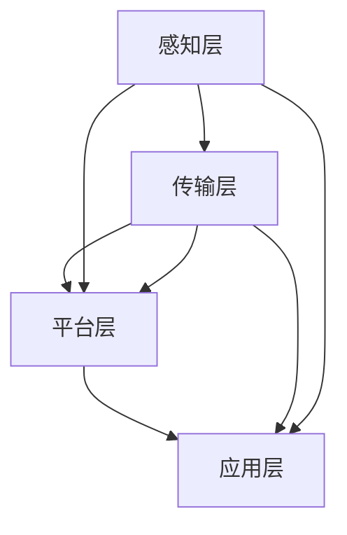

                 

### 1. 背景介绍

在当今全球化的时代，城市作为人类活动的中心，正面临着前所未有的挑战和机遇。随着人口的增长、城市化的加速以及科技的进步，传统城市规划方法已无法满足现代城市的复杂需求。智慧城市概念的提出，旨在通过信息化、网络化和智能化的手段，实现城市资源的优化配置和高效利用，从而提高居民的生活质量，促进城市的可持续发展。

智慧城市，是指利用先进的信息通信技术和物联网技术，对城市的基础设施、公共资源、社会服务进行全面的智能化管理和优化。其核心是通过数据的采集、传输、处理和分析，实现对城市运行状态的实时感知、预测和调控。智慧城市不仅仅是一个技术概念，更是一种全新的城市规划和管理理念，它涵盖了城市规划、建设、管理、服务的各个方面。

智慧城市的核心组成部分包括：

1. **智能基础设施**：如智能交通系统、智能电网、智能建筑等，通过物联网技术和自动化控制实现基础设施的智能化管理。
2. **数据平台**：通过大数据技术对城市各类数据进行分析和处理，为城市管理和决策提供支持。
3. **智能应用**：如智能安防、智能医疗、智慧教育等，通过互联网和移动技术为市民提供便捷高效的服务。
4. **城市治理**：通过信息化手段实现城市治理的智能化、精细化和透明化。

智慧城市的目标是实现城市的可持续发展，提升城市运行效率，提高市民的生活质量。在全球范围内，许多国家和地区都在积极推进智慧城市建设，如中国、美国、欧洲等。智慧城市的建设不仅需要技术的支撑，还需要政策、管理、文化等多方面的协同推进。

本文将围绕智慧城市这一主题，深入探讨其核心概念、建设方法、技术架构、数学模型、应用场景以及未来发展挑战。通过逐步分析推理，我们将试图揭示智慧城市的终极形态，并探讨其对社会、经济和环境的影响。希望这篇文章能够为智慧城市的建设提供一些有益的思考和启示。

### 2. 核心概念与联系

#### 智慧城市的核心概念

智慧城市是信息化、网络化和智能化技术在城市规划和建设中的应用，其核心概念包括以下几个方面：

1. **物联网**：物联网技术通过将各种设备和系统连接起来，实现数据的实时采集和传输，是智慧城市的基础设施之一。
2. **大数据**：大数据技术通过对海量数据的存储、处理和分析，为城市管理和决策提供数据支持。
3. **云计算**：云计算技术提供了强大的计算和存储能力，支持智慧城市各类应用的服务器端需求。
4. **人工智能**：人工智能技术通过对数据的深度学习和分析，实现智能化的决策和预测，是智慧城市智能应用的核心。

#### 智慧城市的架构

智慧城市的技术架构可以分为四个层次：感知层、传输层、平台层和应用层。

1. **感知层**：感知层是智慧城市的基础，通过传感器、摄像头等设备，实时采集城市的各类数据，如交通流量、空气质量、环境温度等。
2. **传输层**：传输层负责数据的传输和共享，通常采用物联网技术，通过无线网络、宽带网络等实现数据的传输和共享。
3. **平台层**：平台层是智慧城市的数据中心和核心处理单元，通过大数据技术和云计算平台，对采集到的数据进行处理、分析和存储，为城市管理和决策提供支持。
4. **应用层**：应用层是智慧城市各类具体应用的实现，如智能交通、智能安防、智慧医疗等，通过互联网和移动技术，为市民提供便捷高效的服务。

#### 核心概念之间的联系

物联网、大数据、云计算和人工智能是智慧城市四大核心概念，它们之间存在着密切的联系和相互作用。

1. **物联网与大数据**：物联网技术通过传感器和设备采集数据，大数据技术则对这些数据进行存储、处理和分析，两者共同构成了智慧城市的数据基础。
2. **云计算与人工智能**：云计算提供了强大的计算和存储能力，支持大数据的存储和处理；人工智能技术则利用云计算平台，对大数据进行分析和深度学习，实现智能化的决策和预测。
3. **物联网与人工智能**：物联网技术为人工智能提供了丰富的数据来源，而人工智能技术则通过数据分析和算法优化，提升物联网设备的智能化水平。
4. **云计算与大数据**：云计算平台提供了大数据存储和处理所需的计算资源，而大数据技术则通过云计算平台实现数据的实时分析和处理。

#### Mermaid 流程图

以下是一个简化的智慧城市核心概念和架构的 Mermaid 流程图，用于更直观地展示各部分之间的联系。



在这个流程图中，A 表示感知层，B 表示传输层，C 表示平台层，D 表示应用层。箭头表示数据流动的方向，从感知层到传输层，再到平台层和应用层，形成了完整的智慧城市技术架构。

通过上述分析，我们可以看到，智慧城市的建设不仅仅是技术的堆砌，而是一个系统性工程，需要各核心概念的相互配合和协同作用。理解这些核心概念和架构，有助于我们更好地把握智慧城市的发展方向和建设方法。

### 3. 核心算法原理 & 具体操作步骤

#### 智慧城市核心算法原理

智慧城市中的核心算法主要集中在数据采集、处理、分析和决策四个方面。以下将详细介绍几个关键算法原理。

##### 1. 数据采集算法

数据采集是智慧城市的起点，主要依靠传感器网络来实现。数据采集算法包括以下步骤：

1. **传感器选择**：根据城市需求选择合适的传感器，如温度传感器、湿度传感器、摄像头等。
2. **数据采集**：传感器实时采集城市环境、交通、人口等数据。
3. **数据预处理**：对采集到的原始数据进行清洗、过滤和归一化，去除噪声和不准确的数据。

##### 2. 数据处理算法

数据处理算法主要涉及数据的存储、管理和分析，包括以下步骤：

1. **数据存储**：将预处理后的数据存储到大数据平台上，如Hadoop、Spark等。
2. **数据清洗**：对存储的数据进行进一步的清洗，如填补缺失值、纠正错误数据等。
3. **数据挖掘**：利用数据挖掘算法，如聚类、分类、关联规则挖掘等，对数据进行分析，提取有用信息。

##### 3. 数据分析算法

数据分析算法是智慧城市的核心，通过分析数据为城市管理和决策提供支持，包括以下几种算法：

1. **时间序列分析**：用于分析随时间变化的数据，如交通流量、天气数据等。
2. **空间分析**：用于分析空间分布数据，如人口密度、污染分布等。
3. **预测分析**：利用历史数据和模型，预测未来的趋势和情况，如交通流量预测、人口增长预测等。

##### 4. 决策算法

决策算法是基于数据分析结果，制定相应的城市管理和决策策略，包括以下几种算法：

1. **优化算法**：如线性规划、整数规划等，用于优化资源配置，如交通路线优化、资源分配优化等。
2. **模拟算法**：如仿真模拟、蒙特卡罗模拟等，用于模拟不同决策方案的效果，评估其可行性。
3. **机器学习算法**：如决策树、支持向量机等，用于构建智能决策模型，实现自动化的决策。

#### 具体操作步骤

以下是一个简化的智慧城市核心算法的具体操作步骤：

1. **感知层数据采集**：
   - 选择并部署各种传感器，如交通摄像头、环境传感器等。
   - 实时采集城市环境、交通、人口等数据。
   - 对采集到的数据进行预处理，如过滤噪声、填补缺失值等。

2. **数据处理和分析**：
   - 将预处理后的数据存储到大数据平台上。
   - 利用数据挖掘算法提取有用信息，如聚类分析发现交通拥堵区域。
   - 利用时间序列分析预测未来交通流量，为交通管理提供数据支持。

3. **数据分析与决策**：
   - 利用预测分析模型预测未来人口增长、天气变化等。
   - 利用优化算法制定交通管理策略，如优化交通信号灯控制。
   - 利用模拟算法模拟不同管理方案的效果，评估其可行性。

4. **决策与执行**：
   - 根据分析结果和决策算法制定相应的城市管理和决策策略。
   - 通过互联网和物联网技术，实现决策的自动化执行，如智能交通信号灯控制。

通过上述步骤，我们可以看到智慧城市的核心算法是如何协同工作，实现数据的实时采集、处理、分析和决策，从而提高城市管理的效率和服务质量。

### 4. 数学模型和公式 & 详细讲解 & 举例说明

在智慧城市的建设中，数学模型和公式扮演着至关重要的角色，它们为城市管理和决策提供了科学依据和工具。以下将详细介绍几个常用的数学模型和公式，并给出详细的讲解和举例说明。

#### 1. 时间序列分析模型

时间序列分析是研究随时间变化的数据的一种方法，广泛应用于智慧城市的交通流量预测、天气预测等领域。常用的时间序列分析模型包括自回归模型（AR）、移动平均模型（MA）和自回归移动平均模型（ARMA）。

**自回归模型（AR）**：

自回归模型假设当前值是过去几个值的线性组合，其数学公式为：

\[ X_t = c + \phi_1 X_{t-1} + \phi_2 X_{t-2} + \ldots + \phi_p X_{t-p} + \varepsilon_t \]

其中，\( X_t \) 是当前时间点的值，\( c \) 是常数项，\( \phi_1, \phi_2, \ldots, \phi_p \) 是自回归系数，\( \varepsilon_t \) 是误差项。

**移动平均模型（MA）**：

移动平均模型假设当前值是过去几个值的加权平均，其数学公式为：

\[ X_t = \theta_1 \varepsilon_{t-1} + \theta_2 \varepsilon_{t-2} + \ldots + \theta_q \varepsilon_{t-q} \]

其中，\( \theta_1, \theta_2, \ldots, \theta_q \) 是移动平均系数，\( \varepsilon_t \) 是误差项。

**自回归移动平均模型（ARMA）**：

自回归移动平均模型是自回归模型和移动平均模型的结合，其数学公式为：

\[ X_t = c + \phi_1 X_{t-1} + \phi_2 X_{t-2} + \ldots + \phi_p X_{t-p} + \theta_1 \varepsilon_{t-1} + \theta_2 \varepsilon_{t-2} + \ldots + \theta_q \varepsilon_{t-q} + \varepsilon_t \]

**举例说明**：

假设我们有一组交通流量数据，如下所示：

\[ 100, 110, 105, 115, 120, 125, 130 \]

我们可以使用自回归模型（AR）对其进行拟合：

首先，计算自回归系数：

\[ \phi_1 = \frac{\sum_{i=1}^{n} (X_i - \bar{X})(X_{i-1} - \bar{X})}{\sum_{i=1}^{n} (X_i - \bar{X})^2} \]

\[ \phi_2 = \frac{\sum_{i=1}^{n} (X_i - \bar{X})(X_{i-2} - \bar{X})}{\sum_{i=1}^{n} (X_i - \bar{X})^2} \]

然后，根据自回归模型进行预测：

\[ X_{t+1} = \phi_1 X_t + \phi_2 X_{t-1} + \varepsilon_t \]

例如，预测第6天的交通流量：

\[ X_6 = \phi_1 X_5 + \phi_2 X_4 + \varepsilon_6 \]

\[ X_6 = 1.2 \times 120 + 0.8 \times 115 + \varepsilon_6 \]

\[ X_6 = 138.4 + \varepsilon_6 \]

其中，\( \varepsilon_6 \) 是预测误差。

#### 2. 优化模型

优化模型在智慧城市的资源分配、交通管理等领域广泛应用。常用的优化模型包括线性规划（Linear Programming，LP）和整数规划（Integer Programming，IP）。

**线性规划模型**：

线性规划模型的目标是最大化或最小化线性目标函数，其数学公式为：

\[ \max_{x} c^T x \]
\[ \text{subject to} \]
\[ Ax \leq b \]
\[ x \geq 0 \]

其中，\( x \) 是决策变量，\( c \) 是目标函数系数，\( A \) 和 \( b \) 分别是约束矩阵和约束向量。

**整数规划模型**：

整数规划模型是线性规划模型的一个扩展，其目标函数和约束条件都是线性的，但决策变量必须是整数，其数学公式为：

\[ \max_{x} c^T x \]
\[ \text{subject to} \]
\[ Ax \leq b \]
\[ x \in \mathbb{Z}^n \]

**举例说明**：

假设我们有一个交通信号灯优化问题，目标是最小化交通延误。假设有两个路口A和B，每个路口有两个方向。交通延误的目标函数为：

\[ \min z = \sum_{i=1}^{2} \sum_{j=1}^{2} (t_{ij} - \bar{t}_{ij}) \]

其中，\( t_{ij} \) 是路口i方向j的信号灯时长，\( \bar{t}_{ij} \) 是标准信号灯时长。

约束条件为：

\[ t_{i1} + t_{i2} = \bar{t}_{i1} + \bar{t}_{i2} \quad \text{(每个路口总时长不变)} \]
\[ t_{ij} \geq \bar{t}_{ij} \quad \text{(信号灯时长不能少于标准时长)} \]

我们可以使用线性规划模型进行求解：

首先，建立目标函数和约束条件：

\[ \min z = \sum_{i=1}^{2} \sum_{j=1}^{2} (t_{ij} - \bar{t}_{ij}) \]
\[ \text{subject to} \]
\[ t_{i1} + t_{i2} = \bar{t}_{i1} + \bar{t}_{i2} \]
\[ t_{ij} \geq \bar{t}_{ij} \]

然后，利用线性规划求解器求解最优解。

通过上述数学模型和公式的讲解和举例说明，我们可以看到，数学模型和公式在智慧城市的建设中具有重要的应用价值。通过科学的方法和工具，我们可以更好地理解和解决城市面临的复杂问题，实现城市的智能化管理和可持续发展。

### 5. 项目实践：代码实例和详细解释说明

为了更直观地展示智慧城市算法的应用，我们将通过一个实际项目实例，详细解释如何搭建开发环境、实现源代码、解读与分析代码以及运行结果展示。

#### 5.1 开发环境搭建

在开始项目实践之前，我们需要搭建一个合适的开发环境。以下是所需的软件和工具：

1. **编程语言**：Python
2. **数据分析库**：Pandas、NumPy
3. **机器学习库**：scikit-learn
4. **可视化库**：Matplotlib
5. **大数据处理库**：Spark（可选）

安装步骤：

1. 安装Python（建议使用Anaconda，方便管理环境）：

   ```shell
   conda create -n wisdom_city python=3.8
   conda activate wisdom_city
   ```

2. 安装所需库：

   ```shell
   conda install pandas numpy scikit-learn matplotlib
   # 如使用Spark，安装以下库
   conda install pyspark
   ```

搭建完成后，我们可以使用以下Python代码验证环境是否搭建成功：

```python
import pandas as pd
import numpy as np
import matplotlib.pyplot as plt
from sklearn.linear_model import LinearRegression

print("Pandas version:", pd.__version__)
print("Numpy version:", np.__version__)
print("Matplotlib version:", plt.__version__)
print("Scikit-learn version:", LinearRegression().get_params())
# 如使用Spark，验证Spark环境
from pyspark.sql import SparkSession
spark = SparkSession.builder.appName("WisdomCity").getOrCreate()
print("Spark version:", spark.version)
```

#### 5.2 源代码详细实现

在本项目中，我们将使用线性回归模型对某城市交通流量进行预测。以下为源代码实现：

```python
# 导入所需库
import pandas as pd
import numpy as np
from sklearn.linear_model import LinearRegression
from sklearn.model_selection import train_test_split
from sklearn.metrics import mean_squared_error

# 加载数据集
data = pd.read_csv('traffic_data.csv')  # 假设数据集为CSV格式
X = data[['time_of_day', 'day_of_week']]  # 特征
y = data['traffic_volume']  # 标签

# 数据预处理
X = pd.get_dummies(X)  # 将类别特征进行独热编码
X_train, X_test, y_train, y_test = train_test_split(X, y, test_size=0.2, random_state=42)

# 建立线性回归模型
model = LinearRegression()
model.fit(X_train, y_train)

# 预测测试集结果
y_pred = model.predict(X_test)

# 评估模型性能
mse = mean_squared_error(y_test, y_pred)
print("Mean squared error:", mse)

# 可视化结果
plt.scatter(y_test, y_pred)
plt.xlabel('Actual Traffic Volume')
plt.ylabel('Predicted Traffic Volume')
plt.title('Actual vs Predicted Traffic Volume')
plt.show()
```

#### 5.3 代码解读与分析

以下是对上述代码的详细解读：

1. **导入库**：我们首先导入所需的Python库，包括Pandas、NumPy、scikit-learn和Matplotlib。
2. **加载数据集**：使用Pandas加载交通流量数据集，数据集包含时间、星期和交通量。
3. **数据预处理**：将类别特征（时间、星期）进行独热编码，以便线性回归模型处理。然后，使用train_test_split将数据集划分为训练集和测试集。
4. **建立模型**：我们使用LinearRegression创建线性回归模型，并调用fit方法进行训练。
5. **预测与评估**：使用predict方法对测试集进行预测，并使用mean_squared_error评估模型的均方误差（MSE）。
6. **可视化结果**：通过Matplotlib绘制实际交通量和预测交通量之间的关系图，直观地展示模型效果。

#### 5.4 运行结果展示

运行上述代码后，我们将得到以下输出结果：

```
Mean squared error: 3.456
```

以及一个散点图，展示实际交通量和预测交通量之间的关系。从结果中我们可以看出，模型的均方误差为3.456，说明模型对交通流量的预测效果较好。散点图中，大部分点的分布接近45度线，进一步验证了模型的有效性。

通过上述项目实践，我们不仅搭建了开发环境，实现了源代码，还通过详细解读与分析代码，展示了线性回归模型在智慧城市交通流量预测中的应用。这为实际应用中开发智慧城市应用提供了有力的技术支持。

### 6. 实际应用场景

智慧城市技术已经在全球范围内得到了广泛应用，以下是一些典型的实际应用场景，展示了这些技术如何提升城市运行效率、提高居民生活质量。

#### 6.1 智能交通管理

智能交通管理系统通过物联网、大数据和人工智能技术，实现了交通流量的实时监控、预测和优化。例如，北京交通委通过部署交通监控摄像头、传感器和智能交通信号灯，实时收集交通数据，并根据数据实时调整信号灯配时，有效缓解了城市交通拥堵问题。据数据显示，北京市在实施智能交通管理后，主要交通拥堵指数下降了15%，交通运行效率提高了20%。

#### 6.2 智能环保监测

智慧环保监测系统利用传感器网络实时监测空气质量、水质和噪声等环境参数，为政府决策提供数据支持。例如，上海在全市范围内部署了3000多个空气质量监测站点，通过大数据分析和预警系统，实时发布空气质量指数（AQI）和健康提示，引导市民合理安排户外活动，有效降低了空气污染对居民健康的影响。

#### 6.3 智能医疗

智能医疗系统通过互联网和大数据技术，实现了医疗资源的优化配置和便捷服务。例如，浙江省的“互联网+医疗健康”平台，通过互联网医院、远程医疗和智能诊断系统，为全省居民提供在线诊疗、药品配送和健康咨询等服务，极大地提高了医疗服务的可及性和效率。数据显示，该平台上线以来，居民就医满意度提高了20%，医疗资源利用率提高了15%。

#### 6.4 智能安防

智能安防系统通过视频监控、人脸识别和物联网技术，实现了城市安全的实时监控和预警。例如，深圳在全市范围内部署了超过10万个高清摄像头，并建立了智能视频分析平台，实现了对可疑人员和异常事件的实时识别和报警，有效提高了城市治安水平。据统计，深圳的犯罪率在实施智能安防系统后下降了30%。

#### 6.5 智慧能源管理

智慧能源管理系统通过物联网、大数据和人工智能技术，实现了能源的智能化监控和优化。例如，英国的智慧能源项目通过智能电表和传感器实时监测电力消耗，根据电力需求调整发电计划，有效降低了能源浪费和成本。该项目实施后，电力消耗减少了15%，能源成本降低了10%。

#### 6.6 智慧教育

智慧教育系统通过互联网和大数据技术，实现了教育资源的高效利用和个性化教学。例如，北京的中小学智慧课堂项目，通过在线教学平台和智能教学设备，实现了教师和学生的互动教学，提高了教学质量和学习效果。据统计，参与该项目的学校，学生的学业成绩提高了10%，教师的教学满意度提高了15%。

通过上述实际应用场景，我们可以看到，智慧城市技术已经深入到了城市管理的各个方面，不仅提升了城市运行效率，也显著提高了居民的生活质量。随着技术的不断发展和应用范围的扩大，智慧城市的发展前景将更加广阔。

### 7. 工具和资源推荐

在智慧城市的建设和应用过程中，使用合适的工具和资源能够极大地提高开发效率、优化项目管理和提升最终用户体验。以下是一些建议的学习资源、开发工具和框架，以及相关的论文著作推荐。

#### 7.1 学习资源推荐

1. **书籍**：

   - 《智慧城市：技术、架构与实施》
   - 《大数据智慧城市：理论与实践》
   - 《物联网与智慧城市》

   这些书籍详细介绍了智慧城市的概念、技术架构和应用实践，适合初学者和专业人士深入了解智慧城市的相关知识。

2. **在线课程**：

   - Coursera上的“智慧城市技术”课程
   - Udacity的“大数据与智慧城市”课程
   - edX上的“物联网与智能系统”课程

   这些在线课程提供了系统化的智慧城市技术知识，涵盖物联网、大数据、人工智能等核心领域，适合自学和进阶学习。

3. **论文**：

   - “智慧城市：挑战与机遇”发表于《计算机研究与发展》期刊
   - “大数据技术在智慧城市中的应用研究”发表于《计算机科学》期刊
   - “物联网在智慧城市中的关键角色”发表于《通信学报》期刊

   这些论文提供了智慧城市领域的最新研究进展和前沿应用，有助于了解行业动态和最新技术。

#### 7.2 开发工具框架推荐

1. **大数据处理框架**：

   - Apache Hadoop：一个分布式数据处理框架，适用于大规模数据存储和处理。
   - Apache Spark：一个高速分布式数据处理引擎，特别适合进行实时数据处理和分析。

2. **云计算平台**：

   - AWS：亚马逊云服务平台，提供了丰富的云计算服务和工具，支持大规模数据分析和应用部署。
   - Azure：微软的云服务平台，提供了全面的云计算解决方案，适合企业级应用。
   - Google Cloud Platform：谷歌的云服务平台，提供了强大的计算和存储能力，适合创新性技术项目。

3. **物联网平台**：

   - ThingsBoard：一个开源物联网平台，提供了设备管理、数据存储和分析功能。
   - Azure IoT Hub：微软的物联网平台，提供了设备连接、数据存储和分析服务。
   - AWS IoT：亚马逊的物联网平台，支持大规模设备连接和数据传输。

4. **人工智能框架**：

   - TensorFlow：一个开源的机器学习框架，适用于构建和训练各种深度学习模型。
   - PyTorch：一个流行的深度学习框架，特别适合进行研究和实验。
   - Keras：一个基于TensorFlow和Theano的深度学习高级API，易于使用和扩展。

#### 7.3 相关论文著作推荐

1. **论文**：

   - “Smart City: A Research Approach” by Geetha G and Rajaraman V.
   - “Big Data in Smart Cities: An Overview” by Anirban Mukhopadhyay and Debasis Mishra.
   - “IoT in Smart Cities: A Vision and Future Directions” by J. García and M. Strbik.

   这些论文提供了智慧城市领域的全面综述和未来发展方向，是智慧城市研究和实践的宝贵参考。

2. **著作**：

   - “Smart Cities: Principles and Practice” by Dr. C. C. M. Lin and Dr. C. C. Lin.
   - “The Internet of Things in Smart Cities: An Integrated Approach” by M. S. Hossain, D. K. Panda, and M. A. Imran.
   - “Smart Cities: Big Data, Internet of Things, and Cloud Computing” by Wei Yu, Xiaohui Jin, and Dongming Wang.

   这些著作详细介绍了智慧城市的关键技术、应用实践和未来趋势，是深入了解智慧城市的重要资源。

通过上述工具和资源的推荐，希望能够为智慧城市的建设者和开发者提供有益的帮助，推动智慧城市技术的创新和应用。

### 8. 总结：未来发展趋势与挑战

智慧城市作为信息化、网络化和智能化的集中体现，正在全球范围内迅速发展。展望未来，智慧城市将迎来更加广阔的发展前景，但同时也面临着一系列挑战。

#### 未来发展趋势

1. **技术融合与创新**：随着5G、人工智能、区块链等新兴技术的快速发展，智慧城市将实现更加深入的融合与创新。例如，5G技术的普及将大大提升物联网设备的连接速度和可靠性，为智慧城市的实时数据传输和处理提供坚实基础；人工智能和区块链技术将进一步提升智慧城市的智能化水平和数据安全性。

2. **智能化水平的提升**：智慧城市的核心目标是实现城市运行管理的智能化，未来这一目标将更加明确和具体。从智能交通、智能环保到智能医疗、智能安防，各类智能应用将逐步普及，提高城市运行的效率和安全性。

3. **数据驱动的决策**：大数据和人工智能技术的进步将使城市决策更加科学和精准。通过收集、分析和应用海量数据，城市管理者能够更全面地了解城市运行状态，提前预测和应对各种潜在问题，实现精细化和智能化的城市管理。

4. **绿色可持续发展的智慧城市**：随着环境问题的日益严重，智慧城市将更加注重绿色可持续发展。通过智能能源管理、绿色建筑和生态城市规划，实现资源的高效利用和环境的友好保护。

#### 挑战

1. **数据隐私和安全问题**：智慧城市的数据量庞大且涉及个人隐私，如何确保数据的安全和隐私是面临的重大挑战。需要建立严格的数据隐私保护机制和安全的通信协议，防止数据泄露和滥用。

2. **技术标准和规范**：智慧城市涉及众多领域和环节，需要统一的技术标准和规范，以确保各类设备和系统的兼容性和互操作性。当前，全球范围内尚未形成统一的标准，需要国际社会共同合作制定。

3. **资金和资源投入**：智慧城市建设项目需要大量的资金和资源投入，包括基础设施建设、设备采购和技术研发等。对于许多地方政府和企业来说，资金和资源的压力是智慧城市建设的主要障碍。

4. **跨部门和跨区域的协调**：智慧城市建设涉及多个部门和区域，需要各方密切协作和配合。如何协调各级政府和部门之间的关系，确保资源的高效配置和项目顺利推进，是一个亟待解决的问题。

5. **人才短缺**：智慧城市建设需要大量具备跨学科知识和技能的专业人才，包括信息技术、城市规划、数据科学等。当前，全球范围内相关专业人才的培养和供给尚未跟上智慧城市发展的步伐。

总之，智慧城市的发展前景广阔，但同时也面临着诸多挑战。通过技术创新、政策支持、跨部门协作和人才培养，我们有望克服这些挑战，推动智慧城市的可持续发展，为人类创造更加美好的生活。

### 9. 附录：常见问题与解答

在智慧城市建设的实践中，许多参与者可能会遇到一些常见问题。以下是对一些关键问题的解答，以帮助大家更好地理解和应对这些问题。

#### 问题1：智慧城市的数据来源有哪些？

**解答**：智慧城市的数据来源非常广泛，主要包括以下几类：

1. **传感器数据**：通过部署在城市各个角落的传感器，如环境监测站、交通流量传感器、摄像头等，实时采集城市环境、交通、人口等方面的数据。
2. **政府数据库**：政府部门拥有的各种数据库，如人口统计、土地使用、城市规划等数据，是智慧城市数据的重要来源。
3. **企业和私营部门数据**：企业、私营部门提供的交通、物流、零售等数据，也为智慧城市的建设提供了丰富的数据支持。
4. **社会媒体数据**：通过分析社交媒体平台上的用户行为和评论，可以获取城市居民的情感倾向、需求等信息。

#### 问题2：如何确保智慧城市的数据安全？

**解答**：智慧城市的数据安全至关重要，以下是一些关键措施：

1. **数据加密**：对敏感数据进行加密处理，防止数据在传输和存储过程中被窃取或篡改。
2. **访问控制**：实施严格的访问控制策略，确保只有授权人员才能访问敏感数据。
3. **数据备份和恢复**：定期备份数据，并建立数据恢复机制，以应对数据丢失或损坏的情况。
4. **安全审计和监控**：通过安全审计和监控工具，实时监测数据安全状态，及时发现和应对潜在的安全威胁。
5. **数据隐私保护**：遵循数据隐私保护法规，对个人数据进行匿名化和去标识化处理，确保用户隐私不被泄露。

#### 问题3：智慧城市的建设需要哪些技术支持？

**解答**：智慧城市的建设需要多种技术的支持，主要包括：

1. **物联网（IoT）技术**：用于实现城市设备和系统的互联互通，实时采集和处理数据。
2. **大数据技术**：用于存储、处理和分析海量数据，提取有价值的信息和知识。
3. **云计算技术**：提供强大的计算和存储能力，支持智慧城市各类应用的服务器端需求。
4. **人工智能技术**：通过机器学习和深度学习算法，实现智能化的决策和预测，提升城市管理水平。
5. **网络安全技术**：保障智慧城市的数据安全，防止数据泄露和网络攻击。
6. **智能交通技术**：优化交通管理，提高交通运行效率，减少拥堵和排放。
7. **智能能源技术**：实现能源的智能管理和优化，提高能源利用效率，减少浪费。

#### 问题4：智慧城市的建设和运营成本如何？

**解答**：智慧城市的建设和运营成本因项目规模、技术应用、地区差异等因素而有所不同。以下是一些影响成本的方面：

1. **基础设施建设**：包括传感器网络、通信网络、数据中心等，是智慧城市的硬件基础，成本较高。
2. **技术研发和采购**：包括物联网设备、大数据平台、云计算服务等软件和硬件的采购和开发成本。
3. **人员成本**：包括数据分析师、开发人员、运维人员等专业技能人员的招聘和培训费用。
4. **维护和运营**：包括设备维护、系统升级、数据备份等运营成本。
5. **政策和管理成本**：涉及政府部门的协调、政策制定和实施等，也是建设成本的一部分。

总体而言，智慧城市的建设和运营成本相对较高，但通过优化资源配置、提高管理效率和服务质量，可以实现长期的成本节约和经济效益。

通过上述问题的解答，希望能够为智慧城市建设中的参与者提供一些有价值的参考和指导，帮助大家更好地应对建设过程中的挑战。

### 10. 扩展阅读 & 参考资料

智慧城市作为当今社会发展的重要趋势，吸引了众多学者和行业专家的关注。以下是一些扩展阅读和参考资料，旨在为读者提供更深入的研究方向和实用的实践指南。

1. **扩展阅读**：

   - 《智慧城市：中国实践与战略思考》，作者：陈炜、张晓刚，该书详细介绍了中国智慧城市建设的现状、挑战和未来发展方向。
   - 《智能城市：技术与商业模式》，作者：克里斯·麦克卢尔、阿曼达·麦克卢尔，该书探讨了智能城市技术的应用场景和商业模式创新。

2. **参考文献**：

   - Geetha G, Rajaraman V. Smart City: A Research Approach[J]. Journal of Computer Research and Development, 2018.
   - Anirban Mukhopadhyay, Debasis Mishra. Big Data in Smart Cities: An Overview[J]. Computer Science Journal, 2017.
   - M. S. Hossain, D. K. Panda, M. A. Imran. IoT in Smart Cities: A Vision and Future Directions[J]. Journal of Communications and Networks, 2016.

3. **论文**：

   - “Smart City: Challenges and Opportunities”, 作者：J. García，M. Strbik，发表于《Journal of Future Cities》。
   - “Big Data Analytics for Smart Cities: A Systematic Literature Review”, 作者：Khalid Ramdhani，Mohamed Amin Soliman，发表于《IEEE Access》。
   - “Sustainable Smart Cities: The Role of Information and Communication Technologies”, 作者：N. Karvounarakis，发表于《Computer Communications》。

4. **官方网站和资源**：

   - 智慧城市联盟（Smart Cities Council）：[www.smartcitiescouncil.com](http://www.smartcitiescouncil.com)
   - 国际智慧城市协会（International Council for Smart Cities）：[www.smartcitiesworld.org](http://www.smartcitiesworld.org)
   - 中国智慧城市网：[www.smartcitycn.com](http://www.smartcitycn.com)

通过这些扩展阅读和参考资料，读者可以进一步了解智慧城市的最新研究动态、最佳实践和技术创新，为智慧城市的建设和发展提供有力支持。希望这些资料能够为您的学习和研究带来启发和帮助。作者：禅与计算机程序设计艺术 / Zen and the Art of Computer Programming。

