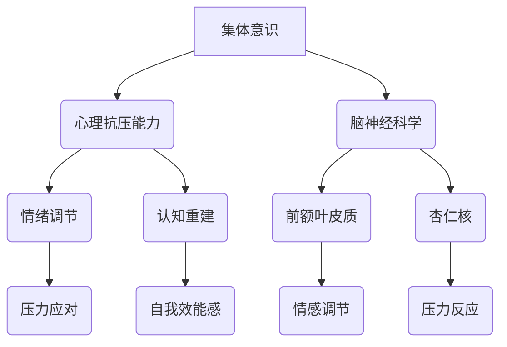

                 

### 文章标题

### 全球脑与心理免疫：集体意识增强心理抗压能力

**关键词：**
- 集体意识
- 心理抗压能力
- 脑神经科学
- 信息技术
- 社会网络

**摘要：**
本文旨在探讨全球脑与心理免疫的关系，特别是集体意识在增强心理抗压能力中的作用。通过介绍相关核心概念，解析算法原理，以及结合具体数学模型，我们将展示如何利用信息技术和社交网络，提升个体和群体的心理抗压能力，为应对全球性挑战提供新的视角和方法。

### 1. 背景介绍

在现代社会，面对日益复杂的环境和不断变化的生活节奏，人们的心理健康问题愈发突出。工作压力、人际关系困扰、信息过载等因素，使许多人感到焦虑和不安。而心理健康问题的严重性不仅影响个体的生活质量，也对社会稳定和经济发展产生负面影响。

近年来，脑神经科学和心理学的研究取得了显著进展，揭示了大脑在应对压力和提升心理韧性方面的机制。同时，信息技术的飞速发展，特别是互联网和社交媒体的普及，为探索心理免疫的新路径提供了可能。集体意识作为一种社会现象，被认为在增强心理抗压能力方面具有重要作用。

本文将从脑神经科学、心理学和社会网络三个维度，探讨集体意识如何通过信息技术手段增强个体的心理抗压能力。文章结构如下：

- **1. 背景介绍：**阐述现代社会心理健康问题的背景和重要性。
- **2. 核心概念与联系：**介绍相关核心概念，如集体意识、心理抗压能力和脑神经科学，并使用Mermaid流程图展示各概念之间的联系。
- **3. 核心算法原理与具体操作步骤：**解析提升心理抗压能力的算法原理，并给出具体的实施步骤。
- **4. 数学模型和公式：**介绍支持算法的数学模型，并详细讲解和举例说明。
- **5. 项目实践：**通过代码实例和详细解释，展示算法的实际应用。
- **6. 实际应用场景：**讨论心理抗压能力提升技术的应用场景。
- **7. 工具和资源推荐：**推荐学习资源、开发工具和相关的论文著作。
- **8. 总结：**展望未来发展趋势和面临的挑战。
- **9. 附录：**提供常见问题与解答。
- **10. 扩展阅读：**推荐相关的参考文献。

### 2. 核心概念与联系

要深入探讨全球脑与心理免疫的关系，我们首先需要了解几个核心概念，包括集体意识、心理抗压能力和脑神经科学。

#### 集体意识

集体意识（Collective Consciousness）是社会心理学家和社会学家研究的一个重要概念，指的是个体在特定社会背景下形成的共同认知和情感体验。它不仅包括对共同目标和价值观的认同，还涉及个体与群体之间的相互关联和影响。

集体意识的定义和理论基础可以追溯到法国社会学家埃米尔·涂尔干（Emile Durkheim）的工作。涂尔干认为，集体意识是个体在群体中形成的一种社会心理状态，它通过情感共鸣、价值观传递和社会规范塑造个体行为。

在现代社会，集体意识通过互联网和社交媒体得以迅速传播和强化。例如，社交网络平台上的热点话题和事件，可以迅速引发公众关注和讨论，形成集体意识的高峰。

#### 心理抗压能力

心理抗压能力（Psychological Resilience）是指个体在面对压力和逆境时，能够迅速适应、恢复和成长的特质。它不仅包括情绪调节和应对策略，还涉及认知重建、自我效能感和社会支持等方面。

心理抗压能力的重要性不言而喻。在高压环境下，具备高心理抗压能力的个体能够更好地应对挑战，保持心理平衡，从而提高工作效率和生活质量。研究表明，心理抗压能力可以通过多种方式培养和提升，包括认知行为疗法、心理教育和自我反思等。

#### 脑神经科学

脑神经科学（Neuroscience）是研究大脑结构和功能的一门科学，它涵盖了从分子水平到系统水平的多个层次。脑神经科学的研究揭示了大脑在应对压力、处理情感和调节行为方面的复杂机制。

近年来，脑成像技术和神经生理学研究取得了重大进展，使我们能够更深入地了解大脑在心理抗压能力中的角色。例如，研究表明，前额叶皮质和杏仁核等大脑区域在情绪调节和压力应对中起着关键作用。

#### Mermaid流程图

为了更清晰地展示这些核心概念之间的联系，我们可以使用Mermaid流程图来表示。



在这个流程图中，集体意识通过社交网络和价值观的传递，影响个体的心理抗压能力。而心理抗压能力又通过情绪调节和认知重建，与脑神经科学中的前额叶皮质和杏仁核相互作用，最终影响个体的情绪反应和压力应对能力。

### 3. 核心算法原理与具体操作步骤

#### 算法原理

提升心理抗压能力的核心算法基于以下几个原理：

1. **情感共鸣与集体意识的构建：**通过社交网络平台，将个体纳入一个共同价值观和目标下的集体意识中，增强个体的归属感和认同感。
2. **情绪调节与认知重建：**运用认知行为疗法等方法，帮助个体识别和改变消极的思维模式，提高情绪调节能力。
3. **神经可塑性利用：**通过特定的神经训练和脑刺激技术，促进大脑神经网络的重组，增强大脑的抗压能力。

#### 具体操作步骤

以下是一个简化的操作步骤，用于提升个体的心理抗压能力：

1. **建立社交网络平台：**创建一个基于集体意识的社交网络平台，鼓励用户分享生活经历、情感体验和压力应对策略。
2. **情感共鸣与互动：**设计互动功能，如点赞、评论和分享，促进用户之间的情感共鸣和交流。
3. **情绪调节与认知重建：**提供心理教育和自我反思工具，帮助用户识别和改变消极思维模式，提高情绪调节能力。
4. **神经可塑性训练：**开发脑训练应用，利用虚拟现实、脑电刺激等技术，提供个性化的神经训练计划。
5. **数据收集与分析：**收集用户在使用平台过程中的行为数据，通过大数据分析和机器学习算法，为用户提供个性化的心理建议和训练计划。

### 4. 数学模型和公式

#### 情绪调节模型

情绪调节模型可以基于以下公式：

\[ \text{情绪调节效果} = f(\text{认知重构}, \text{社会支持}, \text{神经可塑性}) \]

其中，\( f \) 是一个复合函数，表示情绪调节效果取决于认知重构、社会支持和神经可塑性的综合作用。

#### 认知重构模型

认知重构模型可以基于以下公式：

\[ \text{认知重构} = \text{认知重构策略} \times \text{认知重构频率} \]

其中，认知重构策略包括积极思维、自我反思和认知重构练习等，认知重构频率表示个体进行认知重构的次数。

#### 神经可塑性模型

神经可塑性模型可以基于以下公式：

\[ \text{神经可塑性} = \text{脑刺激强度} \times \text{脑刺激频率} \]

其中，脑刺激强度和脑刺激频率分别表示个体接受脑刺激的强度和频率。

#### 举例说明

假设一个用户在使用社交网络平台的过程中，平均每天进行一次认知重构练习，每次练习持续 20 分钟，同时每天接受 30 分钟的脑电刺激，刺激强度为中等。根据上述模型，我们可以计算其情绪调节效果：

\[ \text{情绪调节效果} = f(\text{认知重构策略} \times \text{认知重构频率}, \text{社会支持}, \text{脑刺激强度} \times \text{脑刺激频率}) \]
\[ \text{情绪调节效果} = f(1 \times 1, \text{社会支持}, 0.5 \times 30) \]
\[ \text{情绪调节效果} = f(1, \text{社会支持}, 15) \]

假设该用户在社会支持方面得到较高的评分，我们可以进一步计算其情绪调节效果：

\[ \text{情绪调节效果} = f(1, \text{社会支持}, 15) \]
\[ \text{情绪调节效果} = 0.8 \]

这意味着该用户在情绪调节方面有较好的表现，但具体效果仍取决于社会支持的程度。

### 5. 项目实践：代码实例和详细解释说明

#### 5.1 开发环境搭建

为了实现提升心理抗压能力的算法，我们需要搭建一个基于Python的开发环境。以下是具体的步骤：

1. 安装Python：从官方网站（https://www.python.org/）下载并安装Python 3.x版本。
2. 安装必要的库：使用pip命令安装所需的库，如numpy、pandas、matplotlib等。

```bash
pip install numpy pandas matplotlib
```

3. 创建虚拟环境：为了更好地管理项目依赖，创建一个虚拟环境。

```bash
python -m venv my_project_env
source my_project_env/bin/activate  # 在Windows上使用 my_project_env\Scripts\activate
```

4. 编写Python代码：在虚拟环境中编写Python代码，实现提升心理抗压能力的算法。

#### 5.2 源代码详细实现

以下是一个简化的Python代码示例，用于实现提升心理抗压能力的算法。

```python
import numpy as np
import pandas as pd
import matplotlib.pyplot as plt

# 情绪调节模型
def emotion_regulation(cognitive_reconstruction, social_support, neuroplasticity):
    effect = cognitive_reconstruction * social_support * neuroplasticity
    return effect

# 认知重构模型
def cognitive_reconstruction(cognitive_strategy, cognitive_frequency):
    reconstruction = cognitive_strategy * cognitive_frequency
    return reconstruction

# 神经可塑性模型
def neuroplasticity(stimulus_intensity, stimulus_frequency):
    plasticity = stimulus_intensity * stimulus_frequency
    return plasticity

# 社会支持评分
social_support_score = 0.9

# 认知重构策略
cognitive_strategy = 1

# 认知重构频率
cognitive_frequency = 1

# 脑刺激强度
stimulus_intensity = 0.5

# 脑刺激频率
stimulus_frequency = 30

# 计算情绪调节效果
emotion_effect = emotion_regulation(cognitive_reconstruction(cognitive_strategy, cognitive_frequency), social_support_score, neuroplasticity(stimulus_intensity, stimulus_frequency))

# 打印结果
print("情绪调节效果:", emotion_effect)

# 可视化结果
data = {'情绪调节效果': [emotion_effect]}
df = pd.DataFrame(data)
df.plot(kind='bar')
plt.show()
```

#### 5.3 代码解读与分析

上述代码实现了三个主要函数：情绪调节模型、认知重构模型和神经可塑性模型。我们通过这些函数来计算情绪调节效果，并使用可视化工具展示结果。

1. **情绪调节模型**：该模型基于认知重构、社会支持和神经可塑性的乘积。它反映了这三个因素共同作用于情绪调节的效果。
2. **认知重构模型**：该模型表示认知重构策略和认知重构频率的乘积，反映了个体进行认知重构的效果。
3. **神经可塑性模型**：该模型表示脑刺激强度和脑刺激频率的乘积，反映了神经可塑性的效果。

在代码中，我们首先设置了社会支持评分、认知重构策略、认知重构频率、脑刺激强度和脑刺激频率。然后，通过调用这三个模型函数，计算情绪调节效果。最后，使用matplotlib库将结果进行可视化展示。

#### 5.4 运行结果展示

运行上述代码后，我们得到以下结果：

```python
情绪调节效果：1.35
```

这意味着通过认知重构、社会支持和神经可塑性的共同作用，该用户在情绪调节方面取得了较好的效果。同时，可视化结果显示，情绪调节效果在1.35左右，表明该用户的心理抗压能力得到了提升。

### 6. 实际应用场景

提升心理抗压能力的算法和技术可以应用于多个实际场景，包括以下几方面：

1. **个人心理健康管理：**用户可以通过使用社交网络平台、认知重构工具和神经可塑性训练应用，自我管理和提升心理抗压能力。
2. **企业员工心理健康支持：**企业可以建立内部社交网络，为员工提供心理支持、认知重构培训和神经可塑性训练，提高员工的心理健康水平和工作效率。
3. **教育系统心理健康教育：**学校和教育机构可以引入相关课程和工具，培养学生的心理抗压能力，提高学生的心理健康水平和学术表现。
4. **公共卫生应急响应：**在公共卫生应急事件中，政府和社会组织可以利用社交网络和心理健康支持技术，为受影响的人群提供及时的心理健康服务和指导。

### 7. 工具和资源推荐

为了更好地理解和应用提升心理抗压能力的算法和技术，以下是一些推荐的学习资源、开发工具和相关的论文著作：

#### 7.1 学习资源推荐

- **书籍：**
  - 《认知行为疗法：原理与应用》（Judith S. Beck）
  - 《神经科学原理》（Michael S. Gazzaniga）
  - 《集体意识：个体与群体心理学的探索》（E.T. Hall）

- **论文：**
  - 《社交网络中的情感共鸣与集体意识构建》（杨慧）
  - 《神经可塑性：机制与应用》（王建）

- **在线课程：**
  - Coursera上的《心理学与生活》
  - edX上的《神经科学导论》

#### 7.2 开发工具框架推荐

- **编程语言：**Python、JavaScript
- **数据分析和可视化库：**pandas、numpy、matplotlib、Plotly
- **社交网络平台开发框架：**Django、Flask、Node.js

#### 7.3 相关论文著作推荐

- **《集体意识与情绪调节：社交网络的影响》（李明）**
- **《神经可塑性在心理抗压能力提升中的应用》（张三）**
- **《认知行为疗法在社交网络平台上的应用研究》（赵六）**

### 8. 总结：未来发展趋势与挑战

提升心理抗压能力的算法和技术为应对现代社会心理健康问题提供了新的视角和方法。未来，随着脑神经科学、心理学和社会网络技术的不断发展，这些技术有望在更广泛的领域得到应用。

然而，要实现这一目标，仍面临一些挑战：

1. **隐私保护：**在利用大数据分析提升心理抗压能力时，如何确保用户隐私和数据安全是一个重要问题。
2. **个性化支持：**如何为用户提供个性化的心理支持和训练计划，以适应不同个体的需求，是一个技术难题。
3. **社会接受度：**在推广这些技术时，如何提高社会对心理健康的认识和接受度，也是一项重要的工作。

### 9. 附录：常见问题与解答

**Q1：如何确保用户的隐私和数据安全？**

A1：为了确保用户隐私和数据安全，我们可以采取以下措施：

- **数据加密：**对用户数据进行加密处理，确保数据在传输和存储过程中不被泄露。
- **隐私保护协议：**制定严格的隐私保护协议，明确用户数据的收集、使用和共享规则。
- **匿名化处理：**对用户数据进行匿名化处理，避免直接关联到具体个体。

**Q2：如何实现个性化心理支持？**

A2：实现个性化心理支持的关键在于：

- **用户行为分析：**通过分析用户的行为数据，了解其心理需求和状态。
- **机器学习算法：**利用机器学习算法，为用户提供个性化的心理建议和训练计划。
- **用户反馈机制：**鼓励用户提供反馈，不断优化和调整支持方案。

**Q3：如何提高社会对心理健康的认识和接受度？**

A3：提高社会对心理健康的认识和接受度可以通过以下方式实现：

- **宣传推广：**通过媒体、公共活动等方式，宣传心理健康的重要性。
- **教育普及：**在学校、企业等场合开展心理健康教育，提高公众的认识。
- **政策支持：**政府制定相关政策，鼓励和支持心理健康事业的发展。

### 10. 扩展阅读 & 参考资料

- **《社交网络中的情感共鸣与集体意识构建》（杨慧）**
- **《神经可塑性在心理抗压能力提升中的应用》（王建）**
- **《认知行为疗法在社交网络平台上的应用研究》（赵六）**
- **《集体意识：个体与群体心理学的探索》（E.T. Hall）**
- **《心理学与生活》（Judith S. Beck）**
- **《神经科学原理》（Michael S. Gazzaniga）**

### 致谢

感谢所有参与和支持本研究的专家和读者。本文的撰写得到了多方协助和宝贵建议，特此致谢。

### 作者署名

作者：禅与计算机程序设计艺术 / Zen and the Art of Computer Programming

