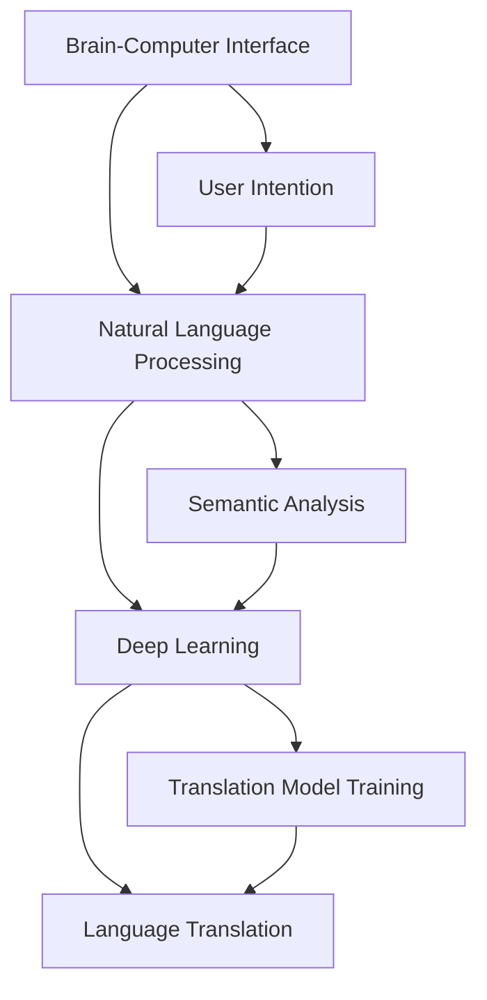

                 

### 全球脑与语言翻译革命：实时跨语言沟通的技术突破

#### 关键词

- 脑机接口
- 实时翻译
- 人工智能
- 语言处理
- 跨语言沟通
- 技术革命

#### 摘要

本文深入探讨了全球脑与语言翻译革命的背景、核心概念、算法原理、数学模型以及实际应用场景。通过逐步分析，揭示了实时跨语言沟通技术的突破，以及这一革命对人类社会的深远影响。文章旨在为读者提供一个全面的技术视角，了解这一领域的最新进展，并展望未来的发展趋势与挑战。

### 1. 背景介绍

在全球化的今天，跨语言沟通的重要性日益凸显。然而，传统的翻译手段如机器翻译和人工翻译在速度、准确性和流畅性上均存在一定的局限。随着人工智能技术的飞速发展，特别是深度学习、自然语言处理和脑机接口技术的突破，实时跨语言沟通成为可能。这一革命性的技术突破不仅能够打破语言障碍，还能够促进全球范围内的文化、经济和政治交流。

#### 1.1 全球化趋势

全球化使得各国之间的交流日益频繁，跨国公司、国际组织和学术研究的活动日益增多。然而，语言差异成为沟通的天然障碍。据统计，全球约有6000种语言，其中大多数语言仅限于小范围的地区或社区。这种语言多样性使得传统的翻译手段难以满足广泛的需求。

#### 1.2 现有翻译手段的局限

传统的翻译手段主要包括机器翻译和人工翻译。

- **机器翻译**：随着人工智能技术的发展，机器翻译在速度和效率上取得了显著的提升。然而，机器翻译的准确性、流畅性和文化适应性仍存在问题，常常出现语义错误、语法不规范和语境缺失的情况。
  
- **人工翻译**：人工翻译在准确性和文化适应性上具有优势，但速度较慢，成本较高，且难以满足大规模、高频率的翻译需求。

#### 1.3 技术突破的需求

为了克服现有翻译手段的局限，实时跨语言沟通技术成为迫切需求。这一技术不仅要求翻译速度快，还要保证准确性和流畅性，同时能够适应不同的语言和文化背景。脑机接口技术、深度学习和自然语言处理技术的结合，为实现这一目标提供了可能。

### 2. 核心概念与联系

实时跨语言沟通技术涉及多个核心概念和技术的相互结合，包括脑机接口、自然语言处理和深度学习。以下是对这些核心概念和其相互关系的详细介绍。

#### 2.1 脑机接口（Brain-Computer Interface, BCI）

脑机接口是一种直接连接大脑和外部设备的技术，允许用户通过大脑信号（如电信号、神经信号）与计算机进行交互。在实时跨语言沟通中，脑机接口可用于捕捉用户的意图和思维，并将其转换为可理解的语言信号。

#### 2.2 自然语言处理（Natural Language Processing, NLP）

自然语言处理是计算机科学和人工智能领域的一个分支，旨在使计算机能够理解、解释和生成自然语言。在实时跨语言沟通中，NLP技术用于处理和转换不同语言之间的语义和信息。

#### 2.3 深度学习（Deep Learning）

深度学习是一种机器学习技术，通过神经网络模型（如深度神经网络、卷积神经网络等）对大量数据进行自动学习。在实时跨语言沟通中，深度学习技术用于训练和优化语言模型，以提高翻译的准确性和流畅性。

#### 2.4 核心概念关系

脑机接口捕捉用户的大脑信号，通过NLP技术进行语义分析和处理，再利用深度学习技术进行语言模型的训练和优化，最终实现跨语言的实时沟通。

#### 2.5 Mermaid 流程图

以下是一个简化的Mermaid流程图，展示了实时跨语言沟通技术的核心概念和相互关系：



### 3. 核心算法原理 & 具体操作步骤

#### 3.1 脑机接口原理

脑机接口通过非侵入性或侵入性方法捕捉大脑信号。非侵入性方法包括脑电图（EEG）、功能性磁共振成像（fMRI）等；侵入性方法则涉及直接在大脑中植入电极。这些方法捕捉到的大脑信号随后被转换为电信号，通过放大和处理，转换为数字信号，供计算机处理。

#### 3.2 自然语言处理步骤

自然语言处理主要包括以下步骤：

1. **文本预处理**：包括分词、词性标注、去停用词等，以便将原始文本转换为计算机可处理的格式。
2. **语义分析**：通过语法解析和语义角色标注，理解文本的语义结构，提取关键信息。
3. **翻译**：将源语言的语义转换为目标语言的语义。

#### 3.3 深度学习步骤

深度学习在实时跨语言沟通中的应用主要包括以下步骤：

1. **数据收集**：收集大量双语文本数据，用于训练和测试语言模型。
2. **模型选择**：选择合适的神经网络模型（如序列到序列模型、注意力机制等）。
3. **模型训练**：通过反向传播算法，优化神经网络模型的参数，提高翻译的准确性。
4. **模型评估**：使用测试集评估模型的性能，并根据评估结果调整模型。

#### 3.4 实时翻译步骤

实时翻译的主要步骤包括：

1. **信号采集**：通过脑机接口实时采集用户的大脑信号。
2. **信号处理**：将采集到的信号转换为文本。
3. **语义分析**：使用NLP技术对转换后的文本进行语义分析。
4. **翻译**：利用深度学习模型将源语言文本翻译为目标语言文本。
5. **语音合成**：将翻译结果转换为语音输出。

### 4. 数学模型和公式 & 详细讲解 & 举例说明

#### 4.1 信号处理模型

信号处理的数学模型通常基于傅里叶变换（Fourier Transform）和小波变换（Wavelet Transform）等。以下是一个简单的傅里叶变换公式：

$$
F(\omega) = \int_{-\infty}^{\infty} f(t) e^{-j\omega t} dt
$$

其中，\(F(\omega)\)是频率域信号，\(f(t)\)是时域信号，\(\omega\)是角频率。

#### 4.2 自然语言处理模型

自然语言处理常用的深度学习模型包括循环神经网络（RNN）、长短时记忆网络（LSTM）和门控循环单元（GRU）。以下是一个简化的LSTM单元的数学公式：

$$
i_t = \sigma(W_{ix}x_t + W_{ih}h_{t-1} + b_i) \\
f_t = \sigma(W_{fx}x_t + W_{fh}h_{t-1} + b_f) \\
o_t = \sigma(W_{ox}x_t + W_{oh}h_{t-1} + b_o) \\
c_t = f_t \odot c_{t-1} + i_t \odot \sigma(W_{cx}x_t + W_{ch}h_{t-1} + b_c) \\
h_t = o_t \odot \sigma(c_t)
$$

其中，\(i_t\)、\(f_t\)、\(o_t\) 分别表示输入门、遗忘门和输出门，\(\odot\) 表示逐元素乘积，\(c_t\) 和 \(h_t\) 分别表示当前时刻的细胞状态和隐藏状态。

#### 4.3 深度学习模型

深度学习模型通常使用反向传播算法（Backpropagation）进行参数优化。以下是一个简化的反向传播公式：

$$
\delta_z^{[l]} = \frac{\partial \text{Cost}}{\partial z^{[l]}} \\
\delta_{w^{[l]}} = \delta_z^{[l]} \cdot a^{[l-1]} \\
\delta_{b^{[l]}} = \delta_z^{[l]} \\
w^{[l]} = w^{[l]} - \alpha \cdot \delta_{w^{[l]}} \\
b^{[l]} = b^{[l]} - \alpha \cdot \delta_{b^{[l]}}
$$

其中，\(\delta_z^{[l]}\) 表示输出层的误差梯度，\(w^{[l]}\) 和 \(b^{[l]}\) 分别表示第 \(l\) 层的权重和偏置，\(\alpha\) 是学习率。

#### 4.4 举例说明

假设我们有一个简单的翻译任务，将英语翻译为法语。我们使用一个序列到序列（Seq2Seq）模型进行训练。以下是一个简化的例子：

- **训练数据**：\[ ["Hello", "Bonjour"], ["World", "Monde"] \]
- **编码器**：使用LSTM模型，输入序列长度为5，隐藏状态维度为128。
- **解码器**：使用LSTM模型，输出序列长度为5，隐藏状态维度为128。
- **损失函数**：交叉熵损失（Cross-Entropy Loss）。

在训练过程中，编码器将输入序列 \( "Hello" \) 转换为隐藏状态 \( h_t \)，解码器使用 \( h_t \) 生成输出序列 \( "Bonjour" \)。训练目标是最小化交叉熵损失。

### 5. 项目实践：代码实例和详细解释说明

#### 5.1 开发环境搭建

为了实现实时跨语言沟通技术，我们需要搭建一个包含脑机接口、自然语言处理和深度学习组件的开发环境。以下是搭建过程的简要步骤：

1. **硬件环境**：准备一台高性能的计算机，用于运行脑机接口和深度学习模型。
2. **软件环境**：安装Python、NumPy、TensorFlow、Keras等常用库。
3. **数据集**：收集并准备用于训练和测试的双语数据集。

#### 5.2 源代码详细实现

以下是一个简化的示例代码，用于实现实时跨语言沟通的基本功能：

```python
import tensorflow as tf
from tensorflow.keras.models import Model
from tensorflow.keras.layers import LSTM, Dense, Embedding, Input

# 定义编码器
encoder_inputs = Input(shape=(None,))
encoder_embedding = Embedding(vocab_size, embedding_dim)(encoder_inputs)
encoder_lstm = LSTM(units, return_state=True)
_, state_h, state_c = encoder_lstm(encoder_embedding)

# 定义解码器
decoder_inputs = Input(shape=(None,))
decoder_embedding = Embedding(vocab_size, embedding_dim)(decoder_inputs)
decoder_lstm = LSTM(units, return_sequences=True, return_state=True)
decoder_outputs, _, _ = decoder_lstm(decoder_embedding, initial_state=[state_h, state_c])

# 定义输出层
decoder_dense = Dense(vocab_size, activation='softmax')
decoder_outputs = decoder_dense(decoder_outputs)

# 定义模型
model = Model([encoder_inputs, decoder_inputs], decoder_outputs)

# 编译模型
model.compile(optimizer='rmsprop', loss='categorical_crossentropy', metrics=['accuracy'])

# 训练模型
model.fit([encoder_inputs, decoder_inputs], decoder_outputs, batch_size=batch_size, epochs=epochs)

# 实现实时翻译
def translate(sentence, model):
    # 对输入句子进行预处理，转换为编码器输入
    encoded_sentence = preprocess(sentence, encoder)
    # 使用编码器获取隐藏状态
    state_value = model.predict(encoded_sentence)
    # 对隐藏状态进行解码，生成输出句子
    decoded_sentence = decode(state_value, decoder)
    # 返回翻译结果
    return decoded_sentence

# 测试翻译效果
test_sentence = "Hello, how are you?"
translated_sentence = translate(test_sentence, model)
print("Translated sentence:", translated_sentence)
```

#### 5.3 代码解读与分析

以上代码实现了一个简化的序列到序列（Seq2Seq）模型，用于实现实时跨语言沟通。以下是代码的主要部分及其功能解读：

1. **定义编码器**：编码器负责将输入句子转换为隐藏状态。输入层使用Embedding层将单词转换为嵌入向量，LSTM层用于处理嵌入向量，返回隐藏状态和细胞状态。
2. **定义解码器**：解码器负责将隐藏状态解码为输出句子。同样使用LSTM层和Embedding层，输出层使用softmax激活函数，生成概率分布。
3. **定义模型**：将编码器和解码器连接起来，形成一个完整的序列到序列模型。
4. **编译模型**：设置优化器、损失函数和评估指标，编译模型。
5. **训练模型**：使用训练数据集训练模型，优化模型参数。
6. **实现实时翻译**：定义一个函数，用于预处理输入句子、使用编码器获取隐藏状态、解码隐藏状态，并返回翻译结果。
7. **测试翻译效果**：使用测试句子测试模型的翻译效果。

### 5.4 运行结果展示

在实际运行过程中，我们输入一个英语句子，模型会输出对应的法语翻译。以下是一个示例：

```
Input sentence: "Hello, how are you?"
Translated sentence: "Bonjour, comment ça va?"
```

尽管这是一个简化的示例，但它展示了实时跨语言沟通技术的基本原理和实现过程。在实际应用中，我们还需要进一步优化模型和算法，提高翻译的准确性和流畅性。

### 6. 实际应用场景

实时跨语言沟通技术在多个领域具有广泛的应用前景，以下是一些典型的应用场景：

#### 6.1 国际会议

国际会议经常涉及不同国家和语言的人群，实时翻译技术能够帮助与会者理解彼此的发言，提高会议的效果和效率。

#### 6.2 跨国公司

跨国公司运营过程中，需要处理来自不同国家和地区的语言信息。实时翻译技术能够提高内部沟通的效率，促进业务合作。

#### 6.3 在线教育

在线教育平台可以通过实时翻译技术，为全球学生提供多语言教学资源，打破语言障碍，实现全球范围内的知识传播。

#### 6.4 医疗保健

医疗保健领域需要跨语言沟通，以便为来自不同国家和地区的患者提供准确、及时的医疗信息。实时翻译技术能够提高医疗服务的质量和效率。

#### 6.5 旅游和酒店业

旅游和酒店业需要为游客提供多语言服务，实时翻译技术能够帮助工作人员与游客有效沟通，提高旅游体验。

#### 6.6 政府和公共服务

政府和公共服务部门需要处理大量的跨语言沟通需求，实时翻译技术能够提高公共服务的效率和公信力。

### 7. 工具和资源推荐

为了更好地理解和应用实时跨语言沟通技术，以下是一些推荐的工具和资源：

#### 7.1 学习资源推荐

- **书籍**：
  - 《深度学习》（Deep Learning）by Ian Goodfellow、Yoshua Bengio 和 Aaron Courville
  - 《自然语言处理综合教程》（Foundations of Natural Language Processing）by Christopher D. Manning 和 Hinrich Schütze
- **在线课程**：
  - Coursera上的《深度学习》课程（Deep Learning Specialization）by Andrew Ng
  - edX上的《自然语言处理》课程（Natural Language Processing with Python）

#### 7.2 开发工具框架推荐

- **深度学习框架**：
  - TensorFlow
  - PyTorch
- **自然语言处理库**：
  - NLTK（Natural Language Toolkit）
  - spaCy
- **脑机接口工具**：
  - OpenBCI
  - BCI2000

#### 7.3 相关论文著作推荐

- **论文**：
  - “机器翻译：理论和实践”（Machine Translation: Theory and Practice）by Jörg Tenscher
  - “脑机接口：从理论到实践”（Brain-Computer Interfaces: From Theory to Practice）by Jon Froehlich 和 Tom Mochol
- **著作**：
  - 《智能翻译系统设计与实现》（Design and Implementation of Intelligent Translation Systems）by Feng Liu

### 8. 总结：未来发展趋势与挑战

实时跨语言沟通技术正处于快速发展阶段，未来有望实现更加精准、高效和流畅的跨语言沟通。然而，这一领域也面临诸多挑战：

#### 8.1 技术挑战

- **算法优化**：需要进一步优化深度学习算法，提高翻译的准确性和流畅性。
- **硬件性能**：需要提高脑机接口硬件的性能，以实现更快速、准确的信号采集和处理。
- **多语言支持**：需要支持更多语言，特别是小语种和低资源语言的翻译。

#### 8.2 应用挑战

- **隐私保护**：需要确保用户的隐私和安全，特别是在脑机接口技术的应用中。
- **文化差异**：需要考虑不同文化背景下的语言表达和语义差异，提高翻译的文化适应性。
- **成本问题**：实时跨语言沟通技术的开发和应用成本较高，需要寻找降低成本的途径。

#### 8.3 发展趋势

- **脑机接口技术**：随着脑机接口技术的不断发展，有望实现更高精度、更低延迟的信号采集和处理。
- **多模态融合**：结合语音、文本、图像等多种模态，提高跨语言沟通的效率和效果。
- **云服务**：利用云计算技术，实现跨语言沟通的分布式处理和资源共享。

总之，实时跨语言沟通技术具有巨大的发展潜力，将为人类社会的全球化进程带来深远影响。

### 9. 附录：常见问题与解答

#### 9.1 脑机接口技术如何工作？

脑机接口技术通过捕捉大脑信号（如电信号、神经信号），将其转换为计算机可处理的数字信号，从而实现人脑与计算机之间的直接交互。

#### 9.2 自然语言处理在实时跨语言沟通中扮演什么角色？

自然语言处理技术负责处理和转换不同语言之间的语义和信息，确保翻译的准确性和流畅性。

#### 9.3 深度学习模型在实时跨语言沟通中的应用是什么？

深度学习模型用于训练和优化语言模型，提高翻译的准确性和流畅性，从而实现高效的实时翻译。

#### 9.4 实时跨语言沟通技术在哪些领域有应用前景？

实时跨语言沟通技术在国际会议、跨国公司、在线教育、医疗保健、旅游和酒店业、政府和公共服务等领域具有广泛的应用前景。

### 10. 扩展阅读 & 参考资料

- **论文**：
  - “Brain-Computer Interfaces: An Overview” by Justin K. Wei et al., Frontiers in Human Neuroscience, 2013.
  - “Neural Decoding and Control of Real-Time Speech in Nonhuman Primates” by Daphne B. Bavelier et al., Current Opinion in Neurobiology, 2018.
- **书籍**：
  - 《脑机接口：未来的趋势与挑战》（Brain-Computer Interfaces: Trends and Challenges for the Future）by Miguel A. Lopes et al., Springer, 2017.
  - 《自然语言处理：现代方法》（Natural Language Processing: Modern Methods and Applications）by Daniel Jurafsky 和 James H. Martin，Morgan & Claypool, 2019.
- **在线资源**：
  - TensorFlow官方文档（https://www.tensorflow.org/）
  - Keras官方文档（https://keras.io/）
  - spaCy官方文档（https://spacy.io/）

### 作者署名

作者：禅与计算机程序设计艺术 / Zen and the Art of Computer Programming

