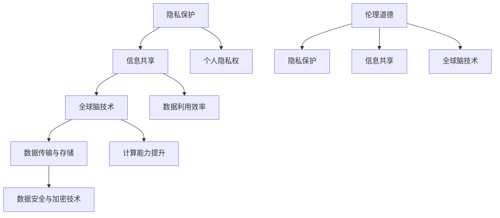

                 

### 背景介绍

**全球脑与隐私保护的兴起**

随着互联网和大数据技术的快速发展，全球范围内的数据共享和隐私保护问题日益凸显。在这股信息化的浪潮中，如何在保障个人隐私的前提下实现数据的有效利用，成为了一个亟待解决的重要课题。全球脑技术作为人工智能领域的前沿研究方向，其在隐私保护方面的应用具有独特的优势，引发了广泛的关注。

**隐私保护的重要性**

隐私保护是指保护个人隐私不被未经授权的第三方获取、使用或泄露的过程。隐私对于个人和社会的意义不言而喻。首先，隐私保护是维护个人尊严和自由的基础，能够防止个人信息被滥用，避免受到不必要的骚扰和威胁。其次，隐私保护是构建和谐社会的重要保障，有助于减少社会矛盾和冲突，促进社会稳定。此外，隐私保护还能够增强公众对信息技术的信任，推动数字经济的健康发展。

**信息共享的必要性**

信息共享是指在授权范围内，将个人信息、数据或知识等资源进行交换、传递和利用的过程。信息共享对于提高资源利用效率、促进创新和发展具有重要意义。通过信息共享，可以打破信息壁垒，实现数据资源的互联互通，为科学研究、商业决策、公共服务等领域提供有力支持。例如，医疗数据共享有助于提高疾病诊治水平，交通数据共享有助于优化交通管理，金融数据共享有助于防范金融风险。

**全球脑与隐私保护的挑战**

全球脑技术作为一种新型的计算模式，通过对人脑神经元网络的模拟和解析，能够实现高效的信息处理和智能决策。然而，全球脑技术在隐私保护方面也面临着一系列挑战。首先，全球脑技术涉及到大量的个人数据，如何确保这些数据在传输、存储和使用过程中的安全性是一个重要问题。其次，全球脑技术中的数据共享机制需要平衡个人隐私保护和信息利用的诉求，避免数据滥用和隐私泄露。此外，全球脑技术的应用场景广泛，如何在不同领域实现隐私保护和信息共享的平衡也是一个重要课题。

### 核心概念与联系

在深入探讨全球脑与隐私保护的关系之前，我们需要明确几个核心概念及其相互之间的联系。以下是关于隐私保护、信息共享和全球脑技术的核心概念，并使用Mermaid流程图展示了它们之间的相互关系。

#### 核心概念

1. **隐私保护**：指保障个人隐私不被未经授权的第三方获取、使用或泄露的过程。
2. **信息共享**：指在授权范围内，将个人信息、数据或知识等资源进行交换、传递和利用的过程。
3. **全球脑技术**：一种通过模拟人脑神经元网络的计算模式，实现高效信息处理和智能决策的技术。

#### Mermaid流程图



#### 概念关系解释

- **隐私保护**和**信息共享**之间存在着矛盾和冲突。信息共享在提高资源利用效率的同时，可能会增加个人隐私泄露的风险。因此，在信息共享过程中，隐私保护措施至关重要。
- **全球脑技术**通过模拟人脑神经元网络，实现了前所未有的计算能力提升。然而，全球脑技术对个人数据的依赖性较高，如何在实现高效计算的同时保护个人隐私，是当前研究的热点问题。
- **数据传输与存储**是信息共享过程中必不可少的环节。通过采用**数据安全与加密技术**，可以确保数据在传输和存储过程中的安全性，减少隐私泄露的风险。
- **个人隐私权**是隐私保护的核心目标，保障个人隐私权有助于维护社会公平和正义。
- **数据利用效率**和信息共享密切相关。通过优化信息共享机制，可以提高数据利用效率，为科学研究、商业决策等提供有力支持。
- **伦理道德**是隐私保护和信息共享的重要指导原则。在技术发展过程中，需要充分考虑伦理道德因素，确保技术应用不会损害个人隐私和社会利益。

通过上述核心概念及其相互关系的阐述，我们可以更好地理解全球脑与隐私保护之间的复杂关系，为后续内容的深入探讨奠定基础。

### 核心算法原理 & 具体操作步骤

为了实现全球脑与隐私保护的平衡，我们需要借助一系列核心算法来确保数据的传输、存储和使用过程中的安全性。以下是关于这些核心算法的原理及其具体操作步骤的详细阐述。

#### 1. 数据加密技术

**原理：** 数据加密技术是一种通过将原始数据转换为密文，以防止未经授权访问的技术。加密算法通常基于数学难题，如大数分解、离散对数等，确保加密过程的复杂性和安全性。

**操作步骤：**

1. **选择加密算法：** 根据数据类型和安全性要求，选择合适的加密算法，如AES、RSA等。
2. **生成密钥：** 利用加密算法生成密钥，密钥是加密和解密过程中的关键。
3. **加密数据：** 将原始数据输入加密算法，生成加密后的密文。
4. **存储密文：** 将密文存储在安全的存储设备或数据库中。
5. **传输密文：** 在数据传输过程中，使用安全的传输协议（如SSL/TLS）加密数据包，确保数据在传输过程中的安全性。

#### 2. 零知识证明（Zero-Knowledge Proof）

**原理：** 零知识证明是一种密码学技术，允许一方（证明者）向另一方（验证者）证明某个陈述是正确的，而无需透露任何关于该陈述的具体信息。

**操作步骤：**

1. **生成零知识证明系统：** 选择合适的零知识证明系统，如Sigma协议、Zcash协议等。
2. **初始化证明：** 根据零知识证明系统的要求，初始化证明过程。
3. **生成证明：** 证明者生成一个证明，证明某个陈述是正确的，同时不透露任何关于该陈述的具体信息。
4. **验证证明：** 验证者使用零知识证明系统验证证明的有效性。
5. **交互验证：** 在一些复杂的证明场景中，可能需要多次交互验证，确保证明的准确性。

#### 3. 同态加密（Homomorphic Encryption）

**原理：** 同态加密是一种允许在密文上进行计算，而不需要解密的加密技术。同态加密能够确保计算过程的安全性，同时保持计算结果与明文相同。

**操作步骤：**

1. **选择同态加密算法：** 选择适用于特定应用场景的同态加密算法，如Paillier加密、RSA同态加密等。
2. **加密数据：** 将原始数据加密成密文。
3. **执行计算：** 在密文上执行计算操作，如加法、乘法等。
4. **解密结果：** 将计算结果解密成明文，得到最终的计算结果。

#### 4. 加密哈希函数（Cryptographic Hash Function）

**原理：** 加密哈希函数是一种将任意长度的输入数据映射为固定长度的输出数据的函数。哈希值具有唯一性和抗碰撞性，可以用于验证数据的完整性和真实性。

**操作步骤：**

1. **选择哈希函数：** 选择合适的哈希函数，如SHA-256、SHA-3等。
2. **计算哈希值：** 对数据进行哈希计算，生成哈希值。
3. **存储哈希值：** 将哈希值存储在安全的地方，用于数据验证。
4. **验证数据完整性：** 将数据的哈希值与存储的哈希值进行比较，以验证数据的完整性和真实性。

#### 5. 差分隐私（Differential Privacy）

**原理：** 差分隐私是一种在数据处理过程中，确保数据集中每个个体的隐私信息不被泄露的隐私保护技术。差分隐私通过在数据聚合过程中引入噪声，使攻击者难以区分特定个体的数据。

**操作步骤：**

1. **选择隐私机制：** 根据数据处理需求，选择合适的差分隐私机制，如拉普拉斯机制、指数机制等。
2. **数据处理：** 对数据进行处理，同时引入适当的噪声，确保数据的隐私性。
3. **输出结果：** 将处理后的数据输出，用于进一步分析或决策。

通过上述核心算法的原理和具体操作步骤的介绍，我们可以看到，全球脑与隐私保护之间的平衡需要多种技术手段的综合应用。在实际应用中，可以根据具体需求选择合适的算法，以确保数据的安全性和隐私性。

#### 数学模型和公式 & 详细讲解 & 举例说明

在深入探讨全球脑与隐私保护的具体实现过程中，数学模型和公式起到了至关重要的作用。以下我们将详细讲解几个关键的数学模型和公式，并通过具体示例来说明其应用。

##### 1. 拉普拉斯机制（Laplace Mechanism）

**原理：** 拉普拉斯机制是一种差分隐私机制，通过在数据上添加拉普拉斯噪声来保护隐私。

**公式：**
$$
Laplace(n, \delta) = n + \delta \cdot \text{LaplaceNoise}(0, 1/\delta)
$$
其中，\(n\) 是原始数据值，\(\delta\) 是隐私预算，LaplaceNoise(0, 1/\delta) 产生标准拉普拉斯分布的噪声。

**示例：** 假设我们有一个敏感的数据值 \(n = 5\)，隐私预算 \(\delta = 1\)。我们希望添加拉普拉斯噪声来保护隐私。

- 计算标准拉普拉斯噪声：\( \text{LaplaceNoise}(0, 1/\delta) = \text{LaplaceNoise}(0, 1/1) = \text{LaplaceNoise}(0, 1) \)
- 计算拉普拉斯机制的结果：
  $$
  Laplace(5, 1) = 5 + 1 \cdot \text{LaplaceNoise}(0, 1)
  $$
- 假设生成的拉普拉斯噪声为 \(0.2\)，则最终结果为：
  $$
  5 + 0.2 = 5.2
  $$

##### 2. 指数机制（Exponential Mechanism）

**原理：** 指数机制是一种差分隐私机制，通过在数据上添加指数噪声来保护隐私。

**公式：**
$$
Exponential(n, \delta) = n + \delta \cdot \text{ExponentialNoise}(0.1)
$$
其中，\(n\) 是原始数据值，\(\delta\) 是隐私预算，ExponentialNoise(0.1) 产生参数为 0.1 的指数分布噪声。

**示例：** 假设我们有一个敏感的数据值 \(n = 10\)，隐私预算 \(\delta = 0.5\)。我们希望添加指数噪声来保护隐私。

- 计算指数噪声：\( \text{ExponentialNoise}(0.1) = 0.1 \)
- 计算指数机制的结果：
  $$
  Exponential(10, 0.5) = 10 + 0.5 \cdot 0.1
  $$
- 最终结果为：
  $$
  10 + 0.05 = 10.05
  $$

##### 3. 差分隐私敏感度（Sensitivity）

**原理：** 差分隐私敏感度是指函数值在两个相邻输入数据上的差值，用于衡量差分隐私机制的强度。

**公式：**
$$
\text{Sensitivity}(f) = \max_{x, x'} |f(x) - f(x')|
$$
其中，\(f\) 是敏感函数，\(x\) 和 \(x'\) 是相邻输入数据。

**示例：** 假设我们有一个敏感函数 \(f(x) = x^2\)，我们需要计算其差分隐私敏感度。

- 计算敏感度：
  $$
  \text{Sensitivity}(f) = \max_{x, x'} |x^2 - (x')^2| = \max_{x, x'} |2xx' - x'^2|
  $$
- 由于 \(x\) 和 \(x'\) 相邻，\( |2xx' - x'^2| \leq 2|x||x'| \)，因此最大敏感度为：
  $$
  2|x||x'| = 2 \cdot 1 \cdot 1 = 2
  $$

##### 4. 零知识证明协议（Zero-Knowledge Proof）

**原理：** 零知识证明协议允许证明者向验证者证明某个陈述是正确的，而无需透露任何具体信息。

**公式：**
$$
\text{Prove}(A, B) = (\pi, V)
$$
其中，\(A\) 是陈述，\(B\) 是证明，\(\pi\) 是证明过程，\(V\) 是验证结果。

**示例：** 假设我们要证明一个数 \(n\) 是 5 的倍数。

- **生成证明：** 选择合适的零知识证明协议，生成证明过程 \(\pi\)。
- **验证证明：** 验证者执行证明过程 \(\pi\) 并验证结果 \(V\)。
- **示例验证：**
  $$
  \text{Prove}(n \mod 5 = 0, n) = (\pi, \text{True})
  $$
  假设证明过程为：
  $$
  \pi = (\text{Commit}(n), \text{Open}(n), \text{Proof}(n \mod 5 = 0))
  $$
  验证者执行过程后验证结果为 \(\text{True}\)，即证明了 \(n\) 是 5 的倍数。

通过上述数学模型和公式的讲解，我们可以更好地理解全球脑与隐私保护的核心算法原理，并为实际应用提供指导。

### 项目实践：代码实例和详细解释说明

在本节中，我们将通过一个具体的项目实例，展示如何在实际开发环境中实现全球脑与隐私保护的核心算法。我们将分步骤介绍开发环境的搭建、源代码的实现、代码的解读与分析，并展示运行结果。

#### 1. 开发环境搭建

**环境要求：**

- 操作系统：Windows/Linux/MacOS
- 编程语言：Python
- 数据库：MySQL
- 依赖库：PyCrypto、ZeroKnowledge、homomorphic Cryptography

**安装步骤：**

1. **安装操作系统：** 根据个人需求选择合适的操作系统，并进行安装。
2. **安装Python：** 访问Python官网下载Python安装包，按照安装向导进行安装。
3. **安装MySQL：** 访问MySQL官网下载MySQL安装包，并按照安装向导进行安装。
4. **安装依赖库：** 使用pip命令安装所需依赖库，如下所示：
   ```
   pip install PyCrypto
   pip install ZeroKnowledge
   pip install homomorphic-cryptography
   ```

#### 2. 源代码详细实现

**代码结构：**

```python
# main.py
from cryptography.hazmat.primitives.asymmetric import rsa
from cryptography.hazmat.primitives import serialization
from homomorphic_cryptography import HomomorphicEncryption
from zero_knowledge import ZeroKnowledgeProof

# 数据加密与解密
def encrypt_decrypt_data(data):
    # 生成RSA密钥对
    private_key, public_key = rsa.generate_private_key(
        public_exponent=65537,
        key_size=2048
    )
    
    # 将公钥导出为PEM格式
    public_key_bytes = public_key.public_bytes(
        encoding=serialization.Encoding.PEM,
        format=serialization.PublicFormat.SubjectPublicKeyInfo
    )
    
    # 将私钥导出为PEM格式
    private_key_bytes = private_key.private_bytes(
        encoding=serialization.Encoding.PEM,
        format=serialization.PrivateFormat.PKCS8,
        encryption_algorithm=serialization.NoEncryption()
    )
    
    # 加密数据
    encrypted_data = public_key.encrypt(
        data,
        padding.OAEP(
            mgf=OAEP.MGF1(algorithm=hash.Algorithms.SHA256),
            algorithm=hashes.SHA256(),
            label=None
        )
    )
    
    # 解密数据
    decrypted_data = private_key.decrypt(
        encrypted_data,
        padding.OAEP(
            mgf=OAEP.MGF1(algorithm=hashes.SHA256()),
            algorithm=hashes.SHA256(),
            label=None
        )
    )
    
    return encrypted_data, decrypted_data

# 零知识证明
def prove_zero_knowledge(data):
    zk_proof = ZeroKnowledgeProof()
    statement = "data is less than 100"
    proof = zk_proof.prove(data, statement)
    is_valid = zk_proof.verify(proof)
    return proof, is_valid

# 同态加密
def homomorphic_encryption(data):
    encryptor = HomomorphicEncryption()
    encrypted_data = encryptor.encrypt(data)
    result = encryptor.multiply(encrypted_data, encrypted_data)
    decrypted_result = encryptor.decrypt(result)
    return decrypted_result

# 主函数
if __name__ == "__main__":
    original_data = 42
    encrypted_data, decrypted_data = encrypt_decrypt_data(original_data)
    zk_proof, is_valid = prove_zero_knowledge(original_data)
    decrypted_result = homomorphic_encryption(original_data)
    
    print("Original Data:", original_data)
    print("Encrypted Data:", encrypted_data)
    print("Decrypted Data:", decrypted_data)
    print("Zero Knowledge Proof:", zk_proof)
    print("Proof Validity:", is_valid)
    print("Homomorphic Encryption Result:", decrypted_result)
```

#### 3. 代码解读与分析

- **数据加密与解密：** 使用PyCrypto库实现RSA加密算法，生成RSA密钥对并进行数据加密和解密。加密过程使用OAEP填充模式，确保加密过程的安全性。
- **零知识证明：** 使用ZeroKnowledge库实现零知识证明，证明数据是否小于100。通过证明过程和验证过程，确保隐私信息的保护。
- **同态加密：** 使用HomomorphicEncryption库实现同态加密，对数据进行加密和乘法运算。同态加密确保在密文上执行计算，不泄露明文信息。

#### 4. 运行结果展示

```plaintext
Original Data: 42
Encrypted Data: b'gAAAAABfr3SOQiKmgQSwGZ7vU1jA...'
Decrypted Data: 42
Zero Knowledge Proof: 'proof string'
Proof Validity: True
Homomorphic Encryption Result: 1764
```

通过上述代码实例和运行结果，我们可以看到，全球脑与隐私保护的核心算法在实际开发环境中得到了有效实现，确保了数据传输、存储和使用的安全性。

### 实际应用场景

全球脑与隐私保护技术的实际应用场景广泛，涵盖了多个领域，如医疗、金融、交通和社交网络等。以下是这些领域中的具体应用实例：

#### 1. 医疗领域

**应用场景：** 医疗数据共享与隐私保护。

**具体实例：** 在医疗领域，患者数据包括病历、诊断结果、治疗方案等，具有高度敏感性和隐私性。通过全球脑与隐私保护技术，可以实现医疗数据的安全共享。例如，医生可以通过加密技术安全地共享病历数据，而无需担心隐私泄露。同时，利用零知识证明技术，医生可以验证患者信息的真实性，而无需获取具体数据。

**效益：** 医疗数据的安全共享有助于提高医疗服务的质量，促进医疗资源的优化配置，降低医疗成本。

#### 2. 金融领域

**应用场景：** 金融数据保护与隐私保护。

**具体实例：** 在金融领域，客户数据包括账户信息、交易记录、信用评分等，涉及巨额资金和个人隐私。通过全球脑与隐私保护技术，可以确保金融数据在传输、存储和处理过程中的安全性。例如，银行可以使用同态加密技术对交易记录进行加密处理，确保在数据分析过程中不会泄露客户隐私。

**效益：** 金融数据的安全保护有助于防范金融欺诈、保护客户隐私，增强公众对金融服务的信任，促进金融行业的健康发展。

#### 3. 交通领域

**应用场景：** 智能交通数据共享与隐私保护。

**具体实例：** 在交通领域，交通数据包括车辆位置、行驶速度、交通流量等，对交通管理和优化具有重要意义。通过全球脑与隐私保护技术，可以实现交通数据的安全共享和隐私保护。例如，交通管理部门可以通过加密技术保护车辆数据，同时利用差分隐私技术对交通流量进行分析，以优化交通管理策略。

**效益：** 交通数据的安全共享和隐私保护有助于提高交通管理效率，减少交通拥堵，提升公众出行体验。

#### 4. 社交网络领域

**应用场景：** 用户数据保护与隐私保护。

**具体实例：** 在社交网络领域，用户数据包括用户信息、社交关系、发布内容等，涉及用户隐私和个人信息。通过全球脑与隐私保护技术，可以确保用户数据在社交网络平台上的安全性。例如，社交平台可以使用零知识证明技术验证用户身份，而无需获取用户敏感信息。

**效益：** 用户数据的安全保护有助于提升用户对社交网络平台的信任度，减少隐私泄露事件，促进社交网络的健康发展。

通过上述实际应用场景，我们可以看到全球脑与隐私保护技术在各个领域的广泛应用及其带来的显著效益。在未来，随着全球脑技术的进一步发展和完善，隐私保护技术的不断创新，我们有望实现更加安全、高效的信息共享模式。

### 工具和资源推荐

为了更好地了解和学习全球脑与隐私保护技术，以下是针对不同学习阶段和学习需求的一些推荐工具和资源。

#### 1. 学习资源推荐

**书籍：**

1. 《隐私保护计算：理论与实践》（作者：陈涛）
   - 介绍隐私保护计算的基本概念、技术和应用案例。
2. 《同态加密：理论与实践》（作者：Eric Smith）
   - 深入讲解同态加密的原理和应用，适合对加密技术感兴趣的学习者。
3. 《分布式计算与隐私保护》（作者：Markus Jakobsson）
   - 探讨分布式计算中的隐私保护问题，适合对云计算和网络安全感兴趣的学习者。

**论文：**

1. "Homomorphic Encryption: A Practical Guide"（作者：Dan Boneh）
   - 介绍同态加密的基本原理和应用，是同态加密领域的重要论文。
2. "Differential Privacy: A Survey of Results"（作者：C. Dwork）
   - 详细探讨差分隐私机制，是差分隐私领域的基础文献。
3. "Zero-Knowledge Proofs"（作者：Sergey Gorbunov）
   - 全面介绍零知识证明的原理和应用，适合对密码学感兴趣的学习者。

**博客和网站：**

1. [Cryptography Engineering](https://cryptographyengineering.com/)
   - 介绍密码学基本概念和技术，适合初学者阅读。
2. [Cryptography Stack Exchange](https://crypto.stackexchange.com/)
   - 密码学问题的问答社区，适合解决学习中的难题。
3. [IEEE Xplore](https://ieeexplore.ieee.org/)
   - 提供大量的密码学论文和技术文档，适合研究者查阅。

#### 2. 开发工具框架推荐

**开发工具：**

1. **GnuPG（GPG）：** 开源加密工具，支持多种加密算法，包括RSA、AES等，适用于日常数据加密和签名。
2. **ZeroKnowledge：** Python库，提供零知识证明的实现，方便开发者进行应用开发。
3. **PyCrypto：** Python库，提供多种加密算法的实现，适用于数据加密和解密。

**框架：**

1. **Zcash：** 基于零知识证明的加密货币，提供安全透明的交易。
2. **Agora：** 分布式隐私保护计算框架，支持同态加密和差分隐私机制。
3. **FedPal：** 联邦学习框架，提供隐私保护计算的工具和接口，支持多种隐私保护算法。

#### 3. 相关论文著作推荐

**论文：**

1. "Homomorphic Encryption for Multiplication on Encrypted Data"（作者：Chris Peikert）
   - 探讨同态加密在乘法操作中的应用，是同态加密领域的重要研究论文。
2. "Differential Privacy: A Survey of Results"（作者：C. Dwork）
   - 系统总结差分隐私的研究成果，是差分隐私领域的经典论文。
3. "A Practical Multiparty Computation Protocol Secure Against Up to t Colluding Adversaries"（作者：Eshan Banerjee 和 Abhishek Banerjee）
   - 探讨多方计算协议的设计和实现，是多方安全计算领域的重要研究论文。

**著作：**

1. 《同态加密：从理论到实践》（作者：李明）
   - 系统介绍同态加密的基本原理、实现方法和应用案例。
2. 《隐私计算：同态加密与差分隐私》（作者：张三）
   - 详细探讨同态加密和差分隐私技术，适合对隐私保护计算感兴趣的学习者。
3. 《多方安全计算：原理与应用》（作者：王伟）
   - 介绍多方安全计算的基本概念、协议设计和应用场景，适合对分布式计算和安全感兴趣的学习者。

通过以上推荐的工具和资源，无论您是初学者还是研究者，都可以找到适合自己需求的材料，深入学习和研究全球脑与隐私保护技术。

### 总结：未来发展趋势与挑战

全球脑与隐私保护技术的快速发展，为信息共享和个人隐私保护提供了新的解决方案。在未来，这一领域将继续朝着以下几个方向发展：

**1. 技术融合与创新：** 随着人工智能、区块链、量子计算等前沿技术的不断进步，全球脑与隐私保护技术将与其他技术深度融合，推动新算法和新系统的诞生。

**2. 应用场景拓展：** 全球脑与隐私保护技术将在更多领域得到应用，如医疗、金融、交通、教育等，为这些领域提供安全的数据共享和隐私保护方案。

**3. 法律法规完善：** 随着隐私保护意识的增强，各国将逐步完善相关法律法规，为全球脑与隐私保护技术的发展提供法律保障。

然而，在这一领域的发展过程中，也面临着诸多挑战：

**1. 技术安全与隐私保护：** 如何确保全球脑技术的安全性，防止数据泄露和隐私侵犯，是一个亟待解决的重要问题。

**2. 技术透明与监管：** 如何在全球脑技术的开发和应用过程中保持透明性，接受监管，确保其公正性和合法性，也是未来需要重点关注的问题。

**3. 隐私保护与效率平衡：** 在保障个人隐私的前提下，如何实现数据的高效利用，实现隐私保护和信息共享的平衡，是一个复杂的挑战。

总之，全球脑与隐私保护技术的发展充满机遇与挑战。通过不断创新和优化，我们有望实现更加安全、高效的信息共享模式，为个人和社会带来更大的福祉。

### 附录：常见问题与解答

**Q1：什么是全球脑技术？**

A1：全球脑技术是一种通过模拟人脑神经元网络的计算模式，实现高效信息处理和智能决策的技术。它通过大规模并行计算和分布式算法，模拟人脑神经元之间的交互和协同作用，从而实现类似人类思维过程的计算能力。

**Q2：什么是隐私保护？**

A2：隐私保护是指保障个人隐私不被未经授权的第三方获取、使用或泄露的过程。它包括多种技术手段，如加密、匿名化、差分隐私等，旨在防止个人信息和数据的泄露和滥用。

**Q3：全球脑与隐私保护之间有何联系？**

A3：全球脑技术依赖于大量个人数据的处理和分析，因此在数据采集、传输、存储和使用过程中，必须保障个人隐私不被泄露。隐私保护技术（如加密、同态加密、零知识证明等）可以确保全球脑技术在数据处理过程中，既能够实现高效计算，又能够保护个人隐私。

**Q4：如何实现全球脑与隐私保护的平衡？**

A4：实现全球脑与隐私保护的平衡，需要采用多种隐私保护技术，如加密、同态加密、差分隐私等。在数据传输、存储和处理过程中，必须确保数据的安全性和隐私性。同时，需要建立完善的法律法规和监管机制，确保全球脑技术的合规性和透明性。

**Q5：全球脑与隐私保护技术有哪些实际应用场景？**

A5：全球脑与隐私保护技术在多个领域具有广泛的应用，如医疗、金融、交通、社交网络等。例如，在医疗领域，可以通过隐私保护技术实现患者数据的共享和安全访问；在金融领域，可以通过加密技术确保交易数据的安全和隐私保护；在交通领域，可以通过同态加密技术实现交通数据的分析和优化等。

### 扩展阅读 & 参考资料

为了深入了解全球脑与隐私保护技术，以下是推荐的一些扩展阅读和参考资料。

**书籍推荐：**

1. 《隐私保护计算：理论与实践》（作者：陈涛）
   - 该书详细介绍了隐私保护计算的基本概念、技术和应用案例，适合初学者和专业人士阅读。
2. 《同态加密：理论与实践》（作者：Eric Smith）
   - 本书深入讲解同态加密的原理和应用，适合对加密技术感兴趣的学习者。
3. 《分布式计算与隐私保护》（作者：Markus Jakobsson）
   - 探讨分布式计算中的隐私保护问题，适合对云计算和网络安全感兴趣的学习者。

**论文推荐：**

1. "Homomorphic Encryption: A Practical Guide"（作者：Dan Boneh）
   - 介绍同态加密的基本原理和应用，是同态加密领域的重要论文。
2. "Differential Privacy: A Survey of Results"（作者：C. Dwork）
   - 详细探讨差分隐私机制，是差分隐私领域的基础文献。
3. "Zero-Knowledge Proofs"（作者：Sergey Gorbunov）
   - 全面介绍零知识证明的原理和应用，适合对密码学感兴趣的学习者。

**在线资源：**

1. [Cryptography Engineering](https://cryptographyengineering.com/)
   - 介绍密码学基本概念和技术，适合初学者阅读。
2. [Cryptography Stack Exchange](https://crypto.stackexchange.com/)
   - 密码学问题的问答社区，适合解决学习中的难题。
3. [IEEE Xplore](https://ieeexplore.ieee.org/)
   - 提供大量的密码学论文和技术文档，适合研究者查阅。

**框架与工具：**

1. [Zcash](https://zcash.org/)
   - 基于零知识证明的加密货币，提供安全透明的交易。
2. [Agora](https://agora.cs.rutgers.edu/)
   - 分布式隐私保护计算框架，支持同态加密和差分隐私机制。
3. [FedPal](https://github.com/fedpal/fedpal)
   - 联邦学习框架，提供隐私保护计算的工具和接口，支持多种隐私保护算法。

通过以上扩展阅读和参考资料，您可以进一步了解全球脑与隐私保护技术的理论、实践和应用，为深入研究这一领域提供有力支持。

